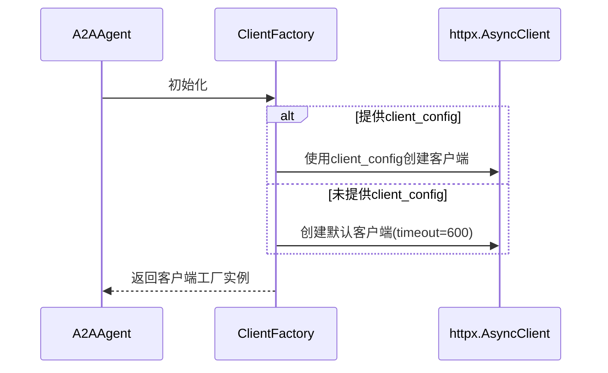
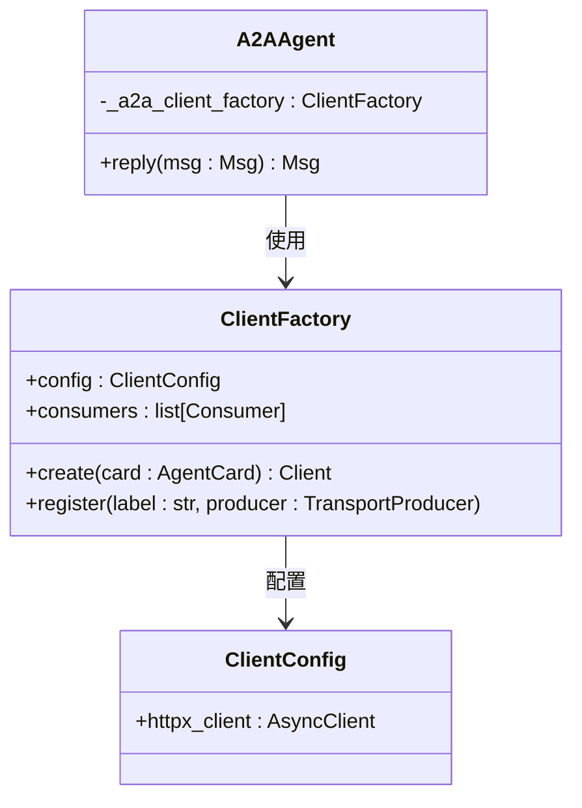

# 客户端配置

<cite>
**本文档中引用的文件**  
- [src\agentscope\agent\_a2a_agent.py](file://src\agentscope\agent\_a2a_agent.py)
- [src\agentscope\a2a\_well_known_resolver.py](file://src\agentscope\a2a\_well_known_resolver.py)
- [src\agentscope\mcp\_http_stateful_client.py](file://src\agentscope\mcp\_http_stateful_client.py)
- [src\agentscope\mcp\_http_stateless_client.py](file://src\agentscope\mcp\_http_stateless_client.py)
- [examples\agent\a2a_agent\main.py](file://examples\agent\a2a_agent\main.py)
- [examples\agent\a2a_agent\agent_card.py](file://examples\agent\a2a_agent\agent_card.py)
</cite>

## 目录
1. [引言](#引言)
2. [A2AAgent初始化与client_config参数](#a2aagent初始化与client_config参数)
3. [ClientConfig对象创建与HTTP超时设置](#clientconfig对象创建与http超时设置)
4. [ClientFactory工作机制分析](#clientfactory工作机制分析)
5. [默认客户端配置生成逻辑](#默认客户端配置生成逻辑)
6. [自定义客户端配置高级用例](#自定义客户端配置高级用例)
7. [总结](#总结)

## 引言
本文档深入解析AgentScope框架中A2AAgent初始化时的`client_config`参数配置机制。重点分析`ClientConfig`对象的创建过程、`httpx.AsyncClient`的超时设置（timeout=600）等网络参数配置方法，以及`ClientFactory`的内部工作机制。通过源码分析揭示当未提供`client_config`时默认HTTP客户端的生成逻辑，并提供自定义传输层行为的最佳实践。

## A2AAgent初始化与client_config参数
`A2AAgent`是AgentScope中实现A2A（Agent-to-Agent）协议的核心类，其初始化过程接受`client_config`作为关键参数之一，用于定制与远程代理通信的客户端行为。

在初始化过程中，`client_config`参数被传递给`ClientFactory`，用于创建与远程代理通信的HTTP客户端。该参数为可选类型，当未提供时，系统将创建具有默认配置的客户端。



**图示来源**  
- [src\agentscope\agent\_a2a_agent.py](file://src\agentscope\agent\_a2a_agent.py#L47-L111)

**本节来源**  
- [src\agentscope\agent\_a2a_agent.py](file://src\agentscope\agent\_a2a_agent.py#L47-L111)
- [examples\agent\a2a_agent\main.py](file://examples\agent\a2a_agent\main.py#L16-L18)

## ClientConfig对象创建与HTTP超时设置
`ClientConfig`对象用于配置A2A客户端的网络行为，其中最关键的是`httpx.AsyncClient`的超时设置。

当在`A2AAgent`初始化时未提供`client_config`参数，系统会自动创建一个默认的`ClientConfig`实例，其中包含一个`httpx.AsyncClient`，其超时设置为600秒：

```python
ClientConfig(
    httpx_client=httpx.AsyncClient(
        timeout=httpx.Timeout(timeout=600),
    ),
)
```

这一长超时设置（10分钟）是为了适应可能需要长时间处理的任务场景，确保在复杂任务执行过程中不会因网络超时而中断通信。

**本节来源**  
- [src\agentscope\agent\_a2a_agent.py](file://src\agentscope\agent\_a2a_agent.py#L92-L96)
- [src\agentscope\a2a\_well_known_resolver.py](file://src\agentscope\a2a\_well_known_resolver.py#L69-L71)

## ClientFactory工作机制分析
`ClientFactory`是A2A客户端创建的核心工厂类，负责根据配置创建和管理HTTP客户端实例。

其工作机制主要包括：
1. 接收`ClientConfig`配置对象
2. 根据配置创建`httpx.AsyncClient`实例
3. 管理消费者（consumers）用于拦截请求/响应流
4. 支持注册额外的传输生产者（transport producers）

`ClientFactory`在`A2AAgent`初始化时被创建，并在`reply()`方法调用时用于创建实际的客户端实例与远程代理通信。



**图示来源**  
- [src\agentscope\agent\_a2a_agent.py](file://src\agentscope\agent\_a2a_agent.py#L90-L98)
- [src\agentscope\agent\_a2a_agent.py](file://src\agentscope\agent\_a2a_agent.py#L225-L227)

**本节来源**  
- [src\agentscope\agent\_a2a_agent.py](file://src\agentscope\agent\_a2a_agent.py#L90-L98)

## 默认客户端配置生成逻辑
当`A2AAgent`初始化时未提供`client_config`参数，系统会自动生成默认配置，这一逻辑通过Python的`or`操作符实现：

```python
self._a2a_client_factory = ClientFactory(
    config=client_config
    or ClientConfig(
        httpx_client=httpx.AsyncClient(
            timeout=httpx.Timeout(timeout=600),
        ),
    ),
    consumers=consumers,
)
```

这种设计模式确保了：
- 如果用户提供了自定义`client_config`，则使用用户配置
- 如果用户未提供，则使用包含600秒超时的默认配置
- 配置过程对用户透明，保证了API的简洁性

类似的默认配置模式也出现在`_well_known_resolver.py`中，同样使用600秒超时。

**本节来源**  
- [src\agentscope\agent\_a2a_agent.py](file://src\agentscope\agent\_a2a_agent.py#L91-L96)
- [src\agentscope\a2a\_well_known_resolver.py](file://src\agentscope\a2a\_well_known_resolver.py#L69-L71)

## 自定义客户端配置高级用例
虽然默认配置适用于大多数场景，但`client_config`参数为高级用例提供了灵活的定制能力。

### 代理设置
可以通过在`httpx.AsyncClient`中配置代理来实现：

```python
client_config = ClientConfig(
    httpx_client=httpx.AsyncClient(
        proxies="http://proxy.example.com:8080",
        timeout=httpx.Timeout(timeout=600),
    ),
)
```

### 认证配置
可以在客户端中预置认证信息：

```python
client_config = ClientConfig(
    httpx_client=httpx.AsyncClient(
        headers={"Authorization": "Bearer token"},
        timeout=httpx.Timeout(timeout=600),
    ),
)
```

### 连接池管理
通过配置连接池参数优化性能：

```python
client_config = ClientConfig(
    httpx_client=httpx.AsyncClient(
        limits=httpx.Limits(max_connections=100, max_keepalive_connections=20),
        timeout=httpx.Timeout(timeout=600),
    ),
)
```

这些高级配置允许开发者根据具体部署环境和性能需求定制传输层行为。

**本节来源**  
- [src\agentscope\agent\_a2a_agent.py](file://src\agentscope\agent\_a2a_agent.py#L91-L96)
- [src\agentscope\mcp\_http_stateful_client.py](file://src\agentscope\mcp\_http_stateful_client.py#L37-L38)
- [src\agentscope\mcp\_http_stateless_client.py](file://src\agentscope\mcp\_http_stateless_client.py#L35-L36)

## 总结
本文档深入分析了AgentScope中A2AAgent的`client_config`参数配置机制。核心要点包括：
- `client_config`参数用于定制A2A客户端的网络行为
- 默认配置包含600秒的长超时设置，适应复杂任务场景
- `ClientFactory`作为工厂类负责客户端的创建和管理
- 当未提供`client_config`时，系统自动生成默认配置
- 支持通过自定义`ClientConfig`实现代理、认证和连接池等高级配置

这些机制共同确保了A2A通信的灵活性、可靠性和可扩展性。