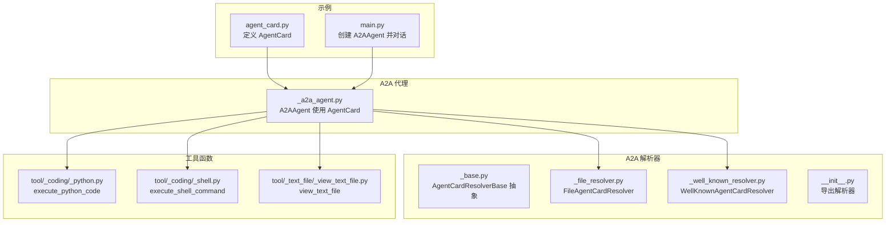
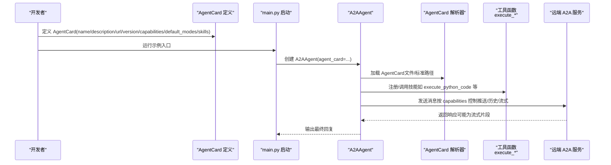
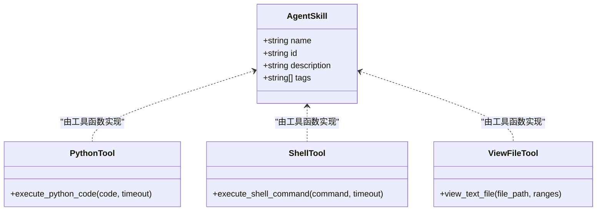
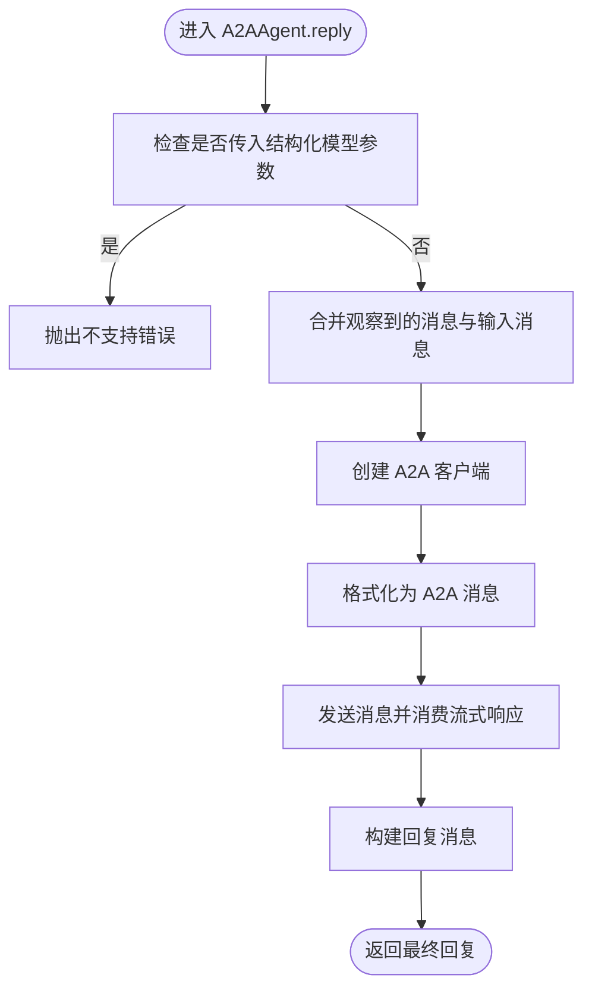
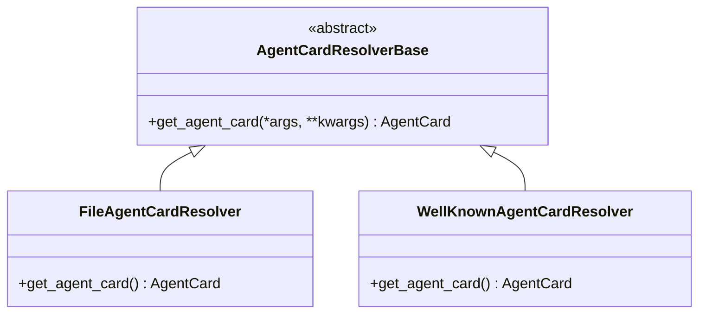
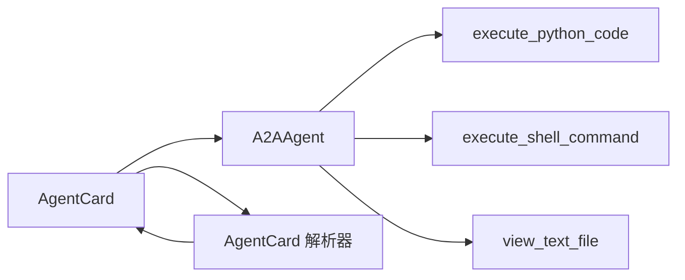

# 智能体卡片配置

<cite>
**本文引用的文件**
- [examples/agent/a2a_agent/agent_card.py](file://examples/agent/a2a_agent/agent_card.py)
- [examples/agent/a2a_agent/main.py](file://examples/agent/a2a_agent/main.py)
- [src/agentscope/a2a/_base.py](file://src/agentscope/a2a/_base.py)
- [src/agentscope/a2a/_file_resolver.py](file://src/agentscope/a2a/_file_resolver.py)
- [src/agentscope/a2a/_well_known_resolver.py](file://src/agentscope/a2a/_well_known_resolver.py)
- [src/agentscope/a2a/__init__.py](file://src/agentscope/a2a/__init__.py)
- [src/agentscope/agent/_a2a_agent.py](file://src/agentscope/agent/_a2a_agent.py)
- [src/agentscope/tool/_coding/_python.py](file://src/agentscope/tool/_coding/_python.py)
- [src/agentscope/tool/_coding/_shell.py](file://src/agentscope/tool/_coding/_shell.py)
- [src/agentscope/tool/_text_file/_view_text_file.py](file://src/agentscope/tool/_text_file/_view_text_file.py)
- [tests/a2a_resolver_test.py](file://tests/a2a_resolver_test.py)
- [tests/a2a_agent_test.py](file://tests/a2a_agent_test.py)
- [docs/tutorial/en/src/task_a2a.py](file://docs/tutorial/en/src/task_a2a.py)
</cite>

## 目录
1. [简介](#简介)
2. [项目结构](#项目结构)
3. [核心组件](#核心组件)
4. [架构总览](#架构总览)
5. [详细组件分析](#详细组件分析)
6. [依赖关系分析](#依赖关系分析)
7. [性能考量](#性能考量)
8. [故障排查指南](#故障排查指南)
9. [结论](#结论)
10. [附录](#附录)

## 简介
本文件面向需要在 AgentScope 中定义与配置 A2A 智能体的开发者，系统性说明如何构建 AgentCard，包括 name、description、url、version 等核心字段；解释 capabilities 中 push_notifications、state_transition_history、streaming 的语义与使用场景；给出 default_input_modes 与 default_output_modes 的 MIME 类型配置规范；并重点解析 skills 列表中 AgentSkill 的定义方式，结合 execute_python_code、execute_shell_command、view_text_file 等工具函数进行说明。最后提供完整的 AgentCard 配置最佳实践与常见问题排查清单。

## 项目结构
围绕 A2A 智能体卡片，相关代码分布在以下模块：
- 示例：examples/agent/a2a_agent 提供了本地 AgentCard 定义与运行示例
- A2A 解析器：src/agentscope/a2a 提供从文件、标准路径等来源加载 AgentCard 的能力
- A2A 代理：src/agentscope/agent/_a2a_agent.py 将 AgentCard 用于远程交互
- 工具函数：src/agentscope/tool 下的 _coding 与 _text_file 提供可注册为 AgentSkill 的工具
- 测试用例：tests/a2a_resolver_test.py 与 tests/a2a_agent_test.py 展示了 AgentCard 的典型配置与行为验证

图表来源
- [examples/agent/a2a_agent/agent_card.py](file://examples/agent/a2a_agent/agent_card.py#L1-L38)
- [examples/agent/a2a_agent/main.py](file://examples/agent/a2a_agent/main.py#L1-L29)
- [src/agentscope/a2a/_base.py](file://src/agentscope/a2a/_base.py#L1-L26)
- [src/agentscope/a2a/_file_resolver.py](file://src/agentscope/a2a/_file_resolver.py#L1-L47)
- [src/agentscope/a2a/_well_known_resolver.py](file://src/agentscope/a2a/_well_known_resolver.py#L42-L77)
- [src/agentscope/a2a/__init__.py](file://src/agentscope/a2a/__init__.py#L1-L15)
- [src/agentscope/agent/_a2a_agent.py](file://src/agentscope/agent/_a2a_agent.py#L38-L120)
- [src/agentscope/tool/_coding/_python.py](file://src/agentscope/tool/_coding/_python.py#L1-L91)
- [src/agentscope/tool/_coding/_shell.py](file://src/agentscope/tool/_coding/_shell.py#L1-L78)
- [src/agentscope/tool/_text_file/_view_text_file.py](file://src/agentscope/tool/_text_file/_view_text_file.py#L1-L82)

章节来源
- [examples/agent/a2a_agent/agent_card.py](file://examples/agent/a2a_agent/agent_card.py#L1-L38)
- [examples/agent/a2a_agent/main.py](file://examples/agent/a2a_agent/main.py#L1-L29)
- [src/agentscope/a2a/_file_resolver.py](file://src/agentscope/a2a/_file_resolver.py#L1-L47)
- [src/agentscope/a2a/_well_known_resolver.py](file://src/agentscope/a2a/_well_known_resolver.py#L42-L77)
- [src/agentscope/agent/_a2a_agent.py](file://src/agentscope/agent/_a2a_agent.py#L38-L120)

## 核心组件
- AgentCard：描述远程智能体的基本信息与能力，包括 name、description、url、version、capabilities、default_input_modes、default_output_modes、skills 等字段
- AgentCapabilities：声明智能体支持的能力开关，如 push_notifications、state_transition_history、streaming
- AgentSkill：声明智能体具备的技能，包含 name、id、description、tags 等
- A2AAgent：基于 AgentCard 建立与远端服务的连接，负责消息格式化与流式传输
- AgentCard 解析器：从文件或标准路径加载 AgentCard，便于部署与分发

章节来源
- [examples/agent/a2a_agent/agent_card.py](file://examples/agent/a2a_agent/agent_card.py#L1-L38)
- [src/agentscope/a2a/_base.py](file://src/agentscope/a2a/_base.py#L1-L26)
- [src/agentscope/a2a/_file_resolver.py](file://src/agentscope/a2a/_file_resolver.py#L1-L47)
- [src/agentscope/a2a/_well_known_resolver.py](file://src/agentscope/a2a/_well_known_resolver.py#L42-L77)
- [src/agentscope/agent/_a2a_agent.py](file://src/agentscope/agent/_a2a_agent.py#L38-L120)

## 架构总览
下图展示了从定义 AgentCard 到运行 A2AAgent 的整体流程，以及工具函数如何被注册为 AgentSkill 参与到智能体能力中。

图表来源
- [examples/agent/a2a_agent/agent_card.py](file://examples/agent/a2a_agent/agent_card.py#L1-L38)
- [examples/agent/a2a_agent/main.py](file://examples/agent/a2a_agent/main.py#L1-L29)
- [src/agentscope/agent/_a2a_agent.py](file://src/agentscope/agent/_a2a_agent.py#L38-L120)
- [src/agentscope/a2a/_file_resolver.py](file://src/agentscope/a2a/_file_resolver.py#L1-L47)
- [src/agentscope/a2a/_well_known_resolver.py](file://src/agentscope/a2a/_well_known_resolver.py#L42-L77)
- [src/agentscope/tool/_coding/_python.py](file://src/agentscope/tool/_coding/_python.py#L1-L91)
- [src/agentscope/tool/_coding/_shell.py](file://src/agentscope/tool/_coding/_shell.py#L1-L78)
- [src/agentscope/tool/_text_file/_view_text_file.py](file://src/agentscope/tool/_text_file/_view_text_file.py#L1-L82)

## 详细组件分析

### AgentCard 字段与配置要点
- name：智能体名称，用于标识与显示
- description：智能体描述，帮助用户理解其用途
- url：远端 A2A 服务地址，A2AAgent 将通过该地址建立连接
- version：智能体版本号，便于追踪与兼容性管理
- capabilities：能力开关集合
  - push_notifications：是否允许服务端主动推送通知
  - state_transition_history：是否保留状态转换历史以便回放或调试
  - streaming：是否支持流式输出，提升交互体验
- default_input_modes / default_output_modes：MIME 类型数组，声明默认支持的输入/输出媒体类型
- skills：技能列表，每个元素为 AgentSkill，包含 name、id、description、tags

章节来源
- [examples/agent/a2a_agent/agent_card.py](file://examples/agent/a2a_agent/agent_card.py#L1-L38)
- [docs/tutorial/en/src/task_a2a.py](file://docs/tutorial/en/src/task_a2a.py#L60-L77)
- [src/agentscope/a2a/_file_resolver.py](file://src/agentscope/a2a/_file_resolver.py#L15-L47)

### capabilities 能力详解与使用场景
- push_notifications
  - 语义：服务端是否可以向客户端推送事件或通知
  - 使用场景：当智能体需要实时告知外部状态变化（如任务进度、异常告警）时启用
- state_transition_history
  - 语义：是否记录与回放状态转换历史
  - 使用场景：调试与审计，便于复盘对话上下文与决策过程
- streaming
  - 语义：是否以流式方式返回结果
  - 使用场景：长文本生成、逐步输出中间结果，改善用户体验

章节来源
- [examples/agent/a2a_agent/agent_card.py](file://examples/agent/a2a_agent/agent_card.py#L10-L14)
- [src/agentscope/agent/_a2a_agent.py](file://src/agentscope/agent/_a2a_agent.py#L201-L237)

### default_input_modes 与 default_output_modes 的 MIME 类型配置规范
- 规范
  - 两者均为字符串数组，表示默认支持的媒体类型
  - 常见取值示例：text/plain、text/markdown、application/json 等
  - 若未显式声明，A2AAgent 将依据 AgentCard 的默认模式进行消息格式化与传输
- 配置建议
  - 明确声明所有期望的输入/输出类型，避免歧义
  - 与实际工具函数支持的媒体类型保持一致，减少转换开销

章节来源
- [examples/agent/a2a_agent/agent_card.py](file://examples/agent/a2a_agent/agent_card.py#L15-L16)
- [docs/tutorial/en/src/task_a2a.py](file://docs/tutorial/en/src/task_a2a.py#L73-L74)
- [src/agentscope/a2a/_file_resolver.py](file://src/agentscope/a2a/_file_resolver.py#L21-L28)

### skills 列表与 AgentSkill 定义
- AgentSkill 字段
  - name：技能展示名称
  - id：技能唯一标识，需与工具函数注册时使用的 ID 保持一致
  - description：技能功能说明
  - tags：技能标签，便于分类检索与权限控制
- 示例技能
  - execute_python_code：执行 Python 代码片段，返回返回码、标准输出与标准错误
  - execute_shell_command：在服务器上执行 Shell 命令，返回返回码、标准输出与标准错误
  - view_text_file：查看服务器上的文本文件内容，支持范围读取
- 注册方式
  - 在 A2AAgent 初始化后，可通过工具注册机制将上述函数注册为 AgentSkill，使智能体具备相应能力

图表来源
- [examples/agent/a2a_agent/agent_card.py](file://examples/agent/a2a_agent/agent_card.py#L17-L36)
- [src/agentscope/tool/_coding/_python.py](file://src/agentscope/tool/_coding/_python.py#L1-L91)
- [src/agentscope/tool/_coding/_shell.py](file://src/agentscope/tool/_coding/_shell.py#L1-L78)
- [src/agentscope/tool/_text_file/_view_text_file.py](file://src/agentscope/tool/_text_file/_view_text_file.py#L1-L82)

章节来源
- [examples/agent/a2a_agent/agent_card.py](file://examples/agent/a2a_agent/agent_card.py#L17-L36)
- [src/agentscope/tool/_coding/_python.py](file://src/agentscope/tool/_coding/_python.py#L1-L91)
- [src/agentscope/tool/_coding/_shell.py](file://src/agentscope/tool/_coding/_shell.py#L1-L78)
- [src/agentscope/tool/_text_file/_view_text_file.py](file://src/agentscope/tool/_text_file/_view_text_file.py#L1-L82)

### A2AAgent 与 AgentCard 的交互流程
- 初始化校验：确保传入对象为 AgentCard 实例
- 名称与卡片：保存 name 与 agent_card
- 客户端工厂：根据 ClientConfig 创建异步客户端，支持超时与消费者扩展
- 消息处理：合并观察到的消息与输入消息，格式化为 A2A 消息，逐条消费流式响应
- 结构化输出限制：A2A 协议不支持结构化输出，A2AAgent.reply() 中会显式拒绝该参数

图表来源
- [src/agentscope/agent/_a2a_agent.py](file://src/agentscope/agent/_a2a_agent.py#L201-L237)

章节来源
- [src/agentscope/agent/_a2a_agent.py](file://src/agentscope/agent/_a2a_agent.py#L38-L120)
- [src/agentscope/agent/_a2a_agent.py](file://src/agentscope/agent/_a2a_agent.py#L201-L237)

### AgentCard 解析器与加载策略
- 文件解析器：从 JSON 文件加载 AgentCard，要求包含 name、url、version、capabilities、default_input_modes、default_output_modes、skills 等字段
- 标准路径解析器：从远端服务的标准路径（well-known）拉取 AgentCard
- 抽象基类：统一解析器接口，便于扩展其他来源（如 Nacos）

图表来源
- [src/agentscope/a2a/_base.py](file://src/agentscope/a2a/_base.py#L1-L26)
- [src/agentscope/a2a/_file_resolver.py](file://src/agentscope/a2a/_file_resolver.py#L1-L47)
- [src/agentscope/a2a/_well_known_resolver.py](file://src/agentscope/a2a/_well_known_resolver.py#L42-L77)
- [src/agentscope/a2a/__init__.py](file://src/agentscope/a2a/__init__.py#L1-L15)

章节来源
- [src/agentscope/a2a/_file_resolver.py](file://src/agentscope/a2a/_file_resolver.py#L1-L47)
- [src/agentscope/a2a/_well_known_resolver.py](file://src/agentscope/a2a/_well_known_resolver.py#L42-L77)
- [src/agentscope/a2a/__init__.py](file://src/agentscope/a2a/__init__.py#L1-L15)

## 依赖关系分析
- A2AAgent 依赖 AgentCard 的 capabilities 与 default_modes 决定消息格式化与流式行为
- 工具函数（Python 执行、Shell 执行、文件查看）作为 AgentSkill 的实现，需与 AgentCard 中的 skills 一一对应
- 解析器模块负责将静态或远程的 AgentCard 转换为运行时可用的对象

图表来源
- [examples/agent/a2a_agent/agent_card.py](file://examples/agent/a2a_agent/agent_card.py#L1-L38)
- [src/agentscope/agent/_a2a_agent.py](file://src/agentscope/agent/_a2a_agent.py#L38-L120)
- [src/agentscope/a2a/_file_resolver.py](file://src/agentscope/a2a/_file_resolver.py#L1-L47)
- [src/agentscope/a2a/_well_known_resolver.py](file://src/agentscope/a2a/_well_known_resolver.py#L42-L77)
- [src/agentscope/tool/_coding/_python.py](file://src/agentscope/tool/_coding/_python.py#L1-L91)
- [src/agentscope/tool/_coding/_shell.py](file://src/agentscope/tool/_coding/_shell.py#L1-L78)
- [src/agentscope/tool/_text_file/_view_text_file.py](file://src/agentscope/tool/_text_file/_view_text_file.py#L1-L82)

章节来源
- [examples/agent/a2a_agent/agent_card.py](file://examples/agent/a2a_agent/agent_card.py#L1-L38)
- [src/agentscope/agent/_a2a_agent.py](file://src/agentscope/agent/_a2a_agent.py#L38-L120)
- [src/agentscope/a2a/_file_resolver.py](file://src/agentscope/a2a/_file_resolver.py#L1-L47)
- [src/agentscope/a2a/_well_known_resolver.py](file://src/agentscope/a2a/_well_known_resolver.py#L42-L77)

## 性能考量
- 流式输出（streaming=True）可显著降低首字节延迟，但需注意网络抖动与缓冲区大小对稳定性的影响
- 超时控制：工具函数（Python 执行、Shell 执行）均支持超时参数，建议根据任务复杂度合理设置
- 输入/输出 MIME 类型应尽量收敛，减少不必要的格式转换与编码开销
- 状态历史（state_transition_history）有助于调试，但在高并发场景下会增加存储与序列化成本

[本节为通用指导，无需列出具体文件来源]

## 故障排查指南
- AgentCard 字段缺失
  - 现象：解析器报错或运行时报缺少关键字段
  - 排查：确认 JSON 文件包含 name、url、version、capabilities、default_input_modes、default_output_modes、skills
  - 参考：文件解析器注释中对必需字段的说明
- URL 格式错误
  - 现象：标准路径解析器抛出无效 URL 错误
  - 排查：检查 base_url 是否包含 scheme 与 netloc
- 结构化输出不支持
  - 现象：调用 A2AAgent.reply() 时传入结构化模型参数抛出异常
  - 处理：移除该参数或改用支持结构化输出的代理类型
- 工具函数未注册为技能
  - 现象：AgentSkill id 与工具函数不匹配导致无法调用
  - 处理：确保 AgentCard.skills 中的 id 与工具函数注册时使用的 ID 一致
- 文件访问失败
  - 现象：view_text_file 返回“文件不存在”或“路径不是文件”
  - 处理：确认 file_path 存在且为文件，ranges 参数合法

章节来源
- [src/agentscope/a2a/_file_resolver.py](file://src/agentscope/a2a/_file_resolver.py#L15-L47)
- [src/agentscope/a2a/_well_known_resolver.py](file://src/agentscope/a2a/_well_known_resolver.py#L42-L77)
- [src/agentscope/agent/_a2a_agent.py](file://src/agentscope/agent/_a2a_agent.py#L201-L237)
- [tests/a2a_resolver_test.py](file://tests/a2a_resolver_test.py#L1-L38)
- [src/agentscope/tool/_text_file/_view_text_file.py](file://src/agentscope/tool/_text_file/_view_text_file.py#L1-L82)

## 结论
通过规范化的 AgentCard 定义与合理的 capabilities 配置，可以清晰地表达智能体的能力边界与交互特性。配合 MIME 类型与技能列表的标准化，能够有效提升跨平台互操作性与可维护性。在实际部署中，建议优先启用 streaming 以优化用户体验，并谨慎使用 push_notifications 与 state_transition_history 以平衡功能与性能。

[本节为总结性内容，无需列出具体文件来源]

## 附录

### 最佳实践清单
- 字段完整性：确保 name、description、url、version、capabilities、default_input_modes、default_output_modes、skills 全部配置
- 能力开关：仅启用必要的 capabilities，避免过度消耗资源
- MIME 类型：与工具函数能力保持一致，减少格式转换
- 技能命名：AgentSkill.id 与工具函数注册 ID 严格一致
- 解析器选择：开发阶段使用文件解析器，生产环境使用标准路径解析器
- 超时与安全：为工具函数设置合理超时，必要时添加鉴权与白名单

[本节为通用指导，无需列出具体文件来源]