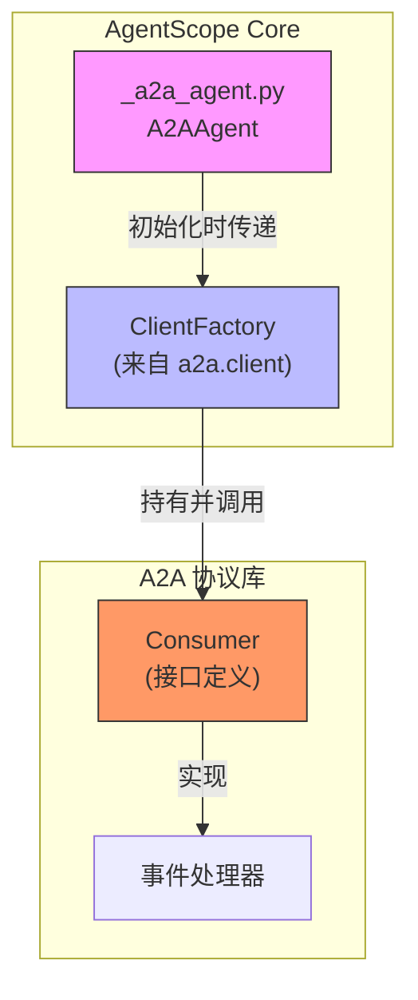
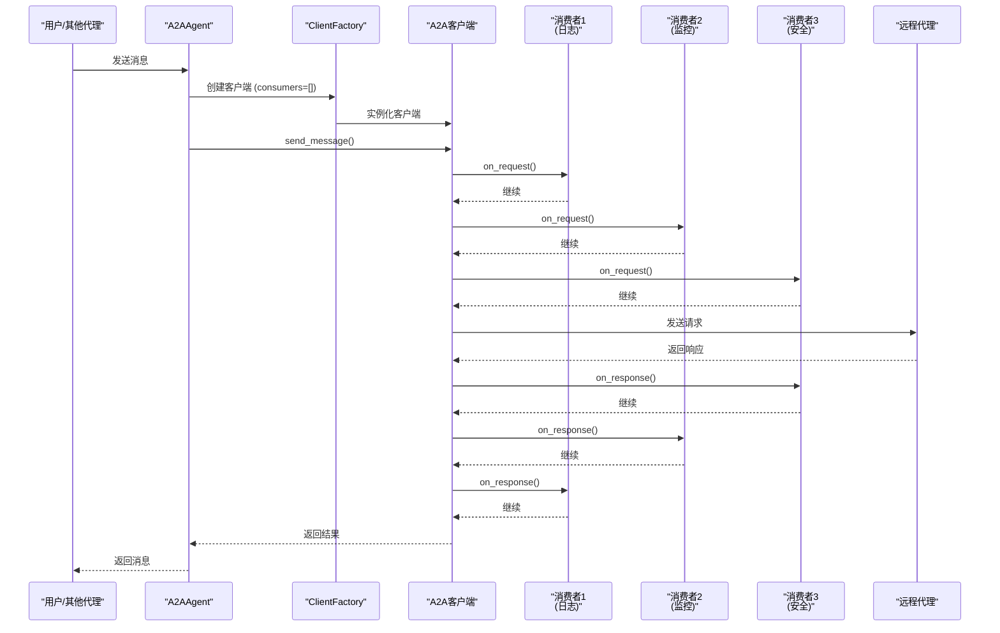
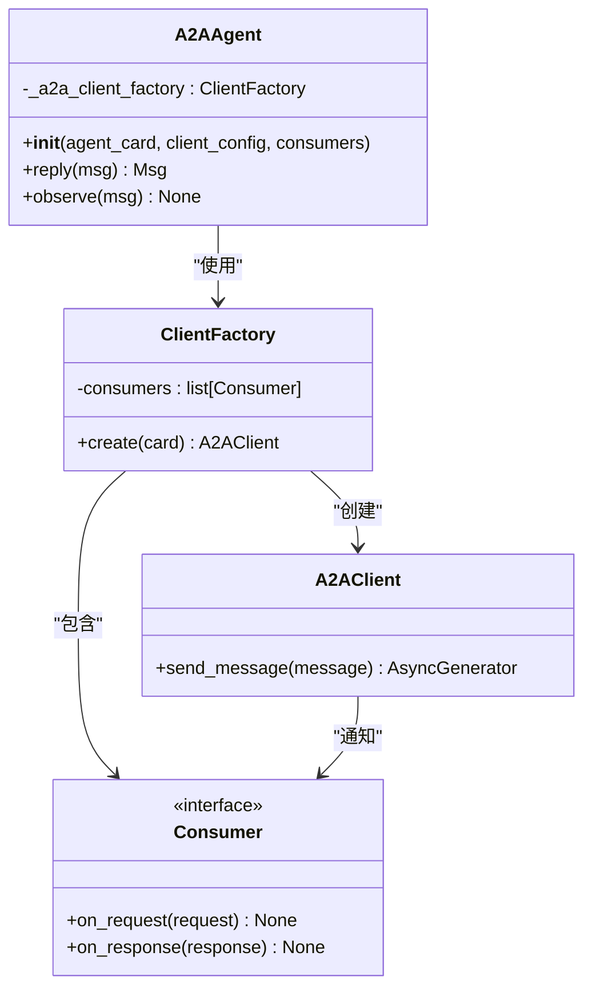
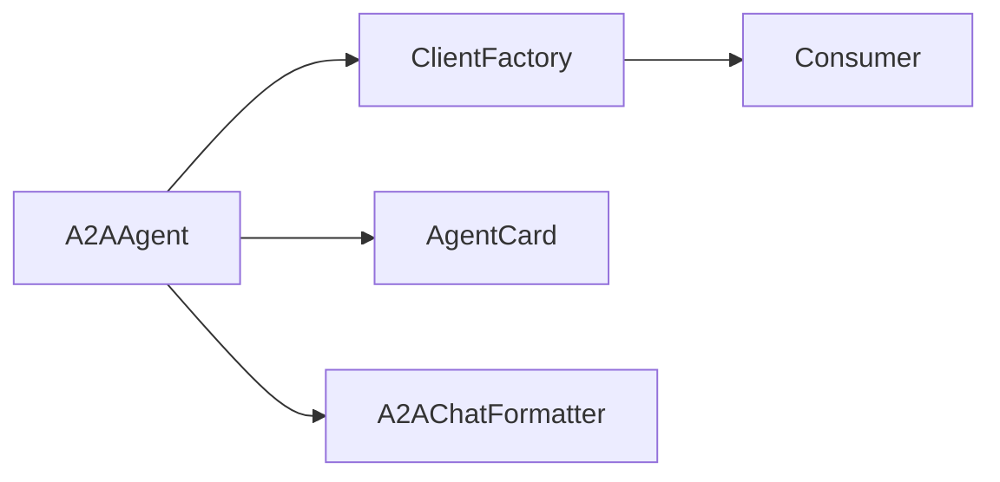

# 消费者拦截机制

<cite>
**本文档中引用的文件**  
- [A2AAgent.py](file://src/agentscope/agent/_a2a_agent.py)
- [ClientFactory.py](file://src/a2a/client.py)
- [Consumer.py](file://src/a2a/types.py)
</cite>

## 目录
1. [介绍](#介绍)
2. [项目结构](#项目结构)
3. [核心组件](#核心组件)
4. [架构概述](#架构概述)
5. [详细组件分析](#详细组件分析)
6. [依赖分析](#依赖分析)
7. [性能考虑](#性能考虑)
8. [故障排除指南](#故障排除指南)
9. [结论](#结论)
10. [附录](#附录)（如有必要）

## 介绍
本文档全面阐述了A2AAgent中consumers参数的拦截机制和扩展功能。消费者机制在A2A（Agent-to-Agent）通信中扮演着关键角色，通过在请求/响应流中插入自定义逻辑，实现了日志记录、性能指标收集和安全检查等横切关注点的统一处理。该机制允许开发者在不修改核心通信逻辑的情况下，灵活地扩展系统功能。文档将深入分析consumers列表的注册过程和执行顺序，解释其在ClientFactory中的集成方式，并提供自定义Consumer的开发指南。通过实际用例，展示如何利用这一机制实现请求审计、速率限制和数据脱敏等高级功能，为构建可观察、可监控和安全的多智能体系统提供坚实基础。

## 项目结构
A2AAgent的消费者机制主要分布在`src/agentscope/agent/`和`src/a2a/`目录下。核心实现位于`_a2a_agent.py`文件中，其中`A2AAgent`类通过`ClientFactory`集成消费者列表。`ClientFactory`来自外部的`a2a`库，负责创建A2A客户端并管理消费者链。消费者本身是符合特定接口的可调用对象，它们在客户端发送和接收消息的过程中被依次调用。这种设计遵循了关注点分离原则，将通信协议处理与横切关注点（如日志、监控）解耦，使得系统既保持了核心逻辑的简洁性，又具备了强大的可扩展性。

**Diagram sources**
- [A2AAgent.py](file://src/agentscope/agent/_a2a_agent.py)
- [ClientFactory.py](file://src/a2a/client.py)

**Section sources**
- [A2AAgent.py](file://src/agentscope/agent/_a2a_agent.py)
- [ClientFactory.py](file://src/a2a/client.py)

## 核心组件
`A2AAgent`的核心在于其通过`consumers`参数实现的拦截机制。当`A2AAgent`被初始化时，传入的`consumers`列表会被传递给`ClientFactory`。这个列表中的每个`Consumer`对象都是一个事件处理器，它们会在A2A客户端的生命周期中被触发。`Consumer`可以监听诸如`on_request`、`on_response`等事件，在请求发送前或响应接收后执行自定义逻辑。这种设计模式类似于中间件或拦截器，使得日志记录、性能监控、安全验证等功能可以以非侵入式的方式被“编织”到通信流程中。`A2AAgent`本身不直接处理这些横切关注点，而是完全依赖`ClientFactory`和`consumers`来完成，这保证了其职责的单一性。

**Section sources**
- [A2AAgent.py](file://src/agentscope/agent/_a2a_agent.py)

## 架构概述
A2AAgent的消费者拦截机制采用了一种分层的架构设计。在顶层，`A2AAgent`作为应用层的代理，负责与AgentScope框架的其他部分交互。在底层，`ClientFactory`和`A2A客户端`负责处理底层的网络通信和协议细节。`consumers`列表则构成了中间层，即拦截层。当`A2AAgent`调用`reply()`方法时，它会通过`_a2a_client_factory`创建一个客户端实例。这个客户端实例在内部维护着一个由`consumers`组成的处理链。在消息发送和接收的关键节点，客户端会遍历这个处理链，依次调用每个`Consumer`的相应方法。这种架构清晰地分离了业务逻辑、通信逻辑和横切关注点，使得系统易于维护和扩展。

**Diagram sources**
- [A2AAgent.py](file://src/agentscope/agent/_a2a_agent.py)
- [ClientFactory.py](file://src/a2a/client.py)

## 详细组件分析
### A2AAgent 分析
`A2AAgent`类是消费者机制的入口点。其`__init__`方法接受一个可选的`consumers`参数，该参数是一个`Consumer`对象的列表。在初始化过程中，`A2AAgent`会创建一个`ClientFactory`实例，并将`consumers`列表作为参数传递给它。这使得`ClientFactory`能够在创建任何A2A客户端时，都为其配备相同的消费者链。`A2AAgent`的`reply()`方法是触发整个流程的关键。它首先合并观察到的消息和输入消息，然后通过`_a2a_client_factory.create()`创建一个客户端，最后调用客户端的`send_message`方法。从这一刻起，控制权就移交给了`ClientFactory`和`consumers`。

#### 对于 API/服务组件：

**Diagram sources**
- [A2AAgent.py](file://src/agentscope/agent/_a2a_agent.py)
- [ClientFactory.py](file://src/a2a/client.py)

**Section sources**
- [A2AAgent.py](file://src/agentscope/agent/_a2a_agent.py)

### 自定义消费者开发指南
开发自定义`Consumer`需要实现`Consumer`接口，该接口定义了`on_request`和`on_response`等方法。开发者可以创建一个类，继承自`Consumer`基类或直接实现其方法。在`on_request`方法中，可以访问即将发送的请求对象，适合进行请求日志记录、数据脱敏（如过滤敏感信息）、请求计数和速率限制检查。在`on_response`方法中，可以访问收到的响应对象，适合进行响应日志记录、性能指标（如延迟）收集和安全审计。最佳实践包括：保持消费者逻辑轻量，避免阻塞操作；妥善处理异常，确保一个消费者的失败不会影响整个链；使用结构化日志记录以便于分析；以及通过配置来启用或禁用特定的消费者。

**Section sources**
- [Consumer.py](file://src/a2a/types.py)

## 依赖分析
`A2AAgent`对`a2a`库有直接依赖，特别是`ClientConfig`、`ClientFactory`和`Consumer`类型。`ClientFactory`是连接`A2AAgent`和`consumers`的桥梁。`A2AAgent`通过`ClientFactory`间接依赖于所有注册的`Consumer`。这种依赖关系是松散的，因为`A2AAgent`并不关心`Consumer`的具体实现，只关心它们符合预期的接口。这使得系统具有很高的灵活性，可以轻松地添加、移除或替换不同的消费者，而无需修改`A2AAgent`的代码。

**Diagram sources**
- [A2AAgent.py](file://src/agentscope/agent/_a2a_agent.py)
- [ClientFactory.py](file://src/a2a/client.py)

**Section sources**
- [A2AAgent.py](file://src/agentscope/agent/_a2a_agent.py)

## 性能考虑
消费者拦截机制对性能的影响是双重的。一方面，每个`Consumer`的执行都会增加一定的开销，尤其是在处理高并发请求时，多个消费者依次执行可能会成为性能瓶颈。因此，应确保消费者内部的逻辑尽可能高效，避免复杂的计算或I/O操作。另一方面，该机制为性能监控提供了绝佳的切入点。通过在`on_request`和`on_response`中记录时间戳，可以精确计算出每个请求的端到端延迟，并将这些指标上报到监控系统。此外，可以在消费者中实现缓存逻辑，对重复请求进行拦截和响应，从而显著提升系统性能。

## 故障排除指南
在使用消费者机制时，常见的问题包括：消费者未被调用，这通常是由于在`A2AAgent`初始化时未正确传递`consumers`列表；消费者抛出异常导致整个请求失败，这要求在消费者内部做好异常捕获和处理；以及消费者执行顺序不符合预期。为了排查这些问题，应首先检查`A2AAgent`的初始化代码，确认`consumers`参数被正确设置。其次，为每个消费者添加详细的日志记录，以跟踪其执行流程。最后，理解`consumers`列表的顺序决定了它们的执行顺序，这对于有依赖关系的消费者（如先日志后监控）至关重要。

**Section sources**
- [A2AAgent.py](file://src/agentscope/agent/_a2a_agent.py)

## 结论
A2AAgent的消费者拦截机制是一个强大而灵活的设计，它通过将横切关注点从核心业务逻辑中分离出来，极大地提升了系统的可维护性和可扩展性。通过`consumers`参数，开发者可以轻松地为A2A通信添加日志、监控、安全等非功能性需求。该机制基于清晰的分层架构和松散的依赖关系，遵循了良好的软件工程实践。未来，可以进一步探索异步消费者、消费者优先级和动态消费者注册等高级特性，以满足更复杂的场景需求。