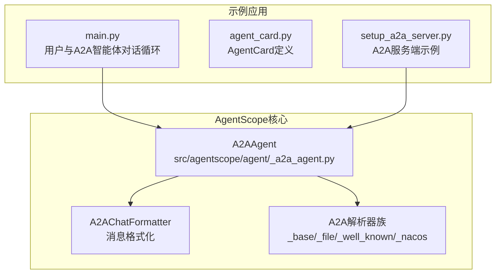
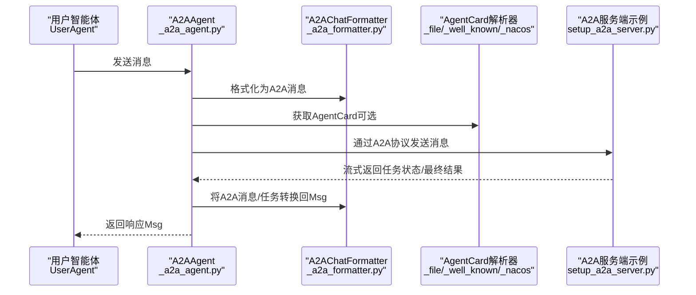
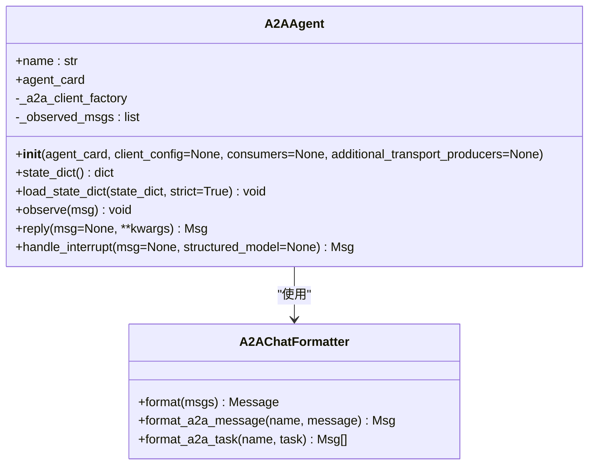
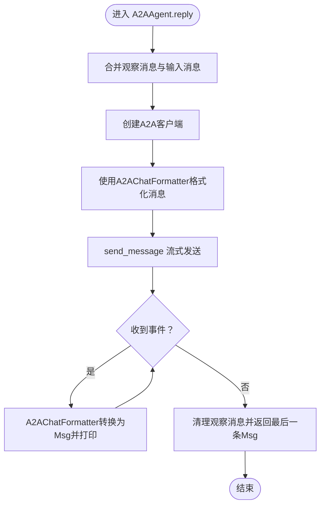
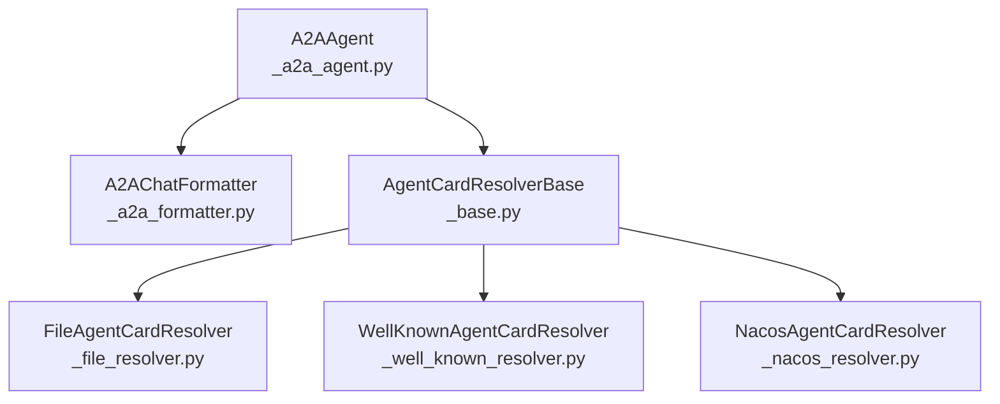

# 部署与配置

<cite>
**本文引用的文件列表**
- [examples/agent/a2a_agent/main.py](file://examples/agent/a2a_agent/main.py)
- [examples/agent/a2a_agent/agent_card.py](file://examples/agent/a2a_agent/agent_card.py)
- [examples/agent/a2a_agent/setup_a2a_server.py](file://examples/agent/a2a_agent/setup_a2a_server.py)
- [src/agentscope/agent/_a2a_agent.py](file://src/agentscope/agent/_a2a_agent.py)
- [src/agentscope/formatter/_a2a_formatter.py](file://src/agentscope/formatter/_a2a_formatter.py)
- [src/agentscope/a2a/__init__.py](file://src/agentscope/a2a/__init__.py)
- [src/agentscope/a2a/_base.py](file://src/agentscope/a2a/_base.py)
- [src/agentscope/a2a/_file_resolver.py](file://src/agentscope/a2a/_file_resolver.py)
- [src/agentscope/a2a/_well_known_resolver.py](file://src/agentscope/a2a/_well_known_resolver.py)
- [src/agentscope/a2a/_nacos_resolver.py](file://src/agentscope/a2a/_nacos_resolver.py)
</cite>

## 目录
1. [简介](#简介)
2. [项目结构](#项目结构)
3. [核心组件](#核心组件)
4. [架构总览](#架构总览)
5. [详细组件分析](#详细组件分析)
6. [依赖关系分析](#依赖关系分析)
7. [性能与可用性考虑](#性能与可用性考虑)
8. [故障排查指南](#故障排查指南)
9. [结论](#结论)
10. [附录：部署与配置清单](#附录部署与配置清单)

## 简介
本指南围绕 A2A 智能体的部署与配置展开，重点说明：
- 如何通过 AgentCard 配置远程智能体的 URL、名称与能力等元数据；
- 在 A2AAgent 初始化时传入 client_config 进行客户端配置；
- consumers 参数在请求/响应流中的拦截机制（日志、指标、安全）；
- 如何通过 additional_transport_producers 扩展传输协议支持；
- 结合 main.py 示例，展示用户智能体与 A2A 智能体之间的对话循环；
- 通过 agent_card.py 定义智能体卡片信息。

## 项目结构
A2A 示例位于 examples/agent/a2a_agent，包含：
- agent_card.py：定义远程智能体的 AgentCard（名称、URL、能力、技能等）
- main.py：用户智能体与 A2A 智能体的对话循环入口
- setup_a2a_server.py：本地 A2A 服务端示例（ReActAgent + 流式事件）

图表来源
- [examples/agent/a2a_agent/main.py](file://examples/agent/a2a_agent/main.py#L1-L29)
- [examples/agent/a2a_agent/agent_card.py](file://examples/agent/a2a_agent/agent_card.py#L1-L38)
- [examples/agent/a2a_agent/setup_a2a_server.py](file://examples/agent/a2a_agent/setup_a2a_server.py#L1-L132)
- [src/agentscope/agent/_a2a_agent.py](file://src/agentscope/agent/_a2a_agent.py#L1-L289)
- [src/agentscope/formatter/_a2a_formatter.py](file://src/agentscope/formatter/_a2a_formatter.py#L1-L365)
- [src/agentscope/a2a/__init__.py](file://src/agentscope/a2a/__init__.py#L1-L15)

章节来源
- [examples/agent/a2a_agent/main.py](file://examples/agent/a2a_agent/main.py#L1-L29)
- [examples/agent/a2a_agent/agent_card.py](file://examples/agent/a2a_agent/agent_card.py#L1-L38)
- [examples/agent/a2a_agent/setup_a2a_server.py](file://examples/agent/a2a_agent/setup_a2a_server.py#L1-L132)
- [src/agentscope/agent/_a2a_agent.py](file://src/agentscope/agent/_a2a_agent.py#L1-L289)
- [src/agentscope/formatter/_a2a_formatter.py](file://src/agentscope/formatter/_a2a_formatter.py#L1-L365)
- [src/agentscope/a2a/__init__.py](file://src/agentscope/a2a/__init__.py#L1-L15)

## 核心组件
- A2AAgent：负责与远程 A2A 智能体通信，支持消息格式化、任务状态流转、观察消息合并与中断处理。
- A2AChatFormatter：负责将 AgentScope 的 Msg 对象与 A2A 的 Message/Task 对象互转。
- AgentCard 解析器族：从文件、Well-Known URL 或 Nacos 动态发现 AgentCard。
- 示例 AgentCard：定义远程智能体的名称、URL、版本、能力、默认输入输出模式与技能集合。

章节来源
- [src/agentscope/agent/_a2a_agent.py](file://src/agentscope/agent/_a2a_agent.py#L1-L289)
- [src/agentscope/formatter/_a2a_formatter.py](file://src/agentscope/formatter/_a2a_formatter.py#L1-L365)
- [src/agentscope/a2a/_base.py](file://src/agentscope/a2a/_base.py#L1-L26)
- [src/agentscope/a2a/_file_resolver.py](file://src/agentscope/a2a/_file_resolver.py#L1-L79)
- [src/agentscope/a2a/_well_known_resolver.py](file://src/agentscope/a2a/_well_known_resolver.py#L1-L91)
- [src/agentscope/a2a/_nacos_resolver.py](file://src/agentscope/a2a/_nacos_resolver.py#L1-L99)
- [examples/agent/a2a_agent/agent_card.py](file://examples/agent/a2a_agent/agent_card.py#L1-L38)

## 架构总览
下图展示了用户智能体、A2AAgent、消息格式化器与 AgentCard 解析器之间的交互关系，以及示例服务端的参与。

图表来源
- [src/agentscope/agent/_a2a_agent.py](file://src/agentscope/agent/_a2a_agent.py#L1-L289)
- [src/agentscope/formatter/_a2a_formatter.py](file://src/agentscope/formatter/_a2a_formatter.py#L1-L365)
- [src/agentscope/a2a/_file_resolver.py](file://src/agentscope/a2a/_file_resolver.py#L1-L79)
- [src/agentscope/a2a/_well_known_resolver.py](file://src/agentscope/a2a/_well_known_resolver.py#L1-L91)
- [src/agentscope/a2a/_nacos_resolver.py](file://src/agentscope/a2a/_nacos_resolver.py#L1-L99)
- [examples/agent/a2a_agent/setup_a2a_server.py](file://examples/agent/a2a_agent/setup_a2a_server.py#L1-L132)

## 详细组件分析

### A2AAgent 初始化与客户端配置
- 初始化参数
  - agent_card：远程智能体的卡片对象，包含名称、URL、能力、默认输入输出模式、技能等。
  - client_config：A2A 客户端配置，可指定传输偏好、超时、HTTP 客户端等。
  - consumers：消费者列表，用于拦截请求/响应流，实现日志、指标与安全检查。
  - additional_transport_producers：扩展传输协议的生产者映射，用于创建特定传输的客户端。
- 关键行为
  - 校验 agent_card 类型并保存名称与卡片。
  - 构造 ClientFactory，默认使用异步 HTTP 客户端，支持超时设置。
  - 注册 additional_transport_producers 以支持自定义传输。
  - 使用 A2AChatFormatter 进行消息格式化。
  - 维护观察消息列表并在 reply 中合并后清空。

图表来源
- [src/agentscope/agent/_a2a_agent.py](file://src/agentscope/agent/_a2a_agent.py#L1-L289)
- [src/agentscope/formatter/_a2a_formatter.py](file://src/agentscope/formatter/_a2a_formatter.py#L1-L365)

章节来源
- [src/agentscope/agent/_a2a_agent.py](file://src/agentscope/agent/_a2a_agent.py#L38-L107)
- [src/agentscope/agent/_a2a_agent.py](file://src/agentscope/agent/_a2a_agent.py#L177-L261)

### AgentCard 定义与元数据
- 名称、描述、URL、版本、能力开关（推送通知、状态历史、流式）、默认输入/输出模式、技能列表。
- 示例文件定义了本地开发环境下的默认 URL 与若干技能（如执行代码、执行 Shell 命令、查看文本文件）。

章节来源
- [examples/agent/a2a_agent/agent_card.py](file://examples/agent/a2a_agent/agent_card.py#L1-L38)

### 消费者（Consumers）拦截机制
- consumers 参数用于在 A2A 客户端事件流中插入拦截逻辑，典型用途包括：
  - 日志记录：记录请求/响应的元数据与内容摘要。
  - 指标采集：统计耗时、吞吐、错误率等。
  - 安全检查：对请求/响应进行鉴权、限流或内容过滤。
- A2AAgent 在构造 ClientFactory 时直接注入 consumers，后续所有 send_message 流程均受其影响。

章节来源
- [src/agentscope/agent/_a2a_agent.py](file://src/agentscope/agent/_a2a_agent.py#L56-L73)
- [src/agentscope/agent/_a2a_agent.py](file://src/agentscope/agent/_a2a_agent.py#L90-L98)

### 扩展传输协议（additional_transport_producers）
- 通过 additional_transport_producers 提供的标签到生产者的映射，注册新的传输协议支持。
- A2AAgent 在初始化时遍历该字典并调用 ClientFactory.register 完成注册。

章节来源
- [src/agentscope/agent/_a2a_agent.py](file://src/agentscope/agent/_a2a_agent.py#L99-L107)

### 请求/响应流与消息格式化
- A2AAgent.reply 合并观察消息与输入消息，创建 A2A 客户端并发送消息。
- 流式响应中，A2AChatFormatter 将 A2A Message/Task 转换为 AgentScope Msg，并逐条打印。
- 若无响应则抛出异常提示未收到响应。

图表来源
- [src/agentscope/agent/_a2a_agent.py](file://src/agentscope/agent/_a2a_agent.py#L177-L261)
- [src/agentscope/formatter/_a2a_formatter.py](file://src/agentscope/formatter/_a2a_formatter.py#L147-L184)
- [src/agentscope/formatter/_a2a_formatter.py](file://src/agentscope/formatter/_a2a_formatter.py#L224-L272)

章节来源
- [src/agentscope/agent/_a2a_agent.py](file://src/agentscope/agent/_a2a_agent.py#L177-L261)
- [src/agentscope/formatter/_a2a_formatter.py](file://src/agentscope/formatter/_a2a_formatter.py#L147-L184)
- [src/agentscope/formatter/_a2a_formatter.py](file://src/agentscope/formatter/_a2a_formatter.py#L224-L272)

### 用户智能体与 A2A 智能体的对话循环
- main.py 展示了典型的对话循环：用户智能体发起消息，A2A 智能体回复，直到用户输入退出指令。
- 循环中通过 await user(msg) 与 await agent(msg) 实现双向交互。

章节来源
- [examples/agent/a2a_agent/main.py](file://examples/agent/a2a_agent/main.py#L10-L27)

### A2A 服务端示例（ReActAgent + 流式事件）
- setup_a2a_server.py 展示了如何基于 A2AStarletteApplication 构建服务端：
  - 注册工具函数（执行代码、Shell 命令、查看文件）。
  - 创建 ReActAgent 并加载会话状态。
  - 将 A2A 消息转换为 AgentScope Msg，流式输出工作状态，最后完成任务并保存会话。

章节来源
- [examples/agent/a2a_agent/setup_a2a_server.py](file://examples/agent/a2a_agent/setup_a2a_server.py#L31-L132)

## 依赖关系分析
- A2AAgent 依赖 A2AChatFormatter 进行消息互转；依赖 AgentCard 解析器族以动态获取远程智能体卡片。
- A2AChatFormatter 依赖 a2a.types 的 Message/Task/Part 等类型进行格式化。
- AgentCard 解析器族提供多种来源（文件、Well-Known URL、Nacos），统一抽象于 AgentCardResolverBase。

图表来源
- [src/agentscope/agent/_a2a_agent.py](file://src/agentscope/agent/_a2a_agent.py#L1-L289)
- [src/agentscope/formatter/_a2a_formatter.py](file://src/agentscope/formatter/_a2a_formatter.py#L1-L365)
- [src/agentscope/a2a/_base.py](file://src/agentscope/a2a/_base.py#L1-L26)
- [src/agentscope/a2a/_file_resolver.py](file://src/agentscope/a2a/_file_resolver.py#L1-L79)
- [src/agentscope/a2a/_well_known_resolver.py](file://src/agentscope/a2a/_well_known_resolver.py#L1-L91)
- [src/agentscope/a2a/_nacos_resolver.py](file://src/agentscope/a2a/_nacos_resolver.py#L1-L99)

章节来源
- [src/agentscope/a2a/__init__.py](file://src/agentscope/a2a/__init__.py#L1-L15)
- [src/agentscope/a2a/_base.py](file://src/agentscope/a2a/_base.py#L1-L26)
- [src/agentscope/a2a/_file_resolver.py](file://src/agentscope/a2a/_file_resolver.py#L1-L79)
- [src/agentscope/a2a/_well_known_resolver.py](file://src/agentscope/a2a/_well_known_resolver.py#L1-L91)
- [src/agentscope/a2a/_nacos_resolver.py](file://src/agentscope/a2a/_nacos_resolver.py#L1-L99)

## 性能与可用性考虑
- 超时与连接管理：默认使用异步 HTTP 客户端并设置较长超时，建议根据网络与服务端性能调整。
- 流式处理：A2A 协议支持流式事件，A2AAgent 逐条转换并打印，避免一次性缓冲大量中间结果。
- 观察消息合并：减少重复上下文传递，提高交互效率。
- 失败重试与降级：可在 consumers 中增加重试策略与降级路径（例如切换备用传输或回退到轮询）。

[本节为通用建议，不直接分析具体文件]

## 故障排查指南
- 无法连接远程智能体
  - 检查 AgentCard.url 是否正确且可达。
  - 确认网络连通性与代理设置。
- 未收到响应
  - A2AAgent.reply 在无响应时会抛出异常，检查服务端是否正常返回任务状态与最终消息。
- 消息格式不匹配
  - 确认 A2AChatFormatter 支持的消息块类型（文本、图片/视频/音频、工具调用/结果）。
- 消费者导致延迟
  - 检查 consumers 中的日志/指标/安全逻辑是否阻塞或过度处理。
- Nacos 解析失败
  - 确认 Nacos 客户端配置与网络权限，确保可访问 Nacos 服务。

章节来源
- [src/agentscope/agent/_a2a_agent.py](file://src/agentscope/agent/_a2a_agent.py#L255-L261)
- [src/agentscope/formatter/_a2a_formatter.py](file://src/agentscope/formatter/_a2a_formatter.py#L133-L145)
- [src/agentscope/a2a/_nacos_resolver.py](file://src/agentscope/a2a/_nacos_resolver.py#L66-L99)

## 结论
通过 AgentCard 明确远程智能体的元数据，借助 A2AAgent 的客户端配置与消费者拦截机制，可以灵活地实现日志、指标与安全控制；additional_transport_producers 则为扩展传输协议提供了清晰接口。示例 main.py 与 setup_a2a_server.py 展示了从用户到 A2A 智能体的完整对话流程与服务端实现思路。

[本节为总结，不直接分析具体文件]

## 附录：部署与配置清单
- 定义 AgentCard
  - 在 agent_card.py 中设置 name、url、version、capabilities、default_input_modes、default_output_modes、skills。
- 初始化 A2AAgent
  - 在初始化时传入 agent_card。
  - 可选：传入 client_config（如超时、HTTP 客户端）。
  - 可选：传入 consumers（日志/指标/安全拦截）。
  - 可选：传入 additional_transport_producers（扩展传输协议）。
- 启动服务端（可选）
  - 使用 setup_a2a_server.py 构建 A2AStarletteApplication，注册工具与 ReActAgent，实现流式事件处理。
- 运行对话循环
  - 使用 main.py 的循环，实现用户与 A2A 智能体的持续交互。

章节来源
- [examples/agent/a2a_agent/agent_card.py](file://examples/agent/a2a_agent/agent_card.py#L1-L38)
- [src/agentscope/agent/_a2a_agent.py](file://src/agentscope/agent/_a2a_agent.py#L38-L107)
- [examples/agent/a2a_agent/setup_a2a_server.py](file://examples/agent/a2a_agent/setup_a2a_server.py#L126-L132)
- [examples/agent/a2a_agent/main.py](file://examples/agent/a2a_agent/main.py#L10-L27)