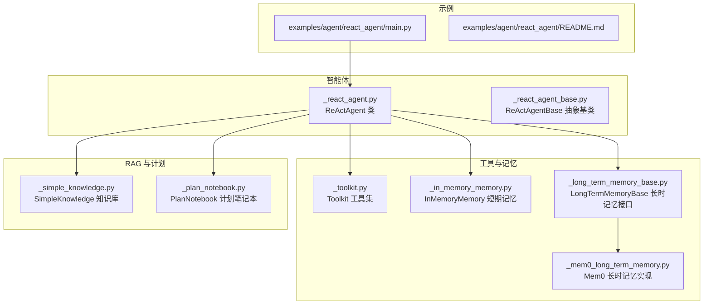
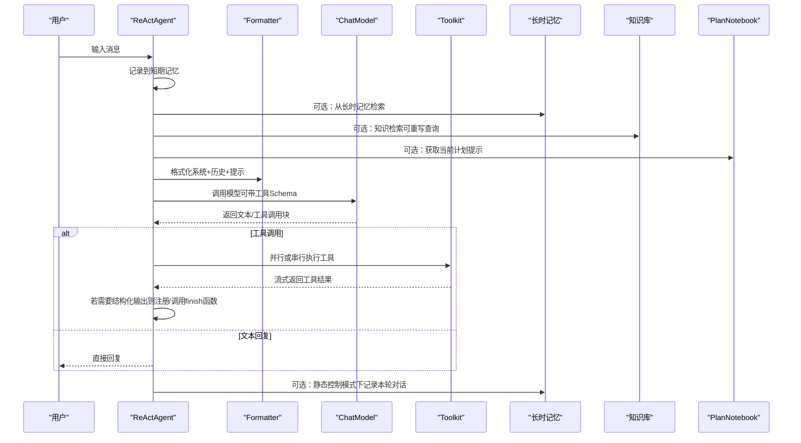
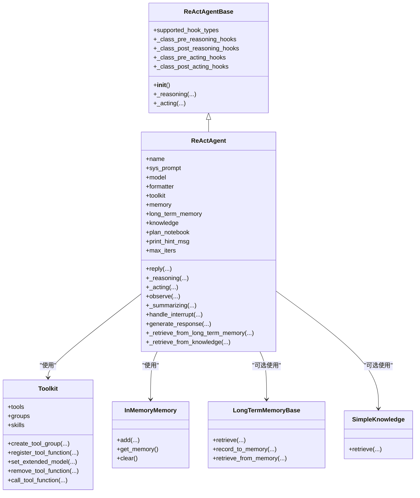
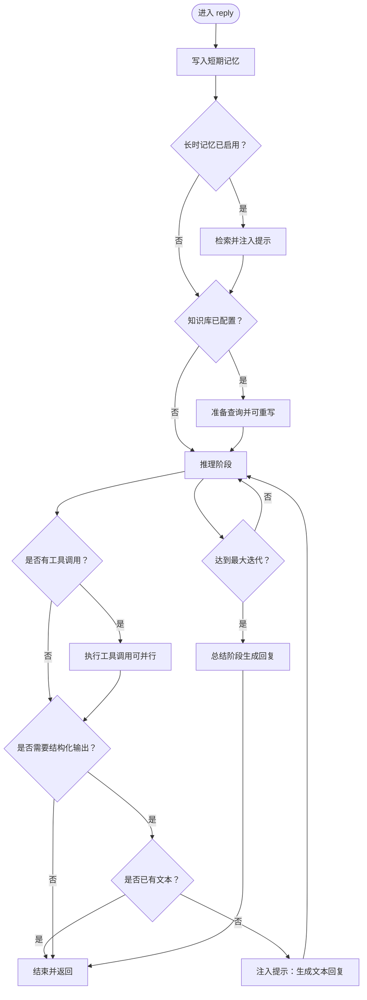

# ReAct智能体

<cite>
**本文引用的文件列表**
- [src/agentscope/agent/_react_agent.py](file://src/agentscope/agent/_react_agent.py)
- [src/agentscope/agent/_react_agent_base.py](file://src/agentscope/agent/_react_agent_base.py)
- [src/agentscope/agent/_user_agent.py](file://src/agentscope/agent/_user_agent.py)
- [src/agentscope/agent/_user_input.py](file://src/agentscope/agent/_user_input.py)
- [src/agentscope/tool/_toolkit.py](file://src/agentscope/tool/_toolkit.py)
- [src/agentscope/memory/_in_memory_memory.py](file://src/agentscope/memory/_in_memory_memory.py)
- [src/agentscope/memory/_long_term_memory_base.py](file://src/agentscope/memory/_long_term_memory_base.py)
- [src/agentscope/memory/_mem0_long_term_memory.py](file://src/agentscope/memory/_mem0_long_term_memory.py)
- [src/agentscope/rag/_simple_knowledge.py](file://src/agentscope/rag/_simple_knowledge.py)
- [src/agentscope/plan/_plan_notebook.py](file://src/agentscope/plan/_plan_notebook.py)
- [examples/agent/react_agent/main.py](file://examples/agent/react_agent/main.py)
- [examples/agent/react_agent/README.md](file://examples/agent/react_agent/README.md)
- [tests/react_agent_test.py](file://tests/react_agent_test.py)
- [tests/toolkit_basic_test.py](file://tests/toolkit_basic_test.py)
</cite>

## 目录
1. [简介](#简介)
2. [项目结构](#项目结构)
3. [核心组件](#核心组件)
4. [架构总览](#架构总览)
5. [详细组件分析](#详细组件分析)
6. [依赖关系分析](#依赖关系分析)
7. [性能考量](#性能考量)
8. [故障排查指南](#故障排查指南)
9. [结论](#结论)
10. [附录](#附录)

## 简介
本文件面向使用者与开发者，系统性阐述 ReAct 智能体的设计与实现，重点覆盖：
- 实时引导与中断（支持 Ctrl+C 中断）
- 基于 API 的并行工具调用
- 推理-行动循环（Reasoning-Acting Loop）机制
- 初始化参数：system prompt、模型、格式化器、工具包、记忆系统、计划笔记本、长时记忆、知识库等
- reply 方法执行流程：推理、行动、观察、总结
- 结构化输出生成、长时记忆集成、知识库检索
- 性能优化建议与常见问题解决方案

## 项目结构
ReAct 智能体位于 agentscope 的 agent 子模块中，并与工具、记忆、RAG、计划等模块紧密协作。示例工程展示了如何快速搭建一个具备工具能力的 ReAct 智能体。

图表来源
- [examples/agent/react_agent/main.py](file://examples/agent/react_agent/main.py#L1-L51)
- [src/agentscope/agent/_react_agent.py](file://src/agentscope/agent/_react_agent.py#L40-L134)
- [src/agentscope/tool/_toolkit.py](file://src/agentscope/tool/_toolkit.py#L55-L120)
- [src/agentscope/memory/_in_memory_memory.py](file://src/agentscope/memory/_in_memory_memory.py#L10-L20)
- [src/agentscope/memory/_long_term_memory_base.py](file://src/agentscope/memory/_long_term_memory_base.py#L41-L78)
- [src/agentscope/memory/_mem0_long_term_memory.py](file://src/agentscope/memory/_mem0_long_term_memory.py#L376-L413)
- [src/agentscope/rag/_simple_knowledge.py](file://src/agentscope/rag/_simple_knowledge.py#L10-L44)
- [src/agentscope/plan/_plan_notebook.py](file://src/agentscope/plan/_plan_notebook.py#L190-L225)

章节来源
- [examples/agent/react_agent/main.py](file://examples/agent/react_agent/main.py#L1-L51)
- [examples/agent/react_agent/README.md](file://examples/agent/react_agent/README.md#L1-L23)

## 核心组件
- ReActAgent：实现推理-行动循环、工具调用、结构化输出、长时记忆与知识库检索、实时引导与中断、TTS 输出等核心能力。
- ReActAgentBase：定义抽象的推理与行动接口，并提供钩子扩展点（pre/post reasoning/acting/print/observe/reply）。
- Toolkit：统一管理工具函数、分组、MCP 客户端、代理技能提示注入。
- InMemoryMemory：默认短期记忆实现，保存对话历史。
- LongTermMemoryBase/Mem0：长时记忆接口与实现，提供检索与记录能力。
- SimpleKnowledge：简单知识库实现，支持向量检索。
- PlanNotebook：任务分解与提示注入，辅助推理阶段的“思考提示”。

章节来源
- [src/agentscope/agent/_react_agent.py](file://src/agentscope/agent/_react_agent.py#L40-L134)
- [src/agentscope/agent/_react_agent_base.py](file://src/agentscope/agent/_react_agent_base.py#L12-L33)
- [src/agentscope/tool/_toolkit.py](file://src/agentscope/tool/_toolkit.py#L55-L120)
- [src/agentscope/memory/_in_memory_memory.py](file://src/agentscope/memory/_in_memory_memory.py#L10-L20)
- [src/agentscope/memory/_long_term_memory_base.py](file://src/agentscope/memory/_long_term_memory_base.py#L41-L78)
- [src/agentscope/memory/_mem0_long_term_memory.py](file://src/agentscope/memory/_mem0_long_term_memory.py#L376-L413)
- [src/agentscope/rag/_simple_knowledge.py](file://src/agentscope/rag/_simple_knowledge.py#L10-L44)
- [src/agentscope/plan/_plan_notebook.py](file://src/agentscope/plan/_plan_notebook.py#L190-L225)

## 架构总览
ReActAgent 的核心流程围绕“推理-行动”循环展开，结合工具调用、结构化输出、长时记忆检索、知识库检索与计划提示，形成完整的交互闭环。

图表来源
- [src/agentscope/agent/_react_agent.py](file://src/agentscope/agent/_react_agent.py#L253-L409)
- [src/agentscope/agent/_react_agent.py](file://src/agentscope/agent/_react_agent.py#L411-L521)
- [src/agentscope/agent/_react_agent.py](file://src/agentscope/agent/_react_agent.py#L523-L581)
- [src/agentscope/agent/_react_agent.py](file://src/agentscope/agent/_react_agent.py#L741-L831)
- [src/agentscope/tool/_toolkit.py](file://src/agentscope/tool/_toolkit.py#L593-L619)

## 详细组件分析

### ReActAgent 类设计与实现
- 设计要点
  - 继承自 ReActAgentBase，提供抽象的推理与行动接口，并内置多种钩子类型以支持扩展。
  - 支持实时引导与中断：在推理阶段流式打印中间结果，允许用户中断；中断后会注入“被中断”的工具结果，便于后续处理。
  - 支持结构化输出：通过注册名为 generate_response 的工具函数，结合 Pydantic 模型进行参数校验与输出封装。
  - 支持并行工具调用：当开启 parallel_tool_calls 时，多个工具调用并发执行，提升吞吐。
  - 集成长时记忆与知识库：在每次回复前自动检索并注入提示，支持查询重写以提高检索质量。
  - 计划笔记本：可将计划提示注入推理阶段，指导下一步行动。
  - TTS 集成：在多模态模型场景下，支持语音合成与流式输入推送。

- 关键属性与初始化参数
  - name、sys_prompt、model、formatter：基础配置。
  - toolkit：工具集合，默认空 Toolkit，可注册任意工具函数。
  - memory：短期记忆，默认 InMemoryMemory。
  - long_term_memory：长时记忆接口，可选。
  - long_term_memory_mode：agent_control/static_control/both，决定长时记忆的使用策略。
  - enable_meta_tool：是否启用动态管理工具的元工具。
  - parallel_tool_calls：是否并行执行工具调用。
  - knowledge：知识库对象或列表，支持查询重写与检索。
  - enable_rewrite_query：是否对用户输入进行查询重写。
  - plan_notebook：计划笔记本，用于注入推理提示。
  - print_hint_msg：是否打印推理提示消息。
  - max_iters：推理-行动循环最大迭代次数。
  - tts_model：TTS 模型，用于语音合成与流式输入。

- reply 执行流程
  1) 记录输入消息至短期记忆。
  2) 可选：从长时记忆检索并注入提示。
  3) 可选：从知识库检索文档（可先重写查询）。
  4) 根据是否需要结构化输出，动态注册/移除 generate_response 工具，并设置 tool_choice。
  5) 进入推理-行动循环：
     - 推理阶段：格式化提示，调用模型，得到文本或工具调用块。
     - 行动阶段：并行或串行执行工具调用，流式打印中间结果。
     - 判断退出条件：若需要结构化输出且已生成，则直接结束；否则继续下一轮推理。
  6) 达到最大迭代仍未满足条件时，进入总结阶段生成最终回复。
  7) 若为静态控制模式，将本轮对话历史与最终回复记录到长时记忆。

- _reasoning 推理阶段
  - 插入计划提示（若有）。
  - 使用 Formatter 将系统提示、历史消息与一次性提示合并为模型输入。
  - 调用 ChatModel，支持流式输出与 TTS 推送。
  - 将中间结果与最终结果写入短期记忆。

- _acting 行动阶段
  - 执行单个工具调用，支持异步生成器流式返回。
  - 处理中断：当工具返回中断标记时，抛出取消异常，交由上层处理。
  - 若为 generate_response 且成功，返回结构化输出。

- observe 观察阶段
  - 仅接收消息并写入短期记忆，不生成回复。

- _summarizing 总结阶段
  - 当超过最大迭代仍未满足条件时，生成总结性回复。

- handle_interrupt 中断处理
  - 生成中断响应消息，标记中断状态，便于上层感知。

- generate_response 结构化输出生成
  - 使用传入的 Pydantic 模型验证参数，失败时返回错误信息；成功时返回包含结构化输出的 ToolResponse。

- 长时记忆检索与记录
  - _retrieve_from_long_term_memory：在静态控制模式下，开始时从长时记忆检索并注入提示。
  - _retrieve_from_knowledge：根据用户输入构建查询，可选重写查询，然后检索文档并注入提示。

- 计划笔记本提示
  - 在推理前从 PlanNotebook 获取当前提示，插入短期记忆，供模型参考。

章节来源
- [src/agentscope/agent/_react_agent.py](file://src/agentscope/agent/_react_agent.py#L40-L134)
- [src/agentscope/agent/_react_agent.py](file://src/agentscope/agent/_react_agent.py#L253-L409)
- [src/agentscope/agent/_react_agent.py](file://src/agentscope/agent/_react_agent.py#L411-L521)
- [src/agentscope/agent/_react_agent.py](file://src/agentscope/agent/_react_agent.py#L523-L581)
- [src/agentscope/agent/_react_agent.py](file://src/agentscope/agent/_react_agent.py#L582-L656)
- [src/agentscope/agent/_react_agent.py](file://src/agentscope/agent/_react_agent.py#L658-L687)
- [src/agentscope/agent/_react_agent.py](file://src/agentscope/agent/_react_agent.py#L688-L740)
- [src/agentscope/agent/_react_agent.py](file://src/agentscope/agent/_react_agent.py#L741-L831)

### ReActAgentBase 抽象基类
- 提供两类抽象方法：_reasoning 与 _acting，分别包裹 pre/post 钩子。
- 定义支持的钩子类型：pre/post reasoning/acting/print/observe/reply。
- 通过元类注册类级钩子，实例级钩子独立维护。

章节来源
- [src/agentscope/agent/_react_agent_base.py](file://src/agentscope/agent/_react_agent_base.py#L12-L33)
- [src/agentscope/agent/_react_agent_base.py](file://src/agentscope/agent/_react_agent_base.py#L35-L91)
- [src/agentscope/agent/_react_agent_base.py](file://src/agentscope/agent/_react_agent_base.py#L92-L117)

### Toolkit 工具集
- 功能概览
  - 注册/删除工具函数，解析 JSON Schema，支持分组管理与激活/停用。
  - 动态扩展工具函数的 JSON Schema（结合 Pydantic 模型）。
  - 统一的异步生成器流式接口，支持中断与累积输出。
  - 支持 MCP 客户端工具函数注册与清理。
  - 支持代理技能注入，将技能说明拼接到系统提示中。

- 关键接口
  - create_tool_group/update_tool_groups/remove_tool_groups：工具分组管理。
  - register_tool_function/set_extended_model/remove_tool_function：工具注册与扩展。
  - call_tool_function：统一执行入口，返回流式 ToolResponse。

章节来源
- [src/agentscope/tool/_toolkit.py](file://src/agentscope/tool/_toolkit.py#L55-L120)
- [src/agentscope/tool/_toolkit.py](file://src/agentscope/tool/_toolkit.py#L199-L200)
- [src/agentscope/tool/_toolkit.py](file://src/agentscope/tool/_toolkit.py#L593-L619)

### InMemoryMemory 短期记忆
- 默认短期记忆实现，保存对话历史，支持去重、批量添加、清空等操作。
- 作为 ReActAgent 的默认记忆后端。

章节来源
- [src/agentscope/memory/_in_memory_memory.py](file://src/agentscope/memory/_in_memory_memory.py#L10-L20)
- [src/agentscope/memory/_in_memory_memory.py](file://src/agentscope/memory/_in_memory_memory.py#L78-L123)

### 长时记忆接口与实现
- LongTermMemoryBase：定义检索与记录接口，具体实现需按需求扩展。
- Mem0：提供检索与记录的具体实现，支持关键词检索与限制条数。

章节来源
- [src/agentscope/memory/_long_term_memory_base.py](file://src/agentscope/memory/_long_term_memory_base.py#L41-L78)
- [src/agentscope/memory/_mem0_long_term_memory.py](file://src/agentscope/memory/_mem0_long_term_memory.py#L376-L413)

### 知识库检索
- SimpleKnowledge：基于嵌入模型与向量存储的检索实现，支持阈值过滤与限制条数。

章节来源
- [src/agentscope/rag/_simple_knowledge.py](file://src/agentscope/rag/_simple_knowledge.py#L10-L44)

### 计划笔记本
- PlanNotebook：支持计划创建、子任务分解、状态变更与存储，推理阶段可注入提示。

章节来源
- [src/agentscope/plan/_plan_notebook.py](file://src/agentscope/plan/_plan_notebook.py#L190-L225)

### 用户交互与输入
- UserAgent/UserInput：提供结构化输入能力，支持按 Pydantic 模型要求逐项输入字段。

章节来源
- [src/agentscope/agent/_user_agent.py](file://src/agentscope/agent/_user_agent.py#L82-L119)
- [src/agentscope/agent/_user_input.py](file://src/agentscope/agent/_user_input.py#L92-L131)

## 依赖关系分析

图表来源
- [src/agentscope/agent/_react_agent_base.py](file://src/agentscope/agent/_react_agent_base.py#L12-L33)
- [src/agentscope/agent/_react_agent.py](file://src/agentscope/agent/_react_agent.py#L40-L134)
- [src/agentscope/tool/_toolkit.py](file://src/agentscope/tool/_toolkit.py#L55-L120)
- [src/agentscope/memory/_in_memory_memory.py](file://src/agentscope/memory/_in_memory_memory.py#L10-L20)
- [src/agentscope/memory/_long_term_memory_base.py](file://src/agentscope/memory/_long_term_memory_base.py#L41-L78)
- [src/agentscope/rag/_simple_knowledge.py](file://src/agentscope/rag/_simple_knowledge.py#L10-L44)

## 性能考量
- 并行工具调用
  - 启用 parallel_tool_calls 可显著提升多工具场景下的吞吐，但需注意资源竞争与限流。
  - 建议在工具数量较多或外部服务有速率限制时谨慎开启。

- 流式输出与 TTS
  - 推理阶段支持流式输出，有助于降低首屏延迟；TTS 流式输入可边生成边合成，改善交互体验。
  - 对于高并发场景，建议合理配置模型与 TTS 的并发度，避免阻塞。

- 记忆与检索
  - 长时记忆与知识库检索会增加往返开销，建议：
    - 长时记忆模式选择 static_control 或 agent_control，按需注入提示。
    - 知识检索前进行查询重写，减少无关文档返回。
    - 控制 max_iters，避免无限循环。

- 工具函数设计
  - 将耗时操作异步化，使用异步生成器返回增量结果，提升可观测性与中断响应速度。
  - 对外部 API 调用进行超时与重试策略配置。

- 内存管理
  - InMemoryMemory 适合演示与小规模应用；大规模场景建议替换为持久化存储或压缩策略。

[本节为通用建议，无需列出具体文件来源]

## 故障排查指南
- 中断与恢复
  - 用户中断后，ReActAgent 会注入“被中断”的工具结果，确保后续流程稳定。
  - 若出现未预期的中断行为，检查工具函数是否正确抛出取消异常并返回中断标记。

- 结构化输出未触发
  - 确认在 reply 调用时传入了 Pydantic 模型，并确保模型名称与 generate_response 一致。
  - 检查工具函数是否正确返回 ToolResponse 且 metadata.success 为真。

- 工具调用无输出
  - 确认工具函数已注册到 Toolkit，且 JSON Schema 正确。
  - 检查工具函数是否返回异步生成器，且每一步都累积输出。

- 长时记忆未生效
  - 确认 long_term_memory_mode 设置为 agent_control/static_control/both 之一。
  - 确认长时记忆实现已正确注入到 Toolkit（当启用 agent_control 时）。

- 知识库检索无效
  - 确认 knowledge 参数已正确传入，且查询非空。
  - 若启用查询重写，检查模型是否支持结构化输出并返回重写后的查询。

- 计划提示未显示
  - 确认已传入 PlanNotebook，且 print_hint_msg 为 True。
  - 检查计划笔记本的状态与提示生成逻辑。

章节来源
- [src/agentscope/agent/_react_agent.py](file://src/agentscope/agent/_react_agent.py#L582-L656)
- [src/agentscope/agent/_react_agent.py](file://src/agentscope/agent/_react_agent.py#L658-L687)
- [src/agentscope/agent/_react_agent.py](file://src/agentscope/agent/_react_agent.py#L688-L740)
- [src/agentscope/agent/_react_agent.py](file://src/agentscope/agent/_react_agent.py#L741-L831)
- [tests/toolkit_basic_test.py](file://tests/toolkit_basic_test.py#L674-L711)
- [tests/react_agent_test.py](file://tests/react_agent_test.py#L96-L192)

## 结论
ReAct 智能体通过清晰的推理-行动循环、灵活的工具调用与结构化输出、可插拔的记忆与知识库、以及实时引导与中断机制，提供了强大的智能体开发框架。配合计划笔记本与长时记忆，可在复杂任务中实现更稳健的决策与执行。建议在生产环境中结合性能优化策略与完善的错误处理机制，持续迭代以适配业务场景。

[本节为总结性内容，无需列出具体文件来源]

## 附录

### 快速开始与示例
- 示例工程展示了如何创建 ReActAgent，注册工具函数，连接 DashScope 模型，并与 UserAgent 进行交互。
- 可通过 Ctrl+C 实时中断智能体回复，体验中断处理流程。

章节来源
- [examples/agent/react_agent/main.py](file://examples/agent/react_agent/main.py#L1-L51)
- [examples/agent/react_agent/README.md](file://examples/agent/react_agent/README.md#L1-L23)

### 初始化参数一览
- name、sys_prompt、model、formatter：基础配置。
- toolkit：工具集合，默认空 Toolkit。
- memory：短期记忆，默认 InMemoryMemory。
- long_term_memory：长时记忆接口，可选。
- long_term_memory_mode：agent_control/static_control/both。
- enable_meta_tool：是否启用动态管理工具的元工具。
- parallel_tool_calls：是否并行执行工具调用。
- knowledge：知识库对象或列表，支持查询重写与检索。
- enable_rewrite_query：是否对用户输入进行查询重写。
- plan_notebook：计划笔记本，用于注入推理提示。
- print_hint_msg：是否打印推理提示消息。
- max_iters：推理-行动循环最大迭代次数。
- tts_model：TTS 模型，用于语音合成与流式输入。

章节来源
- [src/agentscope/agent/_react_agent.py](file://src/agentscope/agent/_react_agent.py#L53-L134)

### reply 方法执行流程图

图表来源
- [src/agentscope/agent/_react_agent.py](file://src/agentscope/agent/_react_agent.py#L253-L409)
- [src/agentscope/agent/_react_agent.py](file://src/agentscope/agent/_react_agent.py#L411-L521)
- [src/agentscope/agent/_react_agent.py](file://src/agentscope/agent/_react_agent.py#L523-L581)
- [src/agentscope/agent/_react_agent.py](file://src/agentscope/agent/_react_agent.py#L582-L656)