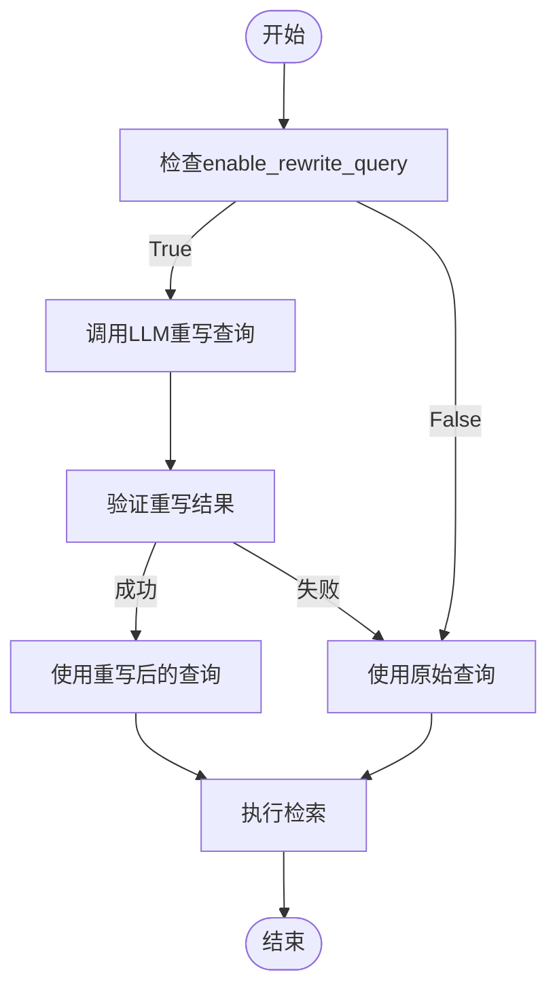
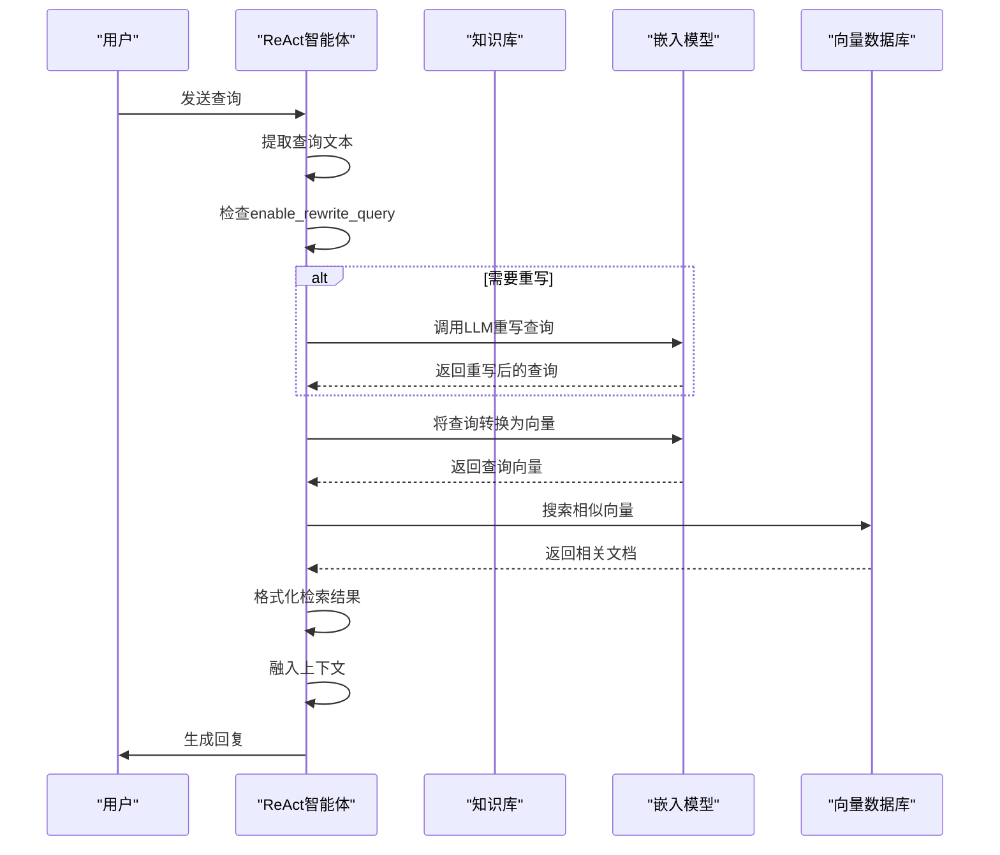
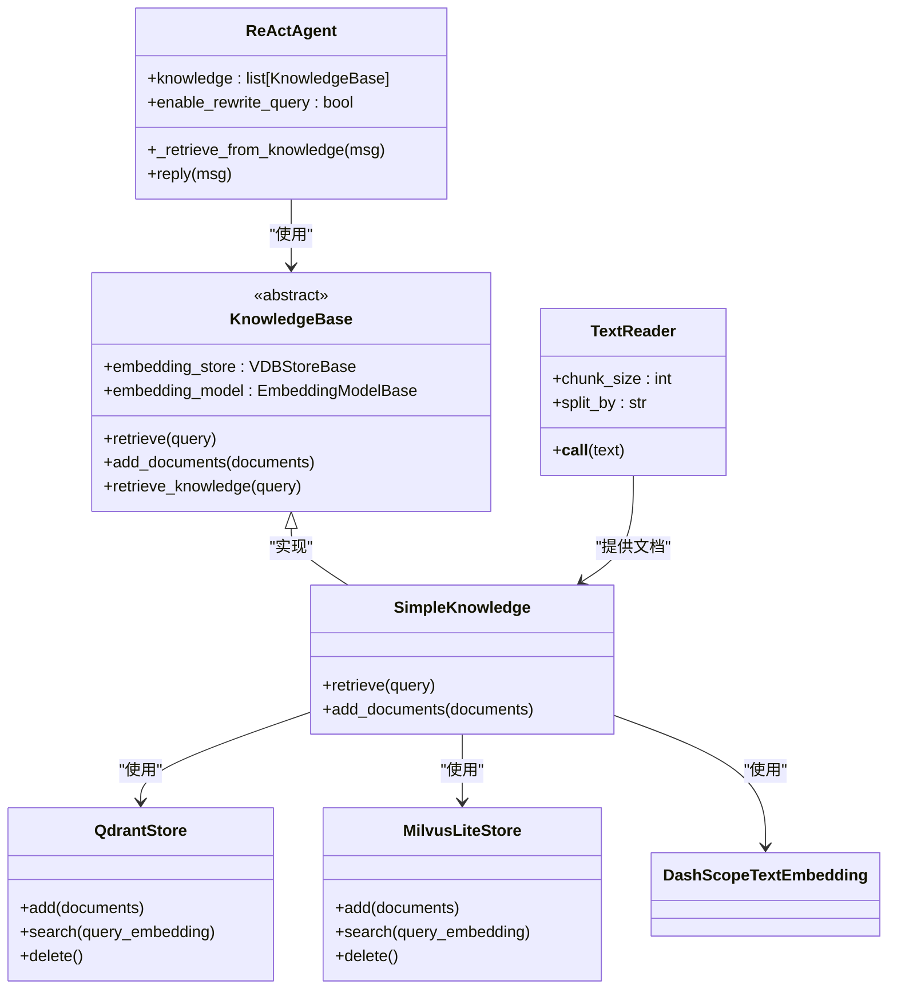

# RAG集成配置

<cite>
**本文档中引用的文件**  
- [react_agent.py](file://src/agentscope/agent/_react_agent.py)
- [knowledge_base.py](file://src/agentscope/rag/_knowledge_base.py)
- [simple_knowledge.py](file://src/agentscope/rag/_simple_knowledge.py)
- [react_agent_integration.py](file://examples/functionality/rag/react_agent_integration.py)
- [basic_usage.py](file://examples/functionality/rag/basic_usage.py)
- [agentic_usage.py](file://examples/functionality/rag/agentic_usage.py)
- [qdrant_store.py](file://src/agentscope/rag/_store/_qdrant_store.py)
- [milvuslite_store.py](file://src/agentscope/rag/_store/_milvuslite_store.py)
- [document.py](file://src/agentscope/rag/_document.py)
</cite>

## 目录
1. [简介](#简介)
2. [知识库集成](#知识库集成)
3. [查询重写机制](#查询重写机制)
4. [检索流程](#检索流程)
5. [实际应用示例](#实际应用示例)
6. [配置建议](#配置建议)

## 简介
本文档详细说明了ReAct智能体中RAG（检索增强生成）功能的集成配置。重点介绍`knowledge`参数如何集成一个或多个知识库，以及`enable_rewrite_query`参数在查询重写中的作用机制。文档将解释系统如何在每次回复前自动检索相关文档，并将结果融入上下文，通过实际示例展示如何配置知识库并利用查询重写功能提升检索准确性。

**Section sources**
- [react_agent.py](file://src/agentscope/agent/_react_agent.py#L69-L70)
- [react_agent_integration.py](file://examples/functionality/rag/react_agent_integration.py#L14-L79)

## 知识库集成
`knowledge`参数允许ReAct智能体集成一个或多个知识库实例。该参数接受单个`KnowledgeBase`对象或`KnowledgeBase`对象列表，使智能体能够在每次回复前自动检索相关文档。

当配置`knowledge`参数时，系统会在`reply`方法执行时调用`_retrieve_from_knowledge`方法，从指定的知识库中检索与用户查询相关的文档。这些检索到的文档随后被融入智能体的上下文，为生成更准确的回复提供支持。

知识库的实现基于`KnowledgeBase`抽象类，该类定义了`retrieve`和`add_documents`两个抽象方法。`SimpleKnowledge`类提供了具体的实现，它使用嵌入模型将文档转换为向量，并存储在向量数据库中。

**Section sources**
- [react_agent.py](file://src/agentscope/agent/_react_agent.py#L188-L192)
- [knowledge_base.py](file://src/agentscope/rag/_knowledge_base.py#L13-L36)
- [simple_knowledge.py](file://src/agentscope/rag/_simple_knowledge.py#L10-L53)

## 查询重写机制
`enable_rewrite_query`参数控制是否在检索前对用户查询进行重写。当设置为`True`（默认值）时，系统会尝试将模糊或代词性的查询重写为更具体、更明确的查询，从而提高检索准确性。

查询重写机制通过调用语言模型实现。系统会构造一个包含原始系统提示和特殊提示的重写提示，要求模型生成更具体的查询。例如，将"谁是我的最好的朋友？"重写为"John Doe最好的朋友是谁？"。

该机制特别适用于处理包含代词（如"我"、"你"、"他"）或模糊时间表达（如"昨天"）的查询，通过将其转换为具体名称或具体日期来提高检索效果。

**Diagram sources**
- [react_agent.py](file://src/agentscope/agent/_react_agent.py#L795-L824)

**Section sources**
- [react_agent.py](file://src/agentscope/agent/_react_agent.py#L70-L71)
- [react_agent.py](file://src/agentscope/agent/_react_agent.py#L795-L824)

## 检索流程
RAG集成的检索流程在每次`reply`调用时自动执行。流程从用户输入消息开始，系统首先提取文本内容作为查询。如果`enable_rewrite_query`为`True`，则通过语言模型对查询进行重写。

随后，系统遍历所有配置的知识库，调用其`retrieve`方法获取相关文档。检索过程包括：使用嵌入模型将查询转换为向量，然后在向量数据库中搜索最相似的文档向量。

检索到的文档按相关性分数排序，最高分的文档排在前面。这些文档及其相关性分数被格式化为工具响应，并作为上下文信息融入智能体的对话历史中，为后续的推理和回复生成提供依据。

**Diagram sources**
- [react_agent.py](file://src/agentscope/agent/_react_agent.py#L275-L280)
- [simple_knowledge.py](file://src/agentscope/rag/_simple_knowledge.py#L38-L52)

**Section sources**
- [react_agent.py](file://src/agentscope/agent/_react_agent.py#L778-L794)
- [simple_knowledge.py](file://src/agentscope/rag/_simple_knowledge.py#L38-L52)

## 实际应用示例
以下示例展示了如何配置ReAct智能体的RAG功能。首先创建一个`SimpleKnowledge`实例，指定向量数据库存储（如`QdrantStore`）和嵌入模型（如`DashScopeTextEmbedding`）。

然后，使用`TextReader`等读取器将文档内容分割并添加到知识库中。最后，在创建`ReActAgent`时，通过`knowledge`参数传入知识库实例，并可选择设置`enable_rewrite_query`参数。

在实际应用中，当用户询问"谁是我的最好的朋友？"时，如果`enable_rewrite_query`为`True`，系统会自动将查询重写为"John Doe最好的朋友是谁？"，从而更准确地从知识库中检索相关信息。

**Diagram sources**
- [react_agent_integration.py](file://examples/functionality/rag/react_agent_integration.py#L14-L79)
- [basic_usage.py](file://examples/functionality/rag/basic_usage.py#L15-L80)
- [agentic_usage.py](file://examples/functionality/rag/agentic_usage.py#L33-L102)

**Section sources**
- [react_agent_integration.py](file://examples/functionality/rag/react_agent_integration.py#L14-L79)
- [basic_usage.py](file://examples/functionality/rag/basic_usage.py#L15-L80)
- [agentic_usage.py](file://examples/functionality/rag/agentic_usage.py#L33-L102)

## 配置建议
为了最大化RAG功能的效果，建议遵循以下配置原则：

1. **知识库选择**：根据应用场景选择合适的向量数据库。`QdrantStore`适合内存存储和远程实例，而`MilvusLiteStore`适合本地轻量级应用。

2. **嵌入模型匹配**：确保嵌入模型的维度与向量数据库的配置相匹配。例如，使用`text-embedding-v4`模型时，应设置`dimensions=1024`。

3. **查询重写策略**：在处理包含个人代词或模糊时间表达的查询时，建议启用`enable_rewrite_query`功能，以提高检索准确性。

4. **文档预处理**：合理设置`TextReader`的`chunk_size`和`split_by`参数，确保文档分割既不过大也不过小，以平衡上下文完整性和检索精度。

5. **性能优化**：对于大型知识库，考虑调整`limit`和`score_threshold`参数，以在检索速度和结果相关性之间取得平衡。

**Section sources**
- [qdrant_store.py](file://src/agentscope/rag/_store/_qdrant_store.py#L27-L73)
- [milvuslite_store.py](file://src/agentscope/rag/_store/_milvuslite_store.py#L31-L85)
- [react_agent_integration.py](file://examples/functionality/rag/react_agent_integration.py#L19-L29)
- [basic_usage.py](file://examples/functionality/rag/basic_usage.py#L37-L47)