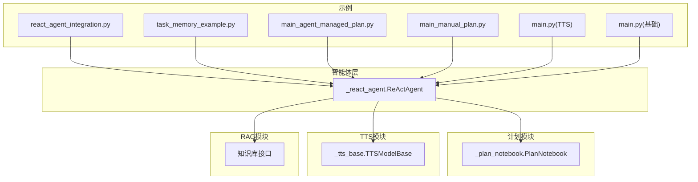
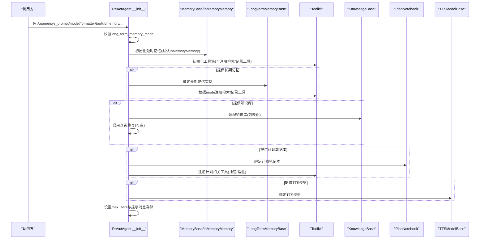
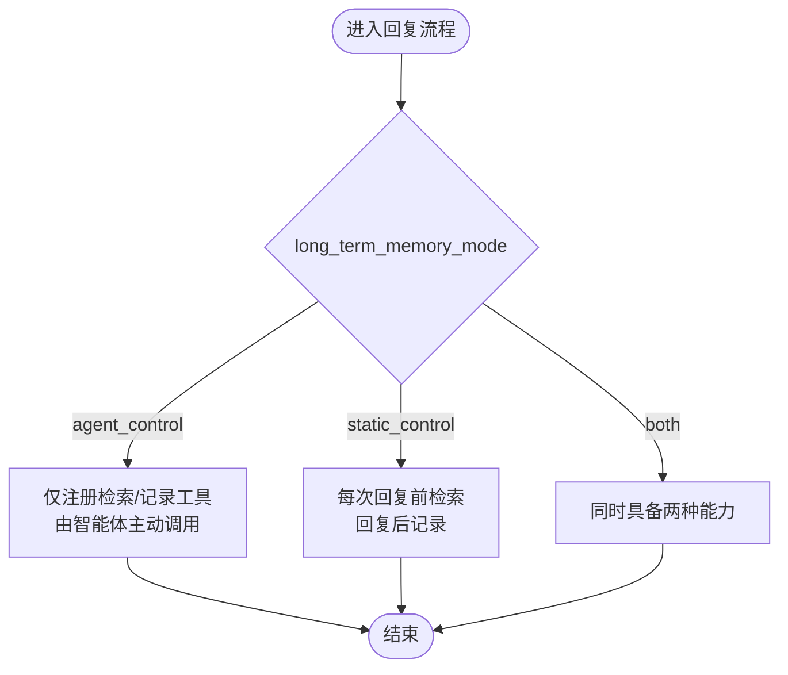
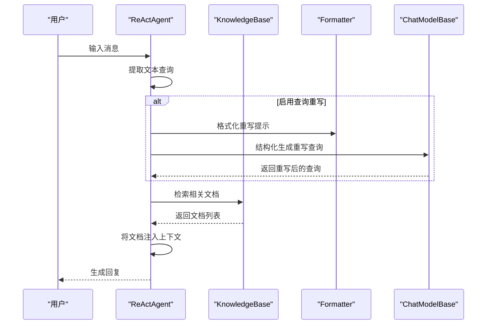
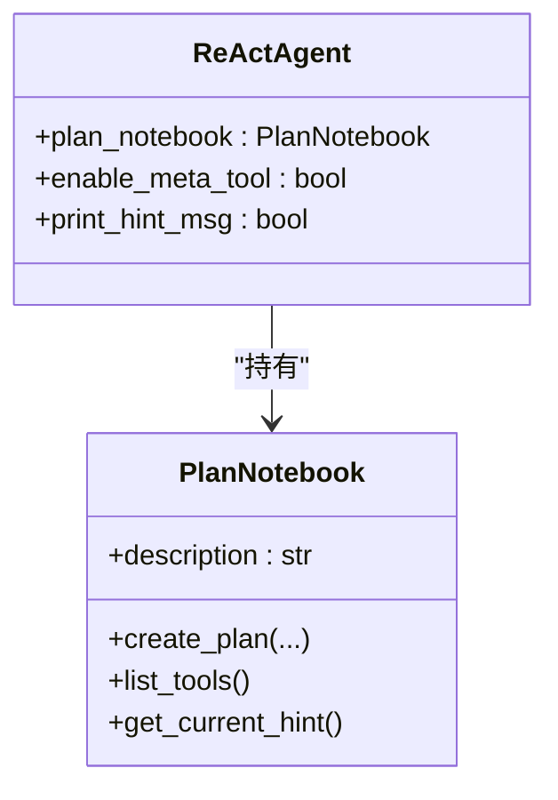
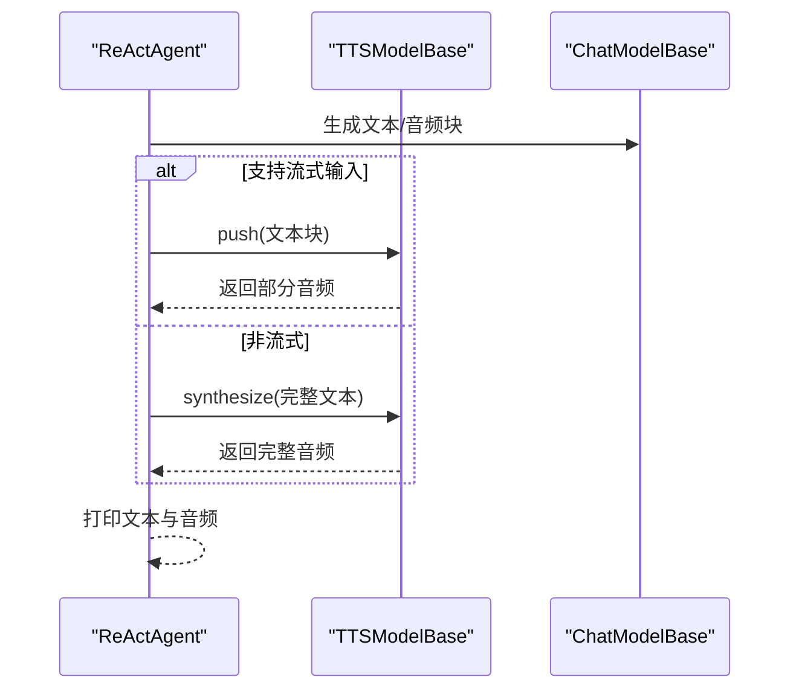
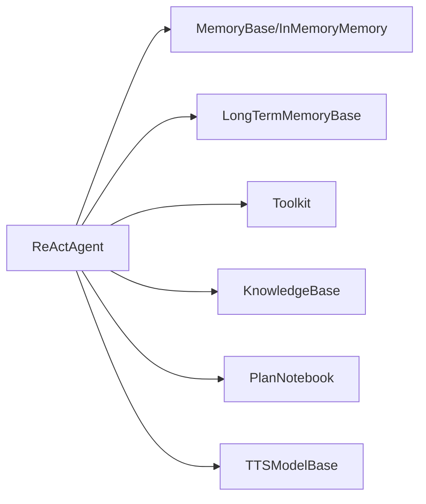

# 初始化配置

<cite>
**本文引用的文件**
- [src/agentscope/agent/_react_agent.py](file://src/agentscope/agent/_react_agent.py)
- [src/agentscope/plan/_plan_notebook.py](file://src/agentscope/plan/_plan_notebook.py)
- [src/agentscope/tts/_tts_base.py](file://src/agentscope/tts/_tts_base.py)
- [examples/functionality/rag/react_agent_integration.py](file://examples/functionality/rag/react_agent_integration.py)
- [examples/functionality/long_term_memory/reme/task_memory_example.py](file://examples/functionality/long_term_memory/reme/task_memory_example.py)
- [examples/functionality/plan/main_agent_managed_plan.py](file://examples/functionality/plan/main_agent_managed_plan.py)
- [examples/functionality/plan/main_manual_plan.py](file://examples/functionality/plan/main_manual_plan.py)
- [examples/functionality/tts/main.py](file://examples/functionality/tts/main.py)
- [examples/agent/react_agent/main.py](file://examples/agent/react_agent/main.py)
</cite>

## 目录
1. [简介](#简介)
2. [项目结构](#项目结构)
3. [核心组件](#核心组件)
4. [架构总览](#架构总览)
5. [详细组件分析](#详细组件分析)
6. [依赖关系分析](#依赖关系分析)
7. [性能考量](#性能考量)
8. [故障排查指南](#故障排查指南)
9. [结论](#结论)
10. [附录](#附录)

## 简介
本文件面向ReAct智能体的初始化配置，系统性阐述ReActAgent.__init__方法中各参数的作用与配置方式，重点覆盖：
- 基础参数：name、sys_prompt、model、formatter、toolkit、memory
- 长期记忆控制：long_term_memory_mode的三种模式（agent_control、static_control、both）及其对智能体行为的影响
- 知识库集成：knowledge参数如何接入RAG知识库，以及enable_rewrite_query在查询重写中的作用
- 复杂任务分解：plan_notebook参数如何支持复杂任务的分步执行
- 实战示例：TTS模型配置与最大迭代次数max_iters的设置

## 项目结构
ReAct智能体位于agentscope的agent模块中，其初始化逻辑集中在ReActAgent类的构造函数中；同时，计划模块、TTS模块、RAG模块分别提供与之配套的功能入口与示例。

图示来源
- [src/agentscope/agent/_react_agent.py](file://src/agentscope/agent/_react_agent.py#L53-L134)
- [src/agentscope/plan/_plan_notebook.py](file://src/agentscope/plan/_plan_notebook.py#L172-L200)
- [src/agentscope/tts/_tts_base.py](file://src/agentscope/tts/_tts_base.py#L12-L144)
- [examples/functionality/rag/react_agent_integration.py](file://examples/functionality/rag/react_agent_integration.py#L52-L66)
- [examples/functionality/long_term_memory/reme/task_memory_example.py](file://examples/functionality/long_term_memory/reme/task_memory_example.py#L200-L244)
- [examples/functionality/plan/main_agent_managed_plan.py](file://examples/functionality/plan/main_agent_managed_plan.py#L30-L49)
- [examples/functionality/plan/main_manual_plan.py](file://examples/functionality/plan/main_manual_plan.py#L75-L86)
- [examples/functionality/tts/main.py](file://examples/functionality/tts/main.py#L26-L45)
- [examples/agent/react_agent/main.py](file://examples/agent/react_agent/main.py#L26-L38)

章节来源
- [src/agentscope/agent/_react_agent.py](file://src/agentscope/agent/_react_agent.py#L53-L134)
- [src/agentscope/plan/_plan_notebook.py](file://src/agentscope/plan/_plan_notebook.py#L172-L200)
- [src/agentscope/tts/_tts_base.py](file://src/agentscope/tts/_tts_base.py#L12-L144)

## 核心组件
- ReActAgent.__init__：负责接收并校验关键参数，初始化内存、工具集、长期记忆、RAG知识库、计划模块、TTS模型，并设置推理-行动循环的最大迭代次数。
- PlanNotebook：提供计划工具与提示消息，支持“代理托管”和“手动计划”两种模式。
- TTSModelBase：统一TTS模型抽象，支持实时与非实时合成，贯穿推理阶段的语音输出。
- KnowledgeBase：RAG知识库接口，用于检索相关文档并注入到对话上下文中。

章节来源
- [src/agentscope/agent/_react_agent.py](file://src/agentscope/agent/_react_agent.py#L53-L134)
- [src/agentscope/plan/_plan_notebook.py](file://src/agentscope/plan/_plan_notebook.py#L172-L200)
- [src/agentscope/tts/_tts_base.py](file://src/agentscope/tts/_tts_base.py#L12-L144)

## 架构总览
ReActAgent的初始化流程围绕“参数校验—资源装配—模式开关—推理循环”展开。下图展示了关键参数与模块之间的交互关系。

图示来源
- [src/agentscope/agent/_react_agent.py](file://src/agentscope/agent/_react_agent.py#L136-L225)
- [src/agentscope/agent/_react_agent.py](file://src/agentscope/agent/_react_agent.py#L169-L219)
- [src/agentscope/agent/_react_agent.py](file://src/agentscope/agent/_react_agent.py#L188-L193)
- [src/agentscope/agent/_react_agent.py](file://src/agentscope/agent/_react_agent.py#L221-L231)

## 详细组件分析

### 参数详解与配置方式
- name（必填）
  - 作用：智能体名称，用于消息构造与显示。
  - 配置方式：字符串，直接传入。
- sys_prompt（必填）
  - 作用：系统提示词，决定智能体角色与行为边界。
  - 配置方式：字符串，可结合工具技能动态拼接。
- model（必填）
  - 作用：对话模型实例，负责生成回复与工具调用。
  - 配置方式：ChatModelBase实现，如DashScopeChatModel。
- formatter（必填）
  - 作用：将消息格式化为模型API所需的格式。
  - 配置方式：FormatterBase实现，如DashScopeChatFormatter。
- toolkit（可选，默认空）
  - 作用：工具集合，支持注册工具函数与元工具。
  - 配置方式：Toolkit实例，可注册自定义工具。
- memory（可选，默认InMemoryMemory）
  - 作用：短期对话记忆，保存历史消息。
  - 配置方式：MemoryBase实现。
- long_term_memory（可选）
  - 作用：长期记忆实例，提供检索与记录能力。
  - 配置方式：LongTermMemoryBase实现。
- long_term_memory_mode（可选，默认both）
  - 作用：长期记忆控制模式，影响检索/记录时机与工具注册。
  - 取值与行为详见下一节。
- enable_meta_tool（可选，默认False）
  - 作用：启用元工具，允许动态管理已装备工具。
  - 配置方式：布尔值。
- parallel_tool_calls（可选，默认False）
  - 作用：多工具调用是否并行执行。
  - 配置方式：布尔值。
- knowledge（可选，默认None）
  - 作用：RAG知识库实例或列表，用于检索相关文档。
  - 配置方式：KnowledgeBase或其列表。
- enable_rewrite_query（可选，默认True）
  - 作用：是否在检索前对用户输入进行查询重写，提升召回质量。
  - 配置方式：布尔值。
- plan_notebook（可选，默认None）
  - 作用：计划笔记本，提供计划工具与提示消息。
  - 配置方式：PlanNotebook实例。
- print_hint_msg（可选，默认False）
  - 作用：是否打印推理提示消息（计划、长期记忆、RAG）。
  - 配置方式：布尔值。
- max_iters（可选，默认10）
  - 作用：推理-行动循环的最大迭代次数。
  - 配置方式：整数。
- tts_model（可选，默认None）
  - 作用：TTS模型，用于将文本转语音。
  - 配置方式：TTSModelBase实现，如DashScopeRealtimeTTSModel。

章节来源
- [src/agentscope/agent/_react_agent.py](file://src/agentscope/agent/_react_agent.py#L53-L134)
- [src/agentscope/agent/_react_agent.py](file://src/agentscope/agent/_react_agent.py#L136-L225)

### long_term_memory_mode三种模式的行为影响
- agent_control
  - 行为：仅在工具集中注册检索/记录工具，由智能体自行决定何时调用。
  - 影响：更灵活的记忆管理，但需在系统提示中明确记忆操作规范。
- static_control
  - 行为：在每次回复开始前自动检索，在回复结束后自动记录。
  - 影响：无需显式工具调用，记忆更新自动化。
- both
  - 行为：兼具上述两种能力，既可自动检索/记录，也可由智能体主动调用工具。
  - 影响：灵活性与自动化兼顾，适合复杂场景。

图示来源
- [src/agentscope/agent/_react_agent.py](file://src/agentscope/agent/_react_agent.py#L136-L167)
- [src/agentscope/agent/_react_agent.py](file://src/agentscope/agent/_react_agent.py#L169-L179)
- [src/agentscope/agent/_react_agent.py](file://src/agentscope/agent/_react_agent.py#L398-L406)

章节来源
- [src/agentscope/agent/_react_agent.py](file://src/agentscope/agent/_react_agent.py#L136-L167)
- [src/agentscope/agent/_react_agent.py](file://src/agentscope/agent/_react_agent.py#L169-L179)
- [src/agentscope/agent/_react_agent.py](file://src/agentscope/agent/_react_agent.py#L398-L406)
- [examples/functionality/long_term_memory/reme/task_memory_example.py](file://examples/functionality/long_term_memory/reme/task_memory_example.py#L200-L244)

### knowledge参数与RAG知识库集成
- 集成方式
  - 将KnowledgeBase或其列表传入knowledge参数，智能体在每次回复前自动检索相关文档。
  - 若enable_rewrite_query为True，将在检索前对用户输入进行查询重写，以提高召回质量。
- 查询重写机制
  - 使用结构化模型生成重写后的查询，再进行向量检索。
  - 若重写失败，会记录警告并跳过重写步骤。
- 示例路径
  - RAG知识库构建与ReActAgent集成示例：[react_agent_integration.py](file://examples/functionality/rag/react_agent_integration.py#L52-L66)
  - 查询重写流程实现位置：[src/agentscope/agent/_react_agent.py](file://src/agentscope/agent/_react_agent.py#L767-L831)

图示来源
- [src/agentscope/agent/_react_agent.py](file://src/agentscope/agent/_react_agent.py#L767-L831)
- [examples/functionality/rag/react_agent_integration.py](file://examples/functionality/rag/react_agent_integration.py#L52-L66)

章节来源
- [src/agentscope/agent/_react_agent.py](file://src/agentscope/agent/_react_agent.py#L767-L831)
- [examples/functionality/rag/react_agent_integration.py](file://examples/functionality/rag/react_agent_integration.py#L52-L66)

### plan_notebook参数与复杂任务分解
- 功能概述
  - PlanNotebook提供计划工具与提示消息，帮助智能体将复杂任务拆解为子任务序列。
  - 支持两种模式：
    - 代理托管：通过元工具激活“计划相关工具”，按计划推进。
    - 手动计划：预先创建计划，智能体直接按计划执行。
- 关键点
  - 当enable_meta_tool为True时，计划工具被放入“plan_related”组，由智能体按需激活。
  - 当enable_meta_tool为False时，计划工具作为基础工具常驻可用。
- 示例路径
  - 代理托管计划示例：[main_agent_managed_plan.py](file://examples/functionality/plan/main_agent_managed_plan.py#L30-L49)
  - 手动计划示例：[main_manual_plan.py](file://examples/functionality/plan/main_manual_plan.py#L75-L86)
  - 计划笔记本类定义：[src/agentscope/plan/_plan_notebook.py](file://src/agentscope/plan/_plan_notebook.py#L172-L200)

图示来源
- [src/agentscope/plan/_plan_notebook.py](file://src/agentscope/plan/_plan_notebook.py#L172-L200)
- [src/agentscope/agent/_react_agent.py](file://src/agentscope/agent/_react_agent.py#L195-L219)

章节来源
- [src/agentscope/plan/_plan_notebook.py](file://src/agentscope/plan/_plan_notebook.py#L172-L200)
- [src/agentscope/agent/_react_agent.py](file://src/agentscope/agent/_react_agent.py#L195-L219)
- [examples/functionality/plan/main_agent_managed_plan.py](file://examples/functionality/plan/main_agent_managed_plan.py#L30-L49)
- [examples/functionality/plan/main_manual_plan.py](file://examples/functionality/plan/main_manual_plan.py#L75-L86)

### TTS模型配置与max_iters设置
- TTS模型配置
  - 通过tts_model参数传入TTSModelBase实现，如DashScopeRealtimeTTSModel。
  - 在推理阶段，智能体会根据模型能力选择推送或阻塞合成，并在流式/非流式场景下分别处理。
- 最大迭代次数max_iters
  - 控制推理-行动循环的上限，避免长链路任务陷入死循环。
  - 可根据任务复杂度与工具调用成本适当调整。
- 示例路径
  - TTS配置示例：[examples/functionality/tts/main.py](file://examples/functionality/tts/main.py#L26-L45)
  - 基础ReActAgent示例（含max_iters默认值说明）：[examples/agent/react_agent/main.py](file://examples/agent/react_agent/main.py#L26-L38)
  - TTS模型抽象：[src/agentscope/tts/_tts_base.py](file://src/agentscope/tts/_tts_base.py#L12-L144)

图示来源
- [src/agentscope/agent/_react_agent.py](file://src/agentscope/agent/_react_agent.py#L446-L490)
- [src/agentscope/agent/_react_agent.py](file://src/agentscope/agent/_react_agent.py#L616-L655)
- [src/agentscope/tts/_tts_base.py](file://src/agentscope/tts/_tts_base.py#L94-L144)

章节来源
- [src/agentscope/agent/_react_agent.py](file://src/agentscope/agent/_react_agent.py#L446-L490)
- [src/agentscope/agent/_react_agent.py](file://src/agentscope/agent/_react_agent.py#L616-L655)
- [src/agentscope/tts/_tts_base.py](file://src/agentscope/tts/_tts_base.py#L94-L144)
- [examples/functionality/tts/main.py](file://examples/functionality/tts/main.py#L26-L45)
- [examples/agent/react_agent/main.py](file://examples/agent/react_agent/main.py#L26-L38)

## 依赖关系分析
- ReActAgent依赖
  - 内存：MemoryBase/InMemoryMemory（短期记忆）
  - 长期记忆：LongTermMemoryBase（检索/记录工具）
  - 工具集：Toolkit（工具注册与调用）
  - 知识库：KnowledgeBase（RAG检索）
  - 计划：PlanNotebook（计划工具与提示）
  - TTS：TTSModelBase（语音合成）
- 耦合与内聚
  - 参数装配清晰，职责单一；通过模式开关降低耦合度。
  - 推理-行动循环与工具调用解耦，便于扩展与测试。

图示来源
- [src/agentscope/agent/_react_agent.py](file://src/agentscope/agent/_react_agent.py#L151-L179)
- [src/agentscope/agent/_react_agent.py](file://src/agentscope/agent/_react_agent.py#L188-L193)
- [src/agentscope/agent/_react_agent.py](file://src/agentscope/agent/_react_agent.py#L195-L219)
- [src/agentscope/agent/_react_agent.py](file://src/agentscope/agent/_react_agent.py#L446-L490)

章节来源
- [src/agentscope/agent/_react_agent.py](file://src/agentscope/agent/_react_agent.py#L151-L179)
- [src/agentscope/agent/_react_agent.py](file://src/agentscope/agent/_react_agent.py#L188-L193)
- [src/agentscope/agent/_react_agent.py](file://src/agentscope/agent/_react_agent.py#L195-L219)
- [src/agentscope/agent/_react_agent.py](file://src/agentscope/agent/_react_agent.py#L446-L490)

## 性能考量
- 并行工具调用：parallel_tool_calls为True时，多工具调用并发执行，可缩短响应时间，但需注意资源竞争与限流。
- 迭代上限：max_iters过小可能导致任务未完成即总结，过大则增加等待时间；建议根据任务复杂度与工具成本权衡。
- RAG检索：enable_rewrite_query可提升召回质量，但会引入一次额外的模型调用；在高延迟场景下可考虑关闭。
- TTS合成：流式合成可改善首包延迟，但需确保TTS模型支持；非流式合成保证完整性但可能阻塞。

## 故障排查指南
- 长期记忆未生效
  - 检查long_term_memory_mode是否正确设置（agent_control/static_control/both）。
  - 确认系统提示中是否包含记忆操作说明。
  - 参考示例：[task_memory_example.py](file://examples/functionality/long_term_memory/reme/task_memory_example.py#L200-L244)
- RAG检索无结果
  - 确认knowledge已正确初始化并填充文档。
  - 检查enable_rewrite_query是否开启，必要时查看重写日志。
  - 参考实现：[src/agentscope/agent/_react_agent.py](file://src/agentscope/agent/_react_agent.py#L767-L831)
- 计划工具不可用
  - 若enable_meta_tool为True，需通过元工具激活“plan_related”组。
  - 若为False，计划工具应常驻可用。
  - 参考示例：[main_agent_managed_plan.py](file://examples/functionality/plan/main_agent_managed_plan.py#L30-L49)、[main_manual_plan.py](file://examples/functionality/plan/main_manual_plan.py#L75-L86)
- TTS异常
  - 确认tts_model类型与能力匹配（流式/非流式）。
  - 检查模型连接与关闭生命周期管理。
  - 参考实现：[src/agentscope/tts/_tts_base.py](file://src/agentscope/tts/_tts_base.py#L52-L69)、[src/agentscope/tts/_tts_base.py](file://src/agentscope/tts/_tts_base.py#L94-L144)

章节来源
- [examples/functionality/long_term_memory/reme/task_memory_example.py](file://examples/functionality/long_term_memory/reme/task_memory_example.py#L200-L244)
- [src/agentscope/agent/_react_agent.py](file://src/agentscope/agent/_react_agent.py#L767-L831)
- [examples/functionality/plan/main_agent_managed_plan.py](file://examples/functionality/plan/main_agent_managed_plan.py#L30-L49)
- [examples/functionality/plan/main_manual_plan.py](file://examples/functionality/plan/main_manual_plan.py#L75-L86)
- [src/agentscope/tts/_tts_base.py](file://src/agentscope/tts/_tts_base.py#L52-L69)
- [src/agentscope/tts/_tts_base.py](file://src/agentscope/tts/_tts_base.py#L94-L144)

## 结论
ReActAgent的初始化配置提供了高度可组合的能力：通过参数与模式开关，既能满足简单对话，也能支撑复杂任务的长期记忆、RAG检索与计划分解。合理设置long_term_memory_mode、knowledge、plan_notebook与max_iters，可显著提升智能体的稳定性与表现力；同时，TTS模型的接入为多模态交互提供了基础能力。

## 附录
- 快速上手示例
  - 基础ReActAgent示例：[examples/agent/react_agent/main.py](file://examples/agent/react_agent/main.py#L26-L38)
  - ReActAgent与RAG集成示例：[examples/functionality/rag/react_agent_integration.py](file://examples/functionality/rag/react_agent_integration.py#L52-L66)
  - ReActAgent与计划集成示例（代理托管）：[examples/functionality/plan/main_agent_managed_plan.py](file://examples/functionality/plan/main_agent_managed_plan.py#L30-L49)
  - ReActAgent与计划集成示例（手动计划）：[examples/functionality/plan/main_manual_plan.py](file://examples/functionality/plan/main_manual_plan.py#L75-L86)
  - ReActAgent与TTS集成示例：[examples/functionality/tts/main.py](file://examples/functionality/tts/main.py#L26-L45)