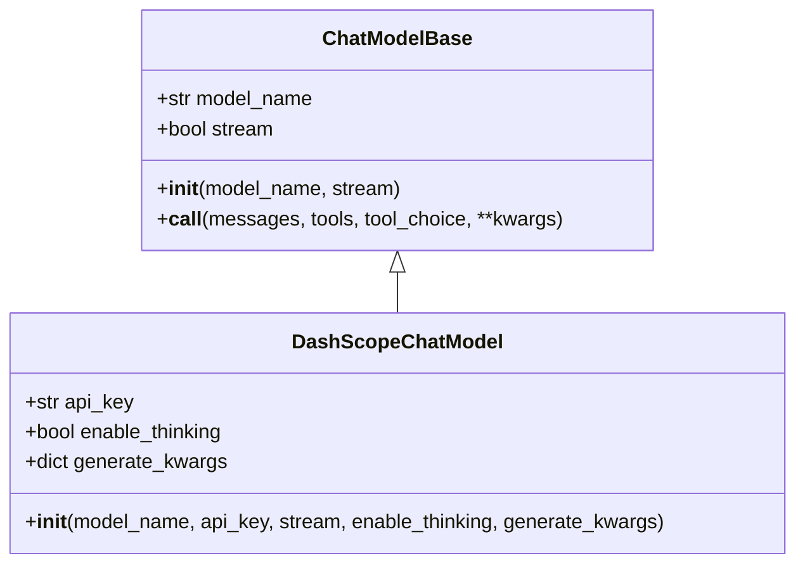
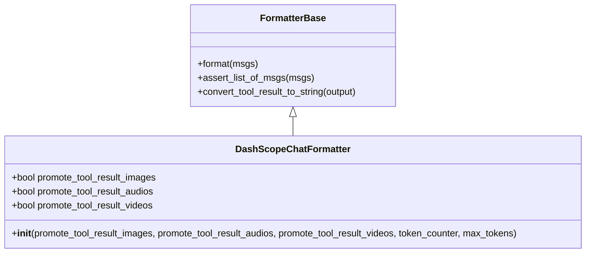
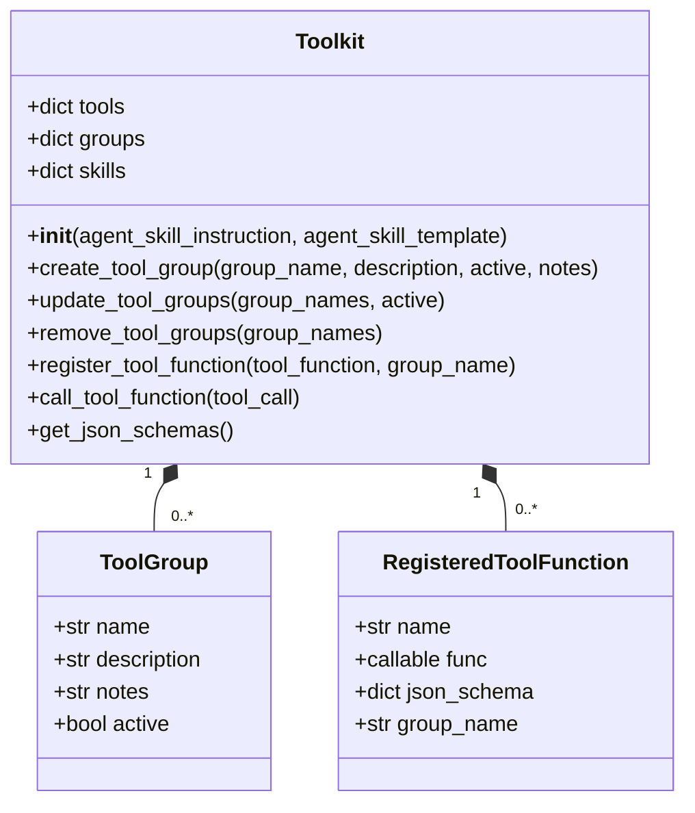
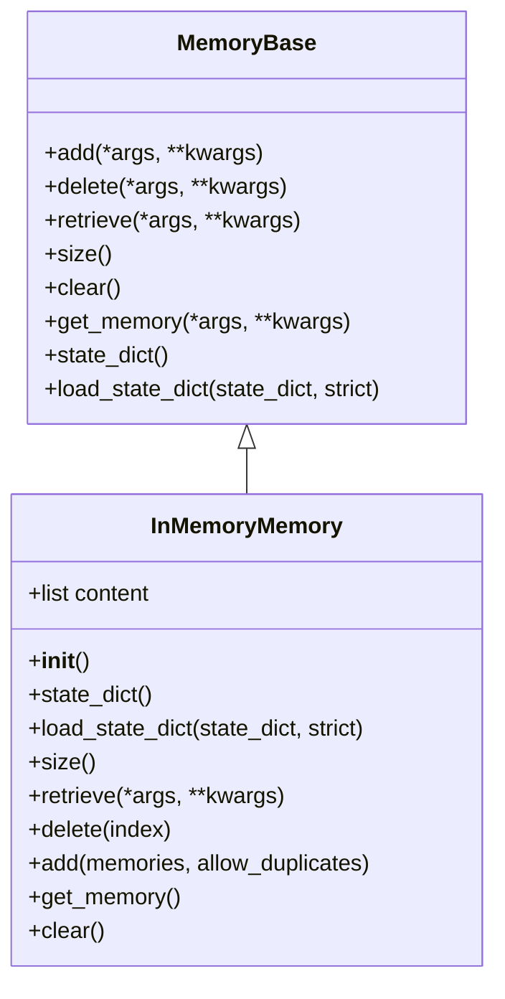
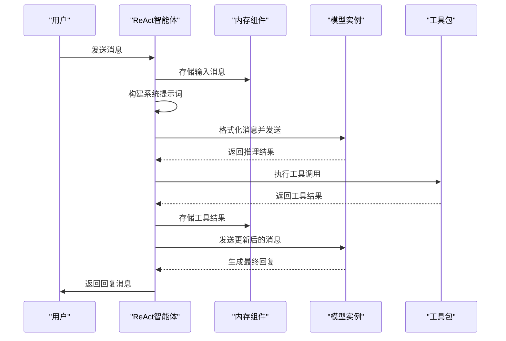
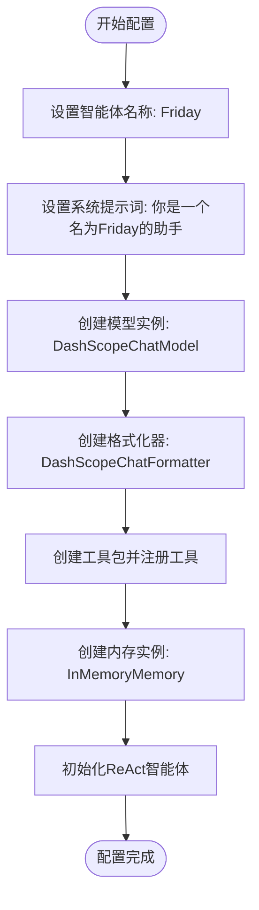
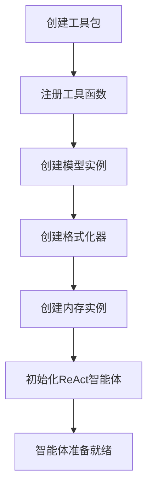

# 基础配置

<cite>
**本文档中引用的文件**  
- [main.py](file://examples/agent/react_agent/main.py)
- [_react_agent.py](file://src/agentscope/agent/_react_agent.py)
- [_react_agent_base.py](file://src/agentscope/agent/_react_agent_base.py)
- [_formatter_base.py](file://src/agentscope/formatter/_formatter_base.py)
- [_model_base.py](file://src/agentscope/model/_model_base.py)
- [_memory_base.py](file://src/agentscope/memory/_memory_base.py)
- [_toolkit.py](file://src/agentscope/tool/_toolkit.py)
- [_dashscope_formatter.py](file://src/agentscope/formatter/_dashscope_formatter.py)
- [_dashscope_model.py](file://src/agentscope/model/_dashscope_model.py)
- [_in_memory_memory.py](file://src/agentscope/memory/_in_memory_memory.py)
</cite>

## 目录
1. [简介](#简介)
2. [核心参数详解](#核心参数详解)
3. [参数协同工作机制](#参数协同工作机制)
4. [实际配置示例](#实际配置示例)
5. [组件初始化流程](#组件初始化流程)
6. [总结](#总结)

## 简介
ReAct智能体是一种基于推理和行动循环的智能代理架构，它通过系统化的配置参数来定义智能体的行为特征和功能能力。本文档详细解释了ReAct智能体基础配置中的核心参数，包括name、sys_prompt、model、formatter、toolkit、memory等，以及它们的配置方式和协同工作机制。

**Section sources**
- [main.py](file://examples/agent/react_agent/main.py#L1-L51)
- [_react_agent.py](file://src/agentscope/agent/_react_agent.py#L1-L867)

## 核心参数详解

### name参数
name参数用于定义智能体的名称标识，这个名称在对话历史和系统交互中作为智能体的身份标识。名称不仅用于区分不同的智能体实例，还在日志记录和调试过程中提供清晰的上下文信息。

**Section sources**
- [_react_agent.py](file://src/agentscope/agent/_react_agent.py#L79-L80)

### sys_prompt参数
sys_prompt参数是智能体的系统提示词，它定义了智能体的角色定位、行为准则和功能范围。系统提示词在每次回复生成时都会被包含在对话上下文中，确保智能体始终遵循预设的行为模式。

**Section sources**
- [_react_agent.py](file://src/agentscope/agent/_react_agent.py#L81-L82)

### model参数
model参数指定了用于生成回复的聊天模型实例，该模型必须继承自ChatModelBase基类。模型实例负责处理格式化后的消息并生成相应的回复内容，是智能体的核心计算引擎。

**Diagram sources**
- [_model_base.py](file://src/agentscope/model/_model_base.py#L13-L78)
- [_dashscope_model.py](file://src/agentscope/model/_dashscope_model.py#L47-L200)

### formatter参数
formatter参数指定了消息格式化器实例，该格式化器负责将消息对象转换为特定模型API所需的消息格式。格式化器必须继承自FormatterBase基类，确保消息格式与目标模型的API要求相匹配。

**Diagram sources**
- [_formatter_base.py](file://src/agentscope/formatter/_formatter_base.py#L11-L130)
- [_dashscope_formatter.py](file://src/agentscope/formatter/_dashscope_formatter.py#L147-L200)

### toolkit参数
toolkit参数是一个工具包实例，用于注册和管理可调用的工具函数。工具包允许智能体执行外部操作，如代码执行、文件操作和API调用，从而扩展其功能范围。

**Diagram sources**
- [_toolkit.py](file://src/agentscope/tool/_toolkit.py#L55-L200)

### memory参数
memory参数定义了用于存储对话历史的内存实例，该内存必须继承自MemoryBase基类。内存组件负责维护对话的上下文信息，确保智能体能够基于完整的对话历史生成连贯的回复。

**Diagram sources**
- [_memory_base.py](file://src/agentscope/memory/_memory_base.py#L11-L45)
- [_in_memory_memory.py](file://src/agentscope/memory/_in_memory_memory.py#L10-L123)

## 参数协同工作机制
ReAct智能体的核心参数通过精心设计的协同工作机制共同构建智能体的功能体系。当智能体接收到输入消息时，系统首先将消息添加到内存组件中，然后根据系统提示词、格式化器和模型实例的配置生成格式化的请求。在推理过程中，智能体可以调用工具包中注册的工具函数来执行外部操作，并将结果记录在内存中。

**Diagram sources**
- [_react_agent.py](file://src/agentscope/agent/_react_agent.py#L253-L408)

## 实际配置示例
以下是一个典型的ReAct智能体配置示例，展示了如何正确初始化各个基础组件：

**Diagram sources**
- [main.py](file://examples/agent/react_agent/main.py#L26-L38)

**Section sources**
- [main.py](file://examples/agent/react_agent/main.py#L18-L51)

## 组件初始化流程
ReAct智能体的初始化流程遵循严格的顺序，确保所有组件正确配置和关联。首先，系统创建工具包实例并注册所需的工具函数；然后，创建模型实例、格式化器实例和内存实例；最后，使用这些组件初始化ReAct智能体对象。

**Diagram sources**
- [_react_agent.py](file://src/agentscope/agent/_react_agent.py#L53-L226)

## 总结
ReAct智能体的基础配置参数通过紧密的协同工作，构建了一个功能完整、可扩展的智能代理系统。每个参数都有其特定的作用和配置方式，理解这些参数的含义和相互关系对于正确使用和定制ReAct智能体至关重要。通过合理配置这些基础组件，可以创建出满足不同应用场景需求的智能体实例。