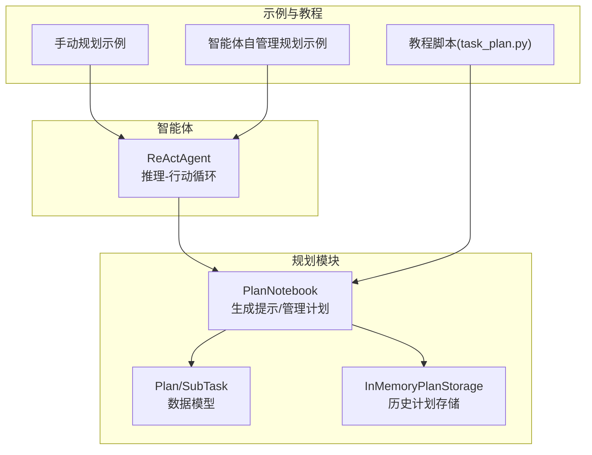
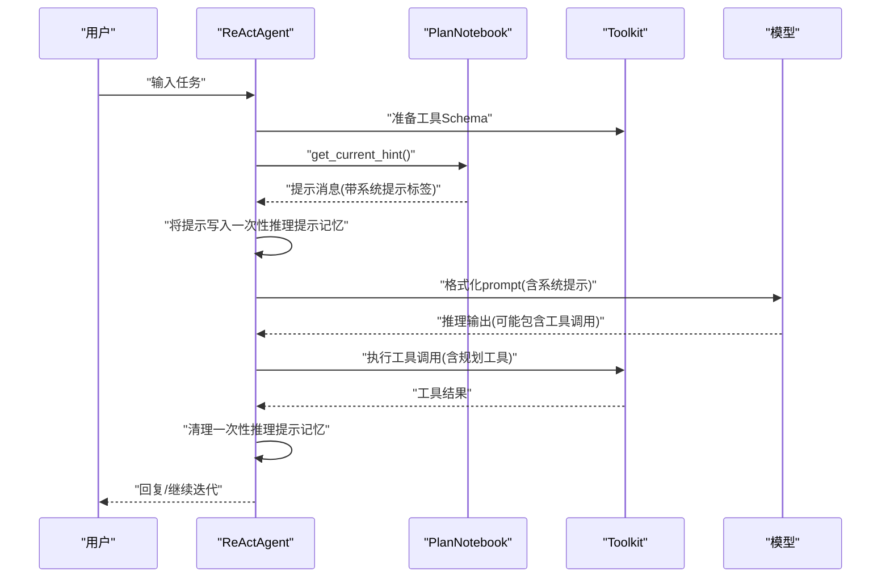
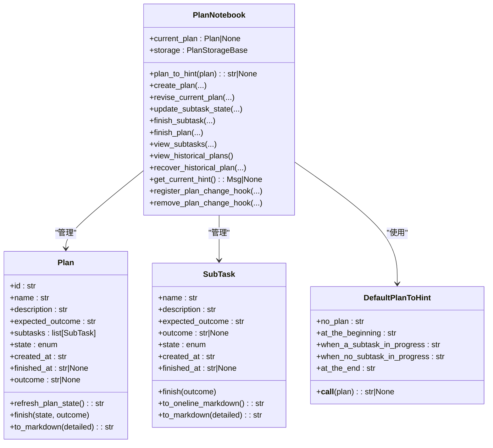
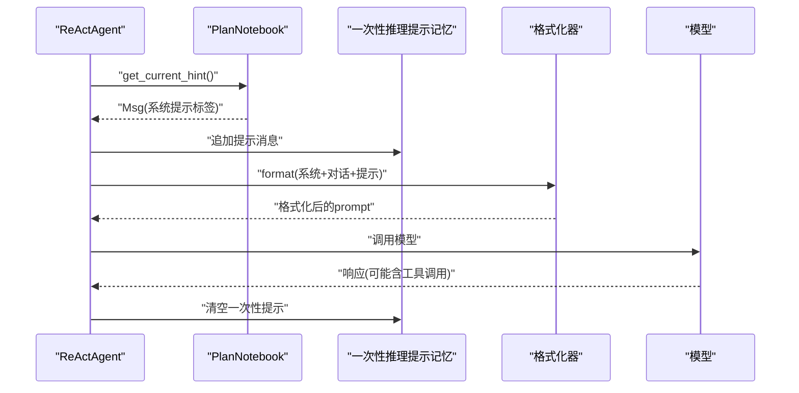
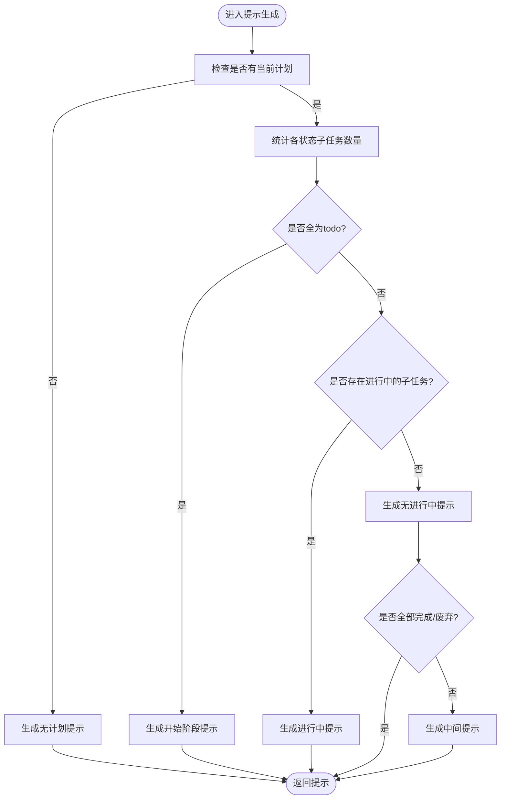
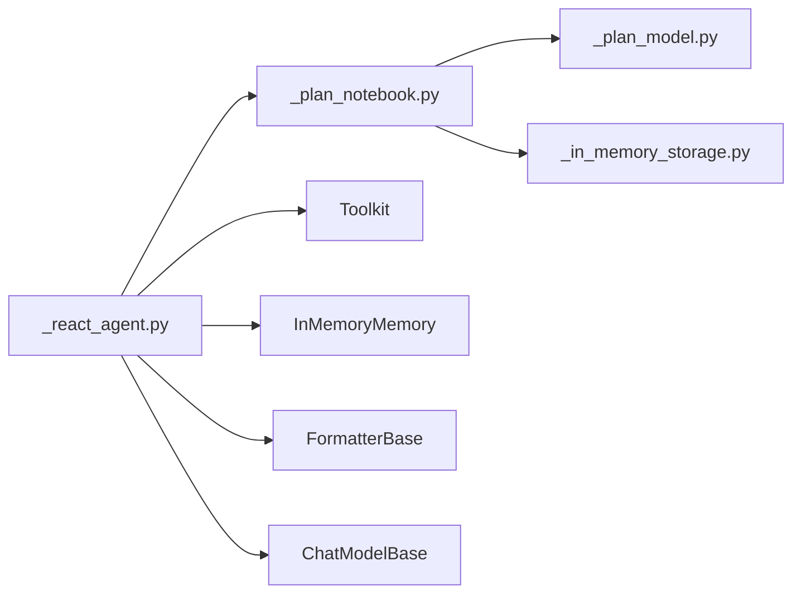

# 规划系统配置

<cite>
**本文引用的文件**
- [src/agentscope/plan/_plan_notebook.py](file://src/agentscope/plan/_plan_notebook.py)
- [src/agentscope/plan/_plan_model.py](file://src/agentscope/plan/_plan_model.py)
- [src/agentscope/plan/_in_memory_storage.py](file://src/agentscope/plan/_in_memory_storage.py)
- [src/agentscope/agent/_react_agent.py](file://src/agentscope/agent/_react_agent.py)
- [examples/functionality/plan/main_manual_plan.py](file://examples/functionality/plan/main_manual_plan.py)
- [examples/functionality/plan/main_agent_managed_plan.py](file://examples/functionality/plan/main_agent_managed_plan.py)
- [docs/tutorial/en/src/task_plan.py](file://docs/tutorial/en/src/task_plan.py)
- [tests/plan_test.py](file://tests/plan_test.py)
</cite>

## 目录
1. [简介](#简介)
2. [项目结构](#项目结构)
3. [核心组件](#核心组件)
4. [架构总览](#架构总览)
5. [详细组件分析](#详细组件分析)
6. [依赖关系分析](#依赖关系分析)
7. [性能考量](#性能考量)
8. [故障排查指南](#故障排查指南)
9. [结论](#结论)
10. [附录](#附录)

## 简介
本文件面向希望在AgentScope中启用ReAct智能体的“任务规划”能力的开发者，系统性说明如何通过plan_notebook参数集成规划功能，使智能体能够将复杂任务分解为可执行的子任务序列，并在推理-行动循环中持续接收“推理提示”以指导下一步行为。文档重点覆盖：
- plan_notebook参数如何接入ReActAgent并注入规划工具与提示
- 规划系统如何生成推理提示并驱动智能体行为
- 如何配置规划笔记本（PlanNotebook），并结合示例演示从“手动规划”到“智能体自管理规划”的完整流程
- 多步骤任务的分解、进度跟踪与状态管理

## 项目结构
围绕规划系统的关键代码位于src/agentscope/plan目录，ReAct智能体在src/agentscope/agent中集成规划能力；示例与教程分别位于examples与docs/tutorials中。

图表来源
- [src/agentscope/plan/_plan_notebook.py](file://src/agentscope/plan/_plan_notebook.py#L172-L231)
- [src/agentscope/plan/_plan_model.py](file://src/agentscope/plan/_plan_model.py#L11-L201)
- [src/agentscope/plan/_in_memory_storage.py](file://src/agentscope/plan/_in_memory_storage.py#L9-L71)
- [src/agentscope/agent/_react_agent.py](file://src/agentscope/agent/_react_agent.py#L195-L219)
- [examples/functionality/plan/main_manual_plan.py](file://examples/functionality/plan/main_manual_plan.py#L23-L102)
- [examples/functionality/plan/main_agent_managed_plan.py](file://examples/functionality/plan/main_agent_managed_plan.py#L21-L66)
- [docs/tutorial/en/src/task_plan.py](file://docs/tutorial/en/src/task_plan.py#L1-L120)

章节来源
- [src/agentscope/plan/_plan_notebook.py](file://src/agentscope/plan/_plan_notebook.py#L172-L231)
- [src/agentscope/plan/_plan_model.py](file://src/agentscope/plan/_plan_model.py#L11-L201)
- [src/agentscope/plan/_in_memory_storage.py](file://src/agentscope/plan/_in_memory_storage.py#L9-L71)
- [src/agentscope/agent/_react_agent.py](file://src/agentscope/agent/_react_agent.py#L195-L219)
- [examples/functionality/plan/main_manual_plan.py](file://examples/functionality/plan/main_manual_plan.py#L23-L102)
- [examples/functionality/plan/main_agent_managed_plan.py](file://examples/functionality/plan/main_agent_managed_plan.py#L21-L66)
- [docs/tutorial/en/src/task_plan.py](file://docs/tutorial/en/src/task_plan.py#L1-L120)

## 核心组件
- PlanNotebook：规划笔记本，负责提供计划管理工具函数、生成推理提示、维护当前计划与历史计划存储，并支持变更钩子用于可视化与监控。
- Plan/SubTask：计划与子任务的数据模型，包含名称、描述、期望结果、状态、时间戳等字段，并提供Markdown导出能力。
- InMemoryPlanStorage：默认的历史计划存储，支持添加、删除、查询与序列化/反序列化。
- ReActAgent：在构造时接收plan_notebook参数，自动注册规划工具函数，并在每次推理前注入由PlanNotebook生成的提示消息，从而指导下一步行动。

章节来源
- [src/agentscope/plan/_plan_notebook.py](file://src/agentscope/plan/_plan_notebook.py#L172-L231)
- [src/agentscope/plan/_plan_model.py](file://src/agentscope/plan/_plan_model.py#L11-L201)
- [src/agentscope/plan/_in_memory_storage.py](file://src/agentscope/plan/_in_memory_storage.py#L9-L71)
- [src/agentscope/agent/_react_agent.py](file://src/agentscope/agent/_react_agent.py#L195-L219)

## 架构总览
ReActAgent与PlanNotebook的交互路径如下：
- ReActAgent在初始化时根据是否提供plan_notebook，决定是否注册规划工具函数到其Toolkit中。
- 在每次推理阶段，ReActAgent会请求PlanNotebook生成当前提示（get_current_hint），并将提示消息加入一次性使用的“推理提示记忆”，随后清理，确保提示仅在当次推理有效。
- PlanNotebook根据当前Plan的状态（是否存在、子任务状态分布）动态生成提示内容，提示被封装为消息对象，包含系统提示标签，便于模型识别。

图表来源
- [src/agentscope/agent/_react_agent.py](file://src/agentscope/agent/_react_agent.py#L411-L441)
- [src/agentscope/plan/_plan_notebook.py](file://src/agentscope/plan/_plan_notebook.py#L847-L859)

章节来源
- [src/agentscope/agent/_react_agent.py](file://src/agentscope/agent/_react_agent.py#L411-L441)
- [src/agentscope/plan/_plan_notebook.py](file://src/agentscope/plan/_plan_notebook.py#L847-L859)

## 详细组件分析

### PlanNotebook：规划笔记本
- 职责
  - 管理当前计划（current_plan），提供创建、修订、完成计划等工具函数
  - 生成推理提示（get_current_hint），依据当前计划状态与子任务状态生成不同阶段的提示
  - 维护历史计划存储（默认InMemoryPlanStorage），支持查看与恢复历史计划
  - 变更钩子（register_plan_change_hook/remove_plan_change_hook），用于可视化与监控
- 关键方法
  - create_plan/recover_historical_plan/finish_plan：计划生命周期管理
  - revise_current_plan/update_subtask_state/finish_subtask：子任务状态流转与校验
  - view_subtasks/view_historical_plans：查看与审计
  - get_current_hint：生成提示消息
  - register_plan_change_hook/remove_plan_change_hook：变更通知
- 默认提示生成器DefaultPlanToHint
  - 根据“无计划/刚开始/有子任务进行中/无子任务进行但已完成若干/全部完成”五种场景生成不同提示
  - 提示内容包裹在系统提示标签内，便于模型识别

图表来源
- [src/agentscope/plan/_plan_notebook.py](file://src/agentscope/plan/_plan_notebook.py#L16-L171)
- [src/agentscope/plan/_plan_notebook.py](file://src/agentscope/plan/_plan_notebook.py#L172-L888)
- [src/agentscope/plan/_plan_model.py](file://src/agentscope/plan/_plan_model.py#L11-L201)

章节来源
- [src/agentscope/plan/_plan_notebook.py](file://src/agentscope/plan/_plan_notebook.py#L16-L171)
- [src/agentscope/plan/_plan_notebook.py](file://src/agentscope/plan/_plan_notebook.py#L172-L888)
- [src/agentscope/plan/_plan_model.py](file://src/agentscope/plan/_plan_model.py#L11-L201)

### ReActAgent与规划集成
- 初始化集成
  - 若传入plan_notebook，则ReActAgent会将其提供的所有规划工具函数注册到Toolkit中；若开启元工具开关，则规划工具会被放入“plan_related”分组，由智能体按需激活
- 推理阶段注入提示
  - 每次推理前，ReActAgent调用plan_notebook.get_current_hint()，将提示消息加入一次性推理提示记忆，随后格式化prompt时携带该提示
  - 提示消息在推理后被清空，保证提示的“一次性使用”
- 行动阶段
  - 智能体执行工具调用（含规划工具），并在需要时生成结构化输出

图表来源
- [src/agentscope/agent/_react_agent.py](file://src/agentscope/agent/_react_agent.py#L411-L441)
- [src/agentscope/agent/_react_agent.py](file://src/agentscope/agent/_react_agent.py#L209-L219)
- [src/agentscope/plan/_plan_notebook.py](file://src/agentscope/plan/_plan_notebook.py#L847-L859)

章节来源
- [src/agentscope/agent/_react_agent.py](file://src/agentscope/agent/_react_agent.py#L195-L219)
- [src/agentscope/agent/_react_agent.py](file://src/agentscope/agent/_react_agent.py#L411-L441)
- [src/agentscope/plan/_plan_notebook.py](file://src/agentscope/plan/_plan_notebook.py#L847-L859)

### 规划提示生成逻辑
DefaultPlanToHint根据当前Plan状态与子任务状态分布，选择不同的提示模板：
- 无计划：引导用户先创建计划
- 刚开始：列出当前计划，指导将首个子任务置为“进行中”
- 子任务进行中：给出当前子任务详情与选项
- 无子任务进行但已完成若干：建议激活下一个子任务或修订计划
- 全部完成：建议完成计划并总结

图表来源
- [src/agentscope/plan/_plan_notebook.py](file://src/agentscope/plan/_plan_notebook.py#L16-L171)

章节来源
- [src/agentscope/plan/_plan_notebook.py](file://src/agentscope/plan/_plan_notebook.py#L16-L171)

### 配置与使用示例

#### 示例一：手动规划（开发者指定计划）
- 步骤
  - 创建PlanNotebook实例
  - 使用create_plan创建计划（包含名称、描述、期望结果、子任务列表）
  - 将PlanNotebook传入ReActAgent构造函数
  - 启动交互循环，智能体按计划逐步执行
- 关键点
  - 子任务按顺序执行，状态严格遵循“完成→下一个子任务置为进行中”的规则
  - 可通过view_subtasks查看子任务详情，通过update_subtask_state/finish_subtask更新状态

章节来源
- [examples/functionality/plan/main_manual_plan.py](file://examples/functionality/plan/main_manual_plan.py#L23-L102)
- [tests/plan_test.py](file://tests/plan_test.py#L137-L167)

#### 示例二：智能体自管理规划（智能体自主创建与修订计划）
- 步骤
  - 创建Toolkit并注册常用工具函数
  - 以PlanNotebook实例初始化ReActAgent，可选开启元工具开关
  - 用户输入复杂任务，智能体根据提示生成计划并逐步推进
- 关键点
  - 智能体可调用规划工具函数（如create_plan、revise_current_plan、finish_subtask等）来自行管理计划
  - 通过元工具开关可按需激活规划工具组

章节来源
- [examples/functionality/plan/main_agent_managed_plan.py](file://examples/functionality/plan/main_agent_managed_plan.py#L21-L66)
- [docs/tutorial/en/src/task_plan.py](file://docs/tutorial/en/src/task_plan.py#L144-L217)

## 依赖关系分析
- PlanNotebook依赖
  - Plan/SubTask：数据模型
  - InMemoryPlanStorage：历史计划存储（默认）
  - StateModule：状态注册与序列化
  - Message/ToolResponse：提示消息与工具返回封装
- ReActAgent依赖
  - PlanNotebook：注入规划工具与提示
  - Toolkit：注册规划工具函数
  - InMemoryMemory：一次性推理提示记忆
  - FormatterBase/ChatModelBase：格式化prompt与调用模型

图表来源
- [src/agentscope/plan/_plan_notebook.py](file://src/agentscope/plan/_plan_notebook.py#L172-L231)
- [src/agentscope/plan/_plan_model.py](file://src/agentscope/plan/_plan_model.py#L11-L201)
- [src/agentscope/plan/_in_memory_storage.py](file://src/agentscope/plan/_in_memory_storage.py#L9-L71)
- [src/agentscope/agent/_react_agent.py](file://src/agentscope/agent/_react_agent.py#L195-L219)

章节来源
- [src/agentscope/plan/_plan_notebook.py](file://src/agentscope/plan/_plan_notebook.py#L172-L231)
- [src/agentscope/plan/_plan_model.py](file://src/agentscope/plan/_plan_model.py#L11-L201)
- [src/agentscope/plan/_in_memory_storage.py](file://src/agentscope/plan/_in_memory_storage.py#L9-L71)
- [src/agentscope/agent/_react_agent.py](file://src/agentscope/agent/_react_agent.py#L195-L219)

## 性能考量
- 提示生成开销：DefaultPlanToHint在每次推理前计算子任务状态分布，复杂度与子任务数量线性相关，通常可忽略
- 工具调用并发：ReActAgent支持并行工具调用，规划工具本身为同步/异步函数，实际性能取决于具体工具实现
- 存储与序列化：InMemoryPlanStorage为内存存储，适合开发与小规模使用；大规模或持久化需求建议实现自定义PlanStorageBase
- 提示消息大小：提示消息包含当前计划/子任务的Markdown摘要，建议控制子任务数量与描述长度，避免prompt过长

## 故障排查指南
- “尚未创建计划”错误
  - 现象：调用规划工具时报错，提示需要先创建计划
  - 处理：在首次使用前调用create_plan创建计划，或在智能体自管理模式下让智能体自行创建
- 子任务状态流转异常
  - 现象：尝试将非首个子任务置为“进行中”失败，或同时存在多个“进行中”子任务
  - 处理：确保按顺序完成前置子任务；同一时刻仅允许一个子任务处于“进行中”
- 完成子任务顺序错误
  - 现象：finish_subtask报错，提示需先完成前置子任务
  - 处理：先调用finish_subtask完成前置子任务，再继续后续步骤
- 历史计划恢复冲突
  - 现象：恢复历史计划时当前计划被中断并记录为废弃
  - 处理：确认恢复操作会覆盖当前计划，必要时先保存当前计划状态

章节来源
- [tests/plan_test.py](file://tests/plan_test.py#L249-L286)
- [src/agentscope/plan/_plan_notebook.py](file://src/agentscope/plan/_plan_notebook.py#L428-L541)
- [src/agentscope/plan/_plan_notebook.py](file://src/agentscope/plan/_plan_notebook.py#L543-L647)
- [src/agentscope/plan/_plan_notebook.py](file://src/agentscope/plan/_plan_notebook.py#L757-L800)

## 结论
通过plan_notebook参数，ReActAgent实现了“任务规划”的一体化集成：开发者可选择手动规划或让智能体自管理规划；规划系统以提示消息的形式在推理阶段指导智能体行为，配合严格的子任务状态机，确保复杂任务的有序分解与执行。借助历史计划存储与变更钩子，系统具备良好的可审计性与可视化扩展能力。

## 附录

### 配置要点清单
- 初始化ReActAgent时传入PlanNotebook实例
- 若开启元工具开关，规划工具将被归入“plan_related”分组，按需激活
- 在推理前，ReActAgent会自动注入PlanNotebook生成的提示消息
- 使用create_plan/revise_current_plan/finish_subtask等工具管理计划与子任务
- 通过view_historical_plans/recover_historical_plan进行审计与恢复

章节来源
- [src/agentscope/agent/_react_agent.py](file://src/agentscope/agent/_react_agent.py#L195-L219)
- [src/agentscope/plan/_plan_notebook.py](file://src/agentscope/plan/_plan_notebook.py#L232-L888)
- [docs/tutorial/en/src/task_plan.py](file://docs/tutorial/en/src/task_plan.py#L144-L217)