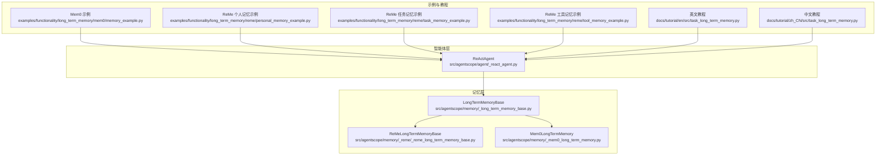
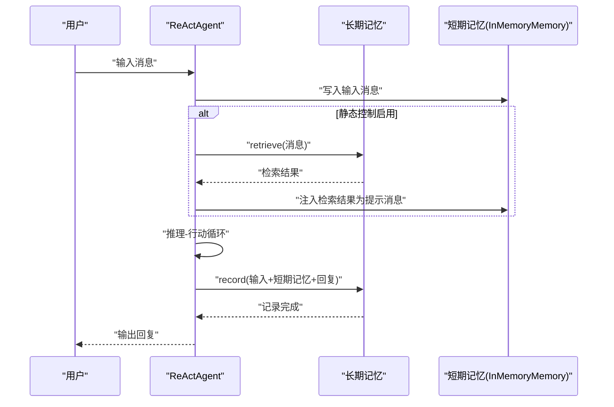
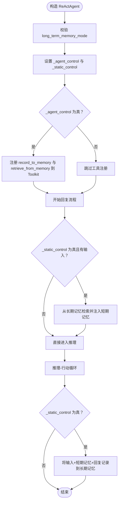
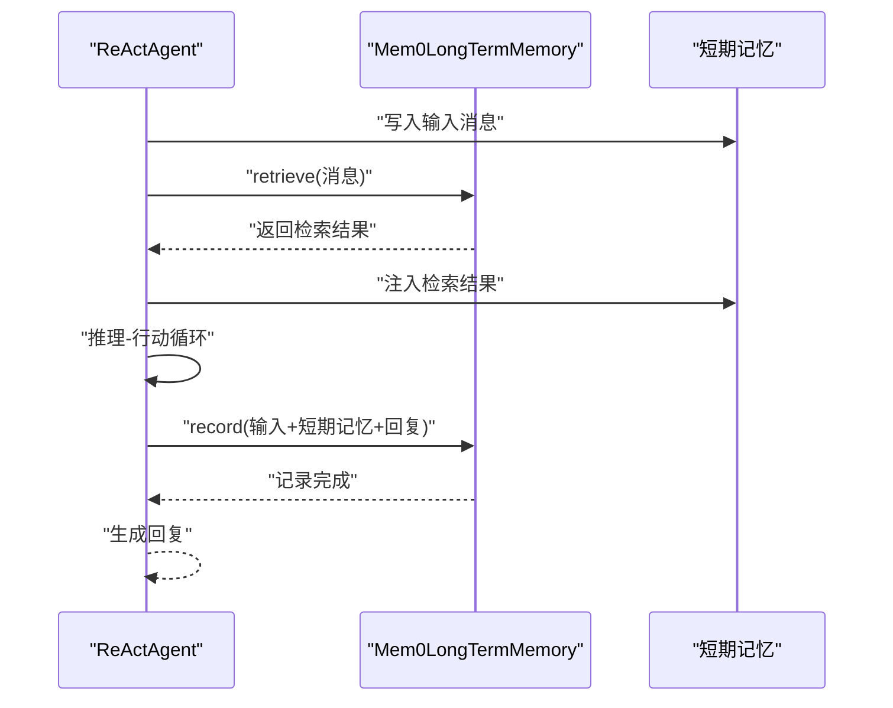
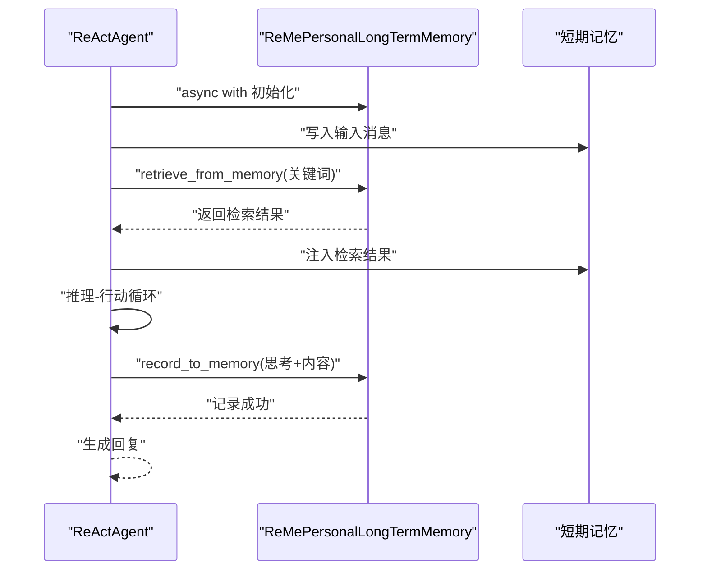
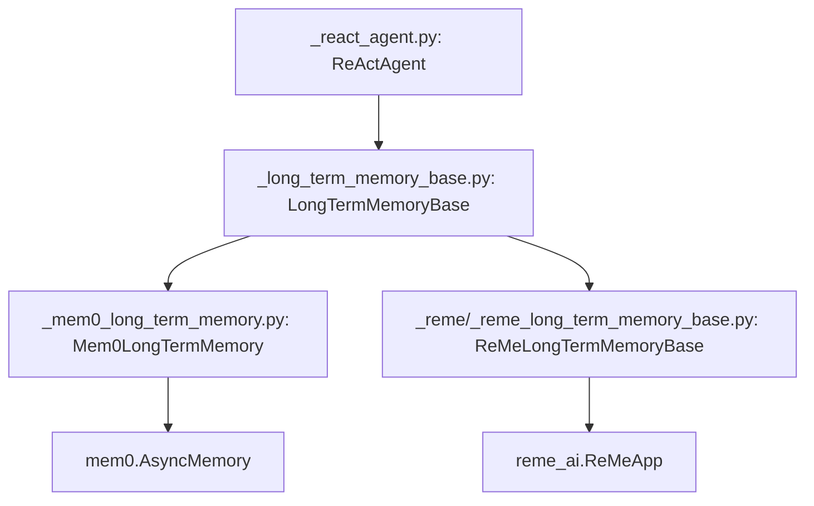

# 记忆系统配置

<cite>
**本文引用的文件**
- [src/agentscope/agent/_react_agent.py](file://src/agentscope/agent/_react_agent.py)
- [src/agentscope/memory/_long_term_memory_base.py](file://src/agentscope/memory/_long_term_memory_base.py)
- [src/agentscope/memory/_reme/_reme_long_term_memory_base.py](file://src/agentscope/memory/_reme/_reme_long_term_memory_base.py)
- [src/agentscope/memory/_mem0_long_term_memory.py](file://src/agentscope/memory/_mem0_long_term_memory.py)
- [examples/functionality/long_term_memory/mem0/memory_example.py](file://examples/functionality/long_term_memory/mem0/memory_example.py)
- [examples/functionality/long_term_memory/reme/personal_memory_example.py](file://examples/functionality/long_term_memory/reme/personal_memory_example.py)
- [examples/functionality/long_term_memory/reme/task_memory_example.py](file://examples/functionality/long_term_memory/reme/task_memory_example.py)
- [examples/functionality/long_term_memory/reme/tool_memory_example.py](file://examples/functionality/long_term_memory/reme/tool_memory_example.py)
- [examples/functionality/long_term_memory/reme/README.md](file://examples/functionality/long_term_memory/reme/README.md)
- [docs/tutorial/en/src/task_long_term_memory.py](file://docs/tutorial/en/src/task_long_term_memory.py)
- [docs/tutorial/zh_CN/src/task_long_term_memory.py](file://docs/tutorial/zh_CN/src/task_long_term_memory.py)
</cite>

## 目录
1. [简介](#简介)
2. [项目结构](#项目结构)
3. [核心组件](#核心组件)
4. [架构总览](#架构总览)
5. [详细组件分析](#详细组件分析)
6. [依赖关系分析](#依赖关系分析)
7. [性能考量](#性能考量)
8. [故障排查指南](#故障排查指南)
9. [结论](#结论)
10. [附录](#附录)

## 简介
本文件围绕 ReAct 智能体的记忆系统配置展开，重点解释 long_term_memory 参数如何集成长期记忆系统，以及 long_term_memory_mode 参数的三种模式（agent_control、static_control、both）的具体行为差异。文档通过代码级分析与示例路径，说明智能体在不同模式下与长期记忆交互的时机与流程，帮助读者理解知识持久化能力的来源与边界。

## 项目结构
与 ReAct 智能体长期记忆相关的模块主要分布在以下位置：
- ReActAgent 实现与交互逻辑：src/agentscope/agent/_react_agent.py
- 长期记忆基类与接口：src/agentscope/memory/_long_term_memory_base.py
- ReMe 长期记忆实现（ReAct 集成示例）：src/agentscope/memory/_reme/_reme_long_term_memory_base.py 及其具体子类
- Mem0 长期记忆实现（ReAct 集成示例）：src/agentscope/memory/_mem0_long_term_memory.py
- 示例与教程：examples/functionality/long_term_memory/* 与 docs/tutorial/*/task_long_term_memory.py

图表来源
- [src/agentscope/agent/_react_agent.py](file://src/agentscope/agent/_react_agent.py#L53-L120)
- [src/agentscope/memory/_long_term_memory_base.py](file://src/agentscope/memory/_long_term_memory_base.py#L11-L95)
- [src/agentscope/memory/_reme/_reme_long_term_memory_base.py](file://src/agentscope/memory/_reme/_reme_long_term_memory_base.py#L83-L120)
- [src/agentscope/memory/_mem0_long_term_memory.py](file://src/agentscope/memory/_mem0_long_term_memory.py#L73-L120)
- [examples/functionality/long_term_memory/mem0/memory_example.py](file://examples/functionality/long_term_memory/mem0/memory_example.py#L26-L60)
- [examples/functionality/long_term_memory/reme/personal_memory_example.py](file://examples/functionality/long_term_memory/reme/personal_memory_example.py#L245-L296)
- [examples/functionality/long_term_memory/reme/task_memory_example.py](file://examples/functionality/long_term_memory/reme/task_memory_example.py#L285-L343)
- [examples/functionality/long_term_memory/reme/tool_memory_example.py](file://examples/functionality/long_term_memory/reme/tool_memory_example.py#L347-L437)
- [docs/tutorial/en/src/task_long_term_memory.py](file://docs/tutorial/en/src/task_long_term_memory.py#L270-L330)
- [docs/tutorial/zh_CN/src/task_long_term_memory.py](file://docs/tutorial/zh_CN/src/task_long_term_memory.py#L270-L330)

章节来源
- [src/agentscope/agent/_react_agent.py](file://src/agentscope/agent/_react_agent.py#L53-L120)
- [src/agentscope/memory/_long_term_memory_base.py](file://src/agentscope/memory/_long_term_memory_base.py#L11-L95)

## 核心组件
- ReActAgent：负责推理-行动循环，按模式决定是否注册工具函数、何时检索/记录长期记忆，并在回复前后执行静态控制的记录。
- LongTermMemoryBase：定义长期记忆的统一接口，包括 record、retrieve、record_to_memory、retrieve_from_memory 四个方法。
- ReMeLongTermMemoryBase：基于 ReMe 框架的长期记忆基类，提供模型与嵌入模型配置、异步上下文管理等能力。
- Mem0LongTermMemory：基于 mem0 的长期记忆实现，支持向量存储、检索、记录与关系格式化等。

章节来源
- [src/agentscope/agent/_react_agent.py](file://src/agentscope/agent/_react_agent.py#L53-L120)
- [src/agentscope/memory/_long_term_memory_base.py](file://src/agentscope/memory/_long_term_memory_base.py#L11-L95)
- [src/agentscope/memory/_reme/_reme_long_term_memory_base.py](file://src/agentscope/memory/_reme/_reme_long_term_memory_base.py#L83-L120)
- [src/agentscope/memory/_mem0_long_term_memory.py](file://src/agentscope/memory/_mem0_long_term_memory.py#L73-L120)

## 架构总览
ReActAgent 与长期记忆的交互遵循如下流程：
- 构造阶段：根据 long_term_memory_mode 决定是否注册工具函数（record_to_memory、retrieve_from_memory），并设置静态/代理控制标志。
- 推理阶段：在每次回复前，若启用静态控制，则从长期记忆检索并注入到短期记忆；随后进入推理-行动循环。
- 行动阶段：根据工具调用结果更新短期记忆；若启用代理控制，智能体可自主调用工具记录/检索。
- 后处理阶段：若启用静态控制，将输入消息、短期记忆与最终回复合并后记录到长期记忆。

图表来源
- [src/agentscope/agent/_react_agent.py](file://src/agentscope/agent/_react_agent.py#L137-L180)
- [src/agentscope/agent/_react_agent.py](file://src/agentscope/agent/_react_agent.py#L399-L408)
- [src/agentscope/agent/_react_agent.py](file://src/agentscope/agent/_react_agent.py#L741-L766)

## 详细组件分析

### ReActAgent 与 long_term_memory_mode 的行为差异
- 参数定义与断言：long_term_memory_mode 必须为 "agent_control"、"static_control" 或 "both" 之一。
- 控制标志：
  - _agent_control：当 long_term_memory_mode 为 "agent_control" 或 "both" 时启用，用于在工具层面开放 record_to_memory 与 retrieve_from_memory。
  - _static_control：当 long_term_memory_mode 为 "static_control" 或 "both" 时启用，用于在回复前后自动检索与记录。
- 工具注册：当 _agent_control 为真时，将 record_to_memory 与 retrieve_from_memory 注册进 Toolkit，允许智能体在推理过程中自主调用。
- 静态控制检索：在 reply 开始时调用 _retrieve_from_long_term_memory，将检索到的内容作为提示消息注入短期记忆。
- 静态控制记录：在 reply 结束时调用 long_term_memory.record，将输入消息、短期记忆与最终回复合并后记录到长期记忆。

图表来源
- [src/agentscope/agent/_react_agent.py](file://src/agentscope/agent/_react_agent.py#L137-L180)
- [src/agentscope/agent/_react_agent.py](file://src/agentscope/agent/_react_agent.py#L253-L409)
- [src/agentscope/agent/_react_agent.py](file://src/agentscope/agent/_react_agent.py#L741-L766)

章节来源
- [src/agentscope/agent/_react_agent.py](file://src/agentscope/agent/_react_agent.py#L53-L120)
- [src/agentscope/agent/_react_agent.py](file://src/agentscope/agent/_react_agent.py#L137-L180)
- [src/agentscope/agent/_react_agent.py](file://src/agentscope/agent/_react_agent.py#L253-L409)
- [src/agentscope/agent/_react_agent.py](file://src/agentscope/agent/_react_agent.py#L741-L766)

### 长期记忆接口与实现
- LongTermMemoryBase：定义 record、retrieve、record_to_memory、retrieve_from_memory 四个方法，分别用于开发者控制的记录/检索与智能体自主控制的记录/检索。
- ReMeLongTermMemoryBase：封装 ReMe 应用初始化、模型与嵌入模型配置、异步上下文管理（__aenter__/__aexit__），并提供 agent_name、workspace_id、run_name 等标识。
- Mem0LongTermMemory：
  - 支持 record 与 retrieve（开发者控制）；
  - 支持 record_to_memory 与 retrieve_from_memory（智能体控制）；
  - 内部采用 mem0.AsyncMemory，支持向量存储、检索与关系格式化；
  - 提供默认记忆类型与元数据过滤（agent_id、user_id、run_id）。

章节来源
- [src/agentscope/memory/_long_term_memory_base.py](file://src/agentscope/memory/_long_term_memory_base.py#L11-L95)
- [src/agentscope/memory/_reme/_reme_long_term_memory_base.py](file://src/agentscope/memory/_reme/_reme_long_term_memory_base.py#L83-L120)
- [src/agentscope/memory/_mem0_long_term_memory.py](file://src/agentscope/memory/_mem0_long_term_memory.py#L73-L120)
- [src/agentscope/memory/_mem0_long_term_memory.py](file://src/agentscope/memory/_mem0_long_term_memory.py#L258-L450)
- [src/agentscope/memory/_mem0_long_term_memory.py](file://src/agentscope/memory/_mem0_long_term_memory.py#L560-L624)

### 不同模式下的交互时机与示例路径
- agent_control 模式
  - 行为：在构造时注册 record_to_memory 与 retrieve_from_memory 为工具函数，允许智能体在推理过程中自主调用。
  - 示例路径：
    - 英文教程示例：[docs/tutorial/en/src/task_long_term_memory.py](file://docs/tutorial/en/src/task_long_term_memory.py#L280-L327)
    - 中文教程示例：[docs/tutorial/zh_CN/src/task_long_term_memory.py](file://docs/tutorial/zh_CN/src/task_long_term_memory.py#L277-L308)
    - ReMe 个人记忆示例（both 模式）：[examples/functionality/long_term_memory/reme/personal_memory_example.py](file://examples/functionality/long_term_memory/reme/personal_memory_example.py#L157-L242)
    - ReMe 任务记忆示例（both 模式）：[examples/functionality/long_term_memory/reme/task_memory_example.py](file://examples/functionality/long_term_memory/reme/task_memory_example.py#L185-L290)
    - ReMe 工具记忆示例（both 模式）：[examples/functionality/long_term_memory/reme/tool_memory_example.py](file://examples/functionality/long_term_memory/reme/tool_memory_example.py#L265-L346)
- static_control 模式
  - 行为：不注册工具函数，但在每次回复前后自动执行检索与记录（检索在回复前，记录在回复后）。
  - 示例路径：
    - Mem0 集成示例（both 模式演示）：[examples/functionality/long_term_memory/mem0/memory_example.py](file://examples/functionality/long_term_memory/mem0/memory_example.py#L136-L181)
- both 模式
  - 行为：同时具备 agent_control 与 static_control 的能力，既可智能体自主控制，也可在回复前后自动处理。

章节来源
- [docs/tutorial/en/src/task_long_term_memory.py](file://docs/tutorial/en/src/task_long_term_memory.py#L270-L330)
- [docs/tutorial/zh_CN/src/task_long_term_memory.py](file://docs/tutorial/zh_CN/src/task_long_term_memory.py#L270-L330)
- [examples/functionality/long_term_memory/mem0/memory_example.py](file://examples/functionality/long_term_memory/mem0/memory_example.py#L136-L181)
- [examples/functionality/long_term_memory/reme/personal_memory_example.py](file://examples/functionality/long_term_memory/reme/personal_memory_example.py#L157-L242)
- [examples/functionality/long_term_memory/reme/task_memory_example.py](file://examples/functionality/long_term_memory/reme/task_memory_example.py#L185-L290)
- [examples/functionality/long_term_memory/reme/tool_memory_example.py](file://examples/functionality/long_term_memory/reme/tool_memory_example.py#L265-L346)

### ReActAgent 与 Mem0 集成的关键流程
- 构造：传入 Mem0LongTermMemory 实例与 long_term_memory_mode。
- 静态控制检索：在回复前调用 retrieve，将检索结果注入短期记忆。
- 静态控制记录：在回复后调用 record，将输入、短期记忆与回复合并记录到长期记忆。
- 智能体控制：当模式为 agent_control 或 both 时，智能体可通过工具调用 record_to_memory 与 retrieve_from_memory。

图表来源
- [src/agentscope/agent/_react_agent.py](file://src/agentscope/agent/_react_agent.py#L253-L409)
- [src/agentscope/memory/_mem0_long_term_memory.py](file://src/agentscope/memory/_mem0_long_term_memory.py#L451-L559)
- [src/agentscope/memory/_mem0_long_term_memory.py](file://src/agentscope/memory/_mem0_long_term_memory.py#L560-L624)

章节来源
- [src/agentscope/agent/_react_agent.py](file://src/agentscope/agent/_react_agent.py#L253-L409)
- [src/agentscope/memory/_mem0_long_term_memory.py](file://src/agentscope/memory/_mem0_long_term_memory.py#L451-L559)
- [src/agentscope/memory/_mem0_long_term_memory.py](file://src/agentscope/memory/_mem0_long_term_memory.py#L560-L624)

### ReActAgent 与 ReMe 集成的关键流程
- ReMeLongTermMemoryBase 提供异步上下文管理，需在使用前通过 async with 初始化。
- ReActAgent 在构造时根据 long_term_memory_mode 注册工具函数（both/agent_control）。
- 示例中展示了 both 模式下智能体通过工具调用 record_to_memory 与 retrieve_from_memory 的完整交互。

图表来源
- [src/agentscope/memory/_reme/_reme_long_term_memory_base.py](file://src/agentscope/memory/_reme/_reme_long_term_memory_base.py#L293-L371)
- [examples/functionality/long_term_memory/reme/personal_memory_example.py](file://examples/functionality/long_term_memory/reme/personal_memory_example.py#L157-L242)
- [examples/functionality/long_term_memory/reme/README.md](file://examples/functionality/long_term_memory/reme/README.md#L165-L196)

章节来源
- [src/agentscope/memory/_reme/_reme_long_term_memory_base.py](file://src/agentscope/memory/_reme/_reme_long_term_memory_base.py#L293-L371)
- [examples/functionality/long_term_memory/reme/personal_memory_example.py](file://examples/functionality/long_term_memory/reme/personal_memory_example.py#L157-L242)
- [examples/functionality/long_term_memory/reme/README.md](file://examples/functionality/long_term_memory/reme/README.md#L165-L196)

## 依赖关系分析
- ReActAgent 依赖 LongTermMemoryBase 接口，具体实现可为 Mem0LongTermMemory 或 ReMeLongTermMemory（通过 ReMeLongTermMemoryBase 继承）。
- Mem0LongTermMemory 依赖 mem0.AsyncMemory 与向量存储配置，支持检索与记录。
- ReMeLongTermMemoryBase 依赖 reme_ai 的 ReMeApp，提供异步上下文管理与模型/嵌入配置。

图表来源
- [src/agentscope/agent/_react_agent.py](file://src/agentscope/agent/_react_agent.py#L53-L120)
- [src/agentscope/memory/_long_term_memory_base.py](file://src/agentscope/memory/_long_term_memory_base.py#L11-L95)
- [src/agentscope/memory/_mem0_long_term_memory.py](file://src/agentscope/memory/_mem0_long_term_memory.py#L73-L120)
- [src/agentscope/memory/_reme/_reme_long_term_memory_base.py](file://src/agentscope/memory/_reme/_reme_long_term_memory_base.py#L83-L120)

章节来源
- [src/agentscope/agent/_react_agent.py](file://src/agentscope/agent/_react_agent.py#L53-L120)
- [src/agentscope/memory/_mem0_long_term_memory.py](file://src/agentscope/memory/_mem0_long_term_memory.py#L73-L120)
- [src/agentscope/memory/_reme/_reme_long_term_memory_base.py](file://src/agentscope/memory/_reme/_reme_long_term_memory_base.py#L83-L120)

## 性能考量
- 检索与记录的并发：Mem0LongTermMemory 在检索时使用 asyncio.gather 并行查询多个关键词，有助于提升检索吞吐。
- 异步上下文：ReMeLongTermMemoryBase 提供 __aenter__/__aexit__，确保资源正确初始化与释放，避免阻塞。
- 记录策略：Mem0LongTermMemory 的 record_to_memory 采用三段式回退策略（优先 user 角色，其次 assistant 角色，最后禁用推理直录），在失败时仍保证内容持久化，提高成功率但可能增加开销。
- 存储持久化：Mem0LongTermMemory 默认使用磁盘持久化（on_disk=True），适合跨会话保留记忆，但写入延迟可能高于内存存储。

章节来源
- [src/agentscope/memory/_mem0_long_term_memory.py](file://src/agentscope/memory/_mem0_long_term_memory.py#L410-L449)
- [src/agentscope/memory/_mem0_long_term_memory.py](file://src/agentscope/memory/_mem0_long_term_memory.py#L258-L384)
- [src/agentscope/memory/_reme/_reme_long_term_memory_base.py](file://src/agentscope/memory/_reme/_reme_long_term_memory_base.py#L293-L371)

## 故障排查指南
- ReMe 依赖缺失：若未安装 reme_ai，初始化会抛出 ImportError，提示安装方式与仓库地址。请确保已安装并可用。
- Mem0 版本兼容：初始化时会读取 mem0ai 版本并进行兼容性判断，低版本与新版本在工厂注册方式上存在差异，需确保版本满足要求。
- 记录失败回退：Mem0LongTermMemory 的 record_to_memory 具备三段回退策略，若首次失败可尝试后续策略；若仍失败，返回 ToolResponse 中的错误文本，便于定位问题。
- 检索为空：若检索无结果，返回 ToolResponse 中的提示文本；可在系统提示中引导智能体先检索再作答，减少误判。

章节来源
- [src/agentscope/memory/_reme/_reme_long_term_memory_base.py](file://src/agentscope/memory/_reme/_reme_long_term_memory_base.py#L263-L288)
- [src/agentscope/memory/_mem0_long_term_memory.py](file://src/agentscope/memory/_mem0_long_term_memory.py#L142-L175)
- [src/agentscope/memory/_mem0_long_term_memory.py](file://src/agentscope/memory/_mem0_long_term_memory.py#L258-L384)
- [src/agentscope/memory/_mem0_long_term_memory.py](file://src/agentscope/memory/_mem0_long_term_memory.py#L385-L450)

## 结论
- long_term_memory 参数为 ReActAgent 提供了接入长期记忆的能力；long_term_memory_mode 则决定了控制方式：
  - static_control：开发者主导检索与记录，适合可控性强、流程固定的场景。
  - agent_control：智能体自主控制，适合需要灵活记忆管理与自适应学习的场景。
  - both：兼具两者优势，既能自动检索/记录，又允许智能体主动干预。
- Mem0 与 ReMe 分别代表向量存储与 ReMe 框架两条路径，前者强调检索与持久化，后者强调异步上下文与模型配置。选择哪种实现取决于部署环境与业务需求。
- 通过示例与教程，可以快速验证不同模式下的交互时机与知识持久化效果。

## 附录
- 示例与教程路径汇总：
  - Mem0 集成示例：[examples/functionality/long_term_memory/mem0/memory_example.py](file://examples/functionality/long_term_memory/mem0/memory_example.py#L136-L181)
  - ReMe 个人记忆示例（both 模式）：[examples/functionality/long_term_memory/reme/personal_memory_example.py](file://examples/functionality/long_term_memory/reme/personal_memory_example.py#L157-L242)
  - ReMe 任务记忆示例（both 模式）：[examples/functionality/long_term_memory/reme/task_memory_example.py](file://examples/functionality/long_term_memory/reme/task_memory_example.py#L185-L290)
  - ReMe 工具记忆示例（both 模式）：[examples/functionality/long_term_memory/reme/tool_memory_example.py](file://examples/functionality/long_term_memory/reme/tool_memory_example.py#L265-L346)
  - ReMe 与 ReAct 集成接口说明：[examples/functionality/long_term_memory/reme/README.md](file://examples/functionality/long_term_memory/reme/README.md#L165-L196)
  - 英文教程（模式说明与示例）：[docs/tutorial/en/src/task_long_term_memory.py](file://docs/tutorial/en/src/task_long_term_memory.py#L270-L330)
  - 中文教程（模式说明与示例）：[docs/tutorial/zh_CN/src/task_long_term_memory.py](file://docs/tutorial/zh_CN/src/task_long_term_memory.py#L270-L330)