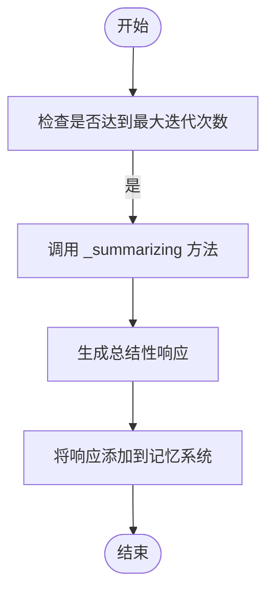
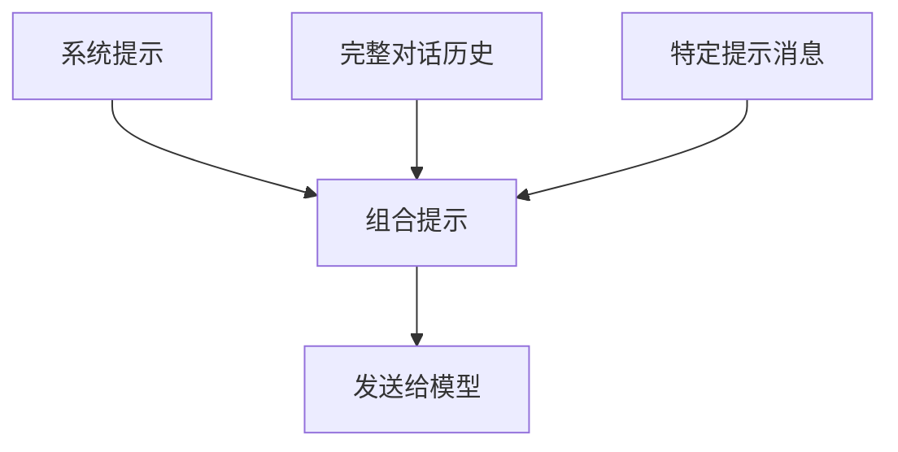
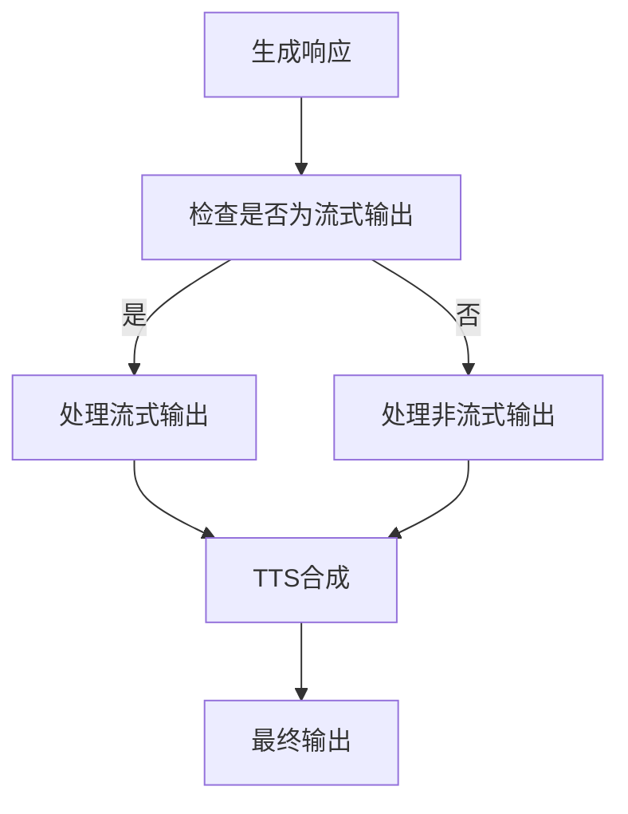
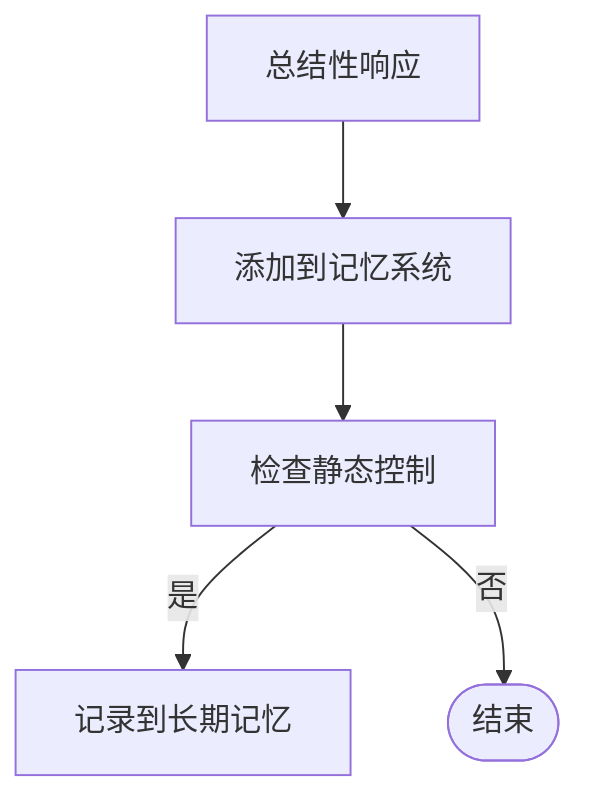

# 总结阶段

<cite>
**本文档中引用的文件**  
- [\_react\_agent.py](file://src/agentscope/agent/_react_agent.py)
- [\_react\_agent\_base.py](file://src/agentscope/agent/_react_agent_base.py)
- [\_tts\_base.py](file://src/agentscope/tts/_tts_base.py)
- [\_long\_term\_memory\_base.py](file://src/agentscope/memory/_long_term_memory_base.py)
</cite>

## 目录
1. [引言](#引言)
2. [故障处理机制](#故障处理机制)
3. [提示构造机制](#提示构造机制)
4. [响应生成与输出处理](#响应生成与输出处理)
5. [记忆系统集成](#记忆系统集成)
6. [总结](#总结)

## 引言

在ReAct智能体架构中，当智能体在达到最大迭代次数后仍未完成任务时，系统会进入总结阶段。此阶段的设计确保了即使在复杂任务中未能完全解决，智能体仍能提供有意义的输出。本节将深入分析_summarizing方法的实现机制，包括故障处理、提示构造、响应生成、流式输出和TTS集成，以及记忆系统集成。

**Section sources**
- [\_react\_agent.py](file://src/agentscope/agent/_react_agent.py#L591-L655)

## 故障处理机制

当ReAct智能体达到最大迭代次数（max_iters）而未能生成最终回复时，系统会调用_summarizing方法来生成总结性响应。该方法在reply函数中被调用，当循环结束且reply_msg仍为None时触发。

**Diagram sources**
- [\_react\_agent.py](file://src/agentscope/agent/_react_agent.py#L391-L397)

**Section sources**
- [\_react\_agent.py](file://src/agentscope/agent/_react_agent.py#L391-L397)

## 提示构造机制

_summarizing方法通过构造特定的提示来引导智能体总结当前情况。提示由三部分组成：系统提示、完整对话历史和特定提示消息。

**Diagram sources**
- [\_react\_agent.py](file://src/agentscope/agent/_react_agent.py#L604-L613)

**Section sources**
- [\_react\_agent.py](file://src/agentscope/agent/_react_agent.py#L595-L613)

## 响应生成与输出处理

_summarizing方法生成最终响应，并处理流式输出和TTS集成。该方法支持流式输出，能够实时生成和传输音频。

**Diagram sources**
- [\_react\_agent.py](file://src/agentscope/agent/_react_agent.py#L613-L655)
- [\_tts\_base.py](file://src/agentscope/tts/_tts_base.py#L125-L143)

**Section sources**
- [\_react\_agent.py](file://src/agentscope/agent/_react_agent.py#L613-L655)
- [\_tts\_base.py](file://src/agentscope/tts/_tts_base.py#L125-L143)

## 记忆系统集成

总结阶段的响应会被添加到记忆系统中，以便后续使用。该机制确保了智能体的学习和记忆能力。

**Diagram sources**
- [\_react\_agent.py](file://src/agentscope/agent/_react_agent.py#L396-L407)
- [\_long\_term\_memory\_base.py](file://src/agentscope/memory/_long_term_memory_base.py#L41-L94)

**Section sources**
- [\_react\_agent.py](file://src/agentscope/agent/_react_agent.py#L396-L407)
- [\_long\_term\_memory\_base.py](file://src/agentscope/memory/_long_term_memory_base.py#L41-L94)

## 总结

总结阶段是ReAct智能体架构中的关键组成部分，确保了智能体在复杂任务中即使未完全解决也能提供有意义的输出。通过精心设计的故障处理机制、提示构造、响应生成、流式输出和TTS集成，以及记忆系统集成，智能体能够有效地总结当前情况并提供有价值的反馈。