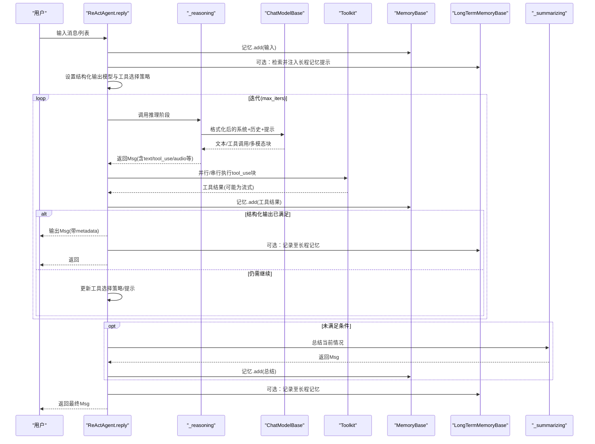
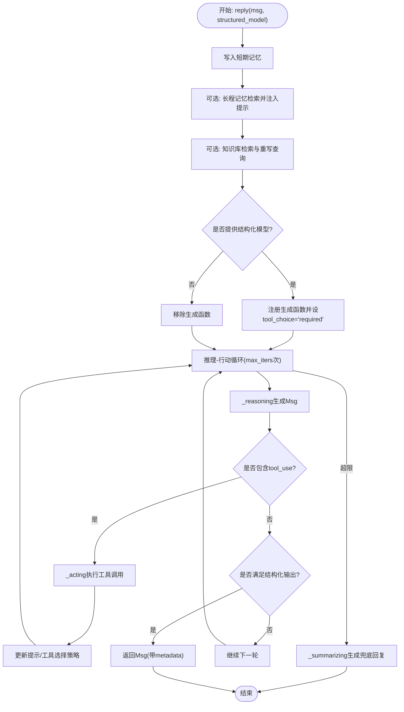
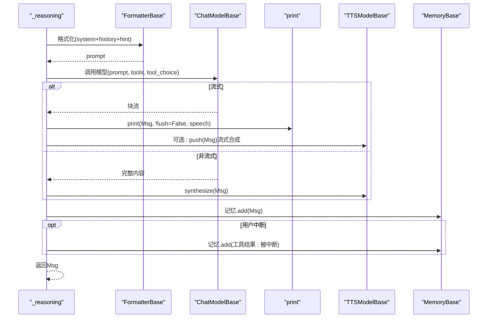
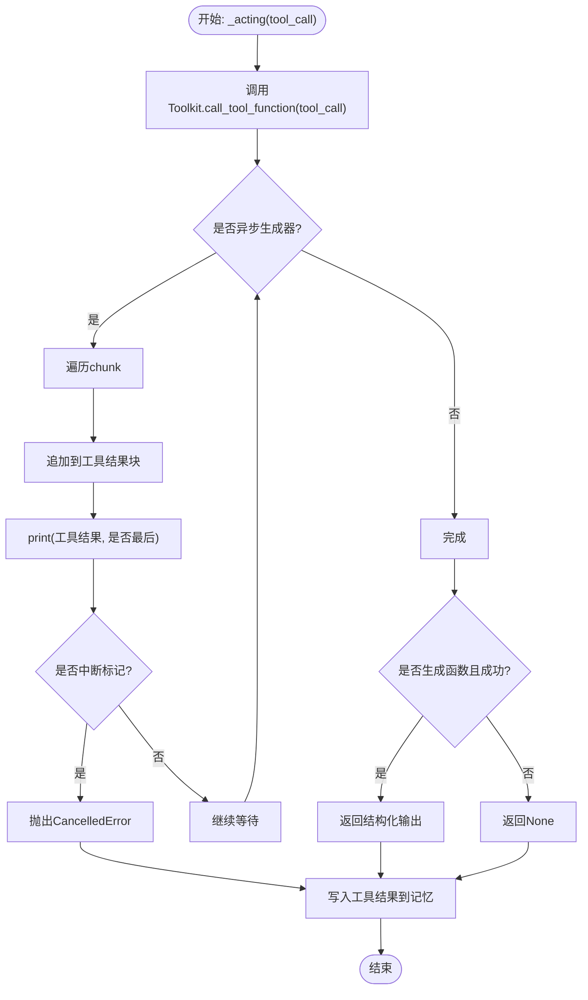
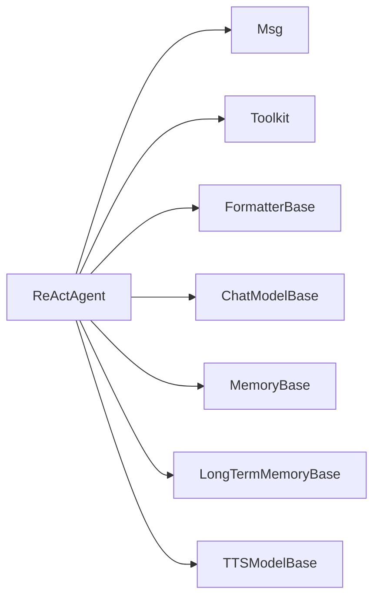

# 执行流程

<cite>
**本文引用的文件列表**
- [src/agentscope/agent/_react_agent.py](file://src/agentscope/agent/_react_agent.py)
- [src/agentscope/agent/_react_agent_base.py](file://src/agentscope/agent/_react_agent_base.py)
- [src/agentscope/agent/_agent_meta.py](file://src/agentscope/agent/_agent_meta.py)
- [src/agentscope/message/_message_base.py](file://src/agentscope/message/_message_base.py)
- [src/agentscope/tool/_toolkit.py](file://src/agentscope/tool/_toolkit.py)
- [tests/react_agent_test.py](file://tests/react_agent_test.py)
- [examples/agent/react_agent/main.py](file://examples/agent/react_agent/main.py)
</cite>

## 目录
1. [引言](#引言)
2. [项目结构](#项目结构)
3. [核心组件](#核心组件)
4. [架构总览](#架构总览)
5. [详细组件分析](#详细组件分析)
6. [依赖关系分析](#依赖关系分析)
7. [性能考量](#性能考量)
8. [故障排查指南](#故障排查指南)
9. [结论](#结论)

## 引言
本文件围绕 ReAct 智能体的执行流程进行系统化梳理，重点解析 reply 方法的整体执行路径，包括输入处理、记忆管理、提示工程与循环控制；深入说明推理阶段（_reasoning）如何将系统提示、对话历史与推理提示组合为模型输入，并处理流式输出与 TTS 集成；阐述行动阶段（_acting）如何执行工具调用、处理异步生成器输出与结构化响应校验；解释观察阶段（observe）如何将消息写入记忆系统；最后说明总结阶段（_summarizing）在达到最大迭代次数时的故障处理机制。

## 项目结构
ReAct 智能体位于 agentscope 的 agent 子模块中，核心类为 ReActAgent，其基类为 ReActAgentBase。ReActAgentBase 继承自 AgentBase，并通过元类注入“推理前/后”、“行动前/后”的钩子，从而形成可插拔的扩展点。消息类型由 Msg 表达，工具集由 Toolkit 管理，格式化器用于将消息序列转换为模型 API 所需格式，模型层负责推理与流式输出，TTS 层负责语音合成与推送。

```mermaid
graph TB
subgraph "智能体层"
RA["_react_agent.ReActAgent"]
RAB["_react_agent_base.ReActAgentBase"]
end
subgraph "消息与工具"
MSG["message.Msg"]
TK["tool.Toolkit"]
end
subgraph "模型与格式化"
FM["formatter.FormatterBase"]
MD["model.ChatModelBase"]
end
subgraph "记忆与长程记忆"
MEM["memory.MemoryBase"]
LTM["memory.LongTermMemoryBase"]
end
subgraph "TTS"
TTS["tts.TTSModelBase"]
end
RA --> RAB
RA --> MSG
RA --> TK
RA --> FM
RA --> MD
RA --> MEM
RA --> LTM
RA --> TTS
```

图表来源
- [src/agentscope/agent/_react_agent.py](file://src/agentscope/agent/_react_agent.py#L40-L120)
- [src/agentscope/agent/_react_agent_base.py](file://src/agentscope/agent/_react_agent_base.py#L12-L33)
- [src/agentscope/message/_message_base.py](file://src/agentscope/message/_message_base.py#L21-L75)
- [src/agentscope/tool/_toolkit.py](file://src/agentscope/tool/_toolkit.py#L55-L120)

章节来源
- [src/agentscope/agent/_react_agent.py](file://src/agentscope/agent/_react_agent.py#L40-L120)
- [src/agentscope/agent/_react_agent_base.py](file://src/agentscope/agent/_react_agent_base.py#L12-L33)

## 核心组件
- ReActAgent：实现完整的 ReAct 循环（推理-行动-观察），支持结构化输出、并行工具调用、RAG 检索、长程记忆注入、计划提示注入、TTS 流式语音等。
- ReActAgentBase：定义 _reasoning 与 _acting 抽象方法，并通过元类注入钩子。
- Msg：统一的消息载体，支持文本、工具调用、工具结果、图像、音频、视频等多模态内容块。
- Toolkit：工具注册、分组、激活/停用、JSON Schema 生成、异步流式执行与结构化响应校验。
- ChatModelBase：模型推理入口，支持同步与流式输出。
- MemoryBase/LongTermMemoryBase：短期与长期记忆接口。
- TTSModelBase：语音合成与流式推送。

章节来源
- [src/agentscope/agent/_react_agent.py](file://src/agentscope/agent/_react_agent.py#L40-L120)
- [src/agentscope/agent/_react_agent_base.py](file://src/agentscope/agent/_react_agent_base.py#L12-L33)
- [src/agentscope/message/_message_base.py](file://src/agentscope/message/_message_base.py#L21-L75)
- [src/agentscope/tool/_toolkit.py](file://src/agentscope/tool/_toolkit.py#L55-L120)

## 架构总览
ReActAgent 的执行以 reply 为核心入口，内部包含检索（长程记忆与知识库）、结构化输出准备、推理-行动循环、观察与记忆更新、总结阶段与后处理（长程记忆记录）。推理阶段将系统提示、短期记忆与一次性提示合并为模型输入；行动阶段根据工具调用并行或串行执行；观察阶段将中间结果写入短期记忆；当超过最大迭代仍未满足条件时进入总结阶段。



图表来源
- [src/agentscope/agent/_react_agent.py](file://src/agentscope/agent/_react_agent.py#L253-L409)
- [src/agentscope/agent/_react_agent.py](file://src/agentscope/agent/_react_agent.py#L411-L521)
- [src/agentscope/agent/_react_agent.py](file://src/agentscope/agent/_react_agent.py#L523-L581)
- [src/agentscope/agent/_react_agent.py](file://src/agentscope/agent/_react_agent.py#L591-L656)

## 详细组件分析

### reply 方法整体执行流程
- 输入处理：将传入消息写入短期记忆，作为后续推理的历史基础。
- 检索阶段：按配置从长程记忆与知识库检索信息，必要时对用户查询进行重写以提升相关性。
- 结构化输出管理：若提供结构化模型，则注册生成函数并设置工具选择策略为“必需”，否则移除生成函数。
- 推理-行动循环：每轮先推理生成文本与工具调用，再执行工具调用（支持并行/串行），根据是否满足结构化输出决定退出条件或继续迭代。
- 退出条件：无工具调用且无需结构化输出时直接结束；若结构化输出已满足则复用已有文本回复。
- 最大迭代处理：若达到上限仍未满足，进入总结阶段生成兜底回复，并写入记忆与长程记忆（静态模式）。



图表来源
- [src/agentscope/agent/_react_agent.py](file://src/agentscope/agent/_react_agent.py#L253-L409)
- [src/agentscope/agent/_react_agent.py](file://src/agentscope/agent/_react_agent.py#L411-L521)
- [src/agentscope/agent/_react_agent.py](file://src/agentscope/agent/_react_agent.py#L523-L581)
- [src/agentscope/agent/_react_agent.py](file://src/agentscope/agent/_react_agent.py#L591-L656)

章节来源
- [src/agentscope/agent/_react_agent.py](file://src/agentscope/agent/_react_agent.py#L253-L409)

### 推理阶段（_reasoning）：提示工程与流式输出/TTS 集成
- 提示工程：将系统提示、短期记忆（历史）与一次性提示（推理提示）合并，交由格式化器转换为模型输入。
- 模型调用：向模型传递工具 JSON Schema 与工具选择策略，支持结构化输出模式。
- 流式输出：若模型支持流式，逐块推送至打印接口；同时可将文本块推送到 TTS 模型进行流式语音合成。
- 非流式输出：一次性获取完整内容后进行 TTS 合成。
- 记忆更新：无论是否发生中断，都将最终 Msg 写入短期记忆；若被用户中断，会补写工具结果“被中断”的占位消息。



图表来源
- [src/agentscope/agent/_react_agent.py](file://src/agentscope/agent/_react_agent.py#L411-L521)

章节来源
- [src/agentscope/agent/_react_agent.py](file://src/agentscope/agent/_react_agent.py#L411-L521)

### 行动阶段（_acting）：工具调用、异步生成器与结构化响应校验
- 工具调用：根据工具调用块调用 Toolkit 的工具函数，支持异步生成器输出。
- 流式处理：将工具生成的增量内容写入工具结果块，逐块打印；若检测到中断标记，抛出取消异常以便上层处理。
- 结构化响应：当工具名为生成函数且返回的元数据中标记成功时，提取结构化输出并返回给上层。
- 记忆更新：无论是否成功，最终将工具结果写入短期记忆。



图表来源
- [src/agentscope/agent/_react_agent.py](file://src/agentscope/agent/_react_agent.py#L523-L581)
- [src/agentscope/tool/_toolkit.py](file://src/agentscope/tool/_toolkit.py#L1-L200)

章节来源
- [src/agentscope/agent/_react_agent.py](file://src/agentscope/agent/_react_agent.py#L523-L581)
- [src/agentscope/tool/_toolkit.py](file://src/agentscope/tool/_toolkit.py#L1-L200)

### 观察阶段（observe）：消息写入记忆系统
- 将输入消息（单个或列表）写入短期记忆，不触发推理-行动循环，仅用于记录上下文。

章节来源
- [src/agentscope/agent/_react_agent.py](file://src/agentscope/agent/_react_agent.py#L582-L590)

### 总结阶段（_summarizing）：达到最大迭代次数的故障处理
- 当超过最大迭代仍未满足退出条件时，生成一条“失败兜底”提示，重新格式化系统提示与历史，调用模型生成总结性回复。
- 支持与推理阶段相同的流式与 TTS 处理逻辑。
- 将最终回复写入短期记忆，并在静态长程记忆模式下记录到长程记忆。

章节来源
- [src/agentscope/agent/_react_agent.py](file://src/agentscope/agent/_react_agent.py#L591-L656)

### 钩子与元类：扩展点与控制流
- 元类在 ReActAgentBase 上为 _reasoning 与 _acting 注入“预-后”钩子，ReActAgent 在其构造函数中注册状态变量与动态系统提示。
- 测试用例展示了在不同场景下钩子的触发时机与行为。

章节来源
- [src/agentscope/agent/_react_agent_base.py](file://src/agentscope/agent/_react_agent_base.py#L12-L33)
- [src/agentscope/agent/_agent_meta.py](file://src/agentscope/agent/_agent_meta.py#L165-L180)
- [tests/react_agent_test.py](file://tests/react_agent_test.py#L96-L192)

## 依赖关系分析
- ReActAgent 依赖：
  - 消息与内容块：Msg、TextBlock、ToolUseBlock、ToolResultBlock、AudioBlock 等。
  - 工具集：Toolkit 提供工具注册、分组、激活/停用、JSON Schema 生成与异步流式执行。
  - 格式化器：FormatterBase 将消息序列转换为模型 API 所需格式。
  - 模型：ChatModelBase 提供推理与流式输出能力。
  - 记忆：MemoryBase 与 LongTermMemoryBase 提供短期与长期记忆接口。
  - TTS：TTSModelBase 提供语音合成与流式推送。
- 关键耦合点：
  - 推理阶段与模型/格式化器强耦合，影响输入结构与输出形态。
  - 行动阶段与工具集强耦合，决定工具调用的并发策略与结构化响应校验。
  - 记忆系统贯穿所有阶段，是状态持久化的关键。



图表来源
- [src/agentscope/agent/_react_agent.py](file://src/agentscope/agent/_react_agent.py#L40-L120)
- [src/agentscope/message/_message_base.py](file://src/agentscope/message/_message_base.py#L21-L75)
- [src/agentscope/tool/_toolkit.py](file://src/agentscope/tool/_toolkit.py#L55-L120)

章节来源
- [src/agentscope/agent/_react_agent.py](file://src/agentscope/agent/_react_agent.py#L40-L120)

## 性能考量
- 并行工具调用：通过参数开启并行执行多个工具调用，缩短总耗时，但需注意资源竞争与并发限制。
- 流式输出：模型与 TTS 的流式处理可降低首帧延迟，改善交互体验，但需确保打印与记忆写入的顺序正确。
- 检索与重写：知识库检索与查询重写会引入额外开销，建议在必要时启用并合理设置最大迭代次数。
- 记忆写入：每次推理与行动后均写入记忆，频繁写入可能带来 I/O 压力，应结合业务场景优化批量写入策略。

## 故障排查指南
- 用户中断：当推理阶段捕获取消异常时，会补写工具结果“被中断”的占位消息到记忆，并返回中断提示消息。可通过 handle_interrupt 自定义中断后的处理逻辑。
- 结构化输出失败：若生成函数返回的元数据未标记成功或参数校验失败，将返回错误信息；检查工具函数签名与结构化模型定义。
- 工具调用异常：异步生成器中若出现异常，需在工具函数内部妥善处理并保证最终写入工具结果块；必要时在上层捕获并记录日志。
- 长程记忆与知识库：静态模式下需确保记录流程在合适时机触发；若检索为空，确认查询重写与知识库配置是否正确。

章节来源
- [src/agentscope/agent/_react_agent.py](file://src/agentscope/agent/_react_agent.py#L491-L521)
- [src/agentscope/agent/_react_agent.py](file://src/agentscope/agent/_react_agent.py#L658-L687)
- [src/agentscope/agent/_react_agent.py](file://src/agentscope/agent/_react_agent.py#L688-L740)

## 结论
ReActAgent 通过清晰的推理-行动循环与完善的记忆、检索、TTS 集成，提供了可扩展、可观测、可中断的智能体执行框架。开发者可在不改变主流程的前提下，通过钩子、工具组与结构化输出模型增强智能体能力；在性能与可靠性之间平衡，结合并行工具调用与流式处理优化用户体验。