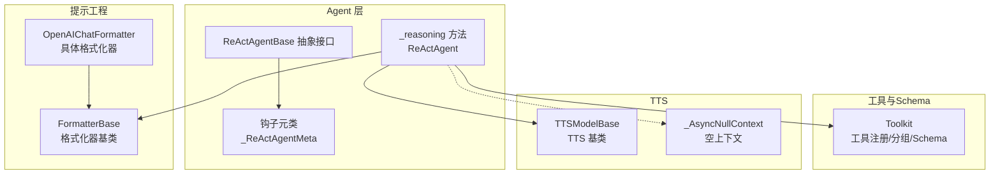
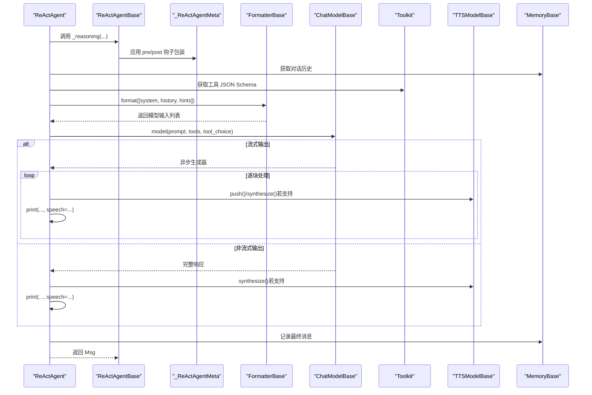
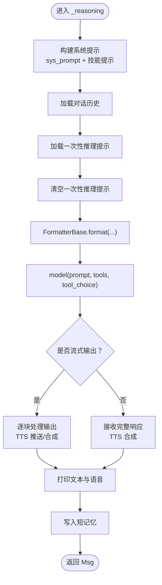
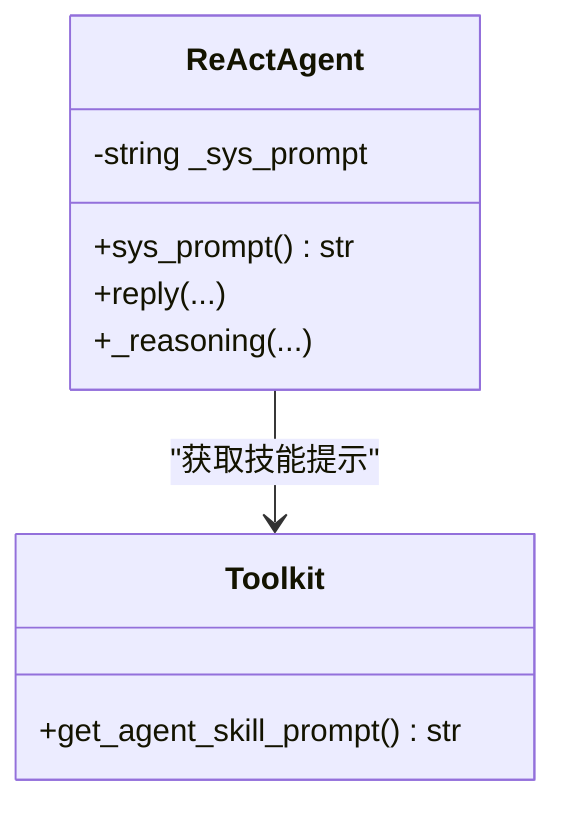
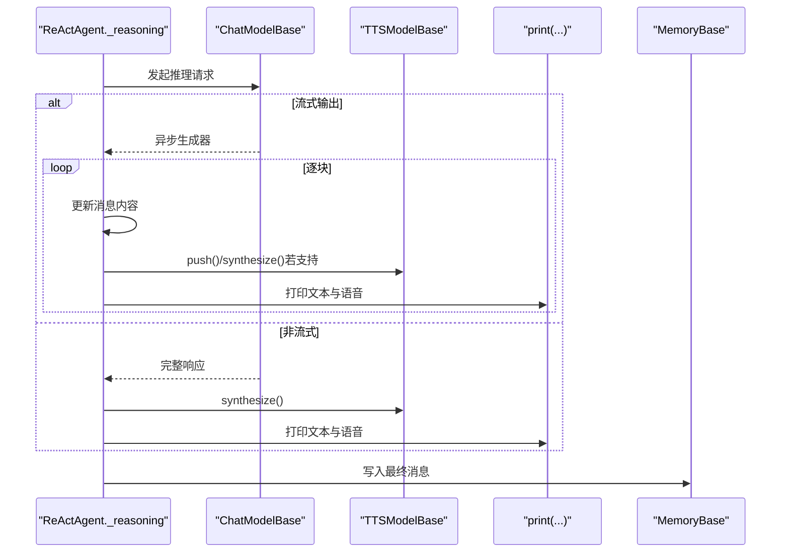
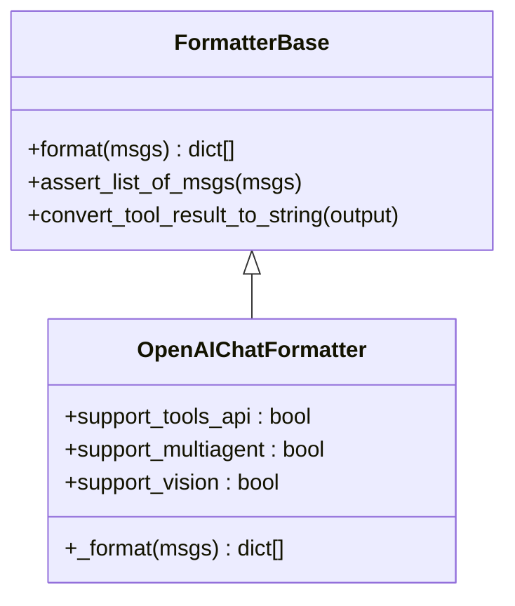
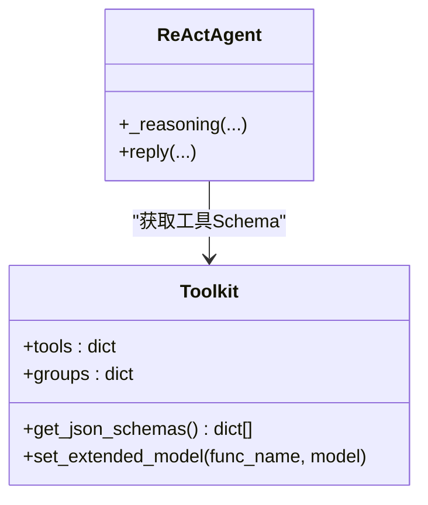
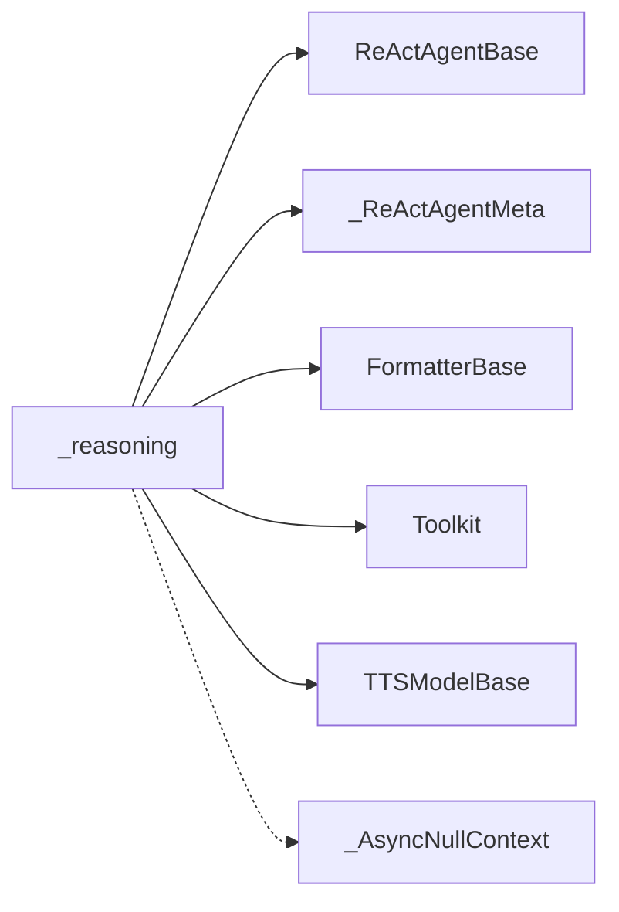

# 推理阶段

<cite>
**本文引用的文件列表**
- [src/agentscope/agent/_react_agent.py](file://src/agentscope/agent/_react_agent.py)
- [src/agentscope/agent/_react_agent_base.py](file://src/agentscope/agent/_react_agent_base.py)
- [src/agentscope/agent/_agent_meta.py](file://src/agentscope/agent/_agent_meta.py)
- [src/agentscope/formatter/_formatter_base.py](file://src/agentscope/formatter/_formatter_base.py)
- [src/agentscope/formatter/_openai_formatter.py](file://src/agentscope/formatter/_openai_formatter.py)
- [src/agentscope/tool/_toolkit.py](file://src/agentscope/tool/_toolkit.py)
- [src/agentscope/tts/_tts_base.py](file://src/agentscope/tts/_tts_base.py)
- [src/agentscope/agent/_utils.py](file://src/agentscope/agent/_utils.py)
</cite>

## 目录
1. [引言](#引言)
2. [项目结构](#项目结构)
3. [核心组件](#核心组件)
4. [架构总览](#架构总览)
5. [详细组件分析](#详细组件分析)
6. [依赖关系分析](#依赖关系分析)
7. [性能考量](#性能考量)
8. [故障排查指南](#故障排查指南)
9. [结论](#结论)

## 引言
本文件聚焦于 ReAct 智能体推理阶段的实现细节，围绕 ReActAgent 的 _reasoning 方法展开，系统性解析以下关键点：
- 如何将系统提示、对话历史与推理提示组合为模型输入；
- 提示工程的实现机制：系统提示的动态构建（sys_prompt 属性）、记忆中对话历史的获取、推理提示的临时注入；
- 流式输出处理机制：如何处理模型的异步生成器输出、TTS 集成的上下文管理、中断处理；
- 提示格式化器（FormatterBase）在消息转换中的作用；
- 工具调用 schema 的注入方式（通过 Toolkit 的 JSON Schema 列表）。

## 项目结构
ReAct 推理阶段位于 agent 子模块中，主要涉及以下文件：
- ReActAgent 实现：推理与行动循环、提示格式化、工具调用、TTS 集成、长短期记忆检索等；
- ReActAgentBase：定义抽象的推理与行动接口及钩子扩展点；
- FormatterBase 及具体格式化器：负责将消息对象转换为模型 API 所需的结构；
- Toolkit：工具注册、分组、schema 注入与执行；
- TTS 基类：统一 TTS 模型的接入与流式合成；
- 工具函数：空上下文管理器用于无 TTS 时的占位。

**图表来源**
- [src/agentscope/agent/_react_agent.py](file://src/agentscope/agent/_react_agent.py#L410-L521)
- [src/agentscope/agent/_react_agent_base.py](file://src/agentscope/agent/_react_agent_base.py#L1-L117)
- [src/agentscope/agent/_agent_meta.py](file://src/agentscope/agent/_agent_meta.py#L155-L180)
- [src/agentscope/formatter/_formatter_base.py](file://src/agentscope/formatter/_formatter_base.py#L1-L130)
- [src/agentscope/formatter/_openai_formatter.py](file://src/agentscope/formatter/_openai_formatter.py#L158-L357)
- [src/agentscope/tool/_toolkit.py](file://src/agentscope/tool/_toolkit.py#L466-L528)
- [src/agentscope/tts/_tts_base.py](file://src/agentscope/tts/_tts_base.py#L1-L144)
- [src/agentscope/agent/_utils.py](file://src/agentscope/agent/_utils.py#L1-L18)

**章节来源**
- [src/agentscope/agent/_react_agent.py](file://src/agentscope/agent/_react_agent.py#L410-L521)
- [src/agentscope/agent/_react_agent_base.py](file://src/agentscope/agent/_react_agent_base.py#L1-L117)
- [src/agentscope/agent/_agent_meta.py](file://src/agentscope/agent/_agent_meta.py#L155-L180)

## 核心组件
- ReActAgent._reasoning：推理阶段的核心入口，负责构造系统提示、拼接记忆与推理提示、调用模型并处理流式输出与 TTS 集成。
- ReActAgentBase：定义抽象的 _reasoning 与 _acting 接口，并通过元类提供 pre/post 钩子扩展。
- FormatterBase：定义格式化接口，将消息对象序列化为模型 API 所需的数据结构；具体格式化器（如 OpenAIChatFormatter）实现不同提供商的格式要求。
- Toolkit：集中管理工具函数及其 JSON Schema，支持动态扩展模型（如结构化输出），并在推理阶段注入到模型调用中。
- TTSModelBase：统一 TTS 能力，支持非实时与实时两种模式；ReActAgent 在推理阶段使用上下文管理器与合成接口进行语音输出。
- _AsyncNullContext：当未配置 TTS 时，作为空上下文占位，避免分支判断复杂化。

**章节来源**
- [src/agentscope/agent/_react_agent.py](file://src/agentscope/agent/_react_agent.py#L410-L521)
- [src/agentscope/agent/_react_agent_base.py](file://src/agentscope/agent/_react_agent_base.py#L1-L117)
- [src/agentscope/formatter/_formatter_base.py](file://src/agentscope/formatter/_formatter_base.py#L1-L130)
- [src/agentscope/tool/_toolkit.py](file://src/agentscope/tool/_toolkit.py#L466-L528)
- [src/agentscope/tts/_tts_base.py](file://src/agentscope/tts/_tts_base.py#L1-L144)
- [src/agentscope/agent/_utils.py](file://src/agentscope/agent/_utils.py#L1-L18)

## 架构总览
下图展示了 ReAct 推理阶段从“提示构造”到“模型调用与输出”的整体流程，以及与工具、TTS 的交互。

**图表来源**
- [src/agentscope/agent/_react_agent.py](file://src/agentscope/agent/_react_agent.py#L410-L521)
- [src/agentscope/agent/_react_agent_base.py](file://src/agentscope/agent/_react_agent_base.py#L1-L117)
- [src/agentscope/agent/_agent_meta.py](file://src/agentscope/agent/_agent_meta.py#L155-L180)
- [src/agentscope/formatter/_formatter_base.py](file://src/agentscope/formatter/_formatter_base.py#L1-L130)
- [src/agentscope/tool/_toolkit.py](file://src/agentscope/tool/_toolkit.py#L466-L528)
- [src/agentscope/tts/_tts_base.py](file://src/agentscope/tts/_tts_base.py#L1-L144)

## 详细组件分析

### 推理阶段：_reasoning 方法
- 输入构造
  - 系统提示：通过 sys_prompt 动态拼接工具技能提示（若存在），形成最终系统提示。
  - 对话历史：从短记忆中获取历史消息，作为上下文。
  - 推理提示：从“一次性推理提示内存”中获取本次推理所需的引导信息，随后清空。
  - 最终以 FormatterBase 将上述三部分格式化为模型 API 所需的列表结构。
- 模型调用
  - 将格式化后的提示与工具 JSON Schema、tool_choice 一并传入模型。
  - 支持结构化输出时，会设置工具选择策略为“必需”，以便强制生成工具调用或结构化响应。
- 输出处理
  - 若模型返回异步生成器，则逐块更新消息内容并打印；同时根据 TTS 能力进行实时/非实时语音合成。
  - 若模型返回完整响应，则直接进行 TTS 合成与打印。
  - 将最终消息写入短记忆，便于后续推理与总结。
- 中断处理
  - 捕获取消异常，标记用户中断；对工具调用块生成“被中断”的假结果，写入记忆并打印，保证状态一致性。

**图表来源**
- [src/agentscope/agent/_react_agent.py](file://src/agentscope/agent/_react_agent.py#L410-L521)

**章节来源**
- [src/agentscope/agent/_react_agent.py](file://src/agentscope/agent/_react_agent.py#L410-L521)

### 系统提示的动态构建（sys_prompt 属性）
- ReActAgent.sys_prompt 属性在访问时动态拼接：
  - 若 Toolkit 中存在“代理技能提示”，则将其追加到静态系统提示之后，形成更丰富的行为约束与能力说明。
  - 否则直接返回静态系统提示。
- 这种设计使得系统提示可随工具集与技能动态变化，增强模型对可用能力的认知。

**图表来源**
- [src/agentscope/agent/_react_agent.py](file://src/agentscope/agent/_react_agent.py#L243-L251)
- [src/agentscope/tool/_toolkit.py](file://src/agentscope/tool/_toolkit.py)

**章节来源**
- [src/agentscope/agent/_react_agent.py](file://src/agentscope/agent/_react_agent.py#L243-L251)

### 记忆中的对话历史获取
- 短期记忆（InMemoryMemory）：在推理前通过 memory.get_memory() 获取历史消息，作为上下文的一部分。
- 一次性推理提示（_reasoning_hint_msgs）：推理前插入计划提示、知识检索提示、长程记忆提示等，推理后立即清空，确保提示仅对单次推理生效。

**章节来源**
- [src/agentscope/agent/_react_agent.py](file://src/agentscope/agent/_react_agent.py#L410-L521)

### 推理提示的临时注入
- 计划提示：来自 PlanNotebook 的当前提示，按需打印并注入一次性提示内存。
- 长程记忆提示：在静态控制模式下，检索长程记忆并将结果以用户消息形式注入短期记忆。
- 知识库提示：在启用查询重写与检索后，将相关文档片段以用户消息形式注入短期记忆。

**章节来源**
- [src/agentscope/agent/_react_agent.py](file://src/agentscope/agent/_react_agent.py#L410-L521)
- [src/agentscope/agent/_react_agent.py](file://src/agentscope/agent/_react_agent.py#L741-L867)

### 流式输出处理机制
- 模型输出类型判断：
  - 若模型返回异步生成器：逐块更新消息内容，同时尝试推送至 TTS（若支持流式输入），并打印中间结果。
  - 若模型返回完整响应：直接进行 TTS 合成与打印。
- TTS 集成：
  - 使用上下文管理器（TTSModelBase.__aenter__/__aexit__）管理实时 TTS 生命周期。
  - 若 TTS 支持流式输入，则在每块文本到达时 push 并接收音频块；否则在完整文本合成后一次性输出。
  - 非实时 TTS：synthesize 返回完整音频或流式音频块，逐块打印。
- 中断处理：
  - 捕获取消异常，标记中断状态；对工具调用生成“被中断”的假结果，写入记忆并打印，保证对话状态一致。

**图表来源**
- [src/agentscope/agent/_react_agent.py](file://src/agentscope/agent/_react_agent.py#L436-L521)
- [src/agentscope/tts/_tts_base.py](file://src/agentscope/tts/_tts_base.py#L1-L144)

**章节来源**
- [src/agentscope/agent/_react_agent.py](file://src/agentscope/agent/_react_agent.py#L436-L521)
- [src/agentscope/tts/_tts_base.py](file://src/agentscope/tts/_tts_base.py#L1-L144)

### 提示格式化器（FormatterBase）的作用
- FormatterBase 定义统一的 format 接口，将消息对象序列化为模型 API 所需的数据结构。
- 具体格式化器（如 OpenAIChatFormatter）负责：
  - 文本、图像、音频、工具调用与工具结果等多模态块的转换；
  - 将工具结果转换为文本字符串（兼容不支持多模态结果的模型）；
  - 在多代理场景中组织历史对话与多模态内容。
- ReActAgent 在推理阶段调用 formatter.format(...)，将系统提示、历史消息与一次性提示合并为模型输入。

**图表来源**
- [src/agentscope/formatter/_formatter_base.py](file://src/agentscope/formatter/_formatter_base.py#L1-L130)
- [src/agentscope/formatter/_openai_formatter.py](file://src/agentscope/formatter/_openai_formatter.py#L158-L357)

**章节来源**
- [src/agentscope/formatter/_formatter_base.py](file://src/agentscope/formatter/_formatter_base.py#L1-L130)
- [src/agentscope/formatter/_openai_formatter.py](file://src/agentscope/formatter/_openai_formatter.py#L158-L357)

### 工具调用 schema 的注入方式
- Toolkit.get_json_schemas() 会聚合所有“基础组”工具与“激活组”工具的 JSON Schema，形成模型可用的函数声明列表。
- ReActAgent 在推理阶段将该列表作为 tools 参数传递给模型，使模型具备工具调用能力。
- 结构化输出时，ReActAgent 会注册“生成响应”工具并设置其扩展模型，从而在工具层实现结构化输出约束。

**图表来源**
- [src/agentscope/tool/_toolkit.py](file://src/agentscope/tool/_toolkit.py#L466-L528)
- [src/agentscope/agent/_react_agent.py](file://src/agentscope/agent/_react_agent.py#L410-L521)

**章节来源**
- [src/agentscope/tool/_toolkit.py](file://src/agentscope/tool/_toolkit.py#L466-L528)
- [src/agentscope/agent/_react_agent.py](file://src/agentscope/agent/_react_agent.py#L410-L521)

## 依赖关系分析
- ReActAgent 继承自 ReActAgentBase，并通过元类 _ReActAgentMeta 包装 _reasoning 与 _acting，提供类级与实例级钩子扩展。
- ReActAgent 依赖 FormatterBase 进行消息格式化，依赖 Toolkit 提供工具 schema，依赖 TTSModelBase 进行语音合成。
- 当未配置 TTS 时，使用 _AsyncNullContext 作为空上下文，避免分支逻辑复杂化。

**图表来源**
- [src/agentscope/agent/_react_agent.py](file://src/agentscope/agent/_react_agent.py#L410-L521)
- [src/agentscope/agent/_react_agent_base.py](file://src/agentscope/agent/_react_agent_base.py#L1-L117)
- [src/agentscope/agent/_agent_meta.py](file://src/agentscope/agent/_agent_meta.py#L155-L180)
- [src/agentscope/agent/_utils.py](file://src/agentscope/agent/_utils.py#L1-L18)

**章节来源**
- [src/agentscope/agent/_react_agent.py](file://src/agentscope/agent/_react_agent.py#L410-L521)
- [src/agentscope/agent/_react_agent_base.py](file://src/agentscope/agent/_react_agent_base.py#L1-L117)
- [src/agentscope/agent/_agent_meta.py](file://src/agentscope/agent/_agent_meta.py#L155-L180)
- [src/agentscope/agent/_utils.py](file://src/agentscope/agent/_utils.py#L1-L18)

## 性能考量
- 流式输出与 TTS 合成：
  - 流式输出可降低首字延迟，提升交互体验；但需注意逐块合成可能带来额外开销。
  - 实时 TTS（支持流式输入）建议在模型端具备相应能力时开启，以减少等待时间。
- 工具调用与 schema 大小：
  - schema 数量与字段复杂度会影响模型推理成本；应合理分组与激活工具，避免不必要的 schema 注入。
- 记忆与检索：
  - 长程记忆与知识库检索会增加推理前的准备时间；可在静态控制模式下按需检索，减少冗余信息。

## 故障排查指南
- 用户中断：
  - 现象：推理过程中抛出取消异常。
  - 处理：ReActAgent 捕获异常并标记中断；对工具调用生成“被中断”的假结果，写入记忆并打印，确保状态一致。
- TTS 未配置：
  - 现象：推理阶段无语音输出。
  - 处理：使用 _AsyncNullContext 占位，不影响文本输出；若需语音，请正确初始化 TTSModelBase 并设置支持流式输入。
- 工具调用失败：
  - 现象：工具返回错误或未找到。
  - 处理：检查工具名称与分组激活状态；确认 Toolkit 中工具已注册且处于激活组；必要时通过“重置工具”元工具调整分组。

**章节来源**
- [src/agentscope/agent/_react_agent.py](file://src/agentscope/agent/_react_agent.py#L491-L521)
- [src/agentscope/agent/_utils.py](file://src/agentscope/agent/_utils.py#L1-L18)
- [src/agentscope/tool/_toolkit.py](file://src/agentscope/tool/_toolkit.py#L593-L726)

## 结论
ReActAgent 的推理阶段通过“系统提示动态构建 + 记忆与提示拼接 + 格式化器转换 + 工具 schema 注入 + 流式输出与 TTS 集成”的完整链路，实现了可控、可观测、可扩展的智能体推理过程。FormatterBase 与 Toolkit 分别承担了消息转换与工具能力注入的关键职责，而 TTS 的上下文管理与中断处理保障了用户体验与状态一致性。在实际部署中，建议结合业务需求优化工具分组、检索策略与 TTS 配置，以获得最佳性能与交互体验。