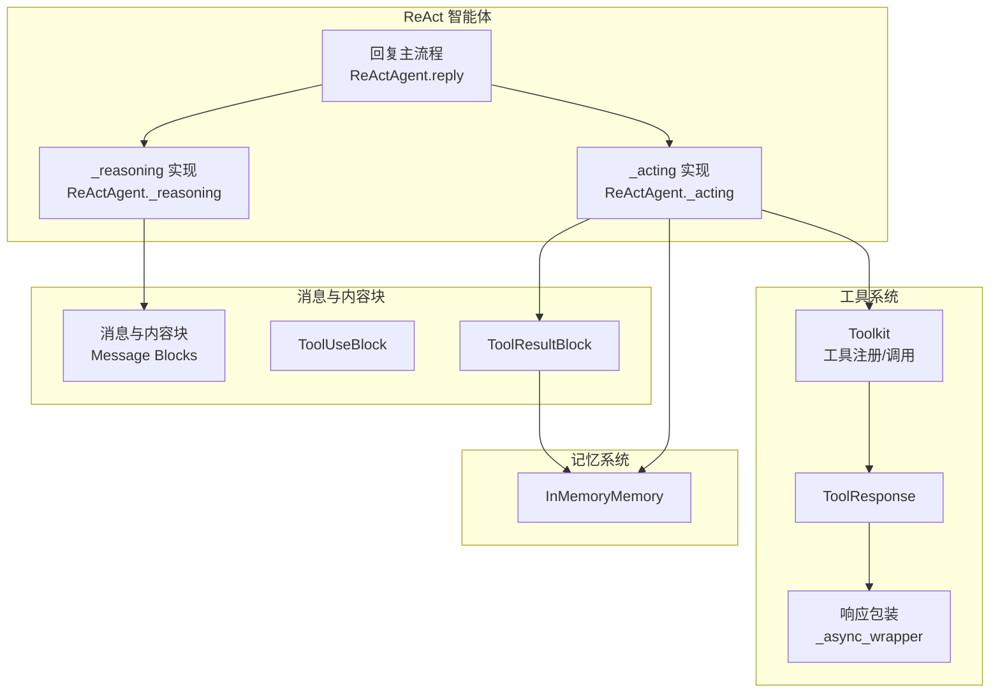
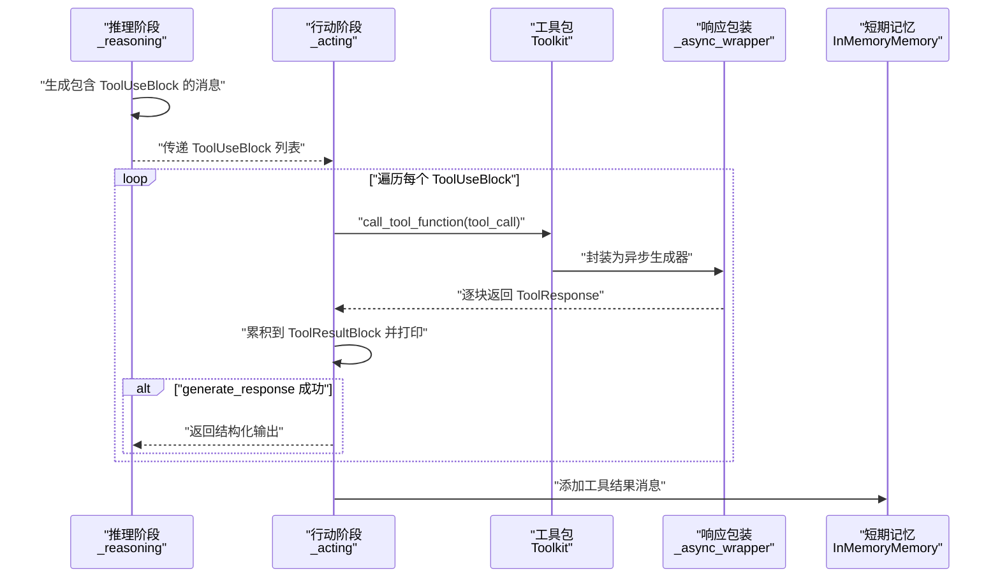
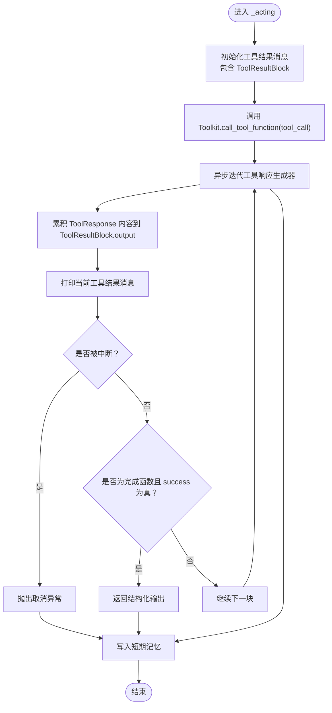
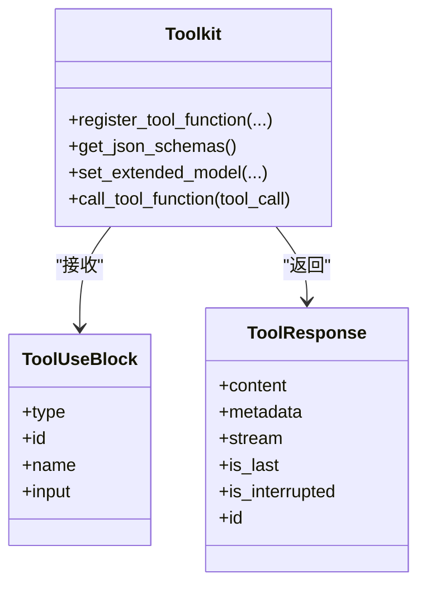
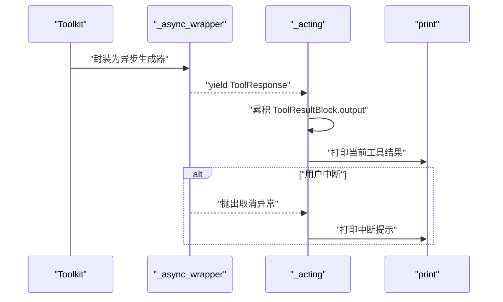
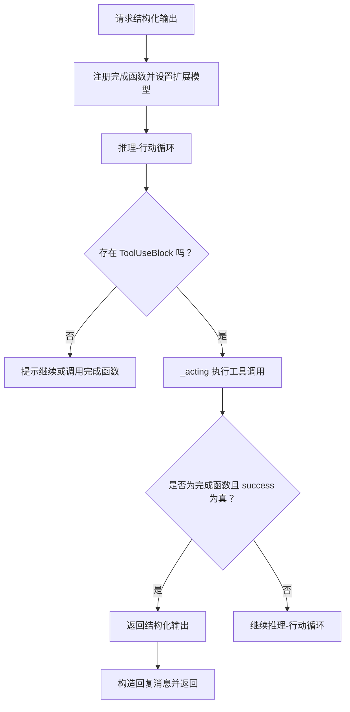
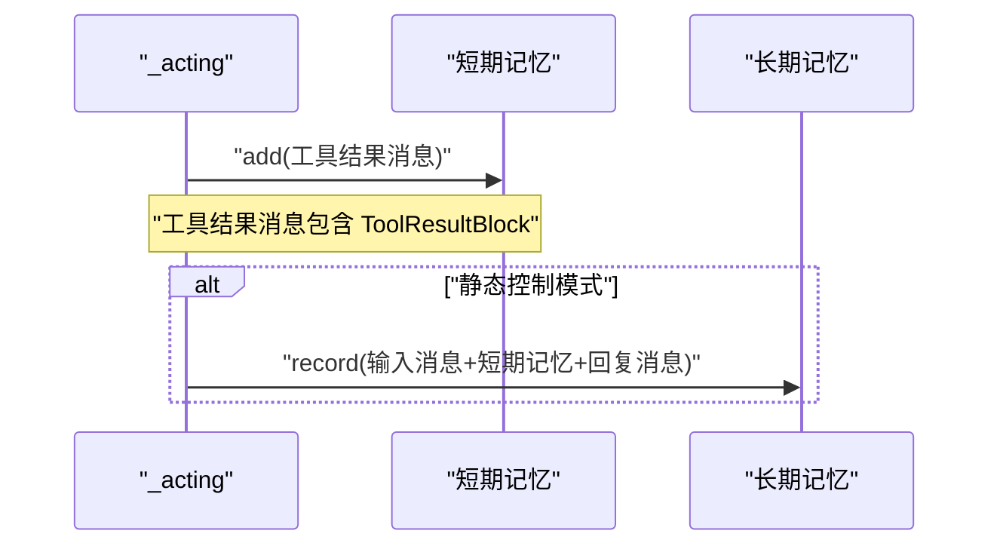
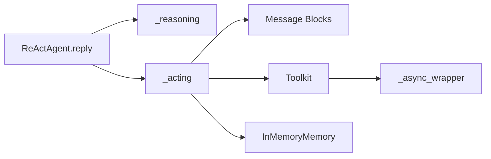

# 行动阶段

<cite>
**本文引用的文件**
- [src/agentscope/agent/_react_agent.py](file://src/agentscope/agent/_react_agent.py)
- [src/agentscope/agent/_react_agent_base.py](file://src/agentscope/agent/_react_agent_base.py)
- [src/agentscope/message/_message_block.py](file://src/agentscope/message/_message_block.py)
- [src/agentscope/tool/_toolkit.py](file://src/agentscope/tool/_toolkit.py)
- [src/agentscope/tool/_async_wrapper.py](file://src/agentscope/tool/_async_wrapper.py)
- [src/agentscope/tool/_response.py](file://src/agentscope/tool/_response.py)
- [src/agentscope/memory/_in_memory_memory.py](file://src/agentscope/memory/_in_memory_memory.py)
- [examples/agent/react_agent/main.py](file://examples/agent/react_agent/main.py)
- [examples/functionality/long_term_memory/reme/tool_memory_example.py](file://examples/functionality/long_term_memory/reme/tool_memory_example.py)
</cite>

## 目录
1. [引言](#引言)
2. [项目结构](#项目结构)
3. [核心组件](#核心组件)
4. [架构总览](#架构总览)
5. [详细组件分析](#详细组件分析)
6. [依赖关系分析](#依赖关系分析)
7. [性能考量](#性能考量)
8. [故障排查指南](#故障排查指南)
9. [结论](#结论)

## 引言
本章节聚焦于 ReAct 智能体“行动阶段”的实现与行为，围绕以下目标展开：
- 解析 _acting 方法如何执行工具调用，包括工具调用块（ToolUseBlock）的解析与工具包（Toolkit）的调用机制
- 说明异步生成器输出的处理流程：如何将工具执行结果累积为 ToolResultBlock 并实时输出
- 阐述结构化响应验证机制：当调用名为 generate_response 的完成函数时，如何验证元数据中的成功标志并提取结构化输出
- 说明工具执行结果在记忆系统中的记录方式

## 项目结构
ReAct 智能体的行动阶段由多个模块协同完成：
- ReActAgent：负责推理-行动循环、工具调用、结构化输出管理与记忆记录
- ReActAgentBase：定义抽象的 _acting 接口及钩子扩展点
- Message Block：定义工具调用块（ToolUseBlock）与工具结果块（ToolResultBlock）
- Toolkit：注册、管理工具函数，并统一以流式接口返回工具响应
- 工具响应包装：将同步/异步/生成器返回统一封装为异步生成器
- 内存模块：记录对话历史与工具结果

图表来源
- [src/agentscope/agent/_react_agent.py](file://src/agentscope/agent/_react_agent.py#L252-L407)
- [src/agentscope/agent/_react_agent.py](file://src/agentscope/agent/_react_agent.py#L522-L580)
- [src/agentscope/message/_message_block.py](file://src/agentscope/message/_message_block.py#L79-L116)
- [src/agentscope/tool/_toolkit.py](file://src/agentscope/tool/_toolkit.py#L593-L725)
- [src/agentscope/tool/_async_wrapper.py](file://src/agentscope/tool/_async_wrapper.py#L38-L110)
- [src/agentscope/tool/_response.py](file://src/agentscope/tool/_response.py#L11-L33)
- [src/agentscope/memory/_in_memory_memory.py](file://src/agentscope/memory/_in_memory_memory.py#L78-L123)

章节来源
- [src/agentscope/agent/_react_agent.py](file://src/agentscope/agent/_react_agent.py#L252-L407)
- [src/agentscope/agent/_react_agent.py](file://src/agentscope/agent/_react_agent.py#L522-L580)
- [src/agentscope/message/_message_block.py](file://src/agentscope/message/_message_block.py#L79-L116)
- [src/agentscope/tool/_toolkit.py](file://src/agentscope/tool/_toolkit.py#L593-L725)
- [src/agentscope/tool/_async_wrapper.py](file://src/agentscope/tool/_async_wrapper.py#L38-L110)
- [src/agentscope/tool/_response.py](file://src/agentscope/tool/_response.py#L11-L33)
- [src/agentscope/memory/_in_memory_memory.py](file://src/agentscope/memory/_in_memory_memory.py#L78-L123)

## 核心组件
- ReActAgent._acting：执行单个工具调用，处理异步流式输出，实时打印中间结果，并在 generate_response 成功时返回结构化输出
- ReActAgent.reply：驱动推理-行动循环，收集 ToolUseBlock 并并发/串行执行 _acting
- Toolkit.call_tool_function：根据 ToolUseBlock 调用已注册工具函数，统一封装为异步生成器
- ToolUseBlock/ToolResultBlock：LLM 生成的工具调用描述与工具执行结果载体
- ToolResponse：工具执行的响应块，包含内容、元数据、流式标记、是否中断等
- _async_wrapper：将对象、同步/异步生成器统一封装为异步生成器，并处理中断
- InMemoryMemory：短期记忆，记录对话与工具结果

章节来源
- [src/agentscope/agent/_react_agent.py](file://src/agentscope/agent/_react_agent.py#L252-L407)
- [src/agentscope/agent/_react_agent.py](file://src/agentscope/agent/_react_agent.py#L522-L580)
- [src/agentscope/tool/_toolkit.py](file://src/agentscope/tool/_toolkit.py#L593-L725)
- [src/agentscope/message/_message_block.py](file://src/agentscope/message/_message_block.py#L79-L116)
- [src/agentscope/tool/_response.py](file://src/agentscope/tool/_response.py#L11-L33)
- [src/agentscope/tool/_async_wrapper.py](file://src/agentscope/tool/_async_wrapper.py#L38-L110)
- [src/agentscope/memory/_in_memory_memory.py](file://src/agentscope/memory/_in_memory_memory.py#L78-L123)

## 架构总览
ReAct 的行动阶段位于推理-行动循环中，核心流程如下：
- 推理阶段生成包含 ToolUseBlock 的消息
- 行动阶段遍历 ToolUseBlock，调用 Toolkit 执行工具
- 工具执行通过异步生成器逐块返回 ToolResponse
- _acting 将每一块累积到 ToolResultBlock 并实时打印
- 若调用的是 generate_response 且元数据 success 为真，则返回结构化输出
- 最终将工具结果消息写入短期记忆

图表来源
- [src/agentscope/agent/_react_agent.py](file://src/agentscope/agent/_react_agent.py#L252-L407)
- [src/agentscope/agent/_react_agent.py](file://src/agentscope/agent/_react_agent.py#L522-L580)
- [src/agentscope/tool/_toolkit.py](file://src/agentscope/tool/_toolkit.py#L593-L725)
- [src/agentscope/tool/_async_wrapper.py](file://src/agentscope/tool/_async_wrapper.py#L38-L110)
- [src/agentscope/memory/_in_memory_memory.py](file://src/agentscope/memory/_in_memory_memory.py#L78-L123)

## 详细组件分析

### 组件一：_acting 方法与工具调用执行
- 输入：单个 ToolUseBlock
- 步骤：
  - 初始化一个仅含 ToolResultBlock 的 Msg，作为工具结果消息
  - 通过 Toolkit.call_tool_function(tool_call) 获取异步生成器
  - 异步迭代生成器，将每一块 ToolResponse 的内容累积到 ToolResultBlock.output
  - 调用 print 输出当前工具结果消息；若 chunk 标记为中断，则抛出取消异常
  - 若当前工具名为完成函数且元数据 success 为真，则返回 metadata 中的结构化输出
  - finally 块中将工具结果消息写入短期记忆

图表来源
- [src/agentscope/agent/_react_agent.py](file://src/agentscope/agent/_react_agent.py#L522-L580)
- [src/agentscope/tool/_toolkit.py](file://src/agentscope/tool/_toolkit.py#L593-L725)
- [src/agentscope/tool/_async_wrapper.py](file://src/agentscope/tool/_async_wrapper.py#L38-L110)
- [src/agentscope/memory/_in_memory_memory.py](file://src/agentscope/memory/_in_memory_memory.py#L78-L123)

章节来源
- [src/agentscope/agent/_react_agent.py](file://src/agentscope/agent/_react_agent.py#L522-L580)

### 组件二：工具调用块（ToolUseBlock）解析与工具包（Toolkit）调用机制
- ToolUseBlock 字段：type、id、name、input
- Toolkit 调用流程：
  - 校验工具名是否存在与分组激活状态
  - 合并 preset_kwargs 与 tool_call.input 得到最终参数
  - 支持同步函数、异步函数、同步/异步生成器
  - 统一封装为异步生成器，支持后处理函数
  - 异常处理：未找到函数、分组未激活、运行时错误等，均以 ToolResponse 形式返回错误信息

图表来源
- [src/agentscope/message/_message_block.py](file://src/agentscope/message/_message_block.py#L79-L116)
- [src/agentscope/tool/_toolkit.py](file://src/agentscope/tool/_toolkit.py#L206-L441)
- [src/agentscope/tool/_toolkit.py](file://src/agentscope/tool/_toolkit.py#L593-L725)
- [src/agentscope/tool/_response.py](file://src/agentscope/tool/_response.py#L11-L33)

章节来源
- [src/agentscope/message/_message_block.py](file://src/agentscope/message/_message_block.py#L79-L116)
- [src/agentscope/tool/_toolkit.py](file://src/agentscope/tool/_toolkit.py#L206-L441)
- [src/agentscope/tool/_toolkit.py](file://src/agentscope/tool/_toolkit.py#L593-L725)
- [src/agentscope/tool/_response.py](file://src/agentscope/tool/_response.py#L11-L33)

### 组件三：异步生成器输出处理与实时打印
- Toolkit.call_tool_function 返回异步生成器，逐块产出 ToolResponse
- _async_wrapper 对象、同步/异步生成器进行统一封装
- 异步生成器中断场景：捕获取消异常，向最后一块追加中断提示并标记 is_last/is_interrupted，再产出
- _acting 在每次迭代中更新 ToolResultBlock.output 并调用 print 输出

图表来源
- [src/agentscope/tool/_toolkit.py](file://src/agentscope/tool/_toolkit.py#L593-L725)
- [src/agentscope/tool/_async_wrapper.py](file://src/agentscope/tool/_async_wrapper.py#L38-L110)
- [src/agentscope/agent/_react_agent.py](file://src/agentscope/agent/_react_agent.py#L522-L580)

章节来源
- [src/agentscope/tool/_async_wrapper.py](file://src/agentscope/tool/_async_wrapper.py#L38-L110)
- [src/agentscope/agent/_react_agent.py](file://src/agentscope/agent/_react_agent.py#L522-L580)

### 组件四：结构化响应验证与完成函数 generate_response
- ReActAgent.reply 在需要结构化输出时，动态注册完成函数 generate_response，并设置其扩展模型
- _acting 在检测到当前工具名为完成函数且元数据 success 为真时，返回 metadata 中的结构化输出
- 完成函数内部使用 Pydantic 模型校验参数，失败时返回失败元数据，成功时返回成功元数据与结构化输出

图表来源
- [src/agentscope/agent/_react_agent.py](file://src/agentscope/agent/_react_agent.py#L252-L407)
- [src/agentscope/agent/_react_agent.py](file://src/agentscope/agent/_react_agent.py#L522-L580)
- [src/agentscope/agent/_react_agent.py](file://src/agentscope/agent/_react_agent.py#L688-L740)

章节来源
- [src/agentscope/agent/_react_agent.py](file://src/agentscope/agent/_react_agent.py#L252-L407)
- [src/agentscope/agent/_react_agent.py](file://src/agentscope/agent/_react_agent.py#L522-L580)
- [src/agentscope/agent/_react_agent.py](file://src/agentscope/agent/_react_agent.py#L688-L740)

### 组件五：工具执行结果在记忆系统中的记录
- _acting 在 finally 块中将工具结果消息写入短期记忆
- 短期记忆 InMemoryMemory 支持添加消息列表，去重与类型校验
- 长期记忆模式下，ReActAgent 在回复结束后可将对话与工具结果记录至长期记忆

图表来源
- [src/agentscope/agent/_react_agent.py](file://src/agentscope/agent/_react_agent.py#L522-L580)
- [src/agentscope/memory/_in_memory_memory.py](file://src/agentscope/memory/_in_memory_memory.py#L78-L123)

章节来源
- [src/agentscope/agent/_react_agent.py](file://src/agentscope/agent/_react_agent.py#L522-L580)
- [src/agentscope/memory/_in_memory_memory.py](file://src/agentscope/memory/_in_memory_memory.py#L78-L123)

## 依赖关系分析
- ReActAgent._acting 依赖：
  - Message Blocks：ToolUseBlock/ToolResultBlock
  - Toolkit：call_tool_function
  - _async_wrapper：统一异步生成器
  - Memory：InMemoryMemory.add
- ReActAgent.reply 依赖：
  - _reasoning 产出 ToolUseBlock
  - _acting 并发/串行执行工具调用
  - 结构化输出验证与提示逻辑

图表来源
- [src/agentscope/agent/_react_agent.py](file://src/agentscope/agent/_react_agent.py#L252-L407)
- [src/agentscope/agent/_react_agent.py](file://src/agentscope/agent/_react_agent.py#L522-L580)
- [src/agentscope/tool/_toolkit.py](file://src/agentscope/tool/_toolkit.py#L593-L725)
- [src/agentscope/tool/_async_wrapper.py](file://src/agentscope/tool/_async_wrapper.py#L38-L110)
- [src/agentscope/memory/_in_memory_memory.py](file://src/agentscope/memory/_in_memory_memory.py#L78-L123)

章节来源
- [src/agentscope/agent/_react_agent.py](file://src/agentscope/agent/_react_agent.py#L252-L407)
- [src/agentscope/agent/_react_agent.py](file://src/agentscope/agent/_react_agent.py#L522-L580)
- [src/agentscope/tool/_toolkit.py](file://src/agentscope/tool/_toolkit.py#L593-L725)
- [src/agentscope/tool/_async_wrapper.py](file://src/agentscope/tool/_async_wrapper.py#L38-L110)
- [src/agentscope/memory/_in_memory_memory.py](file://src/agentscope/memory/_in_memory_memory.py#L78-L123)

## 性能考量
- 并行工具调用：ReActAgent.reply 可选择并行执行多个 ToolUseBlock，减少整体等待时间
- 流式输出：工具执行以异步生成器返回，_acting 实时打印，降低首屏延迟
- 中断处理：用户中断时，_async_wrapper 会在最后块追加中断提示并标记 is_last，避免阻塞
- 记忆写入：短期记忆采用列表存储，批量写入；长期记忆记录在回复结束时进行，避免频繁 IO

## 故障排查指南
- 工具未找到或分组未激活
  - 现象：返回错误文本块
  - 处理：检查工具名与分组激活状态
- 工具执行异常
  - 现象：返回错误文本块
  - 处理：查看工具内部日志与参数校验
- 用户中断
  - 现象：最后块 is_interrupted=True，is_last=True
  - 处理：_acting 抛出取消异常，上层可捕获并做后续处理
- 结构化输出未满足
  - 现象：未检测到 success=True 或未生成 ToolUseBlock
  - 处理：根据提示继续推理或显式调用完成函数

章节来源
- [src/agentscope/tool/_toolkit.py](file://src/agentscope/tool/_toolkit.py#L593-L725)
- [src/agentscope/tool/_async_wrapper.py](file://src/agentscope/tool/_async_wrapper.py#L38-L110)
- [src/agentscope/agent/_react_agent.py](file://src/agentscope/agent/_react_agent.py#L522-L580)

## 结论
ReAct 智能体的行动阶段通过统一的工具调用与流式输出机制，实现了高效、可观测的工具执行过程。_acting 将工具结果以 ToolResultBlock 实时输出，并在完成函数成功时返回结构化输出；同时，工具执行结果被可靠地记录到短期记忆中，为后续推理与长期记忆记录提供基础。该设计既保证了交互的实时性，也确保了结构化输出的正确性与可追踪性。