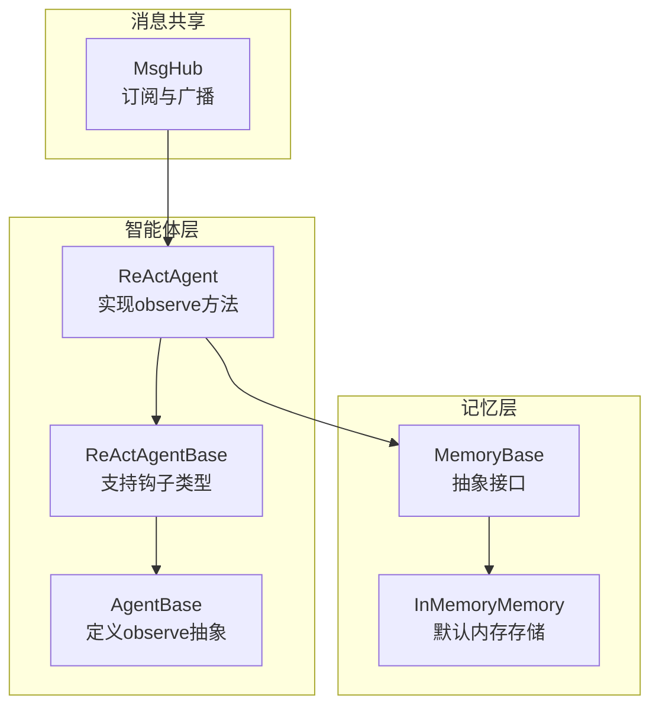
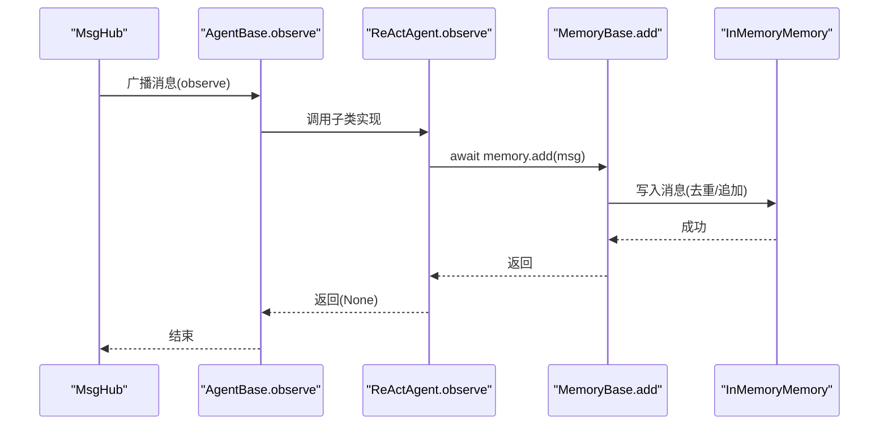
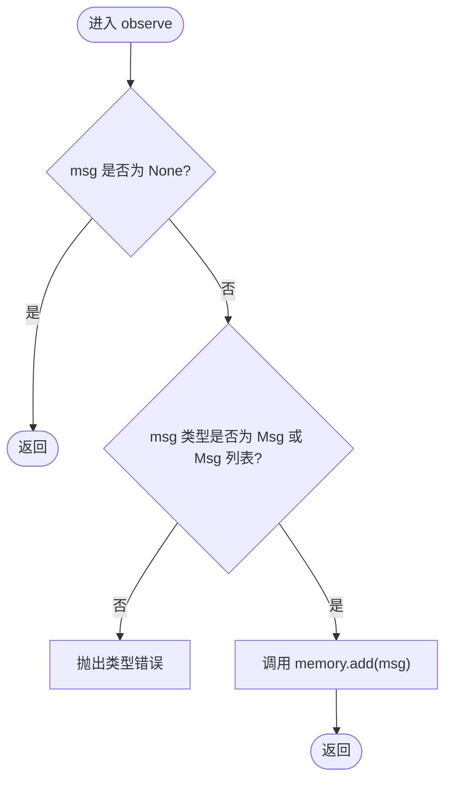
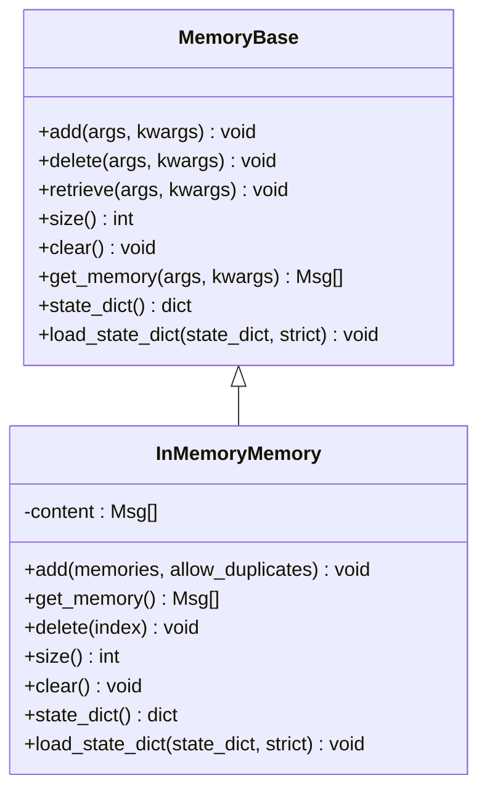
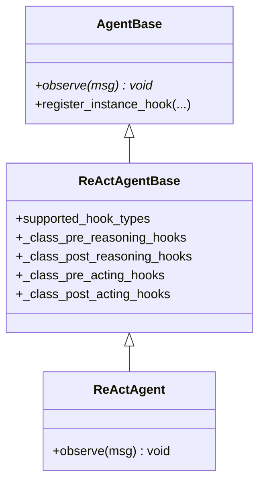
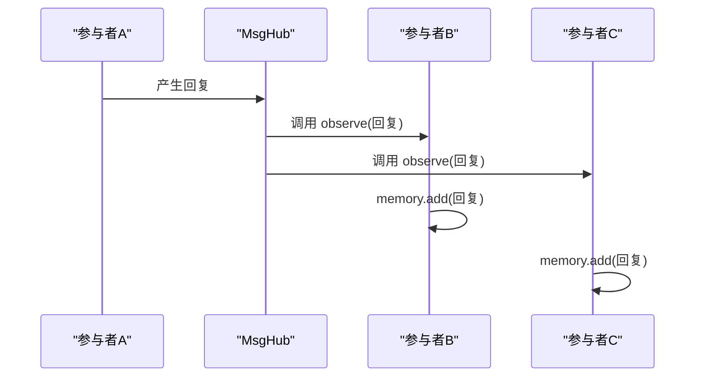
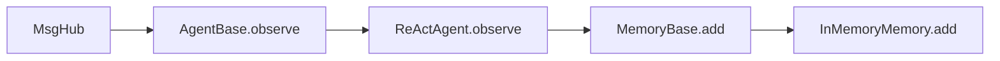

# 观察阶段

<cite>
**本文引用的文件列表**
- [src/agentscope/agent/_react_agent.py](file://src/agentscope/agent/_react_agent.py)
- [src/agentscope/agent/_react_agent_base.py](file://src/agentscope/agent/_react_agent_base.py)
- [src/agentscope/agent/_agent_base.py](file://src/agentscope/agent/_agent_base.py)
- [src/agentscope/memory/_memory_base.py](file://src/agentscope/memory/_memory_base.py)
- [src/agentscope/memory/_in_memory_memory.py](file://src/agentscope/memory/_in_memory_memory.py)
- [src/agentscope/pipeline/_msghub.py](file://src/agentscope/pipeline/_msghub.py)
- [examples/agent/react_agent/main.py](file://examples/agent/react_agent/main.py)
- [tests/a2a_agent_test.py](file://tests/a2a_agent_test.py)
- [tests/hook_test.py](file://tests/hook_test.py)
</cite>

## 目录
1. [引言](#引言)
2. [项目结构与定位](#项目结构与定位)
3. [核心组件](#核心组件)
4. [架构总览](#架构总览)
5. [详细组件分析](#详细组件分析)
6. [依赖关系分析](#依赖关系分析)
7. [性能考量](#性能考量)
8. [故障排查指南](#故障排查指南)
9. [结论](#结论)

## 引言
本章节聚焦于ReAct智能体的“观察阶段”，即observe方法的实现与行为。observe方法用于接收外部消息而不生成回复，其核心职责是将外部输入或事件注入到智能体的记忆系统中，从而更新对话历史与上下文，为后续推理与行动提供依据。本文将从实现细节、数据流、错误处理、性能特征以及在多智能体协作与外部事件注入场景中的应用进行系统化阐述，并给出可操作的可视化图示与最佳实践建议。

## 项目结构与定位
- ReAct智能体位于 agentscope 的 agent 子模块，继承自 ReActAgentBase，并进一步扩展为完整的 ReActAgent。
- 记忆系统位于 memory 子模块，MemoryBase 定义抽象接口，InMemoryMemory 提供默认的内存式对话历史存储。
- 多智能体消息共享通过 MsgHub 实现，它会自动将一个智能体的回复广播给其他订阅者，从而触发它们的 observe 流程。
- 示例与测试覆盖了 observe 的基本用法、钩子机制、A2A代理的观察合并等典型场景。

图表来源
- [src/agentscope/agent/_react_agent.py](file://src/agentscope/agent/_react_agent.py#L582-L589)
- [src/agentscope/agent/_react_agent_base.py](file://src/agentscope/agent/_react_agent_base.py#L21-L32)
- [src/agentscope/agent/_agent_base.py](file://src/agentscope/agent/_agent_base.py#L184-L194)
- [src/agentscope/memory/_memory_base.py](file://src/agentscope/memory/_memory_base.py#L11-L45)
- [src/agentscope/memory/_in_memory_memory.py](file://src/agentscope/memory/_in_memory_memory.py#L10-L123)
- [src/agentscope/pipeline/_msghub.py](file://src/agentscope/pipeline/_msghub.py#L14-L51)

章节来源
- [src/agentscope/agent/_react_agent.py](file://src/agentscope/agent/_react_agent.py#L582-L589)
- [src/agentscope/agent/_react_agent_base.py](file://src/agentscope/agent/_react_agent_base.py#L21-L32)
- [src/agentscope/agent/_agent_base.py](file://src/agentscope/agent/_agent_base.py#L184-L194)
- [src/agentscope/memory/_memory_base.py](file://src/agentscope/memory/_memory_base.py#L11-L45)
- [src/agentscope/memory/_in_memory_memory.py](file://src/agentscope/memory/_in_memory_memory.py#L78-L123)
- [src/agentscope/pipeline/_msghub.py](file://src/agentscope/pipeline/_msghub.py#L14-L51)

## 核心组件
- ReActAgent.observe：接收外部消息并写入短期记忆，不生成回复。
- MemoryBase/InMemoryMemory：定义记忆接口与默认内存存储实现，负责消息的去重、追加与查询。
- ReActAgentBase：扩展 AgentBase，声明支持“pre_observe/post_observe”等钩子类型。
- AgentBase：定义 observe 抽象方法，未实现由子类覆盖。
- MsgHub：在多智能体场景中自动广播消息，触发各智能体的 observe。

章节来源
- [src/agentscope/agent/_react_agent.py](file://src/agentscope/agent/_react_agent.py#L582-L589)
- [src/agentscope/memory/_memory_base.py](file://src/agentscope/memory/_memory_base.py#L11-L45)
- [src/agentscope/memory/_in_memory_memory.py](file://src/agentscope/memory/_in_memory_memory.py#L78-L123)
- [src/agentscope/agent/_react_agent_base.py](file://src/agentscope/agent/_react_agent_base.py#L21-L32)
- [src/agentscope/agent/_agent_base.py](file://src/agentscope/agent/_agent_base.py#L184-L194)
- [src/agentscope/pipeline/_msghub.py](file://src/agentscope/pipeline/_msghub.py#L14-L51)

## 架构总览
下图展示了 observe 在ReAct智能体中的调用路径与数据流向，包括消息注入短期记忆、钩子扩展点以及与多智能体广播的关系。

图表来源
- [src/agentscope/pipeline/_msghub.py](file://src/agentscope/pipeline/_msghub.py#L14-L51)
- [src/agentscope/agent/_agent_base.py](file://src/agentscope/agent/_agent_base.py#L184-L194)
- [src/agentscope/agent/_react_agent.py](file://src/agentscope/agent/_react_agent.py#L582-L589)
- [src/agentscope/memory/_memory_base.py](file://src/agentscope/memory/_memory_base.py#L11-L45)
- [src/agentscope/memory/_in_memory_memory.py](file://src/agentscope/memory/_in_memory_memory.py#L78-L123)

## 详细组件分析

### ReActAgent.observe 方法实现
- 职责：接收外部消息或消息列表，直接写入短期记忆，不生成回复。
- 输入：单条消息、消息列表或空值；空值直接返回。
- 行为：调用 memory.add，内部完成消息类型校验、去重与追加。
- 钩子：支持 pre_observe/post_observe 钩子，可在 observe 前后扩展逻辑（如修改输入、记录副作用）。

图表来源
- [src/agentscope/agent/_react_agent.py](file://src/agentscope/agent/_react_agent.py#L582-L589)
- [src/agentscope/memory/_in_memory_memory.py](file://src/agentscope/memory/_in_memory_memory.py#L78-L123)

章节来源
- [src/agentscope/agent/_react_agent.py](file://src/agentscope/agent/_react_agent.py#L582-L589)
- [src/agentscope/memory/_in_memory_memory.py](file://src/agentscope/memory/_in_memory_memory.py#L78-L123)

### 记忆系统（MemoryBase 与 InMemoryMemory）
- MemoryBase：定义 add/delete/retrieve/size/clear/get_memory/state_dict/load_state_dict 等抽象方法，统一记忆接口。
- InMemoryMemory：
  - add：支持单条消息、消息列表与 None；对重复消息（按 id 去重）进行过滤；类型校验严格。
  - get_memory：返回当前对话历史。
  - 其他：delete/clear/state_dict/load_state_dict 等。

图表来源
- [src/agentscope/memory/_memory_base.py](file://src/agentscope/memory/_memory_base.py#L11-L45)
- [src/agentscope/memory/_in_memory_memory.py](file://src/agentscope/memory/_in_memory_memory.py#L10-L123)

章节来源
- [src/agentscope/memory/_memory_base.py](file://src/agentscope/memory/_memory_base.py#L11-L45)
- [src/agentscope/memory/_in_memory_memory.py](file://src/agentscope/memory/_in_memory_memory.py#L78-L123)

### ReActAgentBase 与 AgentBase 的钩子体系
- ReActAgentBase：在 AgentBase 基础上新增“pre_observe/post_observe”等钩子类型，便于在观察阶段前后插入自定义逻辑。
- AgentBase：定义 observe 抽象方法，未实现由子类覆盖；同时维护实例级与类级钩子注册表。

图表来源
- [src/agentscope/agent/_agent_base.py](file://src/agentscope/agent/_agent_base.py#L184-L194)
- [src/agentscope/agent/_react_agent_base.py](file://src/agentscope/agent/_react_agent_base.py#L21-L32)
- [src/agentscope/agent/_react_agent.py](file://src/agentscope/agent/_react_agent.py#L582-L589)

章节来源
- [src/agentscope/agent/_agent_base.py](file://src/agentscope/agent/_agent_base.py#L184-L194)
- [src/agentscope/agent/_react_agent_base.py](file://src/agentscope/agent/_react_agent_base.py#L21-L32)
- [src/agentscope/agent/_react_agent.py](file://src/agentscope/agent/_react_agent.py#L582-L589)

### 多智能体协作与外部事件注入
- MsgHub：在多智能体场景中，当某个智能体产生回复时，MsgHub 会自动将其广播给其他订阅者，触发它们的 observe，从而将外部事件注入到各智能体的记忆中。
- A2A 代理：A2AAgent 的 observe 会暂存消息并在 reply 合并发送，体现“先观察、后统一回复”的模式；ReActAgent 的 observe 则直接写入短期记忆，不参与后续统一发送。

图表来源
- [src/agentscope/pipeline/_msghub.py](file://src/agentscope/pipeline/_msghub.py#L14-L51)
- [src/agentscope/agent/_react_agent.py](file://src/agentscope/agent/_react_agent.py#L582-L589)

章节来源
- [src/agentscope/pipeline/_msghub.py](file://src/agentscope/pipeline/_msghub.py#L14-L51)
- [src/agentscope/agent/_react_agent.py](file://src/agentscope/agent/_react_agent.py#L582-L589)

### 钩子与状态更新接口
- 钩子：pre_observe 可修改输入参数；post_observe 可记录副作用或二次处理。
- 状态更新：observe 作为智能体状态更新接口，确保外部事件与消息能够及时进入短期记忆，影响后续推理与行动。

章节来源
- [tests/hook_test.py](file://tests/hook_test.py#L547-L596)
- [src/agentscope/agent/_agent_base.py](file://src/agentscope/agent/_agent_base.py#L119-L156)

## 依赖关系分析
- ReActAgent.observe 依赖 MemoryBase 接口与 InMemoryMemory 实现，保证消息写入的统一性与一致性。
- ReActAgentBase 扩展 AgentBase，引入更多钩子类型，增强 observe 的可扩展性。
- MsgHub 依赖 AgentBase.observe，形成广播-观察闭环。

图表来源
- [src/agentscope/agent/_agent_base.py](file://src/agentscope/agent/_agent_base.py#L184-L194)
- [src/agentscope/agent/_react_agent.py](file://src/agentscope/agent/_react_agent.py#L582-L589)
- [src/agentscope/memory/_memory_base.py](file://src/agentscope/memory/_memory_base.py#L11-L45)
- [src/agentscope/memory/_in_memory_memory.py](file://src/agentscope/memory/_in_memory_memory.py#L78-L123)
- [src/agentscope/pipeline/_msghub.py](file://src/agentscope/pipeline/_msghub.py#L14-L51)

章节来源
- [src/agentscope/agent/_agent_base.py](file://src/agentscope/agent/_agent_base.py#L184-L194)
- [src/agentscope/agent/_react_agent.py](file://src/agentscope/agent/_react_agent.py#L582-L589)
- [src/agentscope/memory/_memory_base.py](file://src/agentscope/memory/_memory_base.py#L11-L45)
- [src/agentscope/memory/_in_memory_memory.py](file://src/agentscope/memory/_in_memory_memory.py#L78-L123)
- [src/agentscope/pipeline/_msghub.py](file://src/agentscope/pipeline/_msghub.py#L14-L51)

## 性能考量
- 消息去重：InMemoryMemory.add 默认对重复消息（按 id 去重）进行过滤，避免冗余写入，降低存储与推理开销。
- 类型校验：严格的类型检查在早期发现错误，减少无效调用链路的开销。
- 钩子链：钩子数量与复杂度会影响 observe 的执行时间，建议在生产环境谨慎配置钩子数量与逻辑复杂度。
- 广播成本：MsgHub 在多智能体场景中会多次调用 observe，需关注消息规模与钩子开销叠加效应。

[本节为通用指导，无需列出具体文件来源]

## 故障排查指南
- 类型错误：当传入非 Msg 或非 Msg 列表时，InMemoryMemory.add 会抛出类型错误。请确认传入的消息类型与结构。
- 空消息：observe 收到 None 时直接返回，不会写入记忆。若期望写入，请确保消息非空。
- 钩子异常：pre_observe/post_observe 中的异常会中断 observe 流程，需检查钩子函数的健壮性与日志输出。
- A2A 场景：A2AAgent 的 observe 仅缓存消息，实际发送在 reply 合并阶段进行；ReActAgent 的 observe 直接写入短期记忆。两者职责不同，避免混淆。

章节来源
- [src/agentscope/memory/_in_memory_memory.py](file://src/agentscope/memory/_in_memory_memory.py#L78-L123)
- [src/agentscope/agent/_react_agent.py](file://src/agentscope/agent/_react_agent.py#L582-L589)
- [tests/a2a_agent_test.py](file://tests/a2a_agent_test.py#L191-L201)
- [tests/hook_test.py](file://tests/hook_test.py#L547-L596)

## 结论
ReActAgent.observe 是智能体状态更新的关键入口：它以“只观察、不回复”的方式接收外部消息，通过 MemoryBase 接口写入短期记忆，为后续推理与行动提供上下文基础。结合 MsgHub 的广播机制与钩子扩展能力，observe 在多智能体协作与外部事件注入场景中发挥着承上启下的作用。实践中应重视消息类型校验、去重策略与钩子开销，确保 observe 的稳定性与性能表现。