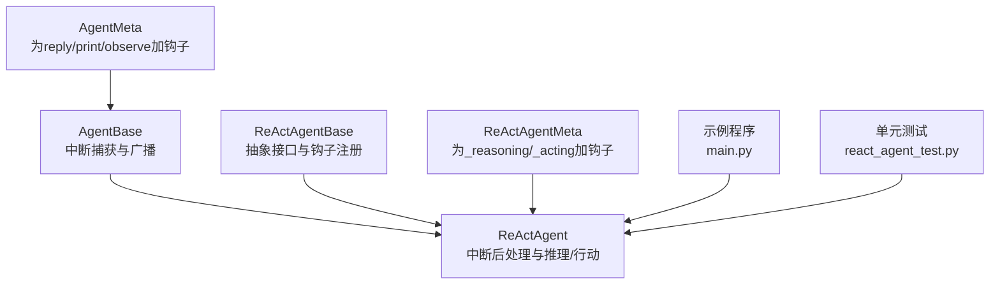
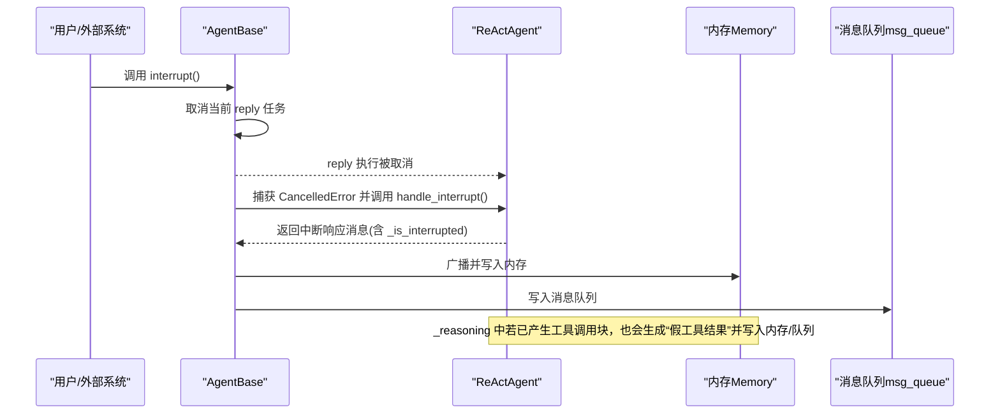
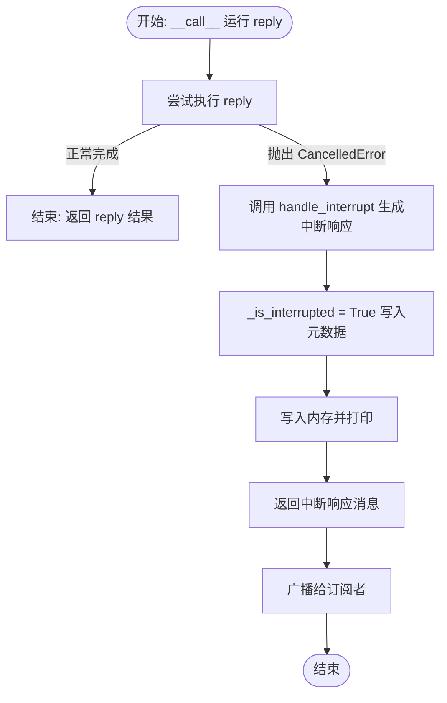
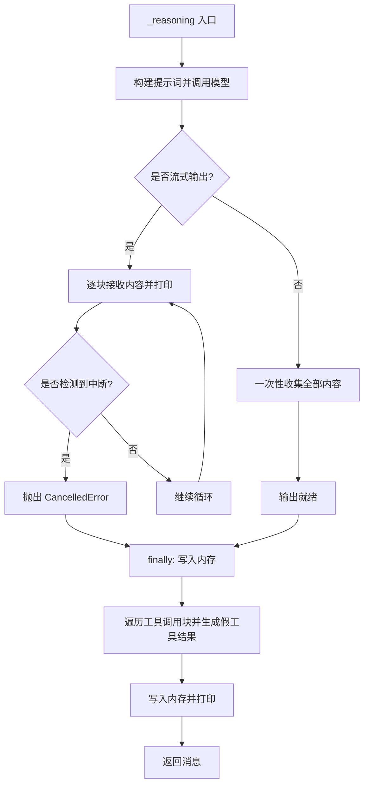
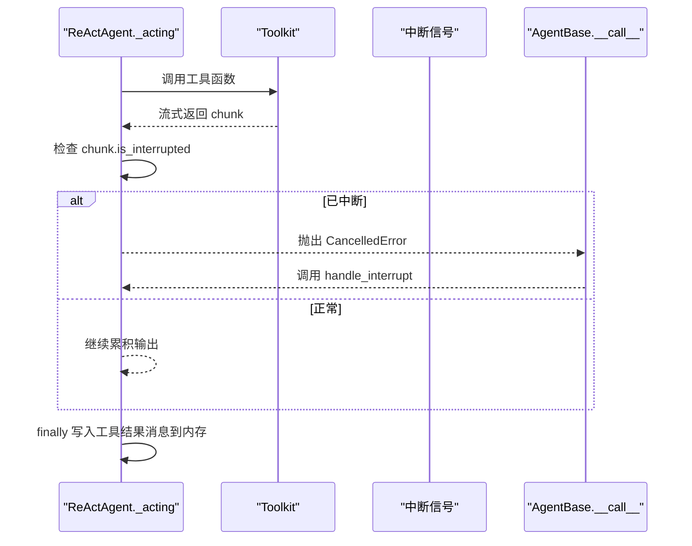
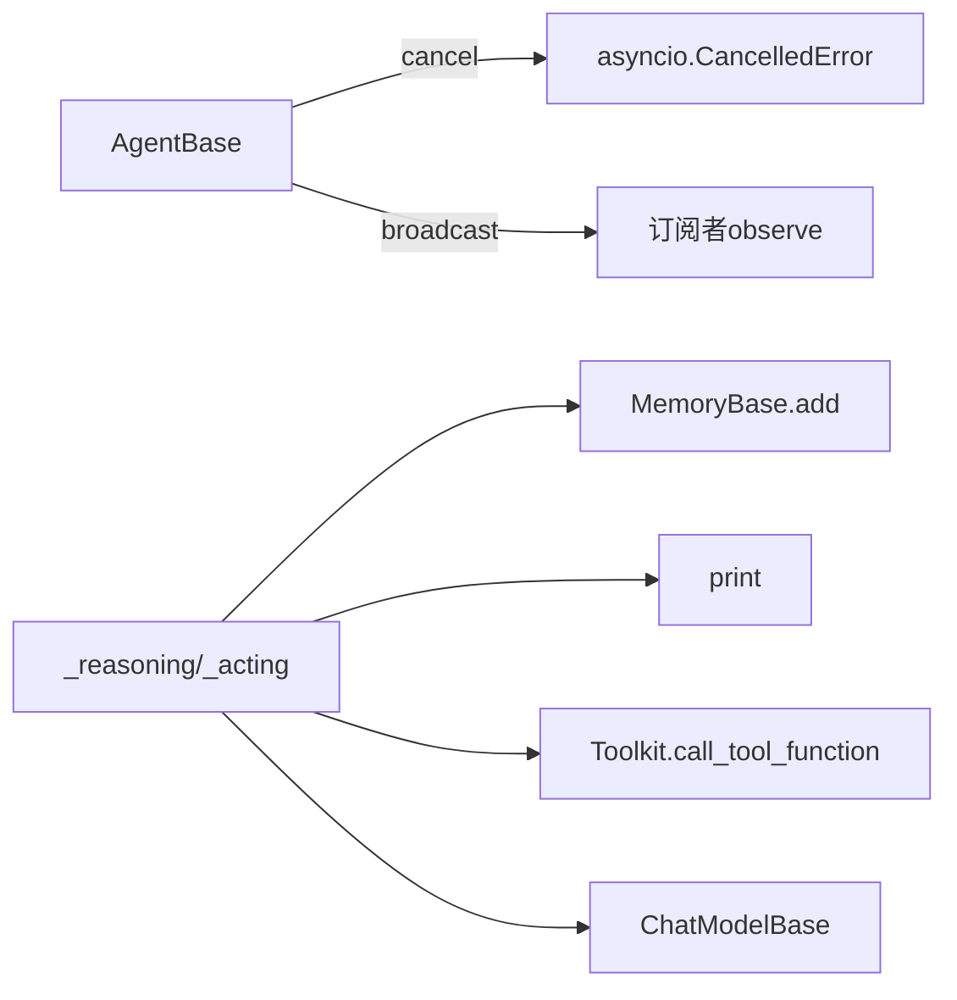

# 中断处理

<cite>
**本文引用的文件**
- [src/agentscope/agent/_agent_base.py](file://src/agentscope/agent/_agent_base.py)
- [src/agentscope/agent/_react_agent.py](file://src/agentscope/agent/_react_agent.py)
- [src/agentscope/agent/_react_agent_base.py](file://src/agentscope/agent/_react_agent_base.py)
- [src/agentscope/agent/_agent_meta.py](file://src/agentscope/agent/_agent_meta.py)
- [tests/react_agent_test.py](file://tests/react_agent_test.py)
- [examples/agent/react_agent/main.py](file://examples/agent/react_agent/main.py)
- [docs/tutorials/zh_CN/src/task_agent.py](file://docs/tutorials/zh_CN/src/task_agent.py)
</cite>

## 目录
1. [简介](#简介)
2. [项目结构](#项目结构)
3. [核心组件](#核心组件)
4. [架构总览](#架构总览)
5. [详细组件分析](#详细组件分析)
6. [依赖关系分析](#依赖关系分析)
7. [性能考量](#性能考量)
8. [故障排查指南](#故障排查指南)
9. [结论](#结论)
10. [附录](#附录)

## 简介
本文件聚焦于ReAct智能体的中断处理能力，系统阐述如何通过asyncio.CancelledError捕获用户中断、_handle_interrupt（即ReActAgent.handle_interrupt）的执行流程与默认响应机制、_reasoning中对中断的处理与“假工具结果”消息生成，以及中断标志_is_interrupted在元数据中的使用与对后续流程的影响。同时，给出中断后向内存与消息队列添加中断通知的实践路径，并通过图示化方式帮助读者快速理解关键控制流。

## 项目结构
围绕中断处理的相关代码主要分布在以下模块：
- 基类与通用中断机制：AgentBase（包含interrupt与__call__中的取消捕获）
- ReAct智能体：ReActAgent（实现handle_interrupt、_reasoning、_acting等）
- ReAct基类：ReActAgentBase（定义抽象接口与钩子注册）
- 元类：_AgentMeta与_ReActAgentMeta（为相关方法包裹钩子）
- 示例与测试：示例程序演示交互式对话；测试验证钩子与工具调用行为

图表来源
- [src/agentscope/agent/_agent_base.py](file://src/agentscope/agent/_agent_base.py#L444-L490)
- [src/agentscope/agent/_react_agent.py](file://src/agentscope/agent/_react_agent.py#L658-L687)
- [src/agentscope/agent/_react_agent_base.py](file://src/agentscope/agent/_react_agent_base.py#L12-L33)
- [src/agentscope/agent/_agent_meta.py](file://src/agentscope/agent/_agent_meta.py#L155-L180)
- [examples/agent/react_agent/main.py](file://examples/agent/react_agent/main.py#L18-L51)
- [tests/react_agent_test.py](file://tests/react_agent_test.py#L96-L192)

章节来源
- [src/agentscope/agent/_agent_base.py](file://src/agentscope/agent/_agent_base.py#L444-L490)
- [src/agentscope/agent/_react_agent.py](file://src/agentscope/agent/_react_agent.py#L658-L687)
- [src/agentscope/agent/_react_agent_base.py](file://src/agentscope/agent/_react_agent_base.py#L12-L33)
- [src/agentscope/agent/_agent_meta.py](file://src/agentscope/agent/_agent_meta.py#L155-L180)
- [examples/agent/react_agent/main.py](file://examples/agent/react_agent/main.py#L18-L51)
- [tests/react_agent_test.py](file://tests/react_agent_test.py#L96-L192)

## 核心组件
- AgentBase：提供统一的中断入口与广播机制，当reply执行被取消时，捕获CancelledError并调用handle_interrupt生成中断响应，随后广播给订阅者。
- ReActAgent：实现handle_interrupt的默认行为（返回一条提示消息并在元数据中标记_is_interrupted），并在_reasoning中捕获CancelledError，生成“假工具结果”消息写入内存与消息队列。
- ReActAgentBase：定义抽象的_reasoning与_acting接口，并通过_ReActAgentMeta为这两个方法注入钩子。
- 元类：_AgentMeta为reply/print/observe注入钩子；_ReActAgentMeta为_reasoning/_acting注入钩子。

章节来源
- [src/agentscope/agent/_agent_base.py](file://src/agentscope/agent/_agent_base.py#L444-L490)
- [src/agentscope/agent/_react_agent.py](file://src/agentscope/agent/_react_agent.py#L658-L687)
- [src/agentscope/agent/_react_agent_base.py](file://src/agentscope/agent/_react_agent_base.py#L12-L33)
- [src/agentscope/agent/_agent_meta.py](file://src/agentscope/agent/_agent_meta.py#L155-L180)

## 架构总览
ReAct智能体的中断处理遵循如下总体流程：
- 用户或外部系统调用AgentBase.interrupt触发当前reply任务取消
- AgentBase.__call__捕获CancelledError并委托到ReActAgent.handle_interrupt
- ReActAgent.handle_interrupt返回一条提示消息，并在元数据中设置_is_interrupted
- ReActAgent._reasoning在捕获CancelledError后，会生成“假工具结果”消息，写入内存与消息队列，以便下游感知中断事件
- AgentBase将最终回复广播给订阅者

图表来源
- [src/agentscope/agent/_agent_base.py](file://src/agentscope/agent/_agent_base.py#L444-L490)
- [src/agentscope/agent/_react_agent.py](file://src/agentscope/agent/_react_agent.py#L658-L687)
- [src/agentscope/agent/_react_agent.py](file://src/agentscope/agent/_react_agent.py#L411-L521)

## 详细组件分析

### 中断捕获与默认响应：AgentBase与ReActAgent.handle_interrupt
- AgentBase.__call__在try块中运行reply，若收到CancelledError则进入except分支，调用handle_interrupt并返回其结果；最后进行广播。
- ReActAgent.handle_interrupt的默认实现：
  - 生成一条提示消息，内容表达对中断的感知
  - 在消息元数据中设置字段_is_interrupted为True
  - 将该消息写入内存并打印
  - 返回该消息供AgentBase广播

图表来源
- [src/agentscope/agent/_agent_base.py](file://src/agentscope/agent/_agent_base.py#L444-L490)
- [src/agentscope/agent/_react_agent.py](file://src/agentscope/agent/_react_agent.py#L658-L687)

章节来源
- [src/agentscope/agent/_agent_base.py](file://src/agentscope/agent/_agent_base.py#L444-L490)
- [src/agentscope/agent/_react_agent.py](file://src/agentscope/agent/_react_agent.py#L658-L687)

### _reasoning中的中断处理与“假工具结果”
- _reasoning在模型流式/非流式输出过程中，若捕获到CancelledError：
  - 标记interrupted_by_user为True
  - 抛出异常以触发上层AgentBase.__call__的中断处理
  - finally块中：
    - 将当前消息写入内存
    - 若存在工具调用块，则为每个工具调用生成“假工具结果”消息（内容说明被用户中断）
    - 将这些“假工具结果”消息写入内存并打印，形成可观测的中断事件

图表来源
- [src/agentscope/agent/_react_agent.py](file://src/agentscope/agent/_react_agent.py#L411-L521)

章节来源
- [src/agentscope/agent/_react_agent.py](file://src/agentscope/agent/_react_agent.py#L411-L521)

### _acting中的中断传播
- _acting在执行工具函数时，若检测到chunk.is_interrupted为真，会主动抛出CancelledError，从而触发AgentBase.__call__的中断处理流程。
- 同时，_acting会在finally中将工具结果消息写入内存，保证工具调用链路的完整性。

图表来源
- [src/agentscope/agent/_react_agent.py](file://src/agentscope/agent/_react_agent.py#L523-L581)
- [src/agentscope/agent/_agent_base.py](file://src/agentscope/agent/_agent_base.py#L444-L490)

章节来源
- [src/agentscope/agent/_react_agent.py](file://src/agentscope/agent/_react_agent.py#L523-L581)
- [src/agentscope/agent/_agent_base.py](file://src/agentscope/agent/_agent_base.py#L444-L490)

### 钩子与控制流扩展点
- ReActAgentBase通过_ReActAgentMeta为_reasoning与_acting注入钩子，允许在推理前/后与行动前/后插入自定义逻辑，不影响中断处理主干，但可影响中间状态与输出。
- AgentBase通过_AgentMeta为reply/print/observe注入钩子，便于在中断前后做额外处理。

章节来源
- [src/agentscope/agent/_react_agent_base.py](file://src/agentscope/agent/_react_agent_base.py#L12-L33)
- [src/agentscope/agent/_agent_meta.py](file://src/agentscope/agent/_agent_meta.py#L155-L180)

### 中断标志_is_interrupted在元数据中的使用
- ReActAgent.handle_interrupt在返回消息时，将元数据字段_is_interrupted设为True，用于标识本次回复由中断触发。
- 上层流程可据此判断是否需要特殊处理（如跳过某些步骤、调整提示策略等）。

章节来源
- [src/agentscope/agent/_react_agent.py](file://src/agentscope/agent/_react_agent.py#L658-L687)

### 中断后向内存与消息队列添加中断通知
- AgentBase.__call__在捕获CancelledError后，将handle_interrupt返回的消息进行广播，内部会写入订阅者的observe。
- ReActAgent._reasoning在finally中，针对每个工具调用块生成“假工具结果”消息并写入内存与消息队列，形成可观测的中断事件，便于下游感知与记录。

章节来源
- [src/agentscope/agent/_agent_base.py](file://src/agentscope/agent/_agent_base.py#L444-L490)
- [src/agentscope/agent/_react_agent.py](file://src/agentscope/agent/_react_agent.py#L411-L521)

## 依赖关系分析
- AgentBase依赖asyncio.Task与Queue，负责任务取消、消息队列与广播。
- ReActAgent依赖MemoryBase、Toolkit、FormatterBase、ChatModelBase等组件，其中_memory.add与print负责写入内存与消息队列。
- ReActAgentBase与_ReActAgentMeta定义了钩子体系，为_reasoning与_acting提供扩展点。

图表来源
- [src/agentscope/agent/_agent_base.py](file://src/agentscope/agent/_agent_base.py#L444-L490)
- [src/agentscope/agent/_react_agent.py](file://src/agentscope/agent/_react_agent.py#L411-L521)

章节来源
- [src/agentscope/agent/_agent_base.py](file://src/agentscope/agent/_agent_base.py#L444-L490)
- [src/agentscope/agent/_react_agent.py](file://src/agentscope/agent/_react_agent.py#L411-L521)

## 性能考量
- 中断处理应尽量轻量：handle_interrupt仅需返回一条提示消息并标记元数据，避免复杂计算。
- _reasoning中生成“假工具结果”的成本较低，主要是消息对象构造与写入内存/队列，通常不会显著影响整体性能。
- 若工具调用链路较长，建议在工具侧尽早检测中断信号并抛出CancelledError，缩短回退路径。

## 故障排查指南
- 若中断未生效：
  - 确认调用了AgentBase.interrupt且当前reply任务尚未完成
  - 检查是否在工具执行阶段正确抛出CancelledError（_acting中）
- 若中断响应不符合预期：
  - 自定义ReActAgent.handle_interrupt，确保元数据包含_is_interrupted
  - 检查消息队列是否启用（set_msg_queue_enabled），否则无法通过队列获取中断通知
- 若“假工具结果”未出现：
  - 确认_reasoning中确实存在工具调用块
  - 检查finally块是否被执行（异常会提前退出）

章节来源
- [src/agentscope/agent/_agent_base.py](file://src/agentscope/agent/_agent_base.py#L486-L490)
- [src/agentscope/agent/_react_agent.py](file://src/agentscope/agent/_react_agent.py#L411-L521)
- [src/agentscope/agent/_react_agent.py](file://src/agentscope/agent/_react_agent.py#L658-L687)

## 结论
ReAct智能体的中断处理以AgentBase为核心，通过asyncio.CancelledError捕获用户中断，交由ReActAgent.handle_interrupt生成标准化响应并在元数据中标注_is_interrupted。_reasoning在捕获中断后，会生成“假工具结果”消息写入内存与消息队列，形成可观测的中断事件，便于后续流程感知与处理。结合钩子机制，开发者可在不破坏主干流程的前提下扩展中断前后的处理逻辑。

## 附录
- 示例程序展示了ReActAgent的基本用法，可在此基础上加入中断演示与自定义handle_interrupt逻辑。
- 单元测试验证了钩子与工具调用的行为，有助于理解中断场景下的期望表现。

章节来源
- [examples/agent/react_agent/main.py](file://examples/agent/react_agent/main.py#L18-L51)
- [tests/react_agent_test.py](file://tests/react_agent_test.py#L96-L192)