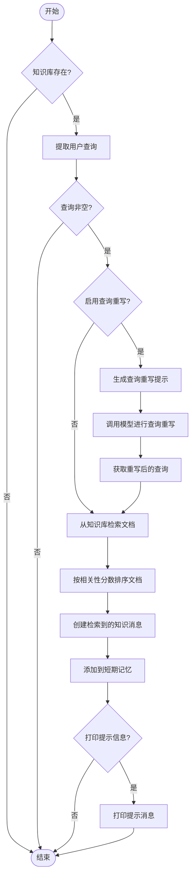
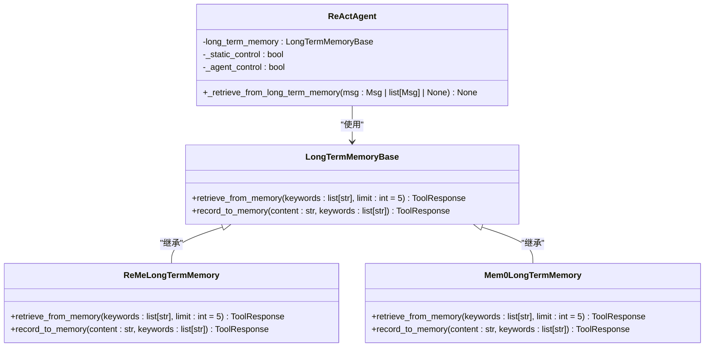
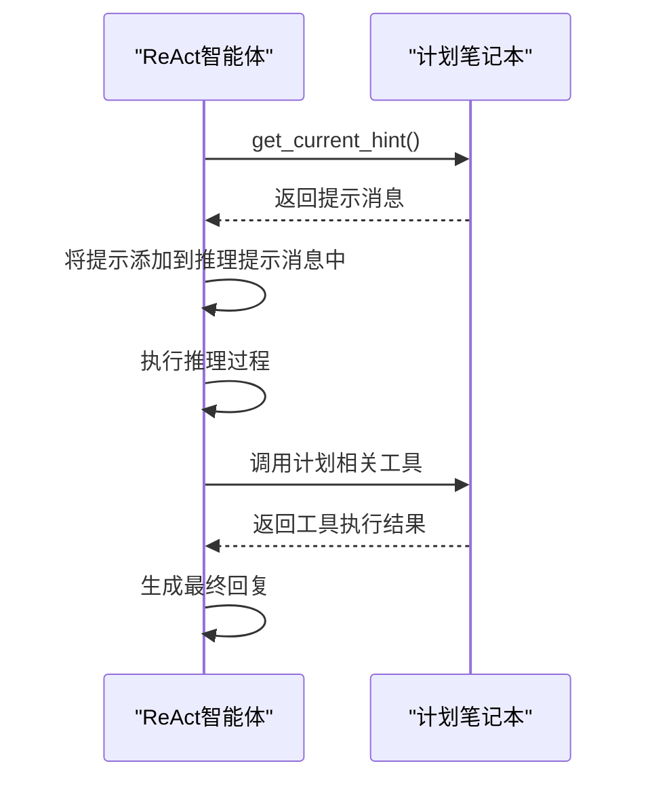
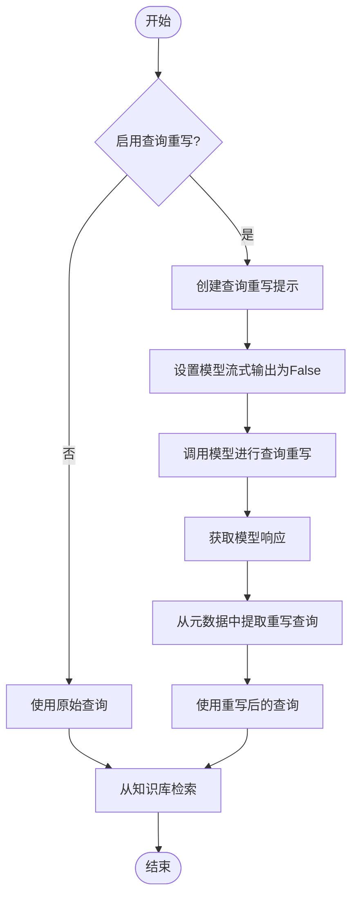
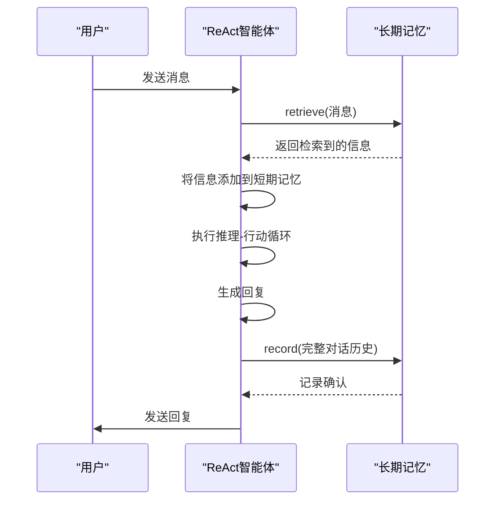

# 实时引导

<cite>
**本文档中引用的文件**   
- [\_react\_agent.py](file://src/agentscope/agent/_react_agent.py)
- [\_plan\_notebook.py](file://src/agentscope/plan/_plan_notebook.py)
- [\_knowledge\_base.py](file://src/agentscope/rag/_knowledge_base.py)
- [\_reme\_task\_long\_term\_memory.py](file://src/agentscope/memory/_reme/_reme_task_long_term_memory.py)
- [\_reme\_personal\_long\_term\_memory.py](file://src/agentscope/memory/_reme/_reme_personal_long_term_memory.py)
</cite>

## 目录
1. [简介](#简介)
2. [核心功能分析](#核心功能分析)
3. [知识检索机制](#知识检索机制)
4. [长期记忆检索](#长期记忆检索)
5. [计划笔记本引导](#计划笔记本引导)
6. [查询重写机制](#查询重写机制)
7. [提示信息显示](#提示信息显示)
8. [静态控制模式工作流程](#静态控制模式工作流程)

## 简介
本文档详细介绍了ReAct智能体的实时引导功能，重点阐述了如何通过自动检索机制在每次回复前注入相关信息。文档涵盖了知识检索、长期记忆检索、计划笔记本引导、查询重写和提示信息显示等核心功能，为开发者提供全面的技术指导。

## 核心功能分析

ReAct智能体的实时引导功能通过在每次回复前自动检索相关信息并将其注入系统提示，实现了智能体行为的动态引导。该功能主要由两个核心方法组成：`_retrieving_from_knowledge`用于从知识库中检索信息，`_retrieving_from_long_term_memory`用于从长期记忆中检索信息。这些检索到的信息会被作为消息对象添加到短期记忆中，从而影响智能体的决策过程。

**Section sources**
- [\_react\_agent.py](file://src/agentscope/agent/_react_agent.py#L741-L867)

## 知识检索机制

知识检索机制允许ReAct智能体在每次回复前从配置的知识库中检索相关信息。当智能体接收到用户消息时，会自动触发`_retrieve_from_knowledge`方法，该方法会处理用户输入查询，并根据需要进行查询重写，然后从一个或多个知识库中检索相关文档。

检索到的文档会按照相关性分数进行排序，并以特定格式包装成消息对象，添加到智能体的短期记忆中。这些信息被标记为`<retrieved_knowledge>`，以便智能体在生成回复时能够识别和利用这些上下文信息。



**Diagram sources **
- [\_react\_agent.py](file://src/agentscope/agent/_react_agent.py#L767-L867)

**Section sources**
- [\_react\_agent.py](file://src/agentscope/agent/_react_agent.py#L767-L867)
- [\_knowledge\_base.py](file://src/agentscope/rag/_knowledge_base.py#L37-L58)

## 长期记忆检索

长期记忆检索功能使ReAct智能体能够访问存储在长期记忆中的历史信息。通过`_retrieve_from_long_term_memory`方法，智能体可以在每次回复前自动检索与当前对话相关的过往经验。该功能支持两种控制模式：`agent_control`和`static_control`。

在`static_control`模式下，检索和记录操作在每次回复的开始和结束时自动执行，无需智能体主动调用工具函数。而在`agent_control`模式下，智能体会获得`retrieve_from_memory`和`record_to_memory`工具函数，可以自主决定何时检索和记录记忆。



**Diagram sources **
- [\_react\_agent.py](file://src/agentscope/agent/_react_agent.py#L741-L766)
- [\_reme\_task\_long\_term\_memory.py](file://src/agentscope/memory/_reme/_reme_task_long_term_memory.py#L156-L187)
- [\_reme\_personal\_long\_term\_memory.py](file://src/agentscope/memory/_reme/_reme_personal_long_term_memory.py#L155-L183)

**Section sources**
- [\_react\_agent.py](file://src/agentscope/agent/_react_agent.py#L741-L766)
- [\_reme\_task\_long\_term\_memory.py](file://src/agentscope/memory/_reme/_reme_task_long_term_memory.py#L156-L187)

## 计划笔记本引导

计划笔记本（PlanNotebook）为ReAct智能体提供了推理提示，引导其行为以完成复杂任务。通过将PlanNotebook实例传递给ReAct智能体的构造函数，智能体可以获得一系列计划相关的工具函数，如`create_plan`、`update_subtask_state`和`finish_subtask`等。

在每次推理步骤开始时，智能体会调用`get_current_hint`方法获取当前的推理提示。这些提示信息被包装在`<system-hint>`标签中，为智能体提供下一步行动的指导。例如，当计划刚开始时，提示会建议智能体将第一个子任务标记为"进行中"；当某个子任务正在进行时，提示会显示该子任务的详细信息和可选操作。



**Diagram sources **
- [\_react\_agent.py](file://src/agentscope/agent/_react_agent.py#L417-L423)
- [\_plan\_notebook.py](file://src/agentscope/plan/_plan_notebook.py#L232-L293)

**Section sources**
- [\_react\_agent.py](file://src/agentscope/agent/_react_agent.py#L417-L423)
- [\_plan\_notebook.py](file://src/agentscope/plan/_plan_notebook.py#L232-L293)

## 查询重写机制

查询重写机制通过`_query_rewrite_model`实现，旨在优化用户查询以提高知识检索的准确性。当`enable_rewrite_query`参数设置为`True`时，系统会在检索前自动调用语言模型对用户输入进行重写。

该机制的工作流程如下：首先，系统会创建一个包含原始系统提示和特殊指令的重写提示，要求模型将模糊的查询转换为具体、简洁的形式。然后，系统调用配置的模型，并指定`_QueryRewriteModel`作为结构化输出模型，确保返回格式化的重写查询。最后，系统从模型响应的元数据中提取重写后的查询，并使用它进行知识检索。



**Diagram sources **
- [\_react\_agent.py](file://src/agentscope/agent/_react_agent.py#L795-L824)

**Section sources**
- [\_react\_agent.py](file://src/agentscope/agent/_react_agent.py#L795-L824)

## 提示信息显示

通过配置`print_hint_msg`参数，开发者可以控制是否在控制台显示提示信息。当`print_hint_msg`设置为`True`时，系统会在检索到相关信息后自动调用`print`方法，将提示消息输出到控制台。

这包括从计划笔记本获取的推理提示、从长期记忆检索到的信息以及从知识库检索到的内容。这些提示信息对于调试和监控智能体的行为非常有用，可以帮助开发者理解智能体在决策过程中考虑了哪些上下文信息。

```python
# 配置示例
agent = ReActAgent(
    name="Friday",
    sys_prompt="You are a helpful assistant.",
    model=model,
    formatter=formatter,
    plan_notebook=PlanNotebook(),
    print_hint_msg=True,  # 启用提示信息显示
)
```

**Section sources**
- [\_react\_agent.py](file://src/agentscope/agent/_react_agent.py#L71-L72)
- [\_react\_agent.py](file://src/agentscope/agent/_react_agent.py#L221-L222)

## 静态控制模式工作流程

在静态控制模式下，长期记忆的检索和记录操作在每次回复的固定阶段自动执行，无需智能体主动调用工具函数。该模式的工作流程如下：

1. **检索阶段**：在每次回复开始时，系统检查是否启用了静态控制模式。如果是，则调用长期记忆的`retrieve`方法，根据当前输入消息检索相关信息。
2. **信息注入**：将检索到的信息包装成消息对象，并添加到智能体的短期记忆中，使其成为后续推理过程的上下文。
3. **正常推理-行动循环**：执行正常的推理和行动循环，智能体可以根据检索到的信息做出决策。
4. **记录阶段**：在回复生成后，系统自动调用长期记忆的`record`方法，将本次对话的完整历史记录存储到长期记忆中。

这种模式简化了智能体的使用，使其能够自动利用历史信息，而无需在提示中明确指导智能体何时检索或记录记忆。



**Diagram sources **
- [\_react\_agent.py](file://src/agentscope/agent/_react_agent.py#L741-L766)
- [\_react\_agent.py](file://src/agentscope/agent/_react_agent.py#L399-L407)

**Section sources**
- [\_react\_agent.py](file://src/agentscope/agent/_react_agent.py#L741-L766)
- [\_react\_agent.py](file://src/agentscope/agent/_react_agent.py#L399-L407)