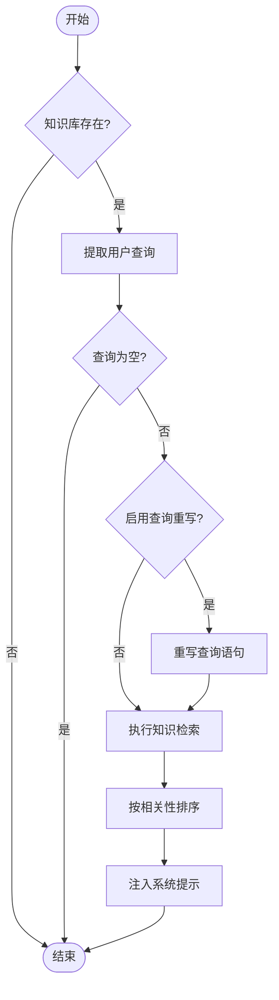
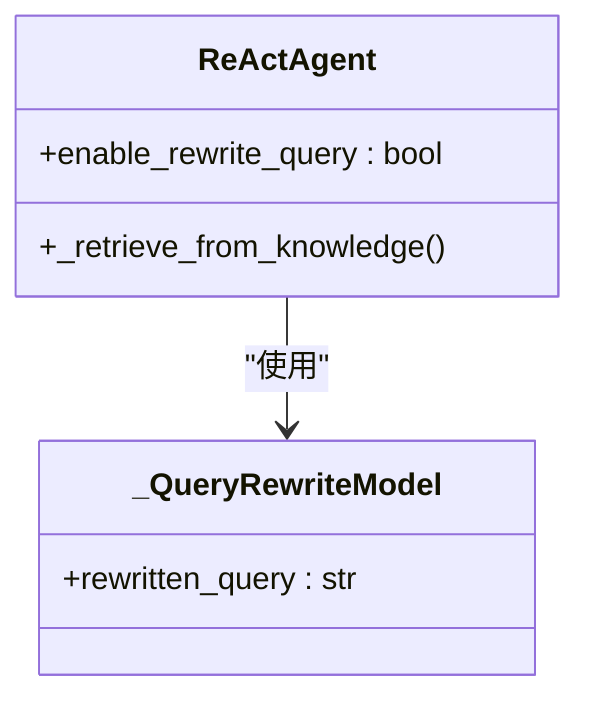
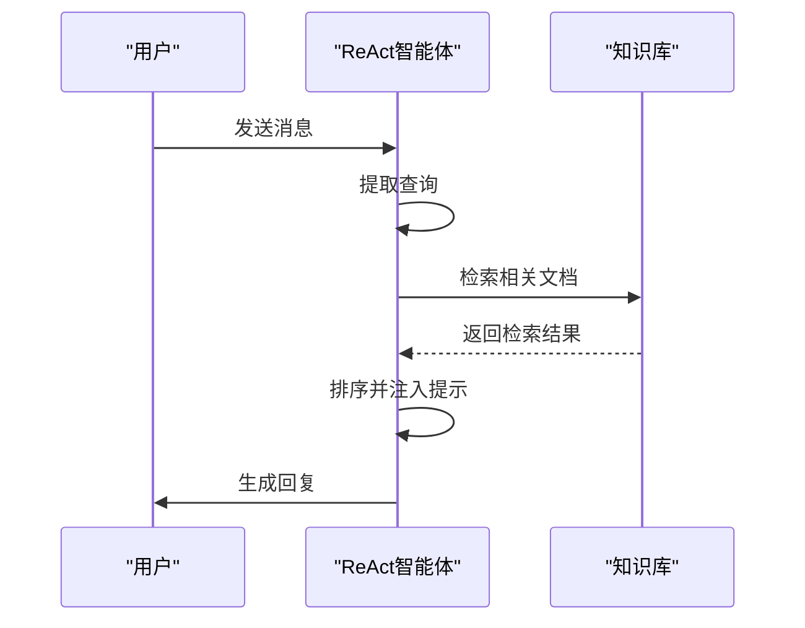

# 知识检索

<cite>
**本文档中引用的文件**  
- [\_react\_agent.py](file://src/agentscope/agent/_react_agent.py)
- [\_knowledge\_base.py](file://src/agentscope/rag/_knowledge_base.py)
- [\_simple\_knowledge.py](file://src/agentscope/rag/_simple_knowledge.py)
- [react\_agent\_integration.py](file://examples/functionality/rag/react_agent_integration.py)
</cite>

## 目录
1. [简介](#简介)
2. [核心功能分析](#核心功能分析)
3. [知识检索工作流程](#知识检索工作流程)
4. [查询重写机制](#查询重写机制)
5. [知识库配置方法](#知识库配置方法)
6. [边界情况处理](#边界情况处理)

## 简介
本文档详细介绍了ReAct智能体中的知识检索功能，重点阐述了`_retrieve_from_knowledge`方法如何在每次回复前自动从知识库中检索相关信息并注入系统提示。文档还深入解析了enable_rewrite_query参数如何启用查询重写功能，以及_query_rewrite_model的使用机制。通过代码示例展示了如何配置knowledge参数来指定一个或多个知识库实例，并解释了查询重写的工作流程，包括如何将模糊查询如'Who am I'重写为具体值以获得更相关的检索结果。

**Section sources**
- [\_react\_agent.py](file://src/agentscope/agent/_react_agent.py#L767-L866)
- [\_knowledge\_base.py](file://src/agentscope/rag/_knowledge_base.py#L1-L131)

## 核心功能分析
ReAct智能体的知识检索功能通过`_retrieve_from_knowledge`方法实现，该方法在每次回复前自动执行。当智能体接收到用户消息时，系统会首先提取消息中的文本内容作为查询语句。如果配置了多个知识库实例，系统会依次从每个知识库中检索相关信息，并将所有检索结果合并。检索到的文档会根据相关性分数进行排序，然后以特定格式注入到系统提示中，供后续的推理和决策过程使用。

**Diagram sources**
- [\_react\_agent.py](file://src/agentscope/agent/_react_agent.py#L767-L866)
- [\_knowledge\_base.py](file://src/agentscope/rag/_knowledge_base.py#L1-L131)

**Section sources**
- [\_react\_agent.py](file://src/agentscope/agent/_react_agent.py#L767-L866)
- [\_simple\_knowledge.py](file://src/agentscope/rag/_simple_knowledge.py#L1-L85)

## 知识检索工作流程
知识检索的工作流程始于ReAct智能体的reply方法调用。系统首先检查是否存在配置的知识库实例，如果存在则继续执行检索流程。接下来，系统从输入消息中提取文本内容作为初始查询。对于列表形式的消息，系统会将所有文本内容合并为一个查询字符串。如果查询字符串为空，系统将跳过检索过程。否则，系统会根据enable_rewrite_query参数的设置决定是否进行查询重写。重写后的查询将用于从所有配置的知识库中检索相关文档。检索结果会根据相关性分数进行排序，并以特定格式封装为系统消息，最终添加到对话记忆中。

**Section sources**
- [\_react\_agent.py](file://src/agentscope/agent/_react_agent.py#L767-L866)
- [react\_agent\_integration.py](file://examples/functionality/rag/react_agent_integration.py#L35-L67)

## 查询重写机制
查询重写机制通过`_QueryRewriteModel`结构化模型实现，该模型定义了查询重写的输出格式。当enable_rewrite_query参数设置为True时，系统会构造一个特殊的提示，指导大语言模型将模糊的用户查询重写为更具体和简洁的形式。例如，将"Who am I"重写为具体的用户姓名，或将"what happened last day"重写为具体的日期。系统会临时关闭模型的流式输出功能，以确保能够完整获取重写结果。重写过程使用结构化输出功能，确保返回的JSON格式符合预定义的模式。如果重写过程出现错误，系统会记录警告信息并继续使用原始查询进行检索。

**Diagram sources**
- [\_react\_agent.py](file://src/agentscope/agent/_react_agent.py#L30-L37)
- [\_react\_agent.py](file://src/agentscope/agent/_react_agent.py#L796-L824)

**Section sources**
- [\_react\_agent.py](file://src/agentscope/agent/_react_agent.py#L30-L37)
- [\_react\_agent.py](file://src/agentscope/agent/_react_agent.py#L796-L824)

## 知识库配置方法
配置知识库实例可以通过ReAct智能体的构造函数参数knowledge实现。该参数接受单个KnowledgeBase实例或KnowledgeBase实例的列表。在实际应用中，首先需要创建向量数据库存储实例和嵌入模型实例，然后使用这些实例初始化SimpleKnowledge或其他知识库实现。通过调用add_documents方法可以将文档添加到知识库中。最后，在创建ReAct智能体时，将配置好的知识库实例作为knowledge参数传入。这种设计允许智能体在每次回复前自动从一个或多个知识库中检索相关信息。

**Diagram sources**
- [react\_agent\_integration.py](file://examples/functionality/rag/react_agent_integration.py#L54-L64)
- [\_simple\_knowledge.py](file://src/agentscope/rag/_simple_knowledge.py#L10-L11)

**Section sources**
- [react\_agent\_integration.py](file://examples/functionality/rag/react_agent_integration.py#L54-L64)
- [\_simple\_knowledge.py](file://src/agentscope/rag/_simple_knowledge.py#L10-L11)

## 边界情况处理
系统对多种边界情况进行妥善处理。当knowledge参数为空或未配置时，系统会跳过知识检索流程，确保智能体仍能正常响应。当用户查询为空或仅包含空白字符时，系统会直接返回而不执行检索操作。在查询重写过程中，如果出现异常情况，系统会捕获异常并记录警告信息，然后继续使用原始查询进行检索。对于检索结果，系统会根据相关性分数进行排序，并将最高分的结果优先展示。如果检索结果为空，系统不会添加任何知识提示，确保对话流程不受影响。

**Section sources**
- [\_react\_agent.py](file://src/agentscope/agent/_react_agent.py#L778-L793)
- [\_react\_agent.py](file://src/agentscope/agent/_react_agent.py#L825-L829)