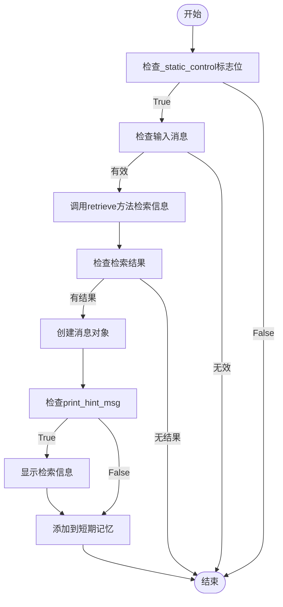

# 长期记忆检索

<cite>
**本文档中引用的文件**  
- [ReActAgent](file://src/agentscope/agent/_react_agent.py)
- [ReMePersonalLongTermMemory](file://src/agentscope/memory/_reme/_reme_personal_long_term_memory.py)
- [ReMeTaskLongTermMemory](file://src/agentscope/memory/_reme/_reme_task_long_term_memory.py)
- [personal_memory_example.py](file://examples/functionality/long_term_memory/reme/personal_memory_example.py)
- [task_memory_example.py](file://examples/functionality/long_term_memory/reme/task_memory_example.py)
</cite>

## 目录
1. [简介](#简介)
2. [长期记忆模式](#长期记忆模式)
3. [静态控制模式下的检索流程](#静态控制模式下的检索流程)
4. [检索行为的影响因素](#检索行为的影响因素)
5. [配置提示信息显示](#配置提示信息显示)
6. [检索时机控制](#检索时机控制)
7. [记忆更新机制](#记忆更新机制)
8. [异常情况处理](#异常情况处理)

## 简介
长期记忆检索功能是ReAct智能体的重要组成部分，它允许智能体在每次回复开始时从长期记忆中检索相关信息并注入对话上下文。该功能通过`_retrieve_from_long_term_memory`方法实现，支持多种检索模式和配置选项，为智能体提供持续的学习和记忆能力。

**Section sources**
- [ReActAgent](file://src/agentscope/agent/_react_agent.py#L39-L865)

## 长期记忆模式
长期记忆功能支持三种工作模式，通过`long_term_memory_mode`参数进行配置：

- **agent_control模式**：由智能体自主控制记忆的读写操作。在这种模式下，`record_to_memory`和`retrieve_from_memory`两个工具函数会被注册到工具包中，允许智能体在运行时主动调用这些函数来管理长期记忆。

- **static_control模式**：由系统静态控制记忆的读写操作。在这种模式下，系统会在每次回复开始时自动从长期记忆中检索相关信息，并在回复结束后自动记录新的记忆。

- **both模式**：结合了上述两种模式的特点，既允许智能体自主控制记忆操作，又保持系统的自动检索和记录功能。

**Section sources**
- [ReActAgent](file://src/agentscope/agent/_react_agent.py#L159-L167)

## 静态控制模式下的检索流程
在`static_control`模式下，`_retrieve_from_long_term_memory`方法的工作流程如下：

1. 检查`_static_control`标志位和输入消息是否有效
2. 调用长期记忆的`retrieve`方法进行信息检索
3. 如果检索到相关信息，将其封装为消息对象
4. 根据`print_hint_msg`配置决定是否显示检索到的记忆信息
5. 将检索到的信息添加到短期记忆中，供后续对话使用

该流程确保了在每次回复开始时，智能体都能获取到与当前对话相关的长期记忆信息。



**Diagram sources**
- [ReActAgent](file://src/agentscope/agent/_react_agent.py#L741-L764)

**Section sources**
- [ReActAgent](file://src/agentscope/agent/_react_agent.py#L741-L764)

## 检索行为的影响因素
长期记忆的检索行为受到多个因素的影响：

- **long_term_memory_mode参数**：决定了记忆管理的基本模式，影响检索的触发方式和控制权归属。
- **_static_control标志位**：在`static_control`或`both`模式下被设置为True，控制是否在每次回复开始时自动执行检索。
- **_agent_control标志位**：在`agent_control`或`both`模式下被设置为True，决定是否将记忆管理工具注册到工具包中。
- **输入消息的有效性**：只有当输入消息存在且有效时，才会执行检索操作。

这些因素共同决定了长期记忆的检索时机、方式和结果处理。

**Section sources**
- [ReActAgent](file://src/agentscope/agent/_react_agent.py#L160-L167)

## 配置提示信息显示
通过`print_hint_msg`参数可以配置是否显示检索到的记忆信息。当`print_hint_msg`设置为True时，系统会在检索到相关信息后将其显示出来；当设置为False时，则不显示。

在代码中配置`print_hint_msg`的示例如下：

```python
agent = ReActAgent(
    name="Friday",
    sys_prompt="You are a helpful assistant",
    model=model,
    formatter=formatter,
    long_term_memory=long_term_memory,
    long_term_memory_mode="static_control",
    print_hint_msg=True,  # 启用提示信息显示
)
```

启用提示信息显示有助于调试和监控长期记忆的检索效果，让用户了解智能体使用了哪些历史信息来生成回复。

**Section sources**
- [ReActAgent](file://src/agentscope/agent/_react_agent.py#L71-L72)
- [ReActAgent](file://src/agentscope/agent/_react_agent.py#L125-L128)
- [ReActAgent](file://src/agentscope/agent/_react_agent.py#L221)

## 检索时机控制
`_static_control`标志位是控制检索时机的关键参数。该标志位在ReActAgent初始化时根据`long_term_memory`和`long_term_memory_mode`参数的值进行设置：

- 当`long_term_memory`存在且`long_term_memory_mode`为"static_control"或"both"时，`_static_control`被设置为True
- 当`_static_control`为True时，系统会在每次回复开始时自动执行检索操作
- 当`_static_control`为False时，不会自动执行检索，需要智能体主动调用相关工具函数

这种设计提供了灵活的控制机制，既支持自动化的记忆管理，又保留了手动控制的可能性。

**Section sources**
- [ReActAgent](file://src/agentscope/agent/_react_agent.py#L160-L163)

## 记忆更新机制
在`static_control`模式下，记忆更新机制在回复结束后自动执行。具体流程如下：

1. 智能体完成回复生成
2. 系统调用长期记忆的`record`方法
3. 将本次对话的输入消息、对话历史和回复消息作为整体记录到长期记忆中
4. 完成记忆更新，准备下一次对话

这种机制确保了所有相关的对话信息都能被持久化存储，为后续的检索提供完整的历史数据。

**Section sources**
- [ReActAgent](file://src/agentscope/agent/_react_agent.py#L398-L405)

## 异常情况处理
系统对以下异常情况进行了特殊处理：

- **长期记忆未配置**：当`long_term_memory`参数未配置时，不会执行任何检索操作，智能体仅基于当前对话上下文进行回复。
- **检索结果为空**：当检索操作返回空结果时，系统会跳过信息注入步骤，继续执行后续的回复流程。
- **输入消息无效**：当输入消息为None或无效时，不会执行检索操作。

这些处理机制确保了系统的健壮性，即使在异常情况下也能正常运行。

**Section sources**
- [ReActAgent](file://src/agentscope/agent/_react_agent.py#L751-L752)
- [ReActAgent](file://src/agentscope/agent/_react_agent.py#L754-L755)