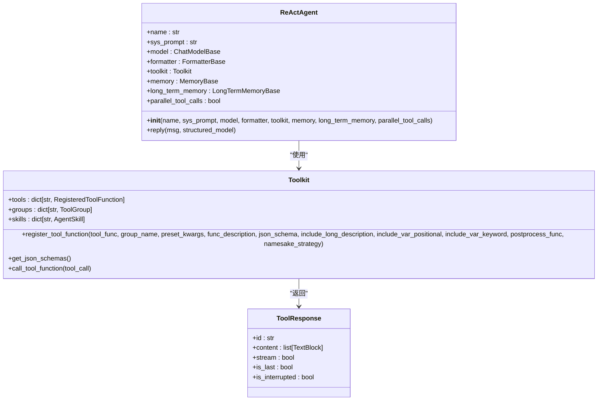
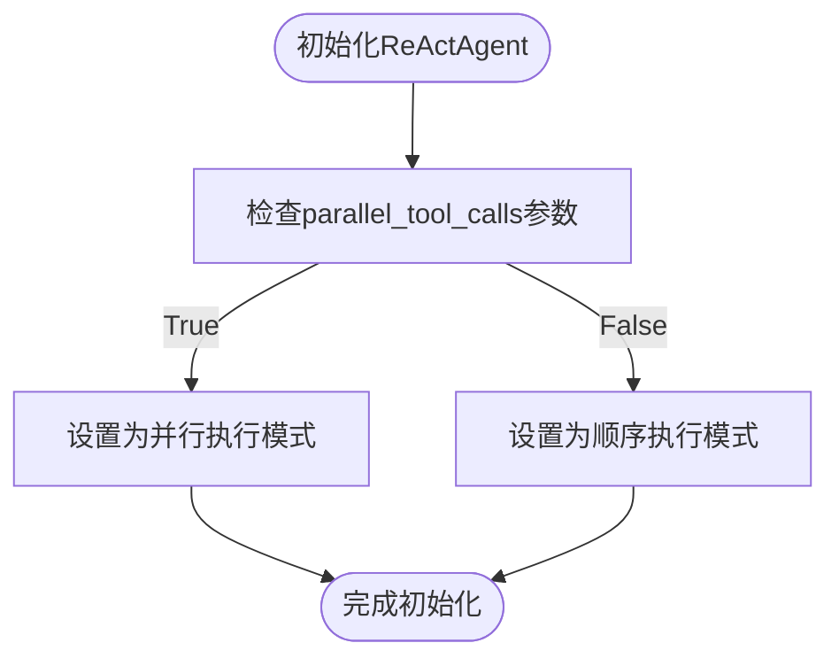
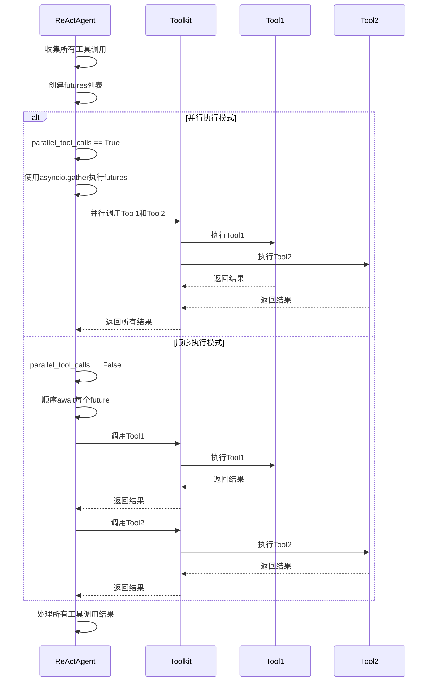
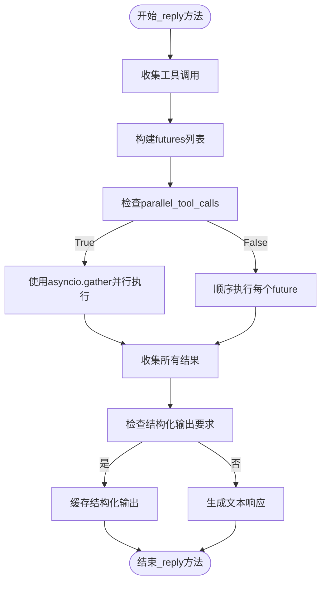

# 并行工具调用

<cite>
**本文档中引用的文件**   
- [task_agent.py](file://docs\tutorial\zh_CN\src\task_agent.py)
- [quickstart_agent.py](file://docs\tutorial\en\src\quickstart_agent.py)
- [_react_agent.py](file://src\agentscope\agent\_react_agent.py)
- [_react_agent_base.py](file://src\agentscope\agent\_react_agent_base.py)
- [_toolkit.py](file://src\agentscope\tool\_toolkit.py)
- [react_agent_test.py](file://tests\react_agent_test.py)
- [_python.py](file://src\agentscope\tool\_coding\_python.py)
- [_shell.py](file://src\agentscope\tool\_coding\_shell.py)
</cite>

## 目录
1. [简介](#简介)
2. [核心组件分析](#核心组件分析)
3. [并行工具调用配置参数](#并行工具调用配置参数)
4. [_reply方法中的执行模式选择](#_reply方法中的执行模式选择)
5. [_futures列表的构建与结果处理](#_futures列表的构建与结果处理)
6. [性能考虑与适用场景](#性能考虑与适用场景)
7. [结论](#结论)

## 简介
ReAct智能体通过并行工具调用功能，能够显著提升多工具调用场景下的执行效率。该功能的核心在于`parallel_tool_calls`配置参数，它控制着工具执行模式的选择。当LLM生成多个工具调用时，该参数决定了这些调用是并行执行还是顺序执行。本文档将深入分析这一机制，解释`_reply`方法如何根据`parallel_tool_calls`的值选择使用`asyncio.gather`进行并行执行或顺序执行，并通过代码示例展示并行执行如何提高效率。

**Section sources**
- [task_agent.py](file://docs\tutorial\zh_CN\src\task_agent.py#L108-L109)

## 核心组件分析
ReAct智能体的并行工具调用功能主要涉及以下几个核心组件：`ReActAgent`类、`Toolkit`类以及相关的工具函数。`ReActAgent`类是ReAct智能体的实现，它支持实时控制、基于API的（并行）工具调用、围绕推理、行动、回复、观察和打印函数的钩子，以及结构化输出生成。`Toolkit`类则是工具调用的核心模块，负责注册、管理和删除工具函数，支持工具函数的分组管理以及动态扩展工具函数的JSON模式。

**Diagram sources **
- [_react_agent.py](file://src\agentscope\agent\_react_agent.py#L53-L226)
- [_toolkit.py](file://src\agentscope\tool\_toolkit.py#L55-L111)

**Section sources**
- [_react_agent.py](file://src\agentscope\agent\_react_agent.py#L40-L226)
- [_toolkit.py](file://src\agentscope\tool\_toolkit.py#L55-L111)

## 并行工具调用配置参数
`parallel_tool_calls`是`ReActAgent`类的一个重要配置参数，它是一个布尔值，默认为`False`。当该参数设置为`True`时，ReAct智能体将并行执行多个工具调用；当设置为`False`时，则按顺序执行。这个参数在`ReActAgent`的构造函数中被初始化，并在整个智能体的生命周期中控制工具调用的执行模式。

**Diagram sources **
- [_react_agent.py](file://src\agentscope\agent\_react_agent.py#L68-L69)

**Section sources**
- [_react_agent.py](file://src\agentscope\agent\_react_agent.py#L68-L69)

## _reply方法中的执行模式选择
`_reply`方法是ReAct智能体的核心方法之一，它负责生成回复。在该方法中，根据`parallel_tool_calls`的值选择使用`asyncio.gather`进行并行执行或顺序执行。具体来说，当`parallel_tool_calls`为`True`时，使用`asyncio.gather(*futures)`来并行执行所有工具调用；当为`False`时，则使用列表推导式`[await _ for _ in futures]`来顺序执行。

**Diagram sources **
- [_react_agent.py](file://src\agentscope\agent\_react_agent.py#L321-L325)

**Section sources**
- [_react_agent.py](file://src\agentscope\agent\_react_agent.py#L321-L325)

## _futures列表的构建与结果处理
在`_reply`方法中，首先通过列表推导式`[self._acting(tool_call) for tool_call in msg_reasoning.get_content_blocks("tool_use")]`构建`futures`列表。每个`future`代表一个待执行的工具调用。然后，根据`parallel_tool_calls`的值选择执行模式。执行完成后，所有工具调用的结果被收集并处理。如果需要结构化输出，还会检查并缓存生成的结构化输出数据。

**Diagram sources **
- [_react_agent.py](file://src\agentscope\agent\_react_agent.py#L314-L325)

**Section sources**
- [_react_agent.py](file://src\agentscope\agent\_react_agent.py#L314-L325)

## 性能考虑与适用场景
并行工具调用可以显著提高多工具调用场景的效率，尤其是在工具调用之间没有依赖关系的情况下。然而，并行执行也会增加系统资源的消耗，可能会影响系统的稳定性和响应速度。因此，在启用并行模式时，需要权衡性能提升和资源消耗。建议在工具调用耗时较长且相互独立的场景下启用并行模式，而在资源受限或工具调用有依赖关系的场景下保持顺序执行模式。

**Section sources**
- [quickstart_agent.py](file://docs\tutorial\en\src\quickstart_agent.py#L86-L88)

## 结论
ReAct智能体的并行工具调用功能通过`parallel_tool_calls`配置参数灵活地控制工具执行模式，使得开发者可以根据具体应用场景选择最优的执行策略。通过深入分析`_reply`方法中的执行模式选择和`futures`列表的构建过程，我们可以更好地理解这一机制的工作原理，并在实际应用中充分利用其优势，提高智能体的响应速度和执行效率。