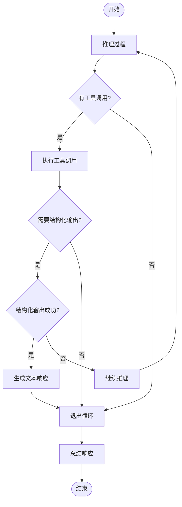
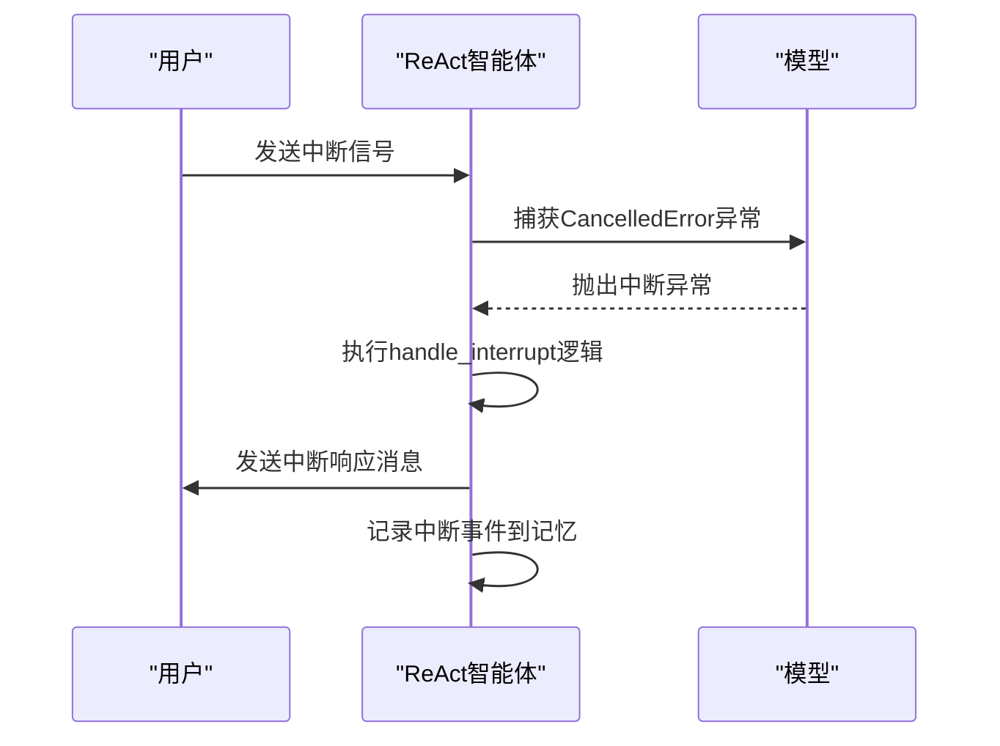
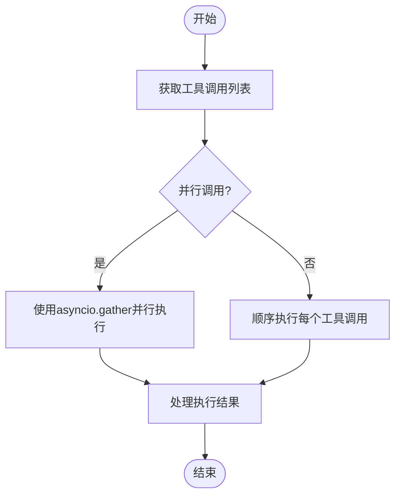
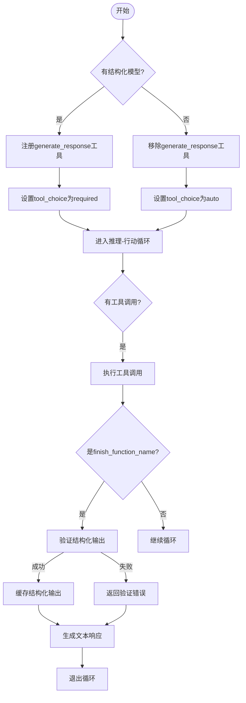
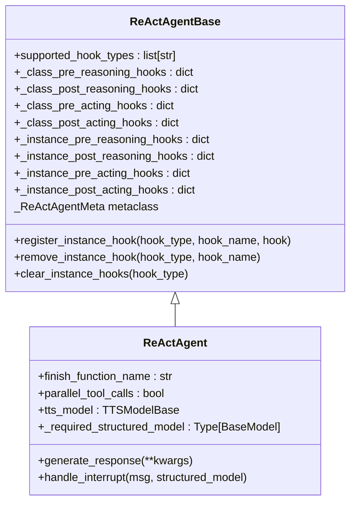
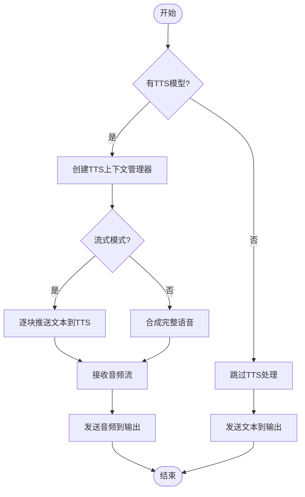

# 核心功能

<cite>
**本文档中引用的文件**  
- [ReActAgent](file://src/agentscope/agent/_react_agent.py)
- [ReActAgentBase](file://src/agentscope/agent/_react_agent_base.py)
- [TTSModelBase](file://src/agentscope/tts/_tts_base.py)
- [tts/main.py](file://examples/functionality/tts/main.py)
- [structured_output/main.py](file://examples/functionality/structured_output/main.py)
</cite>

## 目录
1. [简介](#简介)
2. [推理-行动-观察循环机制](#推理-行动-观察循环机制)
3. [实时引导与中断处理](#实时引导与中断处理)
4. [并行工具调用](#并行工具调用)
5. [结构化输出生成](#结构化输出生成)
6. [执行过程监控与干预](#执行过程监控与干预)
7. [TTS模型集成](#tts模型集成)

## 简介
ReAct智能体是AgentScope框架中的核心组件，实现了ReAct（推理-行动）算法。该智能体支持实时引导、API并行工具调用、执行过程监控和结构化输出生成等高级功能。通过精心设计的类继承结构和元类机制，ReAct智能体能够灵活地扩展和定制其行为，满足各种复杂应用场景的需求。

**Section sources**
- [ReActAgent](file://src/agentscope/agent/_react_agent.py#L40-L47)

## 推理-行动-观察循环机制
ReAct智能体的核心是其推理-行动-观察循环机制，该机制通过`reply`方法实现。在每次回复中，智能体首先进行推理，生成工具调用或文本响应；然后执行工具调用；最后观察执行结果并更新记忆。这个循环会持续进行，直到达到最大迭代次数或满足退出条件。



**Diagram sources**
- [ReActAgent](file://src/agentscope/agent/_react_agent.py#L309-L397)

**Section sources**
- [ReActAgent](file://src/agentscope/agent/_react_agent.py#L253-L408)
- [ReActAgentBase](file://src/agentscope/agent/_react_agent_base.py#L104-L116)

## 实时引导与中断处理
ReAct智能体支持实时引导功能，允许用户在智能体执行过程中进行干预。当用户中断智能体时，系统会捕获`asyncio.CancelledError`异常，并执行`handle_interrupt`方法进行相应的处理。这种机制使得智能体能够优雅地处理用户中断，将中断转换为可观察的事件，从而实现无缝的对话恢复。



**Diagram sources**
- [ReActAgent](file://src/agentscope/agent/_react_agent.py#L491-L521)
- [ReActAgent](file://src/agentscope/agent/_react_agent.py#L658-L686)

**Section sources**
- [ReActAgent](file://src/agentscope/agent/_react_agent.py#L491-L521)
- [ReActAgent](file://src/agentscope/agent/_react_agent.py#L658-L686)

## 并行工具调用
ReAct智能体支持并行工具调用功能，通过`parallel_tool_calls`参数控制。当此参数设置为`True`时，智能体将并行执行多个工具调用，从而提高执行效率。该功能通过`asyncio.gather`实现，能够同时处理多个异步工具调用任务。

```python
# 配置并行工具调用
agent = ReActAgent(
    name="Friday",
    sys_prompt="You are a helpful assistant.",
    model=model,
    formatter=formatter,
    parallel_tool_calls=True,  # 启用并行工具调用
)
```



**Diagram sources**
- [ReActAgent](file://src/agentscope/agent/_react_agent.py#L321-L326)

**Section sources**
- [ReActAgent](file://src/agentscope/agent/_react_agent.py#L68-L69)
- [ReActAgent](file://src/agentscope/agent/_react_agent.py#L321-L326)

## 结构化输出生成
ReAct智能体通过`finish_function_name`属性控制结构化输出的生成。当需要生成结构化输出时，智能体会注册一个名为`generate_response`的工具函数，并将其与指定的Pydantic模型关联。在执行过程中，如果该工具函数被调用且验证成功，智能体将缓存结构化输出并在后续步骤中使用。

```python
# 定义结构化输出模型
class PersonModel(BaseModel):
    name: str = Field(description="姓名")
    age: int = Field(description="年龄", ge=0, le=120)

# 使用结构化输出
response = await agent(message, structured_model=PersonModel)
```



**Diagram sources**
- [ReActAgent](file://src/agentscope/agent/_react_agent.py#L285-L304)
- [ReActAgent](file://src/agentscope/agent/_react_agent.py#L688-L739)

**Section sources**
- [ReActAgent](file://src/agentscope/agent/_react_agent.py#L49-L52)
- [ReActAgent](file://src/agentscope/agent/_react_agent.py#L285-L304)
- [ReActAgent](file://src/agentscope/agent/_react_agent.py#L688-L739)

## 执行过程监控与干预
ReAct智能体通过hooks机制实现执行过程的监控和干预。该机制基于元类`_ReActAgentMeta`，为`_reasoning`和`_acting`方法添加了前置和后置钩子。开发者可以通过`register_instance_hook`方法注册自定义的钩子函数，在推理和行动过程的关键节点插入自定义逻辑。

```python
# 注册钩子函数
def pre_reasoning_hook(self, kwargs):
    print("即将开始推理")
    return kwargs

agent.register_instance_hook(
    "pre_reasoning",
    "my_hook",
    pre_reasoning_hook
)
```



**Diagram sources**
- [ReActAgentBase](file://src/agentscope/agent/_react_agent_base.py#L21-L32)
- [ReActAgent](file://src/agentscope/agent/_agent_meta.py#L165-L180)

**Section sources**
- [ReActAgentBase](file://src/agentscope/agent/_react_agent_base.py#L21-L32)
- [ReActAgent](file://src/agentscope/agent/_agent_meta.py#L165-L180)
- [ReActAgent](file://src/agentscope/agent/_react_agent.py#L111-L114)

## TTS模型集成
ReAct智能体集成了TTS（文本转语音）模型，支持实时语音合成功能。通过`TTSModelBase`基类，智能体可以与不同的TTS服务集成。TTS模型可以在流式模式下工作，实时将文本转换为语音，为智能体提供语音交互能力。

```python
# 配置TTS模型
agent = ReActAgent(
    name="Friday",
    sys_prompt="You are a helpful assistant.",
    model=model,
    formatter=formatter,
    tts_model=DashScopeRealtimeTTSModel(
        model_name="qwen3-tts-flash-realtime",
        api_key=os.environ.get("DASHSCOPE_API_KEY"),
        voice="Cherry",
        stream=False,
    ),
)
```



**Diagram sources**
- [ReActAgent](file://src/agentscope/agent/_react_agent.py#L446-L485)
- [TTSModelBase](file://src/agentscope/tts/_tts_base.py#L12-L144)

**Section sources**
- [ReActAgent](file://src/agentscope/agent/_react_agent.py#L74-L75)
- [ReActAgent](file://src/agentscope/agent/_react_agent.py#L446-L485)
- [TTSModelBase](file://src/agentscope/tts/_tts_base.py#L12-L144)