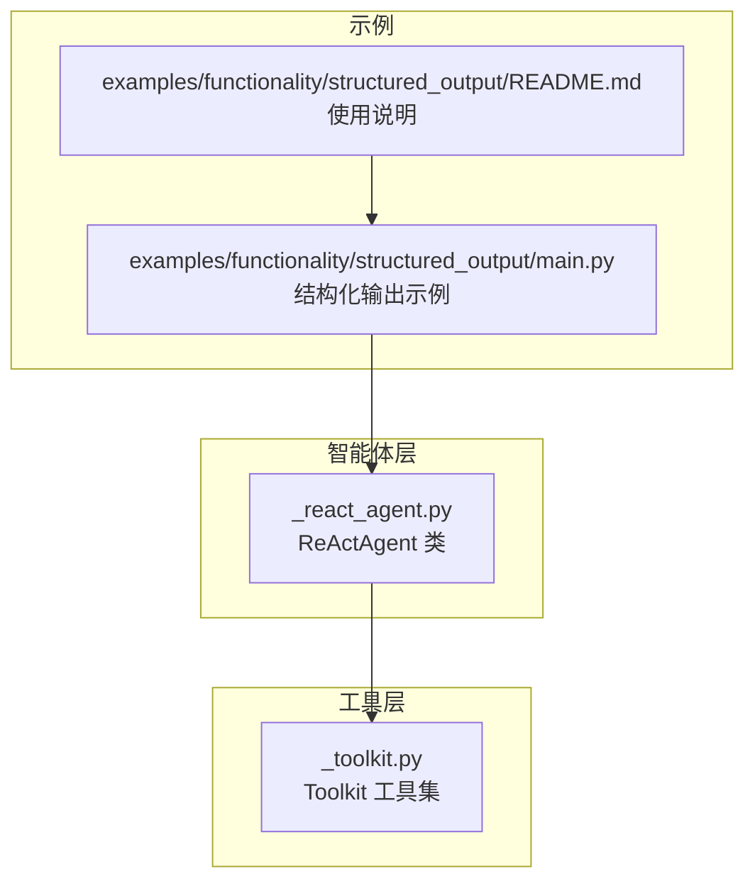
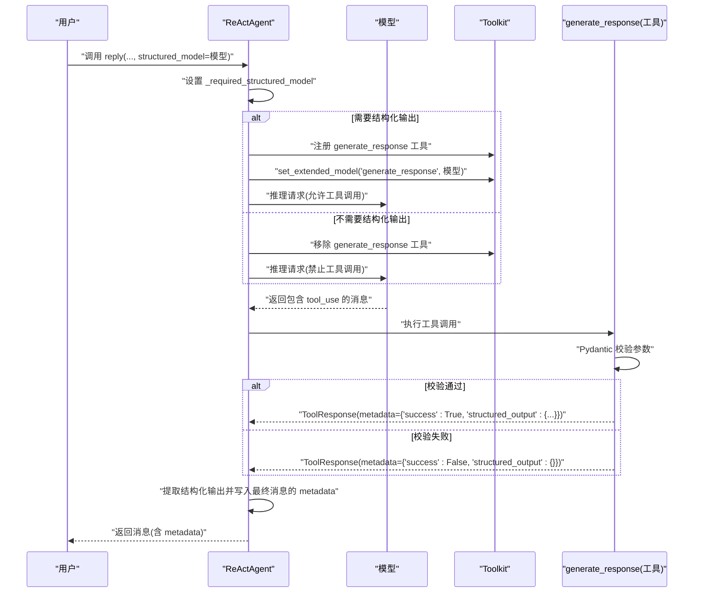
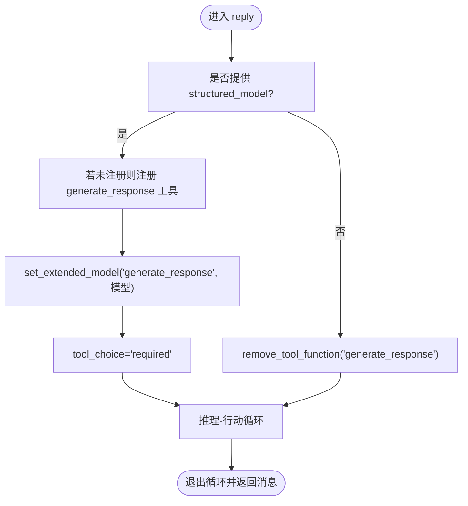
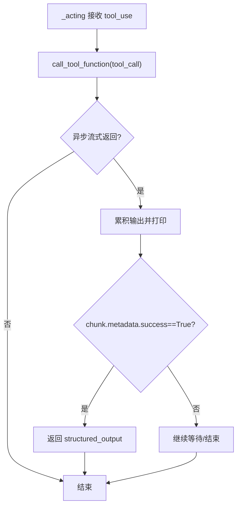
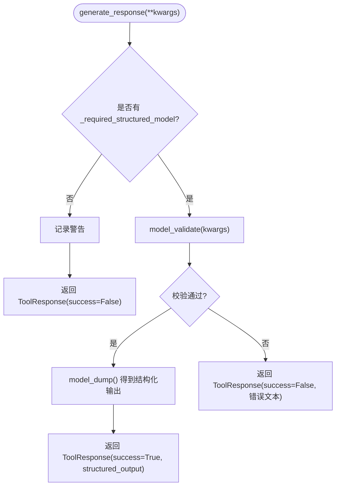
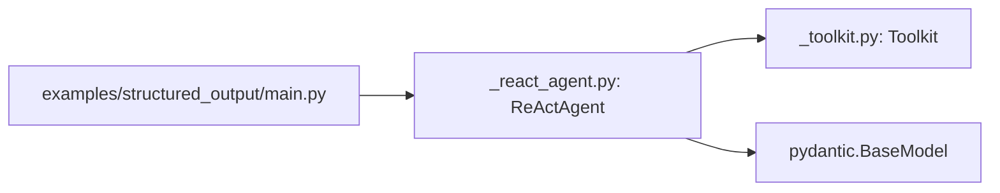

# 结构化输出

<cite>
**本文引用的文件**
- [src/agentscope/agent/_react_agent.py](file://src/agentscope/agent/_react_agent.py)
- [src/agentscope/tool/_toolkit.py](file://src/agentscope/tool/_toolkit.py)
- [examples/functionality/structured_output/main.py](file://examples/functionality/structured_output/main.py)
- [examples/functionality/structured_output/README.md](file://examples/functionality/structured_output/README.md)
</cite>

## 目录
1. [简介](#简介)
2. [项目结构](#项目结构)
3. [核心组件](#核心组件)
4. [架构总览](#架构总览)
5. [详细组件分析](#详细组件分析)
6. [依赖关系分析](#依赖关系分析)
7. [性能考量](#性能考量)
8. [故障排查指南](#故障排查指南)
9. [结论](#结论)
10. [附录](#附录)

## 简介
本文件系统性阐述 ReAct 智能体在 AgentScope 中的“结构化输出”能力，重点围绕以下主题：
- finish_function_name 属性如何控制结构化输出生成工具的注册与行为
- _reply（即 reply）方法如何依据 structured_model 参数动态注册/移除 generate_response 工具
- generate_response 方法如何使用 Pydantic 模型进行参数校验与输出转换
- 如何通过定义结构化输出模型并在 reply 调用中传入以触发生成
- _validationError 处理机制与元数据存储方式（res.metadata）

该文档旨在帮助读者从高层到代码级逐步理解 ReAct 结构化输出的工作原理，并提供可操作的实践建议与排错指引。

## 项目结构
ReAct 结构化输出相关的核心代码位于 agent 子模块，工具注册与调用由 toolkit 提供，示例位于 examples/functionality/structured_output。

图表来源
- [src/agentscope/agent/_react_agent.py](file://src/agentscope/agent/_react_agent.py#L252-L408)
- [src/agentscope/tool/_toolkit.py](file://src/agentscope/tool/_toolkit.py#L529-L556)
- [examples/functionality/structured_output/main.py](file://examples/functionality/structured_output/main.py#L37-L81)

章节来源
- [src/agentscope/agent/_react_agent.py](file://src/agentscope/agent/_react_agent.py#L252-L408)
- [src/agentscope/tool/_toolkit.py](file://src/agentscope/tool/_toolkit.py#L529-L556)
- [examples/functionality/structured_output/main.py](file://examples/functionality/structured_output/main.py#L37-L81)

## 核心组件
- ReActAgent：支持推理-行动循环、工具调用、长短期记忆与结构化输出的智能体。其 finish_function_name 默认为 "generate_response"，用于生成结构化输出。
- Toolkit：提供工具函数注册、扩展模型设置、JSON Schema 生成与工具调用等能力。ReActAgent 在需要时将 generate_response 注册为工具，并为其设置扩展模型。
- Pydantic BaseModel：作为结构化输出模型的基础类型，用于参数校验与序列化。

章节来源
- [src/agentscope/agent/_react_agent.py](file://src/agentscope/agent/_react_agent.py#L48-L51)
- [src/agentscope/tool/_toolkit.py](file://src/agentscope/tool/_toolkit.py#L529-L556)

## 架构总览
ReAct 的结构化输出流程如下：
- 调用 agent.reply(..., structured_model=...) 时，ReActAgent 根据是否提供模型决定是否注册 generate_response 工具，并将其扩展模型设为传入的 Pydantic 模型
- LLM 在推理阶段可能调用 generate_response 工具；ReActAgent 的 _acting 会捕获该工具返回的 ToolResponse 元数据
- generate_response 使用 Pydantic 对输入参数进行校验，成功则返回包含结构化输出的 ToolResponse，失败则返回错误信息与 success=False 的元数据
- 最终输出消息的 metadata 字段承载结构化结果

图表来源
- [src/agentscope/agent/_react_agent.py](file://src/agentscope/agent/_react_agent.py#L252-L408)
- [src/agentscope/agent/_react_agent.py](file://src/agentscope/agent/_react_agent.py#L523-L581)
- [src/agentscope/agent/_react_agent.py](file://src/agentscope/agent/_react_agent.py#L688-L740)
- [src/agentscope/tool/_toolkit.py](file://src/agentscope/tool/_toolkit.py#L529-L556)

## 详细组件分析

### finish_function_name 属性与工具注册
- ReActAgent.finish_function_name 默认为 "generate_response"，用于标识结构化输出生成工具的名称
- 当 reply(..., structured_model=...) 被调用且模型非空时：
  - 若工具尚未注册，则通过 Toolkit.register_tool_function 将 self.generate_response 注册为工具
  - 通过 Toolkit.set_extended_model 将该工具的扩展模型设置为传入的 Pydantic 模型
  - 将 tool_choice 设为 "required"，强制 LLM 在推理阶段调用工具
- 当不需要结构化输出时：
  - 通过 Toolkit.remove_tool_function 移除 "generate_response" 工具
  - 保持 tool_choice 为 None 或 "auto"/"none"，视上下文而定

图表来源
- [src/agentscope/agent/_react_agent.py](file://src/agentscope/agent/_react_agent.py#L284-L303)
- [src/agentscope/agent/_react_agent.py](file://src/agentscope/agent/_react_agent.py#L290-L303)
- [src/agentscope/tool/_toolkit.py](file://src/agentscope/tool/_toolkit.py#L529-L556)

章节来源
- [src/agentscope/agent/_react_agent.py](file://src/agentscope/agent/_react_agent.py#L284-L303)
- [src/agentscope/tool/_toolkit.py](file://src/agentscope/tool/_toolkit.py#L529-L556)

### _acting 中对结构化输出的处理
- _acting 接收来自 LLM 的 tool_use 块，调用 Toolkit.call_tool_function 执行对应工具
- 对于 generate_response 工具：
  - 若返回的 ToolResponse 元数据中 success=True，则返回其中的 structured_output
  - 否则忽略（可能是校验失败或未生成）
- 该返回值会被上层逻辑缓存并用于构造最终消息的 metadata

图表来源
- [src/agentscope/agent/_react_agent.py](file://src/agentscope/agent/_react_agent.py#L523-L581)

章节来源
- [src/agentscope/agent/_react_agent.py](file://src/agentscope/agent/_react_agent.py#L523-L581)

### generate_response 的 Pydantic 校验与元数据
- generate_response 使用 _required_structured_model 对 kwargs 进行 model_validate，并将结果 model_dump() 作为 structured_output
- 若校验失败，抛出 ValidationError，generate_response 返回 ToolResponse 并设置 metadata.success=False，structured_output 为空字典
- 若无 _required_structured_model，记录警告日志并返回 success=False 的 ToolResponse
- 成功时返回 ToolResponse，metadata.success=True，structured_output 为 Pydantic 序列化后的字典

图表来源
- [src/agentscope/agent/_react_agent.py](file://src/agentscope/agent/_react_agent.py#L688-L740)

章节来源
- [src/agentscope/agent/_react_agent.py](file://src/agentscope/agent/_react_agent.py#L688-L740)

### 元数据存储与最终消息
- 当结构化输出生成成功时，ReActAgent 会在推理-行动循环中将结构化输出写入最终消息的 metadata 字段
- 若未生成结构化输出，metadata 可能为空或仅包含中断标记等信息

章节来源
- [src/agentscope/agent/_react_agent.py](file://src/agentscope/agent/_react_agent.py#L333-L365)
- [src/agentscope/agent/_react_agent.py](file://src/agentscope/agent/_react_agent.py#L384-L396)

### 示例：定义结构化输出模型并通过 reply 触发生成
- 示例展示了如何定义 Pydantic 模型（如 TableModel、ChoiceModel），并通过 agent(..., structured_model=...) 触发结构化输出
- 输出结果可通过 res.metadata 获取结构化字段

章节来源
- [examples/functionality/structured_output/main.py](file://examples/functionality/structured_output/main.py#L18-L36)
- [examples/functionality/structured_output/main.py](file://examples/functionality/structured_output/main.py#L53-L77)
- [examples/functionality/structured_output/README.md](file://examples/functionality/structured_output/README.md#L62-L67)

## 依赖关系分析
- ReActAgent 依赖 Toolkit 完成工具注册、扩展模型设置与工具调用
- ReActAgent 依赖 Pydantic BaseModel 进行参数校验与序列化
- 示例脚本依赖 ReActAgent 与 DashScope 模型/格式化器

图表来源
- [src/agentscope/agent/_react_agent.py](file://src/agentscope/agent/_react_agent.py#L252-L408)
- [src/agentscope/tool/_toolkit.py](file://src/agentscope/tool/_toolkit.py#L529-L556)
- [examples/functionality/structured_output/main.py](file://examples/functionality/structured_output/main.py#L37-L81)

章节来源
- [src/agentscope/agent/_react_agent.py](file://src/agentscope/agent/_react_agent.py#L252-L408)
- [src/agentscope/tool/_toolkit.py](file://src/agentscope/tool/_toolkit.py#L529-L556)
- [examples/functionality/structured_output/main.py](file://examples/functionality/structured_output/main.py#L37-L81)

## 性能考量
- 工具注册与扩展模型设置发生在每次 reply 调用前，属于轻量操作，开销主要取决于 JSON Schema 生成与模型扩展
- 若频繁切换是否需要结构化输出，建议在业务侧减少不必要的重复注册/注销，避免频繁构建 Schema
- 异步流式工具调用会逐块累积输出，注意内存占用与打印频率

## 故障排查指南
- 工具未找到或未激活
  - 现象：调用工具时报错或返回错误信息
  - 排查：确认是否已注册 generate_response；若使用工具组，确认组处于激活状态
  - 参考路径：[src/agentscope/tool/_toolkit.py](file://src/agentscope/tool/_toolkit.py#L614-L650)
- 结构化输出校验失败
  - 现象：generate_response 返回 success=False，metadata 中包含错误文本
  - 排查：检查 Pydantic 模型字段描述、约束与输入参数是否匹配
  - 参考路径：[src/agentscope/agent/_react_agent.py](file://src/agentscope/agent/_react_agent.py#L708-L720)
- 未提供结构化模型却调用 generate_response
  - 现象：generate_response 记录警告日志
  - 排查：确保在调用 reply 时传入了 structured_model
  - 参考路径：[src/agentscope/agent/_react_agent.py](file://src/agentscope/agent/_react_agent.py#L721-L725)
- 输出未写入 metadata
  - 现象：最终消息缺少结构化字段
  - 排查：确认 _acting 是否正确返回结构化输出；确认推理-行动循环中是否命中生成分支
  - 参考路径：[src/agentscope/agent/_react_agent.py](file://src/agentscope/agent/_react_agent.py#L333-L365)

章节来源
- [src/agentscope/tool/_toolkit.py](file://src/agentscope/tool/_toolkit.py#L614-L650)
- [src/agentscope/agent/_react_agent.py](file://src/agentscope/agent/_react_agent.py#L708-L725)
- [src/agentscope/agent/_react_agent.py](file://src/agentscope/agent/_react_agent.py#L333-L365)

## 结论
ReAct 智能体通过 finish_function_name 与 Toolkit 的协作，实现了“按需启用”的结构化输出能力：
- 通过 reply 的 structured_model 参数动态注册/移除 generate_response 工具
- 通过 Pydantic 模型对工具参数进行强约束与序列化
- 通过 ToolResponse 的 metadata 字段统一承载结构化输出，便于上层消费

该机制既保证了输出的稳定性与一致性，又避免了不必要的工具暴露，适合在复杂任务中稳定地抽取结构化数据。

## 附录
- 使用建议
  - 为每个结构化输出场景定义清晰的 Pydantic 模型，并提供充分的字段描述
  - 在业务侧尽量复用已注册的工具，减少重复注册带来的开销
  - 对于大模型输出，建议在提示词中强调“严格遵循模型字段”，以提升校验成功率