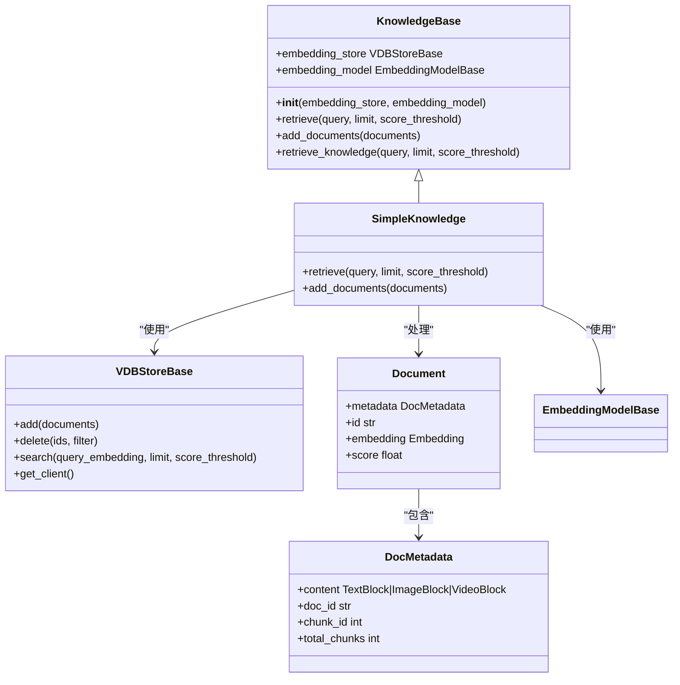
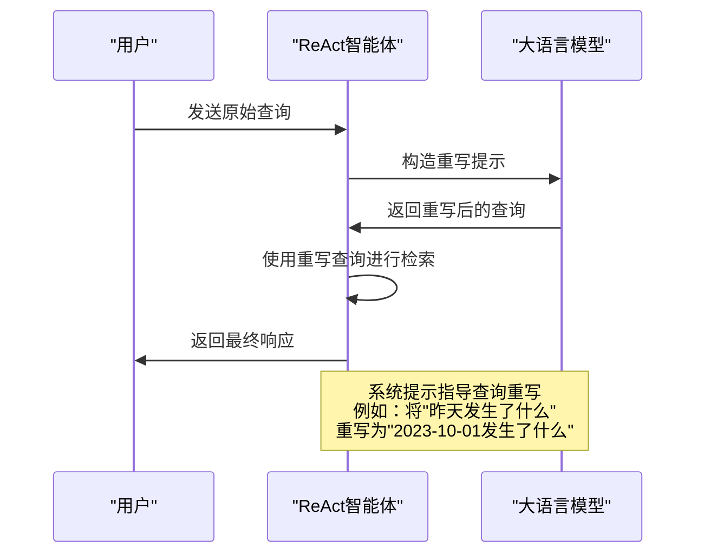
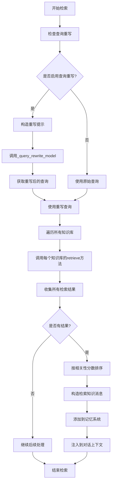
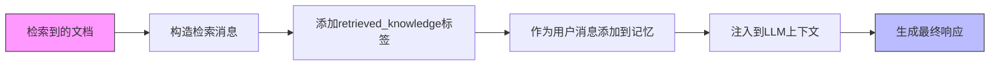

# RAG集成

<cite>
**本文档中引用的文件**  
- [react_agent_integration.py](file://examples/functionality/rag/react_agent_integration.py)
- [basic_usage.py](file://examples/functionality/rag/basic_usage.py)
- [main.py](file://examples/functionality/vector_store/milvus_lite/main.py)
- [_knowledge_base.py](file://src/agentscope/rag/_knowledge_base.py)
- [_simple_knowledge.py](file://src/agentscope/rag/_simple_knowledge.py)
- [_milvuslite_store.py](file://src/agentscope/rag/_store/_milvuslite_store.py)
- [_qdrant_store.py](file://src/agentscope/rag/_store/_qdrant_store.py)
- [_store_base.py](file://src/agentscope/rag/_store/_store_base.py)
- [_document.py](file://src/agentscope/rag/_document.py)
- [_react_agent.py](file://src/agentscope/agent/_react_agent.py)
- [_embedding_base.py](file://src/agentscope/embedding/_embedding_base.py)
</cite>

## 目录
1. [简介](#简介)
2. [知识库系统集成](#知识库系统集成)
3. [查询重写机制](#查询重写机制)
4. [检索流程分析](#检索流程分析)
5. [向量存储配置](#向量存储配置)
6. [RAG结果与对话上下文结合](#rag结果与对话上下文结合)

## 简介
本文档详细介绍了Agentscope框架中ReAct智能体与RAG（检索增强生成）功能的集成机制。重点阐述了知识库系统的集成方式、查询重写功能的实现原理、检索流程的执行过程，以及如何配置MilvusLite和Qdrant等向量存储系统。通过实际示例展示了RAG检索结果如何与智能体对话上下文相结合，提升智能体的问答能力和信息检索准确性。

## 知识库系统集成
RAG功能的核心是知识库系统的集成，通过`knowledge`参数将知识库与ReAct智能体进行连接。知识库系统由向量存储（VDBStoreBase）和嵌入模型（EmbeddingModelBase）组成，为智能体提供外部知识检索能力。



**图示来源**
- [src/agentscope/rag/_knowledge_base.py](file://src/agentscope/rag/_knowledge_base.py#L13-L131)
- [src/agentscope/rag/_simple_knowledge.py](file://src/agentscope/rag/_simple_knowledge.py#L10-L85)
- [src/agentscope/rag/_store/_store_base.py](file://src/agentscope/rag/_store/_store_base.py#L10-L50)
- [src/agentscope/rag/_document.py](file://src/agentscope/rag/_document.py#L17-L52)

**本节来源**
- [src/agentscope/rag/_knowledge_base.py](file://src/agentscope/rag/_knowledge_base.py#L13-L131)
- [src/agentscope/rag/_simple_knowledge.py](file://src/agentscope/rag/_simple_knowledge.py#L10-L85)

## 查询重写机制
查询重写功能通过`_enable_rewrite_query`参数控制，利用`_query_rewrite_model`实现查询优化，提高检索相关性。当启用查询重写时，系统会将用户查询与对话历史结合，生成更具体、更精确的检索查询。



**图示来源**
- [src/agentscope/agent/_react_agent.py](file://src/agentscope/agent/_react_agent.py#L802-L831)

**本节来源**
- [src/agentscope/agent/_react_agent.py](file://src/agentscope/agent/_react_agent.py#L802-L831)

## 检索流程分析
`_retrieve_from_knowledge`方法的执行流程包括多知识库检索、查询预处理和结果注入三个主要阶段。该流程确保了从多个知识库中获取最相关的信息，并将其有效整合到智能体的响应过程中。



**图示来源**
- [src/agentscope/agent/_react_agent.py](file://src/agentscope/agent/_react_agent.py#L831-L867)

**本节来源**
- [src/agentscope/agent/_react_agent.py](file://src/agentscope/agent/_react_agent.py#L831-L867)

## 向量存储配置
Agentscope支持多种向量存储系统，包括MilvusLite和Qdrant。以下示例展示了如何配置这些向量存储系统。

### MilvusLite配置
MilvusLiteStore支持本地文件和远程实例，通过URI参数指定存储位置。配置时需要指定集合名称、嵌入维度和距离度量方式。

```python
# 示例配置（来自react_agent_integration.py）
knowledge = SimpleKnowledge(
    embedding_store=QdrantStore(
        location=":memory:",
        collection_name="test_collection",
        dimensions=1024,
    ),
    embedding_model=DashScopeTextEmbedding(
        api_key=os.environ["DASHSCOPE_API_KEY"],
        model_name="text-embedding-v4",
    ),
)
```

### Qdrant配置
QdrantStore支持内存模式和持久化存储，通过location参数控制存储方式。":memory:"表示使用内存存储，适合测试场景。

```python
# 示例配置（来自basic_usage.py）
knowledge = SimpleKnowledge(
    embedding_store=QdrantStore(
        location=":memory:",
        collection_name="test_collection",
        dimensions=1024,
    ),
    embedding_model=DashScopeTextEmbedding(
        api_key=os.environ["DASHSCOPE_API_KEY"],
        model_name="text-embedding-v4",
    ),
)
```

**本节来源**
- [examples/functionality/rag/react_agent_integration.py](file://examples/functionality/rag/react_agent_integration.py#L19-L29)
- [examples/functionality/rag/basic_usage.py](file://examples/functionality/rag/basic_usage.py#L37-L47)
- [src/agentscope/rag/_store/_milvuslite_store.py](file://src/agentscope/rag/_store/_milvuslite_store.py#L31-L85)
- [src/agentscope/rag/_store/_qdrant_store.py](file://src/agentscope/rag/_store/_qdrant_store.py#L27-L73)

## RAG结果与对话上下文结合
RAG检索结果通过特定格式注入到智能体的对话上下文中，确保大语言模型能够有效利用检索到的知识。检索到的文档被包装在`<retrieved_knowledge>`标签中，并作为用户消息的一部分添加到对话历史。



**图示来源**
- [src/agentscope/agent/_react_agent.py](file://src/agentscope/agent/_react_agent.py#L845-L867)

**本节来源**
- [src/agentscope/agent/_react_agent.py](file://src/agentscope/agent/_react_agent.py#L845-L867)