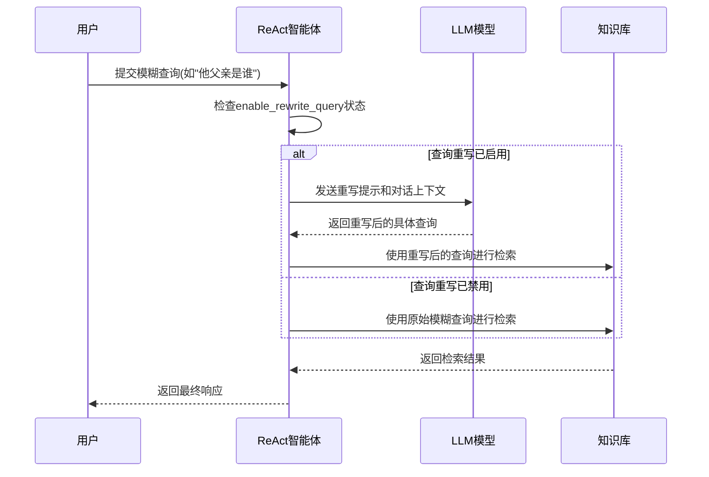

# 查询重写机制

<cite>
**本文档引用的文件**
- [\_react_agent.py](file://src/agentscope/agent/_react_agent.py)
- [task_rag.py](file://docs/tutorial/zh_CN/src/task_rag.py)
</cite>

## 目录
1. [引言](#引言)
2. [核心组件分析](#核心组件分析)
3. [查询重写机制实现](#查询重写机制实现)
4. [交互示例分析](#交互示例分析)
5. [配置建议与性能影响](#配置建议与性能影响)
6. [结论](#结论)

## 引言
ReAct智能体中的查询重写机制是一种重要的上下文感知功能，它能够利用对话历史上下文对模糊查询进行语义重写，从而提升知识检索的准确率。该机制通过`_enable_rewrite_query`功能实现，将模糊的用户查询（如"他父亲是谁"）转化为具体的查询（如"李明的父亲是谁"）。本文档将深入解析这一机制的实现原理、工作流程和实际应用效果。

## 核心组件分析

**Section sources**
- [\_react_agent.py](file://src/agentscope/agent/_react_agent.py#L30-L38)
- [\_react_agent.py](file://src/agentscope/agent/_react_agent.py#L69-L70)

### 查询重写模型定义
系统定义了一个专用的Pydantic模型`_QueryRewriteModel`用于查询重写任务，该模型包含一个`rewritten_query`字段，用于存储重写后的具体查询内容。这个模型作为结构化输出模型，确保了查询重写过程的标准化和可预测性。

### ReAct智能体初始化参数
在ReAct智能体的初始化过程中，`enable_rewrite_query`参数默认设置为`True`，表明查询重写功能默认是启用的。该功能仅在提供了知识库（knowledge base）时才生效，其主要作用是在从知识库检索前对用户输入的查询进行重写，使其更加具体和精确。

## 查询重写机制实现



**Diagram sources**
- [\_react_agent.py](file://src/agentscope/agent/_react_agent.py#L778-L824)

**Section sources**
- [\_react_agent.py](file://src/agentscope/agent/_react_agent.py#L778-L824)

### 重写流程执行逻辑
查询重写机制的核心实现在`_retrieve_from_knowledge`方法中。当`enable_rewrite_query`为`True`且存在知识库时，系统会执行以下步骤：

1. 首先提取用户输入的原始查询内容
2. 构建一个包含系统提示、对话历史和重写指令的提示词
3. 调用LLM模型执行查询重写任务，使用`_QueryRewriteModel`作为结构化输出模型
4. 从模型响应的元数据中提取重写后的查询
5. 使用重写后的具体查询在知识库中进行检索

### 重写提示设计
系统设计了专门的重写提示，指导模型如何将模糊查询转化为具体查询。提示中明确给出了示例：将"what happened last day"重写为"what happened on 2023-10-01"。这种设计确保了重写过程的一致性和可预测性。

### 错误处理机制
系统包含了完善的错误处理机制。如果在查询重写过程中发生异常，系统会记录警告信息并跳过查询重写步骤，直接使用原始查询进行检索，确保了系统的健壮性和可用性。

## 交互示例分析

```mermaid
flowchart TD
A[用户提问: "你知道他父亲是谁吗？"] --> B{查询重写是否启用？}
B --> |启用| C[系统重写为: "李明的父亲是谁？"]
B --> |禁用| D[使用原始查询]
C --> E[在知识库中检索"李明的父亲"]
D --> F[在知识库中检索"他父亲"]
E --> G[返回准确的检索结果]
F --> H[可能返回不相关或空的结果]
G --> I[生成准确的响应]
H --> J[生成不准确或模糊的响应]
```

**Diagram sources**
- [task_rag.py](file://docs/tutorial/zh_CN/src/task_rag.py#L263-L270)

**Section sources**
- [task_rag.py](file://docs/tutorial/zh_CN/src/task_rag.py#L263-L270)

### 启用查询重写的场景
当查询重写功能启用时，系统能够利用对话历史上下文将模糊的代词引用转化为具体的实体查询。例如，在之前的对话中提到了"李明"，当用户后续提问"他父亲是谁"时，系统会自动将其重写为"李明的父亲是谁"，从而获得更准确的检索结果。

### 禁用查询重写的场景
当查询重写功能禁用时，系统会直接使用用户输入的原始查询进行检索。对于"他父亲是谁"这样的模糊查询，由于缺乏具体的上下文信息，可能导致检索结果不准确或无法找到相关信息。

## 配置建议与性能影响

**Section sources**
- [\_react_agent.py](file://src/agentscope/agent/_react_agent.py#L118-L122)

### 配置建议
开发者应根据具体应用场景决定是否开启查询重写功能：

- **建议启用的场景**：
  - 对话系统需要处理大量代词引用和上下文依赖的查询
  - 知识库检索的准确性至关重要
  - 用户查询通常较为模糊，需要上下文消歧

- **建议禁用的场景**：
  - 查询通常已经很具体，无需重写
  - 对推理延迟有严格要求的应用
  - 系统资源有限，需要减少额外的模型调用

### 性能影响分析
启用查询重写功能会对系统性能产生一定影响：

- **推理延迟增加**：每次查询都需要额外的模型调用进行重写，增加了整体响应时间
- **计算资源消耗**：额外的模型推理增加了计算开销
- **网络延迟**：如果使用远程API，会增加一次网络往返

### 优化策略
为减轻性能影响，可以考虑以下优化策略：

1. 实现查询重写缓存，对相似查询避免重复重写
2. 在高并发场景下，可以考虑异步执行查询重写
3. 根据查询复杂度动态决定是否进行重写
4. 使用更轻量级的模型执行查询重写任务

## 结论
ReAct智能体的查询重写机制通过利用对话历史上下文，有效解决了模糊查询的语义消歧问题，显著提升了知识检索的准确率。该机制通过专门的`_QueryRewriteModel`和精心设计的提示词，实现了可靠的查询重写功能。开发者应根据具体应用场景权衡启用该功能的收益与性能成本，以达到最佳的系统表现。