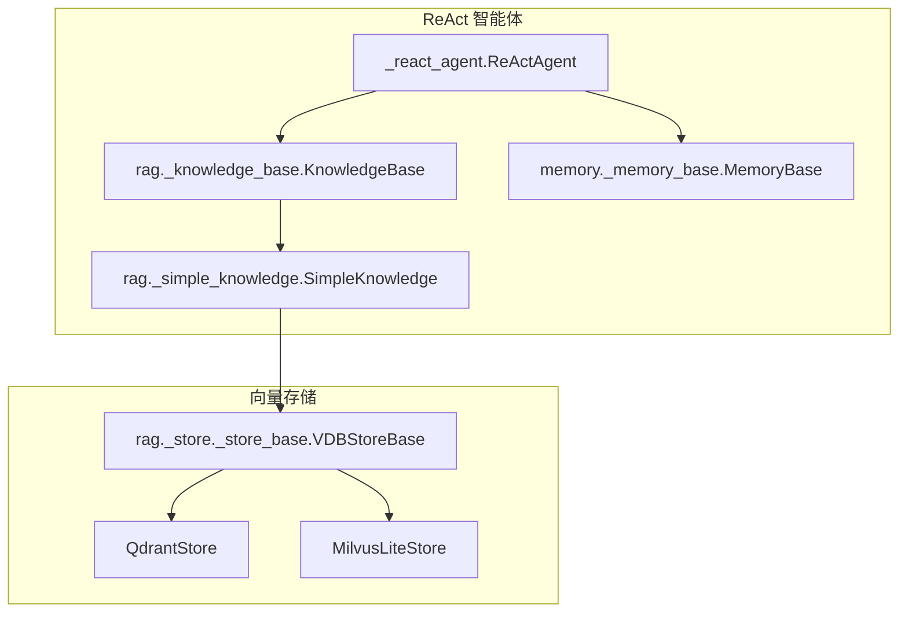
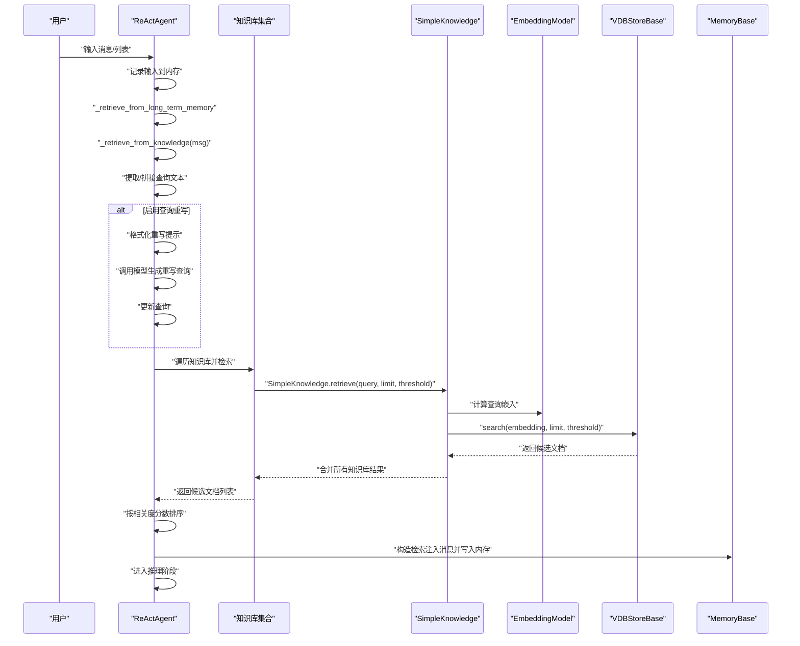
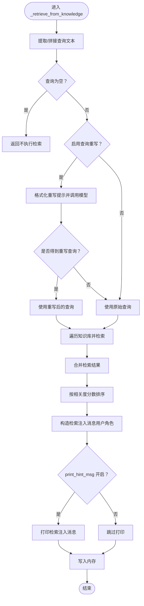
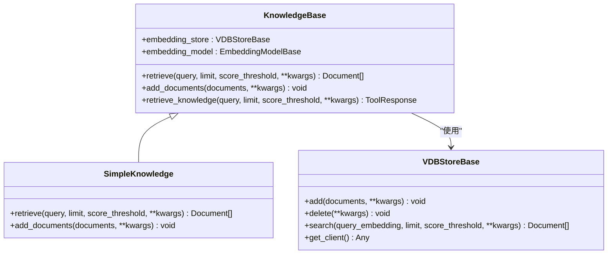
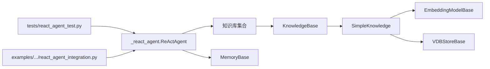

# 检索流程分析

<cite>
**本文引用的文件列表**
- [src/agentscope/agent/_react_agent.py](file://src/agentscope/agent/_react_agent.py)
- [src/agentscope/rag/_knowledge_base.py](file://src/agentscope/rag/_knowledge_base.py)
- [src/agentscope/rag/_simple_knowledge.py](file://src/agentscope/rag/_simple_knowledge.py)
- [src/agentscope/rag/_store/_store_base.py](file://src/agentscope/rag/_store/_store_base.py)
- [src/agentscope/memory/_memory_base.py](file://src/agentscope/memory/_memory_base.py)
- [examples/functionality/rag/react_agent_integration.py](file://examples/functionality/rag/react_agent_integration.py)
- [tests/react_agent_test.py](file://tests/react_agent_test.py)
- [src/agentscope/embedding/_file_cache.py](file://src/agentscope/embedding/_file_cache.py)
</cite>

## 目录
1. [简介](#简介)
2. [项目结构](#项目结构)
3. [核心组件](#核心组件)
4. [架构总览](#架构总览)
5. [详细组件分析](#详细组件分析)
6. [依赖关系分析](#依赖关系分析)
7. [性能考量](#性能考量)
8. [故障排查指南](#故障排查指南)
9. [结论](#结论)

## 简介
本文件围绕 ReAct 智能体在 reply 调用时的“自动检索”流程进行深入解析，重点聚焦于 _retrieve_from_knowledge 方法的执行步骤：从提取用户查询、查询预处理（可选重写）、多知识库并行检索、结果排序与截取，到将检索内容以用户消息形式注入提示词的全过程。同时说明检索结果在内存中的存储方式以及在后续对话中的上下文继承机制；通过 print_hint_msg 参数的日志输出功能演示如何调试检索行为；最后给出性能优化建议，包括 top_k 参数调优、索引策略选择与缓存机制应用。

## 项目结构
ReAct 智能体的检索能力由以下模块协同实现：
- ReActAgent：负责对话主循环、检索触发与提示词构造
- KnowledgeBase 及其实现：定义检索接口与工具方法
- 向量存储层：抽象 VDBStoreBase 及具体实现（如 QdrantStore、MilvusLiteStore）
- 内存管理：MemoryBase 的实现用于保存检索注入的消息
- 示例与测试：展示集成方式与行为验证

图表来源
- [src/agentscope/agent/_react_agent.py](file://src/agentscope/agent/_react_agent.py#L252-L407)
- [src/agentscope/rag/_knowledge_base.py](file://src/agentscope/rag/_knowledge_base.py#L1-L131)
- [src/agentscope/rag/_simple_knowledge.py](file://src/agentscope/rag/_simple_knowledge.py#L1-L85)
- [src/agentscope/rag/_store/_store_base.py](file://src/agentscope/rag/_store/_store_base.py#L1-L50)
- [src/agentscope/memory/_memory_base.py](file://src/agentscope/memory/_memory_base.py#L1-L45)

章节来源
- [src/agentscope/agent/_react_agent.py](file://src/agentscope/agent/_react_agent.py#L252-L407)
- [src/agentscope/rag/_knowledge_base.py](file://src/agentscope/rag/_knowledge_base.py#L1-L131)
- [src/agentscope/rag/_simple_knowledge.py](file://src/agentscope/rag/_simple_knowledge.py#L1-L85)
- [src/agentscope/rag/_store/_store_base.py](file://src/agentscope/rag/_store/_store_base.py#L1-L50)
- [src/agentscope/memory/_memory_base.py](file://src/agentscope/memory/_memory_base.py#L1-L45)

## 核心组件
- ReActAgent.reply：在每次回复前触发长短期记忆检索与知识库检索，并进入推理-行动循环
- ReActAgent._retrieve_from_knowledge：从知识库检索相关文档并注入到提示词中
- KnowledgeBase：定义检索与添加文档的抽象接口
- SimpleKnowledge：基于嵌入模型与向量存储的通用检索实现
- VDBStoreBase：向量数据库存储抽象，定义 add/search 接口
- MemoryBase：内存抽象，用于保存检索注入的消息

章节来源
- [src/agentscope/agent/_react_agent.py](file://src/agentscope/agent/_react_agent.py#L252-L407)
- [src/agentscope/agent/_react_agent.py](file://src/agentscope/agent/_react_agent.py#L767-L867)
- [src/agentscope/rag/_knowledge_base.py](file://src/agentscope/rag/_knowledge_base.py#L1-L131)
- [src/agentscope/rag/_simple_knowledge.py](file://src/agentscope/rag/_simple_knowledge.py#L1-L85)
- [src/agentscope/rag/_store/_store_base.py](file://src/agentscope/rag/_store/_store_base.py#L1-L50)
- [src/agentscope/memory/_memory_base.py](file://src/agentscope/memory/_memory_base.py#L1-L45)

## 架构总览
下图展示了 ReActAgent 在一次 reply 中的检索路径与数据流：

图表来源
- [src/agentscope/agent/_react_agent.py](file://src/agentscope/agent/_react_agent.py#L252-L407)
- [src/agentscope/agent/_react_agent.py](file://src/agentscope/agent/_react_agent.py#L767-L867)
- [src/agentscope/rag/_simple_knowledge.py](file://src/agentscope/rag/_simple_knowledge.py#L1-L85)
- [src/agentscope/rag/_knowledge_base.py](file://src/agentscope/rag/_knowledge_base.py#L1-L131)
- [src/agentscope/rag/_store/_store_base.py](file://src/agentscope/rag/_store/_store_base.py#L1-L50)
- [src/agentscope/memory/_memory_base.py](file://src/agentscope/memory/_memory_base.py#L1-L45)

## 详细组件分析

### _retrieve_from_knowledge 执行步骤详解
- 输入准备与空值跳过
  - 支持单条消息或消息列表，提取文本内容；若为空则直接返回
- 查询重写（可选）
  - 若启用重写，构造系统提示与历史消息，调用模型生成更具体、简洁的查询
  - 失败时记录警告并回退到原始查询
- 多知识库并行检索
  - 遍历知识库集合，对每个知识库执行检索并将结果合并
- 结果排序与截取
  - 按相关度分数降序排序，随后构造检索注入消息
- 注入提示词与日志输出
  - 将检索内容封装为用户消息并写入内存；当开启 print_hint_msg 时打印该消息
- 上下文继承机制
  - 检索注入消息作为用户消息被写入内存，后续推理阶段会将其格式化进提示词

图表来源
- [src/agentscope/agent/_react_agent.py](file://src/agentscope/agent/_react_agent.py#L767-L867)

章节来源
- [src/agentscope/agent/_react_agent.py](file://src/agentscope/agent/_react_agent.py#L767-L867)

### 知识库与向量存储
- KnowledgeBase 抽象
  - 定义 retrieve/add_documents 接口，提供便捷工具方法 retrieve_knowledge
- SimpleKnowledge 实现
  - 计算查询嵌入，调用向量存储 search 返回候选文档
  - 添加文档时校验模态支持、批量生成嵌入并写入存储
- VDBStoreBase 抽象
  - 定义 add/delete/search 接口，search 支持 limit 与 score_threshold

图表来源
- [src/agentscope/rag/_knowledge_base.py](file://src/agentscope/rag/_knowledge_base.py#L1-L131)
- [src/agentscope/rag/_simple_knowledge.py](file://src/agentscope/rag/_simple_knowledge.py#L1-L85)
- [src/agentscope/rag/_store/_store_base.py](file://src/agentscope/rag/_store/_store_base.py#L1-L50)

章节来源
- [src/agentscope/rag/_knowledge_base.py](file://src/agentscope/rag/_knowledge_base.py#L1-L131)
- [src/agentscope/rag/_simple_knowledge.py](file://src/agentscope/rag/_simple_knowledge.py#L1-L85)
- [src/agentscope/rag/_store/_store_base.py](file://src/agentscope/rag/_store/_store_base.py#L1-L50)

### 内存中的存储与上下文继承
- 存储方式
  - 检索注入消息以用户角色写入内存；内存实现提供 add/get_memory 等接口
- 继承机制
  - 下次推理前，ReActAgent 将内存中的消息格式化进提示词；因此检索注入的内容会在后续推理中作为上下文参与模型生成

章节来源
- [src/agentscope/memory/_memory_base.py](file://src/agentscope/memory/_memory_base.py#L1-L45)
- [src/agentscope/agent/_react_agent.py](file://src/agentscope/agent/_react_agent.py#L252-L407)

### 日志调试：print_hint_msg 参数
- 行为说明
  - 当 print_hint_msg 为真时，检索注入消息会被打印出来，便于观察检索结果是否符合预期
- 示例配置
  - 在创建 ReActAgent 时设置 print_hint_msg=True，即可在检索后看到注入消息

章节来源
- [examples/functionality/rag/react_agent_integration.py](file://examples/functionality/rag/react_agent_integration.py#L52-L67)
- [src/agentscope/agent/_react_agent.py](file://src/agentscope/agent/_react_agent.py#L767-L867)

## 依赖关系分析
- ReActAgent 依赖
  - 知识库集合：支持单个或多个知识库实例
  - 内存：用于保存检索注入消息
  - 格式化器与模型：用于查询重写与推理
- 知识库依赖
  - 嵌入模型：用于查询与文档向量化
  - 向量存储：提供高效的相似度检索
- 测试与示例
  - 单测验证 ReActAgent 的钩子与工具注册行为
  - 示例展示如何集成 SimpleKnowledge 并启用 print_hint_msg

图表来源
- [src/agentscope/agent/_react_agent.py](file://src/agentscope/agent/_react_agent.py#L252-L407)
- [src/agentscope/rag/_knowledge_base.py](file://src/agentscope/rag/_knowledge_base.py#L1-L131)
- [src/agentscope/rag/_simple_knowledge.py](file://src/agentscope/rag/_simple_knowledge.py#L1-L85)
- [src/agentscope/rag/_store/_store_base.py](file://src/agentscope/rag/_store/_store_base.py#L1-L50)
- [tests/react_agent_test.py](file://tests/react_agent_test.py#L1-L192)
- [examples/functionality/rag/react_agent_integration.py](file://examples/functionality/rag/react_agent_integration.py#L1-L79)

章节来源
- [src/agentscope/agent/_react_agent.py](file://src/agentscope/agent/_react_agent.py#L252-L407)
- [src/agentscope/rag/_knowledge_base.py](file://src/agentscope/rag/_knowledge_base.py#L1-L131)
- [src/agentscope/rag/_simple_knowledge.py](file://src/agentscope/rag/_simple_knowledge.py#L1-L85)
- [src/agentscope/rag/_store/_store_base.py](file://src/agentscope/rag/_store/_store_base.py#L1-L50)
- [tests/react_agent_test.py](file://tests/react_agent_test.py#L1-L192)
- [examples/functionality/rag/react_agent_integration.py](file://examples/functionality/rag/react_agent_integration.py#L1-L79)

## 性能考量
- top_k 参数调优
  - 在模型侧，top_k 控制采样多样性与稳定性；在检索链路中，limit 与 score_threshold 影响候选数量与质量
  - 建议：先以较小 limit 快速定位高相关片段，再逐步扩大以平衡召回与质量
- 索引策略选择
  - 向量维度与相似度指标直接影响检索效率与精度；选择合适的向量存储实现（如 Qdrant/MilvusLite）并合理配置索引参数
- 缓存机制应用
  - 嵌入缓存：对重复文本的嵌入结果进行本地缓存，减少 API 调用与 Token 消耗
  - 检索缓存：可考虑对热点查询结果进行缓存（需结合业务场景评估一致性与新鲜度）
- 并行检索
  - 多知识库检索采用顺序扩展，若知识库数量较多，可评估并发检索以缩短总延迟（注意并发控制与资源限制）

章节来源
- [src/agentscope/rag/_simple_knowledge.py](file://src/agentscope/rag/_simple_knowledge.py#L1-L85)
- [src/agentscope/rag/_knowledge_base.py](file://src/agentscope/rag/_knowledge_base.py#L1-L131)
- [src/agentscope/embedding/_file_cache.py](file://src/agentscope/embedding/_file_cache.py#L136-L187)

## 故障排查指南
- 查询为空导致未检索
  - 现象：_retrieve_from_knowledge 直接返回
  - 排查：确认输入消息包含可提取文本
- 查询重写失败
  - 现象：记录警告并回退到原始查询
  - 排查：检查格式化器与模型可用性、网络连通性
- 检索注入消息未出现
  - 现象：推理阶段未见检索内容
  - 排查：确认 print_hint_msg 已开启；检查内存 add/get_memory 是否正常工作
- 结果排序异常
  - 现象：相关度分数缺失或排序不符合预期
  - 排查：确认文档评分字段存在且非空；检查向量存储返回的分数范围

章节来源
- [src/agentscope/agent/_react_agent.py](file://src/agentscope/agent/_react_agent.py#L767-L867)
- [src/agentscope/memory/_memory_base.py](file://src/agentscope/memory/_memory_base.py#L1-L45)
- [examples/functionality/rag/react_agent_integration.py](file://examples/functionality/rag/react_agent_integration.py#L52-L67)

## 结论
ReAct 智能体在 reply 调用时通过 _retrieve_from_knowledge 完成从查询提取、可选重写、多知识库检索、排序与注入的完整流程。检索结果以用户消息形式写入内存，从而在后续推理中作为上下文参与模型生成。借助 print_hint_msg 可直观调试检索行为；通过合理设置 limit/score_threshold/top_k、选择合适向量存储与应用嵌入缓存，可在准确性与性能之间取得良好平衡。