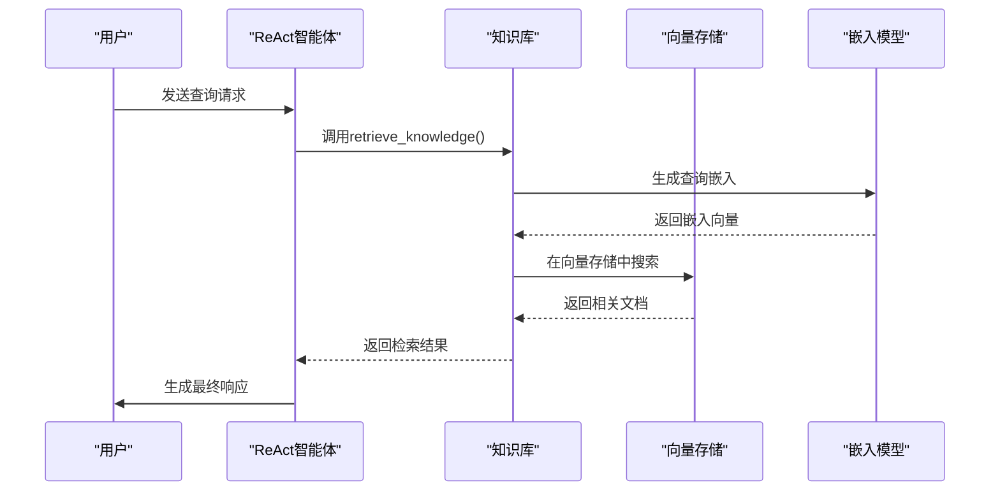
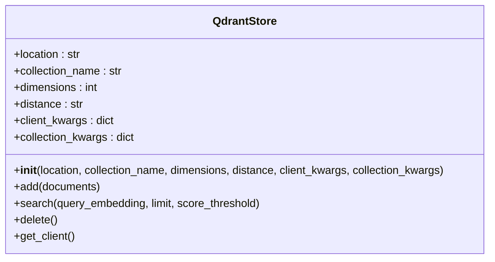
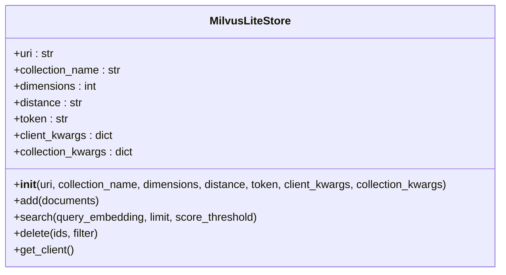
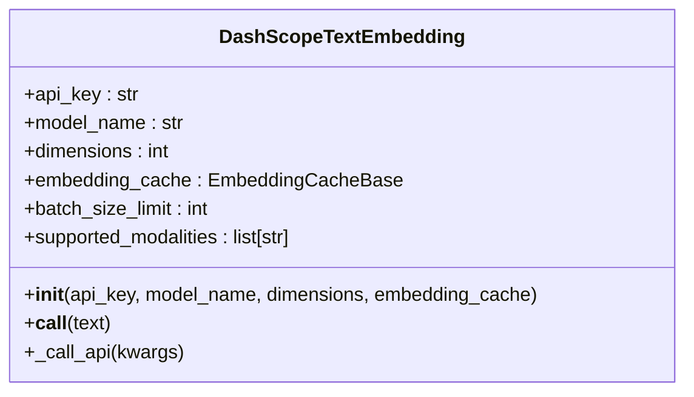
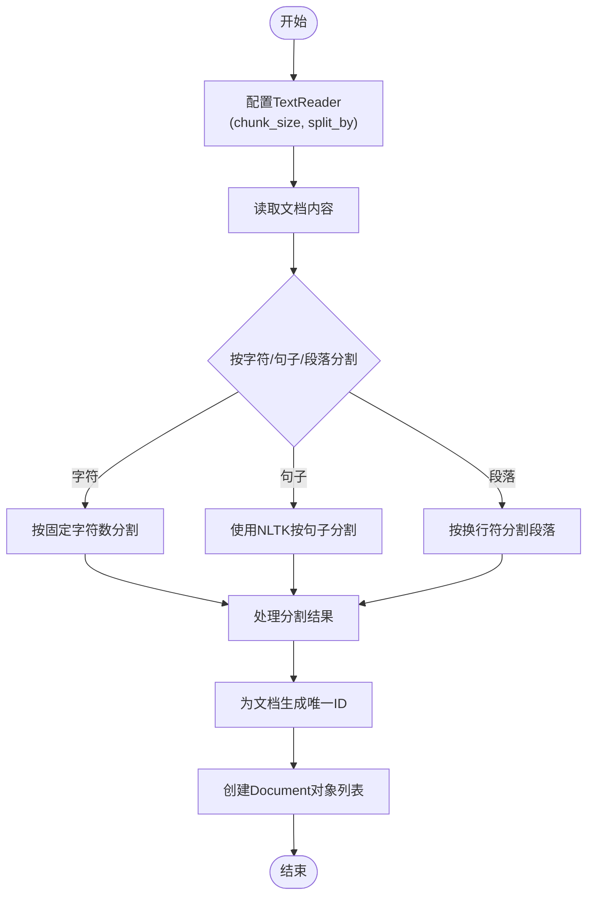
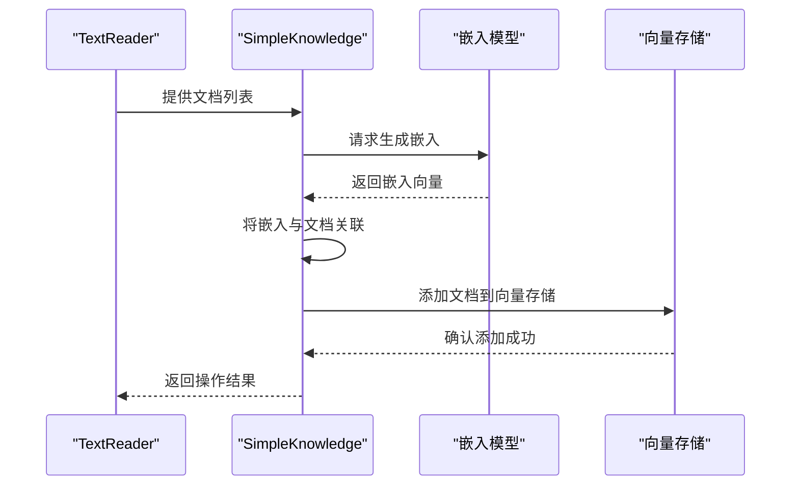

# 知识库配置

<cite>
**本文档中引用的文件**  
- [react_agent_integration.py](file://examples/functionality/rag/react_agent_integration.py)
- [basic_usage.py](file://examples/functionality/rag/basic_usage.py)
- [main.py](file://examples/functionality/vector_store/milvus_lite/main.py)
- [SimpleKnowledge.py](file://src/agentscope/rag/_simple_knowledge.py)
- [KnowledgeBase.py](file://src/agentscope/rag/_knowledge_base.py)
- [QdrantStore.py](file://src/agentscope/rag/_store/_qdrant_store.py)
- [MilvusLiteStore.py](file://src/agentscope/rag/_store/_milvuslite_store.py)
- [DashScopeTextEmbedding.py](file://src/agentscope/embedding/_dashscope_embedding.py)
- [TextReader.py](file://src/agentscope/rag/_reader/_text_reader.py)
- [ReActAgent.py](file://src/agentscope/agent/_react_agent.py)
</cite>

## 目录
1. [简介](#简介)
2. [核心组件](#核心组件)
3. [知识库与ReAct智能体集成](#知识库与react智能体集成)
4. [向量存储配置](#向量存储配置)
5. [嵌入模型集成](#嵌入模型集成)
6. [文档处理与知识注入](#文档处理与知识注入)
7. [最佳实践](#最佳实践)
8. [结论](#结论)

## 简介
本文档详细说明了如何在AgentScope框架中配置ReAct智能体与RAG（检索增强生成）知识库的集成。文档涵盖了通过`knowledge`参数将`SimpleKnowledge`实例注入`ReActAgent`的方法，支持单个或多个知识库的配置方式。同时，文档解释了QdrantStore和MilvusLiteStore等向量存储的初始化参数，以及DashScopeTextEmbedding等嵌入模型的集成方法。通过代码示例展示了如何使用TextReader进行文档分块处理，并调用`add_documents`完成知识注入。最后，文档说明了知识库配置的最佳实践，包括离线预加载策略和内存/持久化存储的选择。

## 核心组件

AgentScope框架中的RAG系统由多个核心组件构成，包括知识库、向量存储、嵌入模型和文档读取器。这些组件协同工作，为ReAct智能体提供强大的知识检索能力。

**Section sources**
- [SimpleKnowledge.py](file://src/agentscope/rag/_simple_knowledge.py)
- [KnowledgeBase.py](file://src/agentscope/rag/_knowledge_base.py)

## 知识库与ReAct智能体集成

在AgentScope中，可以通过`knowledge`参数将`SimpleKnowledge`实例注入`ReActAgent`，从而为智能体提供知识检索能力。该参数支持单个知识库实例或知识库实例列表，允许智能体从多个知识源中检索相关信息。



**Diagram sources**
- [ReActAgent.py](file://src/agentscope/agent/_react_agent.py#L69-L70)
- [KnowledgeBase.py](file://src/agentscope/rag/_knowledge_base.py#L74-L131)

**Section sources**
- [react_agent_integration.py](file://examples/functionality/rag/react_agent_integration.py#L53-L65)

## 向量存储配置

AgentScope支持多种向量存储后端，包括Qdrant和MilvusLite。这些存储系统负责存储和检索文档的嵌入向量。

### QdrantStore配置

QdrantStore是基于Qdrant向量数据库的实现，支持内存和远程实例。



**Diagram sources**
- [QdrantStore.py](file://src/agentscope/rag/_store/_qdrant_store.py#L27-L174)

**Section sources**
- [QdrantStore.py](file://src/agentscope/rag/_store/_qdrant_store.py#L27-L174)

### MilvusLiteStore配置

MilvusLiteStore是基于Milvus向量数据库的实现，支持本地文件和远程服务器。



**Diagram sources**
- [MilvusLiteStore.py](file://src/agentscope/rag/_store/_milvuslite_store.py#L31-L258)

**Section sources**
- [MilvusLiteStore.py](file://src/agentscope/rag/_store/_milvuslite_store.py#L31-L258)

## 嵌入模型集成

嵌入模型负责将文本转换为向量表示，是RAG系统的关键组件。

### DashScopeTextEmbedding集成

DashScopeTextEmbedding是基于阿里云通义千问的文本嵌入模型实现。



**Diagram sources**
- [DashScopeTextEmbedding.py](file://src/agentscope/embedding/_dashscope_embedding.py#L31-L170)

**Section sources**
- [DashScopeTextEmbedding.py](file://src/agentscope/embedding/_dashscope_embedding.py#L31-L170)

## 文档处理与知识注入

文档处理是知识库构建的关键步骤，涉及文档读取、分块和嵌入。

### TextReader文档分块

TextReader负责将文档分割成适当大小的块，以便进行嵌入和存储。



**Diagram sources**
- [TextReader.py](file://src/agentscope/rag/_reader/_text_reader.py#L17-L150)

**Section sources**
- [TextReader.py](file://src/agentscope/rag/_reader/_text_reader.py#L17-L150)

### 知识注入流程

知识注入是将处理后的文档添加到知识库的过程。



**Diagram sources**
- [SimpleKnowledge.py](file://src/agentscope/rag/_simple_knowledge.py#L54-L85)
- [basic_usage.py](file://examples/functionality/rag/basic_usage.py#L50-L51)

**Section sources**
- [SimpleKnowledge.py](file://src/agentscope/rag/_simple_knowledge.py#L54-L85)

## 最佳实践

### 离线预加载策略

对于静态知识库，建议采用离线预加载策略，避免在每次启动时重复处理文档。

```python
# 示例：离线预加载知识库
async def preload_knowledge():
    # 创建知识库实例
    knowledge = SimpleKnowledge(
        embedding_store=QdrantStore(
            location="./knowledge_db",
            collection_name="preloaded_knowledge",
            dimensions=1024,
        ),
        embedding_model=DashScopeTextEmbedding(
            api_key=os.environ["DASHSCOPE_API_KEY"],
            model_name="text-embedding-v4",
        ),
    )
    
    # 读取并处理文档
    reader = TextReader(chunk_size=1024)
    documents = await reader("path/to/knowledge/documents")
    
    # 注入知识
    await knowledge.add_documents(documents)
```

### 存储选择

根据应用场景选择合适的存储类型：

- **内存存储**：适用于临时知识库或测试环境
- **持久化存储**：适用于生产环境和长期知识库

```python
# 内存存储配置
memory_store = QdrantStore(
    location=":memory:",
    collection_name="temp_knowledge",
    dimensions=1024,
)

# 持久化存储配置
persistent_store = QdrantStore(
    location="./persistent_knowledge.db",
    collection_name="main_knowledge",
    dimensions=1024,
)
```

**Section sources**
- [react_agent_integration.py](file://examples/functionality/rag/react_agent_integration.py#L19-L29)
- [main.py](file://examples/functionality/vector_store/milvus_lite/main.py#L19-L24)

## 结论

本文档详细介绍了AgentScope框架中ReAct智能体与RAG知识库的集成配置方法。通过`SimpleKnowledge`类和`knowledge`参数，可以轻松地为ReAct智能体添加知识检索能力。支持的向量存储（如QdrantStore和MilvusLiteStore）和嵌入模型（如DashScopeTextEmbedding）提供了灵活的配置选项。文档分块和知识注入流程确保了知识库的高效构建。通过遵循最佳实践，如离线预加载和适当的存储选择，可以构建高性能的知识增强智能体系统。