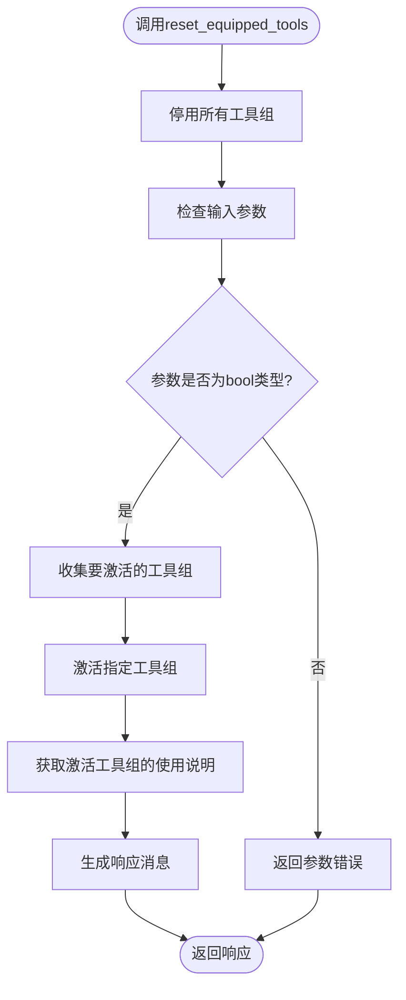
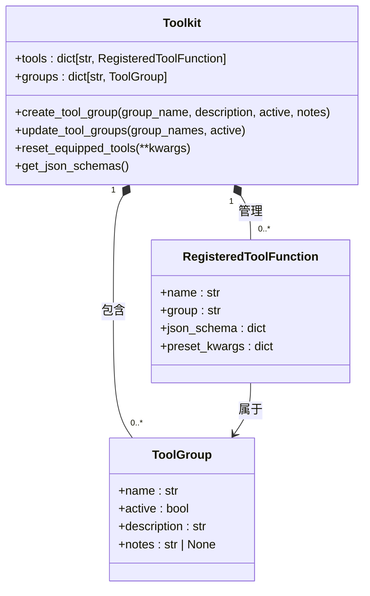
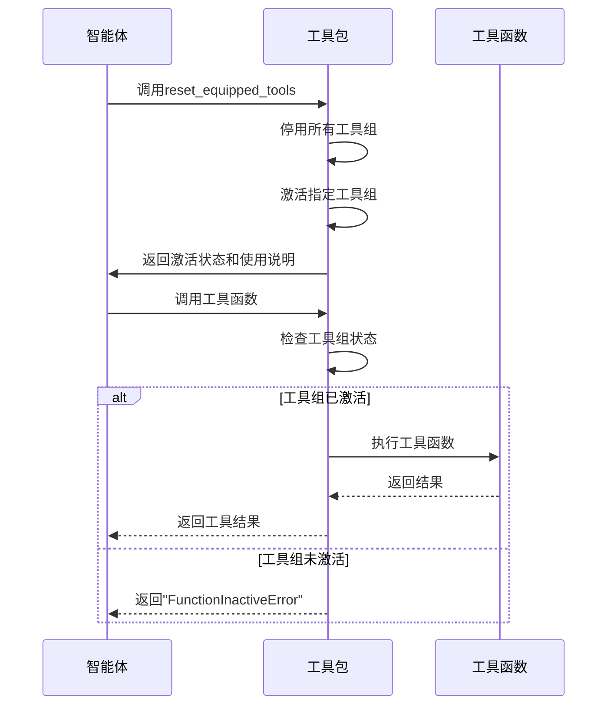

# 元工具管理

<cite>
**本文档中引用的文件**  
- [task_tool.py](file://docs/tutorial/zh_CN/src/task_tool.py)
- [toolkit.py](file://src/agentscope/tool/_toolkit.py)
- [react_agent.py](file://src/agentscope/agent/_react_agent.py)
- [toolkit_meta_tool_test.py](file://tests/toolkit_meta_tool_test.py)
</cite>

## 目录
1. [简介](#简介)
2. [核心功能概述](#核心功能概述)
3. [enable_meta_tool参数详解](#enable_meta_tool参数详解)
4. [reset_equipped_tools元工具实现机制](#reset_equipped_tools元工具实现机制)
5. [工具分组与管理](#工具分组与管理)
6. [智能体自我管理能力](#智能体自我管理能力)
7. [配置示例与使用方法](#配置示例与使用方法)
8. [最佳实践与注意事项](#最佳实践与注意事项)

## 简介
本文档详细介绍了Agentscope框架中ReAct智能体的元工具管理功能。重点阐述了如何通过`enable_meta_tool`参数启用动态工具管理能力，以及`reset_equipped_tools`元工具的实现机制。文档将深入解析工具分组、激活与停用的控制逻辑，并说明元工具如何赋予智能体根据任务需求动态调整可用工具集的自我管理能力。

**Section sources**
- [task_tool.py](file://docs/tutorial/zh_CN/src/task_tool.py#L316-L421)

## 核心功能概述
Agentscope框架提供了强大的工具管理功能，允许智能体在运行时动态调整其可用工具集。这一功能的核心是元工具（Meta Tool）机制，它通过工具分组和动态激活/停用控制，实现了智能体的自我管理能力。智能体可以根据当前任务需求，选择性地激活相关工具组，从而优化上下文空间的使用并提高任务执行效率。

**Section sources**
- [task_tool.py](file://docs/tutorial/zh_CN/src/task_tool.py#L312-L316)

## enable_meta_tool参数详解
`enable_meta_tool`参数是启用元工具功能的关键开关。当在ReAct智能体构造函数中将此参数设置为`True`时，系统会自动注册`reset_equipped_tools`元工具函数，从而赋予智能体动态管理工具的能力。

```python
agent = ReActAgent(
    name="assistant",
    sys_prompt="You are a helpful assistant.",
    model=model,
    formatter=formatter,
    enable_meta_tool=True,  # 启用元工具功能
)
```

该参数的默认值为`False`，表示禁用元工具功能。启用后，智能体可以通过调用`reset_equipped_tools`函数来动态调整其工具配置。

**Section sources**
- [react_agent.py](file://src/agentscope/agent/_react_agent.py#L66-L67)
- [react_agent.py](file://src/agentscope/agent/_react_agent.py#L181-L184)

## reset_equipped_tools元工具实现机制
`reset_equipped_tools`是核心的元工具函数，它允许智能体根据当前任务需求动态激活或停用工具组。该函数的实现机制包含以下几个关键方面：

### 函数行为
每次调用`reset_equipped_tools`都会设置所有工具组的最终状态，而不是增量更改。任何未明确设置为`True`的工具组都将被停用，无论其先前状态如何。

### 实现逻辑
1. 首先停用所有工具组
2. 根据输入参数激活指定的工具组
3. 返回激活工具组的使用说明

### 返回值
函数返回包含以下信息的响应：
- 激活的工具组列表
- 工具组的使用注意事项（notes）
- 如果没有工具组被激活，则返回相应的状态信息



**Diagram sources**
- [toolkit.py](file://src/agentscope/tool/_toolkit.py#L936-L998)

**Section sources**
- [toolkit.py](file://src/agentscope/tool/_toolkit.py#L936-L998)
- [toolkit_meta_tool_test.py](file://tests/toolkit_meta_tool_test.py#L73-L86)

## 工具分组与管理
工具分组是实现动态工具管理的基础。系统通过工具组（Tool Group）来组织和管理工具函数，每个工具组可以独立地被激活或停用。

### 工具组创建
使用`create_tool_group`方法创建工具组：

```python
toolkit.create_tool_group(
    group_name="browser_use",
    description="浏览器相关工具",
    notes="使用浏览器工具时需要注意的事项"
)
```

### 工具注册
将工具函数注册到特定工具组：

```python
toolkit.register_tool_function(
    tool_function,
    group_name="browser_use"
)
```

### 状态管理
工具组的状态管理遵循以下规则：
- "basic"工具组始终处于激活状态
- 其他工具组的激活状态由`reset_equipped_tools`函数控制
- 只有激活状态的工具组中的工具才会包含在JSON schema中



**Diagram sources**
- [toolkit.py](file://src/agentscope/tool/_toolkit.py#L54-L1125)
- [toolkit.py](file://src/agentscope/tool/_types.py#L131-L146)

**Section sources**
- [toolkit.py](file://src/agentscope/tool/_toolkit.py#L119-L171)
- [toolkit.py](file://src/agentscope/tool/_toolkit.py#L205-L232)

## 智能体自我管理能力
元工具机制赋予了智能体强大的自我管理能力，使其能够根据任务需求动态调整工具配置。

### 自我调节
智能体可以根据当前任务的需要，主动激活或停用工具组。这种能力使得智能体能够：
- 优化上下文空间使用
- 减少不必要的工具干扰
- 提高任务执行的专注度

### 最佳实践
- 只激活当前任务所需的工具组
- 任务完成后及时停用不再需要的工具组
- 利用工具组的使用说明（notes）确保正确使用工具

### 错误处理
当尝试使用处于非激活状态的工具时，系统会返回明确的错误信息，提示用户需要先通过`reset_equipped_tools`激活相应的工具组。



**Diagram sources**
- [toolkit.py](file://src/agentscope/tool/_toolkit.py#L631-L649)
- [toolkit_meta_tool_test.py](file://tests/toolkit_meta_tool_test.py#L255-L272)

**Section sources**
- [toolkit.py](file://src/agentscope/tool/_toolkit.py#L936-L998)
- [toolkit.py](file://src/agentscope/tool/_toolkit.py#L593-L724)

## 配置示例与使用方法
以下示例展示了如何配置工具组并使用元工具进行工具管理。

### 基本配置
```python
# 创建工具包
toolkit = Toolkit()

# 创建工具组
toolkit.create_tool_group(
    "browser_use",
    "浏览器使用工具组",
    notes="1. 必须先登录\n2. 注意页面加载状态"
)

# 注册工具到工具组
toolkit.register_tool_function(
    browser_tool,
    group_name="browser_use"
)

# 启用元工具功能
toolkit.register_tool_function(toolkit.reset_equipped_tools)
```

### 动态管理
```python
# 激活浏览器工具组
await toolkit.call_tool_function(
    ToolUseBlock(
        type="tool_use",
        id="123",
        name="reset_equipped_tools",
        input={"browser_use": True}
    )
)

# 使用浏览器工具
await toolkit.call_tool_function(
    ToolUseBlock(
        type="tool_use",
        id="124",
        name="browser_tool",
        input={"url": "https://example.com"}
    )
)

# 停用所有工具组
await toolkit.call_tool_function(
    ToolUseBlock(
        type="tool_use",
        id="125",
        name="reset_equipped_tools",
        input={}
    )
)
```

**Section sources**
- [task_tool.py](file://docs/tutorial/zh_CN/src/task_tool.py#L385-L421)
- [toolkit_meta_tool_test.py](file://tests/toolkit_meta_tool_test.py#L131-L238)

## 最佳实践与注意事项
### 最佳实践
- **主动管理工具组**：只激活当前任务所需的工具组
- **及时停用工具**：任务完成后立即停用不再需要的工具组
- **遵循使用说明**：注意查看并遵守工具组的使用注意事项

### 注意事项
- 每次调用`reset_equipped_tools`都会设置所有工具组的绝对最终状态
- 未明确设置为`True`的工具组将被停用
- "basic"工具组始终处于激活状态，无法被停用
- 工具组的使用说明（notes）对于正确使用工具至关重要

### 常见问题
- **Q**: 为什么调用工具时返回"FunctionInactiveError"？
  **A**: 因为该工具所在的工具组未被激活，需要先调用`reset_equipped_tools`激活相应工具组。

- **Q**: 如何查看当前激活的工具组使用说明？
  **A**: 可以再次调用`reset_equipped_tools`函数，它会返回当前激活工具组的使用说明。

**Section sources**
- [toolkit.py](file://src/agentscope/tool/_toolkit.py#L937-L945)
- [toolkit_meta_tool_test.py](file://tests/toolkit_meta_tool_test.py#L140-L149)