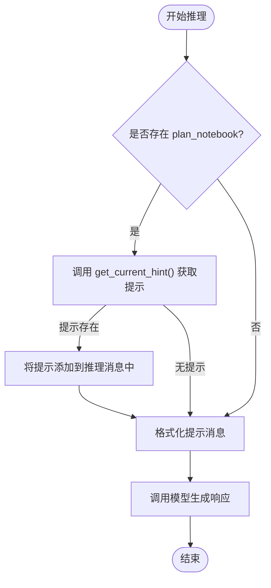
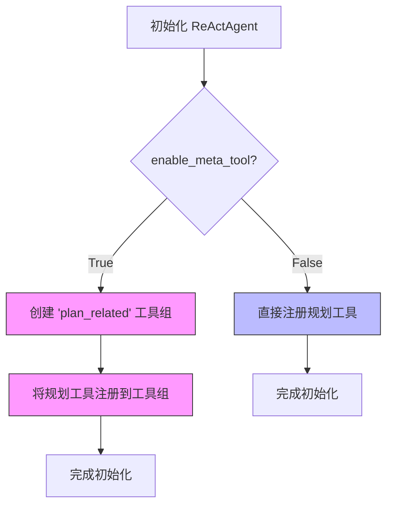

# 规划系统集成

<cite>
**本文档中引用的文件**   
- [plan_notebook.py](file://src/agentscope/plan/_plan_notebook.py)
- [plan_model.py](file://src/agentscope/plan/_plan_model.py)
- [_react_agent.py](file://src/agentscope/agent/_react_agent.py)
- [main_agent_managed_plan.py](file://examples/functionality/plan/main_agent_managed_plan.py)
- [main_manual_plan.py](file://examples/functionality/plan/main_manual_plan.py)
</cite>

## 目录
1. [引言](#引言)
2. [规划笔记本系统集成](#规划笔记本系统集成)
3. [推理提示机制](#推理提示机制)
4. [规划工具注册方式](#规划工具注册方式)
5. [配置与使用示例](#配置与使用示例)
6. [计划执行监控](#计划执行监控)

## 引言
规划系统是ReAct智能体完成复杂任务分解和执行的核心组件。通过规划笔记本（PlanNotebook）系统，智能体能够将复杂的用户请求分解为一系列有序的子任务，并通过系统提示引导智能体逐步完成任务。本文档详细解释了`plan_notebook`参数如何与规划笔记本系统集成，深入分析了规划系统如何通过`_get_current_hint`方法提供推理提示，以及规划工具在`enable_meta_tool`开启和关闭时的不同注册方式。同时，通过实际示例展示如何配置规划笔记本、创建任务计划并监控计划执行进度。

## 规划笔记本系统集成

规划笔记本系统通过`PlanNotebook`类实现，该类作为智能体的规划管理核心，提供了创建、查看、修改和完成计划的完整功能。`PlanNotebook`继承自`StateModule`，支持状态管理和序列化，确保规划状态的持久化和恢复。

当在`ReActAgent`中配置`plan_notebook`参数时，智能体将自动集成规划功能。`ReActAgent`在初始化过程中会检查`plan_notebook`实例，并根据`enable_meta_tool`参数的设置决定如何注册规划相关的工具函数。

`PlanNotebook`类的主要功能包括：
- **计划创建**：通过`create_plan`方法创建新的任务计划
- **子任务管理**：通过`update_subtask_state`和`finish_subtask`方法管理子任务状态
- **计划修订**：通过`revise_current_plan`方法修改现有计划
- **历史计划管理**：通过`view_historical_plans`和`recover_historical_plan`方法管理历史计划

**Section sources**
- [plan_notebook.py](file://src/agentscope/plan/_plan_notebook.py#L172-L225)
- [_react_agent.py](file://src/agentscope/agent/_react_agent.py#L195-L225)

## 推理提示机制

规划系统通过`_get_current_hint`方法为智能体提供推理提示，引导智能体完成复杂任务的分解和执行。该机制的核心是`DefaultPlanToHint`类，它根据当前计划的状态生成相应的系统提示。

`get_current_hint`方法的工作流程如下：
1. 调用`plan_to_hint`函数（默认为`DefaultPlanToHint`实例）生成提示内容
2. 将提示内容包装在`<system-hint>`标签中
3. 返回包含提示的`Msg`对象

`DefaultPlanToHint`类根据计划的不同状态生成不同的提示：
- **无计划状态**：提示智能体对于复杂任务需要先创建计划
- **计划开始状态**：显示当前计划并提示智能体开始执行第一个子任务
- **子任务进行中状态**：显示当前正在执行的子任务详情和可选操作
- **无子任务进行中状态**：提示智能体继续执行下一个子任务
- **计划结束状态**：提示智能体完成计划并总结结果

在`ReActAgent`的`_reasoning`方法中，系统会自动调用`get_current_hint`方法获取提示，并将其添加到推理提示中，引导智能体的下一步行动。



**Diagram sources **
- [plan_notebook.py](file://src/agentscope/plan/_plan_notebook.py#L839-L858)
- [_react_agent.py](file://src/agentscope/agent/_react_agent.py#L417-L423)

**Section sources**
- [plan_notebook.py](file://src/agentscope/plan/_plan_notebook.py#L16-L169)
- [_react_agent.py](file://src/agentscope/agent/_react_agent.py#L417-L435)

## 规划工具注册方式

规划工具的注册方式取决于`ReActAgent`初始化时`enable_meta_tool`参数的设置。这种设计提供了灵活的工具管理策略，适应不同的应用场景。

### enable_meta_tool 开启时
当`enable_meta_tool=True`时，规划工具被注册为名为"plan_related"的工具组。这种方式下，智能体需要通过元工具`reset_equipped_tools`来激活规划工具，实现按需使用。

注册流程：
1. 创建"plan_related"工具组
2. 将所有规划工具注册到该工具组
3. 智能体通过元工具激活该工具组

### enable_meta_tool 关闭时
当`enable_meta_tool=False`时，规划工具被直接注册到基础工具组中，始终处于激活状态。这种方式适合需要持续使用规划功能的场景。

注册流程：
1. 直接将所有规划工具注册到工具包
2. 工具始终可用，无需额外激活

两种注册方式的选择取决于应用需求：
- **开启元工具**：适合工具集较大，需要按需激活特定功能的场景
- **关闭元工具**：适合规划功能为核心功能，需要始终可用的场景



**Diagram sources **
- [_react_agent.py](file://src/agentscope/agent/_react_agent.py#L205-L219)

**Section sources**
- [_react_agent.py](file://src/agentscope/agent/_react_agent.py#L195-L225)

## 配置与使用示例

### 配置规划笔记本
配置规划笔记本需要在创建`ReActAgent`时通过`plan_notebook`参数传入`PlanNotebook`实例。可以自定义最大子任务数、提示生成函数和存储方式。

```python
plan_notebook = PlanNotebook(
    max_subtasks=10,
    plan_to_hint=custom_hint_function,
    storage=custom_storage
)
```

### 手动创建计划
以下示例展示了如何手动创建一个研究AgentScope框架的计划：

```python
# 创建计划笔记本
plan_notebook = PlanNotebook()

# 创建计划
await plan_notebook.create_plan(
    name="AgentScope框架研究报告",
    description="研究AgentScope代码并撰写综合报告",
    expected_outcome="一份关于AgentScope特性的Markdown格式报告",
    subtasks=[
        SubTask(
            name="克隆仓库",
            description="克隆AgentScope GitHub仓库",
            expected_outcome="本地仓库副本"
        ),
        SubTask(
            name="查看文档",
            description="查看AgentScope文档",
            expected_outcome="对框架特性的全面理解"
        ),
        # 更多子任务...
    ]
)
```

### 智能体管理计划
以下示例展示了如何配置支持元工具的智能体，让智能体自主管理计划：

```python
agent = ReActAgent(
    name="Friday",
    sys_prompt="你是一个名为Friday的助手...",
    model=DashScopeChatModel(
        model_name="qwen3-max-preview",
        api_key=os.environ["DASHSCOPE_API_KEY"],
    ),
    formatter=DashScopeChatFormatter(),
    toolkit=toolkit,
    enable_meta_tool=True,
    plan_notebook=PlanNotebook(),
)
```

**Section sources**
- [main_manual_plan.py](file://examples/functionality/plan/main_manual_plan.py#L27-L64)
- [main_agent_managed_plan.py](file://examples/functionality/plan/main_agent_managed_plan.py#L30-L49)

## 计划执行监控

规划系统提供了完整的计划执行监控机制，包括状态变更钩子、历史计划管理和执行进度跟踪。

### 状态变更钩子
通过`register_plan_change_hook`方法可以注册计划变更钩子，当计划状态发生变化时触发回调函数。这可用于前端可视化、日志记录或外部系统集成。

```python
def on_plan_change(notebook: PlanNotebook, plan: Plan):
    print(f"计划已更新: {plan.name}")

plan_notebook.register_plan_change_hook("visualizer", on_plan_change)
```

### 历史计划管理
规划系统自动将完成的计划存储到历史记录中，支持查看和恢复历史计划：

- `view_historical_plans()`: 查看所有历史计划
- `recover_historical_plan(plan_id)`: 恢复指定的历史计划

### 执行进度跟踪
通过以下方法可以跟踪计划执行进度：
- `get_current_hint()`: 获取当前执行建议
- `view_subtasks([indices])`: 查看指定子任务详情
- `finish_subtask(index, outcome)`: 完成子任务并记录结果

这些功能共同构成了一个完整的计划执行监控系统，确保智能体能够有效地管理和完成复杂任务。

**Section sources**
- [plan_notebook.py](file://src/agentscope/plan/_plan_notebook.py#L860-L888)
- [plan_notebook.py](file://src/agentscope/plan/_plan_notebook.py#L734-L755)