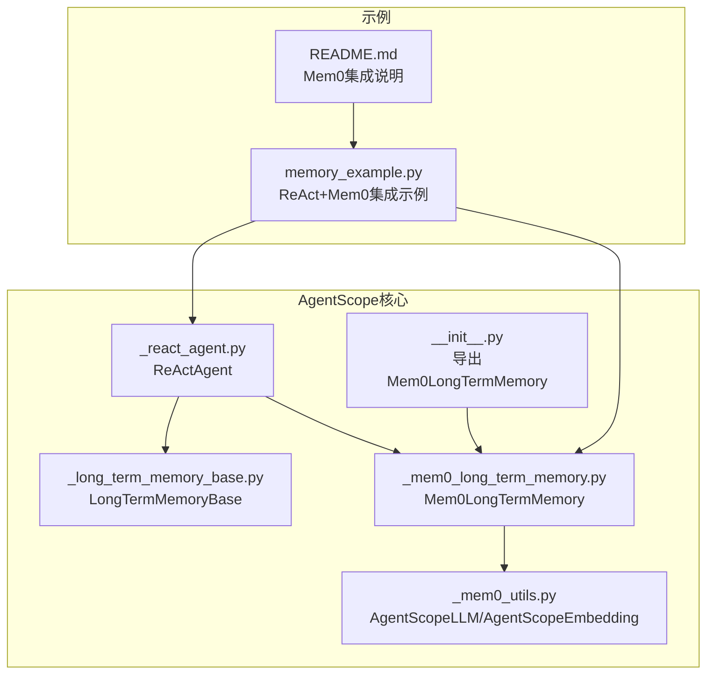
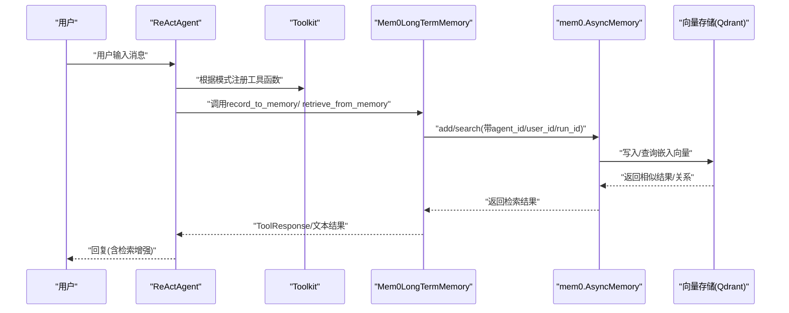
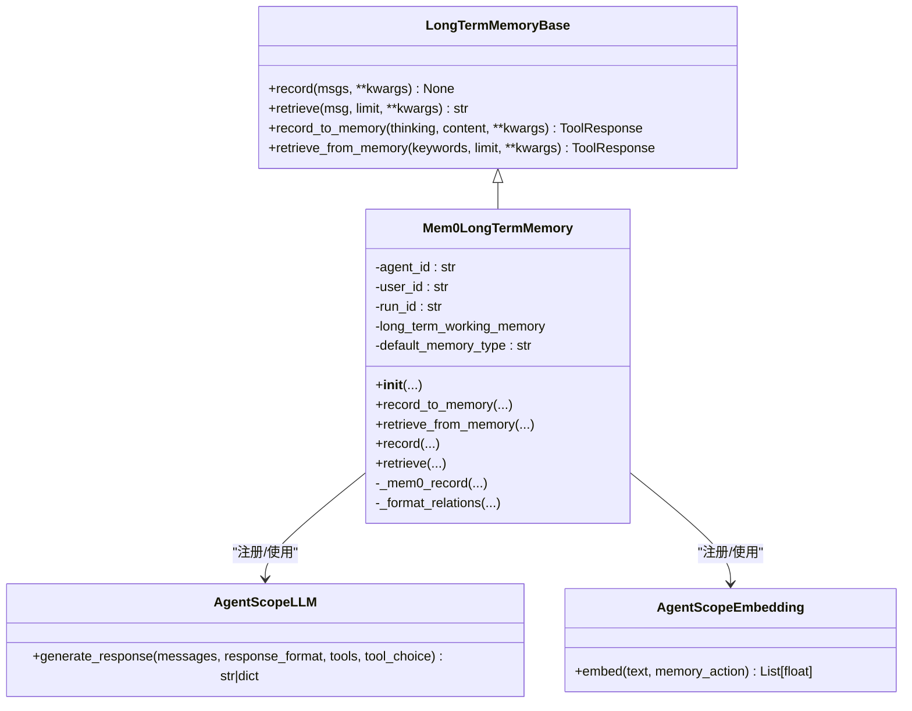
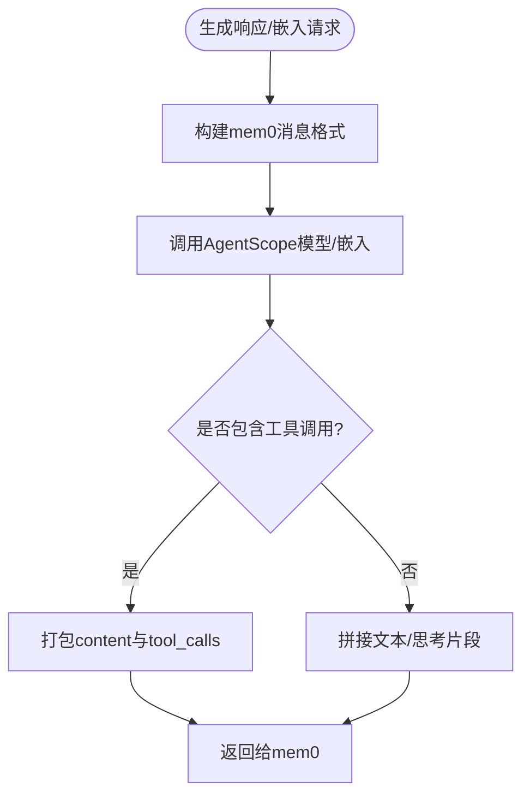
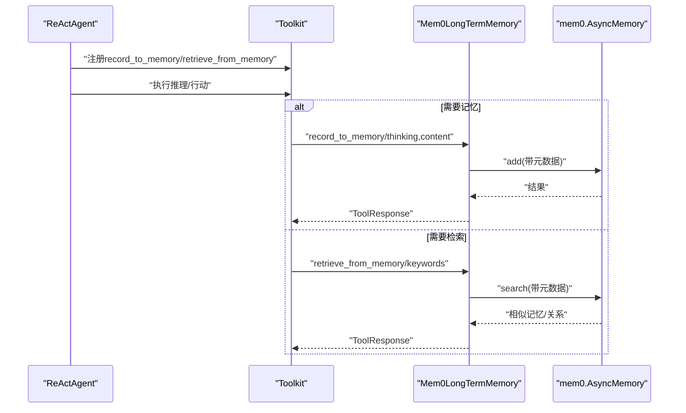
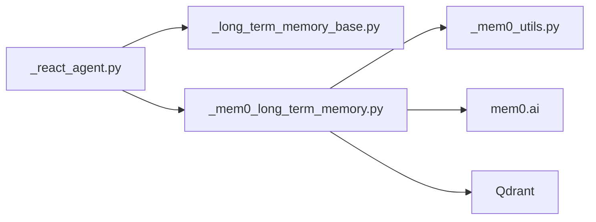

# Mem0集成

<cite>
**本文引用的文件列表**
- [src/agentscope/memory/_mem0_long_term_memory.py](file://src/agentscope/memory/_mem0_long_term_memory.py)
- [src/agentscope/memory/_mem0_utils.py](file://src/agentscope/memory/_mem0_utils.py)
- [src/agentscope/memory/_long_term_memory_base.py](file://src/agentscope/memory/_long_term_memory_base.py)
- [src/agentscope/agent/_react_agent.py](file://src/agentscope/agent/_react_agent.py)
- [examples/functionality/long_term_memory/mem0/memory_example.py](file://examples/functionality/long_term_memory/mem0/memory_example.py)
- [examples/functionality/long_term_memory/mem0/README.md](file://examples/functionality/long_term_memory/mem0/README.md)
- [src/agentscope/memory/__init__.py](file://src/agentscope/memory/__init__.py)
</cite>

## 目录
1. [简介](#简介)
2. [项目结构](#项目结构)
3. [核心组件](#核心组件)
4. [架构总览](#架构总览)
5. [组件详解](#组件详解)
6. [依赖关系分析](#依赖关系分析)
7. [性能考量](#性能考量)
8. [故障排查指南](#故障排查指南)
9. [结论](#结论)
10. [附录](#附录)

## 简介
本文件面向希望在AgentScope中集成Mem0长期记忆系统的开发者与使用者，系统性阐述Mem0在AgentScope中的集成机制与使用方式。重点覆盖以下方面：
- 自动记忆提取与结构化存储：Mem0如何基于嵌入向量与元数据进行语义检索与关系抽取。
- 与ReAct智能体的协同：如何将Mem0作为长期记忆后端，配合工具调用实现“记录/检索”自动化。
- 初始化与配置：如何创建Mem0记忆实例、配置模型与向量存储、绑定到智能体。
- 特性对比：Mem0与ReMe在使用场景与能力上的差异。
- 常见问题与排障：检索不准确、性能瓶颈、维度不匹配等问题的定位与解决思路。

## 项目结构
与Mem0集成相关的代码主要分布在如下模块：
- 长期记忆实现：Mem0适配器与工具包装
- ReAct智能体：工具注册与模式控制
- 示例与文档：快速上手与集成范式

图表来源
- [src/agentscope/agent/_react_agent.py](file://src/agentscope/agent/_react_agent.py#L1-L200)
- [src/agentscope/memory/_long_term_memory_base.py](file://src/agentscope/memory/_long_term_memory_base.py#L1-L95)
- [src/agentscope/memory/_mem0_long_term_memory.py](file://src/agentscope/memory/_mem0_long_term_memory.py#L1-L120)
- [src/agentscope/memory/_mem0_utils.py](file://src/agentscope/memory/_mem0_utils.py#L1-L120)
- [src/agentscope/memory/__init__.py](file://src/agentscope/memory/__init__.py#L1-L23)
- [examples/functionality/long_term_memory/mem0/memory_example.py](file://examples/functionality/long_term_memory/mem0/memory_example.py#L1-L186)
- [examples/functionality/long_term_memory/mem0/README.md](file://examples/functionality/long_term_memory/mem0/README.md#L1-L158)

章节来源
- [src/agentscope/memory/_mem0_long_term_memory.py](file://src/agentscope/memory/_mem0_long_term_memory.py#L1-L120)
- [src/agentscope/memory/_mem0_utils.py](file://src/agentscope/memory/_mem0_utils.py#L1-L120)
- [examples/functionality/long_term_memory/mem0/README.md](file://examples/functionality/long_term_memory/mem0/README.md#L1-L158)

## 核心组件
- Mem0LongTermMemory：基于mem0库的长期记忆实现，负责记录、检索、关系格式化与异步操作封装。
- AgentScopeLLM/AgentScopeEmbedding：将AgentScope的模型与嵌入接口桥接到mem0工厂体系，支持不同版本的mem0。
- LongTermMemoryBase：定义统一的长期记忆接口，包括record/retrieve与record_to_memory/retrieve_from_memory两组工具方法。
- ReActAgent：接收long_term_memory与long_term_memory_mode参数，按模式注册工具函数，实现与Mem0的无缝协作。

章节来源
- [src/agentscope/memory/_mem0_long_term_memory.py](file://src/agentscope/memory/_mem0_long_term_memory.py#L73-L120)
- [src/agentscope/memory/_mem0_utils.py](file://src/agentscope/memory/_mem0_utils.py#L1-L120)
- [src/agentscope/memory/_long_term_memory_base.py](file://src/agentscope/memory/_long_term_memory_base.py#L1-L95)
- [src/agentscope/agent/_react_agent.py](file://src/agentscope/agent/_react_agent.py#L40-L120)

## 架构总览
Mem0在AgentScope中的集成采用“适配器+桥接”的分层设计：
- 适配器层：Mem0LongTermMemory对接mem0 AsyncMemory，封装异步记录与检索。
- 桥接层：AgentScopeLLM/AgentScopeEmbedding将AgentScope模型与嵌入注册到mem0工厂，使其可被mem0直接使用。
- 协作层：ReActAgent根据long_term_memory_mode在工具层面注册record_to_memory/retrieve_from_memory，实现智能体对长期记忆的自控。

图表来源
- [src/agentscope/agent/_react_agent.py](file://src/agentscope/agent/_react_agent.py#L160-L185)
- [src/agentscope/memory/_mem0_long_term_memory.py](file://src/agentscope/memory/_mem0_long_term_memory.py#L258-L450)
- [examples/functionality/long_term_memory/mem0/memory_example.py](file://examples/functionality/long_term_memory/mem0/memory_example.py#L136-L181)

## 组件详解

### Mem0LongTermMemory类
- 职责
  - 初始化与配置：支持传入mem0配置或分别指定模型、嵌入与向量存储配置；自动注册AgentScope提供商到mem0工厂；默认持久化Qdrant。
  - 记录记忆：record_to_memory采用三段式策略（user/assistant/infer=False），确保即使推理失败也能保留原始内容。
  - 检索记忆：retrieve/retrieve_from_memory支持关键词/消息级检索，聚合相似度与关系三元组。
  - 关系格式化：将mem0返回的关系结构转换为“源—关系—目标”的字符串形式。
- 关键点
  - 元数据绑定：通过agent_id/user_id/run_id在检索时进行过滤，避免跨会话污染。
  - 异步与并发：检索阶段使用asyncio.gather并行查询多个关键词，提升吞吐。
  - 错误处理：捕获异常并返回ToolResponse，保证智能体流程不中断。

图表来源
- [src/agentscope/memory/_long_term_memory_base.py](file://src/agentscope/memory/_long_term_memory_base.py#L1-L95)
- [src/agentscope/memory/_mem0_long_term_memory.py](file://src/agentscope/memory/_mem0_long_term_memory.py#L73-L120)
- [src/agentscope/memory/_mem0_utils.py](file://src/agentscope/memory/_mem0_utils.py#L1-L120)

章节来源
- [src/agentscope/memory/_mem0_long_term_memory.py](file://src/agentscope/memory/_mem0_long_term_memory.py#L120-L450)
- [src/agentscope/memory/_mem0_utils.py](file://src/agentscope/memory/_mem0_utils.py#L1-L120)

### AgentScopeLLM与AgentScopeEmbedding
- 职责
  - 将AgentScope的ChatModelBase与EmbeddingModelBase适配为mem0可用的LLM与Embedding实现。
  - 处理响应格式（文本/思考/工具调用），满足mem0期望的输出结构。
- 版本兼容
  - 针对mem0不同版本，动态注册provider映射，确保工厂可用。

图表来源
- [src/agentscope/memory/_mem0_utils.py](file://src/agentscope/memory/_mem0_utils.py#L95-L160)
- [src/agentscope/memory/_mem0_utils.py](file://src/agentscope/memory/_mem0_utils.py#L166-L241)

章节来源
- [src/agentscope/memory/_mem0_utils.py](file://src/agentscope/memory/_mem0_utils.py#L1-L241)

### 与ReAct智能体的集成
- 参数与模式
  - long_term_memory：注入Mem0LongTermMemory实例。
  - long_term_memory_mode：支持"agent_control"/"static_control"/"both"三种模式。
- 工具注册
  - 当模式为"agent_control"或"both"时，ReActAgent会在工具集中注册record_to_memory与retrieve_from_memory，允许智能体自主管理长期记忆。
- 使用流程
  - 在系统提示中明确“何时记录/何时检索”的指导，结合工具调用完成上下文增强与决策。

图表来源
- [src/agentscope/agent/_react_agent.py](file://src/agentscope/agent/_react_agent.py#L160-L185)
- [src/agentscope/memory/_mem0_long_term_memory.py](file://src/agentscope/memory/_mem0_long_term_memory.py#L258-L450)

章节来源
- [src/agentscope/agent/_react_agent.py](file://src/agentscope/agent/_react_agent.py#L40-L120)
- [examples/functionality/long_term_memory/mem0/README.md](file://examples/functionality/long_term_memory/mem0/README.md#L93-L145)

### 初始化与配置示例
- 初始化Mem0记忆实例
  - 提供agent_name/user_name/run_name至少一个用于元数据标识。
  - 提供ChatModelBase与EmbeddingModelBase，或通过mem0_config传入完整配置。
  - 可选vector_store_config指定Qdrant等向量存储，支持on_disk持久化。
- 绑定到ReActAgent
  - 在toolkit中准备工具，设置long_term_memory与long_term_memory_mode为"both"。
  - 在系统提示中加入“记录/检索”指导，提升智能体的自控能力。

章节来源
- [examples/functionality/long_term_memory/mem0/memory_example.py](file://examples/functionality/long_term_memory/mem0/memory_example.py#L26-L90)
- [examples/functionality/long_term_memory/mem0/README.md](file://examples/functionality/long_term_memory/mem0/README.md#L60-L120)

### 记忆压缩、去重与演化
- 压缩与去重
  - Mem0本身具备基于嵌入的相似度聚类与去重能力，结合向量存储的相似度阈值可减少冗余。
  - 在AgentScope中，可通过检索limit与关键词策略控制召回规模，间接降低冗余。
- 演化
  - 通过多次检索与记录形成知识图谱关系（relations），Mem0LongTermMemory会格式化为“源—关系—目标”三元组，便于后续检索与推理。
- 与ReMe对比
  - ReMe更强调“个人记忆/任务记忆/工具记忆”的分类与评分、总结、压缩等短期记忆特性；Mem0更偏向语义检索与关系抽取的长期记忆。
  - 使用场景：ReMe适合个性化偏好与经验沉淀；Mem0适合通用知识检索与跨话题关联。

章节来源
- [src/agentscope/memory/_mem0_long_term_memory.py](file://src/agentscope/memory/_mem0_long_term_memory.py#L385-L450)
- [src/agentscope/memory/_mem0_long_term_memory.py](file://src/agentscope/memory/_mem0_long_term_memory.py#L497-L518)
- [examples/functionality/long_term_memory/mem0/README.md](file://examples/functionality/long_term_memory/mem0/README.md#L49-L58)

## 依赖关系分析
- 组件耦合
  - Mem0LongTermMemory依赖mem0 AsyncMemory与AgentScope模型/嵌入适配器。
  - ReActAgent仅依赖LongTermMemoryBase接口，通过模式参数解耦具体实现。
- 外部依赖
  - mem0ai库：提供AsyncMemory、工厂注册、向量存储与图存储配置。
  - 向量存储：示例中使用Qdrant，支持本地磁盘持久化。
- 潜在循环依赖
  - 无直接循环依赖；适配器与工具包装位于memory子模块，ReActAgent位于agent子模块，通过公共接口解耦。

图表来源
- [src/agentscope/agent/_react_agent.py](file://src/agentscope/agent/_react_agent.py#L1-L120)
- [src/agentscope/memory/_mem0_long_term_memory.py](file://src/agentscope/memory/_mem0_long_term_memory.py#L1-L120)
- [src/agentscope/memory/_mem0_utils.py](file://src/agentscope/memory/_mem0_utils.py#L1-L120)

章节来源
- [src/agentscope/memory/_mem0_long_term_memory.py](file://src/agentscope/memory/_mem0_long_term_memory.py#L1-L120)
- [src/agentscope/memory/_mem0_utils.py](file://src/agentscope/memory/_mem0_utils.py#L1-L120)
- [src/agentscope/agent/_react_agent.py](file://src/agentscope/agent/_react_agent.py#L1-L120)

## 性能考量
- 异步与并发
  - 检索阶段使用asyncio.gather并行查询多个关键词，显著提升多关键字检索效率。
- 向量存储优化
  - Qdrant开启on_disk持久化，避免频繁加载；合理设置embedding维度与索引参数。
- 记录策略
  - 优先使用“user”角色消息进行记录，必要时回退至“assistant”并禁用推理，减少无效推理开销。
- 检索规模控制
  - 通过limit与关键词粒度控制召回规模，避免过多相似项导致的排序与格式化成本。

章节来源
- [src/agentscope/memory/_mem0_long_term_memory.py](file://src/agentscope/memory/_mem0_long_term_memory.py#L410-L450)
- [examples/functionality/long_term_memory/mem0/README.md](file://examples/functionality/long_term_memory/mem0/README.md#L91-L92)

## 故障排查指南
- 安装与导入
  - 缺少mem0ai库：安装后仍报导入错误，请确认包名与版本。
- 维度不匹配
  - 更换嵌入模型或调整embedding维度时，需更换向量存储路径或清理旧数据库，否则会出现维度不一致错误。
- 记录失败
  - 若record_to_memory返回错误信息，检查输入内容是否为空、工具调用是否有效、mem0配置是否正确。
- 检索不准确
  - 调整关键词粒度与数量；适当提高limit；确保agent_id/user_id/run_id与会话一致。
- 性能瓶颈
  - 并发检索已启用；若仍慢，检查向量存储性能与网络延迟；考虑减少关键词数量或限制limit。
- 版本兼容
  - mem0版本较低时，注册provider的方式不同；代码已做版本判断，建议升级mem0以获得更好体验。

章节来源
- [examples/functionality/long_term_memory/mem0/README.md](file://examples/functionality/long_term_memory/mem0/README.md#L91-L92)
- [src/agentscope/memory/_mem0_long_term_memory.py](file://src/agentscope/memory/_mem0_long_term_memory.py#L142-L175)
- [src/agentscope/memory/_mem0_long_term_memory.py](file://src/agentscope/memory/_mem0_long_term_memory.py#L258-L384)

## 结论
Mem0在AgentScope中的集成提供了强大的语义检索与关系抽取能力，通过Mem0LongTermMemory与AgentScopeLLM/Embedding适配器，实现了与mem0工厂体系的无缝对接。配合ReActAgent的工具模式，智能体可在对话中自主记录与检索长期记忆，显著提升上下文一致性与个性化服务能力。与ReMe相比，Mem0更适合通用知识检索与跨话题关联，而ReMe更适合个性化偏好与经验沉淀。在实际部署中，应关注向量存储配置、维度一致性与检索策略，以获得最佳性能与准确性。

## 附录
- 快速开始
  - 初始化Mem0记忆实例，配置模型与向量存储，绑定到ReActAgent并设置long_term_memory_mode为"both"。
  - 在系统提示中明确“记录/检索”指导，使智能体能够自控地利用长期记忆。
- 参考示例
  - 示例展示了从基础记录、检索到与ReActAgent集成的完整流程。

章节来源
- [examples/functionality/long_term_memory/mem0/memory_example.py](file://examples/functionality/long_term_memory/mem0/memory_example.py#L26-L186)
- [examples/functionality/long_term_memory/mem0/README.md](file://examples/functionality/long_term_memory/mem0/README.md#L1-L158)