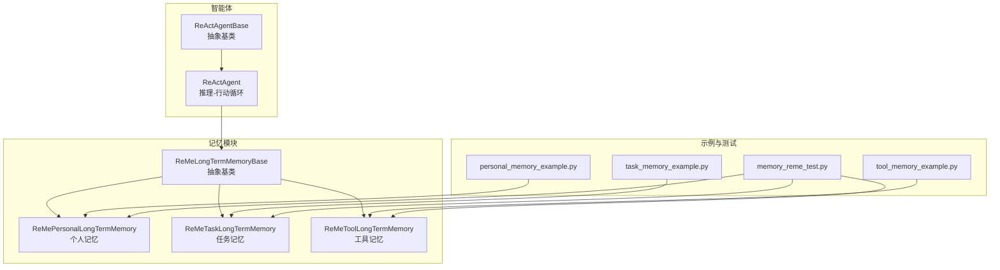
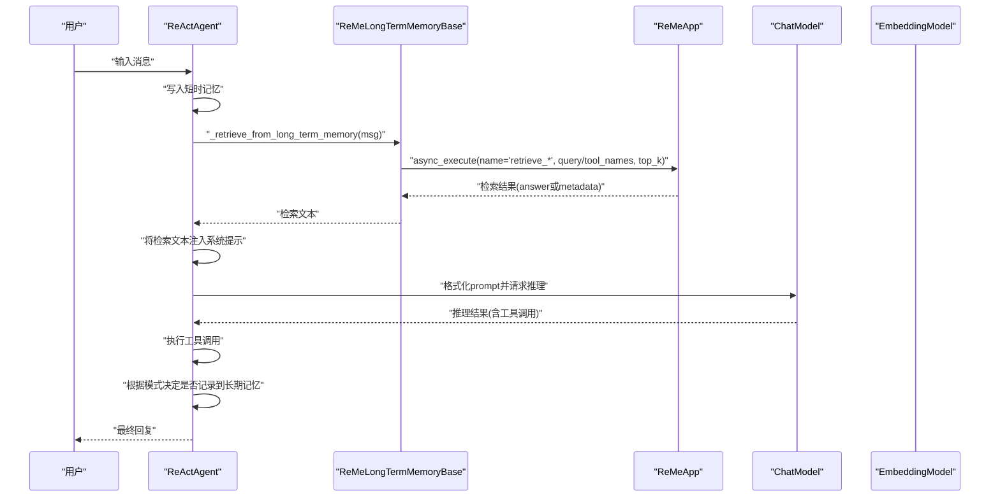
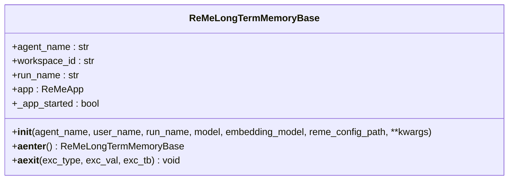
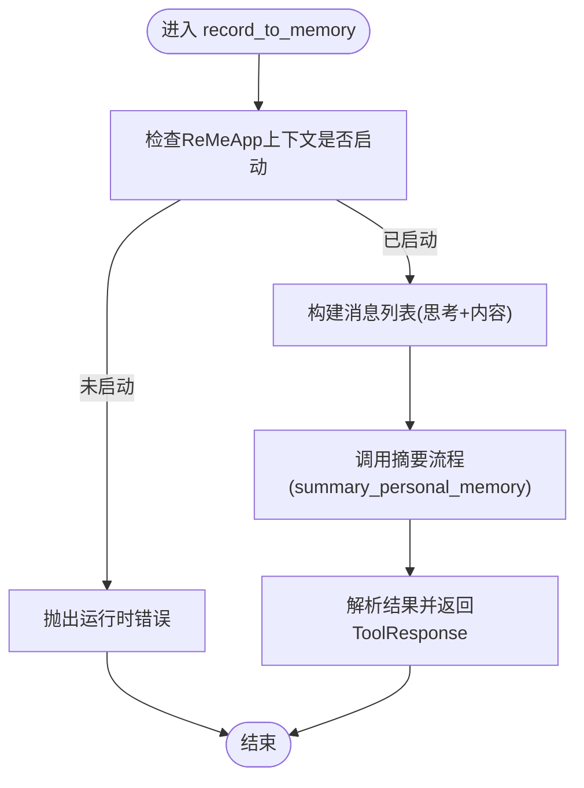
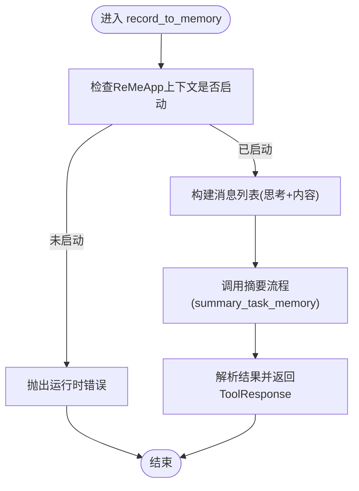
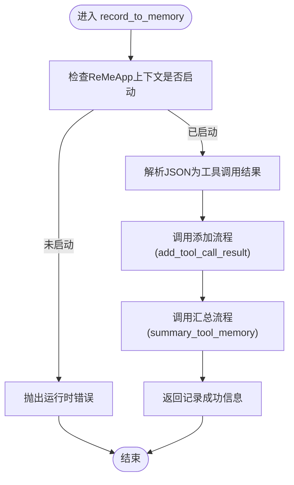
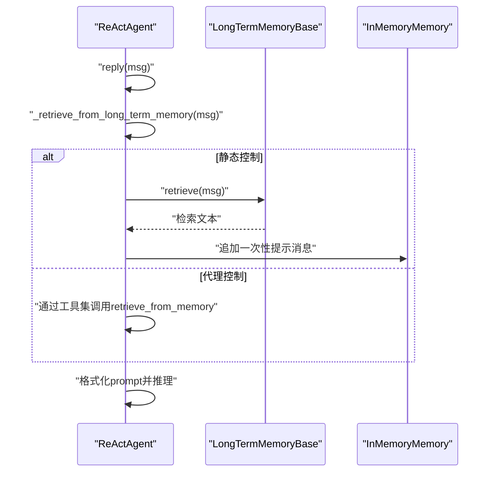
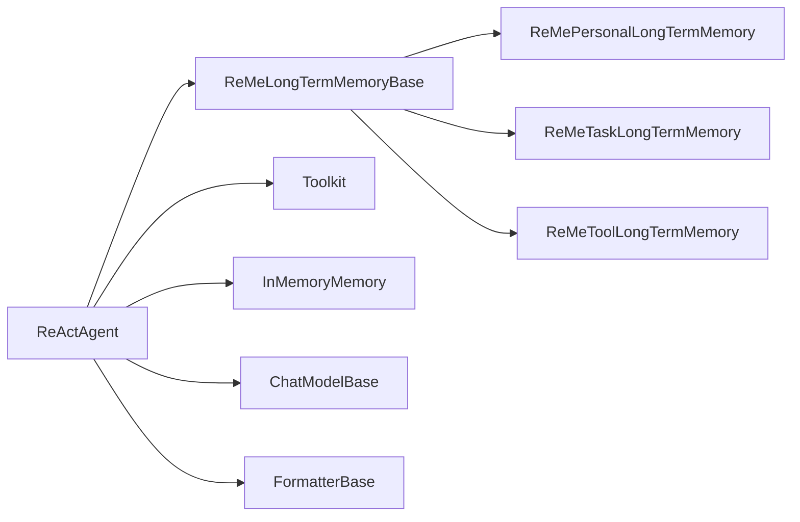

# ReMe集成

<cite>
**本文引用的文件**
- [src/agentscope/memory/_reme/__init__.py](file://src/agentscope/memory/_reme/__init__.py)
- [src/agentscope/memory/_reme/_reme_long_term_memory_base.py](file://src/agentscope/memory/_reme/_reme_long_term_memory_base.py)
- [src/agentscope/memory/_reme/_reme_personal_long_term_memory.py](file://src/agentscope/memory/_reme/_reme_personal_long_term_memory.py)
- [src/agentscope/memory/_reme/_reme_task_long_term_memory.py](file://src/agentscope/memory/_reme/_reme_task_long_term_memory.py)
- [src/agentscope/memory/_reme/_reme_tool_long_term_memory.py](file://src/agentscope/memory/_reme/_reme_tool_long_term_memory.py)
- [src/agentscope/agent/_react_agent.py](file://src/agentscope/agent/_react_agent.py)
- [src/agentscope/agent/_react_agent_base.py](file://src/agentscope/agent/_react_agent_base.py)
- [examples/functionality/long_term_memory/reme/personal_memory_example.py](file://examples/functionality/long_term_memory/reme/personal_memory_example.py)
- [examples/functionality/long_term_memory/reme/task_memory_example.py](file://examples/functionality/long_term_memory/reme/task_memory_example.py)
- [examples/functionality/long_term_memory/reme/tool_memory_example.py](file://examples/functionality/long_term_memory/reme/tool_memory_example.py)
- [tests/memory_reme_test.py](file://tests/memory_reme_test.py)
</cite>

## 目录
1. [简介](#简介)
2. [项目结构](#项目结构)
3. [核心组件](#核心组件)
4. [架构总览](#架构总览)
5. [详细组件分析](#详细组件分析)
6. [依赖关系分析](#依赖关系分析)
7. [性能考量](#性能考量)
8. [故障排查指南](#故障排查指南)
9. [结论](#结论)
10. [附录](#附录)

## 简介
本文件面向需要在AgentScope中集成ReMe长期记忆系统的开发者与使用者，系统性阐述ReMe记忆体系的架构设计、三类记忆（任务记忆、个人记忆、工具记忆）的差异与适用场景，并深入解析_retrieve_from_long_term_memory方法在ReAct智能体中的调用链路与上下文注入机制。文档同时提供可直接参考的示例路径，帮助读者完成ReMe记忆实例的配置、与ReAct智能体的集成，以及记忆的存储、检索与更新全流程。

## 项目结构
ReMe相关代码位于agentscope/memory/_reme目录，包含一个抽象基类与三种具体记忆类型；ReAct智能体位于agentscope/agent目录，负责在推理-行动循环中调用长期记忆模块；示例与测试分别位于examples与tests目录，覆盖个人、任务、工具三类记忆的典型用法。

图表来源
- [src/agentscope/memory/_reme/__init__.py](file://src/agentscope/memory/_reme/__init__.py#L1-L13)
- [src/agentscope/memory/_reme/_reme_long_term_memory_base.py](file://src/agentscope/memory/_reme/_reme_long_term_memory_base.py#L1-L120)
- [src/agentscope/memory/_reme/_reme_personal_long_term_memory.py](file://src/agentscope/memory/_reme/_reme_personal_long_term_memory.py#L1-L60)
- [src/agentscope/memory/_reme/_reme_task_long_term_memory.py](file://src/agentscope/memory/_reme/_reme_task_long_term_memory.py#L1-L60)
- [src/agentscope/memory/_reme/_reme_tool_long_term_memory.py](file://src/agentscope/memory/_reme/_reme_tool_long_term_memory.py#L1-L60)
- [src/agentscope/agent/_react_agent.py](file://src/agentscope/agent/_react_agent.py#L1-L120)
- [src/agentscope/agent/_react_agent_base.py](file://src/agentscope/agent/_react_agent_base.py#L1-L60)
- [examples/functionality/long_term_memory/reme/personal_memory_example.py](file://examples/functionality/long_term_memory/reme/personal_memory_example.py#L1-L60)
- [examples/functionality/long_term_memory/reme/task_memory_example.py](file://examples/functionality/long_term_memory/reme/task_memory_example.py#L1-L60)
- [examples/functionality/long_term_memory/reme/tool_memory_example.py](file://examples/functionality/long_term_memory/reme/tool_memory_example.py#L1-L60)
- [tests/memory_reme_test.py](file://tests/memory_reme_test.py#L1-L60)

章节来源
- [src/agentscope/memory/_reme/__init__.py](file://src/agentscope/memory/_reme/__init__.py#L1-L13)
- [src/agentscope/memory/_reme/_reme_long_term_memory_base.py](file://src/agentscope/memory/_reme/_reme_long_term_memory_base.py#L1-L120)
- [src/agentscope/agent/_react_agent.py](file://src/agentscope/agent/_react_agent.py#L1-L120)

## 核心组件
- ReMeLongTermMemoryBase：ReMe长期记忆抽象基类，封装模型与嵌入模型的初始化、ReMeApp上下文管理、以及与外部库的集成细节。
- ReMePersonalLongTermMemory：个人记忆，记录用户偏好、习惯、事实等信息，支持关键词检索与对话轨迹记录。
- ReMeTaskLongTermMemory：任务记忆，记录任务执行经验与最佳实践，支持按技术领域检索过往经验。
- ReMeToolLongTermMemory：工具记忆，记录工具调用结果并生成使用指南，支持按工具名检索最佳实践。
- ReActAgent：推理-行动循环智能体，支持在回复前从长期记忆检索信息并注入提示词，或在回复后进行静态记录。

章节来源
- [src/agentscope/memory/_reme/_reme_long_term_memory_base.py](file://src/agentscope/memory/_reme/_reme_long_term_memory_base.py#L83-L120)
- [src/agentscope/memory/_reme/_reme_personal_long_term_memory.py](file://src/agentscope/memory/_reme/_reme_personal_long_term_memory.py#L17-L60)
- [src/agentscope/memory/_reme/_reme_task_long_term_memory.py](file://src/agentscope/memory/_reme/_reme_task_long_term_memory.py#L17-L60)
- [src/agentscope/memory/_reme/_reme_tool_long_term_memory.py](file://src/agentscope/memory/_reme/_reme_tool_long_term_memory.py#L17-L60)
- [src/agentscope/agent/_react_agent.py](file://src/agentscope/agent/_react_agent.py#L40-L120)

## 架构总览
ReMe长期记忆通过ReActAgent在每次回复前触发检索流程，将检索到的记忆以一次性提示的形式注入到系统提示中，从而指导后续推理与行动。ReMeApp作为ReMe库的入口，负责与底层模型与嵌入服务交互，完成记忆的记录与检索。

图表来源
- [src/agentscope/agent/_react_agent.py](file://src/agentscope/agent/_react_agent.py#L741-L766)
- [src/agentscope/memory/_reme/_reme_long_term_memory_base.py](file://src/agentscope/memory/_reme/_reme_long_term_memory_base.py#L293-L371)
- [src/agentscope/memory/_reme/_reme_personal_long_term_memory.py](file://src/agentscope/memory/_reme/_reme_personal_long_term_memory.py#L155-L251)
- [src/agentscope/memory/_reme/_reme_task_long_term_memory.py](file://src/agentscope/memory/_reme/_reme_task_long_term_memory.py#L156-L264)
- [src/agentscope/memory/_reme/_reme_tool_long_term_memory.py](file://src/agentscope/memory/_reme/_reme_tool_long_term_memory.py#L175-L277)

## 详细组件分析

### ReMeLongTermMemoryBase：ReMe长期记忆抽象基类
- 职责
  - 初始化ReMeApp，提取模型与嵌入模型的API密钥与端点，构建配置参数。
  - 提供异步上下文管理器，确保ReMeApp生命周期正确开启与关闭。
  - 统一异常处理与依赖缺失提示。
- 关键点
  - 支持DashScope与OpenAI两类模型，自动识别模型类型并设置默认端点。
  - 将嵌入维度参数注入配置，用于向量检索。
  - 使用try/except处理rememe_ai未安装的情况，避免阻塞初始化。

图表来源
- [src/agentscope/memory/_reme/_reme_long_term_memory_base.py](file://src/agentscope/memory/_reme/_reme_long_term_memory_base.py#L100-L189)
- [src/agentscope/memory/_reme/_reme_long_term_memory_base.py](file://src/agentscope/memory/_reme/_reme_long_term_memory_base.py#L293-L371)

章节来源
- [src/agentscope/memory/_reme/_reme_long_term_memory_base.py](file://src/agentscope/memory/_reme/_reme_long_term_memory_base.py#L100-L189)
- [src/agentscope/memory/_reme/_reme_long_term_memory_base.py](file://src/agentscope/memory/_reme/_reme_long_term_memory_base.py#L293-L371)

### ReMePersonalLongTermMemory：个人记忆
- 记录接口
  - record_to_memory：显式工具函数，适合结构化记录用户偏好、习惯、事实等。
  - record：直接记录对话轨迹，自动转换为ReMe格式并调用摘要流程。
- 检索接口
  - retrieve_from_memory：基于关键词检索个人偏好与历史信息。
  - retrieve：从消息内容中抽取查询，返回检索文本。
- 应用场景
  - 个性化回答、用户画像增强、减少重复确认。

图表来源
- [src/agentscope/memory/_reme/_reme_personal_long_term_memory.py](file://src/agentscope/memory/_reme/_reme_personal_long_term_memory.py#L20-L144)

章节来源
- [src/agentscope/memory/_reme/_reme_personal_long_term_memory.py](file://src/agentscope/memory/_reme/_reme_personal_long_term_memory.py#L20-L144)
- [src/agentscope/memory/_reme/_reme_personal_long_term_memory.py](file://src/agentscope/memory/_reme/_reme_personal_long_term_memory.py#L155-L251)
- [src/agentscope/memory/_reme/_reme_personal_long_term_memory.py](file://src/agentscope/memory/_reme/_reme_personal_long_term_memory.py#L253-L415)

### ReMeTaskLongTermMemory：任务记忆
- 记录接口
  - record_to_memory：记录任务执行经验、步骤、技巧、结果与教训。
  - record：直接记录对话轨迹，支持评分(score)。
- 检索接口
  - retrieve_from_memory：基于关键词检索任务经验与最佳实践。
  - retrieve：从消息内容中抽取查询，返回检索文本。
- 应用场景
  - 技术问题求解、方案推荐、避免重复踩坑。

图表来源
- [src/agentscope/memory/_reme/_reme_task_long_term_memory.py](file://src/agentscope/memory/_reme/_reme_task_long_term_memory.py#L25-L144)

章节来源
- [src/agentscope/memory/_reme/_reme_task_long_term_memory.py](file://src/agentscope/memory/_reme/_reme_task_long_term_memory.py#L25-L144)
- [src/agentscope/memory/_reme/_reme_task_long_term_memory.py](file://src/agentscope/memory/_reme/_reme_task_long_term_memory.py#L156-L264)
- [src/agentscope/memory/_reme/_reme_task_long_term_memory.py](file://src/agentscope/memory/_reme/_reme_task_long_term_memory.py#L266-L437)

### ReMeToolLongTermMemory：工具记忆
- 记录接口
  - record_to_memory：接收JSON字符串形式的工具调用结果，先添加再汇总生成使用指南。
  - record：从消息中提取JSON并记录，支持批量与单条记录。
- 检索接口
  - retrieve_from_memory：按工具名检索使用指南与最佳实践。
  - retrieve：从消息中抽取工具名，返回检索文本。
- 应用场景
  - 工具调用决策优化、参数选择、性能与成本评估。

图表来源
- [src/agentscope/memory/_reme/_reme_tool_long_term_memory.py](file://src/agentscope/memory/_reme/_reme_tool_long_term_memory.py#L25-L174)

章节来源
- [src/agentscope/memory/_reme/_reme_tool_long_term_memory.py](file://src/agentscope/memory/_reme/_reme_tool_long_term_memory.py#L25-L174)
- [src/agentscope/memory/_reme/_reme_tool_long_term_memory.py](file://src/agentscope/memory/_reme/_reme_tool_long_term_memory.py#L175-L277)
- [src/agentscope/memory/_reme/_reme_tool_long_term_memory.py](file://src/agentscope/memory/_reme/_reme_tool_long_term_memory.py#L353-L546)

### ReAct智能体中的_retrieve_from_long_term_memory流程
- 触发时机
  - 在每次回复开始时，ReActAgent会调用_retrieve_from_long_term_memory，依据配置模式决定是否在回复前后记录。
- 执行逻辑
  - 若启用静态控制，将调用long_term_memory.retrieve(msg)，并将返回的检索文本包装为Msg注入短时记忆。
  - 若启用代理控制，会在工具集中注册retrieve_from_memory与record_to_memory，由智能体自主决定何时检索与记录。
- 上下文注入
  - 检索得到的信息以一次性提示形式加入系统提示，指导后续推理与行动。

图表来源
- [src/agentscope/agent/_react_agent.py](file://src/agentscope/agent/_react_agent.py#L741-L766)
- [src/agentscope/agent/_react_agent.py](file://src/agentscope/agent/_react_agent.py#L253-L409)

章节来源
- [src/agentscope/agent/_react_agent.py](file://src/agentscope/agent/_react_agent.py#L741-L766)
- [src/agentscope/agent/_react_agent.py](file://src/agentscope/agent/_react_agent.py#L253-L409)

## 依赖关系分析
- ReMeLongTermMemoryBase依赖：
  - 模型与嵌入模型：DashScopeChatModel/OpenAIChatModel、DashScopeTextEmbedding/OpenAITextEmbedding。
  - ReMeApp：通过pip安装的rememe_ai库。
- ReActAgent依赖：
  - MemoryBase、LongTermMemoryBase、Toolkit、ChatModelBase、FormatterBase。
  - 在“代理控制”模式下，自动注册retrieve_from_memory与record_to_memory工具函数。
- 示例与测试：
  - personal_memory_example.py、task_memory_example.py、tool_memory_example.py展示了三类记忆与ReActAgent的集成。
  - memory_reme_test.py验证了记录、检索、上下文管理等关键行为。

图表来源
- [src/agentscope/memory/_reme/_reme_long_term_memory_base.py](file://src/agentscope/memory/_reme/_reme_long_term_memory_base.py#L1-L120)
- [src/agentscope/agent/_react_agent.py](file://src/agentscope/agent/_react_agent.py#L40-L120)

章节来源
- [src/agentscope/memory/_reme/_reme_long_term_memory_base.py](file://src/agentscope/memory/_reme/_reme_long_term_memory_base.py#L1-L120)
- [src/agentscope/agent/_react_agent.py](file://src/agentscope/agent/_react_agent.py#L40-L120)

## 性能考量
- 向量检索与嵌入维度：嵌入维度影响向量存储与检索效率，需结合硬件与服务端限制合理设置。
- 并行工具调用：ReActAgent支持并行工具调用，可减少整体响应时间，但需注意资源竞争与限流。
- 检索频率与批量化：对工具记忆，一次检索多个工具名可减少往返次数；对任务与个人记忆，按关键词逐一检索更灵活。
- 上下文长度：检索注入的提示文本应控制长度，避免超过模型上下文上限。

## 故障排查指南
- 安装依赖
  - 缺少rememe_ai库：初始化时报错提示安装rememe-ai。请确保pip安装并版本兼容。
- 上下文未启动
  - 忘记使用async with或未正确调用__aenter__/__aexit__：所有记录与检索操作均需在ReMeApp上下文内执行。
- 模型类型不匹配
  - 传入非DashScope或OpenAI模型：构造函数会抛出值错误，请使用受支持的模型类型。
- 输入格式错误
  - 工具记忆record_to_memory期望JSON字符串且字段完整；个人与任务记忆的record方法要求消息内容可解析为字符串或文本块。
- 检索无结果
  - 关键词不够具体或历史数据不足；建议增加关键词数量与多样性，或补充更多历史记录。

章节来源
- [src/agentscope/memory/_reme/_reme_long_term_memory_base.py](file://src/agentscope/memory/_reme/_reme_long_term_memory_base.py#L263-L288)
- [src/agentscope/memory/_reme/_reme_tool_long_term_memory.py](file://src/agentscope/memory/_reme/_reme_tool_long_term_memory.py#L93-L173)
- [tests/memory_reme_test.py](file://tests/memory_reme_test.py#L194-L244)
- [tests/memory_reme_test.py](file://tests/memory_reme_test.py#L337-L371)

## 结论
ReMe长期记忆系统通过统一的抽象基类与三类记忆实现，为AgentScope提供了可扩展、可配置的长期记忆能力。ReAct智能体在回复前的检索与注入机制，使得记忆能够实时影响推理过程。配合示例与测试，开发者可以快速完成ReMe记忆实例的配置与集成，并在不同场景下选择合适的记忆类型以提升智能体的个性化与专业性。

## 附录

### 实际代码示例路径（不含代码内容）
- 配置与初始化
  - [personal_memory_example.py](file://examples/functionality/long_term_memory/reme/personal_memory_example.py#L245-L296)
  - [task_memory_example.py](file://examples/functionality/long_term_memory/reme/task_memory_example.py#L292-L343)
  - [tool_memory_example.py](file://examples/functionality/long_term_memory/reme/tool_memory_example.py#L347-L437)
- ReAct智能体集成
  - [personal_memory_example.py](file://examples/functionality/long_term_memory/reme/personal_memory_example.py#L157-L243)
  - [task_memory_example.py](file://examples/functionality/long_term_memory/reme/task_memory_example.py#L185-L291)
  - [tool_memory_example.py](file://examples/functionality/long_term_memory/reme/tool_memory_example.py#L260-L408)
- 测试用例（验证记录、检索、上下文管理）
  - [memory_reme_test.py](file://tests/memory_reme_test.py#L1-L120)
  - [memory_reme_test.py](file://tests/memory_reme_test.py#L194-L244)
  - [memory_reme_test.py](file://tests/memory_reme_test.py#L337-L371)
  - [memory_reme_test.py](file://tests/memory_reme_test.py#L667-L768)