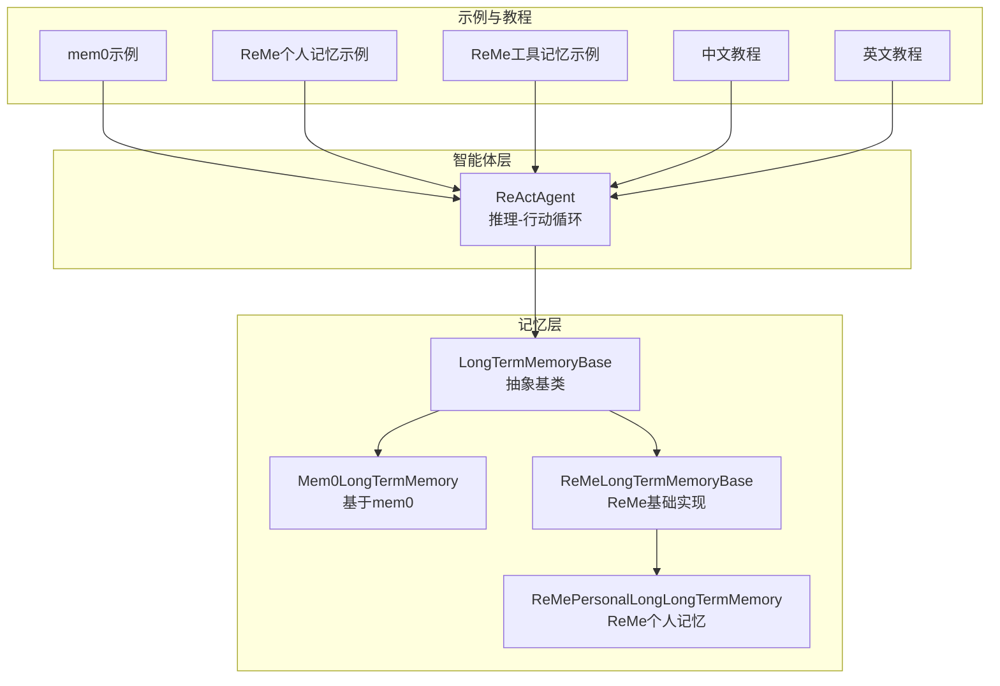
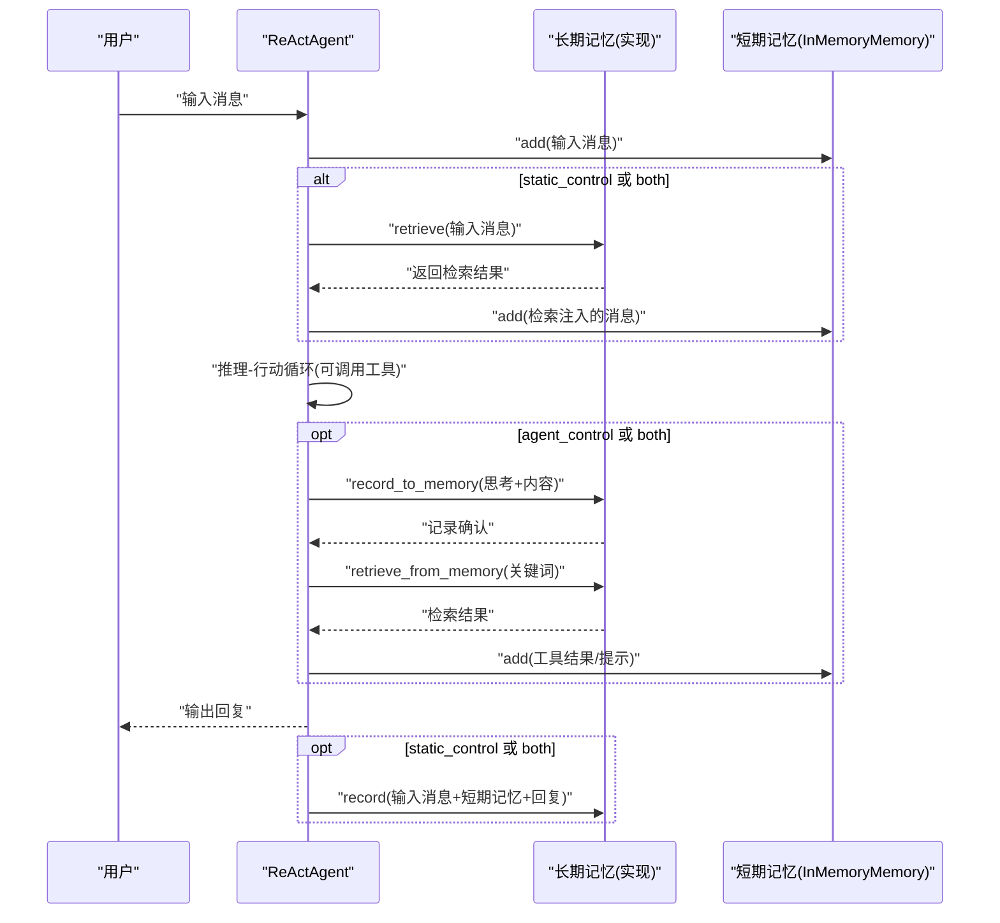
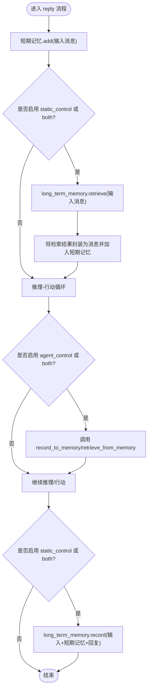
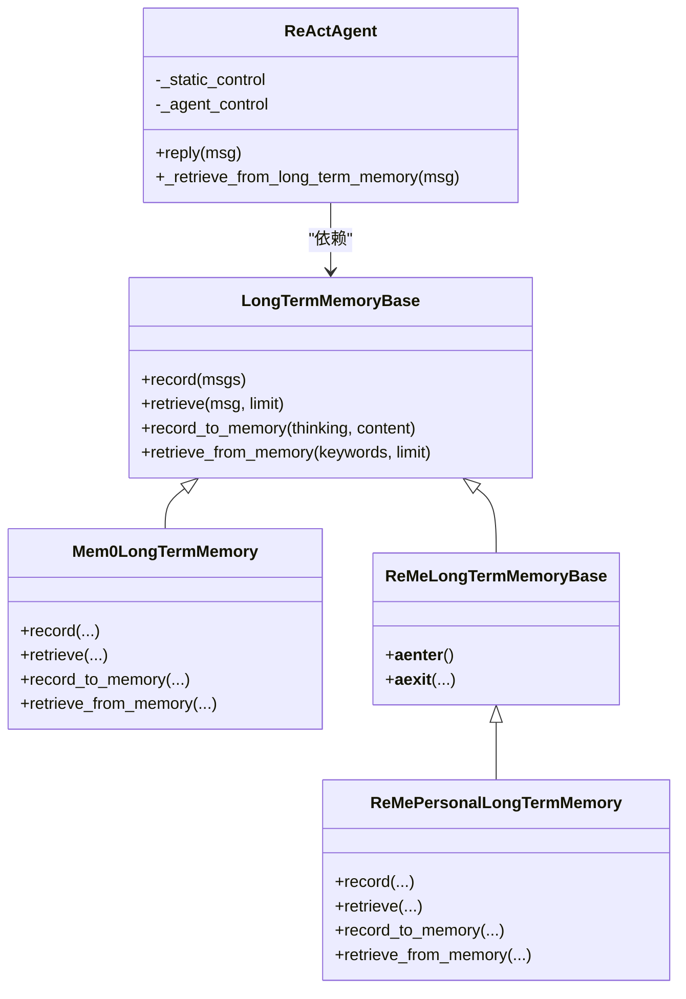

# 记忆模式配置

<cite>
**本文引用的文件**
- [src/agentscope/agent/_react_agent.py](file://src/agentscope/agent/_react_agent.py)
- [src/agentscope/memory/_long_term_memory_base.py](file://src/agentscope/memory/_long_term_memory_base.py)
- [src/agentscope/memory/_mem0_long_term_memory.py](file://src/agentscope/memory/_mem0_long_term_memory.py)
- [src/agentscope/memory/_reme/_reme_long_term_memory_base.py](file://src/agentscope/memory/_reme/_reme_long_term_memory_base.py)
- [src/agentscope/memory/_reme/_reme_personal_long_term_memory.py](file://src/agentscope/memory/_reme/_reme_personal_long_term_memory.py)
- [examples/functionality/long_term_memory/mem0/memory_example.py](file://examples/functionality/long_term_memory/mem0/memory_example.py)
- [examples/functionality/long_term_memory/reme/personal_memory_example.py](file://examples/functionality/long_term_memory/reme/personal_memory_example.py)
- [examples/functionality/long_term_memory/reme/tool_memory_example.py](file://examples/functionality/long_term_memory/reme/tool_memory_example.py)
- [docs/tutorial/zh_CN/src/task_long_term_memory.py](file://docs/tutorial/zh_CN/src/task_long_term_memory.py)
- [docs/tutorial/en/src/task_long_term_memory.py](file://docs/tutorial/en/src/task_long_term_memory.py)
</cite>

## 目录
1. [简介](#简介)
2. [项目结构](#项目结构)
3. [核心组件](#核心组件)
4. [架构总览](#架构总览)
5. [详细组件分析](#详细组件分析)
6. [依赖关系分析](#依赖关系分析)
7. [性能考量](#性能考量)
8. [故障排查指南](#故障排查指南)
9. [结论](#结论)
10. [附录](#附录)

## 简介
本文件围绕 AgentScope 中的长期记忆模式配置展开，系统性阐述 long_term_memory_mode 参数的三种工作模式：agent_control、static_control 与 both 的区别、适用场景、行为差异与性能影响，并给出配置示例与最佳实践建议。重点覆盖：
- static_control 模式下系统如何在每次回复前自动将检索到的记忆注入到系统提示词中；
- agent_control 模式下智能体通过工具调用主动管理记忆；
- 两种模式在提示词修改、记忆检索时机与性能上的差异；
- 结合 Mem0 与 ReMe 实现类的示例，帮助开发者按需选择。

## 项目结构
与长期记忆模式相关的核心代码位于以下模块：
- ReActAgent：负责推理-行动循环、工具调用、提示词构建与长期记忆交互；
- LongTermMemoryBase：长期记忆抽象基类，定义 record/retrieve 与 record_to_memory/retrieve_from_memory 接口；
- Mem0LongTermMemory：基于 mem0 的长期记忆实现；
- ReMeLongTermMemoryBase 与 ReMePersonalLongTermMemory：基于 ReMe 的长期记忆实现与个人记忆实现；
- 示例与教程：mem0 与 ReMe 的使用示例，以及中文/英文教程对模式的说明。

图表来源
- [src/agentscope/agent/_react_agent.py](file://src/agentscope/agent/_react_agent.py#L121-L182)
- [src/agentscope/memory/_long_term_memory_base.py](file://src/agentscope/memory/_long_term_memory_base.py#L1-L95)
- [src/agentscope/memory/_mem0_long_term_memory.py](file://src/agentscope/memory/_mem0_long_term_memory.py#L73-L120)
- [src/agentscope/memory/_reme/_reme_long_term_memory_base.py](file://src/agentscope/memory/_reme/_reme_long_term_memory_base.py#L83-L120)
- [src/agentscope/memory/_reme/_reme_personal_long_term_memory.py](file://src/agentscope/memory/_reme/_reme_personal_long_term_memory.py#L17-L60)
- [examples/functionality/long_term_memory/mem0/memory_example.py](file://examples/functionality/long_term_memory/mem0/memory_example.py#L136-L186)
- [examples/functionality/long_term_memory/reme/personal_memory_example.py](file://examples/functionality/long_term_memory/reme/personal_memory_example.py#L157-L243)
- [examples/functionality/long_term_memory/reme/tool_memory_example.py](file://examples/functionality/long_term_memory/reme/tool_memory_example.py#L347-L437)
- [docs/tutorial/zh_CN/src/task_long_term_memory.py](file://docs/tutorial/zh_CN/src/task_long_term_memory.py#L1-L40)
- [docs/tutorial/en/src/task_long_term_memory.py](file://docs/tutorial/en/src/task_long_term_memory.py#L1-L40)

章节来源
- [src/agentscope/agent/_react_agent.py](file://src/agentscope/agent/_react_agent.py#L121-L182)
- [src/agentscope/memory/_long_term_memory_base.py](file://src/agentscope/memory/_long_term_memory_base.py#L1-L95)
- [src/agentscope/memory/_mem0_long_term_memory.py](file://src/agentscope/memory/_mem0_long_term_memory.py#L73-L120)
- [src/agentscope/memory/_reme/_reme_long_term_memory_base.py](file://src/agentscope/memory/_reme/_reme_long_term_memory_base.py#L83-L120)
- [src/agentscope/memory/_reme/_reme_personal_long_term_memory.py](file://src/agentscope/memory/_reme/_reme_personal_long_term_memory.py#L17-L60)
- [examples/functionality/long_term_memory/mem0/memory_example.py](file://examples/functionality/long_term_memory/mem0/memory_example.py#L136-L186)
- [examples/functionality/long_term_memory/reme/personal_memory_example.py](file://examples/functionality/long_term_memory/reme/personal_memory_example.py#L157-L243)
- [examples/functionality/long_term_memory/reme/tool_memory_example.py](file://examples/functionality/long_term_memory/reme/tool_memory_example.py#L347-L437)
- [docs/tutorial/zh_CN/src/task_long_term_memory.py](file://docs/tutorial/zh_CN/src/task_long_term_memory.py#L1-L40)
- [docs/tutorial/en/src/task_long_term_memory.py](file://docs/tutorial/en/src/task_long_term_memory.py#L1-L40)

## 核心组件
- ReActAgent 的 long_term_memory_mode 参数决定长期记忆的交互方式：
  - agent_control：注册 record_to_memory 与 retrieve_from_memory 两个工具函数，允许智能体在推理-行动循环中主动调用；
  - static_control：在每次回复开始前自动检索长期记忆并将其注入系统提示词，结束后再将对话历史与回复记录到长期记忆；
  - both：同时启用上述两种模式。
- LongTermMemoryBase 定义两类接口：
  - 面向开发者的 record/retrieve：用于在回复前后显式记录/检索；
  - 面向智能体的 record_to_memory/retrieve_from_memory：用于工具调用的记录/检索。

章节来源
- [src/agentscope/agent/_react_agent.py](file://src/agentscope/agent/_react_agent.py#L121-L182)
- [src/agentscope/memory/_long_term_memory_base.py](file://src/agentscope/memory/_long_term_memory_base.py#L1-L95)
- [docs/tutorial/zh_CN/src/task_long_term_memory.py](file://docs/tutorial/zh_CN/src/task_long_term_memory.py#L1-L40)
- [docs/tutorial/en/src/task_long_term_memory.py](file://docs/tutorial/en/src/task_long_term_memory.py#L1-L40)

## 架构总览
下面的序列图展示了三种模式下 ReActAgent 与长期记忆的交互流程，以及提示词构建的关键节点。

图表来源
- [src/agentscope/agent/_react_agent.py](file://src/agentscope/agent/_react_agent.py#L253-L409)
- [src/agentscope/agent/_react_agent.py](file://src/agentscope/agent/_react_agent.py#L741-L766)
- [src/agentscope/memory/_long_term_memory_base.py](file://src/agentscope/memory/_long_term_memory_base.py#L24-L94)

## 详细组件分析

### ReActAgent 中的长期记忆模式处理
- 模式判定：
  - _static_control：当 long_term_memory_mode 为 static_control 或 both 时启用；
  - _agent_control：当 long_term_memory_mode 为 agent_control 或 both 时启用。
- 工具注册：
  - 若 _agent_control 为真，则向 Toolkit 注册 record_to_memory 与 retrieve_from_memory 两个工具函数，使智能体可在推理阶段主动调用。
- 回复后记录：
  - 若 _static_control 为真，则在回复生成后，将输入消息、短期记忆与回复一并传入 record，完成持久化。
- 提示词注入：
  - 在 static_control 或 both 模式下，_retrieve_from_long_term_memory 会在回复前将检索到的记忆封装为消息并加入短期记忆，从而影响后续推理。

图表来源
- [src/agentscope/agent/_react_agent.py](file://src/agentscope/agent/_react_agent.py#L253-L409)
- [src/agentscope/agent/_react_agent.py](file://src/agentscope/agent/_react_agent.py#L741-L766)

章节来源
- [src/agentscope/agent/_react_agent.py](file://src/agentscope/agent/_react_agent.py#L121-L182)
- [src/agentscope/agent/_react_agent.py](file://src/agentscope/agent/_react_agent.py#L253-L409)
- [src/agentscope/agent/_react_agent.py](file://src/agentscope/agent/_react_agent.py#L741-L766)

### static_control 模式：提示词注入与检索时机
- 检索时机：在每次回复开始前，调用 long_term_memory.retrieve(msg)，并将结果以消息形式注入短期记忆，随后进入推理-行动循环。
- 提示词修改：由于检索结果被注入短期记忆，最终格式化后的系统提示词会包含来自长期记忆的内容，从而影响模型输出。
- 记录时机：回复结束后，将输入消息、短期记忆与回复一起传入 record，完成持久化。

章节来源
- [src/agentscope/agent/_react_agent.py](file://src/agentscope/agent/_react_agent.py#L741-L766)
- [src/agentscope/agent/_react_agent.py](file://src/agentscope/agent/_react_agent.py#L399-L408)
- [docs/tutorial/zh_CN/src/task_long_term_memory.py](file://docs/tutorial/zh_CN/src/task_long_term_memory.py#L78-L131)
- [docs/tutorial/en/src/task_long_term_memory.py](file://docs/tutorial/en/src/task_long_term_memory.py#L83-L141)

### agent_control 模式：工具驱动的记忆管理
- 工具注册：当 long_term_memory_mode 为 agent_control 或 both 时，ReActAgent 将 record_to_memory 与 retrieve_from_memory 注册为工具函数，智能体可在推理阶段自行决定何时记录与检索。
- 行动阶段：工具执行后，结果会被写入短期记忆；若智能体生成结构化输出，也会在相应阶段处理。
- 适用场景：需要智能体具备“自我记忆”的能力，如根据用户偏好动态调整策略、在复杂任务中复用过往经验等。

章节来源
- [src/agentscope/agent/_react_agent.py](file://src/agentscope/agent/_react_agent.py#L170-L180)
- [src/agentscope/memory/_long_term_memory_base.py](file://src/agentscope/memory/_long_term_memory_base.py#L48-L94)
- [examples/functionality/long_term_memory/reme/personal_memory_example.py](file://examples/functionality/long_term_memory/reme/personal_memory_example.py#L157-L243)
- [examples/functionality/long_term_memory/reme/tool_memory_example.py](file://examples/functionality/long_term_memory/reme/tool_memory_example.py#L347-L437)

### both 模式：静态检索 + 动态管理
- 同时具备 static_control 与 agent_control 的特性：既能在回复前自动注入检索结果，又允许智能体在推理过程中主动管理记忆。
- 适用场景：希望兼顾“开箱即用”的检索增强与“智能体自管理”的灵活性。

章节来源
- [src/agentscope/agent/_react_agent.py](file://src/agentscope/agent/_react_agent.py#L137-L167)
- [docs/tutorial/zh_CN/src/task_long_term_memory.py](file://docs/tutorial/zh_CN/src/task_long_term_memory.py#L1-L40)
- [docs/tutorial/en/src/task_long_term_memory.py](file://docs/tutorial/en/src/task_long_term_memory.py#L1-L40)

### Mem0 长期记忆实现
- 接口实现：Mem0LongTermMemory 完整实现了 record/retrieve 与 record_to_memory/retrieve_from_memory，支持向量存储与检索。
- 记录策略：record_to_memory 采用三层回退策略，优先以 user 角色记录，失败后再尝试 assistant 角色与禁用推理的直录策略，提升稳定性。
- 检索策略：retrieve_from_memory 支持多关键词并发检索，合并结果并可选格式化关系型结果。

章节来源
- [src/agentscope/memory/_mem0_long_term_memory.py](file://src/agentscope/memory/_mem0_long_term_memory.py#L258-L450)
- [src/agentscope/memory/_mem0_long_term_memory.py](file://src/agentscope/memory/_mem0_long_term_memory.py#L560-L624)
- [examples/functionality/long_term_memory/mem0/memory_example.py](file://examples/functionality/long_term_memory/mem0/memory_example.py#L136-L186)

### ReMe 长期记忆实现
- ReMeLongTermMemoryBase：封装 ReMeApp 初始化、异步上下文管理与模型/嵌入配置提取。
- ReMePersonalLongTermMemory：实现 record_to_memory/retrieve_from_memory 与 record/retrieve，支持个人记忆的摘要与检索。
- 使用要点：需通过 async with 管理 ReMeApp 生命周期，否则会抛出运行时错误。

章节来源
- [src/agentscope/memory/_reme/_reme_long_term_memory_base.py](file://src/agentscope/memory/_reme/_reme_long_term_memory_base.py#L190-L371)
- [src/agentscope/memory/_reme/_reme_personal_long_term_memory.py](file://src/agentscope/memory/_reme/_reme_personal_long_term_memory.py#L17-L60)
- [src/agentscope/memory/_reme/_reme_personal_long_term_memory.py](file://src/agentscope/memory/_reme/_reme_personal_long_term_memory.py#L155-L251)
- [src/agentscope/memory/_reme/_reme_personal_long_term_memory.py](file://src/agentscope/memory/_reme/_reme_personal_long_term_memory.py#L253-L415)
- [examples/functionality/long_term_memory/reme/personal_memory_example.py](file://examples/functionality/long_term_memory/reme/personal_memory_example.py#L1-L120)

## 依赖关系分析
- ReActAgent 依赖 LongTermMemoryBase 接口，具体实现可替换为 Mem0LongTermMemory 或 ReMePersonalLongTermMemory；
- Mem0LongTermMemory 依赖 mem0 库与 AgentScope 的模型/嵌入适配；
- ReMePersonalLongTermMemory 依赖 reme_ai 库与 ReMeLongTermMemoryBase；
- 示例脚本展示了两种实现与 ReActAgent 的集成方式。

图表来源
- [src/agentscope/memory/_long_term_memory_base.py](file://src/agentscope/memory/_long_term_memory_base.py#L1-L95)
- [src/agentscope/memory/_mem0_long_term_memory.py](file://src/agentscope/memory/_mem0_long_term_memory.py#L73-L120)
- [src/agentscope/memory/_reme/_reme_long_term_memory_base.py](file://src/agentscope/memory/_reme/_reme_long_term_memory_base.py#L83-L120)
- [src/agentscope/memory/_reme/_reme_personal_long_term_memory.py](file://src/agentscope/memory/_reme/_reme_personal_long_term_memory.py#L17-L60)
- [src/agentscope/agent/_react_agent.py](file://src/agentscope/agent/_react_agent.py#L121-L182)

章节来源
- [src/agentscope/memory/_long_term_memory_base.py](file://src/agentscope/memory/_long_term_memory_base.py#L1-L95)
- [src/agentscope/memory/_mem0_long_term_memory.py](file://src/agentscope/memory/_mem0_long_term_memory.py#L73-L120)
- [src/agentscope/memory/_reme/_reme_long_term_memory_base.py](file://src/agentscope/memory/_reme/_reme_long_term_memory_base.py#L83-L120)
- [src/agentscope/memory/_reme/_reme_personal_long_term_memory.py](file://src/agentscope/memory/_reme/_reme_personal_long_term_memory.py#L17-L60)
- [src/agentscope/agent/_react_agent.py](file://src/agentscope/agent/_react_agent.py#L121-L182)

## 性能考量
- static_control 模式
  - 每次回复前进行检索并注入提示词，增加一次外部检索调用与消息拼接成本；
  - 适合对“上下文一致性”要求高但对话频率不高的场景。
- agent_control 模式
  - 智能体在推理阶段按需检索/记录，减少不必要的检索；
  - 可能因工具调用次数增加带来额外延迟，但更灵活可控。
- both 模式
  - 同时承担 static_control 的检索成本与 agent_control 的工具调用成本；
  - 适合需要“强检索增强 + 智能体自管理”的复杂应用。
- 实现层面的优化建议
  - Mem0：合理设置 limit 与并发检索，避免过多关键词导致查询膨胀；必要时缓存常用检索结果；
  - ReMe：通过 async with 正确管理上下文，避免重复初始化带来的开销；批量记录/检索时注意网络与服务端压力。

章节来源
- [src/agentscope/memory/_mem0_long_term_memory.py](file://src/agentscope/memory/_mem0_long_term_memory.py#L385-L450)
- [src/agentscope/memory/_reme/_reme_personal_long_term_memory.py](file://src/agentscope/memory/_reme/_reme_personal_long_term_memory.py#L155-L251)
- [src/agentscope/agent/_react_agent.py](file://src/agentscope/agent/_react_agent.py#L253-L409)

## 故障排查指南
- ReMe 未正确初始化
  - 现象：调用 record_to_memory/retrieve_from_memory 抛出运行时错误，提示未启动 ReMeApp 上下文；
  - 处理：确保使用 async with 管理 ReMeApp 生命周期，或在调用前显式进入上下文。
- mem0 依赖缺失
  - 现象：导入 mem0 报错或版本不兼容；
  - 处理：安装 mem0ai 并确保版本满足实现要求；必要时调整模型/嵌入适配逻辑。
- 检索结果为空
  - 现象：static_control 下提示词未变化，或 agent_control 下检索无结果；
  - 处理：检查关键词/查询语句是否准确；适当提高 limit；确认 record 是否已成功写入。
- 工具调用异常
  - 现象：智能体调用 record_to_memory/retrieve_from_memory 返回错误信息；
  - 处理：查看工具返回的 ToolResponse 内容，定位具体错误原因并修正输入参数。

章节来源
- [src/agentscope/memory/_reme/_reme_personal_long_term_memory.py](file://src/agentscope/memory/_reme/_reme_personal_long_term_memory.py#L72-L110)
- [src/agentscope/memory/_mem0_long_term_memory.py](file://src/agentscope/memory/_mem0_long_term_memory.py#L142-L175)
- [src/agentscope/memory/_mem0_long_term_memory.py](file://src/agentscope/memory/_mem0_long_term_memory.py#L258-L384)

## 结论
- static_control：简单易用，适合“检索增强 + 显式持久化”的场景；
- agent_control：灵活可控，适合“智能体自管理 + 主动记忆”的场景；
- both：兼顾二者优势，适合复杂应用，但需关注性能与成本；
- Mem0 与 ReMe 提供了成熟的检索与持久化能力，开发者可根据数据规模、检索质量与部署环境选择合适实现。

## 附录

### 配置示例与行为差异
- static_control 模式示例（mem0）
  - 在 ReActAgent 中设置 long_term_memory_mode="static_control"，并在回复后调用 record 持久化；
  - 参考路径：[examples/functionality/long_term_memory/mem0/memory_example.py](file://examples/functionality/long_term_memory/mem0/memory_example.py#L136-L186)
- agent_control 模式示例（ReMe 个人记忆）
  - 在 ReActAgent 中设置 long_term_memory_mode="agent_control"，注册 record_to_memory 与 retrieve_from_memory 工具；
  - 参考路径：[examples/functionality/long_term_memory/reme/personal_memory_example.py](file://examples/functionality/long_term_memory/reme/personal_memory_example.py#L157-L243)
- both 模式示例（ReMe 工具记忆）
  - 同时启用检索注入与工具调用，示例展示检索工具使用指南并注入系统提示；
  - 参考路径：[examples/functionality/long_term_memory/reme/tool_memory_example.py](file://examples/functionality/long_term_memory/reme/tool_memory_example.py#L347-L437)

### 最佳实践建议
- 选择模式
  - 若希望“开箱即用”且对话频繁，优先 static_control；
  - 若需要智能体“自我学习与记忆”，优先 agent_control；
  - 复杂应用可考虑 both，但需评估检索与工具调用的成本。
- 提示词设计
  - 在 agent_control 模式下，建议在系统提示中明确记忆管理规范，引导智能体在合适时机调用工具。
- 数据与检索
  - 合理设置 limit 与关键词，避免过度检索；
  - 对高频检索结果进行本地缓存，降低外部依赖压力。
- 部署与依赖
  - 确保 mem0/ReMe 依赖正确安装与版本匹配；
  - 使用 async with 管理 ReMeApp 生命周期，避免资源泄漏。