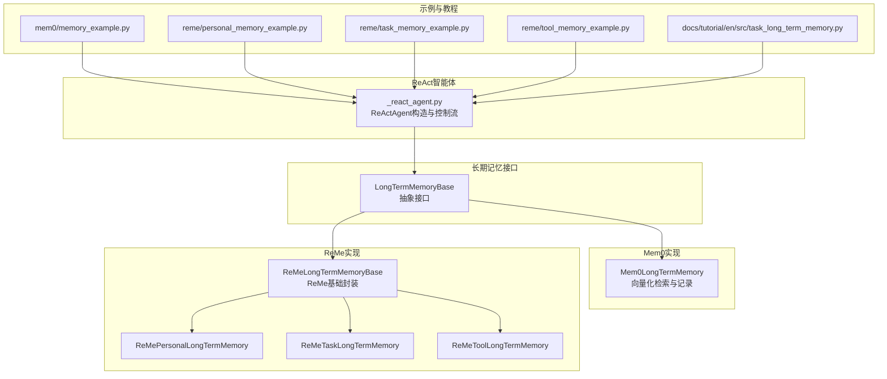
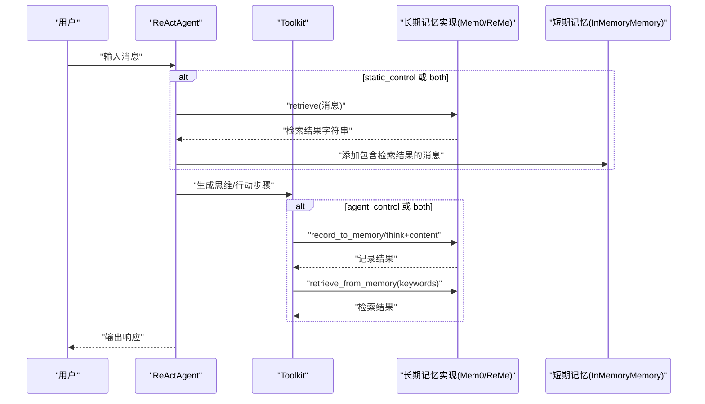
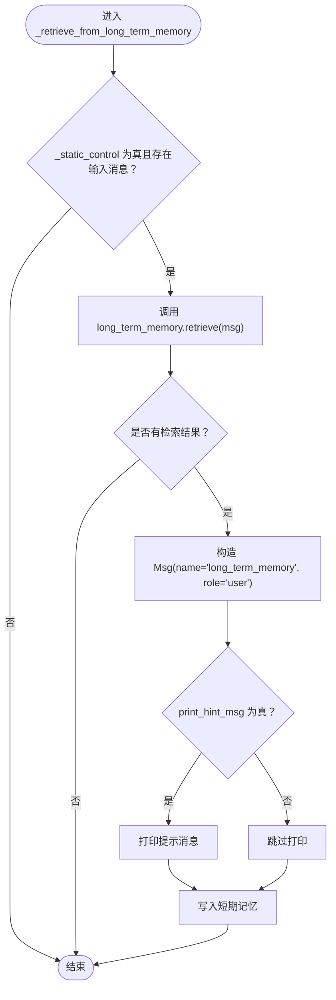
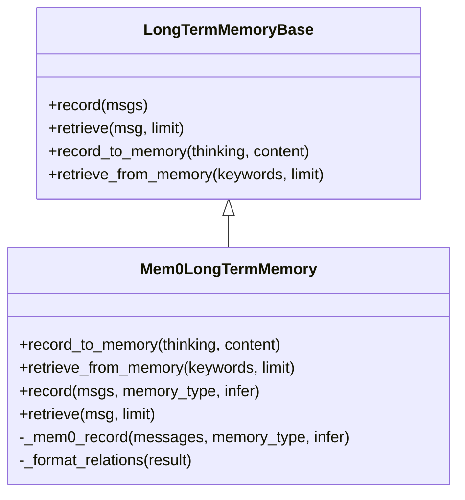
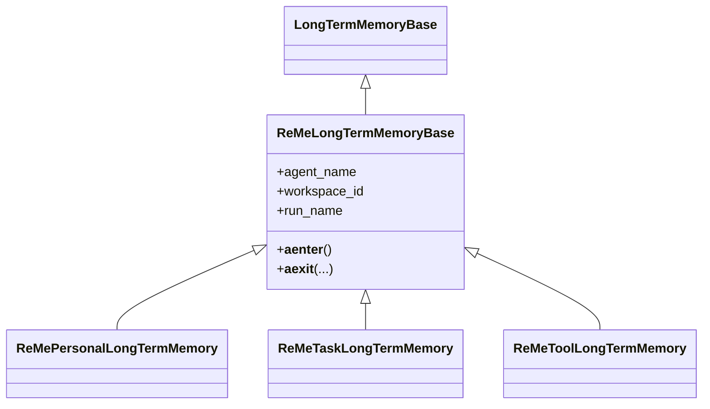
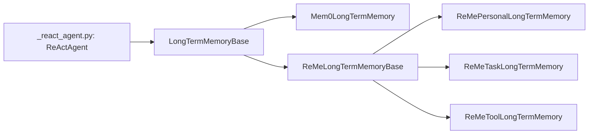

# 长期记忆集成

<cite>
**本文引用的文件**
- [src/agentscope/agent/_react_agent.py](file://src/agentscope/agent/_react_agent.py)
- [src/agentscope/memory/_long_term_memory_base.py](file://src/agentscope/memory/_long_term_memory_base.py)
- [src/agentscope/memory/_mem0_long_term_memory.py](file://src/agentscope/memory/_mem0_long_term_memory.py)
- [src/agentscope/memory/_reme/_reme_long_term_memory_base.py](file://src/agentscope/memory/_reme/_reme_long_term_memory_base.py)
- [examples/functionality/long_term_memory/mem0/memory_example.py](file://examples/functionality/long_term_memory/mem0/memory_example.py)
- [examples/functionality/long_term_memory/reme/personal_memory_example.py](file://examples/functionality/long_term_memory/reme/personal_memory_example.py)
- [examples/functionality/long_term_memory/reme/task_memory_example.py](file://examples/functionality/long_term_memory/reme/task_memory_example.py)
- [examples/functionality/long_term_memory/reme/tool_memory_example.py](file://examples/functionality/long_term_memory/reme/tool_memory_example.py)
- [docs/tutorial/en/src/task_long_term_memory.py](file://docs/tutorial/en/src/task_long_term_memory.py)
</cite>

## 目录
1. [简介](#简介)
2. [项目结构](#项目结构)
3. [核心组件](#核心组件)
4. [架构总览](#架构总览)
5. [详细组件分析](#详细组件分析)
6. [依赖关系分析](#依赖关系分析)
7. [性能考量](#性能考量)
8. [故障排查指南](#故障排查指南)
9. [结论](#结论)
10. [附录](#附录)

## 简介
本文件面向希望在ReAct智能体中集成ReMe与Mem0长期记忆系统的开发者，系统性阐述以下主题：
- long_term_memory参数如何与ReAct智能体集成，以及在不同long_term_memory_mode下的行为差异
- _retrieve_from_long_term_memory方法在static_control模式下的自动检索与注入逻辑
- long_term_memory_mode三种模式（agent_control、static_control、both）的适用场景与选择建议
- 通过实际示例展示如何配置任务记忆、个人记忆与工具记忆，并演示从“检索→记录→注入系统提示”的完整工作流

## 项目结构
围绕ReAct智能体与长期记忆的集成，关键代码分布在如下模块：
- ReAct智能体：负责接收long_term_memory与long_term_memory_mode参数，按模式注册工具函数并在推理前/后进行检索与注入
- 长期记忆基类：定义record、retrieve、record_to_memory、retrieve_from_memory四个抽象接口
- Mem0实现：基于mem0库提供向量存储与检索能力，支持record_to_memory、retrieve_from_memory、record、retrieve
- ReMe实现：基于ReMe框架提供个人记忆、任务记忆、工具记忆三类实现，均继承自LongTermMemoryBase
- 示例与教程：涵盖Mem0与ReMe在ReAct中的端到端使用方式

图表来源
- [src/agentscope/agent/_react_agent.py](file://src/agentscope/agent/_react_agent.py#L52-L240)
- [src/agentscope/memory/_long_term_memory_base.py](file://src/agentscope/memory/_long_term_memory_base.py#L1-L95)
- [src/agentscope/memory/_mem0_long_term_memory.py](file://src/agentscope/memory/_mem0_long_term_memory.py#L73-L130)
- [src/agentscope/memory/_reme/_reme_long_term_memory_base.py](file://src/agentscope/memory/_reme/_reme_long_term_memory_base.py#L83-L110)
- [examples/functionality/long_term_memory/mem0/memory_example.py](file://examples/functionality/long_term_memory/mem0/memory_example.py#L1-L186)
- [examples/functionality/long_term_memory/reme/personal_memory_example.py](file://examples/functionality/long_term_memory/reme/personal_memory_example.py#L1-L296)
- [examples/functionality/long_term_memory/reme/task_memory_example.py](file://examples/functionality/long_term_memory/reme/task_memory_example.py#L1-L343)
- [examples/functionality/long_term_memory/reme/tool_memory_example.py](file://examples/functionality/long_term_memory/reme/tool_memory_example.py#L1-L437)
- [docs/tutorial/en/src/task_long_term_memory.py](file://docs/tutorial/en/src/task_long_term_memory.py#L290-L436)

章节来源
- [src/agentscope/agent/_react_agent.py](file://src/agentscope/agent/_react_agent.py#L52-L240)
- [src/agentscope/memory/_long_term_memory_base.py](file://src/agentscope/memory/_long_term_memory_base.py#L1-L95)
- [src/agentscope/memory/_mem0_long_term_memory.py](file://src/agentscope/memory/_mem0_long_term_memory.py#L73-L130)
- [src/agentscope/memory/_reme/_reme_long_term_memory_base.py](file://src/agentscope/memory/_reme/_reme_long_term_memory_base.py#L83-L110)

## 核心组件
- ReActAgent构造参数
  - long_term_memory：可选的长期记忆实例，若提供则在推理前后根据模式进行检索与注入
  - long_term_memory_mode：控制长期记忆的管理模式，取值为"agent_control"、"static_control"或"both"
- 长期记忆接口
  - record：开发者直接记录消息到长期记忆
  - retrieve：开发者基于消息检索长期记忆内容
  - record_to_memory：工具函数，用于显式记录重要信息
  - retrieve_from_memory：工具函数，用于关键词检索
- Mem0实现要点
  - record_to_memory采用三层回退策略，确保即使推理失败也能保留内容
  - retrieve_from_memory支持多关键词并发检索，聚合结果
  - record/retrieve支持消息列表与JSON序列化查询
- ReMe实现要点
  - 提供个人记忆、任务记忆、工具记忆三类子类，均继承自ReMeLongTermMemoryBase
  - 支持异步上下文管理器，便于初始化与清理
  - 通过模型与嵌入模型配置，对接ReMe应用

章节来源
- [src/agentscope/agent/_react_agent.py](file://src/agentscope/agent/_react_agent.py#L52-L133)
- [src/agentscope/memory/_long_term_memory_base.py](file://src/agentscope/memory/_long_term_memory_base.py#L1-L95)
- [src/agentscope/memory/_mem0_long_term_memory.py](file://src/agentscope/memory/_mem0_long_term_memory.py#L258-L450)
- [src/agentscope/memory/_reme/_reme_long_term_memory_base.py](file://src/agentscope/memory/_reme/_reme_long_term_memory_base.py#L190-L371)

## 架构总览
ReAct智能体在每次推理前/后，依据long_term_memory_mode决定是否调用长期记忆检索与注入逻辑；同时，当启用agent_control或both时，会将record_to_memory与retrieve_from_memory注册为工具函数，允许智能体自主管理长期记忆。

图表来源
- [src/agentscope/agent/_react_agent.py](file://src/agentscope/agent/_react_agent.py#L52-L133)
- [src/agentscope/agent/_react_agent.py](file://src/agentscope/agent/_react_agent.py#L740-L766)
- [src/agentscope/memory/_mem0_long_term_memory.py](file://src/agentscope/memory/_mem0_long_term_memory.py#L258-L450)
- [src/agentscope/memory/_reme/_reme_long_term_memory_base.py](file://src/agentscope/memory/_reme/_reme_long_term_memory_base.py#L190-L371)

## 详细组件分析

### ReActAgent与长期记忆模式
- long_term_memory_mode取值与行为
  - agent_control：仅注册工具函数，不自动检索；由智能体在推理过程中主动调用工具
  - static_control：在推理开始前自动检索并注入系统提示；推理结束后可追加记录（取决于实现）
  - both：兼具上述两种能力，既注册工具函数，又在推理开始前自动检索
- 控制位
  - _agent_control与_static_control分别对应agent_control与static_control/both
  - 构造时断言mode必须在合法集合内

章节来源
- [src/agentscope/agent/_react_agent.py](file://src/agentscope/agent/_react_agent.py#L52-L133)
- [src/agentscope/agent/_react_agent.py](file://src/agentscope/agent/_react_agent.py#L136-L166)

### _retrieve_from_long_term_memory方法（static_control模式）
- 触发条件：_static_control为真且存在输入消息
- 执行流程
  - 调用long_term_memory.retrieve(msg)，得到检索结果字符串
  - 若有结果，则构造一条来自"long_term_memory"的消息，role设为"user"，内容包裹在<long_term_memory>标签中
  - 可选打印提示消息，随后将该消息写入短期记忆
- 注入效果：将检索到的外部知识以系统提示的形式注入到当前推理上下文中，提升回答质量与一致性

图表来源
- [src/agentscope/agent/_react_agent.py](file://src/agentscope/agent/_react_agent.py#L740-L766)

章节来源
- [src/agentscope/agent/_react_agent.py](file://src/agentscope/agent/_react_agent.py#L740-L766)

### Mem0长期记忆实现
- 记录策略（record_to_memory）
  - 优先以"用户"角色消息记录
  - 若无结果，尝试以"助手"角色消息记录（可触发特定提取提示）
  - 最后兜底以"助手"角色消息且禁用推理，直接持久化
- 检索策略（retrieve_from_memory）
  - 对每个关键词并发发起检索，聚合结果与关系三元组
- 开发者记录/检索（record/retrieve）
  - 接受消息列表，序列化为JSON字符串作为查询键
  - 并发检索，合并结果与关系

图表来源
- [src/agentscope/memory/_long_term_memory_base.py](file://src/agentscope/memory/_long_term_memory_base.py#L1-L95)
- [src/agentscope/memory/_mem0_long_term_memory.py](file://src/agentscope/memory/_mem0_long_term_memory.py#L258-L450)

章节来源
- [src/agentscope/memory/_mem0_long_term_memory.py](file://src/agentscope/memory/_mem0_long_term_memory.py#L258-L450)
- [src/agentscope/memory/_mem0_long_term_memory.py](file://src/agentscope/memory/_mem0_long_term_memory.py#L560-L624)

### ReMe长期记忆实现
- ReMeLongTermMemoryBase
  - 统一处理模型与嵌入模型配置，抽取API密钥与端点
  - 支持DashScope/OpenAI模型，动态构建ReMeApp配置
  - 异步上下文管理器，确保资源正确启动与清理
- 三类子类
  - ReMePersonalLongTermMemory：个人偏好与个人信息
  - ReMeTaskLongTermMemory：任务执行经验与轨迹
  - ReMeToolLongTermMemory：工具使用模式与最佳实践

图表来源
- [src/agentscope/memory/_reme/_reme_long_term_memory_base.py](file://src/agentscope/memory/_reme/_reme_long_term_memory_base.py#L83-L110)
- [src/agentscope/memory/_reme/_reme_long_term_memory_base.py](file://src/agentscope/memory/_reme/_reme_long_term_memory_base.py#L190-L371)

章节来源
- [src/agentscope/memory/_reme/_reme_long_term_memory_base.py](file://src/agentscope/memory/_reme/_reme_long_term_memory_base.py#L190-L371)

### ReAct与长期记忆的集成示例
- Mem0示例
  - 展示开发者直接record/retrieve与ReActAgent结合使用
  - ReActAgent通过long_term_memory_mode="both"启用工具函数
- ReMe示例
  - 个人记忆：记录旅行偏好、检索偏好问答
  - 任务记忆：记录调试经验、检索技术方案
  - 工具记忆：记录工具调用历史，检索使用指南并注入系统提示

章节来源
- [examples/functionality/long_term_memory/mem0/memory_example.py](file://examples/functionality/long_term_memory/mem0/memory_example.py#L1-L186)
- [examples/functionality/long_term_memory/reme/personal_memory_example.py](file://examples/functionality/long_term_memory/reme/personal_memory_example.py#L1-L296)
- [examples/functionality/long_term_memory/reme/task_memory_example.py](file://examples/functionality/long_term_memory/reme/task_memory_example.py#L1-L343)
- [examples/functionality/long_term_memory/reme/tool_memory_example.py](file://examples/functionality/long_term_memory/reme/tool_memory_example.py#L1-L437)
- [docs/tutorial/en/src/task_long_term_memory.py](file://docs/tutorial/en/src/task_long_term_memory.py#L290-L436)

## 依赖关系分析
- ReActAgent对长期记忆的依赖
  - 构造阶段：根据long_term_memory_mode决定是否注册工具函数
  - 推理阶段：static_control模式下自动检索并注入
- 长期记忆实现对底层库的依赖
  - Mem0：依赖mem0库与向量存储（如Qdrant），支持并发检索与关系三元组
  - ReMe：依赖reme_ai库，需安装并正确配置模型与嵌入参数

图表来源
- [src/agentscope/agent/_react_agent.py](file://src/agentscope/agent/_react_agent.py#L52-L133)
- [src/agentscope/memory/_long_term_memory_base.py](file://src/agentscope/memory/_long_term_memory_base.py#L1-L95)
- [src/agentscope/memory/_mem0_long_term_memory.py](file://src/agentscope/memory/_mem0_long_term_memory.py#L73-L130)
- [src/agentscope/memory/_reme/_reme_long_term_memory_base.py](file://src/agentscope/memory/_reme/_reme_long_term_memory_base.py#L83-L110)

章节来源
- [src/agentscope/agent/_react_agent.py](file://src/agentscope/agent/_react_agent.py#L52-L133)
- [src/agentscope/memory/_mem0_long_term_memory.py](file://src/agentscope/memory/_mem0_long_term_memory.py#L73-L130)
- [src/agentscope/memory/_reme/_reme_long_term_memory_base.py](file://src/agentscope/memory/_reme/_reme_long_term_memory_base.py#L83-L110)

## 性能考量
- 并发检索
  - Mem0在retrieve_from_memory中对多个关键词并发搜索，使用gather聚合结果，减少整体等待时间
- 记录策略的回退
  - record_to_memory采用三层回退策略，避免因推理失败导致记录丢失，提高可靠性
- 检索注入
  - static_control模式在推理前注入检索结果，有助于减少重复检索与提升一致性，但需注意消息长度与token开销

章节来源
- [src/agentscope/memory/_mem0_long_term_memory.py](file://src/agentscope/memory/_mem0_long_term_memory.py#L385-L450)
- [src/agentscope/memory/_mem0_long_term_memory.py](file://src/agentscope/memory/_mem0_long_term_memory.py#L258-L374)
- [src/agentscope/agent/_react_agent.py](file://src/agentscope/agent/_react_agent.py#L740-L766)

## 故障排查指南
- 安装依赖
  - Mem0：缺少mem0ai库时会抛出导入异常，需按提示安装
  - ReMe：缺少reme_ai库时会抛出导入异常，需按提示安装
- 参数校验
  - Mem0：未提供mem0_config时，需同时提供model与embedding_model
  - ReMe：需提供DashScopeChatModel/OpenAIChatModel与DashScopeTextEmbedding/OpenAITextEmbedding之一
- 模式选择
  - agent_control：需要在系统提示中明确指导智能体何时调用工具函数
  - static_control：无需工具调用，但需确保检索结果能有效注入系统提示
  - both：兼顾工具调用与自动检索，适合复杂对话与持续学习场景

章节来源
- [src/agentscope/memory/_mem0_long_term_memory.py](file://src/agentscope/memory/_mem0_long_term_memory.py#L140-L256)
- [src/agentscope/memory/_reme/_reme_long_term_memory_base.py](file://src/agentscope/memory/_reme/_reme_long_term_memory_base.py#L264-L288)
- [docs/tutorial/en/src/task_long_term_memory.py](file://docs/tutorial/en/src/task_long_term_memory.py#L290-L436)

## 结论
- long_term_memory参数为ReAct智能体提供了灵活的长期记忆接入点
- long_term_memory_mode决定了检索与工具调用的时机与范围
- Mem0与ReMe分别提供向量检索与ReMe框架的记忆能力，适配不同业务场景
- 建议在复杂任务与个性化交互中采用both模式，并配合清晰的系统提示与工具调用规范

## 附录

### 配置与使用建议
- 个人记忆（ReMePersonalLongTermMemory）
  - 场景：用户偏好、习惯、历史对话
  - 建议：在agent_control模式下，通过系统提示明确“先检索再回答”的流程
- 任务记忆（ReMeTaskLongTermMemory）
  - 场景：技术问题解决经验、项目执行轨迹
  - 建议：记录时包含关键步骤与教训，便于后续检索与复用
- 工具记忆（ReMeToolLongTermMemory）
  - 场景：工具调用历史、参数选择与成本评估
  - 建议：检索使用指南并注入系统提示，提升工具调用成功率

章节来源
- [examples/functionality/long_term_memory/reme/personal_memory_example.py](file://examples/functionality/long_term_memory/reme/personal_memory_example.py#L1-L296)
- [examples/functionality/long_term_memory/reme/task_memory_example.py](file://examples/functionality/long_term_memory/reme/task_memory_example.py#L1-L343)
- [examples/functionality/long_term_memory/reme/tool_memory_example.py](file://examples/functionality/long_term_memory/reme/tool_memory_example.py#L1-L437)
- [docs/tutorial/en/src/task_long_term_memory.py](file://docs/tutorial/en/src/task_long_term_memory.py#L290-L436)