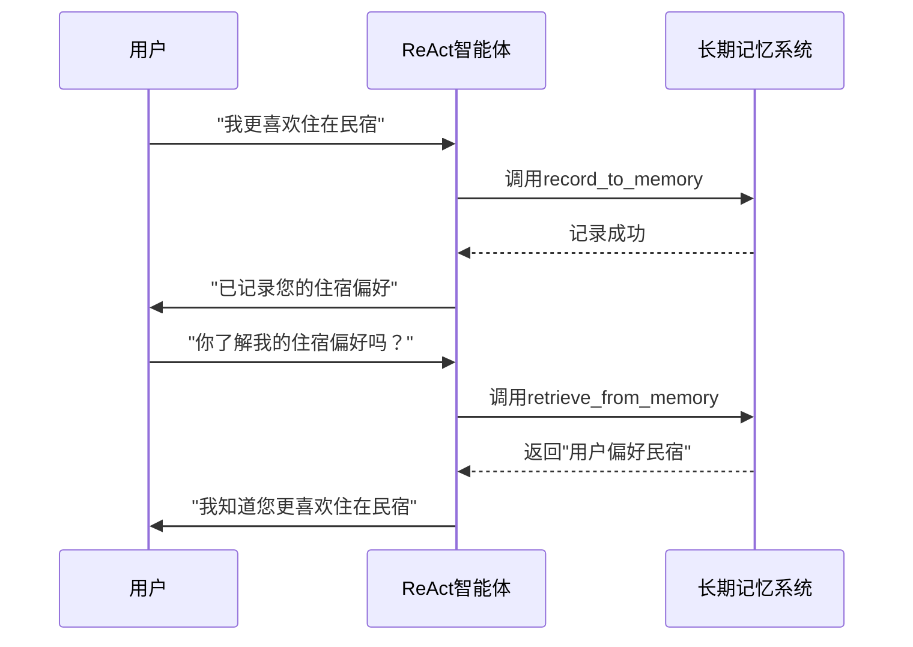
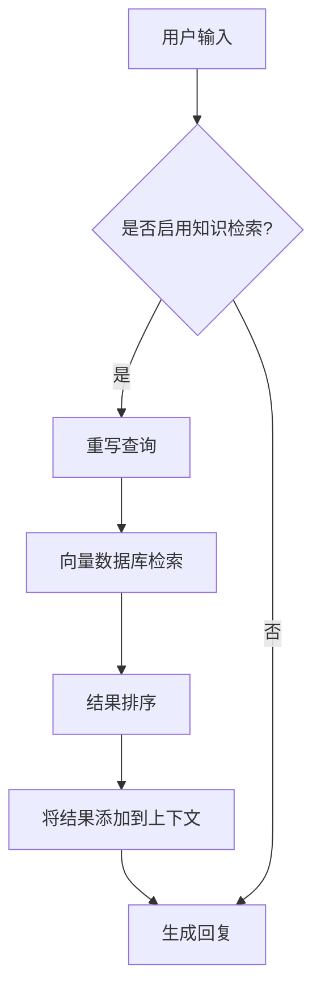
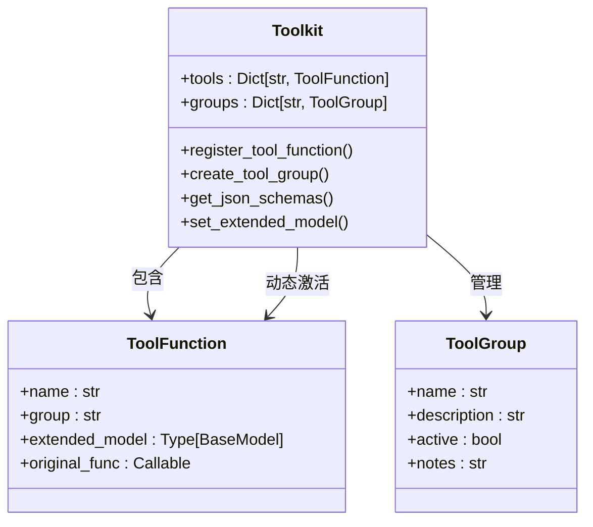
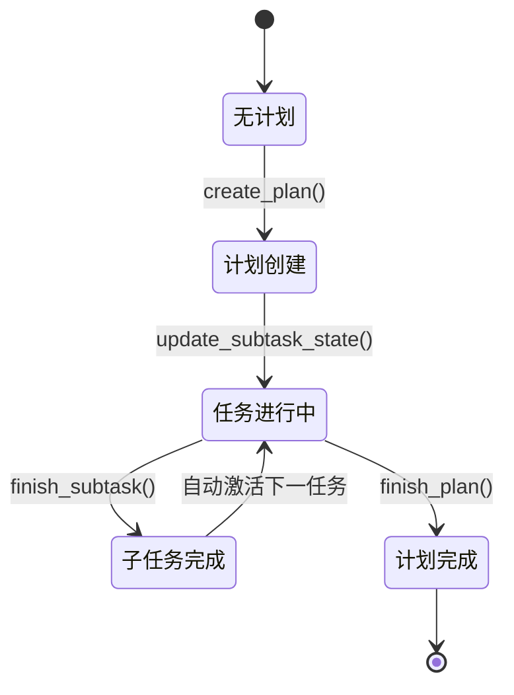
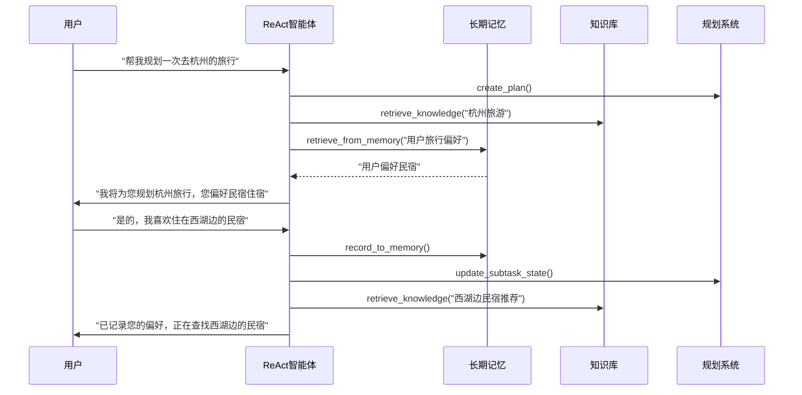

# 高级功能集成

<cite>
**本文档中引用的文件**   
- [\_react\_agent.py](file://src/agentscope/agent/_react_agent.py)
- [\_plan\_notebook.py](file://src/agentscope/plan/_plan_notebook.py)
- [\_knowledge\_base.py](file://src/agentscope/rag/_knowledge_base.py)
- [\_reme\_personal\_long\_term\_memory.py](file://src/agentscope/memory/_reme/_reme_personal_long_term_memory.py)
- [\_toolkit.py](file://src/agentscope/tool/_toolkit.py)
- [react\_agent\_integration.py](file://examples/functionality/rag/react_agent_integration.py)
- [main\_agent\_managed\_plan.py](file://examples/functionality/plan/main_agent_managed_plan.py)
</cite>

## 目录
1. [引言](#引言)
2. [长期记忆与RAG知识检索](#长期记忆与rag知识检索)
3. [动态工具管理](#动态工具管理)
4. [复杂任务规划系统](#复杂任务规划系统)
5. [高级功能协同工作示例](#高级功能协同工作示例)
6. [结论](#结论)

## 引言
本文档深入探讨了ReAct智能体的高级功能集成，重点介绍长期记忆、RAG知识检索、动态工具管理和复杂任务规划系统的实现机制。通过分析核心代码和实际示例，展示如何将这些功能协同工作，构建智能的多轮对话应用。

## 长期记忆与RAG知识检索

### 长期记忆实现机制
ReAct智能体通过`long_term_memory`和`long_term_memory_mode`参数实现长期记忆功能。当`long_term_memory_mode`设置为`agent_control`或`both`时，系统会自动注册`record_to_memory`和`retrieve_from_memory`工具函数，使智能体能够自主管理长期记忆。



**Diagram sources**
- [\_react\_agent.py](file://src/agentscope/agent/_react_agent.py#L741-L766)
- [\_reme\_personal\_long\_term\_memory.py](file://src/agentscope/memory/_reme/_reme_personal_long_term_memory.py#L155-L251)

### RAG知识检索实现
ReAct智能体通过`knowledge`参数集成RAG知识检索功能。系统在每次回复前自动检索相关文档，并将结果添加到对话上下文中。



**Diagram sources**
- [\_react\_agent.py](file://src/agentscope/agent/_react_agent.py#L767-L867)
- [\_knowledge\_base.py](file://src/agentscope/rag/_knowledge_base.py#L77-L131)

### 查询重写与结果排序
系统通过`_QueryRewriteModel`实现查询重写机制，将模糊查询转换为具体、简洁的检索查询。检索结果按相关性分数进行排序，确保最相关的信息优先呈现。

```python
# 查询重写示例
# 原始查询: "昨天发生了什么?"
# 重写后: "2023-10-01发生了什么?" (假设今天是2023-10-02)
```

**Section sources**
- [\_react\_agent.py](file://src/agentscope/agent/_react_agent.py#L30-L38)
- [\_react\_agent.py](file://src/agentscope/agent/_react_agent.py#L795-L824)

## 动态工具管理

### enable_meta_tool参数
`enable_meta_tool`参数用于启用动态工具管理功能。当设置为`True`时，系统会注册`reset_equipped_tools`元工具，允许智能体动态管理其工具集。



**Diagram sources**
- [\_toolkit.py](file://src/agentscope/tool/_toolkit.py#L504-L527)
- [\_toolkit.py](file://src/agentscope/tool/_toolkit.py#L529-L556)

### 工具组管理
系统支持创建工具组，通过`create_tool_group`方法将相关工具组织在一起。智能体可以通过元工具动态激活或停用整个工具组，实现精细化的工具管理。

```python
# 工具组管理示例
toolkit.create_tool_group(
    "browser_use",
    "浏览器相关工具",
    notes="""1. 必须先点击xxx
2. 然后执行yyy"""
)
```

**Section sources**
- [\_toolkit.py](file://src/agentscope/tool/_toolkit.py#L504-L527)
- [toolkit_meta_tool_test.py](file://tests/toolkit_meta_tool_test.py#L90-L203)

## 复杂任务规划系统

### plan_notebook功能
`plan_notebook`参数用于支持复杂任务的分解和执行。通过`PlanNotebook`类，智能体可以创建、管理和执行复杂的任务计划。



**Diagram sources**
- [\_plan\_notebook.py](file://src/agentscope/plan/_plan_notebook.py#L232-L732)

### 规划工具集
系统提供了一套完整的规划工具，包括创建计划、修订计划、更新子任务状态、完成子任务等，支持智能体对复杂任务进行全面管理。

```python
# 规划系统工具
- create_plan: 创建新计划
- revise_current_plan: 修订当前计划
- update_subtask_state: 更新子任务状态
- finish_subtask: 完成子任务
- finish_plan: 完成整个计划
```

**Section sources**
- [\_plan\_notebook.py](file://src/agentscope/plan/_plan_notebook.py#L232-L732)
- [main_agent_managed_plan.py](file://examples/functionality/plan/main_agent_managed_plan.py#L30-L48)

## 高级功能协同工作示例

### 智能对话应用集成
以下示例展示了如何将长期记忆、RAG知识检索和规划系统协同工作，构建智能的多轮对话应用。



**Diagram sources**
- [react_agent_integration.py](file://examples/functionality/rag/react_agent_integration.py#L14-L78)
- [main_agent_managed_plan.py](file://examples/functionality/plan/main_agent_managed_plan.py#L21-L65)

### 实际应用配置
```python
# 综合配置示例
agent = ReActAgent(
    name="Friday",
    sys_prompt="您是一个智能助手",
    model=DashScopeChatModel(...),
    formatter=DashScopeChatFormatter(),
    long_term_memory=personal_memory,
    long_term_memory_mode="both",
    knowledge=knowledge,
    enable_rewrite_query=True,
    plan_notebook=PlanNotebook(),
    enable_meta_tool=True,
    print_hint_msg=True
)
```

**Section sources**
- [react_agent_integration.py](file://examples/functionality/rag/react_agent_integration.py#L54-L64)
- [main_agent_managed_plan.py](file://examples/functionality/plan/main_agent_managed_plan.py#L30-L48)

## 结论
ReAct智能体的高级功能集成为构建智能对话系统提供了强大的支持。通过长期记忆、RAG知识检索、动态工具管理和复杂任务规划系统的协同工作，智能体能够实现更自然、更智能的多轮对话体验。这些功能的灵活配置和组合使用，使得开发者能够根据具体应用场景构建高度定制化的智能应用。