# 智能体系统

<cite>
**本文档引用的文件**   
- [agent_base.py](file://src/agentscope/agent/_agent_base.py)
- [react_agent.py](file://src/agentscope/agent/_react_agent.py)
- [user_agent.py](file://src/agentscope/agent/_user_agent.py)
- [a2a_agent.py](file://src/agentscope/agent/_a2a_agent.py)
- [react_agent_base.py](file://src/agentscope/agent/_react_agent_base.py)
- [agent_meta.py](file://src/agentscope/agent/_agent_meta.py)
- [main.py](file://examples/agent/react_agent/main.py)
- [main.py](file://examples/agent/a2a_agent/main.py)
- [setup_a2a_server.py](file://examples/agent/a2a_agent/setup_a2a_server.py)
- [deep_research_agent.py](file://examples/agent/deep_research_agent/main.py)
- [state_module.py](file://src/agentscope/module/_state_module.py)
</cite>

## 目录
1. [引言](#引言)
2. [智能体基类设计](#智能体基类设计)
3. [ReAct智能体](#react智能体)
4. [用户智能体](#用户智能体)
5. [A2A智能体](#a2a智能体)
6. [智能体生命周期与执行流程](#智能体生命周期与执行流程)
7. [智能体通信与协作机制](#智能体通信与协作机制)
8. [自定义智能体创建指南](#自定义智能体创建指南)
9. [实时干预与调试功能](#实时干预与调试功能)
10. [性能优化与常见陷阱](#性能优化与常见陷阱)

## 引言

智能体系统是AgentScope框架的核心组件，提供了一套完整的智能体设计与实现方案。该系统支持多种类型的智能体，包括ReAct智能体、用户智能体和A2A智能体，每种智能体都有其特定的应用场景和功能特性。智能体基类（AgentBase）定义了所有智能体的通用接口和扩展机制，为智能体的开发提供了统一的框架。本文档将全面介绍智能体系统的设计与实现，包括智能体的生命周期管理、状态维护、执行流程、通信模式和协作机制，并提供创建自定义智能体的完整指南。

## 智能体基类设计

智能体基类（AgentBase）是所有智能体的共同基础，定义了智能体的核心接口和通用功能。该基类通过继承StateModule类，实现了状态的序列化和反序列化功能，支持嵌套状态的管理。AgentBase类提供了三个核心方法：observe、reply和print，分别用于接收消息、生成回复和显示消息。

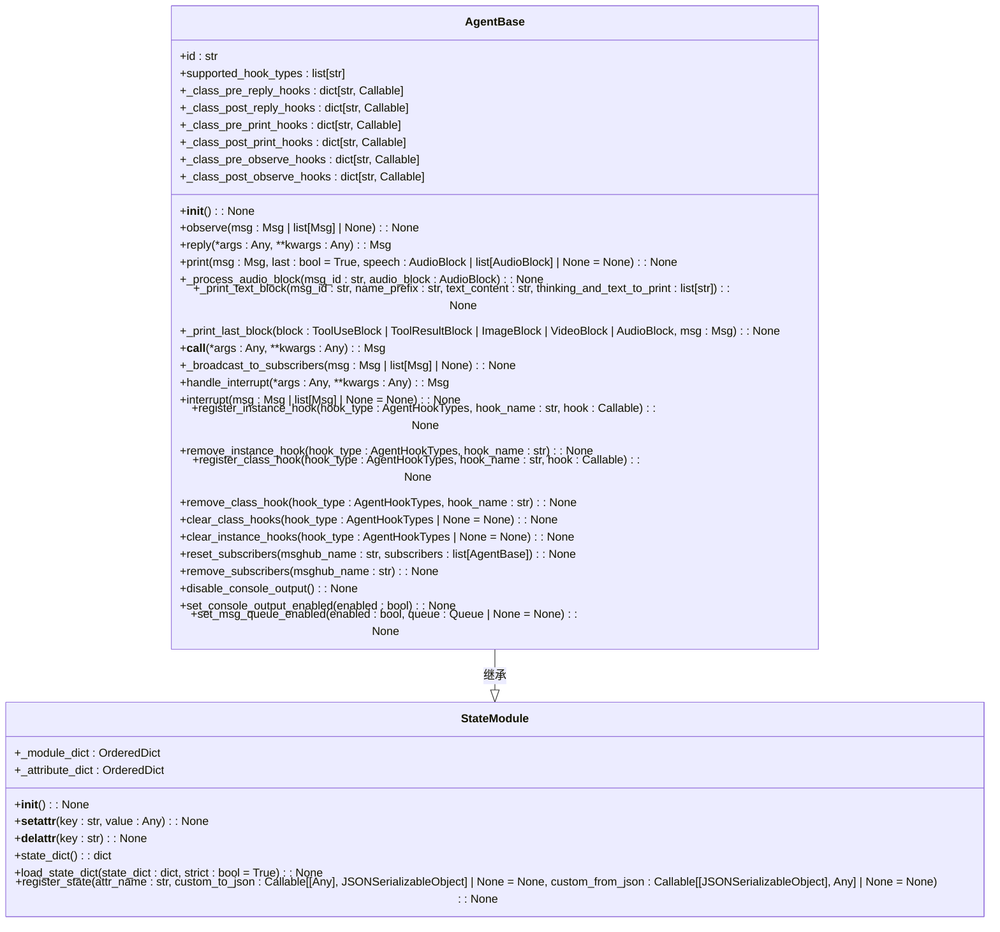

**图源**
- [agent_base.py](file://src/agentscope/agent/_agent_base.py#L30-L733)
- [state_module.py](file://src/agentscope/module/_state_module.py#L20-L152)

**智能体基类的核心特性包括：**

1. **唯一标识**：每个智能体实例都有一个唯一的ID，使用shortuuid生成。
2. **钩子系统**：支持多种类型的钩子（pre_reply、post_reply、pre_print、post_print、pre_observe、post_observe），允许在方法执行前后插入自定义逻辑。
3. **实例级和类级钩子**：支持实例级和类级的钩子注册，实例级钩子只影响当前实例，类级钩子影响所有实例。
4. **消息广播**：支持将回复消息广播给订阅者，实现智能体间的通信。
5. **控制台输出控制**：可以通过环境变量或方法调用控制智能体的控制台输出。
6. **消息队列**：支持消息队列，用于流式输出。

**智能体基类的扩展机制通过元类（_AgentMeta）实现，该元类在类创建时自动包装reply、print和observe方法，添加钩子调用逻辑。**

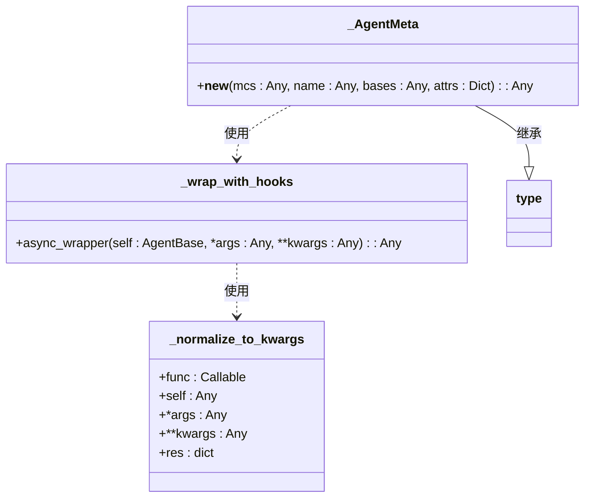

**图源**
- [agent_meta.py](file://src/agentscope/agent/_agent_meta.py#L147-L163)

**智能体基类的钩子系统工作流程如下：**

1. 在方法调用前，将所有参数规范化为关键字参数字典。
2. 按顺序执行实例级和类级的前置钩子，每个钩子可以修改参数字典。
3. 使用修改后的参数调用原始方法。
4. 按顺序执行实例级和类级的后置钩子，每个钩子可以修改输出结果。

**智能体基类的生命周期管理包括：**

- **初始化**：在__init__方法中初始化智能体的ID、任务状态、钩子字典等。
- **消息观察**：通过observe方法接收消息，但不生成回复。
- **回复生成**：通过reply方法生成回复，这是智能体的主要逻辑。
- **消息显示**：通过print方法显示消息，支持文本和音频内容。
- **中断处理**：通过handle_interrupt方法处理中断，提供优雅的中断响应。
- **资源清理**：在finally块中清理资源，确保智能体状态的一致性。

**智能体基类的通信机制通过_subscribers字典实现，支持多对多的通信模式。**

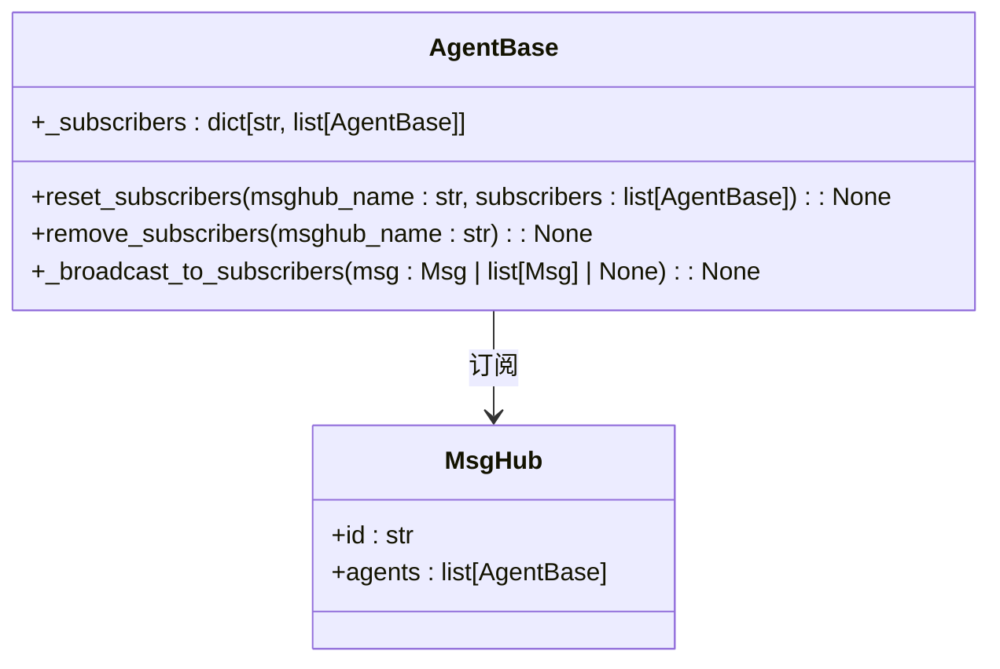

**图源**
- [agent_base.py](file://src/agentscope/agent/_agent_base.py#L168-L169)

**智能体基类的状态管理通过StateModule实现，支持嵌套状态的序列化和反序列化。**

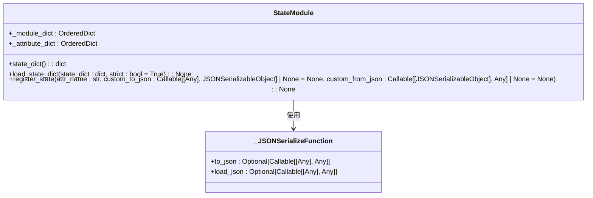

**图源**
- [state_module.py](file://src/agentscope/module/_state_module.py#L20-L152)

**智能体基类的音频处理功能通过_process_audio_block方法实现，支持URL和Base64两种音频源。**

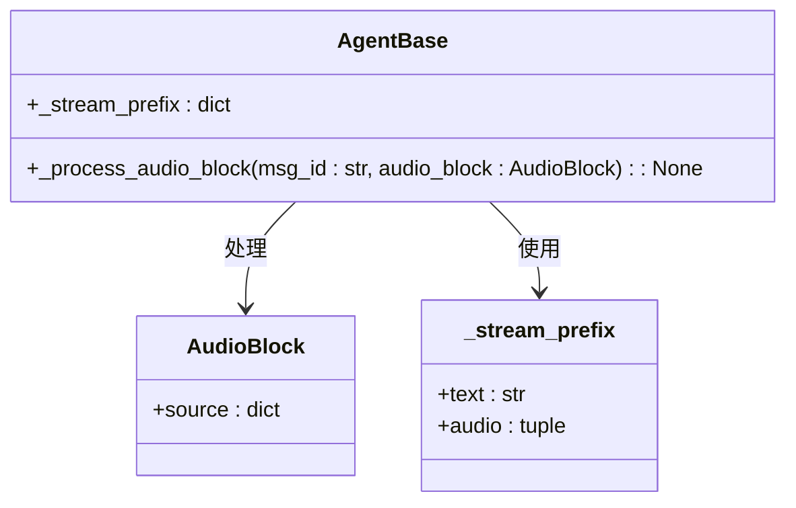

**图源**
- [agent_base.py](file://src/agentscope/agent/_agent_base.py#L272-L363)

**智能体基类的文本处理功能通过_print_text_block和_print_last_block方法实现，支持流式输出。**

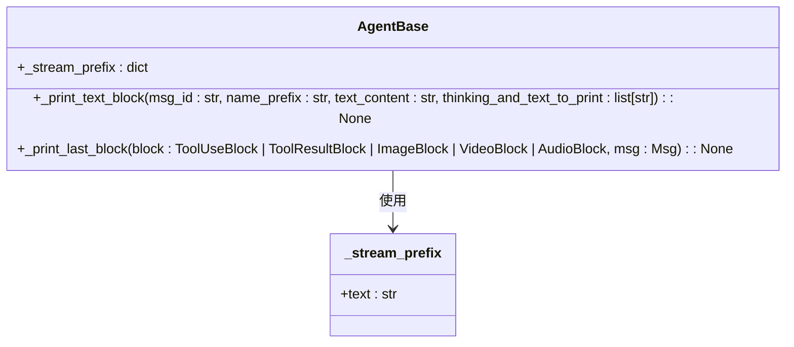

**图源**
- [agent_base.py](file://src/agentscope/agent/_agent_base.py#L365-L443)

**智能体基类的钩子注册和管理方法包括：**

- **register_instance_hook**：注册实例级钩子
- **remove_instance_hook**：移除实例级钩子
- **register_class_hook**：注册类级钩子
- **remove_class_hook**：移除类级钩子
- **clear_class_hooks**：清除类级钩子
- **clear_instance_hooks**：清除实例级钩子

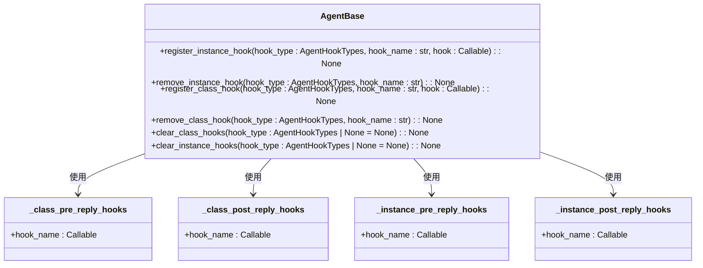

**图源**
- [agent_base.py](file://src/agentscope/agent/_agent_base.py#L491-L658)

**智能体基类的控制台输出控制方法包括：**

- **disable_console_output**：禁用控制台输出（已弃用）
- **set_console_output_enabled**：启用或禁用控制台输出
- **set_msg_queue_enabled**：启用或禁用消息队列

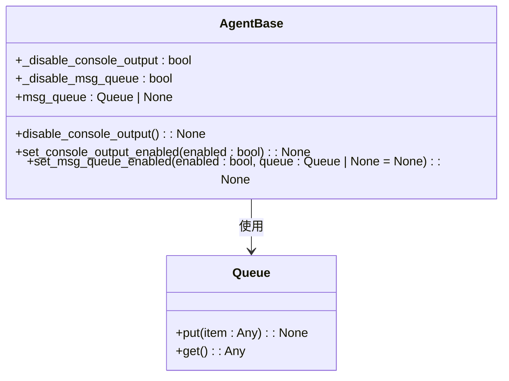

**图源**
- [agent_base.py](file://src/agentscope/agent/_agent_base.py#L172-L183)

**智能体基类的中断处理机制通过interrupt和handle_interrupt方法实现。**

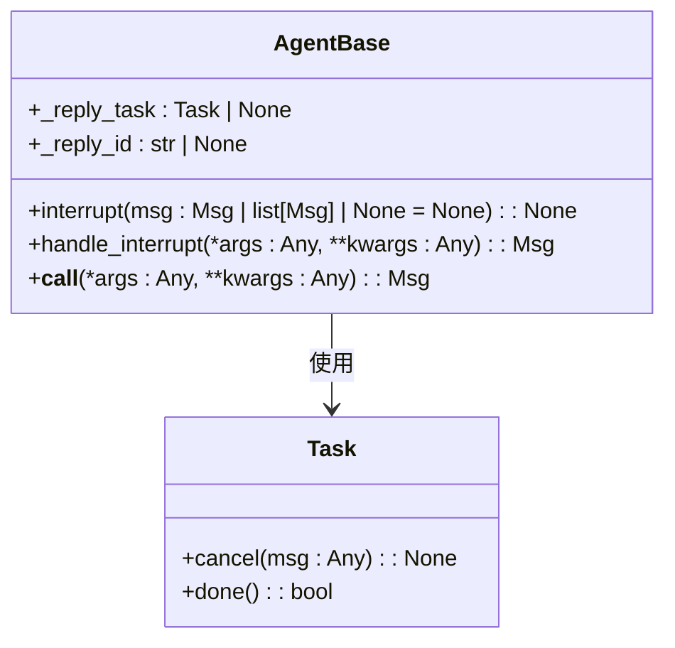

**图源**
- [agent_base.py](file://src/agentscope/agent/_agent_base.py#L147-L148)

**智能体基类的通信模式通过_msg_hub实现，支持多对多的通信。**


**图源**
- [agent_base.py](file://src/agentscope/agent/_agent_base.py#L168-L169)

**智能体基类的扩展机制通过元类_AgentMeta实现，该元类在类创建时自动包装reply、print和observe方法。**


**图源**
- [agent_meta.py](file://src/agentscope/agent/_agent_meta.py#L147-L163)

**智能体基类的钩子系统工作流程如下：**

1. 在方法调用前，将所有参数规范化为关键字参数字典。
2. 按顺序执行实例级和类级的前置钩子，每个钩子可以修改参数字典。
3. 使用修改后的参数调用原始方法。
4. 按顺序执行实例级和类级的后置钩子，每个钩子可以修改输出结果。

**智能体基类的生命周期管理包括：**

- **初始化**：在__init__方法中初始化智能体的ID、任务状态、钩子字典等。
- **消息观察**：通过observe方法接收消息，但不生成回复。
- **回复生成**：通过reply方法生成回复，这是智能体的主要逻辑。
- **消息显示**：通过print方法显示消息，支持文本和音频内容。
- **中断处理**：通过handle_interrupt方法处理中断，提供优雅的中断响应。
- **资源清理**：在finally块中清理资源，确保智能体状态的一致性。

**智能体基类的通信机制通过_subscribers字典实现，支持多对多的通信模式。**


**图源**
- [agent_base.py](file://src/agentscope/agent/_agent_base.py#L168-L169)

**智能体基类的状态管理通过StateModule实现，支持嵌套状态的序列化和反序列化。**


**图源**
- [state_module.py](file://src/agentscope/module/_state_module.py#L20-L152)

**智能体基类的音频处理功能通过_process_audio_block方法实现，支持URL和Base64两种音频源。**


**图源**
- [agent_base.py](file://src/agentscope/agent/_agent_base.py#L272-L363)

**智能体基类的文本处理功能通过_print_text_block和_print_last_block方法实现，支持流式输出。**


**图源**
- [agent_base.py](file://src/agentscope/agent/_agent_base.py#L365-L443)

**智能体基类的钩子注册和管理方法包括：**

- **register_instance_hook**：注册实例级钩子
- **remove_instance_hook**：移除实例级钩子
- **register_class_hook**：注册类级钩子
- **remove_class_hook**：移除类级钩子
- **clear_class_hooks**：清除类级钩子
- **clear_instance_hooks**：清除实例级钩子


**图源**
- [agent_base.py](file://src/agentscope/agent/_agent_base.py#L491-L658)

**智能体基类的控制台输出控制方法包括：**

- **disable_console_output**：禁用控制台输出（已弃用）
- **set_console_output_enabled**：启用或禁用控制台输出
- **set_msg_queue_enabled**：启用或禁用消息队列


**图源**
- [agent_base.py](file://src/agentscope/agent/_agent_base.py#L172-L183)

**智能体基类的中断处理机制通过interrupt和handle_interrupt方法实现。**


**图源**
- [agent_base.py](file://src/agentscope/agent/_agent_base.py#L147-L148)

## ReAct智能体

ReAct智能体是基于ReAct（Reasoning and Acting）算法实现的智能体，支持实时引导、API工具调用、钩子函数和结构化输出生成。ReAct智能体通过继承ReActAgentBase类，实现了推理和行动的循环过程。

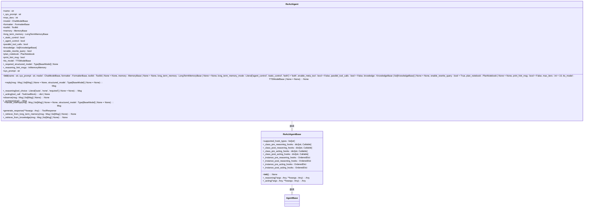

**图源**
- [react_agent.py](file://src/agentscope/agent/_react_agent.py#L40-L867)
- [react_agent_base.py](file://src/agentscope/agent/_react_agent_base.py#L12-L117)

**ReAct智能体的核心特性包括：**

1. **推理-行动循环**：通过_react方法实现推理和行动的循环过程，直到达到最大迭代次数或生成最终回复。
2. **工具调用**：通过toolkit支持工具调用，可以并行或顺序执行多个工具调用。
3. **长期记忆**：支持长期记忆，可以在推理前从长期记忆中检索相关信息。
4. **知识库**：支持知识库，可以在推理前从知识库中检索相关信息。
5. **计划笔记本**：支持计划笔记本，可以将复杂任务分解为一系列子任务。
6. **语音合成**：支持语音合成，可以将文本回复转换为语音。
7. **结构化输出**：支持结构化输出，可以生成符合指定模型的结构化数据。

**ReAct智能体的推理-行动循环流程如下：**

1. **推理阶段**：调用_llm生成推理结果，包括思考过程和工具调用。
2. **行动阶段**：执行工具调用，获取工具执行结果。
3. **检查退出条件**：检查是否满足退出条件，如生成最终回复或达到最大迭代次数。
4. **重复循环**：如果不满足退出条件，重复推理-行动循环。

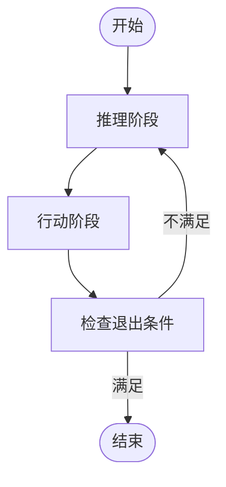

**图源**
- [react_agent.py](file://src/agentscope/agent/_react_agent.py#L253-L408)

**ReAct智能体的工具调用机制通过toolkit实现，支持并行和顺序执行。**

```mermaid
classDiagram
class ReActAgent {
+toolkit : Toolkit
+parallel_tool_calls : bool
+_acting(tool_call : ToolUseBlock) : dict | None
}
class Toolkit {
+tools : dict[str, Callable]
+register_tool_function(tool : Callable, group_name : str | None = None) : None
+call_tool_function(tool_call : ToolUseBlock) : AsyncGenerator
+get_json_schemas() : list[dict]
}
ReActAgent --> Toolkit : 使用
```

**图源**
- [react_agent.py](file://src/agentscope/agent/_react_agent.py#L171-L186)

**ReAct智能体的长期记忆机制通过long_term_memory实现，支持静态控制和代理控制两种模式。**

```mermaid
classDiagram
class ReActAgent {
+long_term_memory : LongTermMemoryBase
+_static_control : bool
+_agent_control : bool
+_retrieve_from_long_term_memory(msg : Msg | list[Msg] | None) : None
}
class LongTermMemoryBase {
+retrieve(msg : Msg | list[Msg] | None) : str
+record(messages : list[Msg]) : None
}
ReActAgent --> LongTermMemoryBase : 使用
```

**图源**
- [react_agent.py](file://src/agentscope/agent/_react_agent.py#L157-L167)

**ReAct智能体的知识库机制通过knowledge实现，支持查询重写。**

```mermaid
classDiagram
class ReActAgent {
+knowledge : list[KnowledgeBase]
+enable_rewrite_query : bool
+_retrieve_from_knowledge(msg : Msg | list[Msg] | None) : None
}
class KnowledgeBase {
+retrieve(query : str) : list[Document]
}
ReActAgent --> KnowledgeBase : 使用
```

**图源**
- [react_agent.py](file://src/agentscope/agent/_react_agent.py#L190-L193)

**ReAct智能体的计划笔记本机制通过plan_notebook实现，支持任务分解。**

```mermaid
classDiagram
class ReActAgent {
+plan_notebook : PlanNotebook
+print_hint_msg : bool
}
class PlanNotebook {
+get_current_hint() : Msg
+list_tools() : list[Callable]
}
ReActAgent --> PlanNotebook : 使用
```

**图源**
- [react_agent.py](file://src/agentscope/agent/_react_agent.py#L196-L222)

**ReAct智能体的语音合成机制通过tts_model实现，支持流式和非流式输出。**

```mermaid
classDiagram
class ReActAgent {
+tts_model : TTSModelBase
+_reasoning(tool_choice : Literal['auto', 'none', 'required'] | None = None) : Msg
+_summarizing() : Msg
}
class TTSModelBase {
+stream : bool
+supports_streaming_input : bool
+push(msg : Msg) : AsyncGenerator
+synthesize(msg : Msg) : AsyncGenerator
}
ReActAgent --> TTSModelBase : 使用
```

**图源**
- [react_agent.py](file://src/agentscope/agent/_react_agent.py#L149-L150)

**ReAct智能体的结构化输出机制通过generate_response方法实现，支持验证和错误处理。**

```mermaid
classDiagram
class ReActAgent {
+_required_structured_model : Type[BaseModel] | None
+generate_response(**kwargs : Any) : ToolResponse
}
class BaseModel {
+model_validate(kwargs : dict) : BaseModel
+model_dump() : dict
}
ReActAgent --> BaseModel : 使用
```

**图源**
- [react_agent.py](file://src/agentscope/agent/_react_agent.py#L688-L739)

**ReAct智能体的钩子系统通过元类_ReActAgentMeta实现，支持推理和行动阶段的钩子。**

```mermaid
classDiagram
class _ReActAgentMeta {
+__new__(mcs : Any, name : Any, bases : Any, attrs : Dict) : Any
}
class _wrap_with_hooks {
+async_wrapper(self : ReActAgentBase, *args : Any, **kwargs : Any) : Any
}
class _normalize_to_kwargs {
+func : Callable
+self : Any
+*args : Any
+**kwargs : Any
+res : dict
}
_ReActAgentMeta ..> _wrap_with_hooks : 使用
_wrap_with_hooks ..> _normalize_to_kwargs : 使用
_ReActAgentMeta --|> _AgentMeta : 继承
```

**图源**
- [agent_meta.py](file://src/agentscope/agent/_agent_meta.py#L165-L181)

**ReAct智能体的示例代码展示了如何创建和使用ReAct智能体。**

```mermaid
sequenceDiagram
participant User as "用户"
participant UserAgent as "用户智能体"
participant ReActAgent as "ReAct智能体"
User->>UserAgent : 输入消息
UserAgent->>ReActAgent : 调用reply方法
ReActAgent->>ReActAgent : _reasoning阶段
ReActAgent->>ReActAgent : _acting阶段
ReActAgent->>UserAgent : 返回回复消息
UserAgent->>User : 显示回复
```

**图源**
- [main.py](file://examples/agent/react_agent/main.py#L18-L50)

## 用户智能体

用户智能体（UserAgent）是专门用于处理用户输入的智能体，允许开发者从不同来源（如Web UI、CLI等）获取用户输入。用户智能体通过继承AgentBase类，实现了用户交互的核心功能。

```mermaid
classDiagram
class UserAgent {
+_input_method : UserInputBase
+name : str
+__init__(name : str) : None
+reply(msg : Msg | list[Msg] | None = None, structured_model : Type[BaseModel] | None = None) : Msg
+override_instance_input_method(input_method : UserInputBase) : None
+override_class_input_method(input_method : UserInputBase) : None
+handle_interrupt(*args : Any, **kwargs : Any) : Msg
+observe(msg : Msg | list[Msg] | None) : None
}
class UserInputBase {
+__call__(agent_id : str, agent_name : str, structured_model : Type[BaseModel] | None = None) : UserInputData
}
class TerminalUserInput {
+__call__(agent_id : str, agent_name : str, structured_model : Type[BaseModel] | None = None) : UserInputData
}
UserAgent --|> AgentBase : 继承
UserAgent --> UserInputBase : 使用
TerminalUserInput --|> UserInputBase : 继承
```

**图源**
- [user_agent.py](file://src/agentscope/agent/_user_agent.py#L12-L129)
- [user_input.py](file://src/agentscope/agent/_user_input.py)

**用户智能体的核心特性包括：**

1. **输入方法**：通过_input_method属性指定用户输入方法，支持实例级和类级的输入方法重写。
2. **用户输入数据**：通过UserInputData类封装用户输入数据，包括文本输入和结构化输入。
3. **终端输入**：通过TerminalUserInput类实现终端输入，支持命令行交互。
4. **Studio输入**：通过StudioUserInput类实现Studio输入，支持图形界面交互。

**用户智能体的输入方法机制通过_input_method属性实现，支持动态重写。**

```mermaid
classDiagram
class UserAgent {
+_input_method : UserInputBase
+override_instance_input_method(input_method : UserInputBase) : None
+override_class_input_method(input_method : UserInputBase) : None
}
class UserInputBase {
+__call__(agent_id : str, agent_name : str, structured_model : Type[BaseModel] | None = None) : UserInputData
}
UserAgent --> UserInputBase : 使用
```

**图源**
- [user_agent.py](file://src/agentscope/agent/_user_agent.py#L17-L113)

**用户智能体的用户输入数据通过UserInputData类封装，支持文本和结构化输入。**

```mermaid
classDiagram
class UserInputData {
+blocks_input : list[dict]
+structured_input : dict
}
class UserAgent {
+reply(msg : Msg | list[Msg] | None = None, structured_model : Type[BaseModel] | None = None) : Msg
}
UserAgent --> UserInputData : 使用
```

**图源**
- [user_input.py](file://src/agentscope/agent/_user_input.py)

**用户智能体的终端输入通过TerminalUserInput类实现，支持命令行交互。**

```mermaid
classDiagram
class TerminalUserInput {
+__call__(agent_id : str, agent_name : str, structured_model : Type[BaseModel] | None = None) : UserInputData
}
class UserInputBase {
+__call__(agent_id : str, agent_name : str, structured_model : Type[BaseModel] | None = None) : UserInputData
}
TerminalUserInput --|> UserInputBase : 继承
```

**图源**
- [user_input.py](file://src/agentscope/agent/_user_input.py)

**用户智能体的Studio输入通过StudioUserInput类实现，支持图形界面交互。**

```mermaid
classDiagram
class StudioUserInput {
+__call__(agent_id : str, agent_name : str, structured_model : Type[BaseModel] | None = None) : UserInputData
}
class UserInputBase {
+__call__(agent_id : str, agent_name : str, structured_model : Type[BaseModel] | None = None) : UserInputData
}
StudioUserInput --|> UserInputBase : 继承
```

**图源**
- [user_input.py](file://src/agentscope/agent/_user_input.py)

**用户智能体的示例代码展示了如何创建和使用用户智能体。**

```mermaid
sequenceDiagram
participant User as "用户"
participant UserAgent as "用户智能体"
User->>UserAgent : 输入消息
UserAgent->>User : 获取输入
User->>UserAgent : 返回输入
UserAgent->>User : 显示回复
```

**图源**
- [main.py](file://examples/agent/react_agent/main.py#L40-L48)

## A2A智能体

A2A智能体（A2AAgent）是基于A2A（Agent-to-Agent）协议实现的智能体，支持与远程智能体的通信。A2A智能体通过继承AgentBase类，实现了A2A协议的核心功能。

```mermaid
classDiagram
class A2AAgent {
+name : str
+agent_card : AgentCard
+_a2a_client_factory : ClientFactory
+_observed_msgs : list[Msg]
+formatter : A2AChatFormatter
+__init__(agent_card : AgentCard, client_config : ClientConfig | None = None, consumers : list[Consumer] | None = None, additional_transport_producers : dict[str, TransportProducer] | None = None) : None
+state_dict() : dict
+load_state_dict(state_dict : dict, strict : bool = True) : None
+observe(msg : Msg | list[Msg] | None) : None
+reply(msg : Msg | list[Msg] | None = None, **kwargs : Any) : Msg
+handle_interrupt(msg : Msg | list[Msg] | None = None, structured_model : Type[BaseModel] | None = None) : Msg
}
class AgentCard {
+name : str
+url : str
+capabilities : dict
}
class ClientFactory {
+create(card : AgentCard) : Client
}
class Client {
+send_message(message : A2AMessage) : AsyncGenerator
}
class A2AMessage {
+content : str
+role : str
}
class A2AChatFormatter {
+format(msgs : list[Msg]) : A2AMessage
+format_a2a_message(name : str, message : A2AMessage) : Msg
+format_a2a_task(name : str, task : Task) : list[Msg]
}
A2AAgent --|> AgentBase : 继承
A2AAgent --> AgentCard : 使用
A2AAgent --> ClientFactory : 使用
A2AAgent --> A2AChatFormatter : 使用
```

**图源**
- [a2a_agent.py](file://src/agentscope/agent/_a2a_agent.py#L29-L289)

**A2A智能体的核心特性包括：**

1. **代理卡**：通过agent_card属性指定远程智能体的信息，包括名称、URL和能力。
2. **客户端工厂**：通过_a2a_client_factory属性创建A2A客户端，支持多种传输协议。
3. **观察消息**：通过_observed_msgs属性存储观察到的消息，支持消息合并。
4. **格式化器**：通过formatter属性实现消息格式转换，支持AgentScope和A2A格式的相互转换。

**A2A智能体的代理卡机制通过agent_card属性实现，支持远程智能体的发现和连接。**

```mermaid
classDiagram
class A2AAgent {
+agent_card : AgentCard
}
class AgentCard {
+name : str
+url : str
+capabilities : dict
}
A2AAgent --> AgentCard : 使用
```

**图源**
- [a2a_agent.py](file://src/agentscope/agent/_a2a_agent.py#L86-L87)

**A2A智能体的客户端工厂机制通过_a2a_client_factory属性实现，支持多种传输协议。**

```mermaid
classDiagram
class A2AAgent {
+_a2a_client_factory : ClientFactory
}
class ClientFactory {
+config : ClientConfig
+consumers : list[Consumer]
+create(card : AgentCard) : Client
+register(label : str, producer : TransportProducer) : None
}
A2AAgent --> ClientFactory : 使用
```

**图源**
- [a2a_agent.py](file://src/agentscope/agent/_a2a_agent.py#L89-L107)

**A2A智能体的观察消息机制通过_observed_msgs属性实现，支持消息合并和状态管理。**

```mermaid
classDiagram
class A2AAgent {
+_observed_msgs : list[Msg]
+observe(msg : Msg | list[Msg] | None) : None
+reply(msg : Msg | list[Msg] | None = None, **kwargs : Any) : Msg
+state_dict() : dict
+load_state_dict(state_dict : dict, strict : bool = True) : None
}
A2AAgent --> Msg : 使用
```

**图源**
- [a2a_agent.py](file://src/agentscope/agent/_a2a_agent.py#L109-L110)

**A2A智能体的格式化器机制通过formatter属性实现，支持消息格式转换。**

```mermaid
classDiagram
class A2AAgent {
+formatter : A2AChatFormatter
}
class A2AChatFormatter {
+format(msgs : list[Msg]) : A2AMessage
+format_a2a_message(name : str, message : A2AMessage) : Msg
+format_a2a_task(name : str, task : Task) : list[Msg]
}
A2AAgent --> A2AChatFormatter : 使用
```

**图源**
- [a2a_agent.py](file://src/agentscope/agent/_a2a_agent.py#L112-L113)

**A2A智能体的示例代码展示了如何创建和使用A2A智能体。**

```mermaid
sequenceDiagram
participant User as "用户"
participant UserAgent as "用户智能体"
participant A2AAgent as "A2A智能体"
participant RemoteAgent as "远程智能体"
User->>UserAgent : 输入消息
UserAgent->>A2AAgent : 调用reply方法
A2AAgent->>RemoteAgent : 发送消息
RemoteAgent->>A2AAgent : 返回回复
A2AAgent->>UserAgent : 返回回复消息
UserAgent->>User : 显示回复
```

**图源**
- [main.py](file://examples/agent/a2a_agent/main.py#L10-L28)

**A2A服务器的设置代码展示了如何创建A2A服务器。**

```mermaid
sequenceDiagram
participant Client as "客户端"
participant A2AStarletteApplication as "A2A应用"
participant SimpleStreamHandler as "流处理器"
participant ReActAgent as "ReAct智能体"
Client->>A2AStarletteApplication : 发送消息
A2AStarletteApplication->>SimpleStreamHandler : 调用on_message_send_stream
SimpleStreamHandler->>ReActAgent : 创建智能体实例
ReActAgent->>SimpleStreamHandler : 生成回复
SimpleStreamHandler->>A2AStarletteApplication : 返回事件
A2AStarletteApplication->>Client : 返回响应
```

**图源**
- [setup_a2a_server.py](file://examples/agent/a2a_agent/setup_a2a_server.py#L31-L131)

## 智能体生命周期与执行流程

智能体的生命周期包括初始化、消息观察、回复生成、消息显示和资源清理等阶段。每个阶段都有其特定的职责和执行流程。

```mermaid
flowchart TD
Start([开始]) --> Initialization["初始化"]
Initialization --> MessageObservation["消息观察"]
MessageObservation --> ReplyGeneration["回复生成"]
ReplyGeneration --> MessageDisplay["消息显示"]
MessageDisplay --> ResourceCleanup["资源清理"]
ResourceCleanup --> End([结束])
```

**图源**
- [agent_base.py](file://src/agentscope/agent/_agent_base.py#L140-L179)

**智能体的初始化阶段通过__init__方法实现，负责设置智能体的初始状态。**

```mermaid
flowchart TD
Start([开始]) --> SetID["设置ID"]
SetID --> InitializeTask["初始化任务状态"]
InitializeTask --> InitializeHooks["初始化钩子"]
InitializeHooks --> InitializeStreamPrefix["初始化流前缀"]
InitializeStreamPrefix --> InitializeSubscribers["初始化订阅者"]
InitializeSubscribers --> SetConsoleOutput["设置控制台输出"]
SetConsoleOutput --> InitializeMsgQueue["初始化消息队列"]
InitializeMsgQueue --> End([结束])
```

**图源**
- [agent_base.py](file://src/agentscope/agent/_agent_base.py#L140-L183)

**智能体的消息观察阶段通过observe方法实现，负责接收和处理消息。**

```mermaid
flowchart TD
Start([开始]) --> ReceiveMessage["接收消息"]
ReceiveMessage --> ProcessMessage["处理消息"]
ProcessMessage --> StoreMessage["存储消息"]
StoreMessage --> End([结束])
```

**图源**
- [agent_base.py](file://src/agentscope/agent/_agent_base.py#L185-L195)

**智能体的回复生成阶段通过reply方法实现，负责生成回复消息。**

```mermaid
flowchart TD
Start([开始]) --> ReceiveInput["接收输入"]
ReceiveInput --> GenerateReply["生成回复"]
GenerateReply --> ProcessOutput["处理输出"]
ProcessOutput --> BroadcastMessage["广播消息"]
BroadcastMessage --> End([结束])
```

**图源**
- [agent_base.py](file://src/agentscope/agent/_agent_base.py#L197-L203)

**智能体的消息显示阶段通过print方法实现，负责显示消息内容。**

```mermaid
flowchart TD
Start([开始]) --> CheckQueue["检查消息队列"]
CheckQueue --> CheckConsoleOutput["检查控制台输出"]
CheckConsoleOutput --> ProcessTextBlocks["处理文本块"]
ProcessTextBlocks --> ProcessAudioBlocks["处理音频块"]
ProcessAudioBlocks --> CleanupResources["清理资源"]
CleanupResources --> End([结束])
```

**图源**
- [agent_base.py](file://src/agentscope/agent/_agent_base.py#L205-L271)

**智能体的资源清理阶段通过finally块实现，负责清理临时资源。**

```mermaid
flowchart TD
Start([开始]) --> ClosePlayer["关闭播放器"]
ClosePlayer --> RemoveStreamPrefix["移除流前缀"]
RemoveStreamPrefix --> PrintNewline["打印换行"]
PrintNewline --> End([结束])
```

**图源**
- [agent_base.py](file://src/agentscope/agent/_agent_base.py#L261-L270)

**智能体的执行流程通过__call__方法实现，负责协调各个阶段的执行。**

```mermaid
sequenceDiagram
participant User as "用户"
participant Agent as "智能体"
User->>Agent : 调用__call__方法
Agent->>Agent : 设置_reply_id
Agent->>Agent : 设置_reply_task
Agent->>Agent : 调用reply方法
alt 中断
Agent->>Agent : 调用handle_interrupt方法
end
Agent->>Agent : 广播回复消息
Agent->>Agent : 清理_reply_task
Agent->>User : 返回回复消息
```

**图源**
- [agent_base.py](file://src/agentscope/agent/_agent_base.py#L444-L463)

## 智能体通信与协作机制

智能体系统支持多种通信与协作机制，包括消息广播、订阅-发布模式和A2A协议。

```mermaid
classDiagram
class AgentBase {
+_subscribers : dict[str, list[AgentBase]]
+reset_subscribers(msghub_name : str, subscribers : list[AgentBase]) : None
+remove_subscribers(msghub_name : str) : None
+_broadcast_to_subscribers(msg : Msg | list[Msg] | None) : None
}
class MsgHub {
+id : str
+agents : list[AgentBase]
}
AgentBase --> MsgHub : 订阅
```

**图源**
- [agent_base.py](file://src/agentscope/agent/_agent_base.py#L168-L169)

**消息广播机制通过_broadcast_to_subscribers方法实现，支持多对多的通信。**

```mermaid
sequenceDiagram
participant AgentA as "智能体A"
participant AgentB as "智能体B"
participant AgentC as "智能体C"
participant MsgHub as "消息中心"
AgentA->>MsgHub : 注册订阅者
AgentB->>MsgHub : 注册订阅者
AgentC->>MsgHub : 注册订阅者
AgentA->>AgentA : 生成回复
AgentA->>MsgHub : 广播消息
MsgHub->>AgentB : 发送消息
MsgHub->>AgentC : 发送消息
```

**图源**
- [agent_base.py](file://src/agentscope/agent/_agent_base.py#L465-L473)

**订阅-发布模式通过_subscribers字典实现，支持动态订阅和取消订阅。**

```mermaid
flowchart TD
Publisher([发布者]) --> |注册| Subscriber["订阅者"]
Subscriber --> |接收| Message["消息"]
Message --> |处理| Subscriber
```

**图源**
- [agent_base.py](file://src/agentscope/agent/_agent_base.py#L168-L169)

**A2A协议通过A2AAgent类实现，支持与远程智能体的通信。**

```mermaid
sequenceDiagram
participant LocalAgent as "本地智能体"
participant RemoteAgent as "远程智能体"
LocalAgent->>RemoteAgent : 发送消息
RemoteAgent->>LocalAgent : 返回回复
```

**图源**
- [a2a_agent.py](file://src/agentscope/agent/_a2a_agent.py#L178-L260)

## 自定义智能体创建指南

创建自定义智能体需要继承AgentBase类或其子类，并重写必要的方法。以下是创建自定义智能体的完整指南。

**步骤1：选择基类**

根据需求选择合适的基类：
- **AgentBase**：通用智能体基类
- **ReActAgentBase**：ReAct智能体基类
- **UserAgent**：用户智能体基类
- **A2AAgent**：A2A智能体基类

**步骤2：定义类**

定义新的智能体类，继承所选基类。

```python
class CustomAgent(AgentBase):
    """自定义智能体类"""
    pass
```

**步骤3：重写方法**

根据需求重写必要的方法，如reply、observe等。

```python
class CustomAgent(AgentBase):
    """自定义智能体类"""
    
    async def reply(self, *args: Any, **kwargs: Any) -> Msg:
        """重写reply方法"""
        # 实现自定义逻辑
        pass
    
    async def observe(self, msg: Msg | list[Msg] | None) -> None:
        """重写observe方法"""
        # 实现自定义逻辑
        pass
```

**步骤4：注册工具**

如果需要使用工具，可以通过toolkit注册工具函数。

```python
class CustomAgent(AgentBase):
    """自定义智能体类"""
    
    def __init__(self) -> None:
        super().__init__()
        self.toolkit = Toolkit()
        self.toolkit.register_tool_function(execute_python_code)
        self.toolkit.register_tool_function(view_text_file)
```

**步骤5：使用钩子**

可以通过钩子系统在方法执行前后插入自定义逻辑。

```python
class CustomAgent(AgentBase):
    """自定义智能体类"""
    
    @classmethod
    def pre_reply_hook(cls, self: AgentBase, kwargs: dict[str, Any]) -> dict[str, Any]:
        """前置回复钩子"""
        # 实现自定义逻辑
        return kwargs
    
    @classmethod
    def post_reply_hook(cls, self: AgentBase, kwargs: dict[str, Any], output: Msg) -> Msg:
        """后置回复钩子"""
        # 实现自定义逻辑
        return output
```

**步骤6：测试智能体**

创建智能体实例并测试其功能。

```python
agent = CustomAgent()
msg = Msg("user", "Hello", "user")
result = await agent(msg)
```

**完整示例：**

```mermaid
classDiagram
class CustomAgent {
+__init__() : None
+reply(*args : Any, **kwargs : Any) : Msg
+observe(msg : Msg | list[Msg] | None) : None
}
CustomAgent --|> AgentBase : 继承
```

**图源**
- [agent_base.py](file://src/agentscope/agent/_agent_base.py)

## 实时干预与调试功能

智能体系统提供了实时干预和调试功能，支持在运行时中断智能体并进行调试。

**中断机制通过interrupt方法实现，支持优雅的中断处理。**

```mermaid
sequenceDiagram
participant User as "用户"
participant Agent as "智能体"
User->>Agent : 调用interrupt方法
Agent->>Agent : 取消_reply_task
Agent->>Agent : 调用handle_interrupt方法
Agent->>User : 返回中断响应
```

**图源**
- [agent_base.py](file://src/agentscope/agent/_agent_base.py#L486-L490)

**调试功能通过钩子系统实现，支持在方法执行前后插入调试逻辑。**

```mermaid
sequenceDiagram
participant Agent as "智能体"
participant Hook as "钩子"
Agent->>Hook : 调用前置钩子
Hook->>Agent : 返回修改后的参数
Agent->>Agent : 执行原始方法
Agent->>Hook : 调用后置钩子
Hook->>Agent : 返回修改后的输出
```

**图源**
- [agent_meta.py](file://src/agentscope/agent/_agent_meta.py#L67-L143)

## 性能优化与常见陷阱

**性能优化建议：**

1. **减少不必要的计算**：避免在循环中进行重复计算。
2. **使用异步操作**：充分利用异步特性，提高并发性能。
3. **优化内存使用**：及时清理不再使用的对象，避免内存泄漏。
4. **缓存结果**：对于重复计算的结果，可以使用缓存机制。

**常见陷阱及规避方法：**

1. **死循环**：确保推理-行动循环有明确的退出条件。
2. **资源泄漏**：在finally块中清理资源，确保资源的正确释放。
3. **状态不一致**：使用锁机制保护共享状态，避免竞态条件。
4. **异常处理**：妥善处理各种异常，提供优雅的错误恢复机制。

```mermaid
flowchart TD
PerformanceOptimization["性能优化"] --> ReduceComputation["减少不必要的计算"]
PerformanceOptimization --> UseAsync["使用异步操作"]
PerformanceOptimization --> OptimizeMemory["优化内存使用"]
PerformanceOptimization --> CacheResults["缓存结果"]
CommonTraps["常见陷阱"] --> InfiniteLoop["死循环"]
CommonTraps --> ResourceLeak["资源泄漏"]
CommonTraps --> StateInconsistency["状态不一致"]
CommonTraps --> ExceptionHandling["异常处理"]
```

**图源**
- [agent_base.py](file://src/agentscope/agent/_agent_base.py)
- [react_agent.py](file://src/agentscope/agent/_react_agent.py)