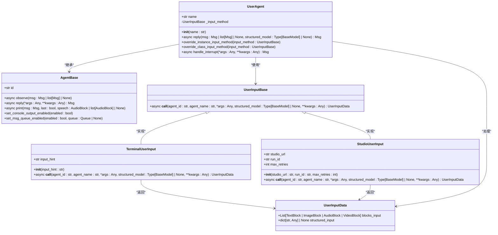
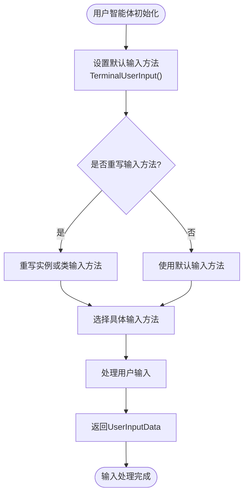
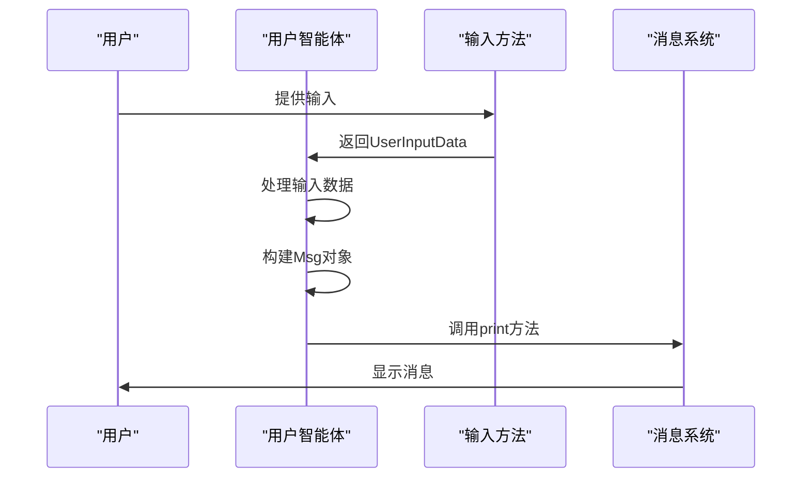
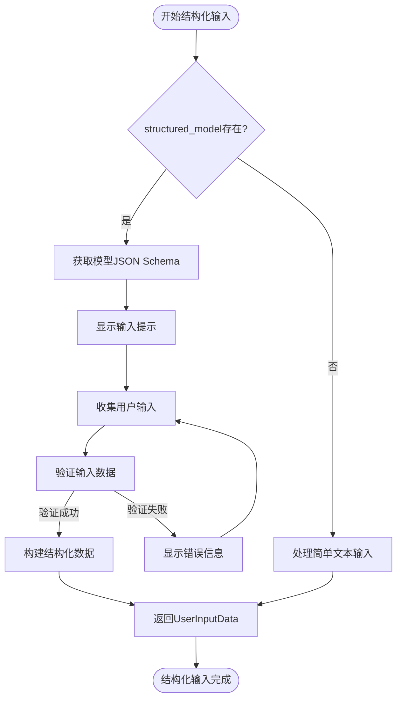
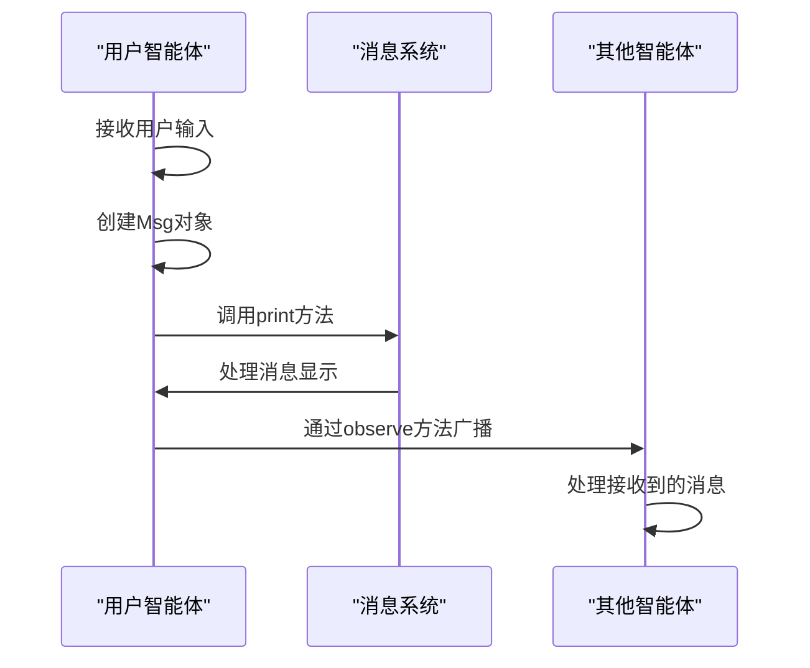
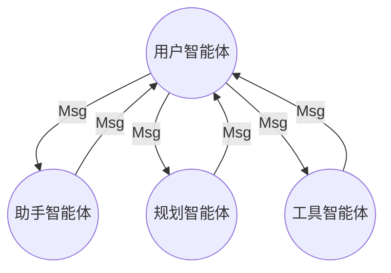
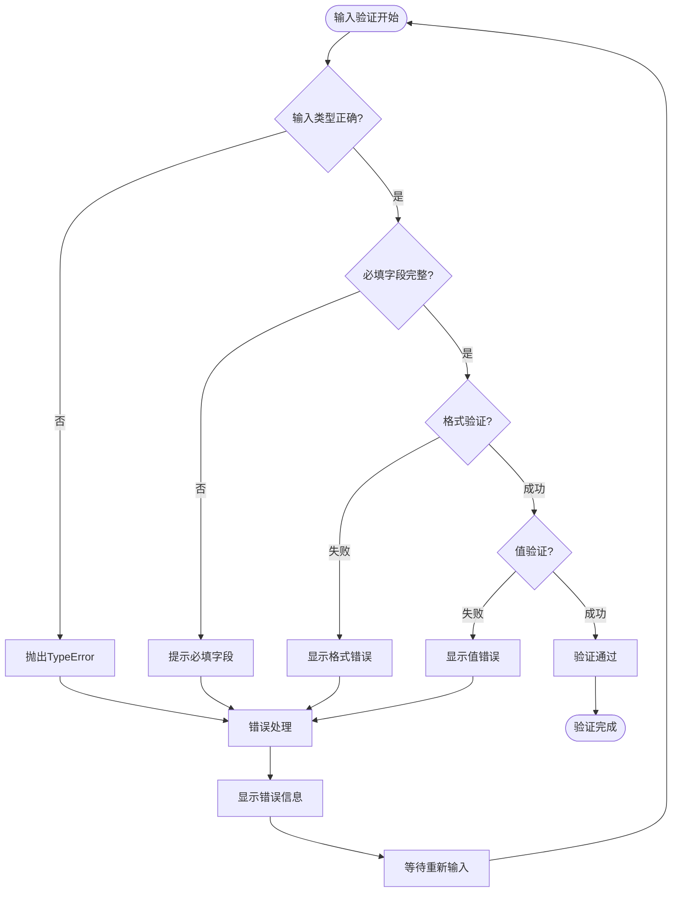
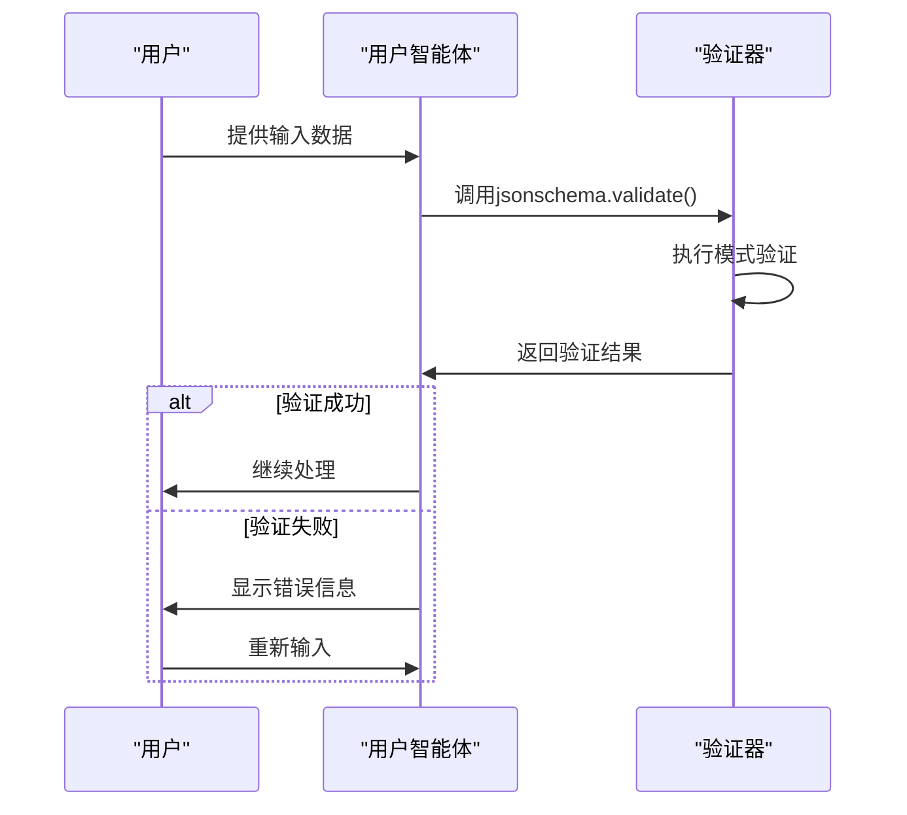
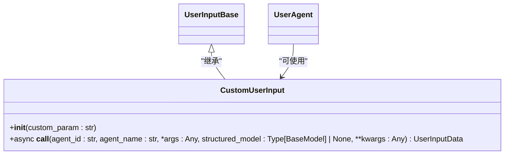
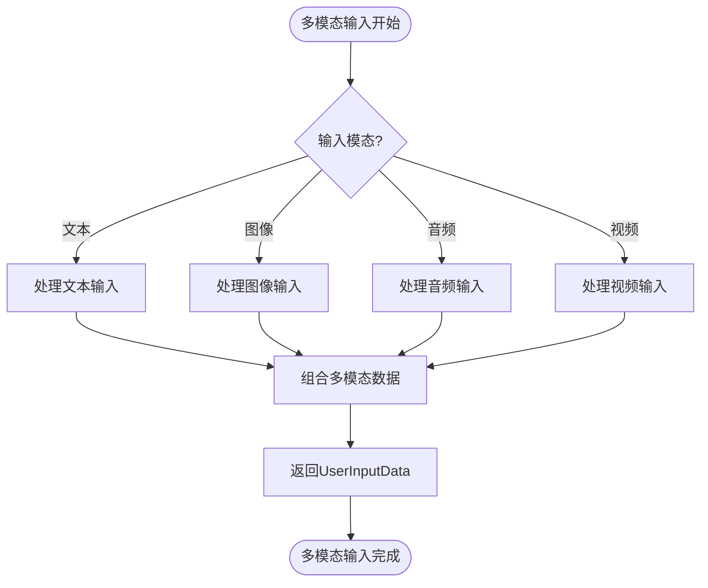

# 用户智能体

<cite>
**本文档引用的文件**   
- [user_agent.py](file://src/agentscope/agent/_user_agent.py)
- [user_input.py](file://src/agentscope/agent/_user_input.py)
- [agent_base.py](file://src/agentscope/agent/_agent_base.py)
- [message_base.py](file://src/agentscope/message/_message_base.py)
- [user_input_test.py](file://tests/user_input_test.py)
</cite>

## 目录
1. [介绍](#介绍)
2. [核心组件](#核心组件)
3. [用户输入处理机制](#用户输入处理机制)
4. [消息格式化与通信](#消息格式化与通信)
5. [异常处理与中断机制](#异常处理与中断机制)
6. [扩展与自定义](#扩展与自定义)
7. [实际应用示例](#实际应用示例)
8. [结论](#结论)

## 介绍

用户智能体（UserAgent）是多智能体系统中的关键组件，作为用户与系统之间的交互桥梁。它允许开发者从不同来源（如Web UI、CLI等）处理用户输入，并将这些输入转换为系统可理解的消息格式。用户智能体通过灵活的输入方法和消息处理机制，实现了与用户的无缝交互。

**用户智能体的主要功能包括**：
- 从多种输入源接收用户输入
- 处理结构化和非结构化输入
- 将用户输入转换为标准化消息格式
- 在多智能体系统中传递用户消息
- 支持自定义输入方式的扩展

用户智能体的设计旨在提供一个统一的接口，使开发者能够轻松地集成不同的用户交互方式，同时保持系统架构的一致性和可维护性。

## 核心组件

用户智能体的核心由几个关键组件构成，这些组件协同工作以实现完整的用户交互功能。



**图示来源**
- [user_agent.py](file://src/agentscope/agent/_user_agent.py#L12-L119)
- [user_input.py](file://src/agentscope/agent/_user_input.py#L39-L416)
- [agent_base.py](file://src/agentscope/agent/_agent_base.py#L30-L733)

**核心组件说明**

**用户智能体（UserAgent）**：作为用户交互的核心类，继承自AgentBase，负责处理所有用户输入并生成相应的回复消息。它通过_input_method字段管理不同的输入方式。

**输入基类（UserInputBase）**：抽象基类，定义了处理用户输入的标准接口。所有具体的输入方法都必须继承并实现这个基类。

**终端输入（TerminalUserInput）**：实现了从命令行终端获取用户输入的功能，是默认的输入方式。

**工作室输入（StudioUserInput）**：通过WebSocket连接到AgentScope Studio，实现Web界面的用户交互。

**输入数据（UserInputData）**：封装用户输入数据的容器，包含文本块和结构化输入。

**智能体基类（AgentBase）**：提供智能体的基本功能，如消息观察、回复和打印等。

**组件关系**
- UserAgent继承AgentBase，获得基本的智能体功能
- UserAgent使用UserInputBase的实例来处理具体输入
- TerminalUserInput和StudioUserInput实现UserInputBase接口
- 所有输入方法返回UserInputData对象
- UserAgent将UserInputData转换为Msg对象进行后续处理

**组件交互流程**
1. 用户通过终端或Web界面输入内容
2. 对应的输入方法（TerminalUserInput或StudioUserInput）处理输入
3. 输入方法返回UserInputData对象
4. UserAgent将UserInputData转换为Msg对象
5. Msg对象被发送到系统中的其他智能体

这种设计模式实现了输入方式与核心逻辑的分离，使得系统具有良好的扩展性和维护性。

**Section sources**
- [user_agent.py](file://src/agentscope/agent/_user_agent.py#L12-L119)
- [user_input.py](file://src/agentscope/agent/_user_input.py#L39-L416)
- [agent_base.py](file://src/agentscope/agent/_agent_base.py#L30-L733)

## 用户输入处理机制

用户智能体的输入处理机制是其核心功能之一，它通过灵活的设计支持多种输入源和输入类型。

### 输入方法架构

用户智能体采用策略模式来管理不同的输入方法。通过_input_method字段，可以动态切换不同的输入实现。



**图示来源**
- [user_agent.py](file://src/agentscope/agent/_user_agent.py#L17-L114)
- [user_input.py](file://src/agentscope/agent/_user_input.py#L39-L416)

### 输入处理流程

用户输入的处理流程包括以下几个关键步骤：

1. **输入获取**：通过当前设置的输入方法获取用户输入
2. **数据解析**：将原始输入解析为结构化的UserInputData对象
3. **消息构建**：将UserInputData转换为Msg对象
4. **消息输出**：通过print方法显示消息



**图示来源**
- [user_agent.py](file://src/agentscope/agent/_user_agent.py#L50-L76)
- [user_input.py](file://src/agentscope/agent/_user_input.py#L75-L416)

### 结构化输入处理

用户智能体支持结构化输入，通过Pydantic的BaseModel定义输入格式。



**图示来源**
- [user_input.py](file://src/agentscope/agent/_user_input.py#L105-L147)
- [user_agent.py](file://src/agentscope/agent/_user_agent.py#L55-L56)

### 输入方法重写

用户智能体提供了两种方式来重写输入方法：实例级别和类级别。

```python
# 实例级别重写
user_agent = UserAgent("Alice")
user_agent.override_instance_input_method(StudioUserInput(studio_url="http://localhost:8080", run_id="123"))

# 类级别重写
UserAgent.override_class_input_method(StudioUserInput(studio_url="http://localhost:8080", run_id="123"))
```

这种设计允许开发者根据需要灵活地配置输入方式，既可以为单个实例设置特定的输入方法，也可以为所有实例统一设置。

**Section sources**
- [user_agent.py](file://src/agentscope/agent/_user_agent.py#L78-L114)
- [user_input.py](file://src/agentscope/agent/_user_input.py#L68-L416)

## 消息格式化与通信

用户智能体在多智能体系统中的消息处理和通信机制是其核心功能之一。

### 消息结构

用户智能体使用Msg类来表示消息，该类包含以下关键属性：

| 属性 | 类型 | 描述 |
|------|------|------|
| name | str | 消息发送者名称 |
| content | str \| Sequence[ContentBlock] | 消息内容 |
| role | Literal["user", "assistant", "system"] | 发送者角色 |
| metadata | dict[str, JSONSerializableObject] \| None | 元数据，如结构化输出 |
| id | str | 消息唯一标识符 |
| timestamp | str | 消息创建时间戳 |
| invocation_id | str \| None | 相关API调用ID |

**消息块类型**
- TextBlock：文本内容块
- ToolUseBlock：工具使用块
- ImageBlock：图像内容块
- AudioBlock：音频内容块
- VideoBlock：视频内容块
- ToolResultBlock：工具结果块

### 消息处理流程



**图示来源**
- [user_agent.py](file://src/agentscope/agent/_user_agent.py#L67-L76)
- [message_base.py](file://src/agentscope/message/_message_base.py#L24-L242)

### 消息格式化规则

用户智能体遵循以下消息格式化规则：

1. **内容处理**：如果输入只有一个文本块，则将其转换为字符串
2. **角色设置**：用户消息的角色始终设置为"user"
3. **元数据传递**：结构化输入数据通过metadata字段传递
4. **消息ID生成**：使用shortuuid生成唯一的消息ID
5. **时间戳设置**：自动设置消息创建时间戳

### 多智能体通信

在多智能体系统中，用户智能体与其他智能体通过消息进行通信。



**图示来源**
- [user_agent.py](file://src/agentscope/agent/_user_agent.py#L74-L76)
- [agent_base.py](file://src/agentscope/agent/_agent_base.py#L444-L463)

**通信特点**
- **异步通信**：所有消息处理都是异步的
- **广播机制**：通过_msg_hub广播消息给所有订阅者
- **消息持久化**：消息包含唯一ID和时间戳，便于追踪
- **类型安全**：使用类型注解确保消息格式正确

**Section sources**
- [user_agent.py](file://src/agentscope/agent/_user_agent.py#L67-L76)
- [message_base.py](file://src/agentscope/message/_message_base.py#L24-L242)
- [agent_base.py](file://src/agentscope/agent/_agent_base.py#L444-L463)

## 异常处理与中断机制

用户智能体设计了完善的异常处理和中断机制，确保系统的稳定性和用户体验。

### 错误处理策略

用户智能体在处理用户输入时采用了多层次的错误处理策略。



**图示来源**
- [user_input.py](file://src/agentscope/agent/_user_input.py#L116-L147)
- [user_agent.py](file://src/agentscope/agent/_user_agent.py#L89-L93)

### 中断处理机制

当用户操作被中断时，用户智能体会执行特定的处理逻辑。

```python
async def handle_interrupt(self, *args: Any, **kwargs: Any) -> Msg:
    """The post-processing logic when the reply is interrupted by the
    user or something else."""
    raise NotImplementedError(
        f"The handle_interrupt function is not implemented in "
        f"{self.__class__.__name__}",
    )
```

虽然当前实现中handle_interrupt方法尚未具体实现，但其设计为未来扩展提供了基础。

### 输入验证实现

用户智能体使用jsonschema库进行输入验证，确保数据的完整性和正确性。



**图示来源**
- [user_input.py](file://src/agentscope/agent/_user_input.py#L139-L143)
- [user_agent.py](file://src/agentscope/agent/_user_agent.py#L89-L93)

### 异常处理最佳实践

在使用用户智能体时，建议遵循以下异常处理最佳实践：

1. **预验证输入**：在调用用户智能体前验证输入参数
2. **捕获特定异常**：针对不同类型的异常采取不同的处理策略
3. **提供清晰错误信息**：向用户显示有意义的错误信息
4. **记录错误日志**：记录异常信息以便调试和分析
5. **优雅降级**：在发生错误时提供备选方案

**Section sources**
- [user_input.py](file://src/agentscope/agent/_user_input.py#L89-L93)
- [user_agent.py](file://src/agentscope/agent/_user_agent.py#L115-L125)

## 扩展与自定义

用户智能体的设计支持灵活的扩展和自定义，满足不同应用场景的需求。

### 自定义输入方法

开发者可以通过继承UserInputBase类来创建自定义的输入方法。



**实现步骤**
1. 创建新的输入类，继承UserInputBase
2. 实现__call__方法，处理具体的输入逻辑
3. 重写必要的初始化方法
4. 在用户智能体中注册新的输入方法

### 输入方法注册

用户智能体提供了两种注册自定义输入方法的方式：

```python
# 方式1：实例级别注册
user_agent = UserAgent("Alice")
user_agent.override_instance_input_method(CustomUserInput(custom_param="value"))

# 方式2：类级别注册
UserAgent.override_class_input_method(CustomUserInput(custom_param="value"))
```

### 扩展场景示例

以下是几种常见的扩展场景：

**Web界面集成**
```python
class WebUserInput(UserInputBase):
    """通过WebSocket处理Web界面用户输入"""
    
    def __init__(self, websocket_url: str, session_id: str):
        self.websocket_url = websocket_url
        self.session_id = session_id
        # 初始化WebSocket连接
```

**语音输入支持**
```python
class VoiceUserInput(UserInputBase):
    """处理语音输入"""
    
    def __init__(self, audio_device: str = "default"):
        self.audio_device = audio_device
        # 初始化音频处理模块
```

**多模态输入**


**图示来源**
- [user_input.py](file://src/agentscope/agent/_user_input.py#L39-L416)
- [user_agent.py](file://src/agentscope/agent/_user_agent.py#L78-L114)

### 扩展最佳实践

在扩展用户智能体时，建议遵循以下最佳实践：

1. **保持接口一致性**：确保自定义输入方法遵循UserInputBase的接口规范
2. **错误处理完善**：为自定义输入方法添加适当的错误处理
3. **性能优化**：考虑输入方法的性能影响，避免阻塞主线程
4. **安全性考虑**：验证和清理用户输入，防止安全漏洞
5. **文档完整**：为自定义组件提供完整的文档说明

**Section sources**
- [user_input.py](file://src/agentscope/agent/_user_input.py#L39-L416)
- [user_agent.py](file://src/agentscope/agent/_user_agent.py#L78-L114)

## 实际应用示例

通过实际代码示例展示用户智能体在多智能体系统中的应用。

### 基本使用示例

```python
from agentscope.agent import UserAgent
from agentscope.message import Msg

# 创建用户智能体
user = UserAgent(name="Alice")

# 获取用户输入
user_input = await user()

# 处理用户输入
print(f"收到用户输入: {user_input.content}")
```

### 结构化输入示例

```python
from pydantic import BaseModel, Field
from typing import Literal

class UserChoice(BaseModel):
    """用户选择模型"""
    thinking: str = Field(min_length=1, max_length=100)
    decision: Literal["accept", "reject", "pending"]

# 创建用户智能体并获取结构化输入
user = UserAgent(name="Alice")
result = await user(structured_model=UserChoice)

# 处理结构化输入
print(f"用户思考: {result.metadata['thinking']}")
print(f"用户决策: {result.metadata['decision']}")
```

### 多智能体对话示例

```python
from agentscope.agent import ReActAgent, UserAgent
from agentscope.message import Msg
import asyncio

async def main():
    # 创建助手智能体
    assistant = ReActAgent(
        name="Assistant",
        sys_prompt="You are a helpful assistant.",
        model=DashScopeChatModel(
            model_name="qwen-max",
            api_key=os.environ["DASHSCOPE_API_KEY"],
        ),
    )
    
    # 创建用户智能体
    user = UserAgent(name="User")
    
    # 开始对话
    print("开始对话...")
    msg = Msg("user", "你好，你能帮我做什么？", "user")
    
    while True:
        # 助手回复
        msg = await assistant(msg)
        
        # 用户回复
        msg = await user(msg)
        
        # 检查是否结束
        if msg.get_text_content() == "exit":
            break

asyncio.run(main())
```

### Web界面集成示例

```python
from agentscope.agent import UserAgent
from agentscope.agent import StudioUserInput

# 配置Studio输入
studio_input = StudioUserInput(
    studio_url="http://localhost:8080",
    run_id="my_run_123"
)

# 创建使用Studio输入的用户智能体
user = UserAgent(name="WebUser")
user.override_instance_input_method(studio_input)

# 现在用户输入将通过Web界面处理
user_input = await user()
```

### 测试示例

```python
from unittest.mock import patch, MagicMock
from agentscope.agent import UserAgent

@patch("builtins.input", side_effect=["Hi!", "sth", "apple"])
async def test_user_input(mock_input: MagicMock) -> None:
    """测试用户输入功能"""
    
    # 创建用户智能体
    user_agent = UserAgent("Alice")
    
    # 定义结构化模型
    class Choice(BaseModel):
        thinking: str = Field(min_length=1, max_length=10)
        decision: Literal["apple", "banana", "cherry"]
    
    # 获取用户输入
    msg_res = await user_agent(structured_model=Choice)
    
    # 验证结果
    assert msg_res.content == "Hi!"
    assert msg_res.metadata == {
        "thinking": "sth",
        "decision": "apple",
    }
    assert mock_input.call_count == 3
```

这些示例展示了用户智能体在不同场景下的应用，从基本的用户输入处理到复杂的多智能体交互，体现了其灵活性和实用性。

**Section sources**
- [user_agent.py](file://src/agentscope/agent/_user_agent.py#L30-L76)
- [user_input.py](file://src/agentscope/agent/_user_input.py#L75-L151)
- [user_input_test.py](file://tests/user_input_test.py#L16-L44)

## 结论

用户智能体作为多智能体系统中的关键组件，提供了强大而灵活的用户交互能力。通过对UserAgent类的全面分析，我们可以得出以下结论：

**设计优势**
- **模块化设计**：通过分离输入方法和核心逻辑，实现了高内聚低耦合
- **扩展性强**：支持多种输入源的扩展，易于集成新的交互方式
- **类型安全**：使用类型注解确保代码的健壮性和可维护性
- **异步支持**：完全异步的设计，适合高并发场景

**核心价值**
- **统一接口**：为不同输入源提供统一的访问接口
- **消息标准化**：将各种输入转换为标准化的消息格式
- **易用性**：简单的API设计，降低使用门槛
- **可测试性**：良好的模块划分，便于单元测试

**应用场景**
- **命令行应用**：通过TerminalUserInput处理终端输入
- **Web应用**：通过StudioUserInput集成Web界面
- **多模态系统**：支持文本、图像、音频等多种输入模态
- **自动化测试**：便于创建测试用例和模拟用户交互

**未来发展建议**
1. **增强输入验证**：提供更丰富的输入验证选项
2. **支持更多输入源**：集成语音识别、手势控制等新型交互方式
3. **改进错误处理**：提供更详细的错误信息和恢复机制
4. **性能优化**：进一步优化输入处理的性能
5. **文档完善**：提供更详细的使用文档和示例

用户智能体的设计体现了现代软件工程的最佳实践，为构建复杂的多智能体系统提供了坚实的基础。通过合理使用和扩展用户智能体，开发者可以快速构建功能丰富、交互友好的智能应用。