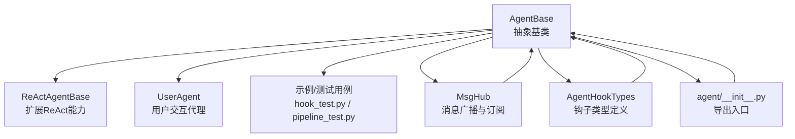
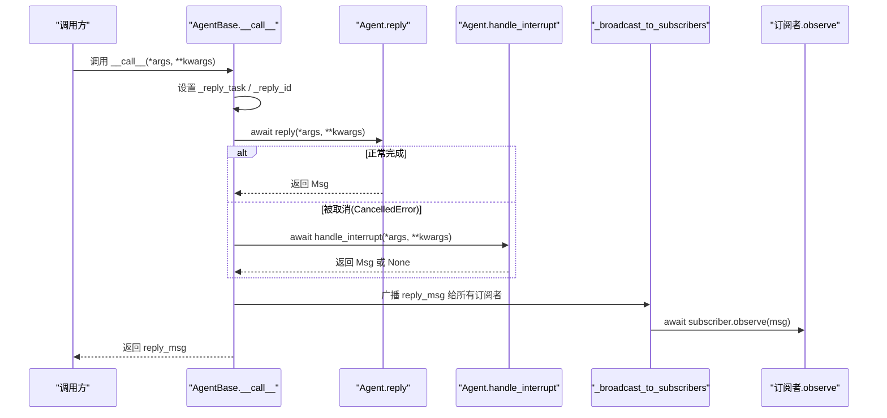
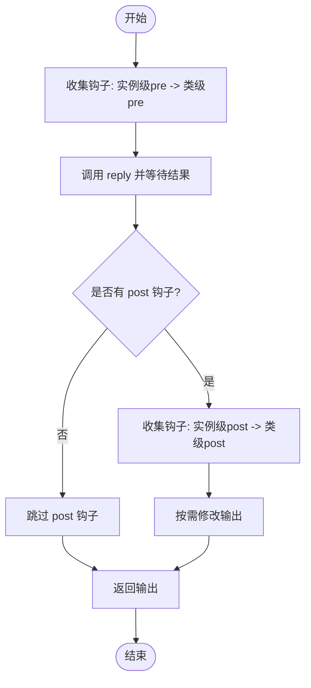
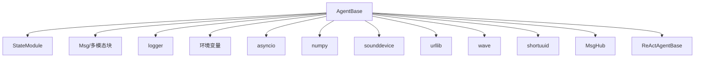

# AgentBase基类解析

<cite>
**本文引用的文件**
- [src/agentscope/agent/_agent_base.py](file://src/agentscope/agent/_agent_base.py)
- [src/agentscope/agent/_react_agent_base.py](file://src/agentscope/agent/_react_agent_base.py)
- [src/agentscope/agent/_user_agent.py](file://src/agentscope/agent/_user_agent.py)
- [src/agentscope/agent/__init__.py](file://src/agentscope/agent/__init__.py)
- [src/agentscope/pipeline/_msghub.py](file://src/agentscope/pipeline/_msghub.py)
- [src/agentscope/types/_hook.py](file://src/agentscope/types/_hook.py)
- [tests/hook_test.py](file://tests/hook_test.py)
- [tests/pipeline_test.py](file://tests/pipeline_test.py)
- [docs/tutorial/zh_CN/src/task_agent.py](file://docs/tutorial/zh_CN/src/task_agent.py)
</cite>

## 目录
1. [引言](#引言)
2. [项目结构](#项目结构)
3. [核心组件](#核心组件)
4. [架构总览](#架构总览)
5. [详细组件分析](#详细组件分析)
6. [依赖关系分析](#依赖关系分析)
7. [性能考量](#性能考量)
8. [故障排查指南](#故障排查指南)
9. [结论](#结论)
10. [附录](#附录)

## 引言
本文件面向希望深入理解 AgentBase 基类的开发者，系统性解析其作为所有智能体抽象基类的设计理念、核心接口契约、消息与订阅广播机制、控制台输出与消息队列管理、以及类级与实例级钩子的注册与执行顺序。同时，结合实际示例与测试用例，说明如何正确继承 AgentBase 并实现其抽象方法，涵盖错误处理、异步任务取消（interrupt）、以及消息广播（_broadcast_to_subscribers）等关键流程。

## 项目结构
AgentBase 位于 agentscope 的 agent 子模块中，是 ReActAgent、UserAgent 等具体智能体的基础。其对外导出入口在 agent 包的 __init__.py 中。消息广播与订阅管理由 pipeline 子模块中的 MsgHub 提供；钩子类型定义位于 types 子模块。

图表来源
- [src/agentscope/agent/_agent_base.py](file://src/agentscope/agent/_agent_base.py#L29-L733)
- [src/agentscope/agent/_react_agent_base.py](file://src/agentscope/agent/_react_agent_base.py#L1-L117)
- [src/agentscope/agent/_user_agent.py](file://src/agentscope/agent/_user_agent.py#L1-L129)
- [src/agentscope/agent/__init__.py](file://src/agentscope/agent/__init__.py#L1-L27)
- [src/agentscope/pipeline/_msghub.py](file://src/agentscope/pipeline/_msghub.py#L1-L156)
- [src/agentscope/types/_hook.py](file://src/agentscope/types/_hook.py#L1-L26)

章节来源
- [src/agentscope/agent/__init__.py](file://src/agentscope/agent/__init__.py#L1-L27)

## 核心组件
- 抽象接口
  - observe：接收消息但不生成回复
  - reply：基于当前状态与输入生成回复
  - handle_interrupt：当回复被中断时的后处理逻辑
- 生命周期与控制
  - __call__：统一调度 reply，并在取消时调用 handle_interrupt，最后广播给订阅者
  - interrupt：取消当前正在运行的回复任务
- 输出与流式打印
  - print：负责文本/思考块/多媒体块的打印与音频播放，支持流式累积与清理
  - set_msg_queue_enabled：启用/禁用消息队列用于流式输出
  - set_console_output_enabled/disable_console_output：控制台输出开关
- 订阅与广播
  - reset_subscribers/remove_subscribers：订阅者管理
  - _broadcast_to_subscribers：向订阅者广播消息
- 钩子系统
  - 支持类级与实例级钩子注册、移除、清空
  - 钩子类型：pre_reply/post_reply/pre_print/post_print/pre_observe/post_observe
  - ReActAgentBase 扩展了 pre_reasoning/post_reasoning/pre_acting/post_acting

章节来源
- [src/agentscope/agent/_agent_base.py](file://src/agentscope/agent/_agent_base.py#L184-L203)
- [src/agentscope/agent/_agent_base.py](file://src/agentscope/agent/_agent_base.py#L443-L463)
- [src/agentscope/agent/_agent_base.py](file://src/agentscope/agent/_agent_base.py#L464-L473)
- [src/agentscope/agent/_agent_base.py](file://src/agentscope/agent/_agent_base.py#L474-L484)
- [src/agentscope/agent/_agent_base.py](file://src/agentscope/agent/_agent_base.py#L485-L490)
- [src/agentscope/agent/_agent_base.py](file://src/agentscope/agent/_agent_base.py#L204-L271)
- [src/agentscope/agent/_agent_base.py](file://src/agentscope/agent/_agent_base.py#L695-L733)
- [src/agentscope/agent/_agent_base.py](file://src/agentscope/agent/_agent_base.py#L659-L689)
- [src/agentscope/agent/_agent_base.py](file://src/agentscope/agent/_agent_base.py#L490-L545)
- [src/agentscope/agent/_agent_base.py](file://src/agentscope/agent/_agent_base.py#L548-L604)
- [src/agentscope/agent/_react_agent_base.py](file://src/agentscope/agent/_react_agent_base.py#L1-L117)
- [src/agentscope/types/_hook.py](file://src/agentscope/types/_hook.py#L1-L26)

## 架构总览
AgentBase 将“回复生命周期”、“输出渲染”、“订阅广播”和“钩子扩展”整合为统一框架，既保证了最小可用抽象，又提供了强大的可插拔扩展点。

图表来源
- [src/agentscope/agent/_agent_base.py](file://src/agentscope/agent/_agent_base.py#L443-L463)
- [src/agentscope/agent/_agent_base.py](file://src/agentscope/agent/_agent_base.py#L464-L473)
- [src/agentscope/agent/_agent_base.py](file://src/agentscope/agent/_agent_base.py#L474-L484)

## 详细组件分析

### 抽象接口与契约
- observe(msg: Msg | list[Msg] | None) -> None
  - 契约：接收消息但不生成回复。必须在子类中实现。
  - 实现要点：通常用于缓存观察到的消息，供后续 reply 使用。
- reply(*args, **kwargs) -> Msg
  - 契约：根据当前状态与输入生成回复消息。必须在子类中实现。
  - 实现要点：应避免在钩子中直接调用 reply，防止无限递归。
- handle_interrupt(*args, **kwargs) -> Msg
  - 契约：当回复被中断时的后处理逻辑。必须在子类中实现。
  - 实现要点：可返回一条简短的中断响应或空消息。

章节来源
- [src/agentscope/agent/_agent_base.py](file://src/agentscope/agent/_agent_base.py#L184-L203)
- [src/agentscope/agent/_agent_base.py](file://src/agentscope/agent/_agent_base.py#L474-L484)

### 生命周期与控制（__call__、interrupt）
- __call__：统一调度 reply，捕获 CancelledError 并调用 handle_interrupt，最终广播消息。
- interrupt：若当前回复任务未完成，则取消该任务，触发 CancelledError 流程。
- 关键属性
  - _reply_task：当前回复任务句柄
  - _reply_id：本次回复的唯一标识
  - _subscribers：订阅者映射（按 MsgHub 名称分组）

章节来源
- [src/agentscope/agent/_agent_base.py](file://src/agentscope/agent/_agent_base.py#L443-L463)
- [src/agentscope/agent/_agent_base.py](file://src/agentscope/agent/_agent_base.py#L485-L490)
- [src/agentscope/agent/_agent_base.py](file://src/agentscope/agent/_agent_base.py#L146-L146)

### 输出与流式打印（print、音频播放、流式前缀）
- print(msg, last=True, speech=None)：负责将消息内容块渲染到控制台，支持文本、思考块与最后非文本块的特殊处理。
- 音频播放：支持 URL 与 Base64 两种来源，使用本地音频设备进行播放，并缓存流式音频数据以便续播。
- 流式前缀：维护每个消息的文本与音频前缀，避免重复打印与错位。
- 控制台输出开关：可通过环境变量或 API 切换是否输出到控制台。
- 消息队列：可启用队列以导出流式消息，供外部消费。

章节来源
- [src/agentscope/agent/_agent_base.py](file://src/agentscope/agent/_agent_base.py#L204-L271)
- [src/agentscope/agent/_agent_base.py](file://src/agentscope/agent/_agent_base.py#L271-L362)
- [src/agentscope/agent/_agent_base.py](file://src/agentscope/agent/_agent_base.py#L364-L441)
- [src/agentscope/agent/_agent_base.py](file://src/agentscope/agent/_agent_base.py#L695-L733)

### 订阅与广播（reset_subscribers、remove_subscribers、_broadcast_to_subscribers）
- reset_subscribers(msghub_name, subscribers)：设置某 MsgHub 下的订阅者列表（排除自身）。
- remove_subscribers(msghub_name)：移除指定 MsgHub 的订阅者。
- _broadcast_to_subscribers(msg)：遍历所有订阅者并调用其 observe，实现消息广播。

章节来源
- [src/agentscope/agent/_agent_base.py](file://src/agentscope/agent/_agent_base.py#L659-L689)
- [src/agentscope/agent/_agent_base.py](file://src/agentscope/agent/_agent_base.py#L464-L473)

### 钩子系统（类级与实例级）
- 支持钩子类型：pre_reply、post_reply、pre_print、post_print、pre_observe、post_observe
- 注册与移除
  - 类级：register_class_hook(hook_type, hook_name, hook)
  - 实例级：register_instance_hook(hook_type, hook_name, hook)
  - 清理：clear_class_hooks(hook_type=None)、clear_instance_hooks(hook_type=None)
- 执行顺序
  - 实例级钩子优先于类级钩子执行
  - 钩子链按注册顺序依次传递修改后的参数或输出
- ReActAgentBase 扩展了 reasoning/acting 的钩子类型

图表来源
- [src/agentscope/agent/_agent_base.py](file://src/agentscope/agent/_agent_base.py#L490-L545)
- [src/agentscope/agent/_agent_base.py](file://src/agentscope/agent/_agent_base.py#L548-L604)
- [src/agentscope/agent/_react_agent_base.py](file://src/agentscope/agent/_react_agent_base.py#L1-L117)
- [src/agentscope/types/_hook.py](file://src/agentscope/types/_hook.py#L1-L26)

章节来源
- [src/agentscope/agent/_agent_base.py](file://src/agentscope/agent/_agent_base.py#L490-L604)
- [src/agentscope/agent/_react_agent_base.py](file://src/agentscope/agent/_react_agent_base.py#L1-L117)
- [src/agentscope/types/_hook.py](file://src/agentscope/types/_hook.py#L1-L26)

### 智能体ID生成
- AgentBase 在初始化时使用短UUID生成全局唯一的 id，便于追踪与日志记录。

章节来源
- [src/agentscope/agent/_agent_base.py](file://src/agentscope/agent/_agent_base.py#L143-L143)

### 具体实现示例与最佳实践
- 继承与实现
  - UserAgent：实现了 reply 从用户输入获取消息并打印，observe 仅缓存消息，handle_interrupt 抛出未实现异常（需子类覆盖）。
  - ReActAgentBase：扩展了 reasoning/acting 的抽象与钩子类型，强调在推理与行动阶段插入钩子的能力。
- 测试用例
  - hook_test：演示了实例级与类级钩子的注册、移除与清理，以及钩子对消息内容的修改效果。
  - pipeline_test：展示了流式打印与错误处理场景，验证 print 与异常传播行为。

章节来源
- [src/agentscope/agent/_user_agent.py](file://src/agentscope/agent/_user_agent.py#L1-L129)
- [src/agentscope/agent/_react_agent_base.py](file://src/agentscope/agent/_react_agent_base.py#L1-L117)
- [tests/hook_test.py](file://tests/hook_test.py#L1-L200)
- [tests/pipeline_test.py](file://tests/pipeline_test.py#L50-L152)

## 依赖关系分析
- 内部依赖
  - StateModule：提供状态模块能力（AgentBase 继承自 StateModule）
  - Msg/多模态块：文本、思考、工具调用、工具结果、图像、视频、音频
  - 日志：logger
  - 环境变量：控制台输出开关
- 外部依赖
  - asyncio：任务管理、取消、队列
  - numpy、sounddevice、urllib、wave：音频播放与解码
  - shortuuid：ID 生成
- 与其他模块的关系
  - MsgHub：通过 reset_subscribers/remove_subscribers 管理订阅者，实现自动广播
  - ReActAgentBase：扩展钩子类型，体现 AgentBase 的可扩展性

图表来源
- [src/agentscope/agent/_agent_base.py](file://src/agentscope/agent/_agent_base.py#L1-L733)
- [src/agentscope/pipeline/_msghub.py](file://src/agentscope/pipeline/_msghub.py#L1-L156)
- [src/agentscope/agent/_react_agent_base.py](file://src/agentscope/agent/_react_agent_base.py#L1-L117)

章节来源
- [src/agentscope/agent/_agent_base.py](file://src/agentscope/agent/_agent_base.py#L1-L733)
- [src/agentscope/pipeline/_msghub.py](file://src/agentscope/pipeline/_msghub.py#L1-L156)

## 性能考量
- 流式输出
  - print 通过流式前缀避免重复打印，减少控制台抖动
  - set_msg_queue_enabled 可启用队列以异步导出流式消息，降低主线程阻塞
- 音频播放
  - Base64 流式音频会缓存播放器与前缀数据，避免重复初始化
  - URL 音频采用一次性下载与播放，注意网络延迟与内存占用
- 取消与广播
  - interrupt 仅在任务未完成时取消，避免无效操作
  - 广播采用异步逐个调用 observe，注意订阅者数量与 observe 实现复杂度

[本节为通用指导，无需列出具体文件来源]

## 故障排查指南
- 钩子未生效
  - 确认已正确注册实例级或类级钩子，且钩子名称唯一
  - 检查钩子类型是否在 supported_hook_types 中
- 音频播放失败
  - 检查音频块的 source 字段是否包含必需字段
  - 确认系统音频设备可用，Base64 数据格式正确
- 控制台输出异常
  - 检查 AGENTSCOPE_DISABLE_CONSOLE_OUTPUT 环境变量
  - 使用 set_console_output_enabled 显式切换
- 中断无响应
  - 确保在 __call__ 中抛出了 CancelledError
  - 子类必须实现 handle_interrupt 并返回有效消息或 None
- 广播未到达订阅者
  - 检查 reset_subscribers 是否正确设置
  - 确认订阅者列表不含自身，且 MsgHub 生命周期内订阅未被移除

章节来源
- [src/agentscope/agent/_agent_base.py](file://src/agentscope/agent/_agent_base.py#L271-L362)
- [src/agentscope/agent/_agent_base.py](file://src/agentscope/agent/_agent_base.py#L695-L733)
- [src/agentscope/agent/_agent_base.py](file://src/agentscope/agent/_agent_base.py#L443-L463)
- [src/agentscope/agent/_agent_base.py](file://src/agentscope/agent/_agent_base.py#L474-L484)
- [src/agentscope/agent/_agent_base.py](file://src/agentscope/agent/_agent_base.py#L659-L689)

## 结论
AgentBase 通过清晰的抽象接口、完善的生命周期管理、灵活的钩子扩展与稳健的消息广播机制，构建了统一的智能体开发框架。开发者只需专注于业务逻辑（实现 reply、observe、handle_interrupt），即可获得一致的输出渲染、订阅广播与中断处理体验。ReActAgentBase 进一步扩展了推理与行动阶段的钩子，体现了 AgentBase 的可演进性与可组合性。

[本节为总结性内容，无需列出具体文件来源]

## 附录

### 常见用法速查
- 启用/禁用控制台输出：set_console_output_enabled(enabled)
- 启用/禁用消息队列：set_msg_queue_enabled(enabled, queue=None)
- 注册钩子：register_instance_hook / register_class_hook
- 清理钩子：clear_instance_hooks / clear_class_hooks
- 订阅管理：reset_subscribers / remove_subscribers
- 中断处理：interrupt（触发 CancelledError）-> handle_interrupt

章节来源
- [src/agentscope/agent/_agent_base.py](file://src/agentscope/agent/_agent_base.py#L695-L733)
- [src/agentscope/agent/_agent_base.py](file://src/agentscope/agent/_agent_base.py#L490-L604)
- [src/agentscope/agent/_agent_base.py](file://src/agentscope/agent/_agent_base.py#L659-L689)