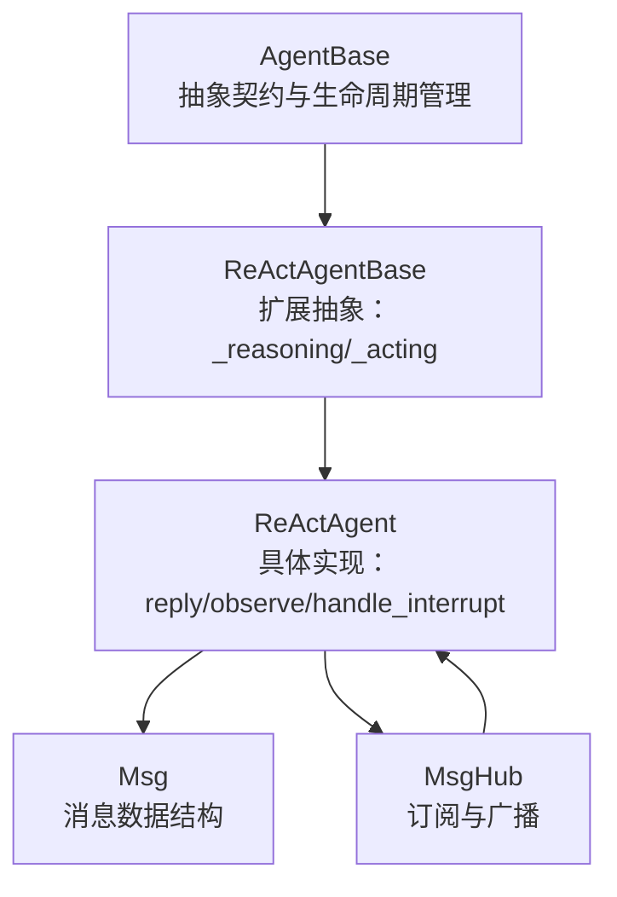
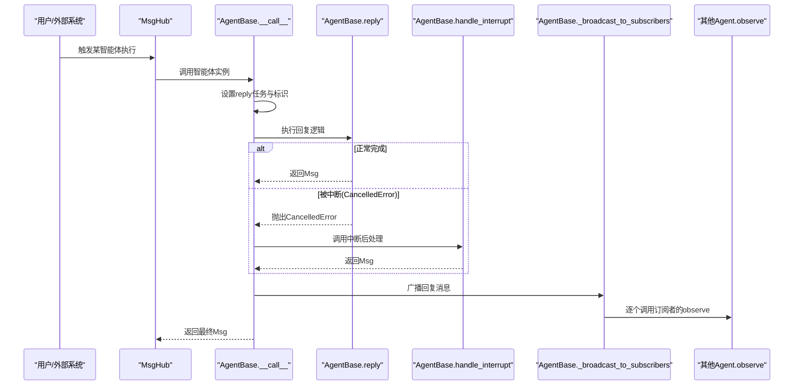
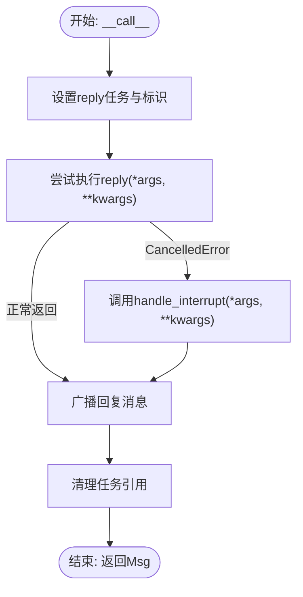
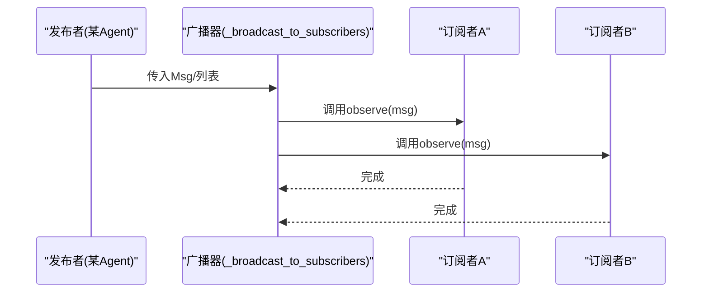
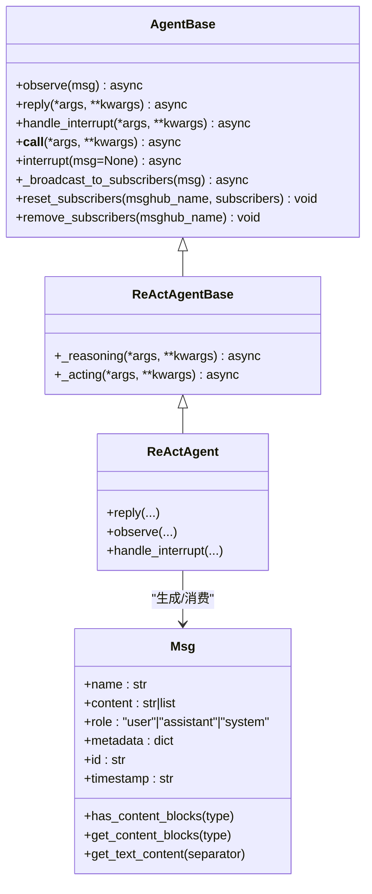
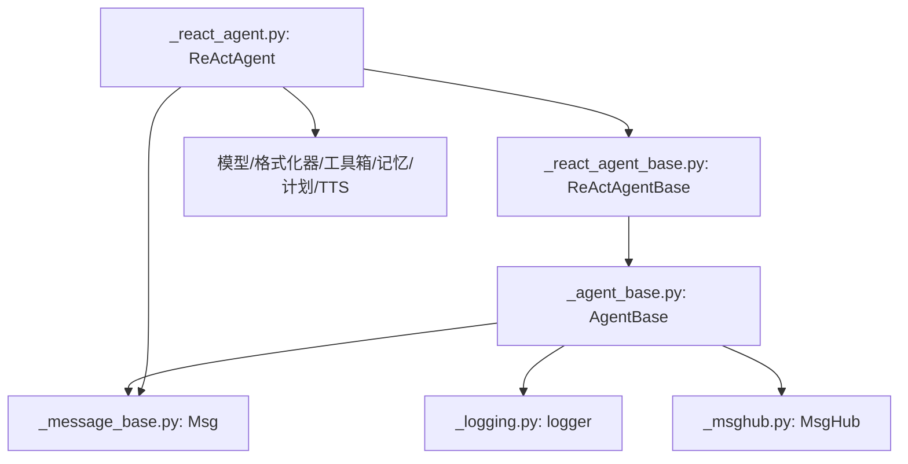

# 核心接口定义

<cite>
**本文引用的文件列表**
- [src/agentscope/agent/_agent_base.py](file://src/agentscope/agent/_agent_base.py)
- [src/agentscope/agent/_react_agent_base.py](file://src/agentscope/agent/_react_agent_base.py)
- [src/agentscope/agent/_react_agent.py](file://src/agentscope/agent/_react_agent.py)
- [src/agentscope/message/_message_base.py](file://src/agentscope/message/_message_base.py)
- [src/agentscope/pipeline/_msghub.py](file://src/agentscope/pipeline/_msghub.py)
- [examples/workflows/multiagent_conversation/main.py](file://examples/workflows/multiagent_conversation/main.py)
- [tests/pipeline_test.py](file://tests/pipeline_test.py)
</cite>

## 目录
1. [简介](#简介)
2. [项目结构](#项目结构)
3. [核心组件](#核心组件)
4. [架构总览](#架构总览)
5. [详细组件分析](#详细组件分析)
6. [依赖关系分析](#依赖关系分析)
7. [性能考量](#性能考量)
8. [故障排查指南](#故障排查指南)
9. [结论](#结论)
10. [附录](#附录)

## 简介
本文件聚焦于AgentBase基类中定义的三个关键抽象方法：observe、reply与handle_interrupt，并系统阐述其契约、参数与返回值规范、调用时序以及在异步环境下的消息处理流程。同时，本文将深入解析__call__方法如何封装reply调用并管理任务生命周期，以及消息广播机制（_broadcast_to_subscribers）在多智能体协作中的作用与实现细节。最后，给出针对asyncio.CancelledError的捕获与响应策略等错误处理最佳实践。

## 项目结构
围绕AgentBase及其子类的实现，相关模块分布如下：
- 基类与抽象契约：AgentBase（定义observe、reply、handle_interrupt等）
- ReAct扩展：ReActAgentBase（在AgentBase基础上增加_reasoning与_acting抽象）
- 具体实现：ReActAgent（实现reply、observe、handle_interrupt等）
- 消息模型：Msg（消息载体）
- 广播枢纽：MsgHub（用于多智能体间的消息广播）

图表来源
- [src/agentscope/agent/_agent_base.py](file://src/agentscope/agent/_agent_base.py#L180-L210)
- [src/agentscope/agent/_react_agent_base.py](file://src/agentscope/agent/_react_agent_base.py#L1-L117)
- [src/agentscope/agent/_react_agent.py](file://src/agentscope/agent/_react_agent.py#L582-L687)
- [src/agentscope/message/_message_base.py](file://src/agentscope/message/_message_base.py#L21-L74)
- [src/agentscope/pipeline/_msghub.py](file://src/agentscope/pipeline/_msghub.py#L1-L157)

章节来源
- [src/agentscope/agent/_agent_base.py](file://src/agentscope/agent/_agent_base.py#L180-L210)
- [src/agentscope/agent/_react_agent_base.py](file://src/agentscope/agent/_react_agent_base.py#L1-L117)
- [src/agentscope/agent/_react_agent.py](file://src/agentscope/agent/_react_agent.py#L582-L687)
- [src/agentscope/message/_message_base.py](file://src/agentscope/message/_message_base.py#L21-L74)
- [src/agentscope/pipeline/_msghub.py](file://src/agentscope/pipeline/_msghub.py#L1-L157)

## 核心组件
- AgentBase：定义异步智能体的抽象契约与通用能力，包括：
  - 抽象方法：observe、reply、handle_interrupt
  - 生命周期封装：__call__、interrupt、_broadcast_to_subscribers
  - 订阅管理：reset_subscribers、remove_subscribers
  - 流式输出：print、消息队列设置
- ReActAgentBase：在AgentBase之上扩展“推理-行动”两阶段抽象，便于实现ReAct风格的智能体。
- ReActAgent：具体实现reply、observe、handle_interrupt，体现完整的异步消息处理流程。
- Msg：统一的消息数据结构，承载文本、工具调用、结果、音频、图像、视频等多模态内容块。
- MsgHub：多智能体协作的广播中枢，自动或手动将消息分发给订阅者。

章节来源
- [src/agentscope/agent/_agent_base.py](file://src/agentscope/agent/_agent_base.py#L180-L210)
- [src/agentscope/agent/_react_agent_base.py](file://src/agentscope/agent/_react_agent_base.py#L1-L117)
- [src/agentscope/agent/_react_agent.py](file://src/agentscope/agent/_react_agent.py#L582-L687)
- [src/agentscope/message/_message_base.py](file://src/agentscope/message/_message_base.py#L21-L74)
- [src/agentscope/pipeline/_msghub.py](file://src/agentscope/pipeline/_msghub.py#L1-L157)

## 架构总览
AgentBase作为异步智能体的抽象基类，为所有具体智能体提供一致的契约与生命周期管理。ReActAgentBase进一步细化为“推理-行动”的两阶段流程，ReActAgent则完成具体实现。消息通过Msg对象传递，MsgHub负责订阅与广播，形成松耦合的多智能体协作网络。

图表来源
- [src/agentscope/agent/_agent_base.py](file://src/agentscope/agent/_agent_base.py#L444-L473)
- [src/agentscope/pipeline/_msghub.py](file://src/agentscope/pipeline/_msghub.py#L130-L139)

章节来源
- [src/agentscope/agent/_agent_base.py](file://src/agentscope/agent/_agent_base.py#L444-L473)
- [src/agentscope/pipeline/_msghub.py](file://src/agentscope/pipeline/_msghub.py#L130-L139)

## 详细组件分析

### observe抽象方法
- 契约与职责
  - 接收消息（单条或多条），不生成回复
  - 通常用于将输入消息存入内部记忆或状态，供后续reply使用
- 参数与返回值
  - 参数：Msg | list[Msg] | None
  - 返回：None
- 实现要点
  - 在具体智能体中应确保幂等性与线程安全（尽管是异步，但observe本身不产生副作用）
  - 可结合内存模块进行消息持久化或状态更新
- 示例参考路径
  - ReActAgent.observe：将消息添加至短时记忆
  - 测试用例：AddAgent.observe、StreamAgent.observe等空实现占位

章节来源
- [src/agentscope/agent/_agent_base.py](file://src/agentscope/agent/_agent_base.py#L185-L196)
- [src/agentscope/agent/_react_agent.py](file://src/agentscope/agent/_react_agent.py#L582-L590)
- [tests/pipeline_test.py](file://tests/pipeline_test.py#L34-L41)

### reply抽象方法
- 契约与职责
  - 基于当前状态与输入参数生成回复消息
  - 必须返回Msg对象；若无回复可返回None（由上层逻辑处理）
- 参数与返回值
  - 参数：*args, **kwargs（典型为消息输入）
  - 返回：Msg
- 实现要点
  - 异步实现，支持流式输出与工具调用
  - 应在内部调用print进行流式打印，或直接返回完整消息
  - 需要与模型、工具箱、记忆模块协同工作
- 示例参考路径
  - ReActAgent.reply：完整的推理-行动循环，返回最终Msg
  - 测试用例：AddAgent.reply、MultAgent.reply对消息元数据进行变换

章节来源
- [src/agentscope/agent/_agent_base.py](file://src/agentscope/agent/_agent_base.py#L197-L204)
- [src/agentscope/agent/_react_agent.py](file://src/agentscope/agent/_react_agent.py#L253-L408)
- [tests/pipeline_test.py](file://tests/pipeline_test.py#L27-L33)

### handle_interrupt抽象方法
- 契约与职责
  - 当reply过程中被中断（如用户取消）时，执行后处理逻辑
  - 返回一条表示中断状态的Msg，便于下游感知
- 参数与返回值
  - 参数：*args, **kwargs（与reply一致）
  - 返回：Msg
- 实现要点
  - 通常构造一条提示性消息，标记中断状态
  - 可能需要记录中断原因并清理资源
- 示例参考路径
  - ReActAgent.handle_interrupt：构造中断提示消息并打印

章节来源
- [src/agentscope/agent/_agent_base.py](file://src/agentscope/agent/_agent_base.py#L474-L485)
- [src/agentscope/agent/_react_agent.py](file://src/agentscope/agent/_react_agent.py#L658-L687)

### __call__生命周期封装与任务管理
- 关键行为
  - 生成唯一回复标识，记录当前任务
  - 调用reply；若抛出CancelledError，则转而调用handle_interrupt
  - 最终广播回复消息给所有订阅者，并清理任务引用
- 错误处理
  - 捕获CancelledError并进入中断分支
  - finally保证广播与清理动作执行
- 时序图

图表来源
- [src/agentscope/agent/_agent_base.py](file://src/agentscope/agent/_agent_base.py#L444-L463)

章节来源
- [src/agentscope/agent/_agent_base.py](file://src/agentscope/agent/_agent_base.py#L444-L463)

### 消息广播机制（_broadcast_to_subscribers）
- 工作原理
  - 遍历订阅者集合，逐个调用其observe方法
  - 支持单条消息或消息列表
- 多智能体协作作用
  - 在MsgHub上下文中，各参与者互相订阅彼此，实现自动广播
  - 便于构建对话、辩论、协作等场景
- 时序图

图表来源
- [src/agentscope/agent/_agent_base.py](file://src/agentscope/agent/_agent_base.py#L465-L473)
- [src/agentscope/pipeline/_msghub.py](file://src/agentscope/pipeline/_msghub.py#L130-L139)

章节来源
- [src/agentscope/agent/_agent_base.py](file://src/agentscope/agent/_agent_base.py#L465-L473)
- [src/agentscope/pipeline/_msghub.py](file://src/agentscope/pipeline/_msghub.py#L130-L139)

### ReActAgentBase与ReActAgent的扩展
- ReActAgentBase
  - 继承AgentBase，新增抽象方法：_reasoning、_acting
  - 提供更多hook类型（pre/post reasoning/acting）
- ReActAgent
  - 实现reply：包含检索、推理、行动、总结等步骤
  - 实现observe：将消息写入短时记忆
  - 实现handle_interrupt：构造中断提示消息

章节来源
- [src/agentscope/agent/_react_agent_base.py](file://src/agentscope/agent/_react_agent_base.py#L1-L117)
- [src/agentscope/agent/_react_agent.py](file://src/agentscope/agent/_react_agent.py#L253-L408)
- [src/agentscope/agent/_react_agent.py](file://src/agentscope/agent/_react_agent.py#L582-L590)
- [src/agentscope/agent/_react_agent.py](file://src/agentscope/agent/_react_agent.py#L658-L687)

### 类关系图（代码级）

图表来源
- [src/agentscope/agent/_agent_base.py](file://src/agentscope/agent/_agent_base.py#L180-L210)
- [src/agentscope/agent/_react_agent_base.py](file://src/agentscope/agent/_react_agent_base.py#L1-L117)
- [src/agentscope/agent/_react_agent.py](file://src/agentscope/agent/_react_agent.py#L582-L687)
- [src/agentscope/message/_message_base.py](file://src/agentscope/message/_message_base.py#L21-L74)

## 依赖关系分析
- AgentBase依赖
  - 模块：StateModule（状态模块）、消息类型Msg、日志logger
  - 与MsgHub协作：通过订阅管理与广播机制实现多智能体通信
- ReActAgentBase/ReActAgent依赖
  - 模型、格式化器、工具箱、记忆模块、计划笔记本、TTS模型等
  - 通过这些组件组合实现复杂的推理-行动流程

图表来源
- [src/agentscope/agent/_agent_base.py](file://src/agentscope/agent/_agent_base.py#L1-L120)
- [src/agentscope/message/_message_base.py](file://src/agentscope/message/_message_base.py#L21-L74)
- [src/agentscope/pipeline/_msghub.py](file://src/agentscope/pipeline/_msghub.py#L1-L157)
- [src/agentscope/agent/_react_agent.py](file://src/agentscope/agent/_react_agent.py#L1-L120)

章节来源
- [src/agentscope/agent/_agent_base.py](file://src/agentscope/agent/_agent_base.py#L1-L120)
- [src/agentscope/agent/_react_agent.py](file://src/agentscope/agent/_react_agent.py#L1-L120)

## 性能考量
- 流式输出与并发
  - 使用asyncio.Queue导出流式消息，避免阻塞主线程
  - 并行工具调用（parallel_tool_calls）可显著提升吞吐量
- I/O密集优化
  - 音频播放采用低延迟流式输出，减少等待时间
  - 合理设置消息队列容量，避免内存压力
- 资源清理
  - 流式音频播放器在last消息时关闭，防止资源泄漏
  - 任务完成后及时清理任务引用，避免悬挂任务

[本节为通用指导，无需列出具体文件来源]

## 故障排查指南
- CancelledError捕获与响应
  - 在AgentBase.__call__中捕获CancelledError并调用handle_interrupt，确保中断后的消息仍被广播
  - 具体智能体应在handle_interrupt中返回一条明确的中断提示消息
- 中断来源
  - 用户主动中断：调用interrupt触发当前任务取消
  - 工具函数中断：在工具执行中抛出CancelledError，ReActAgentBase在推理阶段会捕获并转发
- 日志与调试
  - 使用logger记录异常与警告信息
  - 在print中输出中间状态，便于定位问题
- 订阅与广播
  - 确认reset_subscribers已正确设置订阅者列表
  - 若广播无效，检查MsgHub上下文是否启用自动广播

章节来源
- [src/agentscope/agent/_agent_base.py](file://src/agentscope/agent/_agent_base.py#L444-L473)
- [src/agentscope/agent/_react_agent.py](file://src/agentscope/agent/_react_agent.py#L491-L521)
- [src/agentscope/pipeline/_msghub.py](file://src/agentscope/pipeline/_msghub.py#L73-L94)

## 结论
AgentBase通过observe、reply、handle_interrupt三者协作，定义了异步智能体的标准契约；__call__统一封装了任务生命周期与中断处理；_broadcast_to_subscribers与MsgHub共同实现了多智能体间的高效协作。ReActAgentBase与ReActAgent在此基础上提供了可扩展的推理-行动框架。遵循本文的契约与最佳实践，可在复杂异步场景中稳定地实现消息处理与多智能体编排。

[本节为总结性内容，无需列出具体文件来源]

## 附录
- 示例参考
  - 多智能体对话示例：使用MsgHub与ReActAgent构建协作对话
  - 测试用例：AddAgent/MultAgent/StreamAgent等演示不同实现模式
- 相关文件路径
  - [examples/workflows/multiagent_conversation/main.py](file://examples/workflows/multiagent_conversation/main.py#L38-L81)
  - [tests/pipeline_test.py](file://tests/pipeline_test.py#L18-L118)