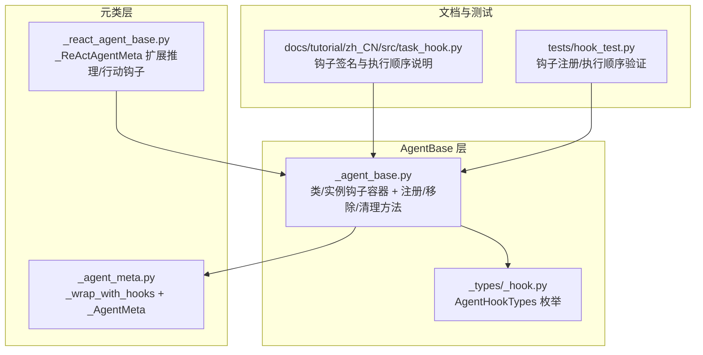
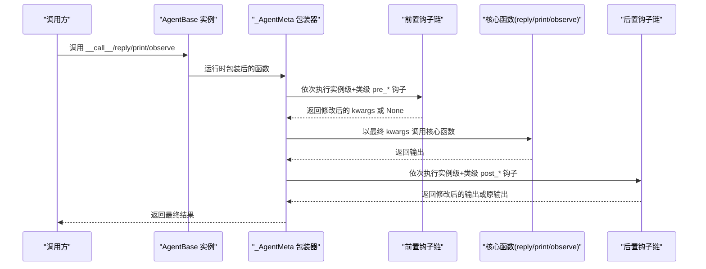
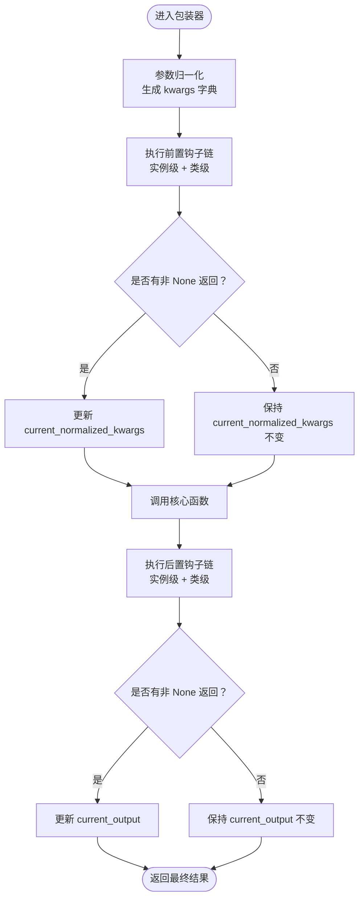
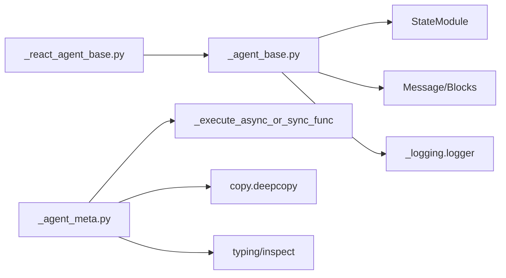

# 钩子系统机制

<cite>
**本文引用的文件列表**
- [src/agentscope/agent/_agent_base.py](file://src/agentscope/agent/_agent_base.py)
- [src/agentscope/agent/_agent_meta.py](file://src/agentscope/agent/_agent_meta.py)
- [src/agentscope/agent/_react_agent_base.py](file://src/agentscope/agent/_react_agent_base.py)
- [src/agentscope/types/_hook.py](file://src/agentscope/types/_hook.py)
- [docs/tutorial/zh_CN/src/task_hook.py](file://docs/tutorial/zh_CN/src/task_hook.py)
- [tests/hook_test.py](file://tests/hook_test.py)
</cite>

## 目录
1. [引言](#引言)
2. [项目结构](#项目结构)
3. [核心组件](#核心组件)
4. [架构总览](#架构总览)
5. [详细组件分析](#详细组件分析)
6. [依赖关系分析](#依赖关系分析)
7. [性能考量](#性能考量)
8. [故障排查指南](#故障排查指南)
9. [结论](#结论)
10. [附录](#附录)

## 引言
本文件系统性解析 AgentBase 的类级别与实例级别的钩子系统，覆盖六种支持的钩子类型（pre/post_reply、pre/post_print、pre/post_observe）的触发时机与执行顺序；解释注册方法 register_class_hook、register_instance_hook 的使用方式；阐述 OrderedDict 如何保证钩子执行顺序，以及深拷贝参数在钩子链中的传递机制；明确钩子函数的签名规范、返回值处理逻辑与异常传播行为，并给出典型应用场景（日志注入、输入预处理、输出后处理）的实现思路。

## 项目结构
AgentBase 钩子系统由“元类包装 + 实例/类两级钩子容器 + 统一的钩子签名”构成：
- 元类负责在运行时将核心函数（reply/print/observe）包裹为带钩子的异步包装器
- AgentBase 提供实例级与类级钩子字典（OrderedDict），并暴露注册/移除/清理接口
- ReActAgentBase 在 AgentBase 基础上扩展了推理与行动阶段的钩子
- 类型定义约束钩子类型枚举

图表来源
- [src/agentscope/agent/_agent_base.py](file://src/agentscope/agent/_agent_base.py#L1-L180)
- [src/agentscope/agent/_agent_meta.py](file://src/agentscope/agent/_agent_meta.py#L1-L181)
- [src/agentscope/agent/_react_agent_base.py](file://src/agentscope/agent/_react_agent_base.py#L1-L117)
- [src/agentscope/types/_hook.py](file://src/agentscope/types/_hook.py#L1-L26)
- [docs/tutorial/zh_CN/src/task_hook.py](file://docs/tutorial/zh_CN/src/task_hook.py#L1-L287)
- [tests/hook_test.py](file://tests/hook_test.py#L1-L789)

章节来源
- [src/agentscope/agent/_agent_base.py](file://src/agentscope/agent/_agent_base.py#L1-L180)
- [src/agentscope/agent/_agent_meta.py](file://src/agentscope/agent/_agent_meta.py#L1-L181)
- [src/agentscope/agent/_react_agent_base.py](file://src/agentscope/agent/_react_agent_base.py#L1-L117)
- [src/agentscope/types/_hook.py](file://src/agentscope/types/_hook.py#L1-L26)
- [docs/tutorial/zh_CN/src/task_hook.py](file://docs/tutorial/zh_CN/src/task_hook.py#L1-L287)
- [tests/hook_test.py](file://tests/hook_test.py#L1-L789)

## 核心组件
- 支持的钩子类型：pre_reply、post_reply、pre_print、post_print、pre_observe、post_observe
- 钩子容器：
  - 类级：_class_pre_*_hooks、_class_post_*_hooks
  - 实例级：_instance_pre_*_hooks、_instance_post_*_hooks
- 注册/移除/清理：
  - 类级：register_class_hook、remove_class_hook、clear_class_hooks
  - 实例级：register_instance_hook、remove_instance_hook、clear_instance_hooks
- 元类包装：_wrap_with_hooks 将核心函数包裹为带钩子的异步包装器

章节来源
- [src/agentscope/agent/_agent_base.py](file://src/agentscope/agent/_agent_base.py#L30-L180)
- [src/agentscope/agent/_agent_meta.py](file://src/agentscope/agent/_agent_meta.py#L55-L145)
- [src/agentscope/types/_hook.py](file://src/agentscope/types/_hook.py#L1-L26)

## 架构总览
下图展示了元类如何在运行时对核心函数进行钩子包装，以及实例级与类级钩子的执行顺序。

图表来源
- [src/agentscope/agent/_agent_meta.py](file://src/agentscope/agent/_agent_meta.py#L55-L145)
- [src/agentscope/agent/_agent_base.py](file://src/agentscope/agent/_agent_base.py#L491-L689)

## 详细组件分析

### 钩子类型与触发时机
- pre_reply/post_reply：在 reply 核心函数前后执行
- pre_print/post_print：在 print 核心函数前后执行
- pre_observe/post_observe：在 observe 核心函数前后执行
- ReActAgentBase 还支持 pre_reasoning/post_reasoning、pre_acting/post_acting（不在本节讨论范围内）

章节来源
- [src/agentscope/agent/_agent_base.py](file://src/agentscope/agent/_agent_base.py#L30-L139)
- [src/agentscope/agent/_react_agent_base.py](file://src/agentscope/agent/_react_agent_base.py#L1-L117)

### 执行顺序与容器保证
- 执行顺序：实例级前置钩子 + 类级前置钩子，核心函数，实例级后置钩子 + 类级后置钩子
- 顺序保证：所有钩子容器均为 OrderedDict，注册即入队，遍历顺序即注册顺序
- 测试验证：测试用例覆盖了多钩子串联、同步/异步混用、返回值处理等场景

章节来源
- [src/agentscope/agent/_agent_meta.py](file://src/agentscope/agent/_agent_meta.py#L92-L142)
- [tests/hook_test.py](file://tests/hook_test.py#L208-L789)

### 参数传递与深拷贝机制
- 参数归一化：将位置参数与关键字参数绑定到目标函数签名，生成 kwargs 字典
- 深拷贝策略：
  - 前置钩子：每次传入 deepcopy(current_normalized_kwargs)，确保钩子间不互相污染
  - 后置钩子：传入 deepcopy(current_normalized_kwargs) 与 deepcopy(current_output)
- 返回值处理：
  - 若钩子返回 dict[str, Any]，则作为新的 kwargs 传给后续钩子或核心函数
  - 若返回 None，则跳过本次修改，后续钩子仍使用最近一次非 None 的 kwargs
  - 若所有钩子返回 None，则核心函数接收原始参数的深拷贝副本

章节来源
- [src/agentscope/agent/_agent_meta.py](file://src/agentscope/agent/_agent_meta.py#L21-L53)
- [src/agentscope/agent/_agent_meta.py](file://src/agentscope/agent/_agent_meta.py#L92-L142)
- [docs/tutorial/zh_CN/src/task_hook.py](file://docs/tutorial/zh_CN/src/task_hook.py#L197-L209)

### 钩子函数签名规范
- 前置钩子签名：(self, kwargs) -> dict[str, Any] | None
- 后置钩子签名：(self, kwargs, output) -> Any
- 注意：所有参数均以 kwargs 形式传入，且 kwargs 内部包含 args、kwargs 与其他键

章节来源
- [src/agentscope/agent/_agent_meta.py](file://src/agentscope/agent/_agent_meta.py#L55-L145)
- [docs/tutorial/zh_CN/src/task_hook.py](file://docs/tutorial/zh_CN/src/task_hook.py#L69-L144)

### 注册与管理方法
- 实例级注册/移除/清理：register_instance_hook、remove_instance_hook、clear_instance_hooks
- 类级注册/移除/清理：register_class_hook、remove_class_hook、clear_class_hooks
- 类型约束：AgentHookTypes 限定合法钩子类型

章节来源
- [src/agentscope/agent/_agent_base.py](file://src/agentscope/agent/_agent_base.py#L491-L689)
- [src/agentscope/types/_hook.py](file://src/agentscope/types/_hook.py#L1-L26)

### 元类包装流程
- _wrap_with_hooks：将原始函数包装为异步包装器，负责参数归一化、前置钩子链、核心函数调用、后置钩子链
- _AgentMeta：在类构建时对 reply/print/observe 进行包装
- _ReActAgentMeta：在类构建时对 _reasoning/_acting 进行包装（扩展钩子）

图表来源
- [src/agentscope/agent/_agent_meta.py](file://src/agentscope/agent/_agent_meta.py#L55-L145)

章节来源
- [src/agentscope/agent/_agent_meta.py](file://src/agentscope/agent/_agent_meta.py#L55-L145)

### 类级别与实例级别的隔离与继承
- 类级别钩子对类的所有实例生效
- 实例级别钩子仅对该实例生效
- 测试用例展示了不同继承层级下的钩子隔离与执行顺序

章节来源
- [tests/hook_test.py](file://tests/hook_test.py#L617-L777)

## 依赖关系分析
- AgentBase 依赖：
  - StateModule（状态模块基类）
  - Message/Block（消息与内容块）
  - 日志记录器
- 元类依赖：
  - _execute_async_or_sync_func（统一执行异步/同步钩子）
  - copy.deepcopy（参数深拷贝）
  - typing/inspect（类型与签名绑定）

图表来源
- [src/agentscope/agent/_agent_base.py](file://src/agentscope/agent/_agent_base.py#L1-L180)
- [src/agentscope/agent/_agent_meta.py](file://src/agentscope/agent/_agent_meta.py#L1-L181)
- [src/agentscope/agent/_react_agent_base.py](file://src/agentscope/agent/_react_agent_base.py#L1-L117)

章节来源
- [src/agentscope/agent/_agent_base.py](file://src/agentscope/agent/_agent_base.py#L1-L180)
- [src/agentscope/agent/_agent_meta.py](file://src/agentscope/agent/_agent_meta.py#L1-L181)
- [src/agentscope/agent/_react_agent_base.py](file://src/agentscope/agent/_react_agent_base.py#L1-L117)

## 性能考量
- 深拷贝成本：每次前置/后置钩子都会对 kwargs 与输出进行深拷贝，建议控制钩子数量与数据规模
- 钩子链长度：钩子越多，串行执行时间越长，应按需注册
- 异步/同步混用：异步钩子会引入事件循环调度开销，尽量保持钩子轻量

## 故障排查指南
- 注册顺序错误：确认实例级钩子在类级钩子之前注册，以获得预期的叠加效果
- 返回值类型错误：前置钩子必须返回 dict[str, Any] 或 None，否则会抛出断言异常
- 参数未生效：若所有前置钩子返回 None，最终将使用原始参数副本，检查钩子是否正确修改 kwargs
- 钩子冲突：多个钩子对同一字段进行修改时，注意最终顺序决定谁生效
- 测试参考：可参照测试用例验证注册、执行顺序与返回值处理

章节来源
- [src/agentscope/agent/_agent_meta.py](file://src/agentscope/agent/_agent_meta.py#L92-L142)
- [tests/hook_test.py](file://tests/hook_test.py#L208-L789)

## 结论
AgentBase 的钩子系统通过元类在运行时对核心函数进行包装，结合实例级与类级的 OrderedDict 钩子容器，实现了稳定、可扩展、可隔离的钩子链执行模型。深拷贝参数与严格的返回值规范保证了钩子链的安全性与可预测性。遵循本文的签名规范、返回值处理与异常传播规则，即可在不侵入核心逻辑的前提下，灵活地实现日志注入、输入预处理、输出后处理等常见场景。

## 附录

### 使用示例路径（代码片段路径）
- 注册类钩子与实例钩子的示例路径：
  - [docs/tutorial/zh_CN/src/task_hook.py](file://docs/tutorial/zh_CN/src/task_hook.py#L211-L287)
- 钩子注册/移除/清理方法的示例路径：
  - [src/agentscope/agent/_agent_base.py](file://src/agentscope/agent/_agent_base.py#L491-L689)
- 钩子执行顺序与返回值处理的测试路径：
  - [tests/hook_test.py](file://tests/hook_test.py#L208-L789)

### 典型应用场景
- 日志注入：在 pre_reply/pre_print/pre_observe 中追加日志上下文，便于追踪与审计
- 输入预处理：在 pre_reply/pre_print/pre_observe 中校验/转换/增强输入参数
- 输出后处理：在 post_reply/post_print/post_observe 中格式化/压缩/上报输出结果
- 条件拦截：在 pre_* 钩子中根据条件直接返回修改后的 kwargs 或短路核心函数（需谨慎使用）