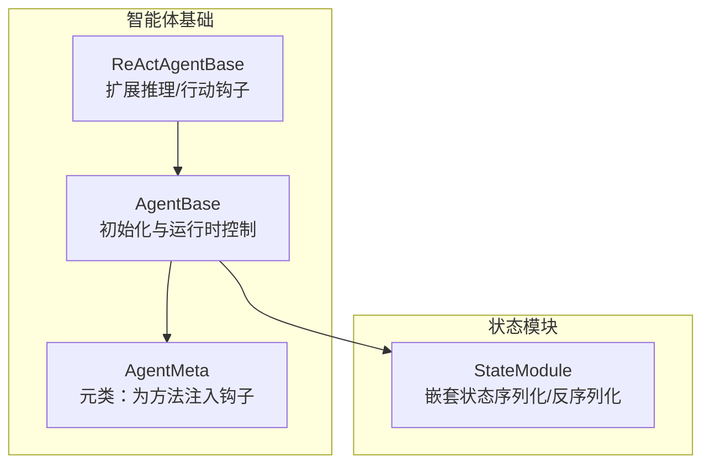
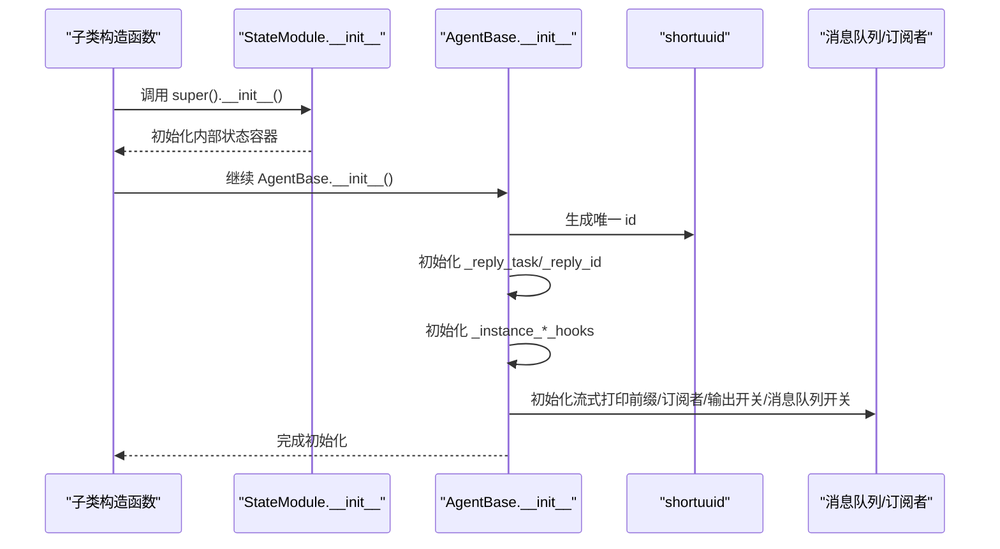
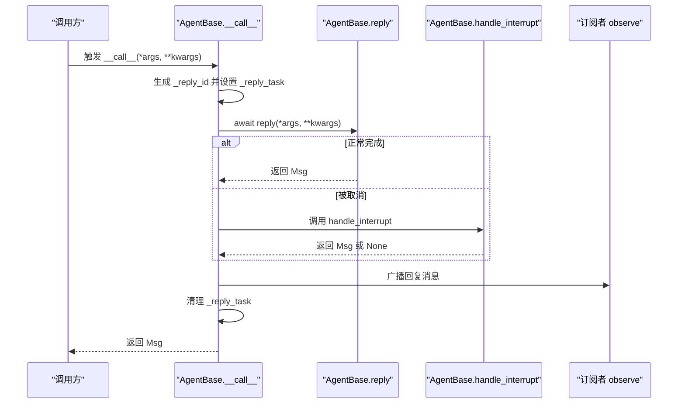
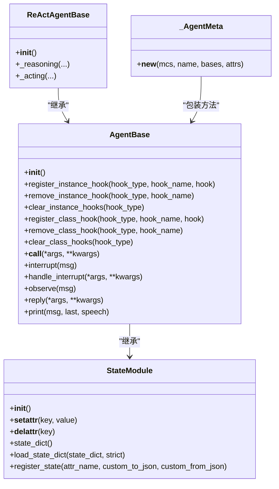
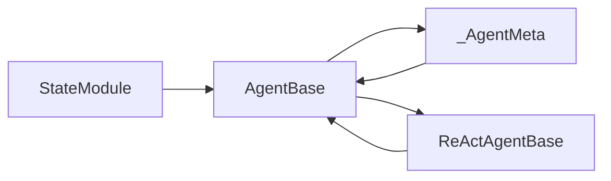

# 智能体初始化流程

<cite>
**本文引用的文件**
- [src/agentscope/agent/_agent_base.py](file://src/agentscope/agent/_agent_base.py)
- [src/agentscope/module/_state_module.py](file://src/agentscope/module/_state_module.py)
- [src/agentscope/agent/_agent_meta.py](file://src/agentscope/agent/_agent_meta.py)
- [src/agentscope/agent/_react_agent_base.py](file://src/agentscope/agent/_react_agent_base.py)
</cite>

## 目录
1. [引言](#引言)
2. [项目结构](#项目结构)
3. [核心组件](#核心组件)
4. [架构总览](#架构总览)
5. [详细组件分析](#详细组件分析)
6. [依赖分析](#依赖分析)
7. [性能考虑](#性能考虑)
8. [故障排查指南](#故障排查指南)
9. [结论](#结论)

## 引言
本文件围绕智能体（Agent）的初始化流程展开，重点解析 AgentBase 类的 __init__ 方法中各属性的初始化顺序与职责，深入说明：
- id 属性如何通过 shortuuid 生成唯一标识符；
- _reply_task 与 _reply_id 如何协同管理回复任务；
- _instance_*_hooks 字典如何初始化以支持实例级钩子；
- StateModule 在状态持久化中的作用；
- 通过 super().__init__() 确保正确继承；
- 初始化过程的最佳实践：确保调用父类构造函数、避免属性冲突等。

## 项目结构
本次分析聚焦于智能体基类及其相关模块：
- AgentBase：异步智能体基类，负责初始化、钩子系统、消息打印与订阅广播等；
- StateModule：状态模块，提供嵌套状态序列化/反序列化能力；
- _AgentMeta：元类，为 reply/print/observe 等方法注入预/后置钩子；
- ReActAgentBase：扩展了推理与行动阶段的钩子，演示如何在子类中补充实例级钩子字典。

图表来源
- [src/agentscope/agent/_agent_base.py](file://src/agentscope/agent/_agent_base.py#L140-L189)
- [src/agentscope/module/_state_module.py](file://src/agentscope/module/_state_module.py#L20-L152)
- [src/agentscope/agent/_agent_meta.py](file://src/agentscope/agent/_agent_meta.py#L147-L181)
- [src/agentscope/agent/_react_agent_base.py](file://src/agentscope/agent/_react_agent_base.py#L12-L117)

章节来源
- [src/agentscope/agent/_agent_base.py](file://src/agentscope/agent/_agent_base.py#L140-L189)
- [src/agentscope/module/_state_module.py](file://src/agentscope/module/_state_module.py#L20-L152)
- [src/agentscope/agent/_agent_meta.py](file://src/agentscope/agent/_agent_meta.py#L147-L181)
- [src/agentscope/agent/_react_agent_base.py](file://src/agentscope/agent/_react_agent_base.py#L12-L117)

## 核心组件
- AgentBase：定义智能体的生命周期、钩子系统、消息打印、订阅广播、中断处理等；其 __init__ 负责完成关键属性的初始化与默认配置。
- StateModule：提供嵌套状态跟踪与序列化/反序列化能力，要求在子类构造函数中先调用 super().__init__() 完成内部状态容器的初始化。
- _AgentMeta：元类，动态包装 reply/print/observe 方法，按注册顺序执行实例级与类级钩子。
- ReActAgentBase：在 AgentBase 基础上扩展“推理/行动”阶段的钩子字典，展示如何在子类中补充实例级钩子。

章节来源
- [src/agentscope/agent/_agent_base.py](file://src/agentscope/agent/_agent_base.py#L140-L189)
- [src/agentscope/module/_state_module.py](file://src/agentscope/module/_state_module.py#L20-L152)
- [src/agentscope/agent/_agent_meta.py](file://src/agentscope/agent/_agent_meta.py#L147-L181)
- [src/agentscope/agent/_react_agent_base.py](file://src/agentscope/agent/_react_agent_base.py#L92-L117)

## 架构总览
AgentBase 的初始化流程由三部分组成：
- 先调用父类 StateModule 的构造函数，完成内部状态容器的初始化；
- 再设置智能体唯一标识 id；
- 初始化回复任务与标识 _reply_task/_reply_id；
- 初始化实例级钩子字典（_instance_*_hooks）；
- 初始化流式打印前缀缓存、订阅者映射、控制台输出开关、消息队列开关等。

图表来源
- [src/agentscope/agent/_agent_base.py](file://src/agentscope/agent/_agent_base.py#L140-L189)
- [src/agentscope/module/_state_module.py](file://src/agentscope/module/_state_module.py#L24-L48)

## 详细组件分析

### AgentBase.__init__ 初始化顺序与职责
- 调用父类构造函数：确保 StateModule 的内部状态容器（_module_dict、_attribute_dict）被正确初始化，后续对 StateModule 实例或注册属性的访问才不会触发异常。
- 生成唯一 id：使用 shortuuid.uuid() 为智能体分配全局唯一的标识符，便于日志追踪、会话关联与调试。
- 回复任务与标识：
  - _reply_task：保存当前正在执行的 asyncio.Task 对象，用于中断控制；
  - _reply_id：每次调用智能体（__call__）时生成新的唯一标识，用于区分不同轮次的回复。
- 实例级钩子字典：
  - 初始化 _instance_pre_print_hooks、_instance_post_print_hooks、_instance_pre_reply_hooks、_instance_post_reply_hooks、_instance_pre_observe_hooks、_instance_post_observe_hooks 等有序字典，用于存储实例级钩子。
- 流式打印前缀缓存：_stream_prefix 用于缓存每个消息 id 的文本与音频流式数据，保证终端输出的连续性与一致性。
- 订阅者管理：_subscribers 以消息 Hub 名称为键，维护订阅该智能体回复的其他智能体列表。
- 控制台输出与消息队列：
  - _disable_console_output：根据环境变量 AGENTSCOPE_DISABLE_CONSOLE_OUTPUT 判断是否禁用控制台输出；
  - _disable_msg_queue 与 msg_queue：控制消息队列开关与队列实例，支持流式输出导出。

章节来源
- [src/agentscope/agent/_agent_base.py](file://src/agentscope/agent/_agent_base.py#L140-L189)

### id 属性与 shortuuid 唯一标识
- 使用 shortuuid.uuid() 生成随机字符串作为智能体 id，具备良好的唯一性与可读性，适合在分布式或多进程场景中作为稳定标识。
- 该 id 在智能体生命周期内保持不变，可用于日志、持久化、UI 显示等场景。

章节来源
- [src/agentscope/agent/_agent_base.py](file://src/agentscope/agent/_agent_base.py#L140-L149)

### _reply_task 与 _reply_id 协同管理回复任务
- _reply_task：在 __call__ 中设置为当前 asyncio.current_task()，用于后续中断控制（interrupt）。
- _reply_id：在 __call__ 中为每次调用生成唯一标识，便于区分不同轮次的回复，也用于流式输出与订阅广播的上下文关联。
- 中断机制：当收到取消信号（CancelledError）时，进入 handle_interrupt 流程，最终仍会广播回复消息并清理 _reply_task。

图表来源
- [src/agentscope/agent/_agent_base.py](file://src/agentscope/agent/_agent_base.py#L444-L463)
- [src/agentscope/agent/_agent_base.py](file://src/agentscope/agent/_agent_base.py#L474-L485)

章节来源
- [src/agentscope/agent/_agent_base.py](file://src/agentscope/agent/_agent_base.py#L444-L463)
- [src/agentscope/agent/_agent_base.py](file://src/agentscope/agent/_agent_base.py#L474-L485)

### _instance_*_hooks 字典初始化与钩子系统
- AgentBase 在 __init__ 中初始化六类实例级钩子字典（print/reply/observe 的 pre/post），类型为有序字典，保证钩子执行顺序与注册顺序一致。
- 钩子注册/移除/清空接口：
  - register_instance_hook/remove_instance_hook/clear_instance_hooks：仅对当前实例生效；
  - register_class_hook/remove_class_hook/clear_class_hooks：对类的所有实例生效。
- 元类 _AgentMeta 会在类创建时包装 reply/print/observe 方法，按注册顺序执行实例级与类级钩子，支持异步/同步钩子混用。

图表来源
- [src/agentscope/module/_state_module.py](file://src/agentscope/module/_state_module.py#L20-L152)
- [src/agentscope/agent/_agent_base.py](file://src/agentscope/agent/_agent_base.py#L140-L189)
- [src/agentscope/agent/_agent_meta.py](file://src/agentscope/agent/_agent_meta.py#L147-L181)
- [src/agentscope/agent/_react_agent_base.py](file://src/agentscope/agent/_react_agent_base.py#L92-L117)

章节来源
- [src/agentscope/agent/_agent_base.py](file://src/agentscope/agent/_agent_base.py#L491-L547)
- [src/agentscope/agent/_agent_base.py](file://src/agentscope/agent/_agent_base.py#L548-L604)
- [src/agentscope/agent/_agent_base.py](file://src/agentscope/agent/_agent_base.py#L629-L658)
- [src/agentscope/agent/_agent_meta.py](file://src/agentscope/agent/_agent_meta.py#L55-L145)
- [src/agentscope/agent/_react_agent_base.py](file://src/agentscope/agent/_react_agent_base.py#L92-L117)

### StateModule 在状态持久化中的作用
- StateModule 提供嵌套状态序列化/反序列化能力：
  - 内部维护两个有序字典：_module_dict（记录 StateModule 实例属性）、_attribute_dict（记录普通属性及其自定义序列化函数）；
  - __setattr__/__delattr__ 在设置/删除属性时自动维护上述字典；
  - state_dict/load_state_dict 支持递归遍历子模块与属性，严格模式下缺失键会抛错；
  - register_state 可为非原生 JSON 可序列化属性提供自定义转换函数。
- 在 AgentBase 中，由于 AgentBase 继承 StateModule，因此其状态持久化能力由 StateModule 提供，且必须在子类构造函数中先调用 super().__init__() 完成内部容器初始化。

章节来源
- [src/agentscope/module/_state_module.py](file://src/agentscope/module/_state_module.py#L20-L152)
- [src/agentscope/agent/_agent_base.py](file://src/agentscope/agent/_agent_base.py#L140-L149)

### 通过 super().__init__() 确保正确继承
- 在 AgentBase.__init__ 中，首先调用 super().__init__()，确保 StateModule 的内部状态容器初始化完成；
- 在 ReActAgentBase.__init__ 中，同样先调用 super().__init__()，再补充“推理/行动”阶段的实例级钩子字典；
- 若未先调用父类构造函数，直接设置 StateModule 实例或注册属性，StateModule.__setattr__ 会抛出错误提示先初始化内部容器。

章节来源
- [src/agentscope/agent/_agent_base.py](file://src/agentscope/agent/_agent_base.py#L140-L149)
- [src/agentscope/agent/_react_agent_base.py](file://src/agentscope/agent/_react_agent_base.py#L92-L103)
- [src/agentscope/module/_state_module.py](file://src/agentscope/module/_state_module.py#L24-L48)

### 初始化过程最佳实践
- 必须先调用父类构造函数：在子类构造函数中，应先调用 super().__init__()，以确保父类内部状态容器初始化完成，避免后续设置属性时报错。
- 避免属性冲突：实例级钩子字典命名规范为 _instance_*_hooks，类级钩子字典为 _class_*_hooks，二者不可混淆；注册/移除/清空时需指定正确的 hook_type。
- 合理使用钩子：优先使用实例级钩子以限定影响范围；必要时使用类级钩子以统一行为。
- 控制台输出与消息队列：生产环境可通过环境变量禁用控制台输出；若启用流式输出，需确保消息队列已正确初始化。

章节来源
- [src/agentscope/agent/_agent_base.py](file://src/agentscope/agent/_agent_base.py#L629-L658)
- [src/agentscope/agent/_agent_base.py](file://src/agentscope/agent/_agent_base.py#L708-L733)
- [src/agentscope/module/_state_module.py](file://src/agentscope/module/_state_module.py#L24-L48)

## 依赖分析
- AgentBase 继承自 StateModule，并以元类 _AgentMeta 包装核心方法；
- ReActAgentBase 在 AgentBase 基础上扩展“推理/行动”钩子，体现多态与扩展性；
- 钩子系统通过元类在类创建时注入，运行时按注册顺序执行，支持异步/同步钩子混用。

图表来源
- [src/agentscope/module/_state_module.py](file://src/agentscope/module/_state_module.py#L20-L152)
- [src/agentscope/agent/_agent_base.py](file://src/agentscope/agent/_agent_base.py#L140-L189)
- [src/agentscope/agent/_agent_meta.py](file://src/agentscope/agent/_agent_meta.py#L147-L181)
- [src/agentscope/agent/_react_agent_base.py](file://src/agentscope/agent/_react_agent_base.py#L12-L117)

章节来源
- [src/agentscope/agent/_agent_base.py](file://src/agentscope/agent/_agent_base.py#L140-L189)
- [src/agentscope/agent/_agent_meta.py](file://src/agentscope/agent/_agent_meta.py#L147-L181)
- [src/agentscope/agent/_react_agent_base.py](file://src/agentscope/agent/_react_agent_base.py#L12-L117)

## 性能考虑
- 钩子链路：pre/post 钩子按注册顺序执行，建议减少不必要的复杂逻辑，避免阻塞主流程；
- 流式输出：_stream_prefix 缓存文本与音频流数据，注意在长对话中及时清理不再使用的键，防止内存增长；
- 消息队列：启用消息队列时，合理设置队列容量与消费速度，避免阻塞主协程。

## 故障排查指南
- “请先在构造函数中调用 super().__init__()”：通常发生在未先初始化 StateModule 内部容器的情况下设置 StateModule 实例或注册属性；
- “未找到钩子字典”：在 clear_instance_hooks 时若未先调用父类构造函数，会导致实例级钩子字典未初始化；
- “钩子返回值类型不正确”：pre/post 钩子必须返回字典或 None，否则会触发断言失败；
- “控制台输出异常”：检查环境变量 AGENTSCOPE_DISABLE_CONSOLE_OUTPUT 与 set_console_output_enabled 的使用。

章节来源
- [src/agentscope/module/_state_module.py](file://src/agentscope/module/_state_module.py#L24-L48)
- [src/agentscope/agent/_agent_base.py](file://src/agentscope/agent/_agent_base.py#L629-L658)
- [src/agentscope/agent/_agent_meta.py](file://src/agentscope/agent/_agent_meta.py#L86-L117)

## 结论
AgentBase 的初始化流程以“先父类、后子类”的顺序组织，确保 StateModule 的状态容器先就绪，随后完成智能体唯一标识、回复任务管理、实例级钩子字典、流式输出与订阅者等关键属性的初始化。借助 StateModule 的嵌套状态持久化能力与 _AgentMeta 的钩子注入机制，智能体具备良好的扩展性与可观测性。遵循“先调用父类构造函数、避免属性冲突、谨慎使用钩子”的最佳实践，可显著提升系统的稳定性与可维护性。