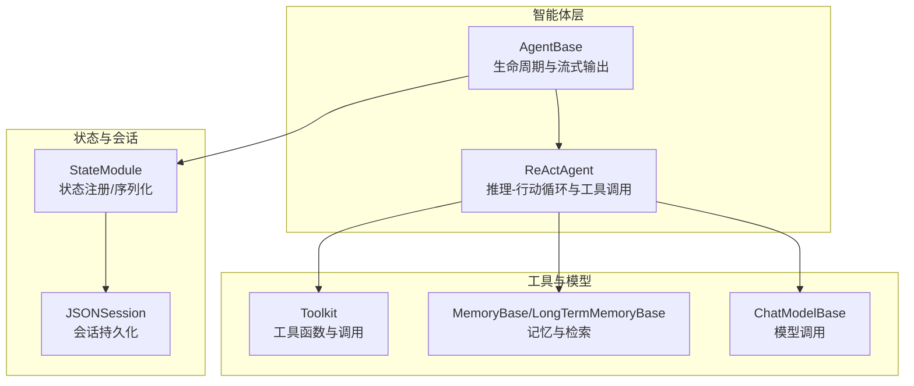
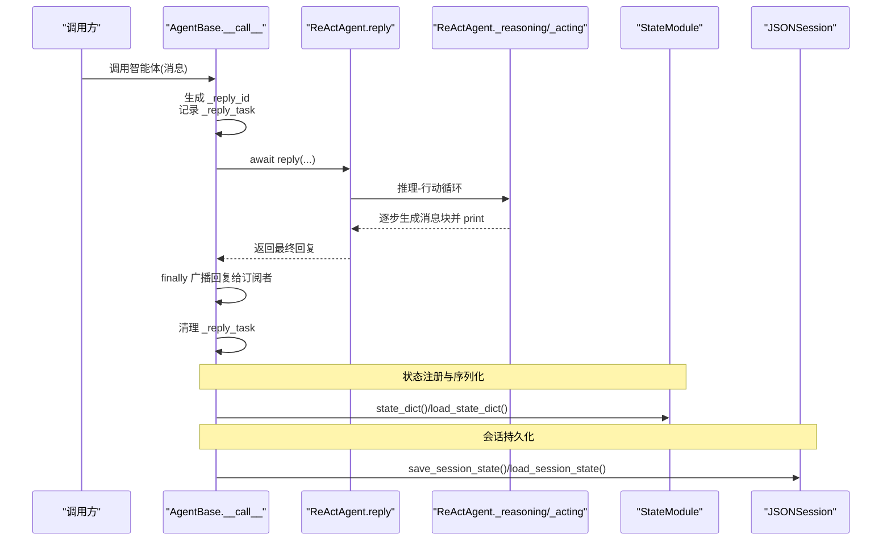
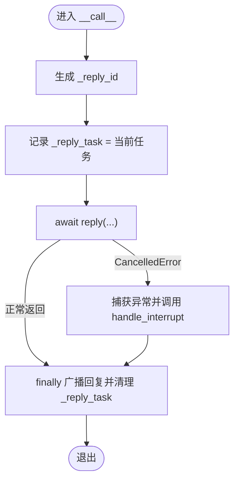
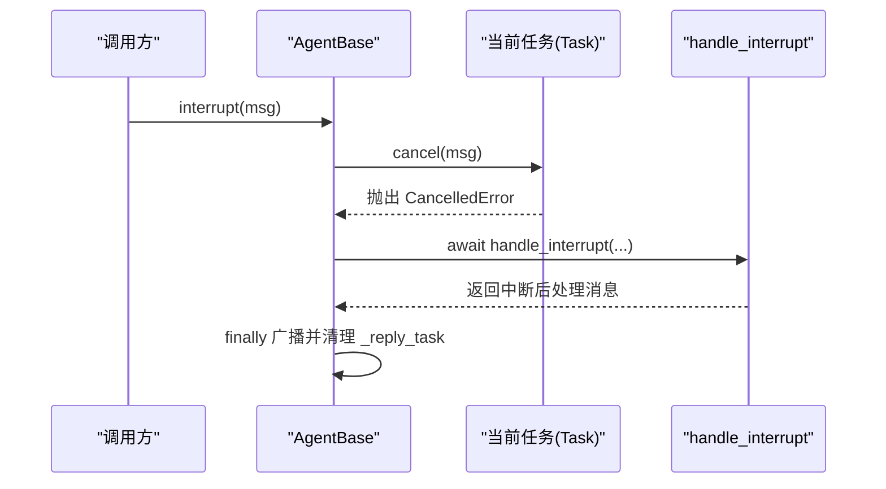
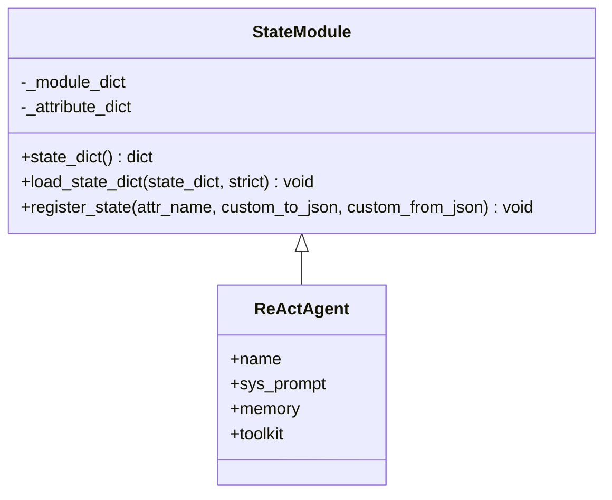
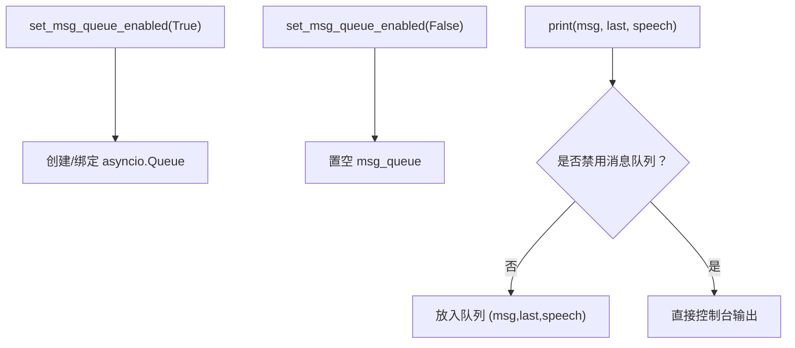
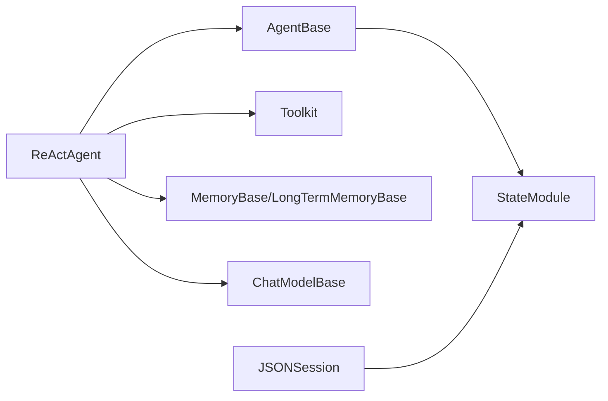

# 智能体状态与生命周期管理

<cite>
**本文引用的文件**
- [src/agentscope/agent/_agent_base.py](file://src/agentscope/agent/_agent_base.py)
- [src/agentscope/agent/_react_agent.py](file://src/agentscope/agent/_react_agent.py)
- [src/agentscope/module/_state_module.py](file://src/agentscope/module/_state_module.py)
- [src/agentscope/session/_json_session.py](file://src/agentscope/session/_json_session.py)
- [examples/functionality/stream_printing_messages/single_agent.py](file://examples/functionality/stream_printing_messages/single_agent.py)
- [examples/functionality/stream_printing_messages/multi_agent.py](file://examples/functionality/stream_printing_messages/multi_agent.py)
- [docs/tutorial/zh_CN/src/task_state.py](file://docs/tutorial/zh_CN/src/task_state.py)
- [docs/tutorial/zh_CN/src/task_agent.py](file://docs/tutorial/zh_CN/src/task_agent.py)
- [docs/tutorial/zh_CN/src/task_tool.py](file://docs/tutorial/zh_CN/src/task_tool.py)
</cite>

## 目录
1. [引言](#引言)
2. [项目结构](#项目结构)
3. [核心组件](#核心组件)
4. [架构总览](#架构总览)
5. [详细组件分析](#详细组件分析)
6. [依赖关系分析](#依赖关系分析)
7. [性能考量](#性能考量)
8. [故障排查指南](#故障排查指南)
9. [结论](#结论)
10. [附录](#附录)

## 引言
本文件围绕智能体的生命周期管理进行系统性阐述，重点覆盖以下主题：
- 初始化、运行、中断与销毁各阶段的行为与控制流
- _reply_task 与 _reply_id 如何协同管理并发回复任务
- interrupt() 方法的实现原理及其与 asyncio.CancelledError 的集成
- 通过 StateModule 的状态持久化与序列化机制
- _msg_queue 在流式输出中的作用以及 set_msg_queue_enabled 的控制策略
- 生命周期事件（启动前、回复后）的最佳实践与常见陷阱

## 项目结构
AgentScope 的智能体生命周期与状态管理由多模块协作完成：
- AgentBase：异步智能体基类，负责生命周期入口、中断、订阅广播、流式输出队列与钩子
- ReActAgent：具体智能体实现，封装推理-行动循环、工具调用、记忆与长短期记忆交互
- StateModule：状态注册、序列化/反序列化与嵌套状态管理
- JSONSession：会话级状态持久化与加载
- 示例与教程：展示流式输出、状态管理与中断处理的实际用法

图表来源
- [src/agentscope/agent/_agent_base.py](file://src/agentscope/agent/_agent_base.py#L1-L120)
- [src/agentscope/agent/_react_agent.py](file://src/agentscope/agent/_react_agent.py#L1-L120)
- [src/agentscope/module/_state_module.py](file://src/agentscope/module/_state_module.py#L1-L60)
- [src/agentscope/session/_json_session.py](file://src/agentscope/session/_json_session.py#L1-L80)

章节来源
- [src/agentscope/agent/_agent_base.py](file://src/agentscope/agent/_agent_base.py#L1-L120)
- [src/agentscope/agent/_react_agent.py](file://src/agentscope/agent/_react_agent.py#L1-L120)
- [src/agentscope/module/_state_module.py](file://src/agentscope/module/_state_module.py#L1-L60)

## 核心组件
- AgentBase：提供智能体生命周期入口 __call__、中断 interrupt、订阅广播 _broadcast_to_subscribers、流式输出 print 与消息队列 set_msg_queue_enabled 等能力；同时继承 StateModule，具备状态注册与序列化能力。
- ReActAgent：在 AgentBase 基础上实现推理-行动循环，支持并行/串行工具调用、结构化输出、RAG 检索、长短期记忆交互，并覆盖 handle_interrupt 以处理中断后的后处理逻辑。
- StateModule：提供 register_state、state_dict、load_state_dict 与嵌套状态管理，支撑智能体、记忆、工具包等对象的状态持久化。
- JSONSession：提供 save_session_state/load_session_state，将状态写入/读取到 JSON 文件，便于跨进程/跨会话恢复。

章节来源
- [src/agentscope/agent/_agent_base.py](file://src/agentscope/agent/_agent_base.py#L140-L220)
- [src/agentscope/agent/_react_agent.py](file://src/agentscope/agent/_react_agent.py#L233-L248)
- [src/agentscope/module/_state_module.py](file://src/agentscope/module/_state_module.py#L108-L152)
- [src/agentscope/session/_json_session.py](file://src/agentscope/session/_json_session.py#L1-L80)

## 架构总览
智能体生命周期的关键流程如下：
- 初始化：AgentBase.__init__ 设置 _reply_task/_reply_id、订阅者表、消息队列开关与控制台输出开关
- 运行：AgentBase.__call__ 生成 _reply_id，记录当前任务 Task 到 _reply_task，调用子类 reply；在 finally 中广播回复给订阅者
- 中断：AgentBase.interrupt 触发当前任务取消，捕获 asyncio.CancelledError 并调用 handle_interrupt
- 销毁：finally 清理 _reply_task；ReActAgent 在推理/行动过程中清理中间状态并在 finally 中写入记忆
- 状态：StateModule 负责状态注册与序列化；JSONSession 负责会话级持久化

图表来源
- [src/agentscope/agent/_agent_base.py](file://src/agentscope/agent/_agent_base.py#L444-L463)
- [src/agentscope/agent/_react_agent.py](file://src/agentscope/agent/_react_agent.py#L253-L408)
- [src/agentscope/module/_state_module.py](file://src/agentscope/module/_state_module.py#L49-L107)
- [src/agentscope/session/_json_session.py](file://src/agentscope/session/_json_session.py#L1-L80)

## 详细组件分析

### 生命周期管理：初始化、运行、中断与销毁
- 初始化
  - AgentBase.__init__ 初始化唯一标识 id、实例级钩子、流式前缀缓存、订阅者表、消息队列开关与控制台输出开关
  - ReActAgent.__init__ 在此基础上装配模型、格式化器、工具包、记忆、长短期记忆、知识库、计划笔记本等组件，并注册 name 与 _sys_prompt 等状态字段
- 运行
  - AgentBase.__call__ 生成 _reply_id，记录当前任务 Task 到 _reply_task，调用子类 reply；在 finally 中广播回复给订阅者并清理 _reply_task
  - ReActAgent.reply 实现推理-行动循环，支持结构化输出、并行/串行工具调用、RAG 检索与长短期记忆交互
- 中断
  - AgentBase.interrupt 若存在未完成的 _reply_task，则调用 cancel(msg) 触发 asyncio.CancelledError
  - 捕获 CancelledError 后调用 handle_interrupt，ReActAgent 默认返回“已注意到中断”的提示消息
- 销毁
  - AgentBase.__call__ 的 finally 清理 _reply_task
  - ReActAgent 在推理/行动 finally 中写入记忆，确保状态一致性

图表来源
- [src/agentscope/agent/_agent_base.py](file://src/agentscope/agent/_agent_base.py#L444-L463)
- [src/agentscope/agent/_react_agent.py](file://src/agentscope/agent/_react_agent.py#L658-L687)

章节来源
- [src/agentscope/agent/_agent_base.py](file://src/agentscope/agent/_agent_base.py#L140-L220)
- [src/agentscope/agent/_react_agent.py](file://src/agentscope/agent/_react_agent.py#L233-L248)
- [src/agentscope/agent/_react_agent.py](file://src/agentscope/agent/_react_agent.py#L658-L687)

### _reply_task 与 _reply_id 协同机制
- _reply_id：每次调用生成唯一标识，用于区分不同轮次的回复
- _reply_task：记录当前正在执行的 asyncio.Task，interrupt() 通过 cancel(_reply_task) 触发中断
- 协同点：
  - __call__ 中设置 _reply_id 与 _reply_task
  - interrupt() 仅对未完成的任务生效
  - finally 中清理 _reply_task，避免悬挂任务残留

章节来源
- [src/agentscope/agent/_agent_base.py](file://src/agentscope/agent/_agent_base.py#L444-L463)

### interrupt() 与 asyncio.CancelledError 集成
- AgentBase.interrupt：若存在未完成的 _reply_task，则 cancel(msg)
- __call__ 捕获 CancelledError 并调用 handle_interrupt，随后广播回复并清理任务
- ReActAgent.handle_interrupt：默认返回“已注意到中断”的提示消息，并写入记忆

图表来源
- [src/agentscope/agent/_agent_base.py](file://src/agentscope/agent/_agent_base.py#L486-L490)
- [src/agentscope/agent/_agent_base.py](file://src/agentscope/agent/_agent_base.py#L444-L463)
- [src/agentscope/agent/_react_agent.py](file://src/agentscope/agent/_react_agent.py#L658-L687)

章节来源
- [src/agentscope/agent/_agent_base.py](file://src/agentscope/agent/_agent_base.py#L486-L490)
- [src/agentscope/agent/_react_agent.py](file://src/agentscope/agent/_react_agent.py#L658-L687)

### StateModule 状态持久化与序列化
- register_state(attr_name, custom_to_json, custom_from_json)：注册属性为状态，支持自定义 JSON 序列化/反序列化
- state_dict()：递归收集模块与已注册属性的状态
- load_state_dict(state_dict, strict)：按严格模式加载状态，缺失键可报错或跳过
- 嵌套状态：StateModule 自身可作为属性被注册，从而实现嵌套序列化

图表来源
- [src/agentscope/module/_state_module.py](file://src/agentscope/module/_state_module.py#L49-L152)
- [src/agentscope/agent/_react_agent.py](file://src/agentscope/agent/_react_agent.py#L233-L248)

章节来源
- [src/agentscope/module/_state_module.py](file://src/agentscope/module/_state_module.py#L49-L152)
- [src/agentscope/agent/_react_agent.py](file://src/agentscope/agent/_react_agent.py#L233-L248)
- [docs/tutorial/zh_CN/src/task_state.py](file://docs/tutorial/zh_CN/src/task_state.py#L1-L124)

### _msg_queue 与 set_msg_queue_enabled 在流式输出中的作用
- set_msg_queue_enabled(enabled, queue=None)：启用/禁用消息队列；启用时创建 asyncio.Queue 或使用传入队列；禁用时置空
- print(msg, last, speech)：当未禁用消息队列时，将深拷贝的 (msg, last, speech) 放入队列；随后按需输出到控制台
- 流式输出：ReActAgent._reasoning/_acting 中多次调用 print，配合 set_msg_queue_enabled 可将流式消息导出为生成器

图表来源
- [src/agentscope/agent/_agent_base.py](file://src/agentscope/agent/_agent_base.py#L708-L732)
- [src/agentscope/agent/_agent_base.py](file://src/agentscope/agent/_agent_base.py#L205-L271)
- [src/agentscope/agent/_react_agent.py](file://src/agentscope/agent/_react_agent.py#L411-L490)

章节来源
- [src/agentscope/agent/_agent_base.py](file://src/agentscope/agent/_agent_base.py#L708-L732)
- [src/agentscope/agent/_agent_base.py](file://src/agentscope/agent/_agent_base.py#L205-L271)
- [examples/functionality/stream_printing_messages/single_agent.py](file://examples/functionality/stream_printing_messages/single_agent.py#L44-L63)
- [examples/functionality/stream_printing_messages/multi_agent.py](file://examples/functionality/stream_printing_messages/multi_agent.py#L48-L63)

### 生命周期事件最佳实践与常见陷阱
- 启动前（pre_* 钩子）
  - 使用 register_class_hook/register_instance_hook 注册 pre_reply/pre_print/pre_observe 等钩子，对输入参数进行预处理或校验
  - 注意：钩子应避免阻塞，必要时使用异步钩子
- 回复后（post_* 钩子）
  - 使用 post_reply/post_print/post_observe 钩子进行日志、指标上报或状态更新
  - 避免在钩子中再次触发 interrupt，以免造成死循环
- 中断处理
  - handle_interrupt 应快速返回稳定消息，避免长时间阻塞
  - 对工具调用中断，ReActAgent 已在工具层通过 is_interrupted 标记并抛出 CancelledError，智能体可在钩子中感知
- 状态与会话
  - 使用 register_state 显式注册易变状态字段；复杂对象建议提供 custom_to_json/custom_from_json
  - 通过 JSONSession 保存/恢复会话，注意 strict 模式下的键缺失处理
- 常见陷阱
  - 忘记清理 _reply_task 导致悬挂任务
  - 在流式输出中未启用消息队列导致无法消费流式消息
  - 在钩子中直接修改内部状态而不考虑并发安全

章节来源
- [src/agentscope/agent/_agent_base.py](file://src/agentscope/agent/_agent_base.py#L491-L580)
- [src/agentscope/agent/_react_agent.py](file://src/agentscope/agent/_react_agent.py#L523-L581)
- [docs/tutorial/zh_CN/src/task_agent.py](file://docs/tutorial/zh_CN/src/task_agent.py#L74-L110)
- [docs/tutorial/zh_CN/src/task_tool.py](file://docs/tutorial/zh_CN/src/task_tool.py#L195-L271)
- [docs/tutorial/zh_CN/src/task_state.py](file://docs/tutorial/zh_CN/src/task_state.py#L1-L124)

## 依赖关系分析
- AgentBase 依赖 StateModule 提供状态能力
- ReActAgent 依赖 Toolkit/MemoryBase/LongTermMemoryBase/ChatModelBase 等组件
- JSONSession 依赖 StateModule 的 state_dict/load_state_dict

图表来源
- [src/agentscope/agent/_agent_base.py](file://src/agentscope/agent/_agent_base.py#L1-L60)
- [src/agentscope/agent/_react_agent.py](file://src/agentscope/agent/_react_agent.py#L1-L60)
- [src/agentscope/module/_state_module.py](file://src/agentscope/module/_state_module.py#L1-L40)
- [src/agentscope/session/_json_session.py](file://src/agentscope/session/_json_session.py#L1-L40)

章节来源
- [src/agentscope/agent/_agent_base.py](file://src/agentscope/agent/_agent_base.py#L1-L60)
- [src/agentscope/agent/_react_agent.py](file://src/agentscope/agent/_react_agent.py#L1-L60)
- [src/agentscope/module/_state_module.py](file://src/agentscope/module/_state_module.py#L1-L40)
- [src/agentscope/session/_json_session.py](file://src/agentscope/session/_json_session.py#L1-L40)

## 性能考量
- 并行工具调用：ReActAgent 支持 parallel_tool_calls，使用 asyncio.gather 并行执行工具调用，显著降低端到端延迟
- 流式输出：开启 set_msg_queue_enabled 并结合 print 的 last 标记，可实现低延迟的流式消费
- 记忆与检索：RAG 与长短期记忆的检索应在推理前完成，避免在流式输出中频繁阻塞
- 钩子开销：避免在钩子中执行耗时操作，必要时异步化

## 故障排查指南
- 中断无效
  - 检查是否在当前轮次内调用了 interrupt；确认 _reply_task 是否未完成
  - 参考路径：[interrupt 实现](file://src/agentscope/agent/_agent_base.py#L486-L490)
- 中断后无响应
  - 确认 handle_interrupt 是否正确返回消息并写入记忆
  - 参考路径：[handle_interrupt 默认实现](file://src/agentscope/agent/_react_agent.py#L658-L687)
- 流式输出为空
  - 检查是否启用了 set_msg_queue_enabled；确认 print 是否被禁用控制台输出
  - 参考路径：[消息队列与打印](file://src/agentscope/agent/_agent_base.py#L708-L732), [print 实现](file://src/agentscope/agent/_agent_base.py#L205-L271)
- 状态不一致
  - 使用 state_dict()/load_state_dict() 校验关键状态字段；必要时提供自定义序列化函数
  - 参考路径：[状态注册与序列化](file://src/agentscope/module/_state_module.py#L108-L152)
- 会话恢复失败
  - 检查 save_session_state/load_session_state 的参数与 strict 模式；确保对象均继承 StateModule
  - 参考路径：[会话示例](file://docs/tutorial/zh_CN/src/task_state.py#L140-L215)

章节来源
- [src/agentscope/agent/_agent_base.py](file://src/agentscope/agent/_agent_base.py#L486-L490)
- [src/agentscope/agent/_react_agent.py](file://src/agentscope/agent/_react_agent.py#L658-L687)
- [src/agentscope/agent/_agent_base.py](file://src/agentscope/agent/_agent_base.py#L708-L732)
- [src/agentscope/agent/_agent_base.py](file://src/agentscope/agent/_agent_base.py#L205-L271)
- [src/agentscope/module/_state_module.py](file://src/agentscope/module/_state_module.py#L108-L152)
- [docs/tutorial/zh_CN/src/task_state.py](file://docs/tutorial/zh_CN/src/task_state.py#L140-L215)

## 结论
AgentScope 通过 AgentBase 的生命周期入口、ReActAgent 的推理-行动循环、StateModule 的状态管理与 JSONSession 的会话持久化，构建了完整的智能体生命周期与状态体系。_reply_task 与 _reply_id 的协同保证了并发回复任务的可控性；interrupt() 与 asyncio.CancelledError 的集成提供了可靠的中断机制；_msg_queue 与 set_msg_queue_enabled 则为流式输出提供了灵活的控制手段。遵循最佳实践与规避常见陷阱，可显著提升智能体的稳定性与可观测性。

## 附录
- 示例与教程参考
  - 流式输出示例：单智能体与多智能体场景
  - 状态管理与会话示例：智能体状态快照、保存与恢复
  - 工具中断与实时介入：异步工具中断与智能体后处理

章节来源
- [examples/functionality/stream_printing_messages/single_agent.py](file://examples/functionality/stream_printing_messages/single_agent.py#L44-L63)
- [examples/functionality/stream_printing_messages/multi_agent.py](file://examples/functionality/stream_printing_messages/multi_agent.py#L48-L63)
- [docs/tutorial/zh_CN/src/task_state.py](file://docs/tutorial/zh_CN/src/task_state.py#L1-L124)
- [docs/tutorial/zh_CN/src/task_agent.py](file://docs/tutorial/zh_CN/src/task_agent.py#L74-L110)
- [docs/tutorial/zh_CN/src/task_tool.py](file://docs/tutorial/zh_CN/src/task_tool.py#L195-L271)