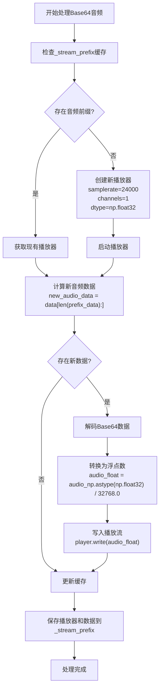
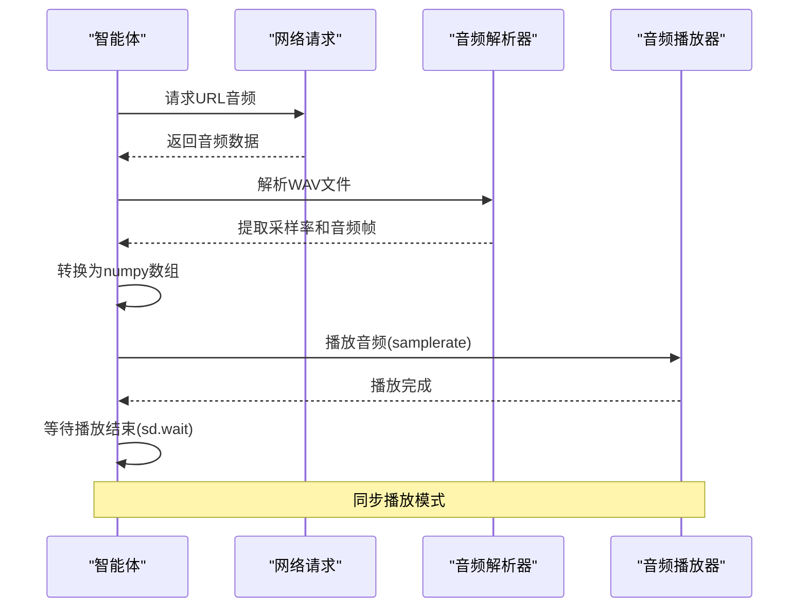
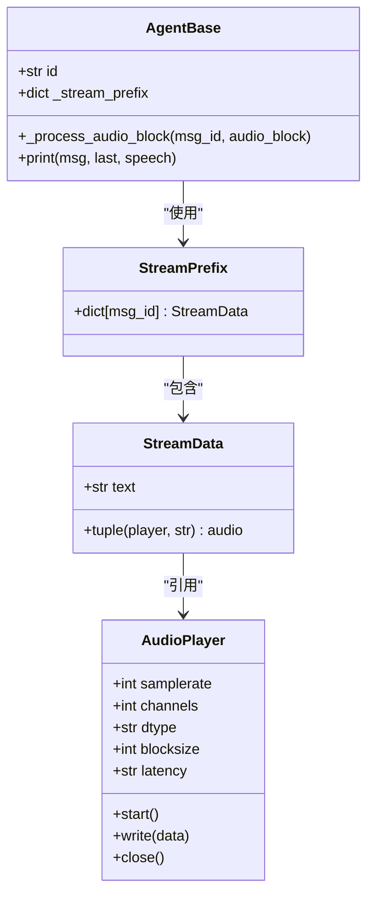
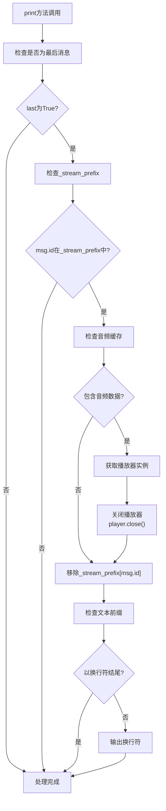
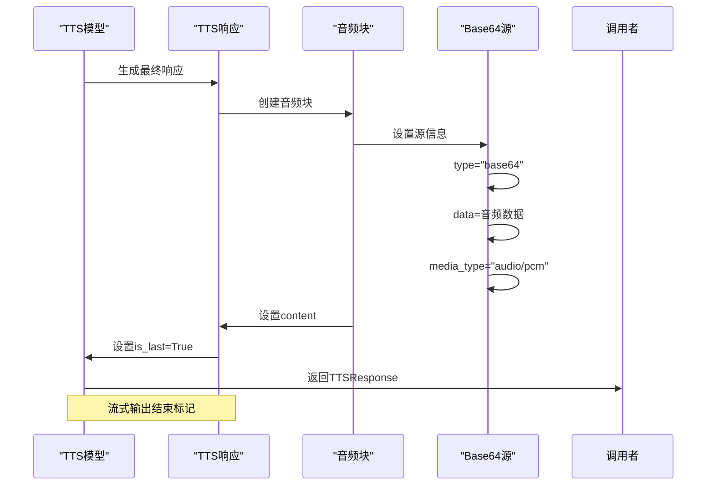
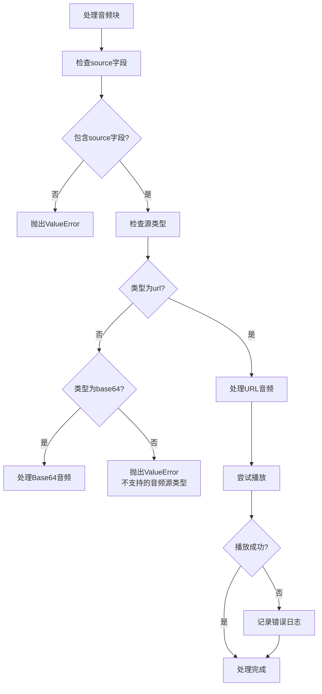

# 媒体资源管理

<cite>
**本文档引用的文件**
- [agent_base.py](file://src/agentscope/agent/_agent_base.py#L272-L364)
- [message_block.py](file://src/agentscope/message/_message_block.py#L58-L65)
- [openai_tts_model.py](file://src/agentscope/tts/_openai_tts_model.py#L173-L184)
- [dashscope_tts_model.py](file://src/agentscope/tts/_dashscope_tts_model.py#L167-L177)
- [common.py](file://src/agentscope/_utils/_common.py#L167-L184)
</cite>

## 目录
1. [音频资源处理机制](#音频资源处理机制)
2. [音频源类型处理](#音频源类型处理)
3. [流式播放与缓存管理](#流式播放与缓存管理)
4. [音频播放资源释放](#音频播放资源释放)
5. [音频格式处理实践](#音频格式处理实践)
6. [常见问题解决方案](#常见问题解决方案)

## 音频资源处理机制

智能体系统通过 `_process_audio_block` 方法处理音频资源，该方法位于 `AgentBase` 类中，负责解析和播放音频数据。该方法接收消息ID和音频块作为参数，根据音频源类型执行相应的处理逻辑。

**Section sources**
- [agent_base.py](file://src/agentscope/agent/_agent_base.py#L272-L364)

## 音频源类型处理

系统支持两种主要的音频源类型：base64编码数据和URL链接。`AudioBlock` 结构定义了音频内容的格式，其中 `source` 字段包含音频源信息。

### Base64音频源处理

当音频源类型为 "base64" 时，系统会解码base64数据并将其转换为可播放的音频流。处理流程包括：
1. 检查消息ID是否已在 `_stream_prefix` 缓存中
2. 获取或创建音频播放器实例和前缀数据
3. 解码新增的base64音频数据
4. 将解码后的音频数据写入播放流
5. 更新缓存中的播放器实例和完整音频数据



**Diagram sources**
- [agent_base.py](file://src/agentscope/agent/_agent_base.py#L319-L358)

### URL音频源处理

当音频源类型为 "url" 时，系统会从指定URL下载音频文件并直接播放。处理流程包括：
1. 使用urllib请求URL获取音频数据
2. 使用wave模块解析音频文件
3. 提取采样率、帧数和音频帧
4. 将音频数据转换为numpy数组
5. 使用sounddevice播放音频



**Diagram sources**
- [agent_base.py](file://src/agentscope/agent/_agent_base.py#L290-L311)

## 流式播放与缓存管理

系统使用 `_stream_prefix` 字典来缓存播放器实例和音频数据前缀，实现流式音频播放。这种机制允许智能体在接收到音频数据块时立即开始播放，而不需要等待完整音频数据。

### _stream_prefix缓存结构

`_stream_prefix` 缓存以消息ID为键，存储音频播放器实例和已接收的音频数据。这种设计支持：
- 持久化播放器实例，避免重复创建
- 累积音频数据，确保播放连续性
- 高效处理流式音频传输



**Diagram sources**
- [agent_base.py](file://src/agentscope/agent/_agent_base.py#L163-L164)
- [agent_base.py](file://src/agentscope/agent/_agent_base.py#L333-L339)

## 音频播放资源释放

在流式输出结束时，系统通过 `player.close()` 方法正确释放音频播放资源。这一过程在 `print` 方法中实现，当检测到 `last` 参数为 `True` 且消息ID存在于 `_stream_prefix` 中时触发。

### 资源释放流程



**Diagram sources**
- [agent_base.py](file://src/agentscope/agent/_agent_base.py#L260-L270)

**Section sources**
- [agent_base.py](file://src/agentscope/agent/_agent_base.py#L260-L270)

## 音频格式处理实践

### 音频块结构

音频块（AudioBlock）采用标准化结构，包含类型标识和源信息：

```mermaid
erDiagram
AUDIO_BLOCK {
string type PK
string source_type FK
string data
string media_type
string url
}
SOURCE_TYPE {
string type PK
string description
}
AUDIO_BLOCK ||--o{ SOURCE_TYPE : "引用"
class AUDIO_BLOCK {
type: "audio"
source: Base64Source | URLSource
}
class Base64Source {
type: "base64"
media_type: string
data: string
}
class URLSource {
type: "url"
url: string
}
```

**Diagram sources**
- [message_block.py](file://src/agentscope/message/_message_block.py#L58-L65)

### TTS模型音频输出

文本转语音（TTS）模型生成的音频通常采用base64编码格式，媒体类型为 "audio/pcm" 或带采样率的 "audio/pcm;rate=24000"。



**Diagram sources**
- [openai_tts_model.py](file://src/agentscope/tts/_openai_tts_model.py#L173-L184)
- [dashscope_tts_model.py](file://src/agentscope/tts/_dashscope_tts_model.py#L167-L177)

## 常见问题解决方案

### 音频格式兼容性

不同TTS服务可能生成不同格式的音频数据，建议统一处理为PCM格式以确保兼容性。

### 缓存管理最佳实践

1. **及时清理**：确保在流式输出结束时正确清理 `_stream_prefix` 缓存
2. **内存监控**：监控缓存大小，避免内存泄漏
3. **异常处理**：在播放异常时仍执行资源清理

### 错误处理策略



**Diagram sources**
- [agent_base.py](file://src/agentscope/agent/_agent_base.py#L285-L363)

**Section sources**
- [agent_base.py](file://src/agentscope/agent/_agent_base.py#L285-L363)