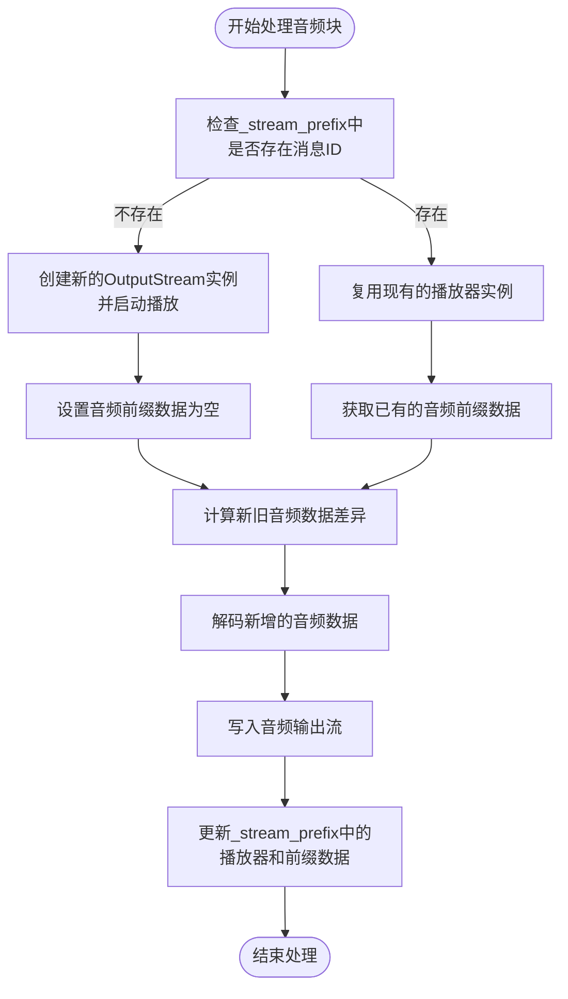

# 智能体资源管理

<cite>
**本文档引用的文件**
- [\_agent\_base.py](file://src/agentscope/agent/_agent_base.py)
- [\_msghub.py](file://src/agentscope/pipeline/_msghub.py)
- [\_functional.py](file://src/agentscope/pipeline/_functional.py)
</cite>

## 目录
1. [内存资源管理](#内存资源管理)
2. [消息队列管理](#消息队列管理)
3. [音频播放资源管理](#音频播放资源管理)
4. [订阅者关系管理](#订阅者关系管理)
5. [控制台输出控制](#控制台输出控制)
6. [资源泄漏预防与性能优化](#资源泄漏预防与性能优化)

## 内存资源管理

智能体通过 `_stream_prefix` 字典来缓存流式输出的前缀数据，实现高效的内存资源管理。该字典以消息ID为键，存储每个消息的文本和音频流的累积数据。当智能体处理流式输出时，系统会检查 `_stream_prefix` 中是否已存在对应消息ID的前缀数据。如果存在，则只打印新增的文本内容，避免重复输出。对于文本块，系统会将新内容与已打印的前缀进行比较，仅输出差异部分，并更新前缀数据。这种机制确保了流式输出的连续性和完整性，同时减少了不必要的内存操作和I/O开销。

**Section sources**
- [\_agent\_base.py](file://src/agentscope/agent/_agent_base.py#L163)

## 消息队列管理

消息队列是智能体实现流式输出的核心机制。通过 `set_msg_queue_enabled` 方法，可以启用或禁用消息队列功能。当启用时，智能体会将打印的消息放入指定的异步队列中，允许外部系统以流式方式获取中间结果。`stream_printing_messages` 函数利用这一机制，创建一个异步生成器，从队列中逐个获取消息并返回。该函数接收一个协程任务作为参数，在任务执行过程中持续监听消息队列，直到收到结束信号。这种设计实现了生产者-消费者模式，使得智能体的内部处理与外部消息消费解耦，提高了系统的灵活性和响应性。

**Section sources**
- [\_agent\_base.py](file://src/agentscope/agent/_agent_base.py#L708)
- [\_functional.py](file://src/agentscope/pipeline/_functional.py#L107)

## 音频播放资源管理

音频播放资源的管理通过 `_process_audio_block` 方法实现，该方法负责处理音频块内容并管理 miniaudio 播放器资源。对于 base64 编码的音频数据，系统会检查 `_stream_prefix` 字典中是否已存在对应消息ID的播放器实例。如果不存在，则创建一个新的 `OutputStream` 实例并启动播放；如果已存在，则复用现有的播放器。在播放新音频数据时，系统会计算与之前已播放数据的差异，仅解码和播放新增部分。在流式输出的最后阶段，系统会自动清理资源：检查 `_stream_prefix` 字典中是否存在与当前消息ID关联的播放器，如果有，则调用其 `close` 方法正确关闭播放器，防止资源泄漏。

**Diagram sources**
- [\_agent\_base.py](file://src/agentscope/agent/_agent_base.py#L272)

## 订阅者关系管理

订阅者关系通过 `_subscribers` 字典进行管理，该字典以消息中心（MsgHub）名称为键，存储订阅该消息中心的智能体列表。`reset_subscribers` 方法用于重置特定消息中心的订阅者列表，它会用新的订阅者列表替换原有的列表，但会排除智能体自身以避免循环引用。`remove_subscribers` 方法则用于移除特定消息中心的所有订阅者，当消息中心被销毁或智能体退出时调用。在 `MsgHub` 的上下文管理中，`__aenter__` 和 `__aexit__` 方法会自动调用这些订阅者管理方法，确保在进入和退出消息中心时正确地建立和清理订阅关系，维护了订阅者列表的准确性和一致性。

**Section sources**
- [\_agent\_base.py](file://src/agentscope/agent/_agent_base.py#L659)
- [\_msghub.py](file://src/agentscope/pipeline/_msghub.py#L83)

## 控制台输出控制

控制台输出通过 `_disable_console_output` 属性进行控制，该属性决定了智能体是否在终端输出信息。`set_console_output_enabled` 方法提供了运行时配置能力，允许动态启用或禁用控制台输出。当该方法被调用时，它会将传入的布尔值取反后赋值给 `_disable_console_output` 属性。在智能体的 `print` 方法中，系统会检查此属性，如果为 `True`，则直接返回，不执行任何输出操作。这种设计使得开发者可以在生产环境中关闭冗余的日志输出，保持日志的整洁，同时在调试时又能方便地重新启用输出功能，提供了灵活的运行时配置选项。

**Section sources**
- [\_agent\_base.py](file://src/agentscope/agent/_agent_base.py#L696)

## 资源泄漏预防与性能优化

为预防资源泄漏和优化性能，智能体系统采用了多种策略。首先，在流式输出的最后阶段，系统会自动清理相关资源：对于音频播放，会关闭 `miniaudio` 播放器；对于文本输出，会清除 `_stream_prefix` 字典中的对应条目。其次，通过复用播放器实例和缓存前缀数据，减少了频繁创建和销毁资源的开销。再者，消息队列机制实现了异步处理，避免了阻塞式I/O操作，提高了系统的响应速度。最后，订阅者管理机制确保了在消息中心生命周期结束时自动清理订阅关系，防止了内存泄漏。这些综合措施共同保障了系统的稳定性和高效性。

**Section sources**
- [\_agent\_base.py](file://src/agentscope/agent/_agent_base.py#L260)
- [\_msghub.py](file://src/agentscope/pipeline/_msghub.py#L83)