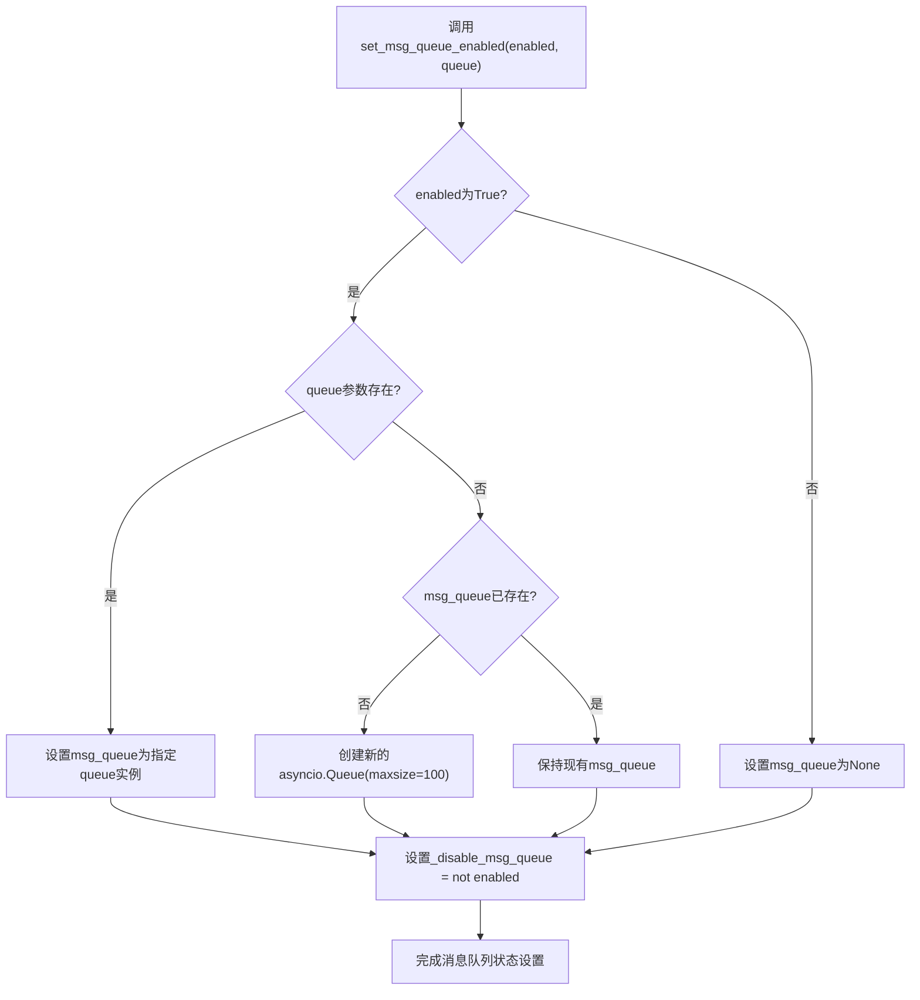
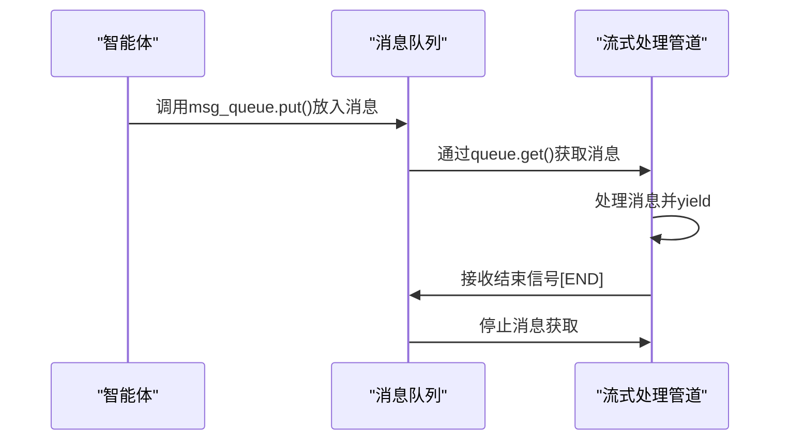
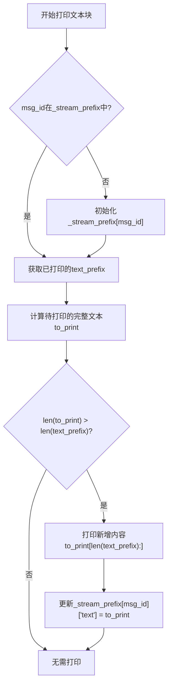
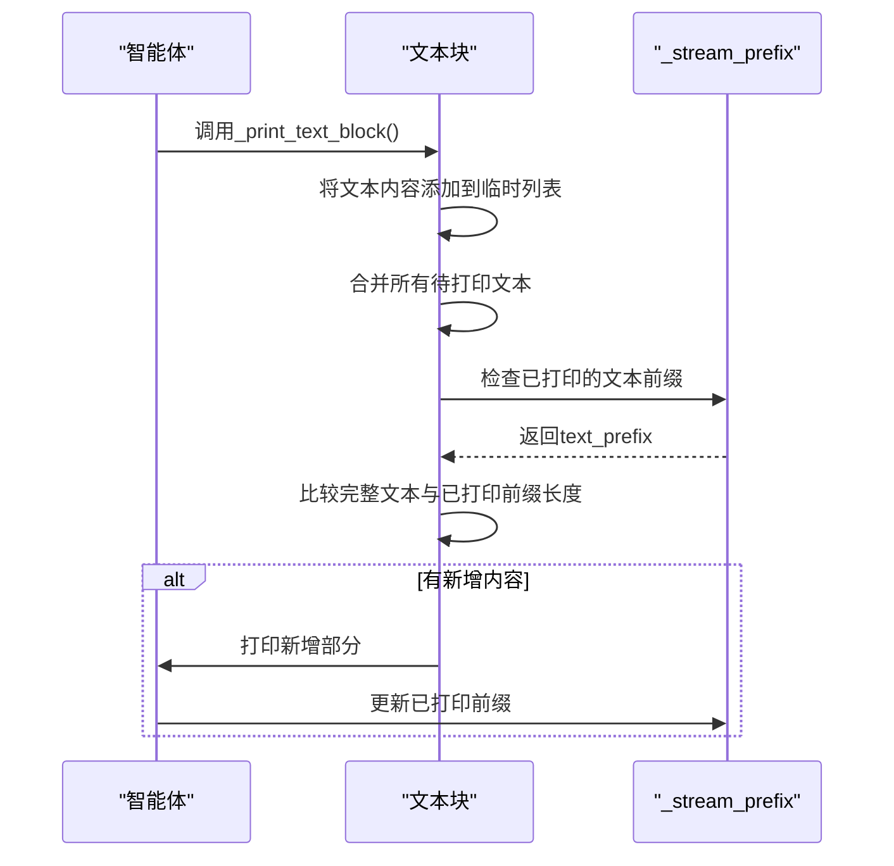
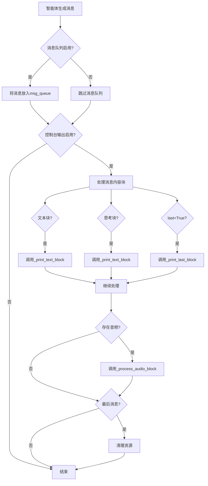
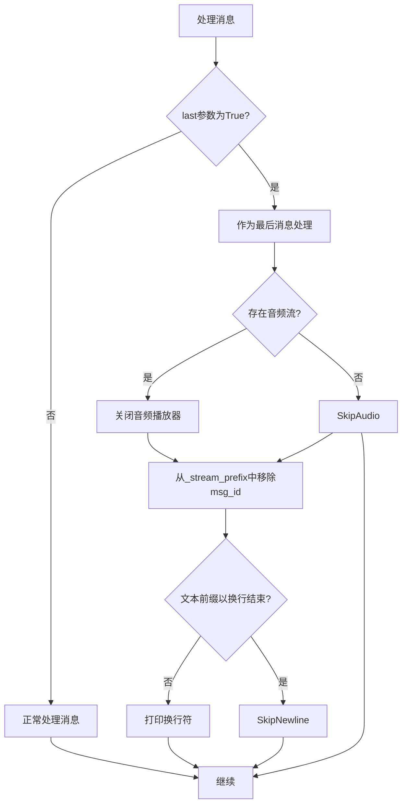
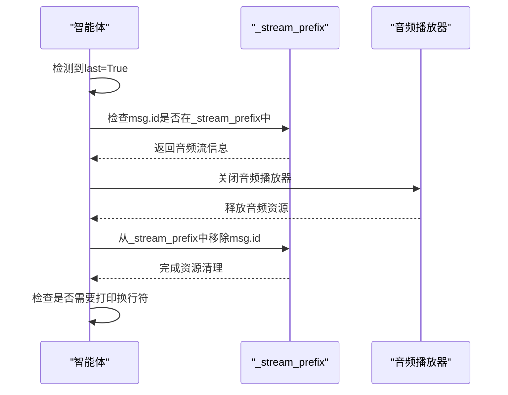
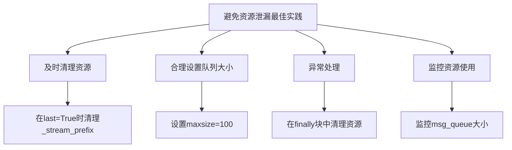
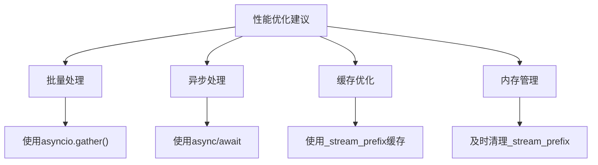

# 消息资源管理

<cite>
**本文档引用的文件**   
- [agent_base.py](file://src/agentscope/agent/_agent_base.py)
- [functional.py](file://src/agentscope/pipeline/_functional.py)
- [single_agent.py](file://examples/functionality/stream_printing_messages/single_agent.py)
- [multi_agent.py](file://examples/functionality/stream_printing_messages/multi_agent.py)
- [message_base.py](file://src/agentscope/message/_message_base.py)
</cite>

## 目录
1. [引言](#引言)
2. [核心组件](#核心组件)
3. [消息队列管理机制](#消息队列管理机制)
4. [流式输出缓存机制](#流式输出缓存机制)
5. [增量式文本打印实现](#增量式文本打印实现)
6. [资源清理与_last参数作用](#资源清理与_last参数作用)
7. [最佳实践与性能优化](#最佳实践与性能优化)

## 引言
本文档详细阐述智能体中消息资源的管理机制，重点分析消息队列、流式输出缓存、增量打印等核心功能的实现原理。通过深入分析代码结构，解释_stream_prefix字典如何缓存流式输出的文本前缀数据，_print_text_block方法如何实现增量式文本打印，以及_msg_queue如何管理流式消息队列。同时，说明set_msg_queue_enabled方法如何控制消息队列的启用与禁用，以及_last参数在流式消息处理中的作用和资源清理机制。

## 核心组件

智能体消息资源管理的核心组件包括消息队列、流式输出缓存、文本打印和音频处理等模块。这些组件协同工作，实现了高效的流式消息处理和资源管理。

**Section sources**
- [agent_base.py](file://src/agentscope/agent/_agent_base.py#L1-L733)
- [message_base.py](file://src/agentscope/message/_message_base.py#L20-L240)

## 消息队列管理机制

### 消息队列的启用与禁用

`set_msg_queue_enabled`方法用于控制消息队列的启用与禁用状态。该方法通过设置`_disable_msg_queue`标志和初始化`msg_queue`实例来管理消息队列。



**Diagram sources**
- [agent_base.py](file://src/agentscope/agent/_agent_base.py#L708-L732)

### 消息队列的使用

消息队列在`print`方法中被使用，当消息队列启用时，消息会被放入队列中供外部消费。`stream_printing_messages`函数利用消息队列来实现流式消息的获取。



**Diagram sources**
- [agent_base.py](file://src/agentscope/agent/_agent_base.py#L223-L224)
- [functional.py](file://src/agentscope/pipeline/_functional.py#L158-L188)

## 流式输出缓存机制

### _stream_prefix字典的结构与作用

`_stream_prefix`字典用于缓存流式输出的前缀数据，包括文本和音频数据。该字典以消息ID为键，存储已打印的文本前缀和音频播放状态。

```mermaid
erDiagram
STREAM_PREFIX ||--o{ TEXT_PREFIX : "包含"
STREAM_PREFIX ||--o{ AUDIO_STREAM : "包含"
STREAM_PREFIX {
string msg_id PK
string text_prefix
object audio_stream_data
}
TEXT_PREFIX {
string msg_id PK FK
string prefix_text
}
AUDIO_STREAM {
string msg_id PK FK
object player_stream
string base64_data
}
```

**Diagram sources**
- [agent_base.py](file://src/agentscope/agent/_agent_base.py#L162-L163)
- [agent_base.py](file://src/agentscope/agent/_agent_base.py#L393-L403)

### 文本前缀缓存实现

文本前缀缓存通过`_print_text_block`方法实现，该方法检查已打印的文本前缀，并只打印新增的内容。



**Diagram sources**
- [agent_base.py](file://src/agentscope/agent/_agent_base.py#L392-L403)

## 增量式文本打印实现

### _print_text_block方法的工作流程

`_print_text_block`方法实现了增量式文本打印，确保只打印新增的文本内容，避免重复输出。



**Diagram sources**
- [agent_base.py](file://src/agentscope/agent/_agent_base.py#L365-L403)

### 流式消息处理流程

流式消息处理流程涉及多个组件的协同工作，从消息生成到最终输出的完整过程。



**Diagram sources**
- [agent_base.py](file://src/agentscope/agent/_agent_base.py#L223-L271)

## 资源清理与_last参数作用

### _last参数的作用

`_last`参数在流式消息处理中起着关键作用，用于标识是否为最后一条消息，从而触发资源清理操作。



**Diagram sources**
- [agent_base.py](file://src/agentscope/agent/_agent_base.py#L260-L271)

### 资源清理机制

资源清理机制确保在消息处理完成后正确释放相关资源，防止资源泄漏。



**Diagram sources**
- [agent_base.py](file://src/agentscope/agent/_agent_base.py#L260-L271)

## 最佳实践与性能优化

### 避免消息资源泄漏的最佳实践

为避免消息资源泄漏，应遵循以下最佳实践：

1. **及时清理资源**：确保在处理完最后一条消息后正确清理相关资源
2. **合理设置队列大小**：为消息队列设置合理的最大容量，防止内存溢出
3. **异常处理**：在异常情况下也要确保资源得到清理
4. **监控资源使用**：定期监控消息队列和缓存的使用情况



**Diagram sources**
- [agent_base.py](file://src/agentscope/agent/_agent_base.py#L726)
- [agent_base.py](file://src/agentscope/agent/_agent_base.py#L260-L271)

### 性能优化建议

为提高消息处理性能，建议采取以下优化措施：

1. **批量处理**：尽可能批量处理消息，减少I/O操作
2. **异步处理**：充分利用异步特性，提高并发处理能力
3. **缓存优化**：合理使用缓存，避免重复计算
4. **内存管理**：及时释放不再使用的对象，防止内存泄漏



**Section sources**
- [agent_base.py](file://src/agentscope/agent/_agent_base.py#L726)
- [functional.py](file://src/agentscope/pipeline/_functional.py#L96-L102)