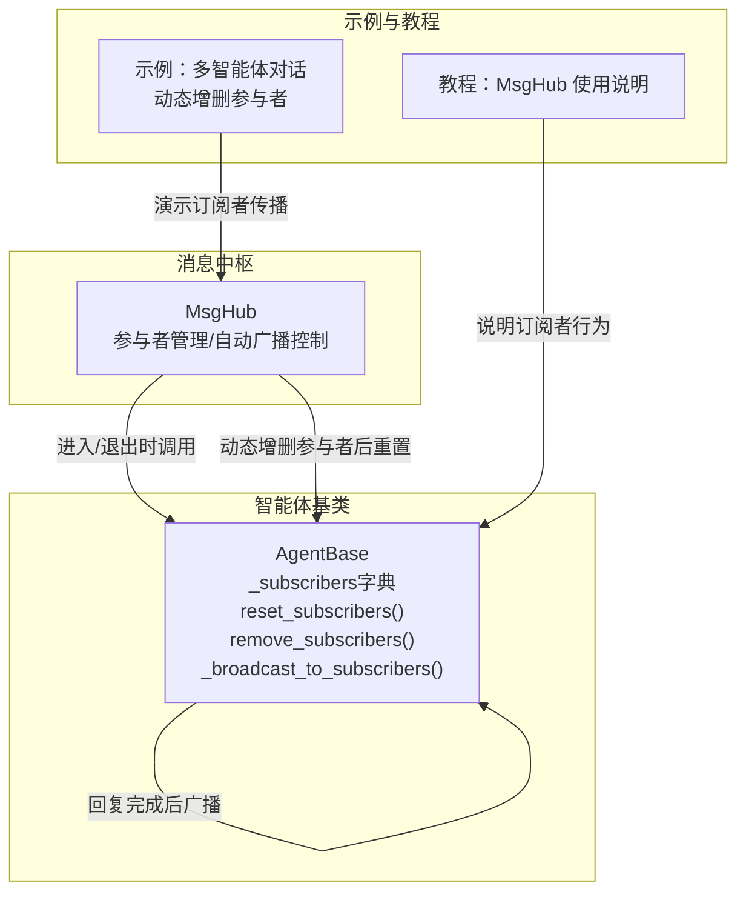
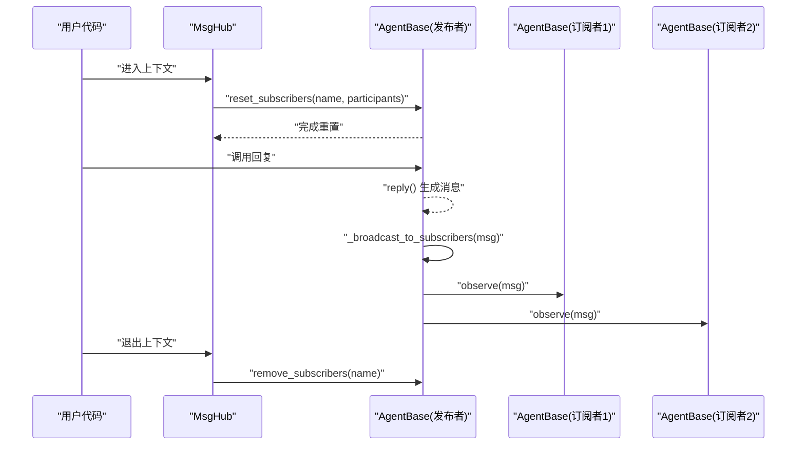
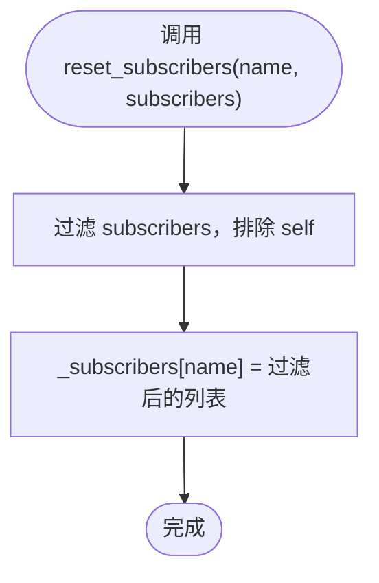
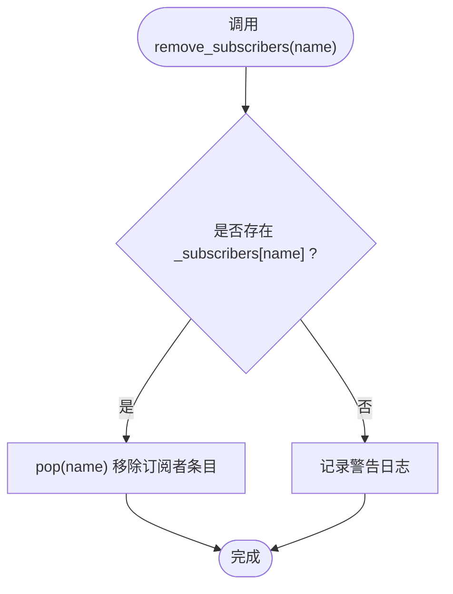
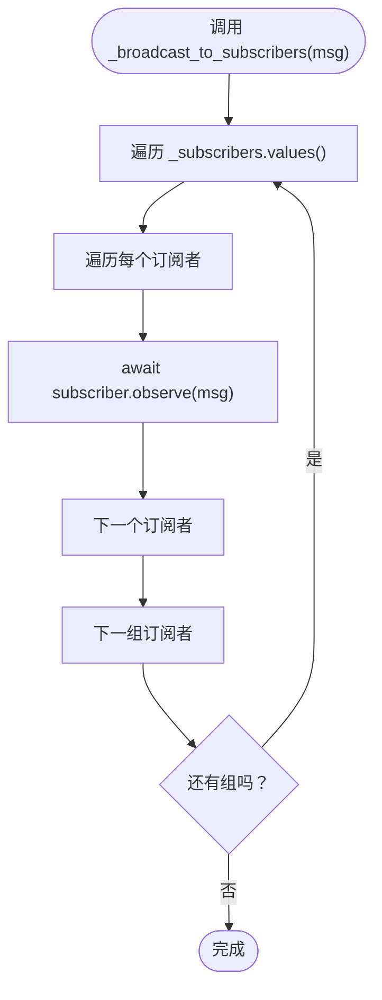
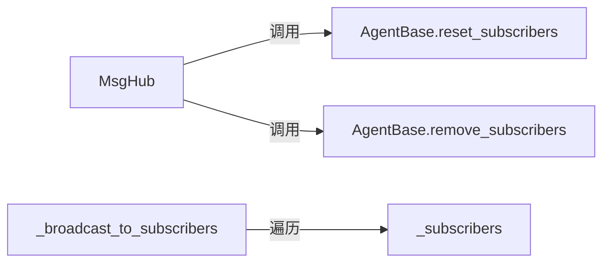

# 订阅者资源管理

<cite>
**本文引用的文件**
- [src/agentscope/pipeline/_msghub.py](file://src/agentscope/pipeline/_msghub.py)
- [src/agentscope/agent/_agent_base.py](file://src/agentscope/agent/_agent_base.py)
- [examples/workflows/multiagent_conversation/main.py](file://examples/workflows/multiagent_conversation/main.py)
- [docs/tutorial/zh_CN/src/task_pipeline.py](file://docs/tutorial/zh_CN/src/task_pipeline.py)
</cite>

## 目录
1. [引言](#引言)
2. [项目结构](#项目结构)
3. [核心组件](#核心组件)
4. [架构总览](#架构总览)
5. [详细组件分析](#详细组件分析)
6. [依赖分析](#依赖分析)
7. [性能考虑](#性能考虑)
8. [故障排查指南](#故障排查指南)
9. [结论](#结论)
10. [附录](#附录)

## 引言
本文件围绕智能体订阅者资源管理展开，系统性阐述 MsgHub 如何通过 _subscribers 字典维护 MsgHub 与订阅者代理之间的映射关系；详解 reset_subscribers 如何重置特定 MsgHub 的订阅者列表、remove_subscribers 如何安全移除订阅者组；说明 _broadcast_to_subscribers 如何遍历订阅者并推送消息，以及如何避免循环引用导致的资源泄漏。同时提供最佳实践与常见问题排查建议，帮助读者在复杂多智能体场景中稳定、高效地管理订阅者资源。

## 项目结构
订阅者资源管理涉及两个关键模块：
- 消息中枢 MsgHub：负责管理参与者集合、自动广播开关、进入/退出上下文时的订阅者重置与清理。
- 智能体基类 AgentBase：持有 _subscribers 字典，提供 reset_subscribers、remove_subscribers、_broadcast_to_subscribers 等能力，支撑自动广播链路。

图表来源
- [src/agentscope/pipeline/_msghub.py](file://src/agentscope/pipeline/_msghub.py#L72-L88)
- [src/agentscope/agent/_agent_base.py](file://src/agentscope/agent/_agent_base.py#L160-L170)
- [src/agentscope/agent/_agent_base.py](file://src/agentscope/agent/_agent_base.py#L659-L689)
- [src/agentscope/agent/_agent_base.py](file://src/agentscope/agent/_agent_base.py#L465-L473)
- [examples/workflows/multiagent_conversation/main.py](file://examples/workflows/multiagent_conversation/main.py#L48-L76)
- [docs/tutorial/zh_CN/src/task_pipeline.py](file://docs/tutorial/zh_CN/src/task_pipeline.py#L67-L115)

章节来源
- [src/agentscope/pipeline/_msghub.py](file://src/agentscope/pipeline/_msghub.py#L41-L156)
- [src/agentscope/agent/_agent_base.py](file://src/agentscope/agent/_agent_base.py#L160-L170)
- [src/agentscope/agent/_agent_base.py](file://src/agentscope/agent/_agent_base.py#L459-L473)
- [src/agentscope/agent/_agent_base.py](file://src/agentscope/agent/_agent_base.py#L659-L689)
- [examples/workflows/multiagent_conversation/main.py](file://examples/workflows/multiagent_conversation/main.py#L48-L76)
- [docs/tutorial/zh_CN/src/task_pipeline.py](file://docs/tutorial/zh_CN/src/task_pipeline.py#L67-L115)

## 核心组件
- MsgHub：上下文管理器，负责在进入/退出时重置与清理订阅者，并支持动态增删参与者与手动广播。
- AgentBase：每个智能体实例维护 _subscribers 字典，键为 MsgHub 名称，值为该 Hub 下的订阅者列表（不包含自身）；提供 reset_subscribers/remove_subscribers 以更新/移除订阅者组；在回复完成时触发 _broadcast_to_subscribers 广播。

章节来源
- [src/agentscope/pipeline/_msghub.py](file://src/agentscope/pipeline/_msghub.py#L41-L156)
- [src/agentscope/agent/_agent_base.py](file://src/agentscope/agent/_agent_base.py#L160-L170)
- [src/agentscope/agent/_agent_base.py](file://src/agentscope/agent/_agent_base.py#L459-L473)
- [src/agentscope/agent/_agent_base.py](file://src/agentscope/agent/_agent_base.py#L659-L689)

## 架构总览
MsgHub 与 AgentBase 的协作流程如下：
- 进入 MsgHub 上下文：调用 _reset_subscriber，对所有参与者执行 reset_subscribers，建立“当前 Hub 下的订阅者列表”。
- 参与者回复：当任意参与者完成 reply 后，自动调用 _broadcast_to_subscribers，向该 Hub 下的所有订阅者推送消息。
- 退出 MsgHub 上下文：若启用自动广播，则逐个调用 remove_subscribers 清理订阅者组，避免残留引用。
- 动态管理：add/delete 会更新参与者列表并重新重置订阅者，确保订阅者集合与参与者集合一致。

图表来源
- [src/agentscope/pipeline/_msghub.py](file://src/agentscope/pipeline/_msghub.py#L72-L88)
- [src/agentscope/pipeline/_msghub.py](file://src/agentscope/pipeline/_msghub.py#L89-L94)
- [src/agentscope/agent/_agent_base.py](file://src/agentscope/agent/_agent_base.py#L459-L473)
- [src/agentscope/agent/_agent_base.py](file://src/agentscope/agent/_agent_base.py#L675-L689)

## 详细组件分析

### _subscribers 字典与订阅者映射
- 结构定义：每个 AgentBase 实例维护一个 _subscribers 字典，键为 MsgHub 名称字符串，值为该 Hub 下的订阅者智能体列表。
- 关键点：
  - 列表中不包含自身，避免自播。
  - reset_subscribers 会按当前参与者集合重建该 Hub 的订阅者列表。
  - remove_subscribers 会移除该 Hub 的订阅者条目，防止后续广播。

章节来源
- [src/agentscope/agent/_agent_base.py](file://src/agentscope/agent/_agent_base.py#L160-L170)
- [src/agentscope/agent/_agent_base.py](file://src/agentscope/agent/_agent_base.py#L659-L689)

### reset_subscribers：重置特定 MsgHub 的订阅者列表
- 触发时机：进入 MsgHub 上下文、动态 add/delete、set_auto_broadcast 开启时。
- 行为要点：
  - 接收 MsgHub 名称与当前参与者列表。
  - 为该 Hub 名称设置订阅者列表，内容为“参与者列表中除自身以外的所有智能体”。
  - 保证订阅者集合与参与者集合同步，且无自引用。

图表来源
- [src/agentscope/agent/_agent_base.py](file://src/agentscope/agent/_agent_base.py#L659-L673)

章节来源
- [src/agentscope/agent/_agent_base.py](file://src/agentscope/agent/_agent_base.py#L659-L673)
- [src/agentscope/pipeline/_msghub.py](file://src/agentscope/pipeline/_msghub.py#L89-L94)

### remove_subscribers：安全移除订阅者组
- 触发时机：退出 MsgHub 上下文（若启用自动广播）、显式关闭自动广播。
- 行为要点：
  - 若存在该 Hub 名称对应的订阅者条目，则移除该条目。
  - 若不存在，记录警告日志，避免误操作引发异常。
  - 防止后续广播时访问已失效的订阅者集合。

图表来源
- [src/agentscope/agent/_agent_base.py](file://src/agentscope/agent/_agent_base.py#L675-L689)

章节来源
- [src/agentscope/agent/_agent_base.py](file://src/agentscope/agent/_agent_base.py#L675-L689)
- [src/agentscope/pipeline/_msghub.py](file://src/agentscope/pipeline/_msghub.py#L83-L88)
- [src/agentscope/pipeline/_msghub.py](file://src/agentscope/pipeline/_msghub.py#L140-L156)

### _broadcast_to_subscribers：遍历订阅者并推送消息
- 触发时机：任意参与者完成 reply 后自动触发。
- 行为要点：
  - 遍历 _subscribers 的所有订阅者组（按 MsgHub 名称分组）。
  - 对每组中的每个订阅者调用其 observe 方法，传递消息。
  - 该过程不会阻塞发布者，采用异步调用，确保高并发下的响应性。

图表来源
- [src/agentscope/agent/_agent_base.py](file://src/agentscope/agent/_agent_base.py#L465-L473)

章节来源
- [src/agentscope/agent/_agent_base.py](file://src/agentscope/agent/_agent_base.py#L459-L473)

### 避免循环引用与资源泄漏
- 自引用规避：reset_subscribers 在构建订阅者列表时明确排除自身，避免“自播”和潜在的循环引用。
- 上下文清理：退出 MsgHub 上下文时，remove_subscribers 会移除该 Hub 的订阅者条目，防止后续广播访问到已释放或不再属于该 Hub 的订阅者。
- 动态一致性：add/delete 后立即重置订阅者，确保 _subscribers 与 participants 始终一致，降低悬挂引用风险。

章节来源
- [src/agentscope/agent/_agent_base.py](file://src/agentscope/agent/_agent_base.py#L659-L673)
- [src/agentscope/pipeline/_msghub.py](file://src/agentscope/pipeline/_msghub.py#L83-L88)
- [src/agentscope/pipeline/_msghub.py](file://src/agentscope/pipeline/_msghub.py#L94-L129)

### 典型使用场景与最佳实践
- 动态参与者管理：在 MsgHub 内部通过 add/delete 动态增删参与者，随后自动重置订阅者，确保广播范围准确。
- 手动广播：在需要时使用 broadcast 对当前参与者进行一次性广播，不依赖自动广播。
- 自动广播开关：通过 set_auto_broadcast 控制是否启用自动广播，必要时可临时关闭以减少广播压力。
- 示例参考：多智能体对话示例展示了进入/退出 MsgHub、动态删除参与者、手动广播等典型用法。

章节来源
- [examples/workflows/multiagent_conversation/main.py](file://examples/workflows/multiagent_conversation/main.py#L48-L76)
- [docs/tutorial/zh_CN/src/task_pipeline.py](file://docs/tutorial/zh_CN/src/task_pipeline.py#L67-L115)
- [src/agentscope/pipeline/_msghub.py](file://src/agentscope/pipeline/_msghub.py#L94-L156)

## 依赖分析
- MsgHub 依赖 AgentBase 的订阅者管理接口：reset_subscribers、remove_subscribers。
- AgentBase 依赖 MsgHub 名称作为 _subscribers 的键，实现按 Hub 分组的订阅者管理。
- 外部依赖：短 UUID 用于生成 Hub 名称；日志模块用于警告提示。

图表来源
- [src/agentscope/pipeline/_msghub.py](file://src/agentscope/pipeline/_msghub.py#L72-L88)
- [src/agentscope/agent/_agent_base.py](file://src/agentscope/agent/_agent_base.py#L659-L689)
- [src/agentscope/agent/_agent_base.py](file://src/agentscope/agent/_agent_base.py#L465-L473)

章节来源
- [src/agentscope/pipeline/_msghub.py](file://src/agentscope/pipeline/_msghub.py#L72-L88)
- [src/agentscope/agent/_agent_base.py](file://src/agentscope/agent/_agent_base.py#L659-L689)
- [src/agentscope/agent/_agent_base.py](file://src/agentscope/agent/_agent_base.py#L465-L473)

## 性能考虑
- 广播复杂度：_broadcast_to_subscribers 遍历 _subscribers 的所有订阅者组并逐个调用 observe，时间复杂度与订阅者总数线性相关。
- 重置成本：_reset_subscriber 在进入/退出或动态变更时对所有参与者调用 reset_subscribers，成本与参与者数量线性相关。
- 并发友好：observe 采用异步调用，避免阻塞发布者的回复流程，适合高并发场景。
- 建议：
  - 控制单个 MsgHub 的参与者规模，避免过大的订阅者列表导致广播延迟。
  - 在大批量广播前评估网络与下游处理能力，必要时拆分多个 MsgHub 或分批广播。

[本节为通用性能讨论，不直接分析具体文件]

## 故障排查指南
- 订阅者为空或缺失
  - 现象：广播无效或部分订阅者未收到消息。
  - 排查：确认 MsgHub 是否处于启用自动广播状态；检查 add/delete 是否正确执行；确认 _reset_subscriber 是否被调用。
  - 参考路径：[src/agentscope/pipeline/_msghub.py](file://src/agentscope/pipeline/_msghub.py#L89-L94)、[src/agentscope/pipeline/_msghub.py](file://src/agentscope/pipeline/_msghub.py#L94-L129)
- 重复删除或删除不存在的参与者
  - 现象：出现警告日志但不影响运行。
  - 排查：检查删除对象是否在 participants 中；如不在则会记录警告。
  - 参考路径：[src/agentscope/pipeline/_msghub.py](file://src/agentscope/pipeline/_msghub.py#L113-L125)
- 退出后仍收到广播
  - 现象：退出 MsgHub 后仍有订阅者接收消息。
  - 排查：确认 enable_auto_broadcast 是否为 True；退出时是否调用了 remove_subscribers。
  - 参考路径：[src/agentscope/pipeline/_msghub.py](file://src/agentscope/pipeline/_msghub.py#L83-L88)
- 订阅者组未清理导致内存占用
  - 现象：长时间运行后内存增长。
  - 排查：确认 remove_subscribers 是否被调用；检查 set_auto_broadcast 是否被错误关闭。
  - 参考路径：[src/agentscope/agent/_agent_base.py](file://src/agentscope/agent/_agent_base.py#L675-L689)、[src/agentscope/pipeline/_msghub.py](file://src/agentscope/pipeline/_msghub.py#L140-L156)
- 自引用与循环广播
  - 现象：消息循环或自播导致异常。
  - 排查：确认 reset_subscribers 是否排除了自身；避免在 observe 中再次向 Hub 发布相同消息。
  - 参考路径：[src/agentscope/agent/_agent_base.py](file://src/agentscope/agent/_agent_base.py#L659-L673)

章节来源
- [src/agentscope/pipeline/_msghub.py](file://src/agentscope/pipeline/_msghub.py#L83-L129)
- [src/agentscope/agent/_agent_base.py](file://src/agentscope/agent/_agent_base.py#L659-L689)

## 结论
MsgHub 与 AgentBase 协作实现了简洁高效的订阅者资源管理：通过 _subscribers 字典按 Hub 分组维护订阅者集合，借助 reset_subscribers 与 remove_subscribers 确保订阅者与参与者的一致性与生命周期可控；_broadcast_to_subscribers 提供异步广播能力，满足多智能体协作需求。遵循本文的最佳实践与排障建议，可在复杂场景中稳定、高效地管理订阅者资源，避免循环引用与资源泄漏。

[本节为总结性内容，不直接分析具体文件]

## 附录
- 示例参考
  - 多智能体对话示例展示了进入/退出 MsgHub、动态删除参与者、手动广播等典型用法。
  - 教程文档提供了 MsgHub 的使用说明与动态参与者管理方法。
- 参考路径
  - [examples/workflows/multiagent_conversation/main.py](file://examples/workflows/multiagent_conversation/main.py#L48-L76)
  - [docs/tutorial/zh_CN/src/task_pipeline.py](file://docs/tutorial/zh_CN/src/task_pipeline.py#L67-L115)