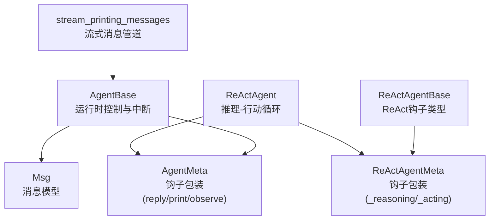
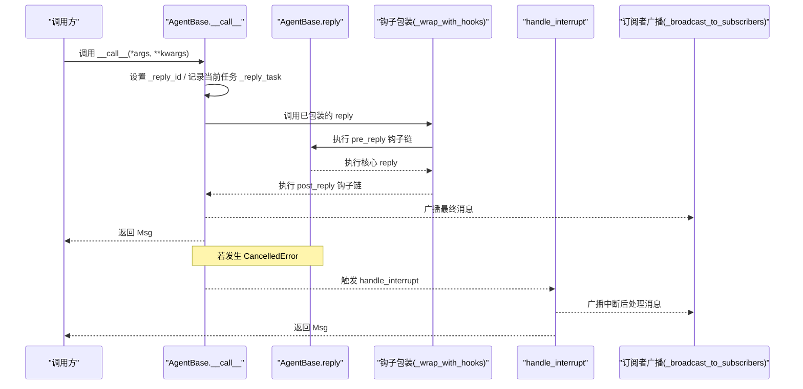
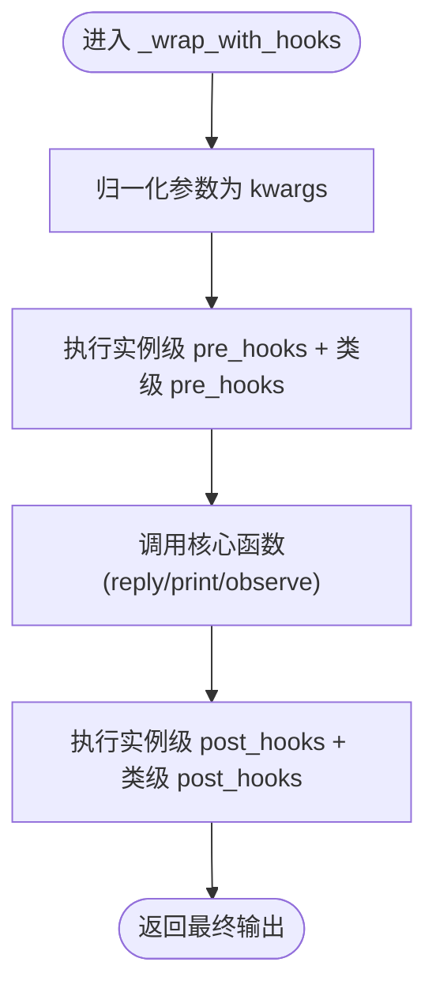
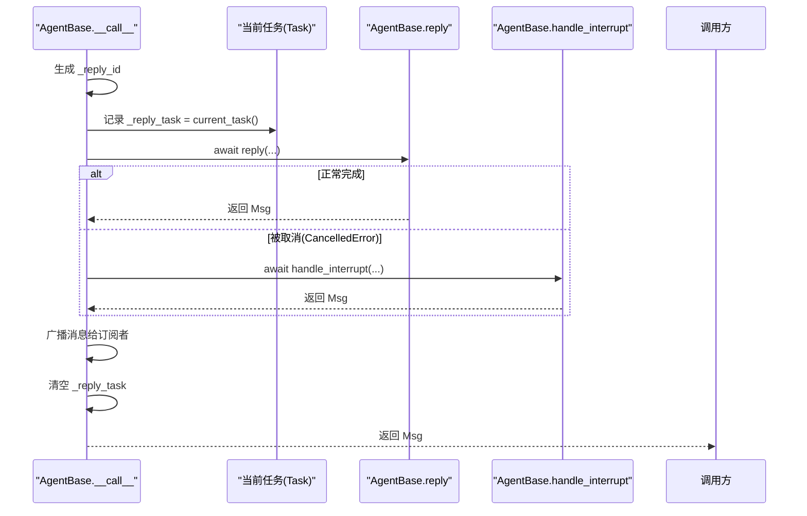
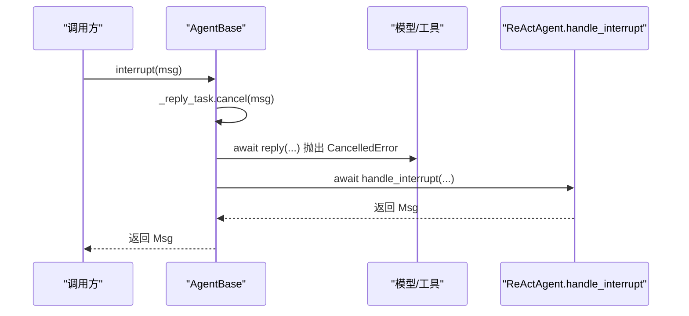
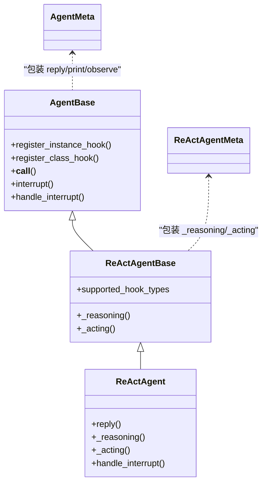
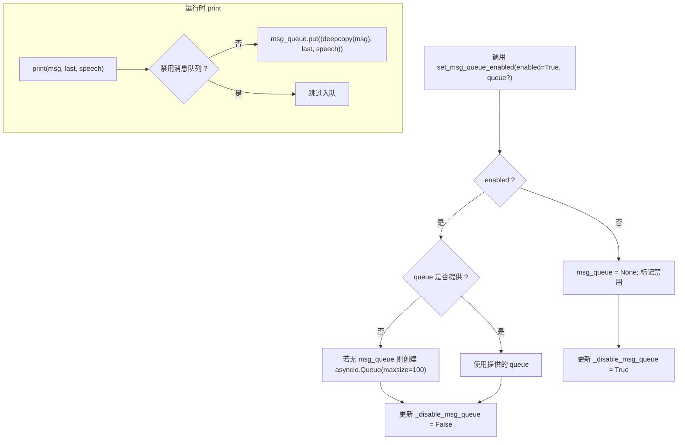
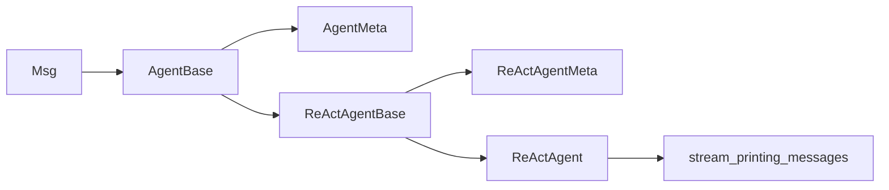

# 智能体运行时控制

<cite>
**本文引用的文件**
- [AgentBase 基类](file://src/agentscope/agent/_agent_base.py)
- [ReActAgentBase 基类](file://src/agentscope/agent/_react_agent_base.py)
- [ReActAgent 实现](file://src/agentscope/agent/_react_agent.py)
- [Agent 元类与钩子包装](file://src/agentscope/agent/_agent_meta.py)
- [消息类型定义](file://src/agentscope/message/_message_base.py)
- [流式消息管道](file://src/agentscope/pipeline/_functional.py)
- [钩子类型定义](file://src/agentscope/types/_hook.py)
- [用户代理示例](file://src/agentscope/agent/_user_agent.py)
- [教程：中断与钩子](file://docs/tutorial/zh_CN/src/task_agent.py)
- [教程：流式消息](file://docs/tutorial/zh_CN/src/task_pipeline.py)
- [测试：钩子注册与执行](file://tests/hook_test.py)
</cite>

## 目录
1. [简介](#简介)
2. [项目结构](#项目结构)
3. [核心组件](#核心组件)
4. [架构总览](#架构总览)
5. [详细组件分析](#详细组件分析)
6. [依赖关系分析](#依赖关系分析)
7. [性能考量](#性能考量)
8. [故障排查指南](#故障排查指南)
9. [结论](#结论)
10. [附录](#附录)

## 简介
本文件聚焦智能体运行时的控制机制，围绕以下主题展开：
- reply() 方法的执行流程与钩子扩展点
- __call__ 方法如何管理 _reply_task 与 _reply_id，并与中断处理联动
- pre_reply/post_reply 等钩子的执行时机与数据流
- ReActAgentBase 新增的 pre_reasoning/post_reasoning/pre_acting/post_acting 钩子类型如何扩展控制能力
- _msg_queue 在流式输出中的作用，以及 set_msg_queue_enabled 如何动态控制消息队列
- 并发回复任务与流式输出的最佳实践

## 项目结构
围绕“运行时控制”相关的核心文件组织如下：
- 运行时控制与中断：AgentBase.__call__、interrupt、handle_interrupt
- 钩子系统：AgentMeta/ReActAgentMeta 对 reply/print/observe 与 _reasoning/_acting 的钩子包装
- ReAct 控制流：ReActAgentBase 定义钩子类型；ReActAgent 实现推理与行动循环
- 流式输出：AgentBase.print、set_msg_queue_enabled、stream_printing_messages
- 消息模型：Msg 的内容块与序列化

图表来源
- [AgentBase 基类](file://src/agentscope/agent/_agent_base.py#L444-L490)
- [Agent 元类与钩子包装](file://src/agentscope/agent/_agent_meta.py#L147-L181)
- [ReActAgentBase 基类](file://src/agentscope/agent/_react_agent_base.py#L1-L117)
- [ReActAgent 实现](file://src/agentscope/agent/_react_agent.py#L253-L408)
- [消息类型定义](file://src/agentscope/message/_message_base.py#L21-L120)
- [流式消息管道](file://src/agentscope/pipeline/_functional.py#L107-L193)

章节来源
- [AgentBase 基类](file://src/agentscope/agent/_agent_base.py#L444-L490)
- [Agent 元类与钩子包装](file://src/agentscope/agent/_agent_meta.py#L147-L181)
- [ReActAgentBase 基类](file://src/agentscope/agent/_react_agent_base.py#L1-L117)
- [ReActAgent 实现](file://src/agentscope/agent/_react_agent.py#L253-L408)
- [消息类型定义](file://src/agentscope/message/_message_base.py#L21-L120)
- [流式消息管道](file://src/agentscope/pipeline/_functional.py#L107-L193)

## 核心组件
- AgentBase：提供运行时控制入口 __call__、中断 interrupt、钩子注册与广播订阅者 observe
- ReActAgentBase：在 AgentBase 基础上扩展 ReAct 钩子类型与抽象的 _reasoning/_acting
- ReActAgent：实现推理-行动循环，贯穿 pre/post 钩子，支持流式输出与 TTS
- AgentMeta/ReActAgentMeta：自动为指定方法注入 pre/post 钩子链
- Msg：消息载体，支持文本、工具调用/结果、图像/音频/视频等多模态内容块
- stream_printing_messages：从智能体打印消息中抽取流式片段

章节来源
- [AgentBase 基类](file://src/agentscope/agent/_agent_base.py#L30-L120)
- [ReActAgentBase 基类](file://src/agentscope/agent/_react_agent_base.py#L1-L117)
- [ReActAgent 实现](file://src/agentscope/agent/_react_agent.py#L253-L408)
- [Agent 元类与钩子包装](file://src/agentscope/agent/_agent_meta.py#L147-L181)
- [消息类型定义](file://src/agentscope/message/_message_base.py#L21-L120)
- [流式消息管道](file://src/agentscope/pipeline/_functional.py#L107-L193)

## 架构总览
下面的时序图展示了从调用智能体到最终消息广播的关键路径，以及中断触发与钩子执行的时机。

图表来源
- [AgentBase 基类](file://src/agentscope/agent/_agent_base.py#L444-L490)
- [Agent 元类与钩子包装](file://src/agentscope/agent/_agent_meta.py#L55-L145)

章节来源
- [AgentBase 基类](file://src/agentscope/agent/_agent_base.py#L444-L490)
- [Agent 元类与钩子包装](file://src/agentscope/agent/_agent_meta.py#L55-L145)

## 详细组件分析

### 1) reply() 执行流程与钩子扩展
- 钩子包装：AgentMeta 会将 reply/print/observe 三类方法通过 _wrap_with_hooks 注入 pre/post 钩子链
- 参数归一化：_normalize_to_kwargs 将位置参数与关键字参数绑定为 kwargs 字典，便于钩子修改
- 钩子执行顺序：实例级 pre_hooks + 类级 pre_hooks → 核心函数 → 实例级 post_hooks + 类级 post_hooks
- 输出修改：post 钩子可返回新的输出对象，实现对最终消息的后处理

图表来源
- [Agent 元类与钩子包装](file://src/agentscope/agent/_agent_meta.py#L21-L145)

章节来源
- [Agent 元类与钩子包装](file://src/agentscope/agent/_agent_meta.py#L21-L145)
- [钩子类型定义](file://src/agentscope/types/_hook.py#L1-L25)

### 2) __call__ 方法与 _reply_task/_reply_id 管理
- 设置标识：每次调用前生成唯一 _reply_id，并记录当前 asyncio.Task 到 _reply_task
- 执行与中断：直接 await reply；若收到 CancelledError，则转交至 handle_interrupt
- 广播与清理：无论成功与否，均广播最终消息给订阅者，并清空 _reply_task

图表来源
- [AgentBase 基类](file://src/agentscope/agent/_agent_base.py#L444-L490)

章节来源
- [AgentBase 基类](file://src/agentscope/agent/_agent_base.py#L444-L490)

### 3) 中断处理机制
- 触发：interrupt 仅在存在未完成的 _reply_task 时调用 cancel(msg)
- 捕获：__call__ 捕获 CancelledError 并调用 handle_interrupt
- 后处理：ReActAgent.handle_interrupt 返回一条提示消息并打印，同时写入记忆

图表来源
- [AgentBase 基类](file://src/agentscope/agent/_agent_base.py#L486-L490)
- [ReActAgent 实现](file://src/agentscope/agent/_react_agent.py#L658-L687)
- [教程：中断与钩子](file://docs/tutorial/zh_CN/src/task_agent.py#L74-L110)

章节来源
- [AgentBase 基类](file://src/agentscope/agent/_agent_base.py#L486-L490)
- [ReActAgent 实现](file://src/agentscope/agent/_react_agent.py#L658-L687)
- [教程：中断与钩子](file://docs/tutorial/zh_CN/src/task_agent.py#L74-L110)

### 4) 钩子类型与执行时机
- AgentBase 支持 pre_reply/post_reply/pre_print/post_print/pre_observe/post_observe
- ReActAgentBase 在上述基础上新增 pre_reasoning/post_reasoning/pre_acting/post_acting
- ReActAgentMeta 对 _reasoning/_acting 注入钩子包装，形成完整的 ReAct 控制闭环

图表来源
- [AgentBase 基类](file://src/agentscope/agent/_agent_base.py#L30-L120)
- [ReActAgentBase 基类](file://src/agentscope/agent/_react_agent_base.py#L1-L117)
- [ReActAgent 实现](file://src/agentscope/agent/_react_agent.py#L253-L408)
- [Agent 元类与钩子包装](file://src/agentscope/agent/_agent_meta.py#L147-L181)
- [钩子类型定义](file://src/agentscope/types/_hook.py#L1-L25)

章节来源
- [ReActAgentBase 基类](file://src/agentscope/agent/_react_agent_base.py#L1-L117)
- [Agent 元类与钩子包装](file://src/agentscope/agent/_agent_meta.py#L147-L181)
- [钩子类型定义](file://src/agentscope/types/_hook.py#L1-L25)

### 5) ReActAgentBase 的 pre_reasoning/post_reasoning/pre_acting/post_acting
- supported_hook_types 明确列出四类钩子类型，分别对应推理前/后与行动前/后
- ReActAgentMeta 通过包装 _reasoning/_acting，使这些钩子在 ReAct 循环中生效
- ReActAgent 在 reply 中驱动推理-行动循环，每个阶段均可被钩子拦截与修改

章节来源
- [ReActAgentBase 基类](file://src/agentscope/agent/_react_agent_base.py#L1-L117)
- [ReActAgent 实现](file://src/agentscope/agent/_react_agent.py#L253-L408)
- [Agent 元类与钩子包装](file://src/agentscope/agent/_agent_meta.py#L165-L181)

### 6) _msg_queue 与 set_msg_queue_enabled 的流式输出
- print：当未禁用消息队列且启用 set_msg_queue_enabled 时，将 (msg,last,speech) 深拷贝入队
- set_msg_queue_enabled：启用时可传入已有队列，否则创建默认大小的 asyncio.Queue；禁用时清空队列并标记禁用
- stream_printing_messages：统一开启各智能体的消息队列，消费队列并按“同 id 的消息视为同一消息”的规则产出流式片段

图表来源
- [AgentBase 基类](file://src/agentscope/agent/_agent_base.py#L685-L732)
- [AgentBase 基类](file://src/agentscope/agent/_agent_base.py#L205-L272)
- [流式消息管道](file://src/agentscope/pipeline/_functional.py#L107-L193)

章节来源
- [AgentBase 基类](file://src/agentscope/agent/_agent_base.py#L205-L272)
- [AgentBase 基类](file://src/agentscope/agent/_agent_base.py#L685-L732)
- [流式消息管道](file://src/agentscope/pipeline/_functional.py#L107-L193)

### 7) 并发回复任务与流式输出最佳实践
- 并发执行：fanout_pipeline 默认使用 asyncio.gather 并发执行多个智能体，适合 I/O 密集场景
- 顺序执行：当需要确定性顺序或限流时，可关闭并发，逐个执行
- 流式采集：stream_printing_messages 统一开启消息队列，消费队列并按“同 id 的消息视为同一消息”产出片段
- 错误传播：生成器在遍历结束后检查任务异常并抛出，确保上层感知中断或错误

章节来源
- [流式消息管道](file://src/agentscope/pipeline/_functional.py#L107-L193)
- [教程：流式消息](file://docs/tutorial/zh_CN/src/task_pipeline.py#L221-L260)

## 依赖关系分析
- AgentBase 依赖 Msg 消息模型与状态模块 StateModule
- ReActAgentBase 继承 AgentBase 并由 ReActAgentMeta 包装 _reasoning/_acting
- ReActAgent 实现推理-行动循环，贯穿钩子与流式输出
- stream_printing_messages 依赖 AgentBase 的消息队列接口

图表来源
- [AgentBase 基类](file://src/agentscope/agent/_agent_base.py#L30-L120)
- [ReActAgentBase 基类](file://src/agentscope/agent/_react_agent_base.py#L1-L117)
- [ReActAgent 实现](file://src/agentscope/agent/_react_agent.py#L253-L408)
- [消息类型定义](file://src/agentscope/message/_message_base.py#L21-L120)
- [流式消息管道](file://src/agentscope/pipeline/_functional.py#L107-L193)

章节来源
- [AgentBase 基类](file://src/agentscope/agent/_agent_base.py#L30-L120)
- [ReActAgentBase 基类](file://src/agentscope/agent/_react_agent_base.py#L1-L117)
- [ReActAgent 实现](file://src/agentscope/agent/_react_agent.py#L253-L408)
- [消息类型定义](file://src/agentscope/message/_message_base.py#L21-L120)
- [流式消息管道](file://src/agentscope/pipeline/_functional.py#L107-L193)

## 性能考量
- 并发工具调用：ReActAgent 支持 parallel_tool_calls，可在推理阶段并行执行工具调用，减少总等待时间
- 流式输出：print 使用消息队列进行异步入队，避免阻塞主推理线程；队列容量默认 100，可根据负载调整
- 钩子链开销：pre/post 钩子链在每次调用都会执行，建议保持钩子轻量，必要时使用异步钩子并避免深拷贝大对象

章节来源
- [ReActAgent 实现](file://src/agentscope/agent/_react_agent.py#L310-L360)
- [AgentBase 基类](file://src/agentscope/agent/_agent_base.py#L685-L732)
- [Agent 元类与钩子包装](file://src/agentscope/agent/_agent_meta.py#L55-L145)

## 故障排查指南
- 中断未生效：确认 interrupt 是否在当前任务未完成时调用；检查 __call__ 是否捕获 CancelledError 并调用 handle_interrupt
- 钩子不执行：确认函数名与钩子类型一致（如 pre_reply/post_reply），并确保已通过 register_instance_hook/register_class_hook 注册
- 流式消息缺失：确认 set_msg_queue_enabled 已启用，且 stream_printing_messages 正在消费队列；注意“同 id 的消息视为同一消息”的规则
- 错误未抛出：stream_printing_messages 在遍历完成后检查任务异常并抛出，若未见异常，检查是否提前退出循环

章节来源
- [AgentBase 基类](file://src/agentscope/agent/_agent_base.py#L486-L490)
- [ReActAgent 实现](file://src/agentscope/agent/_react_agent.py#L658-L687)
- [流式消息管道](file://src/agentscope/pipeline/_functional.py#L107-L193)
- [测试：钩子注册与执行](file://tests/hook_test.py#L277-L328)

## 结论
- AgentBase 的 __call__ 提供统一的运行时入口，结合 _reply_task/_reply_id 与中断处理，确保可控的生命周期管理
- 钩子系统通过元类自动包装，覆盖 reply/print/observe 与 ReAct 的 _reasoning/_acting，形成可插拔的控制扩展点
- ReActAgent 将钩子与流式输出、TTS、工具调用串联，形成完整的推理-行动闭环
- set_msg_queue_enabled 与 stream_printing_messages 为流式输出提供可靠的数据通道，配合 fanout_pipeline 可实现高吞吐并发

## 附录
- 钩子类型一览：pre_reply/post_reply/pre_print/post_print/pre_observe/post_observe，以及 ReActAgentBase 的 pre_reasoning/post_reasoning/pre_acting/post_acting
- 用户代理 UserAgent：展示 handle_interrupt 的占位实现，便于自定义中断后处理

章节来源
- [钩子类型定义](file://src/agentscope/types/_hook.py#L1-L25)
- [用户代理示例](file://src/agentscope/agent/_user_agent.py#L115-L125)