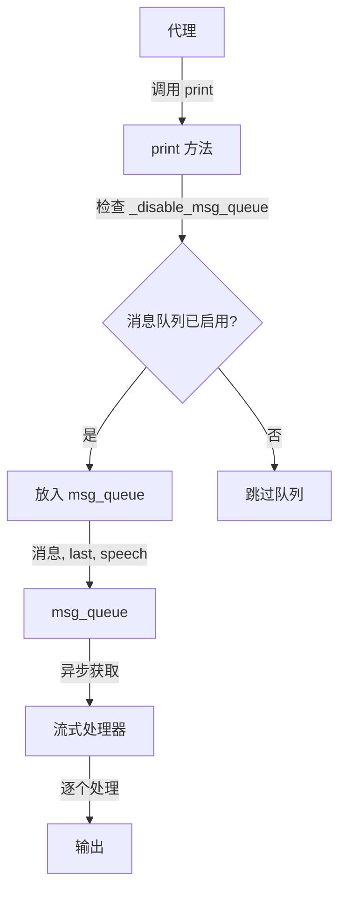
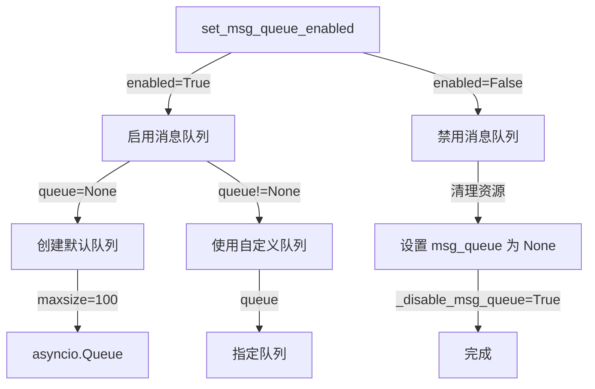
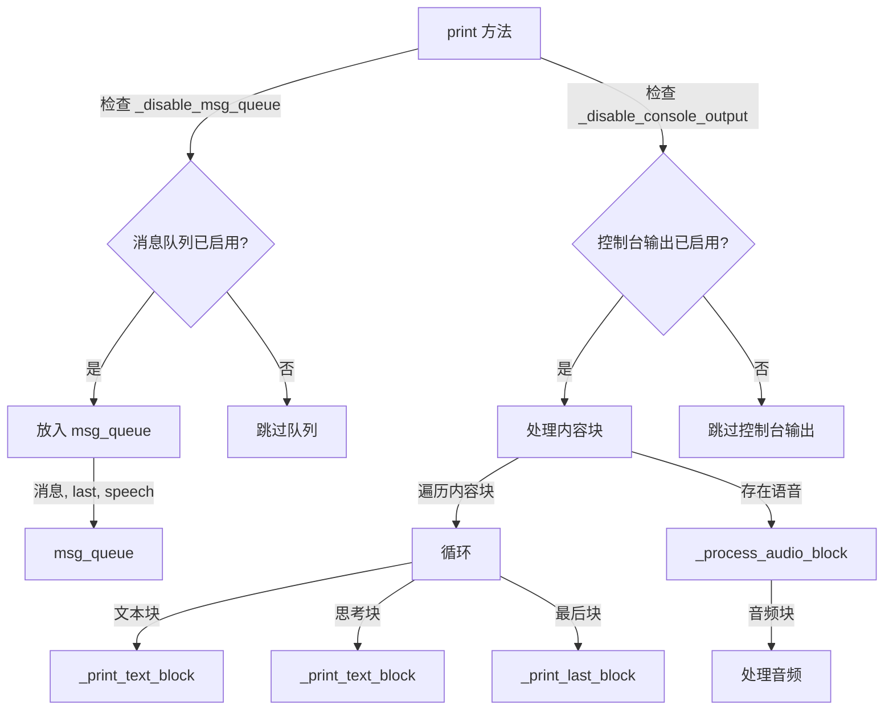
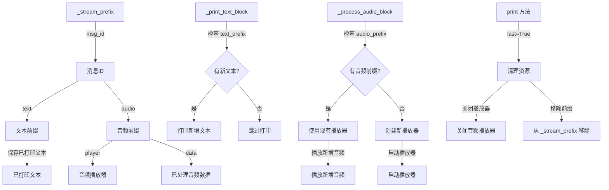

# 流式输出控制

<cite>
**本文档中引用的文件**  
- [agent_base.py](file://src/agentscope/agent/_agent_base.py)
- [functional.py](file://src/agentscope/pipeline/_functional.py)
- [pipeline_test.py](file://tests/pipeline_test.py)
</cite>

## 目录
1. [简介](#简介)
2. [消息队列在流式输出中的核心作用](#消息队列在流式输出中的核心作用)
3. [set_msg_queue_enabled方法的动态控制机制](#set_msg_queue_enabled方法的动态控制机制)
4. [print方法的消息推送与流式处理](#print方法的消息推送与流式处理)
5. [_stream_prefix对累积数据的管理](#_stream_prefix对累积数据的管理)
6. [Web应用集成与性能优化建议](#web应用集成与性能优化建议)
7. [结论](#结论)

## 简介
本文件详细阐述了`_msg_queue`在流式输出中的核心作用，解释了`set_msg_queue_enabled`方法如何动态启用或禁用消息队列。同时分析了`print`方法如何将消息推送到队列并处理文本和音频块的流式传输，以及`_stream_prefix`如何管理累积的文本和音频数据前缀。最后提供了在Web应用中集成流式输出的最佳实践和性能优化建议。

## 消息队列在流式输出中的核心作用

`_msg_queue`是实现流式输出的核心组件，它通过异步队列机制实现了消息的实时捕获和分发。当代理（Agent）调用`print`方法时，消息会被放入消息队列中，从而允许外部系统以流式方式逐个接收和处理这些消息。

消息队列的主要作用包括：
- **实时消息捕获**：在代理执行过程中，所有通过`print`方法输出的消息都会被实时捕获并放入队列。
- **异步消息分发**：通过`asyncio.Queue`实现异步消息分发，确保消息能够高效地传递给订阅者。
- **流式输出支持**：为外部系统提供了一种机制，可以逐个接收和处理消息，而不是等待整个处理过程完成。



**图示来源**
- [agent_base.py](file://src/agentscope/agent/_agent_base.py#L221-L225)

**本节来源**
- [agent_base.py](file://src/agentscope/agent/_agent_base.py#L221-L225)
- [functional.py](file://src/agentscope/pipeline/_functional.py#L158-L162)

## set_msg_queue_enabled方法的动态控制机制

`set_msg_queue_enabled`方法提供了动态启用或禁用消息队列的功能，使得开发者可以根据需要灵活控制流式输出的行为。

该方法的关键特性包括：
- **启用/禁用控制**：通过`enabled`参数控制消息队列的启用状态。
- **自定义队列支持**：允许传入自定义的队列实例，以便进行更精细的控制。
- **资源管理**：在禁用消息队列时，会清理相关资源，避免内存泄漏。



**图示来源**
- [agent_base.py](file://src/agentscope/agent/_agent_base.py#L708-L732)

**本节来源**
- [agent_base.py](file://src/agentscope/agent/_agent_base.py#L708-L732)

## print方法的消息推送与流式处理

`print`方法是流式输出的关键入口，负责将消息推送到队列并处理文本和音频块的流式传输。

该方法的主要功能包括：
- **消息入队**：将消息、最后标志和语音数据一起放入消息队列。
- **控制台输出**：根据`_disable_console_output`标志决定是否在控制台输出消息。
- **文本块处理**：调用`_print_text_block`方法处理文本块。
- **音频块处理**：调用`_process_audio_block`方法处理音频块。



**图示来源**
- [agent_base.py](file://src/agentscope/agent/_agent_base.py#L205-L258)

**本节来源**
- [agent_base.py](file://src/agentscope/agent/_agent_base.py#L205-L258)

## _stream_prefix对累积数据的管理

`_stream_prefix`是一个字典，用于管理每个消息ID对应的累积文本和音频数据前缀。它在流式输出过程中起到了关键的缓冲和增量更新作用。

其主要功能包括：
- **文本前缀管理**：保存已打印的文本前缀，确保只输出新增的内容。
- **音频流管理**：保存音频播放器和已处理的音频数据，支持连续的音频流播放。
- **资源清理**：在消息流结束时，清理相关的资源，如关闭音频播放器。



**图示来源**
- [agent_base.py](file://src/agentscope/agent/_agent_base.py#L365-L404)
- [agent_base.py](file://src/agentscope/agent/_agent_base.py#L328-L357)

**本节来源**
- [agent_base.py](file://src/agentscope/agent/_agent_base.py#L365-L404)
- [agent_base.py](file://src/agentscope/agent/_agent_base.py#L328-L357)

## Web应用集成与性能优化建议

在Web应用中集成流式输出时，需要考虑以下几个方面的最佳实践和性能优化建议：

### 最佳实践
- **合理使用消息队列**：根据应用场景决定是否启用消息队列，避免不必要的资源消耗。
- **及时清理资源**：确保在消息流结束后及时清理相关资源，防止内存泄漏。
- **错误处理**：妥善处理可能出现的异常情况，保证系统的稳定性。

### 性能优化建议
- **队列大小限制**：设置合理的队列大小限制，避免内存占用过高。
- **异步处理**：充分利用异步特性，提高系统的响应速度和吞吐量。
- **批量处理**：在适当的情况下，采用批量处理的方式减少I/O操作次数。

```mermaid
flowchart TD
WebApp[Web应用] --> |启用消息队列| EnableQueue[set_msg_queue_enabled(True)]
WebApp --> |禁用控制台输出| DisableConsole[set_console_output_enabled(False)]
EnableQueue --> |自定义队列| CustomQueue[传入自定义队列]
DisableConsole --> |避免日志混乱| AvoidLogChaos[避免生产环境日志混乱]
WebApp --> |流式处理| StreamProcessing[stream_printing_messages]
StreamProcessing --> |agents| Agents[代理列表]
StreamProcessing --> |coroutine_task| Task[协程任务]
StreamProcessing --> |queue| Queue[队列]
StreamProcessing --> |end_signal| EndSignal[结束信号]
StreamProcessing --> |yield_speech| YieldSpeech[是否返回语音]
StreamProcessing --> |异步生成器| AsyncGenerator[返回异步生成器]
AsyncGenerator --> |逐个接收| ReceiveMessages[逐个接收消息]
ReceiveMessages --> |处理消息| ProcessMessage[处理消息]
ProcessMessage --> |最后块| LastChunk{是否为最后块?}
LastChunk --> |是| Finalize[完成处理]
LastChunk --> |否| Continue[继续接收]
```

**图示来源**
- [functional.py](file://src/agentscope/pipeline/_functional.py#L106-L191)

**本节来源**
- [functional.py](file://src/agentscope/pipeline/_functional.py#L106-L191)
- [pipeline_test.py](file://tests/pipeline_test.py#L378-L408)

## 结论
通过对`_msg_queue`、`set_msg_queue_enabled`、`print`方法和`_stream_prefix`的深入分析，我们全面了解了流式输出的实现机制。这些组件共同协作，实现了高效、灵活的流式输出功能。在实际应用中，应根据具体需求合理配置和使用这些功能，以达到最佳的性能和用户体验。