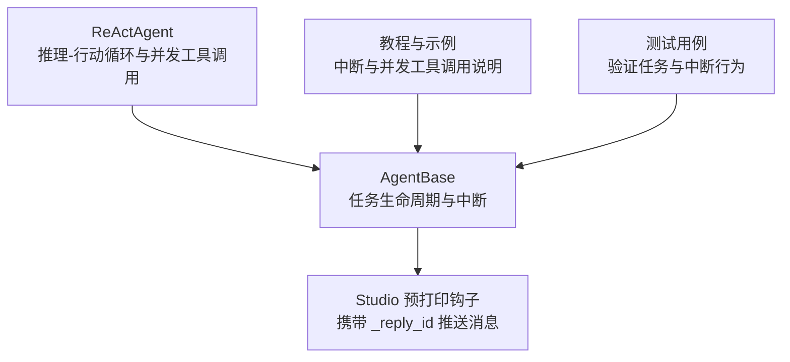
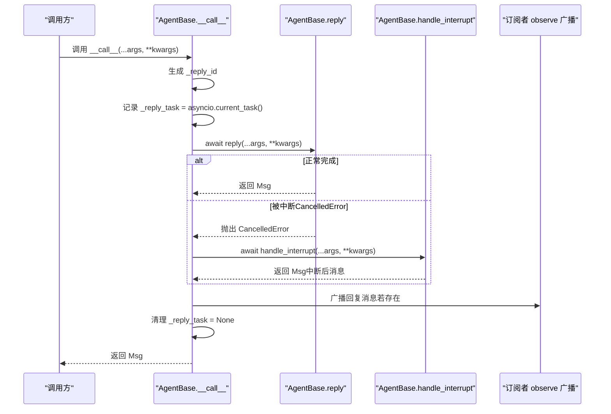
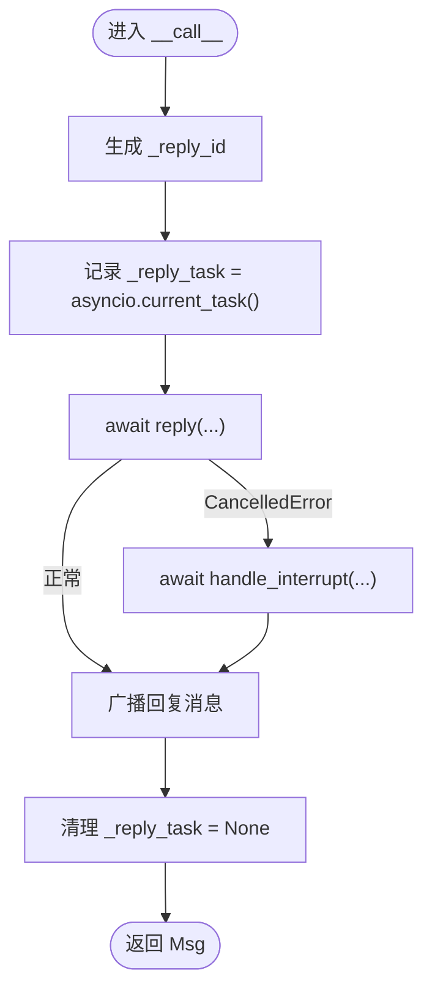
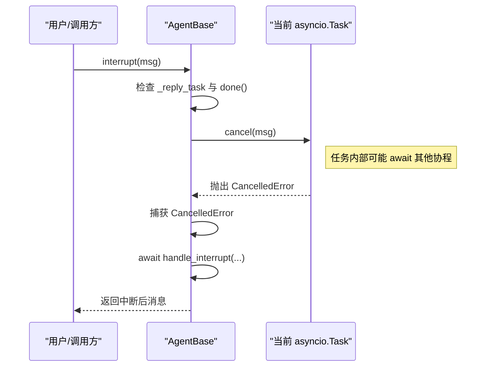
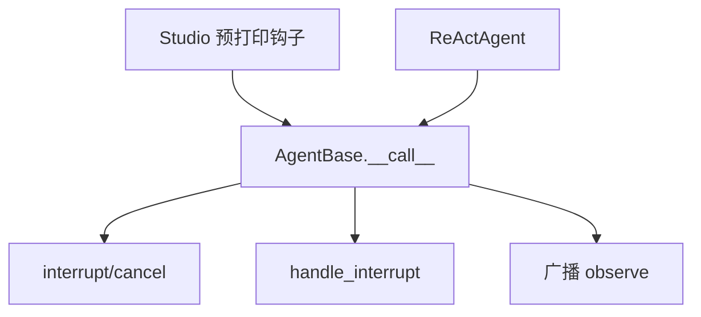

# 运行时任务管理

<cite>
**本文引用的文件**
- [src/agentscope/agent/_agent_base.py](file://src/agentscope/agent/_agent_base.py)
- [src/agentscope/hooks/_studio_hooks.py](file://src/agentscope/hooks/_studio_hooks.py)
- [src/agentscope/agent/_react_agent.py](file://src/agentscope/agent/_react_agent.py)
- [docs/tutorial/zh_CN/src/task_agent.py](file://docs/tutorial/zh_CN/src/task_agent.py)
- [docs/tutorial/zh_CN/src/task_tool.py](file://docs/tutorial/zh_CN/src/task_tool.py)
- [tests/a2a_agent_test.py](file://tests/a2a_agent_test.py)
</cite>

## 目录
1. [简介](#简介)
2. [项目结构](#项目结构)
3. [核心组件](#核心组件)
4. [架构总览](#架构总览)
5. [详细组件分析](#详细组件分析)
6. [依赖关系分析](#依赖关系分析)
7. [性能考量](#性能考量)
8. [故障排查指南](#故障排查指南)
9. [结论](#结论)
10. [附录](#附录)

## 简介
本文件聚焦于智能体运行时任务管理机制，系统性解析以下关键点：
- 在 AgentBase.__call__ 中，_reply_task 与 _reply_id 的职责与协作方式
- 如何通过 asyncio.Task 管理并发回复任务
- 如何使用 _reply_id 跟踪当前回复的唯一标识
- 任务取消机制与中断处理的协同工作流程
- 处理长时间运行任务的最佳实践与错误处理策略

## 项目结构
围绕“运行时任务管理”的相关代码主要分布在以下模块：
- 智能体基类：AgentBase（任务生命周期、中断、广播）
- Studio 钩子：用于在打印前向 Studio 推送消息并携带 _reply_id
- ReAct 智能体：在复杂推理-行动循环中体现任务管理与并发工具调用
- 教程与测试：验证中断、并发工具调用与任务标识的正确性

图示来源
- [src/agentscope/agent/_agent_base.py](file://src/agentscope/agent/_agent_base.py#L444-L490)
- [src/agentscope/hooks/_studio_hooks.py](file://src/agentscope/hooks/_studio_hooks.py#L1-L54)
- [src/agentscope/agent/_react_agent.py](file://src/agentscope/agent/_react_agent.py#L1-L200)
- [docs/tutorial/zh_CN/src/task_agent.py](file://docs/tutorial/zh_CN/src/task_agent.py#L60-L110)
- [docs/tutorial/zh_CN/src/task_tool.py](file://docs/tutorial/zh_CN/src/task_tool.py#L195-L226)
- [tests/a2a_agent_test.py](file://tests/a2a_agent_test.py#L119-L146)

章节来源
- [src/agentscope/agent/_agent_base.py](file://src/agentscope/agent/_agent_base.py#L139-L182)
- [src/agentscope/agent/_agent_base.py](file://src/agentscope/agent/_agent_base.py#L444-L490)
- [src/agentscope/hooks/_studio_hooks.py](file://src/agentscope/hooks/_studio_hooks.py#L1-L54)
- [src/agentscope/agent/_react_agent.py](file://src/agentscope/agent/_react_agent.py#L1-L200)
- [docs/tutorial/zh_CN/src/task_agent.py](file://docs/tutorial/zh_CN/src/task_agent.py#L60-L110)
- [docs/tutorial/zh_CN/src/task_tool.py](file://docs/tutorial/zh_CN/src/task_tool.py#L195-L226)
- [tests/a2a_agent_test.py](file://tests/a2a_agent_test.py#L119-L146)

## 核心组件
- AgentBase.__call__：统一入口，负责创建当前回复任务标识、捕获取消异常、完成后的广播与清理
- AgentBase.interrupt：触发当前回复任务取消
- AgentBase.handle_interrupt：中断后的后处理抽象接口，由具体智能体实现
- Studio 预打印钩子：在打印前携带 _reply_id 向 Studio 推送消息
- ReActAgent：在推理-行动循环中体现并发工具调用与任务管理

章节来源
- [src/agentscope/agent/_agent_base.py](file://src/agentscope/agent/_agent_base.py#L444-L490)
- [src/agentscope/hooks/_studio_hooks.py](file://src/agentscope/hooks/_studio_hooks.py#L1-L54)
- [src/agentscope/agent/_react_agent.py](file://src/agentscope/agent/_react_agent.py#L1-L200)

## 架构总览
AgentBase.__call__ 是运行时任务管理的核心，贯穿“开始—执行—中断—后处理—广播—清理”的完整生命周期。

图示来源
- [src/agentscope/agent/_agent_base.py](file://src/agentscope/agent/_agent_base.py#L444-L490)

## 详细组件分析

### AgentBase.__call__ 与任务标识
- 生成唯一回复标识：每次进入 __call__ 时，设置 _reply_id 为新 UUID，确保每轮回复具备可追踪的唯一标识
- 记录当前任务：将 asyncio.current_task() 赋值给 _reply_task，便于后续中断操作定位目标任务
- 异常捕获：捕获 asyncio.CancelledError，交由 handle_interrupt 进行中断后处理
- 广播与清理：无论正常完成还是被中断，均在 finally 中广播回复消息并清理 _reply_task

图示来源
- [src/agentscope/agent/_agent_base.py](file://src/agentscope/agent/_agent_base.py#L444-L490)

章节来源
- [src/agentscope/agent/_agent_base.py](file://src/agentscope/agent/_agent_base.py#L444-L490)

### 中断与取消机制
- 触发中断：interrupt 会检查当前 _reply_task 是否存在且未完成，若满足条件则调用 cancel(msg)，向任务注入取消信号
- 捕获取消：在 __call__ 内部捕获 CancelledError，避免异常冒泡至调用方，转而执行 handle_interrupt
- 后处理抽象：handle_interrupt 为抽象方法，需由具体智能体实现中断后的消息生成与状态恢复逻辑

图示来源
- [src/agentscope/agent/_agent_base.py](file://src/agentscope/agent/_agent_base.py#L486-L490)
- [src/agentscope/agent/_agent_base.py](file://src/agentscope/agent/_agent_base.py#L444-L490)

章节来源
- [src/agentscope/agent/_agent_base.py](file://src/agentscope/agent/_agent_base.py#L486-L490)
- [src/agentscope/agent/_agent_base.py](file://src/agentscope/agent/_agent_base.py#L444-L490)

### 广播与订阅者
- 回复完成后，AgentBase 会遍历所有订阅者，逐个调用其 observe 方法推送消息
- 订阅者通常来自消息中枢（MsgHub），用于将回复消息分发给其他智能体或外部组件

章节来源
- [src/agentscope/agent/_agent_base.py](file://src/agentscope/agent/_agent_base.py#L465-L473)

### Studio 钩子中的 _reply_id 使用
- 预打印钩子在发送消息到 Studio 之前，优先读取智能体实例上的 _reply_id；若不存在，则生成新的 UUID
- 该设计保证了即使在某些打印路径上未经过 AgentBase.__call__，也能为消息关联一个稳定的回复标识

章节来源
- [src/agentscope/hooks/_studio_hooks.py](file://src/agentscope/hooks/_studio_hooks.py#L1-L54)

### 并发回复任务与工具调用
- ReActAgent 支持并行工具调用，当模型返回多个工具调用且开启并行时，使用 asyncio.gather 并行执行
- 该模式与 AgentBase 的任务管理相辅相成：每个智能体回复作为一个独立任务，工具调用作为子任务并行执行，统一由智能体任务生命周期管理

章节来源
- [docs/tutorial/zh_CN/src/task_agent.py](file://docs/tutorial/zh_CN/src/task_agent.py#L108-L117)
- [src/agentscope/agent/_react_agent.py](file://src/agentscope/agent/_react_agent.py#L1-L200)

### 长时间运行任务的最佳实践
- 在工具函数中合理 await，确保可中断点足够频繁
- 对外部 I/O（如网络请求、文件读写）采用异步实现，避免阻塞事件循环
- 在工具函数中主动感知取消信号，必要时抛出 CancelledError 以触发中断链路
- 对耗时任务进行分片与进度汇报，便于用户感知与中断决策

章节来源
- [docs/tutorial/zh_CN/src/task_tool.py](file://docs/tutorial/zh_CN/src/task_tool.py#L195-L226)

## 依赖关系分析
- AgentBase.__call__ 依赖 asyncio.Task 生命周期与 CancelledError 异常传播
- Studio 预打印钩子依赖 AgentBase 的 _reply_id 字段
- ReActAgent 在推理-行动循环中体现并发工具调用，与 AgentBase 的任务管理形成互补

图示来源
- [src/agentscope/agent/_agent_base.py](file://src/agentscope/agent/_agent_base.py#L444-L490)
- [src/agentscope/hooks/_studio_hooks.py](file://src/agentscope/hooks/_studio_hooks.py#L1-L54)
- [src/agentscope/agent/_react_agent.py](file://src/agentscope/agent/_react_agent.py#L1-L200)

章节来源
- [src/agentscope/agent/_agent_base.py](file://src/agentscope/agent/_agent_base.py#L444-L490)
- [src/agentscope/hooks/_studio_hooks.py](file://src/agentscope/hooks/_studio_hooks.py#L1-L54)
- [src/agentscope/agent/_react_agent.py](file://src/agentscope/agent/_react_agent.py#L1-L200)

## 性能考量
- 任务标识开销极低：UUID 生成成本可忽略，但应避免在高频打印场景重复生成
- 广播成本：订阅者数量与 observe 调用次数线性相关，建议控制订阅范围
- 并发工具调用：合理设置并行度，避免资源争用与超载
- I/O 异步化：减少阻塞，提升整体吞吐

## 故障排查指南
- 中断无效
  - 检查是否在 AgentBase.__call__ 中设置了 _reply_task
  - 确认 interrupt 调用发生在任务未完成的状态
  - 确保工具函数中存在可中断的 await 点
- 中断后无消息
  - 检查 handle_interrupt 是否实现并返回有效消息
  - 确认广播逻辑未被跳过（finally 中的广播）
- Studio 侧无消息
  - 检查预打印钩子是否正确读取 _reply_id
  - 若 _reply_id 不存在，确认钩子是否回退生成 UUID

章节来源
- [src/agentscope/agent/_agent_base.py](file://src/agentscope/agent/_agent_base.py#L444-L490)
- [src/agentscope/hooks/_studio_hooks.py](file://src/agentscope/hooks/_studio_hooks.py#L1-L54)

## 结论
- AgentBase.__call__ 通过 _reply_id 与 _reply_task 构建了清晰的回复任务生命周期
- 中断机制基于 asyncio.CancelledError 与 interrupt/cancel 协同，确保长时间运行任务可被安全终止
- 广播与订阅者机制保障了消息的跨组件传递
- ReActAgent 的并发工具调用进一步体现了异步任务管理在复杂工作流中的价值
- 最佳实践强调在工具函数中保持可中断性与异步 I/O，配合合理的错误处理策略，提升系统的稳定性与可观测性

## 附录
- 示例与测试验证
  - A2A Agent 测试用例展示了任务型回复的消息结构与内容
  - 教程文档对中断与并发工具调用进行了说明与示例

章节来源
- [tests/a2a_agent_test.py](file://tests/a2a_agent_test.py#L119-L146)
- [docs/tutorial/zh_CN/src/task_agent.py](file://docs/tutorial/zh_CN/src/task_agent.py#L60-L110)
- [docs/tutorial/zh_CN/src/task_tool.py](file://docs/tutorial/zh_CN/src/task_tool.py#L195-L226)