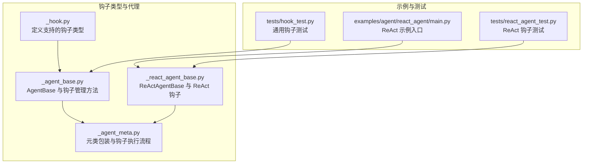
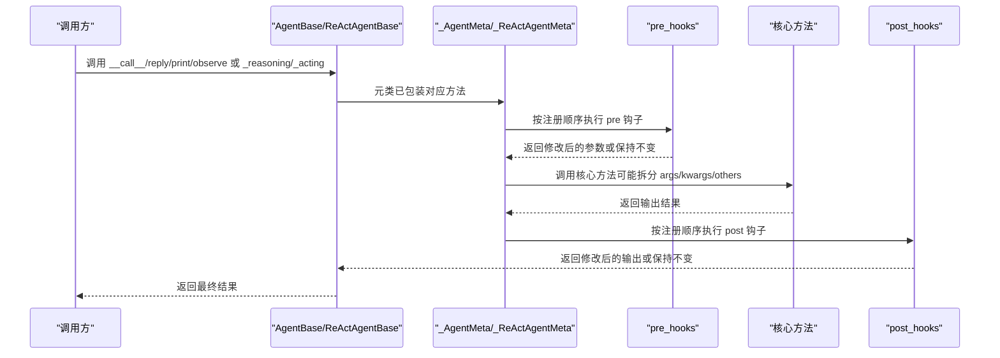
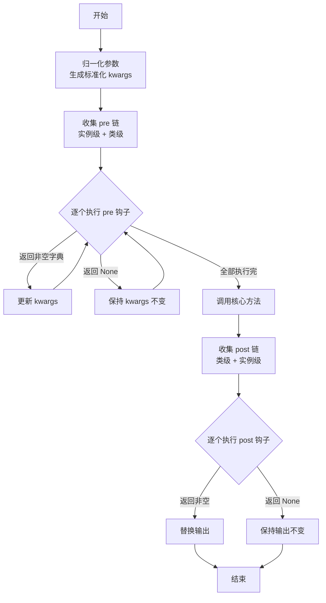
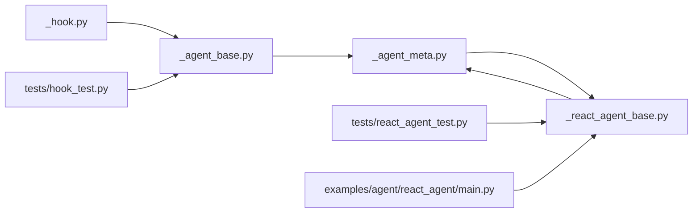

# 钩子系统

<cite>
**本文引用的文件列表**
- [src/agentscope/agent/_agent_base.py](file://src/agentscope/agent/_agent_base.py)
- [src/agentscope/agent/_agent_meta.py](file://src/agentscope/agent/_agent_meta.py)
- [src/agentscope/agent/_react_agent_base.py](file://src/agentscope/agent/_react_agent_base.py)
- [src/agentscope/types/_hook.py](file://src/agentscope/types/_hook.py)
- [src/agentscope/hooks/_studio_hooks.py](file://src/agentscope/hooks/_studio_hooks.py)
- [tests/hook_test.py](file://tests/hook_test.py)
- [tests/react_agent_test.py](file://tests/react_agent_test.py)
- [examples/agent/react_agent/main.py](file://examples/agent/react_agent/main.py)
</cite>

## 目录
1. [简介](#简介)
2. [项目结构](#项目结构)
3. [核心组件](#核心组件)
4. [架构总览](#架构总览)
5. [详细组件分析](#详细组件分析)
6. [依赖关系分析](#依赖关系分析)
7. [性能考量](#性能考量)
8. [故障排查指南](#故障排查指南)
9. [结论](#结论)
10. [附录](#附录)

## 简介
本文件系统性解析智能体钩子系统，覆盖基础钩子类型（如 pre_reply、post_reply、pre_print、post_print、pre_observe、post_observe）以及 ReActAgentBase 扩展的专用钩子（pre_reasoning、post_reasoning、pre_acting、post_acting）。文档重点说明类级别与实例级别的钩子差异、钩子函数的执行时机与数据流，并提供注册、移除与清理钩子的参考路径与最佳实践，帮助读者在不直接阅读源码的情况下理解钩子机制并用于日志记录、性能监控与业务逻辑扩展。

## 项目结构
钩子系统主要分布在以下模块：
- 类型定义：定义支持的钩子类型集合
- 基础代理与元类：定义通用钩子接口、注册/移除/清理方法，以及通过元类自动包装核心方法
- ReAct 代理基类：扩展出 ReAct 专用钩子类型，并由 ReAct 元类进行包装
- 示例与测试：演示钩子的使用方式与行为验证

图表来源
- [src/agentscope/types/_hook.py](file://src/agentscope/types/_hook.py#L1-L26)
- [src/agentscope/agent/_agent_base.py](file://src/agentscope/agent/_agent_base.py#L30-L120)
- [src/agentscope/agent/_agent_meta.py](file://src/agentscope/agent/_agent_meta.py#L147-L181)
- [src/agentscope/agent/_react_agent_base.py](file://src/agentscope/agent/_react_agent_base.py#L12-L33)
- [examples/agent/react_agent/main.py](file://examples/agent/react_agent/main.py#L1-L51)
- [tests/hook_test.py](file://tests/hook_test.py#L192-L285)
- [tests/react_agent_test.py](file://tests/react_agent_test.py#L96-L143)

章节来源
- [src/agentscope/types/_hook.py](file://src/agentscope/types/_hook.py#L1-L26)
- [src/agentscope/agent/_agent_base.py](file://src/agentscope/agent/_agent_base.py#L30-L120)
- [src/agentscope/agent/_agent_meta.py](file://src/agentscope/agent/_agent_meta.py#L147-L181)
- [src/agentscope/agent/_react_agent_base.py](file://src/agentscope/agent/_react_agent_base.py#L12-L33)
- [examples/agent/react_agent/main.py](file://examples/agent/react_agent/main.py#L1-L51)

## 核心组件
- 钩子类型定义：统一约束支持的钩子类型，包含基础类型与 ReAct 扩展类型
- AgentBase：提供通用钩子注册、移除、清理能力；定义核心方法（reply、print、observe）的钩子接口
- 元类包装：在类创建时自动为 reply/print/observe（以及 ReAct 的 _reasoning/_acting）注入预处理与后处理钩子链
- ReActAgentBase：扩展出 ReAct 专用钩子类型，并初始化实例级钩子容器
- Studio 钩子：提供与 Studio 平台集成的消息转发钩子示例

章节来源
- [src/agentscope/types/_hook.py](file://src/agentscope/types/_hook.py#L1-L26)
- [src/agentscope/agent/_agent_base.py](file://src/agentscope/agent/_agent_base.py#L30-L120)
- [src/agentscope/agent/_agent_meta.py](file://src/agentscope/agent/_agent_meta.py#L147-L181)
- [src/agentscope/agent/_react_agent_base.py](file://src/agentscope/agent/_react_agent_base.py#L12-L33)
- [src/agentscope/hooks/_studio_hooks.py](file://src/agentscope/hooks/_studio_hooks.py#L1-L54)

## 架构总览
钩子系统通过“类型定义 + 代理基类 + 元类包装 + 实例/类钩子容器”的组合实现：
- 类型定义：限定可用钩子名称集合
- 代理基类：维护每种钩子类型的类级与实例级容器，并提供注册/移除/清理 API
- 元类包装：在类创建阶段对核心方法进行装饰，形成“pre 链 -> 核心方法 -> post 链”的调用序列
- ReAct 扩展：在 ReAct 元类中对 _reasoning/_acting 进行同样的包装，支持 ReAct 专用钩子

图表来源
- [src/agentscope/agent/_agent_meta.py](file://src/agentscope/agent/_agent_meta.py#L55-L145)
- [src/agentscope/agent/_agent_base.py](file://src/agentscope/agent/_agent_base.py#L491-L733)
- [src/agentscope/agent/_react_agent_base.py](file://src/agentscope/agent/_react_agent_base.py#L92-L117)

## 详细组件分析

### 钩子类型与支持范围
- 基础钩子类型：pre_reply、post_reply、pre_print、post_print、pre_observe、post_observe
- ReAct 扩展类型：pre_reasoning、post_reasoning、pre_acting、post_acting
- 支持范围由类型定义文件集中声明，ReActAgentBase 在其 supported_hook_types 中追加了 ReAct 专用类型

章节来源
- [src/agentscope/types/_hook.py](file://src/agentscope/types/_hook.py#L1-L26)
- [src/agentscope/agent/_react_agent_base.py](file://src/agentscope/agent/_react_agent_base.py#L21-L33)

### AgentBase：钩子容器与管理 API
- 容器字段
  - 类级容器：以 _class_<hook_type>_hooks 形式存储，作用于该类所有实例
  - 实例级容器：以 _instance_<hook_type>_hooks 形式存储，仅影响当前实例
- 注册/移除/清理
  - register_instance_hook / remove_instance_hook / clear_instance_hooks
  - register_class_hook / remove_class_hook / clear_class_hooks
- 执行顺序
  - pre 链：先执行实例级，再执行类级
  - post 链：先执行类级，再执行实例级
  - 多个同类型钩子按注册顺序依次执行

章节来源
- [src/agentscope/agent/_agent_base.py](file://src/agentscope/agent/_agent_base.py#L30-L120)
- [src/agentscope/agent/_agent_base.py](file://src/agentscope/agent/_agent_base.py#L491-L733)

### 元类包装：钩子执行流程
- 参数归一化：将传入的参数绑定到函数签名，生成标准化的 kwargs 字典
- 预处理链（pre）：按“实例级 + 类级”顺序执行，若返回非空字典则作为下一次输入
- 核心方法：根据 kwargs 中的 args/kwargs/others 拆分传入
- 后处理链（post）：按“类级 + 实例级”顺序执行，若返回非空则替换输出

图表来源
- [src/agentscope/agent/_agent_meta.py](file://src/agentscope/agent/_agent_meta.py#L21-L53)
- [src/agentscope/agent/_agent_meta.py](file://src/agentscope/agent/_agent_meta.py#L55-L145)

章节来源
- [src/agentscope/agent/_agent_meta.py](file://src/agentscope/agent/_agent_meta.py#L55-L145)

### ReActAgentBase：专用钩子与元类扩展
- supported_hook_types：在基础类型上追加 pre_reasoning、post_reasoning、pre_acting、post_acting
- 实例级钩子容器：在构造函数中初始化四类实例级容器
- 元类扩展：ReAct 元类在类创建时对 _reasoning/_acting 进行包装，遵循与 AgentBase 相同的执行顺序

章节来源
- [src/agentscope/agent/_react_agent_base.py](file://src/agentscope/agent/_react_agent_base.py#L12-L33)
- [src/agentscope/agent/_react_agent_base.py](file://src/agentscope/agent/_react_agent_base.py#L92-L117)
- [src/agentscope/agent/_agent_meta.py](file://src/agentscope/agent/_agent_meta.py#L165-L181)

### Studio 钩子：消息转发示例
- as_studio_forward_message_pre_print_hook：在打印前将消息转发至 Studio 平台，支持重试与禁用控制台输出
- 适用场景：调试、可视化、远程追踪

章节来源
- [src/agentscope/hooks/_studio_hooks.py](file://src/agentscope/hooks/_studio_hooks.py#L1-L54)

### 使用示例与测试参考
- 通用钩子测试：展示 pre_reply/post_reply/pre_print/post_observe 的注册、执行顺序与清理
- ReAct 钩子测试：展示 pre_reasoning/post_reasoning/pre_acting/post_acting 的注册与计数验证
- ReAct 示例入口：展示 ReActAgent 的基本使用流程

章节来源
- [tests/hook_test.py](file://tests/hook_test.py#L192-L285)
- [tests/react_agent_test.py](file://tests/react_agent_test.py#L96-L143)
- [examples/agent/react_agent/main.py](file://examples/agent/react_agent/main.py#L1-L51)

## 依赖关系分析
- 类型定义依赖于 ReActAgentBase 的扩展类型
- AgentBase 依赖类型定义以约束 supported_hook_types
- 元类包装依赖 AgentBase 的容器字段命名约定
- ReActAgentBase 依赖 ReAct 元类以包装 _reasoning/_acting
- 测试与示例依赖上述组件以验证钩子行为

图表来源
- [src/agentscope/types/_hook.py](file://src/agentscope/types/_hook.py#L1-L26)
- [src/agentscope/agent/_agent_base.py](file://src/agentscope/agent/_agent_base.py#L30-L120)
- [src/agentscope/agent/_agent_meta.py](file://src/agentscope/agent/_agent_meta.py#L147-L181)
- [src/agentscope/agent/_react_agent_base.py](file://src/agentscope/agent/_react_agent_base.py#L12-L33)
- [tests/hook_test.py](file://tests/hook_test.py#L192-L285)
- [tests/react_agent_test.py](file://tests/react_agent_test.py#L96-L143)
- [examples/agent/react_agent/main.py](file://examples/agent/react_agent/main.py#L1-L51)

章节来源
- [src/agentscope/types/_hook.py](file://src/agentscope/types/_hook.py#L1-L26)
- [src/agentscope/agent/_agent_base.py](file://src/agentscope/agent/_agent_base.py#L30-L120)
- [src/agentscope/agent/_agent_meta.py](file://src/agentscope/agent/_agent_meta.py#L147-L181)
- [src/agentscope/agent/_react_agent_base.py](file://src/agentscope/agent/_react_agent_base.py#L12-L33)
- [tests/hook_test.py](file://tests/hook_test.py#L192-L285)
- [tests/react_agent_test.py](file://tests/react_agent_test.py#L96-L143)
- [examples/agent/react_agent/main.py](file://examples/agent/react_agent/main.py#L1-L51)

## 性能考量
- 钩子链长度：每个方法的钩子数量越多，执行开销越大。建议按需注册，避免冗余钩子
- 异步钩子：异步钩子会引入事件循环调度成本，应尽量避免在热路径中频繁切换任务
- 参数归一化：每次调用都会进行参数绑定与深拷贝，建议在 pre 钩子中谨慎修改 kwargs，减少不必要的复制
- 输出替换：post 钩子返回新对象会增加内存分配，必要时可返回 None 以复用原输出

## 故障排查指南
- 钩子未生效
  - 检查是否在正确的类/实例上注册了钩子
  - 确认 supported_hook_types 是否包含目标钩子类型
- 执行顺序异常
  - 预期顺序：实例级 pre -> 类级 pre -> 核心方法 -> 类级 post -> 实例级 post
  - 若出现不符合预期的行为，请检查钩子返回值是否为 None 或字典
- 参数绑定失败
  - 当传入参数与函数签名不匹配时会抛出错误，检查钩子函数签名与调用参数
- 清理钩子后仍生效
  - 确保调用了 clear_instance_hooks/clear_class_hooks，并确认未在其他实例/类中重复注册

章节来源
- [src/agentscope/agent/_agent_meta.py](file://src/agentscope/agent/_agent_meta.py#L21-L53)
- [src/agentscope/agent/_agent_base.py](file://src/agentscope/agent/_agent_base.py#L491-L733)

## 结论
钩子系统通过类型约束、容器管理与元类包装，实现了对 AgentBase 与 ReActAgentBase 的统一扩展点。类级别钩子适合全局策略注入，实例级别钩子适合个性化定制。通过规范的注册/移除/清理流程与明确的执行顺序，开发者可以安全地在不侵入核心逻辑的前提下实现日志记录、性能监控与业务扩展。

## 附录

### 钩子类型一览
- 基础类型：pre_reply、post_reply、pre_print、post_print、pre_observe、post_observe
- ReAct 扩展：pre_reasoning、post_reasoning、pre_acting、post_acting

章节来源
- [src/agentscope/types/_hook.py](file://src/agentscope/types/_hook.py#L1-L26)
- [src/agentscope/agent/_react_agent_base.py](file://src/agentscope/agent/_react_agent_base.py#L21-L33)

### 注册、移除与清理参考路径
- 注册实例钩子：[register_instance_hook](file://src/agentscope/agent/_agent_base.py#L491-L518)
- 移除实例钩子：[remove_instance_hook](file://src/agentscope/agent/_agent_base.py#L519-L547)
- 清理实例钩子：[clear_instance_hooks](file://src/agentscope/agent/_agent_base.py#L629-L658)
- 注册类钩子：[register_class_hook](file://src/agentscope/agent/_agent_base.py#L549-L575)
- 移除类钩子：[remove_class_hook](file://src/agentscope/agent/_agent_base.py#L577-L604)
- 清理类钩子：[clear_class_hooks](file://src/agentscope/agent/_agent_base.py#L606-L628)

### 执行时机与数据流
- 执行顺序：实例级 pre -> 类级 pre -> 核心方法 -> 类级 post -> 实例级 post
- 数据流：pre 钩子接收深拷贝的 kwargs，可返回新字典或 None；post 钩子接收深拷贝的 kwargs 与输出，可返回新输出或 None

章节来源
- [src/agentscope/agent/_agent_meta.py](file://src/agentscope/agent/_agent_meta.py#L55-L145)

### 实践建议
- 日志记录：在 pre/post 钩子中记录关键上下文，避免在热路径中做重型 I/O
- 性能监控：在 pre 记录时间戳，在 post 计算耗时并上报指标
- 业务扩展：在 pre 修改输入参数（如注入上下文），在 post 包装输出（如添加元数据）