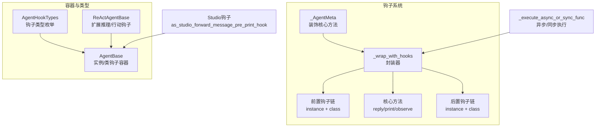
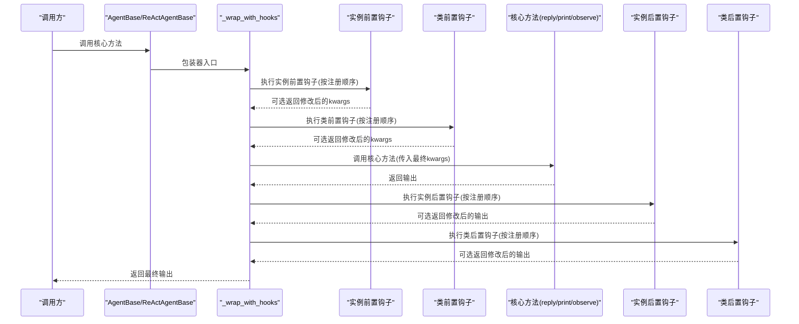
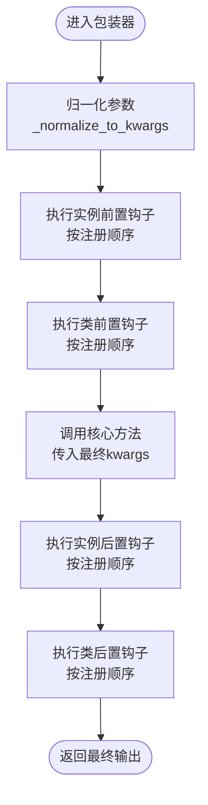
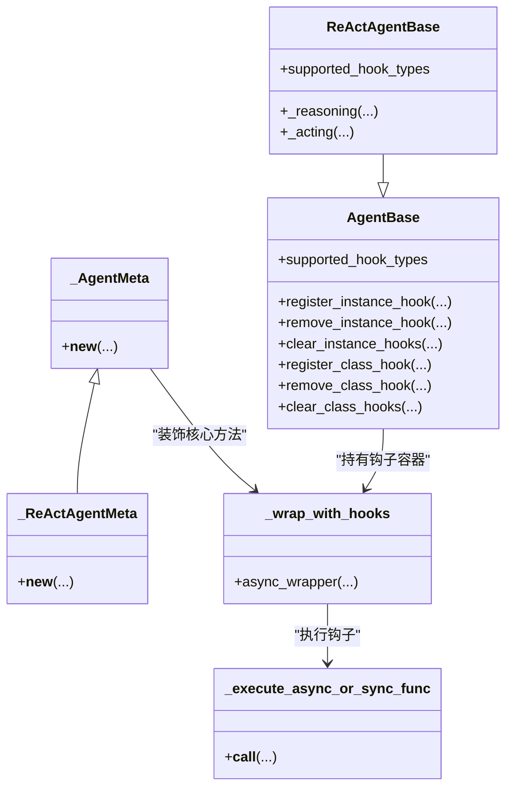

# 智能体钩子系统

<cite>
**本文引用的文件**
- [src/agentscope/agent/_agent_base.py](file://src/agentscope/agent/_agent_base.py)
- [src/agentscope/agent/_agent_meta.py](file://src/agentscope/agent/_agent_meta.py)
- [src/agentscope/agent/_react_agent_base.py](file://src/agentscope/agent/_react_agent_base.py)
- [src/agentscope/types/_hook.py](file://src/agentscope/types/_hook.py)
- [src/agentscope/hooks/__init__.py](file://src/agentscope/hooks/__init__.py)
- [src/agentscope/hooks/_studio_hooks.py](file://src/agentscope/hooks/_studio_hooks.py)
- [src/agentscope/_utils/_common.py](file://src/agentscope/_utils/_common.py)
- [tests/hook_test.py](file://tests/hook_test.py)
- [docs/tutorial/zh_CN/src/task_hook.py](file://docs/tutorial/zh_CN/src/task_hook.py)
</cite>

## 目录
1. [引言](#引言)
2. [项目结构](#项目结构)
3. [核心组件](#核心组件)
4. [架构总览](#架构总览)
5. [详细组件分析](#详细组件分析)
6. [依赖关系分析](#依赖关系分析)
7. [性能考虑](#性能考虑)
8. [故障排查指南](#故障排查指南)
9. [结论](#结论)
10. [附录](#附录)

## 引言
本文件系统性讲解 AgentScope 智能体钩子（Hook）体系的架构与应用，重点对比类级别钩子（_class_pre/post_*_hooks）与实例级别钩子（_instance_pre/post_*_hooks）的作用域与使用场景；通过测试与教程中的示例路径，展示如何使用 register_instance_hook 与 register_class_hook 注册钩子；详解六种支持的钩子类型（pre/post_reply、pre/post_print、pre/post_observe）的触发时机与典型用例（日志记录、输入预处理、输出后处理、性能监控等）；并给出创建可复用钩子函数的最佳实践，以及如何通过 remove_instance_hook 与 clear_instance_hooks 进行动态管理。

## 项目结构
钩子系统由“元类包装 + 实例/类钩子容器 + 工具函数”三部分组成：
- 元类包装：在类构建时对核心方法（reply、print、observe）进行装饰，注入前置/后置钩子链。
- 钩子容器：实例与类分别维护各自的有序钩子字典，保证注册顺序即执行顺序。
- 工具函数：统一异步/同步钩子执行逻辑，规范化参数传递与返回值处理。

图表来源
- [src/agentscope/agent/_agent_meta.py](file://src/agentscope/agent/_agent_meta.py#L147-L181)
- [src/agentscope/agent/_agent_base.py](file://src/agentscope/agent/_agent_base.py#L30-L139)
- [src/agentscope/agent/_react_agent_base.py](file://src/agentscope/agent/_react_agent_base.py#L12-L33)
- [src/agentscope/types/_hook.py](file://src/agentscope/types/_hook.py#L1-L26)
- [src/agentscope/_utils/_common.py](file://src/agentscope/_utils/_common.py#L108-L132)
- [src/agentscope/hooks/__init__.py](file://src/agentscope/hooks/__init__.py#L17-L30)

章节来源
- [src/agentscope/agent/_agent_meta.py](file://src/agentscope/agent/_agent_meta.py#L147-L181)
- [src/agentscope/agent/_agent_base.py](file://src/agentscope/agent/_agent_base.py#L30-L139)
- [src/agentscope/agent/_react_agent_base.py](file://src/agentscope/agent/_react_agent_base.py#L12-L33)
- [src/agentscope/types/_hook.py](file://src/agentscope/types/_hook.py#L1-L26)
- [src/agentscope/_utils/_common.py](file://src/agentscope/_utils/_common.py#L108-L132)
- [src/agentscope/hooks/__init__.py](file://src/agentscope/hooks/__init__.py#L17-L30)

## 核心组件
- 钩子类型定义：支持六种基础钩子类型（pre/post_reply、pre/post_print、pre/post_observe），ReActAgentBase 额外支持 pre/post_reasoning、pre/post_acting。
- 元类装饰：_AgentMeta 在类构建时将核心方法包裹为带钩子的异步包装器。
- 钩子容器：AgentBase 维护实例与类两套有序钩子字典；ReActAgentBase 还额外维护推理/行动钩子容器。
- 工具函数：_execute_async_or_sync_func 统一执行异步/同步钩子，_normalize_to_kwargs 将实参标准化为 kwargs 字典。

章节来源
- [src/agentscope/types/_hook.py](file://src/agentscope/types/_hook.py#L1-L26)
- [src/agentscope/agent/_agent_meta.py](file://src/agentscope/agent/_agent_meta.py#L21-L53)
- [src/agentscope/agent/_agent_base.py](file://src/agentscope/agent/_agent_base.py#L30-L139)
- [src/agentscope/agent/_react_agent_base.py](file://src/agentscope/agent/_react_agent_base.py#L12-L33)
- [src/agentscope/_utils/_common.py](file://src/agentscope/_utils/_common.py#L108-L132)

## 架构总览
下图展示了钩子在调用流程中的位置与执行顺序：实例级前置钩子先于类级前置钩子执行，随后调用核心方法，再依次执行实例级与类级后置钩子。

图表来源
- [src/agentscope/agent/_agent_meta.py](file://src/agentscope/agent/_agent_meta.py#L55-L145)
- [src/agentscope/agent/_agent_base.py](file://src/agentscope/agent/_agent_base.py#L491-L733)
- [src/agentscope/agent/_react_agent_base.py](file://src/agentscope/agent/_react_agent_base.py#L12-L33)

章节来源
- [src/agentscope/agent/_agent_meta.py](file://src/agentscope/agent/_agent_meta.py#L55-L145)
- [src/agentscope/agent/_agent_base.py](file://src/agentscope/agent/_agent_base.py#L491-L733)

## 详细组件分析

### 类级别钩子 vs 实例级别钩子
- 作用域
  - 类级别钩子：对类的所有实例生效，适合全局策略（如统一日志、统一鉴权）。
  - 实例级别钩子：仅对当前实例生效，适合个性化定制（如特定智能体的输入预处理）。
- 注册与移除
  - 类级别：通过类方法 register_class_hook、remove_class_hook、clear_class_hooks。
  - 实例级别：通过实例方法 register_instance_hook、remove_instance_hook、clear_instance_hooks。
- 执行顺序
  - 前置钩子：实例前置 → 类前置。
  - 后置钩子：实例后置 → 类后置。
- 测试验证
  - 测试覆盖了实例/类钩子的注册、执行顺序、移除与清理，确保行为符合预期。

章节来源
- [src/agentscope/agent/_agent_base.py](file://src/agentscope/agent/_agent_base.py#L491-L733)
- [tests/hook_test.py](file://tests/hook_test.py#L208-L285)
- [tests/hook_test.py](file://tests/hook_test.py#L528-L616)

### 六种钩子类型的触发时机与典型用例
- pre_reply / post_reply
  - 触发时机：在智能体生成回复前/后。
  - 典型用例：输入预处理（如清洗/增强）、输出后处理（如格式化/统计）、日志记录、性能监控。
  - 示例路径：[tests/hook_test.py](file://tests/hook_test.py#L208-L285)
- pre_print / post_print
  - 触发时机：在向控制台/界面打印消息前/后。
  - 典型用例：禁用控制台输出、转发消息到 Studio、流式输出聚合。
  - 示例路径：[src/agentscope/hooks/_studio_hooks.py](file://src/agentscope/hooks/_studio_hooks.py#L11-L54)
- pre_observe / post_observe
  - 触发时机：在观察外部消息前/后。
  - 典型用例：内存写入前的数据增强、观察后的副作用（如订阅/广播）。
  - 示例路径：[tests/hook_test.py](file://tests/hook_test.py#L561-L616)

章节来源
- [src/agentscope/types/_hook.py](file://src/agentscope/types/_hook.py#L1-L26)
- [src/agentscope/agent/_agent_base.py](file://src/agentscope/agent/_agent_base.py#L180-L272)
- [src/agentscope/hooks/_studio_hooks.py](file://src/agentscope/hooks/_studio_hooks.py#L11-L54)
- [tests/hook_test.py](file://tests/hook_test.py#L208-L285)
- [tests/hook_test.py](file://tests/hook_test.py#L528-L616)

### 钩子注册与动态管理
- 注册
  - 实例级：实例.register_instance_hook(hook_type, hook_name, hook)。
  - 类级：类.register_class_hook(hook_type, hook_name, hook)。
- 移除与清理
  - 实例级：实例.remove_instance_hook(hook_type, hook_name)、实例.clear_instance_hooks(hook_type)。
  - 类级：类.remove_class_hook(hook_type, hook_name)、类.clear_class_hooks(hook_type)。
- 返回值与参数传递
  - 前置钩子：返回 dict[str, Any] 表示修改后的 kwargs，否则使用上一个非 None 返回值或原始参数副本。
  - 后置钩子：返回 Any 表示修改后的输出，否则沿用上一个非 None 或原输出。
- 示例路径
  - 注册与移除：[docs/tutorial/zh_CN/src/task_hook.py](file://docs/tutorial/zh_CN/src/task_hook.py#L147-L191)
  - 动态管理（测试）：[tests/hook_test.py](file://tests/hook_test.py#L513-L526)

章节来源
- [src/agentscope/agent/_agent_base.py](file://src/agentscope/agent/_agent_base.py#L491-L733)
- [docs/tutorial/zh_CN/src/task_hook.py](file://docs/tutorial/zh_CN/src/task_hook.py#L147-L191)
- [tests/hook_test.py](file://tests/hook_test.py#L513-L526)

### Studio 钩子集成
- 用途：在 pre_print 钩子阶段将消息转发至 Studio，便于可视化与调试。
- 关键点：可通过配置 run_id 与 studio_url，结合禁用控制台输出实现“只上报不打印”。

章节来源
- [src/agentscope/hooks/__init__.py](file://src/agentscope/hooks/__init__.py#L17-L30)
- [src/agentscope/hooks/_studio_hooks.py](file://src/agentscope/hooks/_studio_hooks.py#L11-L54)

### ReAct 智能体的推理/行动钩子
- 支持类型：pre/post_reasoning、pre/post_acting。
- 容器：ReActAgentBase 在初始化时为推理/行动分别建立实例/类钩子容器。
- 元类：_ReActAgentMeta 在类构建时同样对 _reasoning 与 _acting 进行钩子包装。

章节来源
- [src/agentscope/agent/_react_agent_base.py](file://src/agentscope/agent/_react_agent_base.py#L12-L33)
- [src/agentscope/agent/_agent_meta.py](file://src/agentscope/agent/_agent_meta.py#L165-L180)
- [src/agentscope/types/_hook.py](file://src/agentscope/types/_hook.py#L17-L25)

### 钩子执行流程与参数归一化
- 参数归一化：将任意实参与关键字参数绑定为 kwargs 字典，确保钩子签名一致。
- 异步/同步钩子：统一通过 _execute_async_or_sync_func 执行，自动识别协程与同步函数。
- 执行顺序：实例前置 → 类前置 → 核心方法 → 实例后置 → 类后置。

图表来源
- [src/agentscope/agent/_agent_meta.py](file://src/agentscope/agent/_agent_meta.py#L21-L53)
- [src/agentscope/agent/_agent_meta.py](file://src/agentscope/agent/_agent_meta.py#L55-L145)
- [src/agentscope/_utils/_common.py](file://src/agentscope/_utils/_common.py#L108-L132)

章节来源
- [src/agentscope/agent/_agent_meta.py](file://src/agentscope/agent/_agent_meta.py#L21-L53)
- [src/agentscope/agent/_agent_meta.py](file://src/agentscope/agent/_agent_meta.py#L55-L145)
- [src/agentscope/_utils/_common.py](file://src/agentscope/_utils/_common.py#L108-L132)

## 依赖关系分析
- AgentBase 依赖类型定义与元类装饰，维护实例/类钩子容器。
- ReActAgentBase 继承 AgentBase 并扩展推理/行动钩子。
- 元类通过装饰核心方法，将钩子链注入到调用流程。
- 工具函数提供异步/同步钩子执行能力，保障兼容性。

图表来源
- [src/agentscope/agent/_agent_base.py](file://src/agentscope/agent/_agent_base.py#L30-L139)
- [src/agentscope/agent/_react_agent_base.py](file://src/agentscope/agent/_react_agent_base.py#L12-L33)
- [src/agentscope/agent/_agent_meta.py](file://src/agentscope/agent/_agent_meta.py#L147-L181)
- [src/agentscope/_utils/_common.py](file://src/agentscope/_utils/_common.py#L108-L132)

章节来源
- [src/agentscope/agent/_agent_base.py](file://src/agentscope/agent/_agent_base.py#L30-L139)
- [src/agentscope/agent/_react_agent_base.py](file://src/agentscope/agent/_react_agent_base.py#L12-L33)
- [src/agentscope/agent/_agent_meta.py](file://src/agentscope/agent/_agent_meta.py#L147-L181)
- [src/agentscope/_utils/_common.py](file://src/agentscope/_utils/_common.py#L108-L132)

## 性能考虑
- 钩子链长度：每增加一个钩子都会带来一次异步/同步调度与参数深拷贝开销，建议控制钩子数量与复杂度。
- 参数归一化：每次调用都会进行参数绑定与深拷贝，避免在钩子中做重型计算。
- 异步钩子：尽量保持钩子为轻量逻辑，避免阻塞事件循环。
- 输出后置钩子：谨慎在后置钩子中进行大规模数据处理，必要时采用惰性处理或分批处理。

## 故障排查指南
- 注册顺序问题：若期望某钩子先于其他钩子执行，请确保其先于其他钩子注册。
- 返回值类型错误：前置钩子必须返回 dict[str, Any] 或 None，后置钩子必须返回 Any 或 None。
- 未初始化容器：在实例上调用 clear_instance_hooks 时，需确保已调用父类构造函数完成容器初始化。
- 循环调用风险：不要在钩子中再次调用核心方法（reply/print/observe/_reasoning/_acting），以免造成死循环。
- Studio 集成：若使用 Studio 钩子，确认 studio_url 与 run_id 配置正确，网络可达。

章节来源
- [src/agentscope/agent/_agent_meta.py](file://src/agentscope/agent/_agent_meta.py#L91-L110)
- [src/agentscope/agent/_agent_base.py](file://src/agentscope/agent/_agent_base.py#L630-L733)
- [src/agentscope/hooks/__init__.py](file://src/agentscope/hooks/__init__.py#L17-L30)
- [src/agentscope/hooks/_studio_hooks.py](file://src/agentscope/hooks/_studio_hooks.py#L11-L54)

## 结论
AgentScope 的钩子系统通过元类装饰与统一的参数归一化，实现了对核心方法的无侵入扩展。实例级与类级钩子分别满足个性化与全局策略需求，配合异步/同步钩子执行工具，既保证了灵活性，也兼顾了易用性。遵循本文提供的最佳实践与排错建议，可在日志记录、输入预处理、输出后处理与性能监控等场景中高效落地。

## 附录
- 快速参考
  - 注册实例钩子：实例.register_instance_hook(hook_type, hook_name, hook)
  - 注册类钩子：类.register_class_hook(hook_type, hook_name, hook)
  - 移除实例钩子：实例.remove_instance_hook(hook_type, hook_name)
  - 清理实例钩子：实例.clear_instance_hooks(hook_type)
  - 移除类钩子：类.remove_class_hook(hook_type, hook_name)
  - 清理类钩子：类.clear_class_hooks(hook_type)
- 示例路径
  - 基础钩子注册与执行：[tests/hook_test.py](file://tests/hook_test.py#L208-L285)
  - 打印钩子与 Studio 集成：[src/agentscope/hooks/_studio_hooks.py](file://src/agentscope/hooks/_studio_hooks.py#L11-L54)
  - 钩子管理方法说明：[docs/tutorial/zh_CN/src/task_hook.py](file://docs/tutorial/zh_CN/src/task_hook.py#L147-L191)