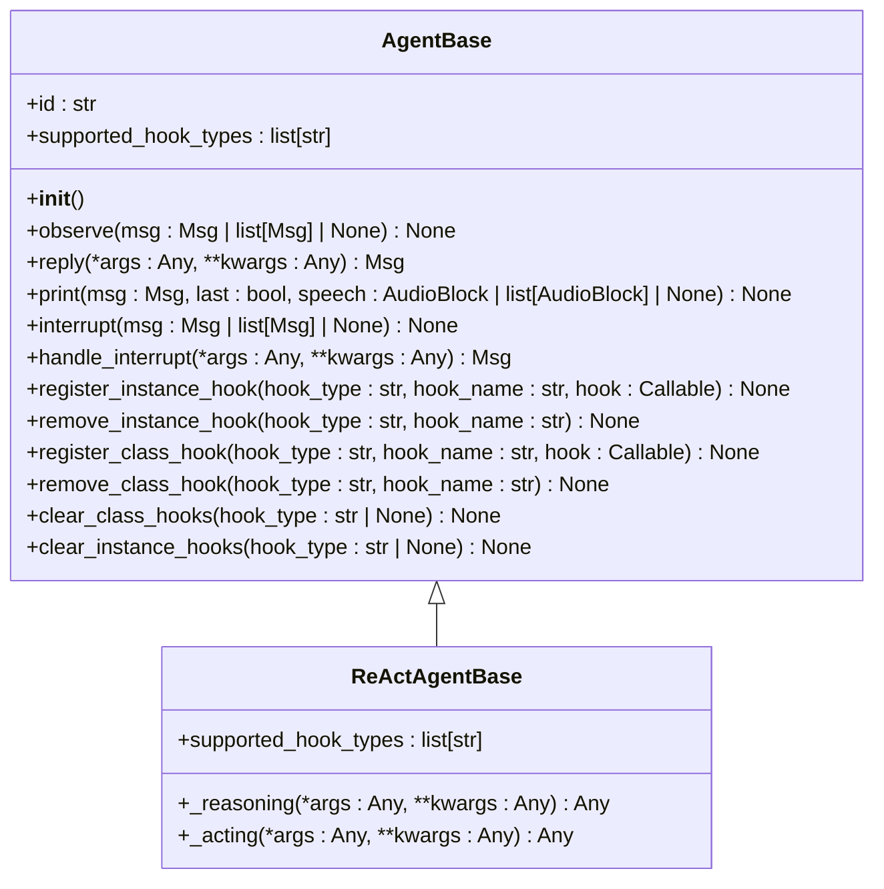
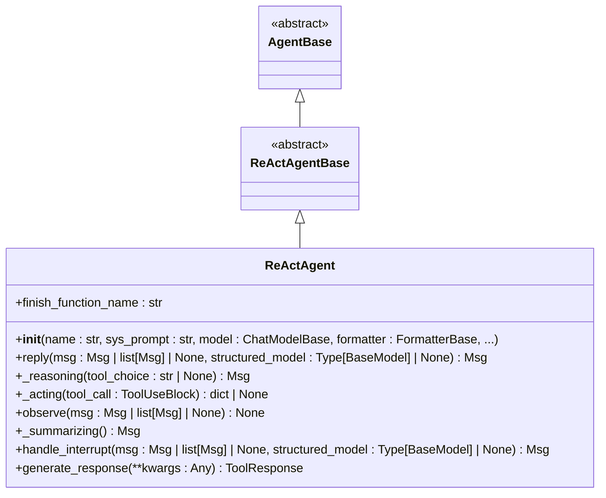
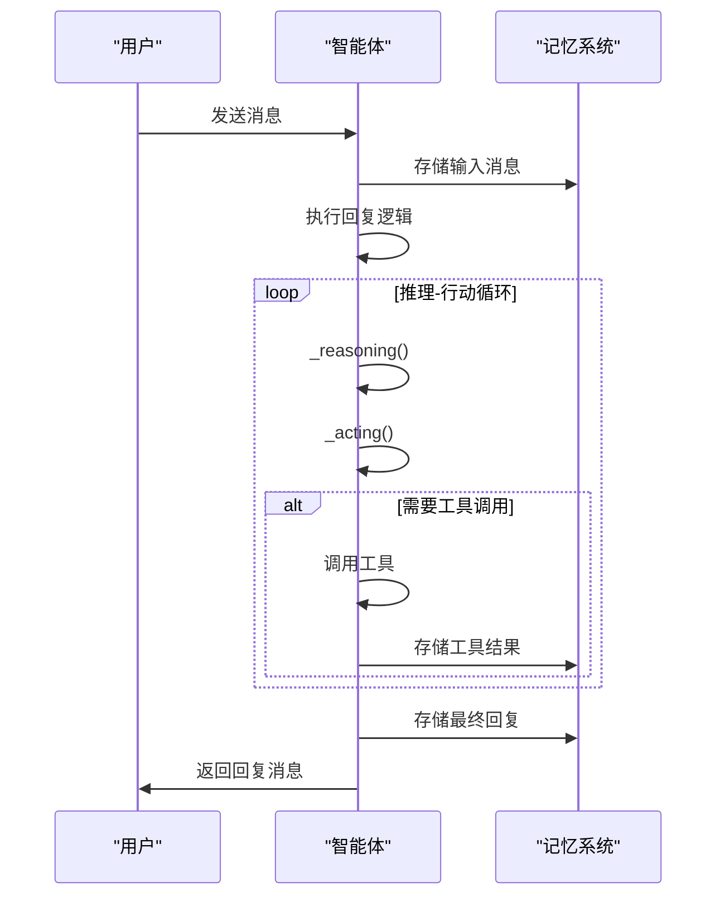
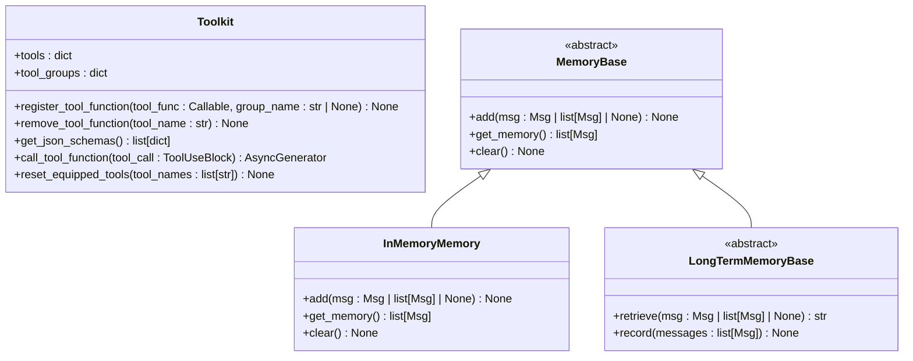
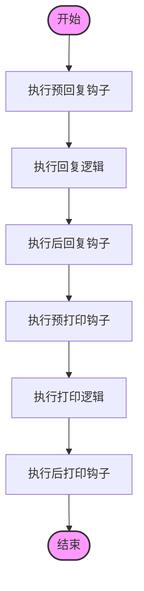
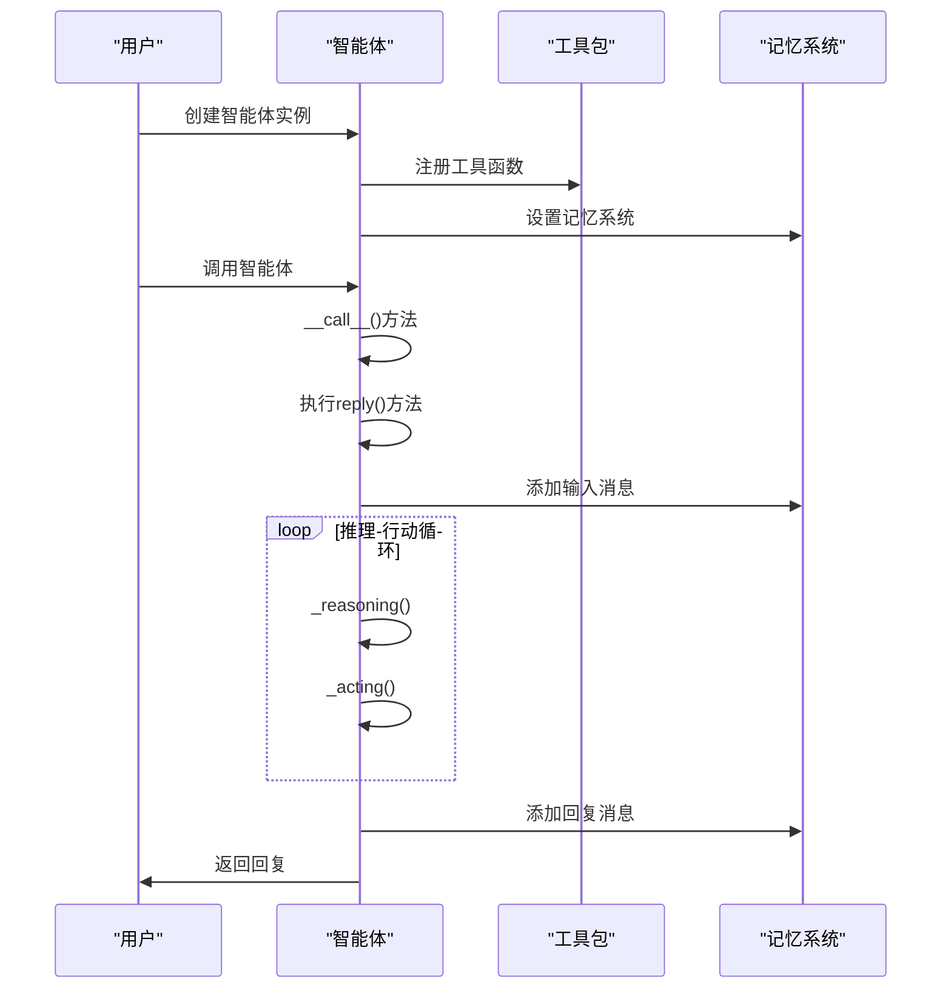
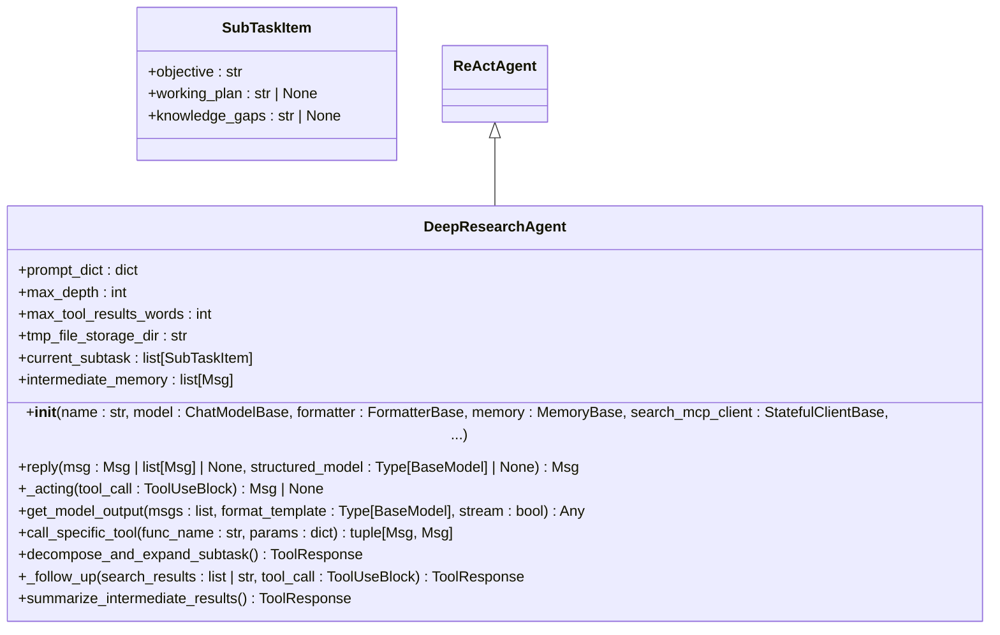
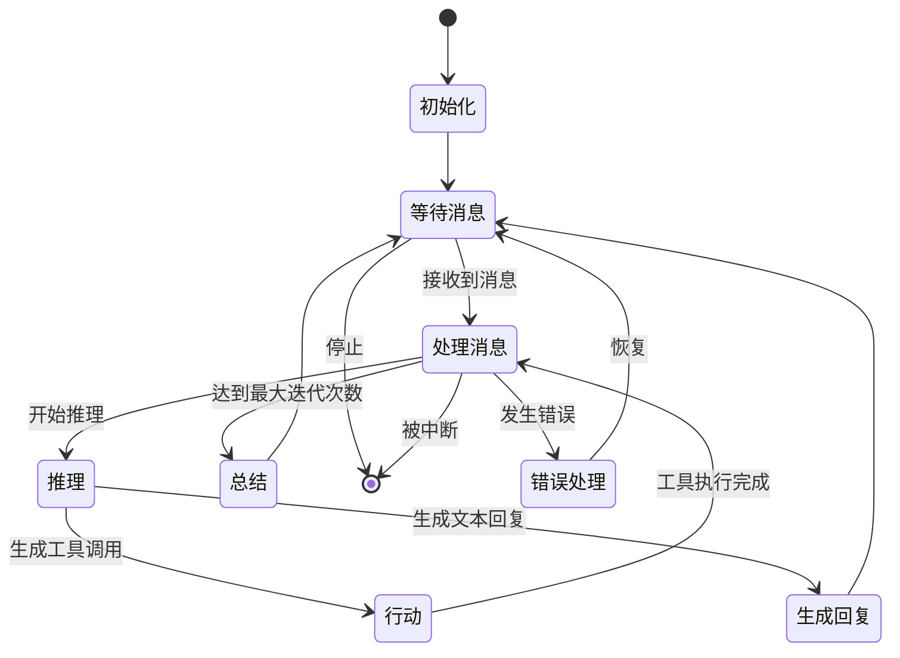

# 自定义智能体创建

<cite>
**本文档中引用的文件**   
- [agent_base.py](file://src/agentscope/agent/_agent_base.py)
- [react_agent_base.py](file://src/agentscope/agent/_react_agent_base.py)
- [react_agent.py](file://src/agentscope/agent/_react_agent.py)
- [deep_research_agent.py](file://examples/agent/deep_research_agent/deep_research_agent.py)
- [main.py](file://examples/agent/deep_research_agent/main.py)
- [toolkit.py](file://src/agentscope/tool/_toolkit.py)
- [memory_base.py](file://src/agentscope/memory/_memory_base.py)
</cite>

## 目录
1. [简介](#简介)
2. [AgentBase基类接口详解](#agentbase基类接口详解)
3. [智能体扩展机制](#智能体扩展机制)
4. [状态管理与生命周期控制](#状态管理与生命周期控制)
5. [工具集成与记忆系统](#工具集成与记忆系统)
6. [消息处理与钩子函数](#消息处理与钩子函数)
7. [智能体注册与调用流程](#智能体注册与调用流程)
8. [深度研究智能体实现案例](#深度研究智能体实现案例)
9. [最佳实践与错误处理](#最佳实践与错误处理)

## 简介
本文档详细介绍了在AgentScope框架中创建自定义智能体的完整指南。文档深入解析了AgentBase基类的接口定义和扩展机制，通过逐步示例展示如何继承AgentBase创建新的智能体类型。同时，文档涵盖了智能体状态管理、生命周期控制、错误处理的最佳实践，以及工具集成、记忆系统连接和消息处理的实现方法。

**Section sources**
- [agent_base.py](file://src/agentscope/agent/_agent_base.py#L1-L733)
- [react_agent_base.py](file://src/agentscope/agent/_react_agent_base.py#L1-L117)

## AgentBase基类接口详解
AgentBase是所有智能体的基类，提供了基本接口和钩子函数。该基类定义了智能体的核心功能，包括回复、观察和打印消息等抽象方法。

**Diagram sources**
- [agent_base.py](file://src/agentscope/agent/_agent_base.py#L30-L733)
- [react_agent_base.py](file://src/agentscope/agent/_react_agent_base.py#L12-L117)

**Section sources**
- [agent_base.py](file://src/agentscope/agent/_agent_base.py#L30-L733)
- [react_agent_base.py](file://src/agentscope/agent/_react_agent_base.py#L12-L117)

## 智能体扩展机制
开发者可以通过继承AgentBase或ReActAgentBase来创建自定义智能体。ReActAgentBase扩展了AgentBase，增加了_reacting和_acting抽象方法，以及它们的前置和后置钩子函数。

**Diagram sources**
- [agent_base.py](file://src/agentscope/agent/_agent_base.py#L30-L733)
- [react_agent_base.py](file://src/agentscope/agent/_react_agent_base.py#L12-L117)
- [react_agent.py](file://src/agentscope/agent/_react_agent.py#L40-L867)

**Section sources**
- [agent_base.py](file://src/agentscope/agent/_agent_base.py#L30-L733)
- [react_agent_base.py](file://src/agentscope/agent/_react_agent_base.py#L12-L117)
- [react_agent.py](file://src/agentscope/agent/_react_agent.py#L40-L867)

## 状态管理与生命周期控制
智能体的状态管理通过StateModule实现，支持自动和嵌套状态管理。每个智能体都有唯一的ID，通过shortuuid生成。智能体的生命周期包括初始化、回复、观察和中断处理等阶段。

**Diagram sources**
- [agent_base.py](file://src/agentscope/agent/_agent_base.py#L140-L733)
- [react_agent.py](file://src/agentscope/agent/_react_agent.py#L253-L408)

**Section sources**
- [agent_base.py](file://src/agentscope/agent/_agent_base.py#L140-L733)
- [react_agent.py](file://src/agentscope/agent/_react_agent.py#L253-L408)

## 工具集成与记忆系统
智能体通过Toolkit集成各种工具，支持API调用、文件操作、网络搜索等功能。记忆系统包括短期记忆和长期记忆，用于存储对话历史和持久化信息。

**Diagram sources**
- [toolkit.py](file://src/agentscope/tool/_toolkit.py#L1-L100)
- [memory_base.py](file://src/agentscope/memory/_memory_base.py#L1-L50)
- [react_agent.py](file://src/agentscope/agent/_react_agent.py#L171-L185)

**Section sources**
- [toolkit.py](file://src/agentscope/tool/_toolkit.py#L1-L100)
- [memory_base.py](file://src/agentscope/memory/_memory_base.py#L1-L50)
- [react_agent.py](file://src/agentscope/agent/_react_agent.py#L171-L185)

## 消息处理与钩子函数
智能体的消息处理机制包括预处理和后处理钩子函数，允许在回复、观察和打印消息前后插入自定义逻辑。钩子函数分为类级别和实例级别，支持灵活的扩展。

**Diagram sources**
- [agent_base.py](file://src/agentscope/agent/_agent_base.py#L46-L138)
- [agent_meta.py](file://src/agentscope/agent/_agent_meta.py#L147-L181)

**Section sources**
- [agent_base.py](file://src/agentscope/agent/_agent_base.py#L46-L138)
- [agent_meta.py](file://src/agentscope/agent/_agent_meta.py#L147-L181)

## 智能体注册与调用流程
智能体的注册和调用流程包括创建智能体实例、注册工具、设置记忆系统和调用回复方法。通过__call__方法，智能体可以像函数一样被调用。

**Diagram sources**
- [agent_base.py](file://src/agentscope/agent/_agent_base.py#L444-L463)
- [react_agent.py](file://src/agentscope/agent/_react_agent.py#L253-L408)

**Section sources**
- [agent_base.py](file://src/agentscope/agent/_agent_base.py#L444-L463)
- [react_agent.py](file://src/agentscope/agent/_react_agent.py#L253-L408)

## 深度研究智能体实现案例
深度研究智能体是一个复杂的自定义智能体示例，展示了如何实现高级研究任务。该智能体通过分解子任务、扩展查询和深度搜索来完成复杂的研究任务。

**Diagram sources**
- [deep_research_agent.py](file://examples/agent/deep_research_agent/deep_research_agent.py#L65-L800)
- [main.py](file://examples/agent/deep_research_agent/main.py#L16-L84)

**Section sources**
- [deep_research_agent.py](file://examples/agent/deep_research_agent/deep_research_agent.py#L65-L800)
- [main.py](file://examples/agent/deep_research_agent/main.py#L16-L84)

## 最佳实践与错误处理
在创建自定义智能体时，应遵循最佳实践，包括合理使用钩子函数、正确管理状态和实现健壮的错误处理机制。智能体应能够处理中断、超时和工具调用失败等异常情况。

**Diagram sources**
- [agent_base.py](file://src/agentscope/agent/_agent_base.py#L474-L484)
- [react_agent.py](file://src/agentscope/agent/_react_agent.py#L658-L687)

**Section sources**
- [agent_base.py](file://src/agentscope/agent/_agent_base.py#L474-L484)
- [react_agent.py](file://src/agentscope/agent/_react_agent.py#L658-L687)